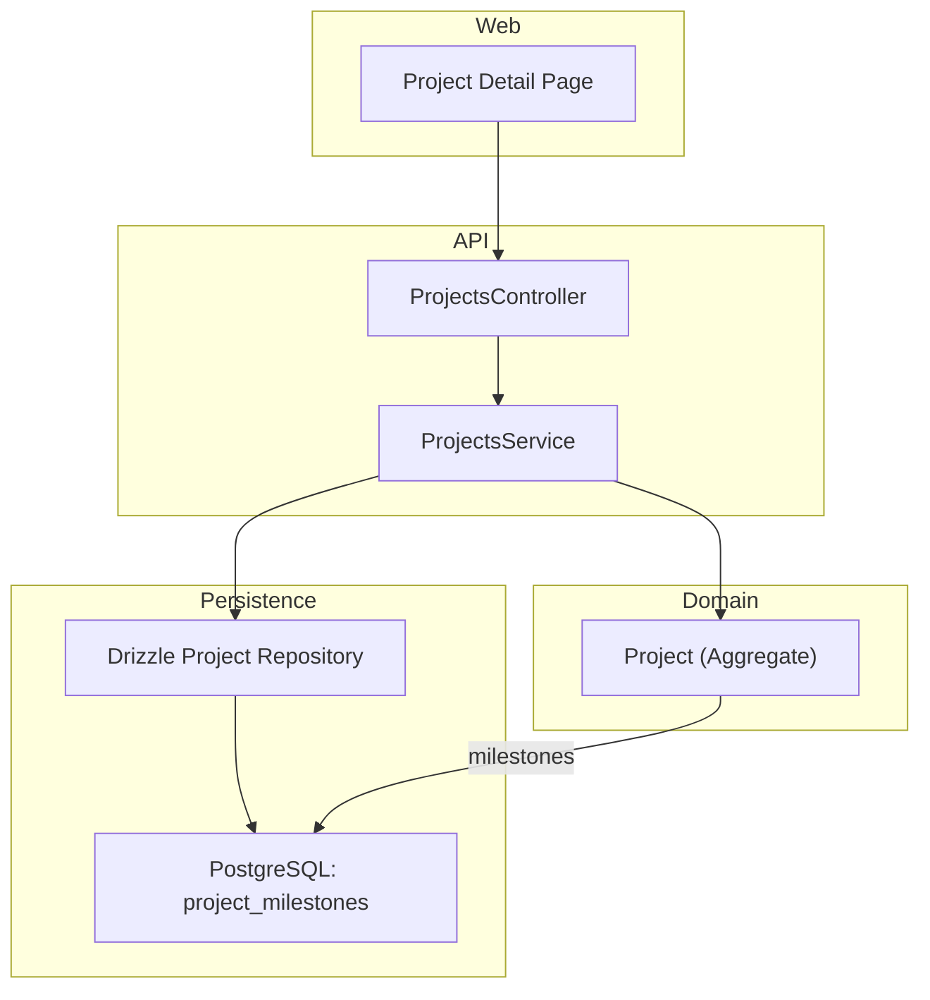
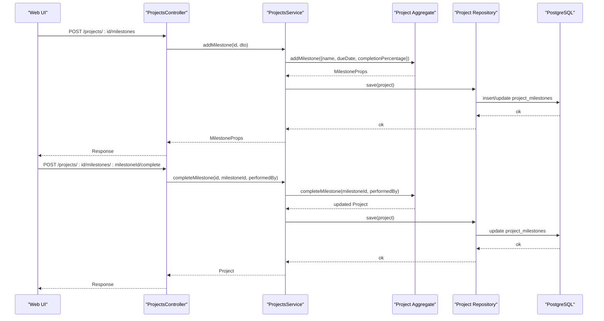
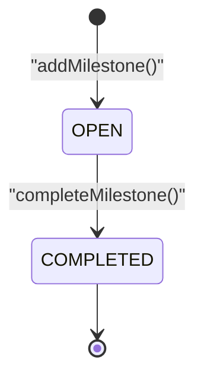
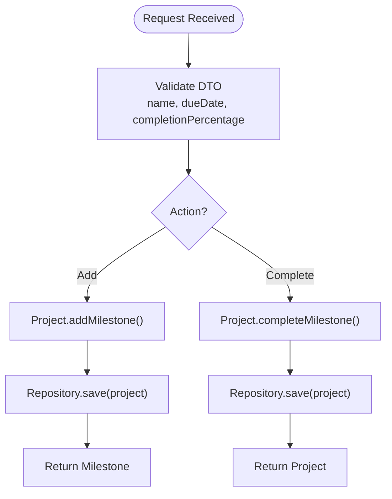
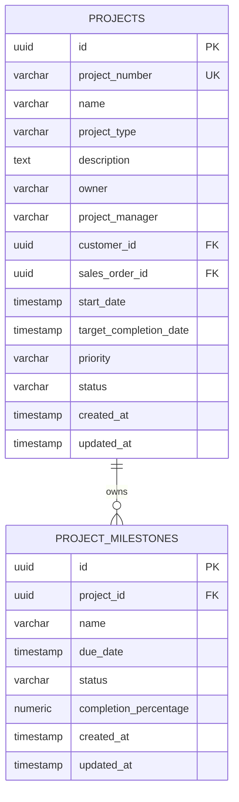
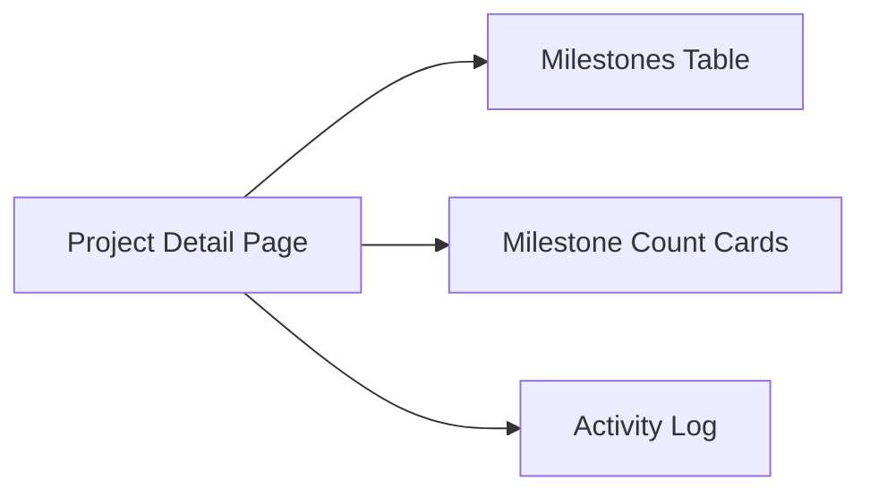
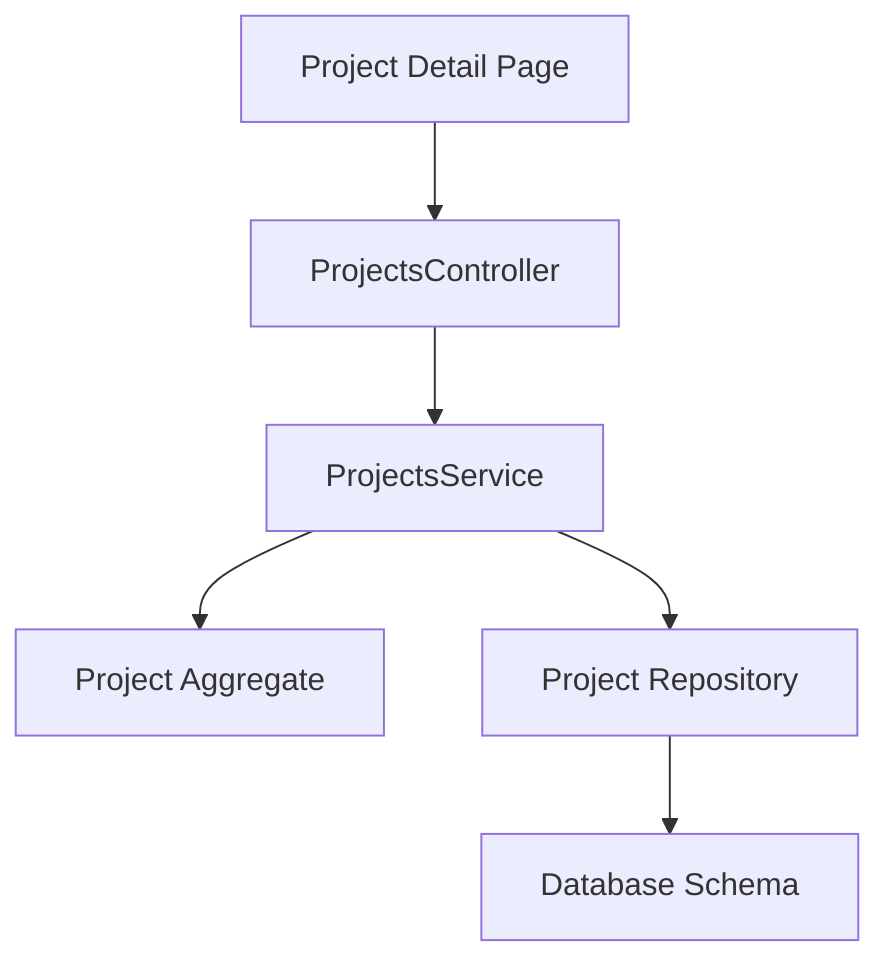

# Milestone Management

<cite>
**Referenced Files in This Document**
- [0042-milestones-and-deliverables.md](file://docs/rfcs/0042-milestones-and-deliverables.md)
- [project.ts](file://packages/projects/src/projects/project.ts)
- [projects.controller.ts](file://apps/api/src/projects/projects.controller.ts)
- [projects.service.ts](file://apps/api/src/projects/projects.service.ts)
- [dtos.ts](file://apps/api/src/projects/dtos.ts)
- [drizzle-project.repository.ts](file://apps/api/src/infrastructure/repositories/drizzle-project.repository.ts)
- [projects.ts](file://packages/database/src/schema/projects.ts)
- [page.tsx](file://apps/web/app/projects/[id]/page.tsx)
</cite>

## Table of Contents
1. Introduction
2. Project Structure
3. Core Components
4. Architecture Overview
5. Detailed Component Analysis
6. Dependency Analysis
7. Performance Considerations
8. Troubleshooting Guide
9. Conclusion
10. Appendices

## Introduction
This document explains milestone management within Ananya ERP’s project system. It covers how milestones are created, tracked, and completed; the data model for milestones (name, due date, status, completion percentage); lifecycle transitions; automated activity logging; deadline visibility; and integration with project timelines and reporting. It also provides practical workflows for setting up milestones, tracking progress, and generating stakeholder reports.

## Project Structure
Milestone functionality spans domain logic, API endpoints, persistence, and UI:
- Domain model defines milestones as part of the Project aggregate.
- API exposes endpoints to add and complete milestones.
- Repository persists milestones to a dedicated table.
- Web UI displays milestones on the project detail page.

**Diagram sources**
- [projects.controller.ts:88-104](file://apps/api/src/projects/projects.controller.ts#L88-L104)
- [projects.service.ts:160-183](file://apps/api/src/projects/projects.service.ts#L160-L183)
- [project.ts:485-524](file://packages/projects/src/projects/project.ts#L485-L524)
- [drizzle-project.repository.ts:240-262](file://apps/api/src/infrastructure/repositories/drizzle-project.repository.ts#L240-L262)
- [projects.ts:123-150](file://packages/database/src/schema/projects.ts#L123-L150)
- [page.tsx:1595-1654](file://apps/web/app/projects/[id]/page.tsx#L1595-L1654)

**Section sources**
- [projects.controller.ts:88-104](file://apps/api/src/projects/projects.controller.ts#L88-L104)
- [projects.service.ts:160-183](file://apps/api/src/projects/projects.service.ts#L160-L183)
- [project.ts:485-524](file://packages/projects/src/projects/project.ts#L485-L524)
- [drizzle-project.repository.ts:240-262](file://apps/api/src/infrastructure/repositories/drizzle-project.repository.ts#L240-L262)
- [projects.ts:123-150](file://packages/database/src/schema/projects.ts#L123-L150)
- [page.tsx:1595-1654](file://apps/web/app/projects/[id]/page.tsx#L1595-L1654)

## Core Components
- Domain Model: The Project aggregate owns Milestone entities with fields for name, due date, status, and completion percentage. It enforces invariants and logs activities when milestones change state.
- API Layer: Controllers expose endpoints to add milestones and mark them complete. Services orchestrate validation and persistence.
- Persistence: A dedicated table stores milestones with indexes for efficient querying by project and status.
- UI: The project detail page lists milestones with name, due date, status, and completion percentage, and shows counts of completed milestones.

Key responsibilities:
- Create milestones with required name and due date.
- Complete milestones, which sets status to COMPLETED and completion percentage to 100%.
- Persist changes and record an activity entry when applicable.
- Display milestone status and progress in the UI.

**Section sources**
- [project.ts:54-63](file://packages/projects/src/projects/project.ts#L54-L63)
- [project.ts:485-524](file://packages/projects/src/projects/project.ts#L485-L524)
- [projects.controller.ts:88-104](file://apps/api/src/projects/projects.controller.ts#L88-L104)
- [projects.service.ts:160-183](file://apps/api/src/projects/projects.service.ts#L160-L183)
- [projects.ts:123-150](file://packages/database/src/schema/projects.ts#L123-L150)
- [page.tsx:1595-1654](file://apps/web/app/projects/[id]/page.tsx#L1595-L1654)

## Architecture Overview
The milestone workflow follows a layered architecture:
- Client calls the API to create or complete milestones.
- Service validates inputs and delegates to the domain Project aggregate.
- Domain updates milestone state and records activity.
- Repository persists milestones to the database.
- UI reads project data including milestones and renders status and progress.

**Diagram sources**
- [projects.controller.ts:88-104](file://apps/api/src/projects/projects.controller.ts#L88-L104)
- [projects.service.ts:160-183](file://apps/api/src/projects/projects.service.ts#L160-L183)
- [project.ts:485-524](file://packages/projects/src/projects/project.ts#L485-L524)
- [drizzle-project.repository.ts:240-262](file://apps/api/src/infrastructure/repositories/drizzle-project.repository.ts#L240-L262)

## Detailed Component Analysis

### Data Model and Lifecycle
- Milestone entity fields include id, projectId, name, dueDate, status, completionPercentage, createdAt, updatedAt.
- Status values: OPEN and COMPLETED.
- Completion percentage is stored as a numeric value and set to 100 upon completion.
- Lifecycle:
  - Creation: addMilestone creates a milestone with OPEN status and default or provided completion percentage.
  - Completion: completeMilestone sets status to COMPLETED and completionPercentage to 100, updating timestamps and optionally logging an activity.

**Diagram sources**
- [project.ts:485-524](file://packages/projects/src/projects/project.ts#L485-L524)
- [projects.ts:123-150](file://packages/database/src/schema/projects.ts#L123-L150)

**Section sources**
- [project.ts:54-63](file://packages/projects/src/projects/project.ts#L54-L63)
- [project.ts:485-524](file://packages/projects/src/projects/project.ts#L485-L524)
- [projects.ts:123-150](file://packages/database/src/schema/projects.ts#L123-L150)

### API Endpoints for Milestones
- Add milestone: POST /projects/:id/milestones
  - Input DTO includes name, dueDate, optional completionPercentage.
  - Service validates and delegates to domain to add milestone, then persists.
- Complete milestone: POST /projects/:id/milestones/:milestoneId/complete
  - Optional performedBy recorded in activity log.
  - Service delegates to domain to complete milestone, then persists.

**Diagram sources**
- [projects.controller.ts:88-104](file://apps/api/src/projects/projects.controller.ts#L88-L104)
- [projects.service.ts:160-183](file://apps/api/src/projects/projects.service.ts#L160-L183)
- [dtos.ts:170-182](file://apps/api/src/projects/dtos.ts#L170-L182)
- [project.ts:485-524](file://packages/projects/src/projects/project.ts#L485-L524)

**Section sources**
- [projects.controller.ts:88-104](file://apps/api/src/projects/projects.controller.ts#L88-L104)
- [projects.service.ts:160-183](file://apps/api/src/projects/projects.service.ts#L160-L183)
- [dtos.ts:170-182](file://apps/api/src/projects/dtos.ts#L170-L182)

### Persistence and Schema
- Database table project_milestones stores milestone records with fields for id, project_id, name, due_date, status, completion_percentage, created_at, updated_at.
- Indexes exist on project_id and status for efficient queries.
- Repository writes milestones using upsert semantics to ensure consistency during project saves.

**Diagram sources**
- [projects.ts:16-51](file://packages/database/src/schema/projects.ts#L16-L51)
- [projects.ts:123-150](file://packages/database/src/schema/projects.ts#L123-L150)

**Section sources**
- [projects.ts:123-150](file://packages/database/src/schema/projects.ts#L123-L150)
- [drizzle-project.repository.ts:240-262](file://apps/api/src/infrastructure/repositories/drizzle-project.repository.ts#L240-L262)

### User Interface and Reporting
- The project detail page displays milestones in a table showing index, name, due date, status badge, and completion percentage.
- Summary cards show total milestones and count of completed milestones.
- Activity log captures milestone-related actions when performedBy is provided.

**Diagram sources**
- [page.tsx:1273-1298](file://apps/web/app/projects/[id]/page.tsx#L1273-L1298)
- [page.tsx:1595-1654](file://apps/web/app/projects/[id]/page.tsx#L1595-L1654)
- [page.tsx:1656-1694](file://apps/web/app/projects/[id]/page.tsx#L1656-L1694)

**Section sources**
- [page.tsx:1273-1298](file://apps/web/app/projects/[id]/page.tsx#L1273-L1298)
- [page.tsx:1595-1654](file://apps/web/app/projects/[id]/page.tsx#L1595-L1654)
- [page.tsx:1656-1694](file://apps/web/app/projects/[id]/page.tsx#L1656-L1694)

## Dependency Analysis
- Controller depends on service for business orchestration.
- Service depends on domain aggregate for state transitions and activity logging.
- Repository depends on schema definitions for persistence.
- UI depends on project data including milestones for display.

**Diagram sources**
- [projects.controller.ts:88-104](file://apps/api/src/projects/projects.controller.ts#L88-L104)
- [projects.service.ts:160-183](file://apps/api/src/projects/projects.service.ts#L160-L183)
- [project.ts:485-524](file://packages/projects/src/projects/project.ts#L485-L524)
- [projects.ts:123-150](file://packages/database/src/schema/projects.ts#L123-L150)
- [page.tsx:1595-1654](file://apps/web/app/projects/[id]/page.tsx#L1595-L1654)

**Section sources**
- [projects.controller.ts:88-104](file://apps/api/src/projects/projects.controller.ts#L88-L104)
- [projects.service.ts:160-183](file://apps/api/src/projects/projects.service.ts#L160-L183)
- [project.ts:485-524](file://packages/projects/src/projects/project.ts#L485-L524)
- [projects.ts:123-150](file://packages/database/src/schema/projects.ts#L123-L150)
- [page.tsx:1595-1654](file://apps/web/app/projects/[id]/page.tsx#L1595-L1654)

## Performance Considerations
- Use indexes on project_milestones.project_id and project_milestones.status to optimize listing and filtering by project or status.
- Batch updates via repository upserts reduce round-trips when saving projects with multiple milestones.
- Avoid unnecessary recalculations; completion percentage is explicitly set by operations rather than computed on read.

[No sources needed since this section provides general guidance]

## Troubleshooting Guide
Common issues and resolutions:
- Missing milestone: If completing a milestone fails because it is not found, verify the milestoneId belongs to the specified project.
- Invalid dates: Ensure dueDate is a valid date string; validation occurs at the DTO layer.
- Status transitions: Only OPEN milestones can be completed; attempting to complete an already completed milestone will have no effect beyond updating timestamps.
- Activity logging: When performingBy is omitted, milestone completion still succeeds but no activity entry is created; include performedBy to maintain audit trails.

**Section sources**
- [project.ts:506-524](file://packages/projects/src/projects/project.ts#L506-L524)
- [dtos.ts:170-182](file://apps/api/src/projects/dtos.ts#L170-L182)

## Conclusion
Ananya ERP’s milestone management integrates tightly with the Project aggregate, providing clear creation, completion, and tracking capabilities. Milestones capture essential delivery checkpoints with names, due dates, statuses, and completion percentages. The API exposes straightforward endpoints, the domain enforces invariants and logs activities, and the UI presents actionable insights for stakeholders. Future enhancements may include automated dependencies and critical path calculations to further enrich milestone-driven project planning.

[No sources needed since this section summarizes without analyzing specific files]

## Appendices

### Practical Workflows

- Setting up project milestones:
  - Create a project and navigate to its detail page.
  - Add milestones with names and due dates; optionally set initial completion percentage.
  - Review the milestones table to confirm entries and deadlines.

- Tracking progress:
  - As work completes, call the complete endpoint for each milestone to mark it done.
  - Observe status badges and completion percentage updates in the UI.
  - Check the activity log for audit entries when performedBy is provided.

- Generating milestone-based reports:
  - Use the project detail page to view milestone counts and completion status.
  - For broader analytics, leverage project reports that summarize active vs completed initiatives and material balances.

**Section sources**
- [page.tsx:1273-1298](file://apps/web/app/projects/[id]/page.tsx#L1273-L1298)
- [page.tsx:1595-1654](file://apps/web/app/projects/[id]/page.tsx#L1595-L1654)
- [page.tsx:1656-1694](file://apps/web/app/projects/[id]/page.tsx#L1656-L1694)

### RFC Alignment
- The design aligns with RFC-0042, which defines milestones as key deliverables or checkpoints within projects, outlines their lifecycle, and specifies API endpoints for adding and completing milestones.

**Section sources**
- [0042-milestones-and-deliverables.md:7-98](file://docs/rfcs/0042-milestones-and-deliverables.md#L7-L98)