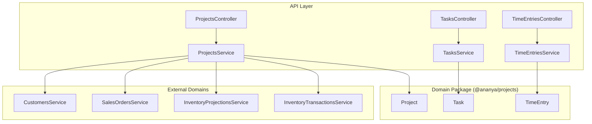
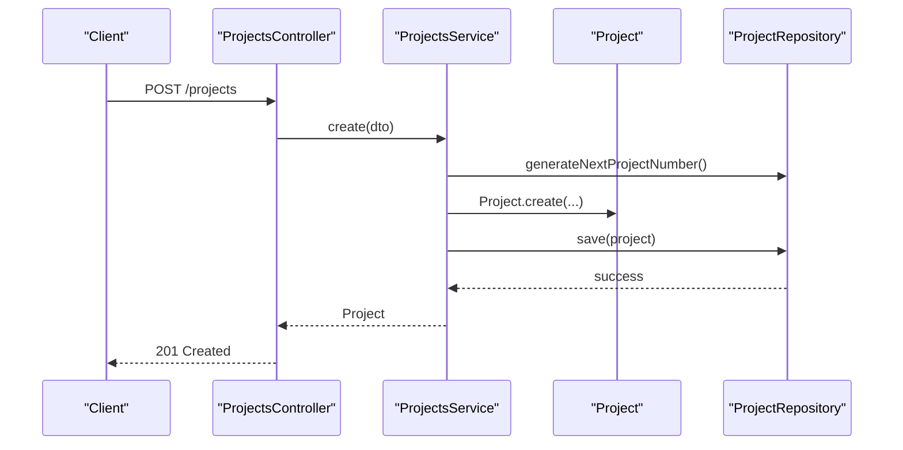
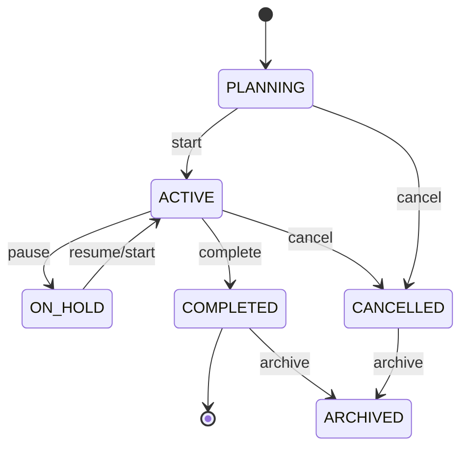
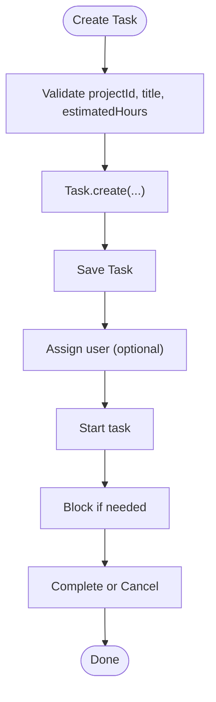
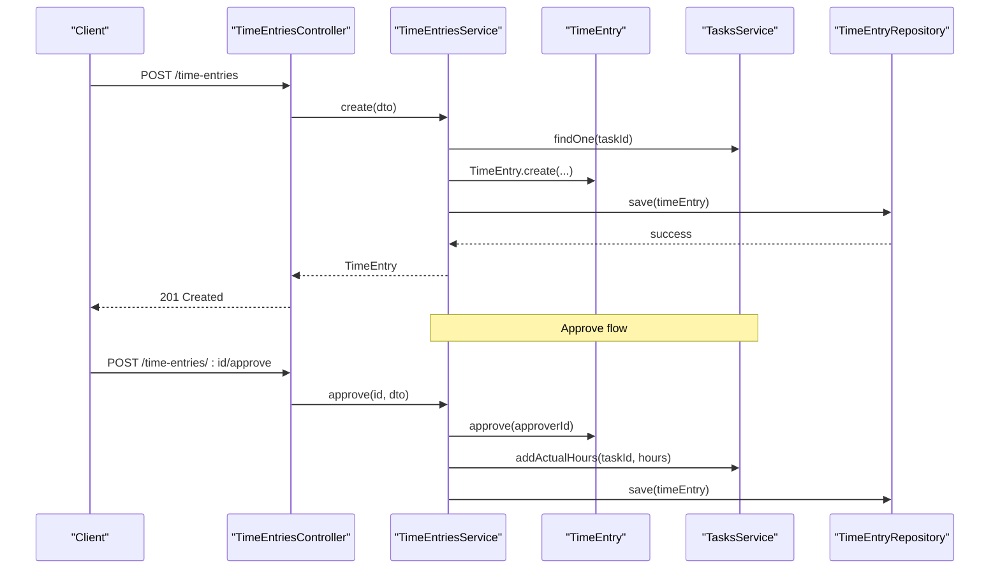
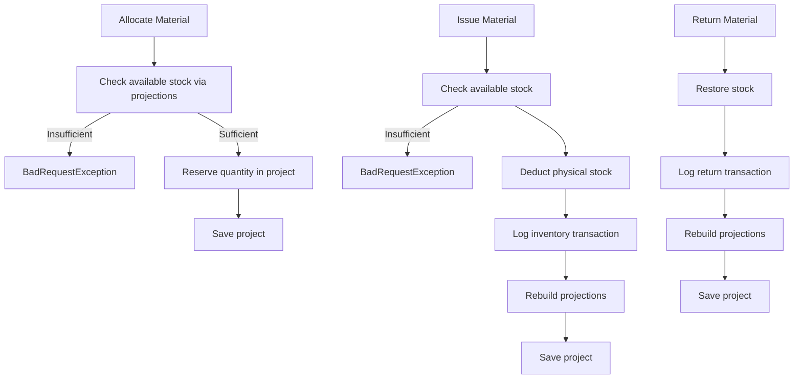
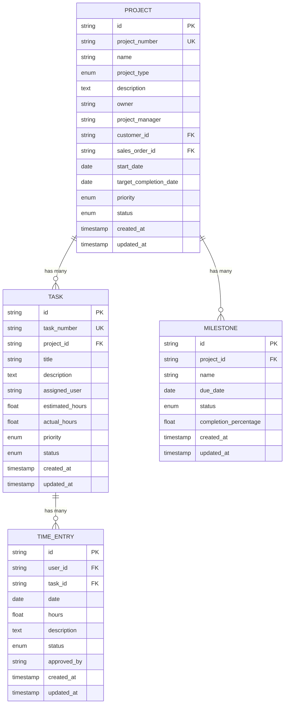
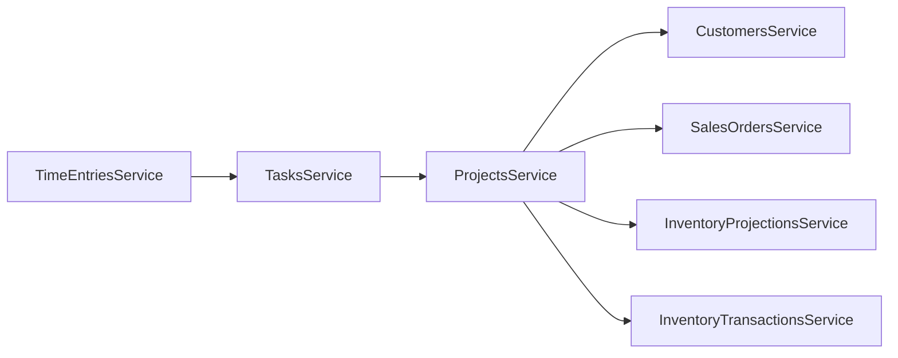

# Project Management

<cite>
**Referenced Files in This Document**
- [0041-project-management.md](file://docs/rfcs/0041-project-management.md)
- [projects.controller.ts](file://apps/api/src/projects/projects.controller.ts)
- [projects.service.ts](file://apps/api/src/projects/projects.service.ts)
- [dtos.ts (projects)](file://apps/api/src/projects/dtos.ts)
- [project.ts](file://packages/projects/src/projects/project.ts)
- [tasks.controller.ts](file://apps/api/src/tasks/tasks.controller.ts)
- [tasks.service.ts](file://apps/api/src/tasks/tasks.service.ts)
- [dtos.ts (tasks)](file://apps/api/src/tasks/dtos.ts)
- [task.ts](file://packages/projects/src/tasks/task.ts)
- [time-entries.controller.ts](file://apps/api/src/time-entries/time-entries.controller.ts)
- [time-entries.service.ts](file://apps/api/src/time-entries/time-entries.service.ts)
- [dtos.ts (time-entries)](file://apps/api/src/time-entries/dtos.ts)
- [time-entry.ts](file://packages/projects/src/time/time-entry.ts)
- [index.ts (projects package)](file://packages/projects/src/index.ts)
</cite>

## Table of Contents
1. [Introduction](#introduction)
2. [Project Structure](#project-structure)
3. [Core Components](#core-components)
4. [Architecture Overview](#architecture-overview)
5. [Detailed Component Analysis](#detailed-component-analysis)
6. [Dependency Analysis](#dependency-analysis)
7. [Performance Considerations](#performance-considerations)
8. [Troubleshooting Guide](#troubleshooting-guide)
9. [Conclusion](#conclusion)
10. [Appendices](#appendices)

## Introduction
This document explains Ananya ERP’s Project Management domain, covering project creation and planning, task management, time tracking, milestone management, and integration with inventory for material allocation and cost tracking. It documents the data model (projects, tasks, time entries, milestones), key workflows from initiation through closure, practical examples, and the package structure and boundaries that isolate domain logic from API concerns.

## Project Structure
The Project Management domain is implemented across:
- Domain models in the projects package
- API controllers and services under apps/api
- DTOs for request validation
- Cross-domain integrations with sales, customers, and inventory

**Diagram sources**
- [projects.controller.ts:24-119](file://apps/api/src/projects/projects.controller.ts#L24-L119)
- [projects.service.ts:30-280](file://apps/api/src/projects/projects.service.ts#L30-L280)
- [tasks.controller.ts:6-60](file://apps/api/src/tasks/tasks.controller.ts#L6-L60)
- [tasks.service.ts:18-113](file://apps/api/src/tasks/tasks.service.ts#L18-L113)
- [time-entries.controller.ts:6-45](file://apps/api/src/time-entries/time-entries.controller.ts#L6-L45)
- [time-entries.service.ts:17-82](file://apps/api/src/time-entries/time-entries.service.ts#L17-L82)
- [project.ts:115-542](file://packages/projects/src/projects/project.ts#L115-L542)
- [task.ts:41-173](file://packages/projects/src/tasks/task.ts#L41-L173)
- [time-entry.ts:26-98](file://packages/projects/src/time/time-entry.ts#L26-L98)

**Section sources**
- [index.ts (projects package):1-4](file://packages/projects/src/index.ts#L1-L4)
- [0041-project-management.md:15-87](file://docs/rfcs/0041-project-management.md#L15-L87)

## Core Components
- Project aggregate: lifecycle, metadata, milestones, materials, and activity log
- Task entity: assignment, status transitions, estimated vs actual hours
- Time entry entity: submission, approval/rejection, and linkage to tasks
- API layer: REST endpoints for CRUD and workflow actions
- DTOs: input validation and type safety

Key responsibilities:
- ProjectsService orchestrates project operations and integrates with external domains
- TasksService enforces task state rules and links to projects
- TimeEntriesService manages time entry lifecycle and updates task actual hours on approval

**Section sources**
- [projects.service.ts:40-280](file://apps/api/src/projects/projects.service.ts#L40-L280)
- [tasks.service.ts:26-113](file://apps/api/src/tasks/tasks.service.ts#L26-L113)
- [time-entries.service.ts:25-82](file://apps/api/src/time-entries/time-entries.service.ts#L25-L82)
- [project.ts:156-542](file://packages/projects/src/projects/project.ts#L156-L542)
- [task.ts:72-173](file://packages/projects/src/tasks/task.ts#L72-L173)
- [time-entry.ts:51-98](file://packages/projects/src/time/time-entry.ts#L51-L98)

## Architecture Overview
The system follows a layered architecture:
- Controllers expose REST endpoints
- Services implement application use cases and enforce cross-domain constraints
- Domain classes encapsulate business rules and state machines
- Repositories are injected via DI tokens and abstract persistence

**Diagram sources**
- [projects.controller.ts:29-32](file://apps/api/src/projects/projects.controller.ts#L29-L32)
- [projects.service.ts:40-66](file://apps/api/src/projects/projects.service.ts#L40-L66)
- [project.ts:156-194](file://packages/projects/src/projects/project.ts#L156-L194)

## Detailed Component Analysis

### Project Lifecycle and Milestones
- Statuses: PLANNING, ACTIVE, ON_HOLD, COMPLETED, ARCHIVED, CANCELLED
- Valid transitions enforced by domain methods
- Milestones can be added and completed; completion sets percentage to 100%
- Activity log records all significant changes

**Diagram sources**
- [project.ts:241-322](file://packages/projects/src/projects/project.ts#L241-L322)
- [project.ts:295-305](file://packages/projects/src/projects/project.ts#L295-L305)

Practical example: creating a project
- Call POST /projects with CreateProjectDto fields such as name, projectManager, startDate, targetCompletionDate, priority, optional customerId/salesOrderId
- Service validates references to Customers and Sales Orders, generates project number, creates Project, logs CREATED activity, and persists

**Section sources**
- [projects.controller.ts:29-32](file://apps/api/src/projects/projects.controller.ts#L29-L32)
- [projects.service.ts:40-66](file://apps/api/src/projects/projects.service.ts#L40-L66)
- [dtos.ts (projects):10-54](file://apps/api/src/projects/dtos.ts#L10-L54)
- [project.ts:156-194](file://packages/projects/src/projects/project.ts#L156-L194)

Practical example: managing milestones
- Add milestone via POST /projects/:id/milestones
- Complete milestone via POST /projects/:id/milestones/:milestoneId/complete

**Section sources**
- [projects.controller.ts:88-104](file://apps/api/src/projects/projects.controller.ts#L88-L104)
- [projects.service.ts:160-183](file://apps/api/src/projects/projects.service.ts#L160-L183)
- [project.ts:485-524](file://packages/projects/src/projects/project.ts#L485-L524)

### Task Management
- Statuses: TODO, IN_PROGRESS, BLOCKED, DONE, CANCELLED
- Assignment history tracked per task
- Estimated vs actual hours support

**Diagram sources**
- [tasks.service.ts:26-46](file://apps/api/src/tasks/tasks.service.ts#L26-L46)
- [task.ts:72-111](file://packages/projects/src/tasks/task.ts#L72-L111)
- [task.ts:117-161](file://packages/projects/src/tasks/task.ts#L117-L161)

Practical example: assigning and progressing a task
- Create task via POST /tasks
- Assign via POST /tasks/:id/assign
- Progress via POST /tasks/:id/start, block via POST /tasks/:id/block, complete via POST /tasks/:id/complete

**Section sources**
- [tasks.controller.ts:10-60](file://apps/api/src/tasks/tasks.controller.ts#L10-L60)
- [tasks.service.ts:26-113](file://apps/api/src/tasks/tasks.service.ts#L26-L113)
- [dtos.ts (tasks):10-40](file://apps/api/src/tasks/dtos.ts#L10-L40)
- [task.ts:117-173](file://packages/projects/src/tasks/task.ts#L117-L173)

### Time Tracking
- Time entries link to tasks and users
- Submission, approval, and rejection states
- Approval increments task actual hours

**Diagram sources**
- [time-entries.controller.ts:10-45](file://apps/api/src/time-entries/time-entries.controller.ts#L10-L45)
- [time-entries.service.ts:25-82](file://apps/api/src/time-entries/time-entries.service.ts#L25-L82)
- [time-entry.ts:51-98](file://packages/projects/src/time/time-entry.ts#L51-L98)
- [tasks.service.ts:107-113](file://apps/api/src/tasks/tasks.service.ts#L107-L113)

Practical example: logging and approving time
- Log time via POST /time-entries with userId, taskId, date, hours, description
- Approve via POST /time-entries/:id/approve with approverId

**Section sources**
- [time-entries.controller.ts:10-45](file://apps/api/src/time-entries/time-entries.controller.ts#L10-L45)
- [time-entries.service.ts:25-82](file://apps/api/src/time-entries/time-entries.service.ts#L25-L82)
- [dtos.ts (time-entries):11-38](file://apps/api/src/time-entries/dtos.ts#L11-L38)
- [time-entry.ts:51-98](file://packages/projects/src/time/time-entry.ts#L51-L98)

### Material Allocation and Cost Tracking Integration
Projects integrate with inventory to allocate, issue, and return materials:
- Allocate reserves stock at a location
- Issue deducts physical stock and logs an inventory transaction
- Return restores stock and logs a return transaction
- Projections are rebuilt after issues/returns

**Diagram sources**
- [projects.service.ts:185-280](file://apps/api/src/projects/projects.service.ts#L185-L280)
- [project.ts:324-483](file://packages/projects/src/projects/project.ts#L324-L483)

Practical example: allocating and issuing materials
- Allocate via POST /projects/:id/materials/allocate
- Issue via POST /projects/:id/materials/issue
- Return via POST /projects/:id/materials/return

**Section sources**
- [projects.controller.ts:106-119](file://apps/api/src/projects/projects.controller.ts#L106-L119)
- [projects.service.ts:185-280](file://apps/api/src/projects/projects.service.ts#L185-L280)
- [dtos.ts (projects):108-168](file://apps/api/src/projects/dtos.ts#L108-L168)
- [project.ts:324-483](file://packages/projects/src/projects/project.ts#L324-L483)

### Data Model Summary
- Project: identifier, project number, name, type, description, owner, project manager, customer reference, sales order reference, dates, priority, status, materials, activities, milestones, timestamps
- Task: identifier, task number, project reference, title, description, assigned user, estimated hours, actual hours, priority, status, assignments, timestamps
- Time Entry: identifier, user reference, task reference, date, hours, description, status, approver, timestamps
- Milestone: identifier, project reference, name, due date, status, completion percentage, timestamps

**Diagram sources**
- [project.ts:65-84](file://packages/projects/src/projects/project.ts#L65-L84)
- [task.ts:15-29](file://packages/projects/src/tasks/task.ts#L15-L29)
- [time-entry.ts:5-16](file://packages/projects/src/time/time-entry.ts#L5-L16)
- [project.ts:54-63](file://packages/projects/src/projects/project.ts#L54-L63)

## Dependency Analysis
- ProjectsService depends on:
  - Customer and Sales Order services for referential integrity
  - Inventory projections for availability checks
  - Inventory transactions for physical stock movements
- TasksService depends on ProjectsService to validate project state before task creation
- TimeEntriesService depends on TasksService to update actual hours upon approval

**Diagram sources**
- [projects.service.ts:30-38](file://apps/api/src/projects/projects.service.ts#L30-L38)
- [tasks.service.ts:18-24](file://apps/api/src/tasks/tasks.service.ts#L18-L24)
- [time-entries.service.ts:17-23](file://apps/api/src/time-entries/time-entries.service.ts#L17-L23)

**Section sources**
- [projects.service.ts:30-38](file://apps/api/src/projects/projects.service.ts#L30-L38)
- [tasks.service.ts:18-24](file://apps/api/src/tasks/tasks.service.ts#L18-L24)
- [time-entries.service.ts:17-23](file://apps/api/src/time-entries/time-entries.service.ts#L17-L23)

## Performance Considerations
- Batch queries: Use repository findMany filters to reduce round-trips when listing projects, tasks, and time entries
- Projection rebuilds: Avoid unnecessary rebuilds; only trigger after stock-affecting operations
- Validation early: Validate DTOs and domain invariants at the boundary to fail fast
- Indexing: Ensure database indexes on foreign keys (project_id, task_id, customer_id, sales_order_id) and common filter fields (status, priority)

[No sources needed since this section provides general guidance]

## Troubleshooting Guide
Common errors and resolutions:
- Cannot edit project in read-only status: Ensure project is not COMPLETED, ARCHIVED, or CANCELLED before updating
- Cannot start/pause/complete/cancel project: Verify current status allows the requested transition
- Cannot add tasks to closed project: Only active or planning projects accept new tasks
- Cannot log time against closed task: Only open or in-progress tasks accept time entries
- Material allocation/issue failures: Check available stock via projections and ensure allocations exist before issuing

**Section sources**
- [project.ts:200-239](file://packages/projects/src/projects/project.ts#L200-L239)
- [project.ts:241-322](file://packages/projects/src/projects/project.ts#L241-L322)
- [tasks.service.ts:26-46](file://apps/api/src/tasks/tasks.service.ts#L26-L46)
- [time-entries.service.ts:25-42](file://apps/api/src/time-entries/time-entries.service.ts#L25-L42)
- [projects.service.ts:185-280](file://apps/api/src/projects/projects.service.ts#L185-L280)

## Conclusion
Ananya ERP’s Project Management domain provides a robust foundation for initiating, planning, executing, monitoring, and closing projects. The domain models enforce clear state machines and invariants, while the API layer offers intuitive endpoints for day-to-day operations. Integrations with sales and inventory enable end-to-end traceability from commercial orders to material usage and cost tracking.

[No sources needed since this section summarizes without analyzing specific files]

## Appendices

### API Reference Highlights
- Projects
  - POST /projects
  - GET /projects
  - GET /projects/:id
  - PUT /projects/:id
  - POST /projects/:id/start|pause|complete|archive|cancel
  - POST /projects/:id/milestones
  - POST /projects/:id/milestones/:milestoneId/complete
  - POST /projects/:id/materials/allocate|issue|return
- Tasks
  - POST /tasks
  - GET /tasks
  - GET /tasks/:id
  - POST /tasks/:id/assign|start|block|complete|cancel
- Time Entries
  - POST /time-entries
  - GET /time-entries
  - GET /time-entries/:id
  - POST /time-entries/:id/approve|reject

**Section sources**
- [projects.controller.ts:29-119](file://apps/api/src/projects/projects.controller.ts#L29-L119)
- [tasks.controller.ts:10-60](file://apps/api/src/tasks/tasks.controller.ts#L10-L60)
- [time-entries.controller.ts:10-45](file://apps/api/src/time-entries/time-entries.controller.ts#L10-L45)

### RFC Alignment
- RFC-0041 defines the Project Management scope, ubiquitous language, aggregate roots, entities, value objects, commands, queries, repository contracts, invariants, state machine, sequence diagram, cross-module integration, database schema, API design, UI workflow, and validation rules.

**Section sources**
- [0041-project-management.md:7-112](file://docs/rfcs/0041-project-management.md#L7-L112)