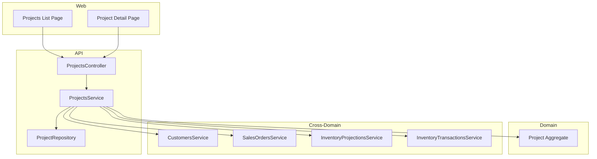
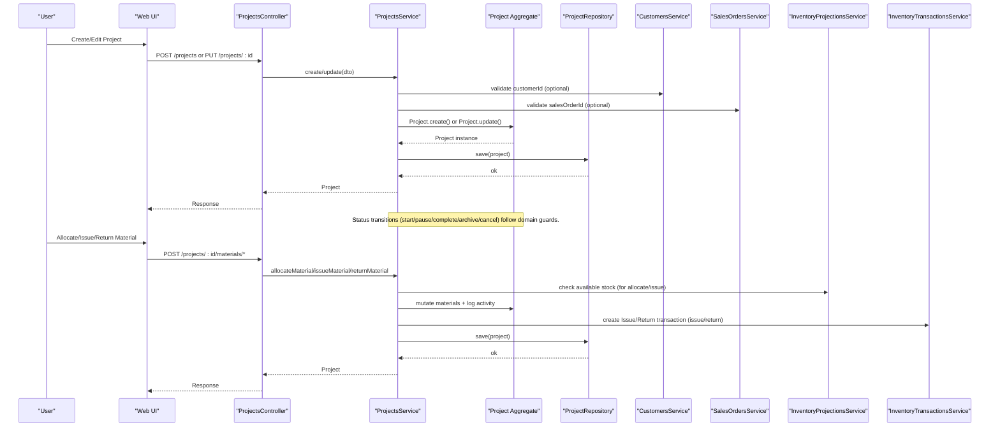
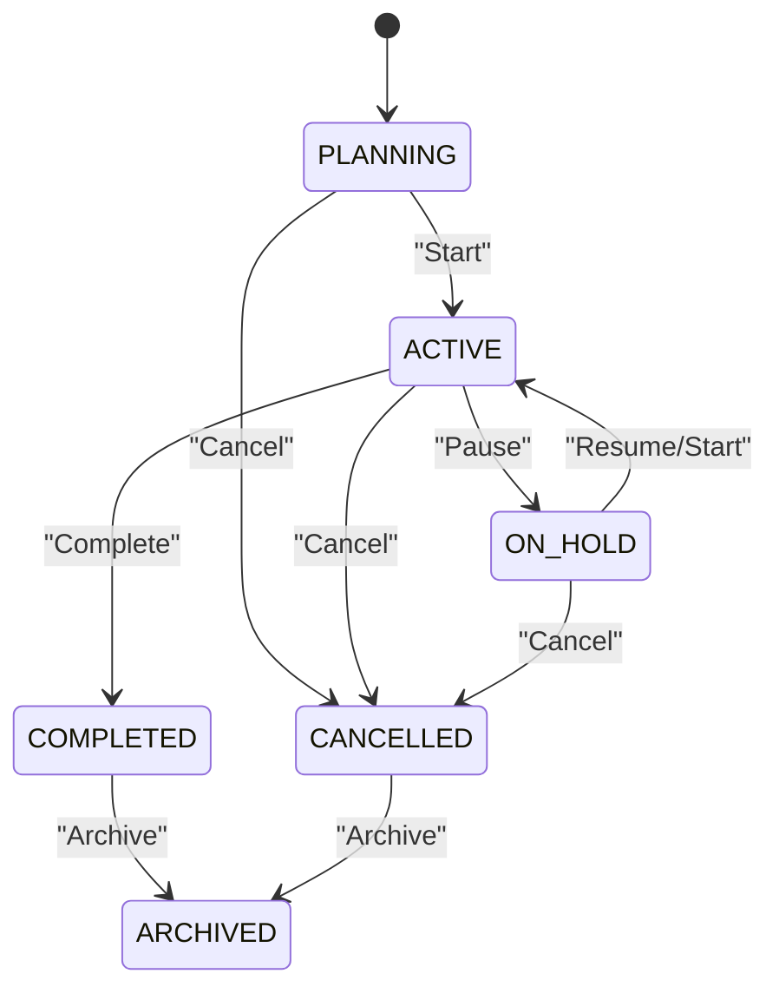
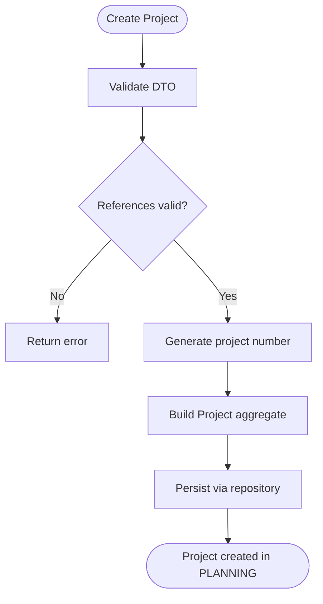
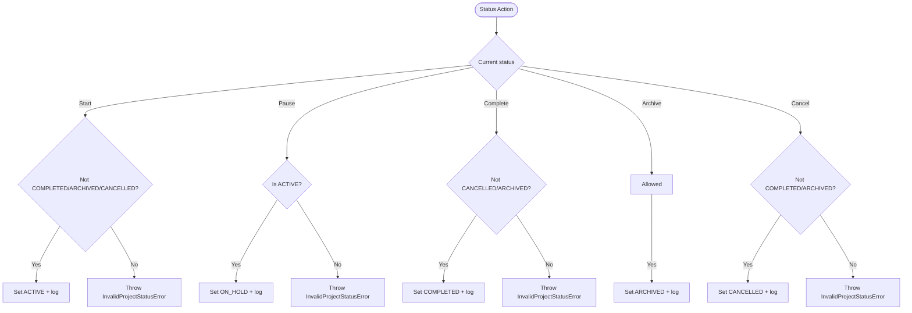
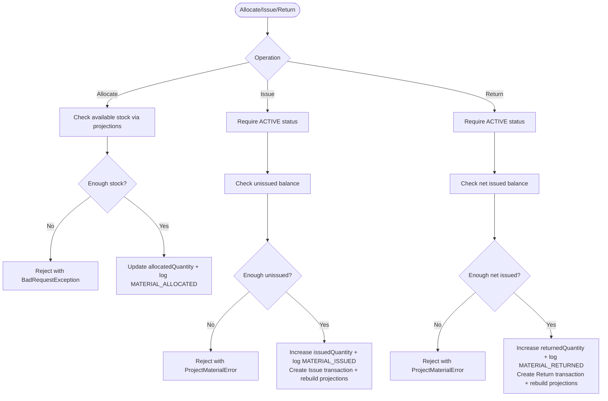
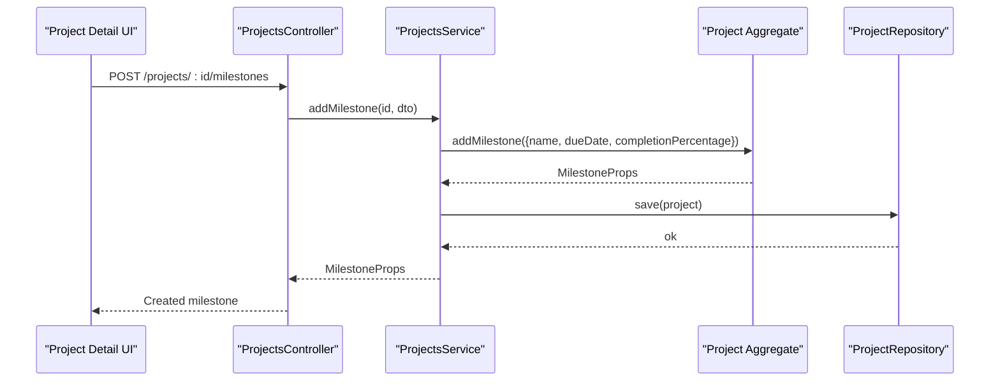
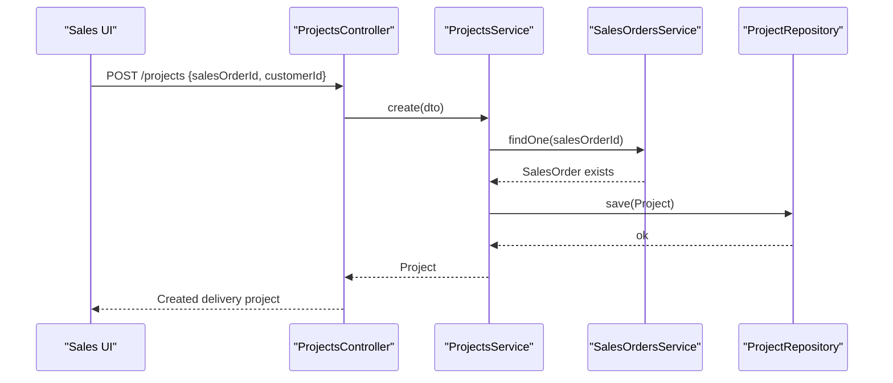
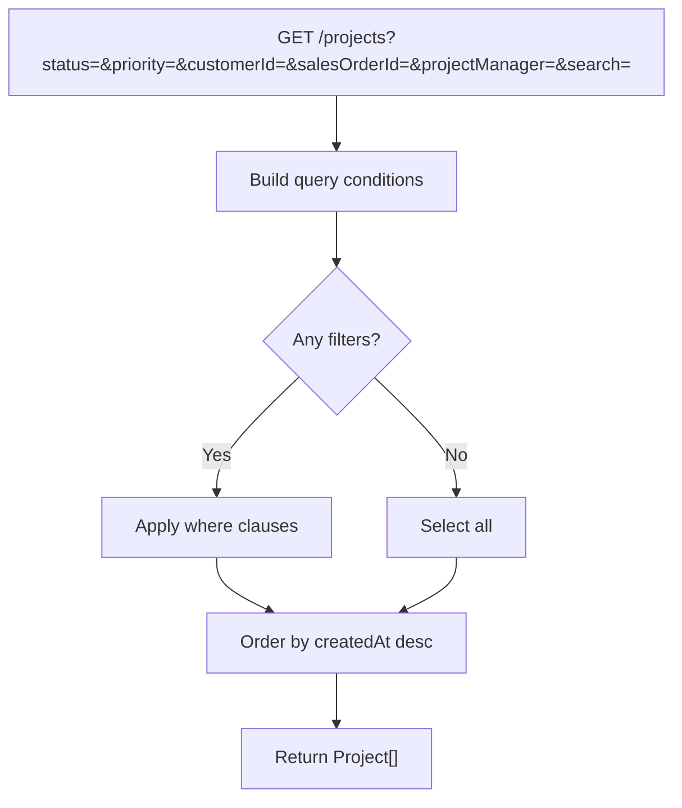
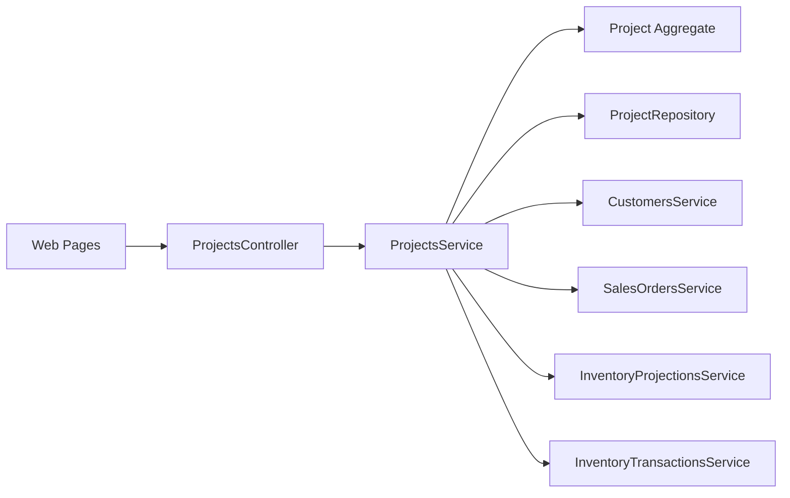

# Project Planning & Creation

<cite>
**Referenced Files in This Document**
- [project.ts](file://packages/projects/src/projects/project.ts)
- [project.repository.ts](file://packages/projects/src/projects/project.repository.ts)
- [project.errors.ts](file://packages/projects/src/projects/project.errors.ts)
- [projects.service.ts](file://apps/api/src/projects/projects.service.ts)
- [projects.controller.ts](file://apps/api/src/projects/projects.controller.ts)
- [dtos.ts](file://apps/api/src/projects/dtos.ts)
- [drizzle-project.repository.ts](file://apps/api/src/infrastructure/repositories/drizzle-project.repository.ts)
- [0041-project-management.md](file://docs/rfcs/0041-project-management.md)
- [0042-milestones-and-deliverables.md](file://docs/rfcs/0042-milestones-and-deliverables.md)
- [0045-project-integration.md](file://docs/rfcs/0045-project-integration.md)
- [page.tsx (Projects list)](file://apps/web/app/projects/page.tsx)
- [page.tsx (Project detail)](file://apps/web/app/projects/[id]/page.tsx)
- [api.ts (Web API client)](file://apps/web/src/lib/api.ts)
</cite>

## Table of Contents
1. Introduction
2. Project Structure
3. Core Components
4. Architecture Overview
5. Detailed Component Analysis
6. Dependency Analysis
7. Performance Considerations
8. Troubleshooting Guide
9. Conclusion
10. Appendices

## Introduction
This document explains project planning and creation in Ananya ERP, covering the full lifecycle from initiation through planning. It details project data model fields, status management, priority levels, resource allocation workflows, integration with CRM and sales domains, and search/filter capabilities for discovering projects.

## Project Structure
The Projects feature spans three layers:
- Domain layer (packages/projects): defines the Project aggregate, value objects, milestones, materials, activities, and repository interface.
- Application/API layer (apps/api): exposes REST endpoints, validates DTOs, orchestrates cross-domain calls (Customers, Sales Orders, Inventory), and persists via repositories.
- Web layer (apps/web): provides UI for listing, creating, editing, transitioning statuses, and allocating materials.

**Diagram sources**
- [projects.controller.ts:24-121](file://apps/api/src/projects/projects.controller.ts#L24-L121)
- [projects.service.ts:30-282](file://apps/api/src/projects/projects.service.ts#L30-L282)
- [project.ts:115-543](file://packages/projects/src/projects/project.ts#L115-L543)
- [project.repository.ts:19-26](file://packages/projects/src/projects/project.repository.ts#L19-L26)

**Section sources**
- [projects.controller.ts:24-121](file://apps/api/src/projects/projects.controller.ts#L24-L121)
- [projects.service.ts:30-282](file://apps/api/src/projects/projects.service.ts#L30-L282)
- [project.ts:115-543](file://packages/projects/src/projects/project.ts#L115-L543)
- [project.repository.ts:19-26](file://packages/projects/src/projects/project.repository.ts#L19-L26)

## Core Components
- Project aggregate: encapsulates project metadata, status transitions, milestones, materials, and activity logging.
- Repository interface: abstracts persistence and filtering/search.
- API controller/service: validates inputs, enforces domain rules, integrates with Customers/Sales/Inventory services, and persists changes.
- Web pages: provide user flows to create, edit, transition states, allocate/issue/return materials, and manage milestones.

Key responsibilities:
- Create: validate references, generate project number, persist initial PLANNING state.
- Update: allow edits only when not completed/archived/cancelled; log updates.
- Status transitions: start/pause/complete/archive/cancel with guard checks.
- Materials: allocate/issue/return with inventory projection checks and transaction logging.
- Milestones: add and complete milestones within a project.

**Section sources**
- [project.ts:115-543](file://packages/projects/src/projects/project.ts#L115-L543)
- [projects.service.ts:40-282](file://apps/api/src/projects/projects.service.ts#L40-L282)
- [projects.controller.ts:29-119](file://apps/api/src/projects/projects.controller.ts#L29-L119)
- [project.repository.ts:19-26](file://packages/projects/src/projects/project.repository.ts#L19-L26)

## Architecture Overview
End-to-end flow for project creation and material operations:

**Diagram sources**
- [projects.controller.ts:29-119](file://apps/api/src/projects/projects.controller.ts#L29-L119)
- [projects.service.ts:40-282](file://apps/api/src/projects/projects.service.ts#L40-L282)
- [project.ts:156-543](file://packages/projects/src/projects/project.ts#L156-L543)
- [drizzle-project.repository.ts:138-180](file://apps/api/src/infrastructure/repositories/drizzle-project.repository.ts#L138-L180)

## Detailed Component Analysis

### Data Model and Lifecycle
- Project fields include name, description, projectType, owner, projectManager, customerId, salesOrderId, startDate, targetCompletionDate, priority, status, materials, milestones, activities, timestamps.
- Status values: PLANNING, ACTIVE, ON_HOLD, COMPLETED, ARCHIVED, CANCELLED.
- Priority values: LOW, MEDIUM, HIGH, URGENT.
- Milestone fields include name, dueDate, status (OPEN/COMPLETED), completionPercentage.
- Material entries track allocatedQuantity, issuedQuantity, returnedQuantity, unitOfMeasure, notes per component/location pair.

Lifecycle highlights:
- Creation sets status to PLANNING by default and logs a CREATED activity.
- Start transitions to ACTIVE; Pause moves to ON_HOLD; Complete sets COMPLETED; Archive sets ARCHIVED; Cancel sets CANCELLED.
- Editing is blocked for COMPLETED/ARCHIVED/CANCELLED.
- Material issue/return require ACTIVE status; allocation allowed in PLANNING/ACTIVE/ON_HOLD.

**Diagram sources**
- [project.ts:241-322](file://packages/projects/src/projects/project.ts#L241-L322)
- [0041-project-management.md:65-73](file://docs/rfcs/0041-project-management.md#L65-L73)

**Section sources**
- [project.ts:7-84](file://packages/projects/src/projects/project.ts#L7-L84)
- [project.ts:115-543](file://packages/projects/src/projects/project.ts#L115-L543)
- [0041-project-management.md:21-87](file://docs/rfcs/0041-project-management.md#L21-L87)
- [0042-milestones-and-deliverables.md:20-78](file://docs/rfcs/0042-milestones-and-deliverables.md#L20-L78)

### Project Creation Workflow
- Input validation via DTOs ensures required fields like name, projectManager, dates, and optional references to customer/sales order.
- Service validates referenced entities before creating the project.
- A unique project number is generated by the repository.
- The project is saved with initial status PLANNING and an activity entry.

**Diagram sources**
- [dtos.ts:10-54](file://apps/api/src/projects/dtos.ts#L10-L54)
- [projects.service.ts:40-66](file://apps/api/src/projects/projects.service.ts#L40-L66)
- [project.ts:156-194](file://packages/projects/src/projects/project.ts#L156-L194)

**Section sources**
- [dtos.ts:10-54](file://apps/api/src/projects/dtos.ts#L10-L54)
- [projects.service.ts:40-66](file://apps/api/src/projects/projects.service.ts#L40-L66)
- [project.ts:156-194](file://packages/projects/src/projects/project.ts#L156-L194)

### Status Transitions and Guards
- Start: allowed unless already COMPLETED/ARCHIVED/CANCELLED.
- Pause: allowed only from ACTIVE.
- Complete: blocked if CANCELLED/ARCHIVED.
- Archive: can be applied to COMPLETED or CANCELLED.
- Cancel: blocked if COMPLETED/ARCHIVED.

**Diagram sources**
- [project.ts:241-322](file://packages/projects/src/projects/project.ts#L241-L322)
- [project.errors.ts:8-13](file://packages/projects/src/projects/project.errors.ts#L8-L13)

**Section sources**
- [project.ts:241-322](file://packages/projects/src/projects/project.ts#L241-L322)
- [project.errors.ts:8-13](file://packages/projects/src/projects/project.errors.ts#L8-L13)

### Material Allocation, Issue, and Return
- Allocate: reserves quantity against a component/location; validates available stock via inventory projections; records allocation and activity.
- Issue: requires ACTIVE status; validates unissued balance; creates an inventory transaction and rebuilds projections.
- Return: requires ACTIVE status; validates net issued balance; creates a return transaction and rebuilds projections.

**Diagram sources**
- [projects.service.ts:185-280](file://apps/api/src/projects/projects.service.ts#L185-L280)
- [project.ts:324-483](file://packages/projects/src/projects/project.ts#L324-L483)
- [project.errors.ts:15-20](file://packages/projects/src/projects/project.errors.ts#L15-L20)

**Section sources**
- [projects.service.ts:185-280](file://apps/api/src/projects/projects.service.ts#L185-L280)
- [project.ts:324-483](file://packages/projects/src/projects/project.ts#L324-L483)

### Milestones and Deliverables
- Add milestone with name, due date, and optional completion percentage.
- Complete milestone sets status to COMPLETED and percentage to 100%.
- Milestones are part of the Project aggregate and persisted together.

**Diagram sources**
- [projects.controller.ts:88-104](file://apps/api/src/projects/projects.controller.ts#L88-L104)
- [projects.service.ts:160-183](file://apps/api/src/projects/projects.service.ts#L160-L183)
- [project.ts:485-524](file://packages/projects/src/projects/project.ts#L485-L524)

**Section sources**
- [projects.controller.ts:88-104](file://apps/api/src/projects/projects.controller.ts#L88-L104)
- [projects.service.ts:160-183](file://apps/api/src/projects/projects.service.ts#L160-L183)
- [project.ts:485-524](file://packages/projects/src/projects/project.ts#L485-L524)
- [0042-milestones-and-deliverables.md:20-84](file://docs/rfcs/0042-milestones-and-deliverables.md#L20-L84)

### Integration with CRM and Sales
- Projects reference customerId and salesOrderId for traceability without mutating external domains.
- On create/update, service validates that referenced customer/sales order exists.
- RFCs define the boundary: only confirmed Sales Orders should initiate Projects; Projects never directly mutate Sales/Inventory/Finance tables.

**Diagram sources**
- [projects.service.ts:40-66](file://apps/api/src/projects/projects.service.ts#L40-L66)
- [0045-project-integration.md:64-69](file://docs/rfcs/0045-project-integration.md#L64-L69)

**Section sources**
- [projects.service.ts:40-66](file://apps/api/src/projects/projects.service.ts#L40-L66)
- [0045-project-integration.md:17-56](file://docs/rfcs/0045-project-integration.md#L17-L56)

### Filtering and Search
- API supports filtering by status, priority, projectType, owner, customerId, salesOrderId, projectManager, and free-text search across name, projectNumber, owner, projectManager, and description.
- Web list page provides filters for status, priority, and type, plus search by project number/name.

**Diagram sources**
- [drizzle-project.repository.ts:138-180](file://apps/api/src/infrastructure/repositories/drizzle-project.repository.ts#L138-L180)
- [projects.controller.ts:34-51](file://apps/api/src/projects/projects.controller.ts#L34-L51)
- [page.tsx (Projects list):294-332](file://apps/web/app/projects/page.tsx#L294-L332)

**Section sources**
- [drizzle-project.repository.ts:138-180](file://apps/api/src/infrastructure/repositories/drizzle-project.repository.ts#L138-L180)
- [projects.controller.ts:34-51](file://apps/api/src/projects/projects.controller.ts#L34-L51)
- [page.tsx (Projects list):294-332](file://apps/web/app/projects/page.tsx#L294-L332)

## Dependency Analysis
- Controller depends on Service and DTOs.
- Service depends on Domain Project aggregate, Repository, and cross-domain services (Customers, Sales Orders, Inventory Projections/Transactions).
- Repository implements filtering/search and persistence.
- Web pages depend on API client methods and UI components.

**Diagram sources**
- [projects.controller.ts:24-121](file://apps/api/src/projects/projects.controller.ts#L24-L121)
- [projects.service.ts:30-282](file://apps/api/src/projects/projects.service.ts#L30-L282)
- [project.repository.ts:19-26](file://packages/projects/src/projects/project.repository.ts#L19-L26)

**Section sources**
- [projects.controller.ts:24-121](file://apps/api/src/projects/projects.controller.ts#L24-L121)
- [projects.service.ts:30-282](file://apps/api/src/projects/projects.service.ts#L30-L282)
- [project.repository.ts:19-26](file://packages/projects/src/projects/project.repository.ts#L19-L26)

## Performance Considerations
- Filtering uses efficient where clauses and orders by createdAt for consistent pagination-friendly results.
- Material issue/return trigger inventory projection rebuild; batch operations or background jobs may be considered for high-volume scenarios.
- Avoid excessive allocations/returns in tight loops; prefer batching at the API layer when possible.

[No sources needed since this section provides general guidance]

## Troubleshooting Guide
Common errors and handling:
- InvalidProjectStatusError: thrown when attempting invalid status transitions or operations on restricted statuses.
- ProjectMaterialError: thrown for invalid material quantities or missing allocations.
- ProjectNotFoundError: thrown when a project cannot be found.
- BadRequestException: thrown when inventory projections indicate insufficient stock during allocate/issue.

These are mapped to HTTP responses by the exception filter.

**Section sources**
- [project.errors.ts:1-20](file://packages/projects/src/projects/project.errors.ts#L1-L20)
- [project-exception.filter.ts:14-33](file://apps/api/src/projects/project-exception.filter.ts#L14-L33)
- [projects.service.ts:191-202](file://apps/api/src/projects/projects.service.ts#L191-L202)

## Conclusion
Ananya ERP’s Projects module provides a robust, domain-driven approach to project planning and creation. It enforces clear lifecycle rules, integrates safely with CRM and sales domains, and offers comprehensive material allocation workflows backed by inventory controls. The web layer delivers intuitive interfaces for managing projects, while filtering and search enable efficient discovery.

[No sources needed since this section summarizes without analyzing specific files]

## Appendices

### Practical Examples

- Create a project from a confirmed sales order:
  - Use POST /projects with salesOrderId and customerId. The service validates references and saves the project in PLANNING.
  - Reference: [projects.service.ts:40-66](file://apps/api/src/projects/projects.service.ts#L40-L66), [0045-project-integration.md:64-69](file://docs/rfcs/0045-project-integration.md#L64-L69)

- Start, pause, complete, archive, cancel:
  - Use POST /projects/:id/{start|pause|complete|archive|cancel}. Domain guards enforce allowed transitions.
  - Reference: [projects.controller.ts:63-86](file://apps/api/src/projects/projects.controller.ts#L63-L86), [project.ts:241-322](file://packages/projects/src/projects/project.ts#L241-L322)

- Allocate materials:
  - POST /projects/:id/materials/allocate with componentId, locationId, quantity, unitOfMeasure. Validates available stock via projections.
  - Reference: [projects.service.ts:185-214](file://apps/api/src/projects/projects.service.ts#L185-L214), [project.ts:324-382](file://packages/projects/src/projects/project.ts#L324-L382)

- Issue materials:
  - POST /projects/:id/materials/issue. Requires ACTIVE status and sufficient unissued balance; logs inventory transaction and rebuilds projections.
  - Reference: [projects.service.ts:216-254](file://apps/api/src/projects/projects.service.ts#L216-L254), [project.ts:384-433](file://packages/projects/src/projects/project.ts#L384-L433)

- Return materials:
  - POST /projects/:id/materials/return. Requires ACTIVE status and sufficient net issued balance; logs return transaction and rebuilds projections.
  - Reference: [projects.service.ts:256-280](file://apps/api/src/projects/projects.service.ts#L256-L280), [project.ts:435-483](file://packages/projects/src/projects/project.ts#L435-L483)

- Manage milestones:
  - POST /projects/:id/milestones to add; POST /projects/:id/milestones/:milestoneId/complete to mark done.
  - Reference: [projects.controller.ts:88-104](file://apps/api/src/projects/projects.controller.ts#L88-L104), [project.ts:485-524](file://packages/projects/src/projects/project.ts#L485-L524)

- Filter and search projects:
  - GET /projects with query params for status, priority, customerId, salesOrderId, projectManager, and search text.
  - Reference: [projects.controller.ts:34-51](file://apps/api/src/projects/projects.controller.ts#L34-L51), [drizzle-project.repository.ts:138-180](file://apps/api/src/infrastructure/repositories/drizzle-project.repository.ts#L138-L180)

**Section sources**
- [projects.service.ts:40-282](file://apps/api/src/projects/projects.service.ts#L40-L282)
- [projects.controller.ts:29-119](file://apps/api/src/projects/projects.controller.ts#L29-L119)
- [project.ts:156-543](file://packages/projects/src/projects/project.ts#L156-L543)
- [drizzle-project.repository.ts:138-180](file://apps/api/src/infrastructure/repositories/drizzle-project.repository.ts#L138-L180)
- [0045-project-integration.md:64-69](file://docs/rfcs/0045-project-integration.md#L64-L69)