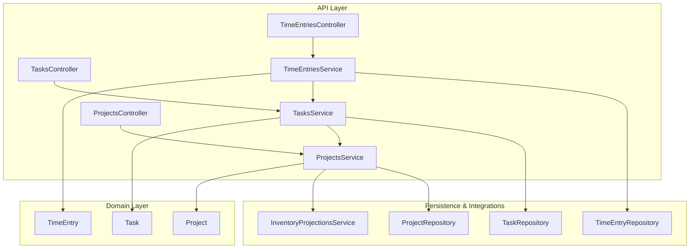
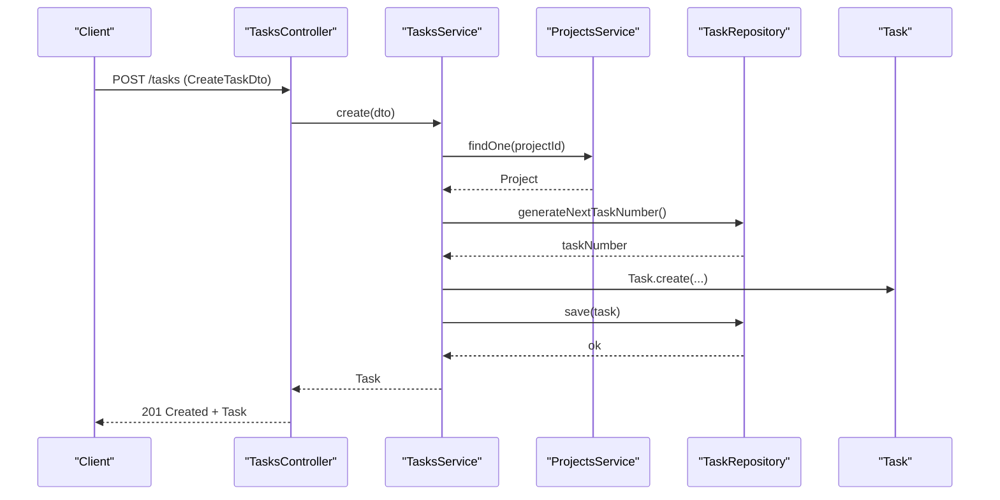
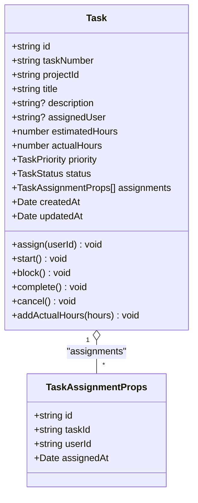
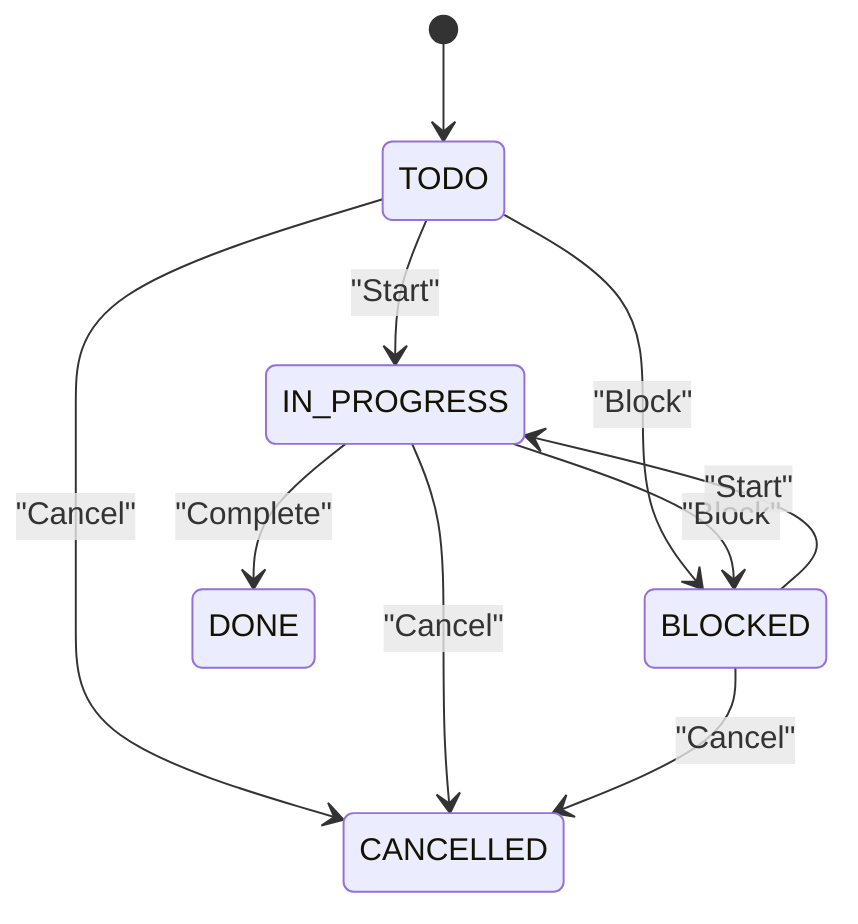
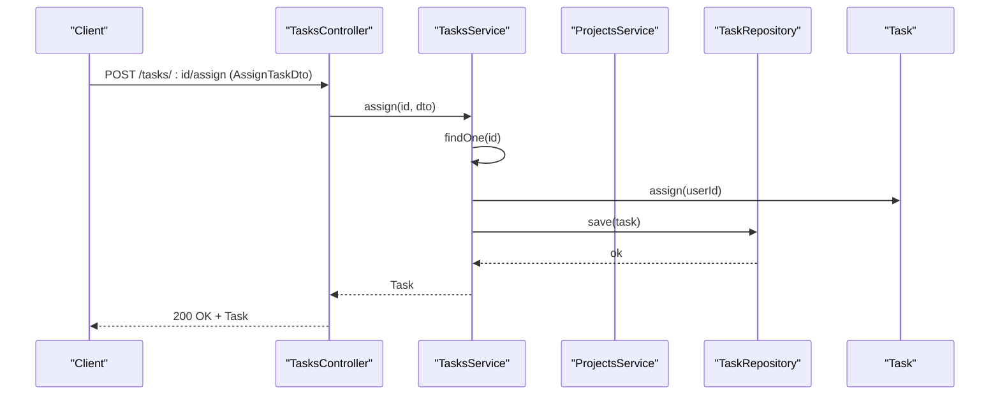
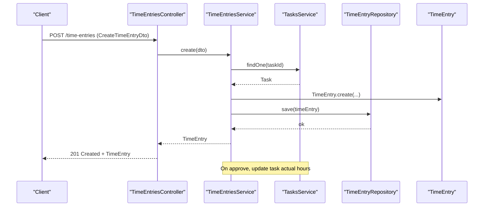
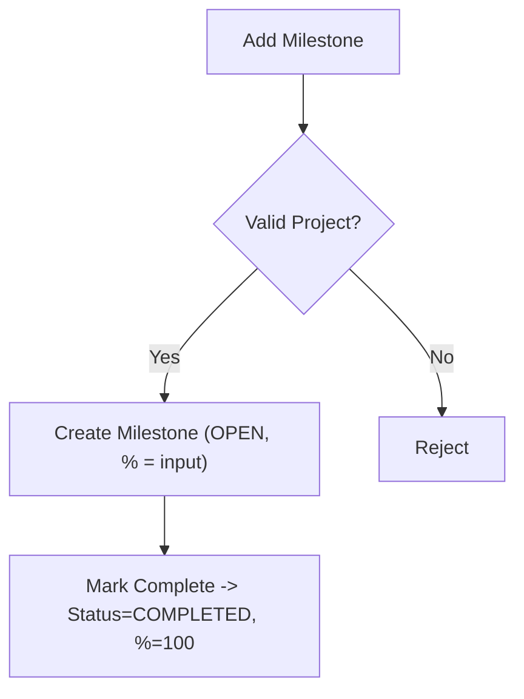
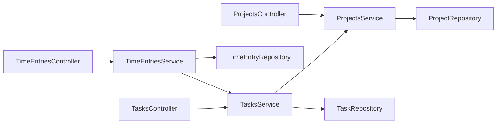

# Task Management

<cite>
**Referenced Files in This Document**
- [tasks.controller.ts](file://apps/api/src/tasks/tasks.controller.ts)
- [tasks.service.ts](file://apps/api/src/tasks/tasks.service.ts)
- [dtos.ts](file://apps/api/src/tasks/dtos.ts)
- [task.ts](file://packages/projects/src/tasks/task.ts)
- [task.repository.ts](file://packages/projects/src/tasks/task.repository.ts)
- [time-entries.controller.ts](file://apps/api/src/time-entries/time-entries.controller.ts)
- [time-entries.service.ts](file://apps/api/src/time-entries/time-entries.service.ts)
- [time-entry.ts](file://packages/projects/src/time/time-entry.ts)
- [projects.controller.ts](file://apps/api/src/projects/projects.controller.ts)
- [projects.service.ts](file://apps/api/src/projects/projects.service.ts)
- [project.ts](file://packages/projects/src/projects/project.ts)
- [0043-task-management.md](file://docs/rfcs/0043-task-management.md)
- [0042-milestones-and-deliverables.md](file://docs/rfcs/0042-milestones-and-deliverables.md)
- [0041-project-management.md](file://docs/rfcs/0041-project-management.md)
</cite>

## Table of Contents
1. Introduction
2. Project Structure
3. Core Components
4. Architecture Overview
5. Detailed Component Analysis
6. Dependency Analysis
7. Performance Considerations
8. Troubleshooting Guide
9. Conclusion
10. Appendices

## Introduction
This document explains the task management functionality in Ananya ERP with a focus on creating, assigning, tracking, and completing tasks within projects. It covers the task data model (types, priorities, due dates via project milestones, assignees, dependencies as future scope), lifecycle transitions, filtering and search, bulk operations considerations, and integration with project milestones and time tracking. Practical examples are provided to guide users through common workflows such as creating tasks, assigning team members, tracking progress, and generating reports.

## Project Structure
The task management feature spans three layers:
- API layer (NestJS controllers and services) for HTTP endpoints and orchestration
- Domain layer (Task, TimeEntry, Project aggregates) enforcing business rules and state machines
- Persistence and cross-module integrations (ProjectsService, inventory projections, repositories)

**Diagram sources**
- [tasks.controller.ts:1-62](file://apps/api/src/tasks/tasks.controller.ts#L1-L62)
- [tasks.service.ts:1-114](file://apps/api/src/tasks/tasks.service.ts#L1-L114)
- [time-entries.controller.ts:1-47](file://apps/api/src/time-entries/time-entries.controller.ts#L1-L47)
- [time-entries.service.ts:1-83](file://apps/api/src/time-entries/time-entries.service.ts#L1-L83)
- [projects.controller.ts:1-121](file://apps/api/src/projects/projects.controller.ts#L1-L121)
- [projects.service.ts:1-282](file://apps/api/src/projects/projects.service.ts#L1-L282)
- [task.ts:1-174](file://packages/projects/src/tasks/task.ts#L1-L174)
- [time-entry.ts:1-99](file://packages/projects/src/time/time-entry.ts#L1-L99)
- [project.ts:1-543](file://packages/projects/src/projects/project.ts#L1-L543)

**Section sources**
- [tasks.controller.ts:1-62](file://apps/api/src/tasks/tasks.controller.ts#L1-L62)
- [tasks.service.ts:1-114](file://apps/api/src/tasks/tasks.service.ts#L1-L114)
- [time-entries.controller.ts:1-47](file://apps/api/src/time-entries/time-entries.controller.ts#L1-L47)
- [time-entries.service.ts:1-83](file://apps/api/src/time-entries/time-entries.service.ts#L1-L83)
- [projects.controller.ts:1-121](file://apps/api/src/projects/projects.controller.ts#L1-L121)
- [projects.service.ts:1-282](file://apps/api/src/projects/projects.service.ts#L1-L282)
- [task.ts:1-174](file://packages/projects/src/tasks/task.ts#L1-L174)
- [time-entry.ts:1-99](file://packages/projects/src/time/time-entry.ts#L1-L99)
- [project.ts:1-543](file://packages/projects/src/projects/project.ts#L1-L543)

## Core Components
- TasksController: Exposes REST endpoints for task CRUD, assignment, and lifecycle transitions.
- TasksService: Orchestrates task creation, validation against project status, repository calls, and domain method invocations.
- Task (domain): Encapsulates task properties, assignment history, priority, estimated/actual hours, and enforces state transitions.
- TimeEntriesController/Service: Manages time logging against tasks; approval updates actual hours on tasks.
- ProjectsController/Service: Provides project context and milestone management; used by TasksService to validate project state.
- Project (domain): Owns milestones and their completion; integrates with inventory for material operations.

Key responsibilities:
- Create tasks only in active or planning projects.
- Enforce task state machine and assignment rules.
- Track time entries and roll up approved hours into tasks.
- Manage milestones as project-level deliverables.

**Section sources**
- [tasks.controller.ts:1-62](file://apps/api/src/tasks/tasks.controller.ts#L1-L62)
- [tasks.service.ts:1-114](file://apps/api/src/tasks/tasks.service.ts#L1-L114)
- [task.ts:1-174](file://packages/projects/src/tasks/task.ts#L1-L174)
- [time-entries.controller.ts:1-47](file://apps/api/src/time-entries/time-entries.controller.ts#L1-L47)
- [time-entries.service.ts:1-83](file://apps/api/src/time-entries/time-entries.service.ts#L1-L83)
- [projects.controller.ts:1-121](file://apps/api/src/projects/projects.controller.ts#L1-L121)
- [projects.service.ts:1-282](file://apps/api/src/projects/projects.service.ts#L1-L282)
- [project.ts:1-543](file://packages/projects/src/projects/project.ts#L1-L543)

## Architecture Overview
The system follows a layered architecture with clear separation between API, application services, domain aggregates, and persistence. The Task aggregate is central to task management, while TimeEntry provides time tracking that feeds back into Task actual hours. Project milestones provide high-level delivery checkpoints.

**Diagram sources**
- [tasks.controller.ts:10-13](file://apps/api/src/tasks/tasks.controller.ts#L10-L13)
- [tasks.service.ts:26-46](file://apps/api/src/tasks/tasks.service.ts#L26-L46)
- [project.ts:156-194](file://packages/projects/src/projects/project.ts#L156-L194)
- [task.ts:72-111](file://packages/projects/src/tasks/task.ts#L72-L111)

## Detailed Component Analysis

### Task Data Model
- Properties: id, taskNumber, projectId, title, description, assignedUser, estimatedHours, actualHours, priority, status, assignments[], timestamps.
- Types:
  - TaskStatus: TODO, IN_PROGRESS, BLOCKED, DONE, CANCELLED
  - TaskPriority: LOW, MEDIUM, HIGH, URGENT
- Assignment history: Each assignment records userId and assignedAt.
- Validation: Title required, non-negative estimatedHours, cannot log hours on completed/cancelled tasks.

**Diagram sources**
- [task.ts:1-174](file://packages/projects/src/tasks/task.ts#L1-L174)

**Section sources**
- [task.ts:1-174](file://packages/projects/src/tasks/task.ts#L1-L174)
- [task.repository.ts:1-18](file://packages/projects/src/tasks/task.repository.ts#L1-L18)

### Task Lifecycle and State Machine
- Initial status: TODO
- Allowed transitions:
  - Start: TODO -> IN_PROGRESS
  - Block: TODO or IN_PROGRESS -> BLOCKED
  - Complete: any except CANCELLED -> DONE
  - Cancel: any except DONE -> CANCELLED
- Invariants:
  - Cannot start or complete cancelled tasks
  - Cannot block invalid states
  - Cannot add hours to DONE or CANCELLED tasks

**Diagram sources**
- [task.ts:131-161](file://packages/projects/src/tasks/task.ts#L131-L161)

**Section sources**
- [task.ts:131-161](file://packages/projects/src/tasks/task.ts#L131-L161)
- [0043-task-management.md:67-75](file://docs/rfcs/0043-task-management.md#L67-L75)

### Task Creation and Assignment Workflow
- Creation requires a valid project; project must not be COMPLETED or CANCELLED.
- A unique task number is generated before saving.
- Optional initial assignment can be set at creation.

**Diagram sources**
- [tasks.controller.ts:37-40](file://apps/api/src/tasks/tasks.controller.ts#L37-L40)
- [tasks.service.ts:72-77](file://apps/api/src/tasks/tasks.service.ts#L72-L77)
- [task.ts:117-129](file://packages/projects/src/tasks/task.ts#L117-L129)

**Section sources**
- [tasks.controller.ts:10-40](file://apps/api/src/tasks/tasks.controller.ts#L10-L40)
- [tasks.service.ts:26-77](file://apps/api/src/tasks/tasks.service.ts#L26-L77)
- [dtos.ts:10-41](file://apps/api/src/tasks/dtos.ts#L10-L41)
- [task.ts:72-129](file://packages/projects/src/tasks/task.ts#L72-L129)

### Time Tracking Integration
- Time entries are created per task with user, date, hours, and optional description.
- Approval of a time entry triggers updating the task’s actual hours.
- Time entries cannot be logged against completed or cancelled tasks.

**Diagram sources**
- [time-entries.controller.ts:10-13](file://apps/api/src/time-entries/time-entries.controller.ts#L10-L13)
- [time-entries.service.ts:25-42](file://apps/api/src/time-entries/time-entries.service.ts#L25-L42)
- [time-entry.ts:51-76](file://packages/projects/src/time/time-entry.ts#L51-L76)
- [tasks.service.ts:107-112](file://apps/api/src/tasks/tasks.service.ts#L107-L112)

**Section sources**
- [time-entries.controller.ts:10-47](file://apps/api/src/time-entries/time-entries.controller.ts#L10-L47)
- [time-entries.service.ts:25-83](file://apps/api/src/time-entries/time-entries.service.ts#L25-L83)
- [time-entry.ts:1-99](file://packages/projects/src/time/time-entry.ts#L1-L99)
- [tasks.service.ts:107-112](file://apps/api/src/tasks/tasks.service.ts#L107-L112)

### Milestones and Deliverables
- Milestones belong to projects and track name, due date, status, and completion percentage.
- Milestones can be added and marked complete; completion sets percentage to 100%.
- UI displays milestones alongside project details.

**Diagram sources**
- [project.ts:485-524](file://packages/projects/src/projects/project.ts#L485-L524)
- [projects.controller.ts:88-104](file://apps/api/src/projects/projects.controller.ts#L88-L104)
- [projects.service.ts:160-183](file://apps/api/src/projects/projects.service.ts#L160-L183)

**Section sources**
- [project.ts:485-524](file://packages/projects/src/projects/project.ts#L485-L524)
- [projects.controller.ts:88-104](file://apps/api/src/projects/projects.controller.ts#L88-L104)
- [projects.service.ts:160-183](file://apps/api/src/projects/projects.service.ts#L160-L183)
- [0042-milestones-and-deliverables.md:1-98](file://docs/rfcs/0042-milestones-and-deliverables.md#L1-L98)

### Filtering, Search, and Bulk Operations
- Filtering:
  - Tasks: by projectId, assignedUser, status, priority, and free-text search.
  - Time Entries: by userId, taskId, status, and date range.
  - Projects: by status, priority, customerId, salesOrderId, projectManager, and search.
- Search capabilities:
  - Free-text search supported across tasks and projects via query parameters.
- Bulk operations:
  - Not implemented in current task endpoints; consider adding batch endpoints for assign/start/block/complete if needed.

**Section sources**
- [tasks.controller.ts:15-30](file://apps/api/src/tasks/tasks.controller.ts#L15-L30)
- [time-entries.controller.ts:15-30](file://apps/api/src/time-entries/time-entries.controller.ts#L15-L30)
- [projects.controller.ts:34-51](file://apps/api/src/projects/projects.controller.ts#L34-L51)
- [task.repository.ts:3-17](file://packages/projects/src/tasks/task.repository.ts#L3-L17)

### Practical Examples
- Creating a task:
  - Call POST /tasks with projectId, title, estimatedHours, optional description, assignedUser, and priority.
  - Ensure the project is not COMPLETED or CANCELLED.
- Assigning a team member:
  - Call POST /tasks/:id/assign with userId.
  - Assignment is recorded with timestamp in assignments list.
- Starting work:
  - Call POST /tasks/:id/start to move from TODO to IN_PROGRESS.
- Blocking a task:
  - Call POST /tasks/:id/block when work is blocked.
- Completing a task:
  - Call POST /tasks/:id/complete to mark DONE.
- Logging time:
  - Create a time entry linked to the task; upon approval, actual hours are updated on the task.
- Generating reports:
  - Use GET /tasks with filters (projectId, assignedUser, status, priority, search).
  - Use GET /time-entries with filters (userId, taskId, status, startDate, endDate) to build utilization and progress reports.

**Section sources**
- [tasks.controller.ts:10-60](file://apps/api/src/tasks/tasks.controller.ts#L10-L60)
- [tasks.service.ts:26-112](file://apps/api/src/tasks/tasks.service.ts#L26-L112)
- [time-entries.controller.ts:10-47](file://apps/api/src/time-entries/time-entries.controller.ts#L10-L47)
- [time-entries.service.ts:25-83](file://apps/api/src/time-entries/time-entries.service.ts#L25-L83)

## Dependency Analysis
- TasksService depends on ProjectsService to validate project state before task creation.
- TimeEntriesService depends on TasksService to enforce task status constraints and to update actual hours upon approval.
- Project milestones are managed within the Project aggregate and exposed via ProjectsController/Service.
- Repository abstractions decouple persistence logic from application services.

**Diagram sources**
- [tasks.controller.ts:1-62](file://apps/api/src/tasks/tasks.controller.ts#L1-L62)
- [tasks.service.ts:1-114](file://apps/api/src/tasks/tasks.service.ts#L1-L114)
- [time-entries.controller.ts:1-47](file://apps/api/src/time-entries/time-entries.controller.ts#L1-L47)
- [time-entries.service.ts:1-83](file://apps/api/src/time-entries/time-entries.service.ts#L1-L83)
- [projects.controller.ts:1-121](file://apps/api/src/projects/projects.controller.ts#L1-L121)
- [projects.service.ts:1-282](file://apps/api/src/projects/projects.service.ts#L1-L282)

**Section sources**
- [tasks.service.ts:1-114](file://apps/api/src/tasks/tasks.service.ts#L1-L114)
- [time-entries.service.ts:1-83](file://apps/api/src/time-entries/time-entries.service.ts#L1-L83)
- [projects.service.ts:1-282](file://apps/api/src/projects/projects.service.ts#L1-L282)

## Performance Considerations
- Minimize N+1 queries by batching repository reads where possible (e.g., fetching multiple tasks with filters).
- Cache frequent lookups like project status checks during task creation if appropriate.
- Index database columns used in filters (projectId, assignedUser, status, priority, taskId, userId, status, date ranges).
- Avoid heavy processing in approval flows; keep TimeEntry.approve lightweight and delegate hour updates to TasksService.

[No sources needed since this section provides general guidance]

## Troubleshooting Guide
Common errors and resolutions:
- Cannot add tasks to project in status COMPLETED or CANCELLED:
  - Ensure the project is ACTIVE or PLANNING before creating tasks.
- Cannot assign user to task in status DONE or CANCELLED:
  - Reassign before completion or create a new task.
- Cannot start task in status DONE or CANCELLED:
  - Only TODO or IN_PROGRESS tasks can be started.
- Cannot block task in invalid status:
  - Only TODO or IN_PROGRESS tasks can be blocked.
- Cannot log hours against task in status DONE or CANCELLED:
  - Log time only while task is open or in progress.
- Time entry already approved or cannot reject approved entry:
  - Respect time entry state machine; rework submissions if rejected.

**Section sources**
- [tasks.service.ts:26-32](file://apps/api/src/tasks/tasks.service.ts#L26-L32)
- [task.ts:117-172](file://packages/projects/src/tasks/task.ts#L117-L172)
- [time-entries.service.ts:25-31](file://apps/api/src/time-entries/time-entries.service.ts#L25-L31)
- [time-entry.ts:82-97](file://packages/projects/src/time/time-entry.ts#L82-L97)

## Conclusion
Ananya ERP’s task management provides a robust foundation for organizing work within projects, with clear lifecycle controls, assignment tracking, and integrated time logging. Milestones offer high-level delivery checkpoints, while filtering and search enable effective oversight. Future enhancements may include task dependencies and checklist items to further refine workflow complexity.

[No sources needed since this section summarizes without analyzing specific files]

## Appendices

### RFC References
- Task Management RFC outlines domain concepts, commands, queries, and API design.
- Milestones RFC defines milestone lifecycle and completion mechanics.
- Project Management RFC describes project lifecycle and boundaries relevant to tasks.

**Section sources**
- [0043-task-management.md:1-118](file://docs/rfcs/0043-task-management.md#L1-L118)
- [0042-milestones-and-deliverables.md:1-98](file://docs/rfcs/0042-milestones-and-deliverables.md#L1-L98)
- [0041-project-management.md:1-112](file://docs/rfcs/0041-project-management.md#L1-L112)