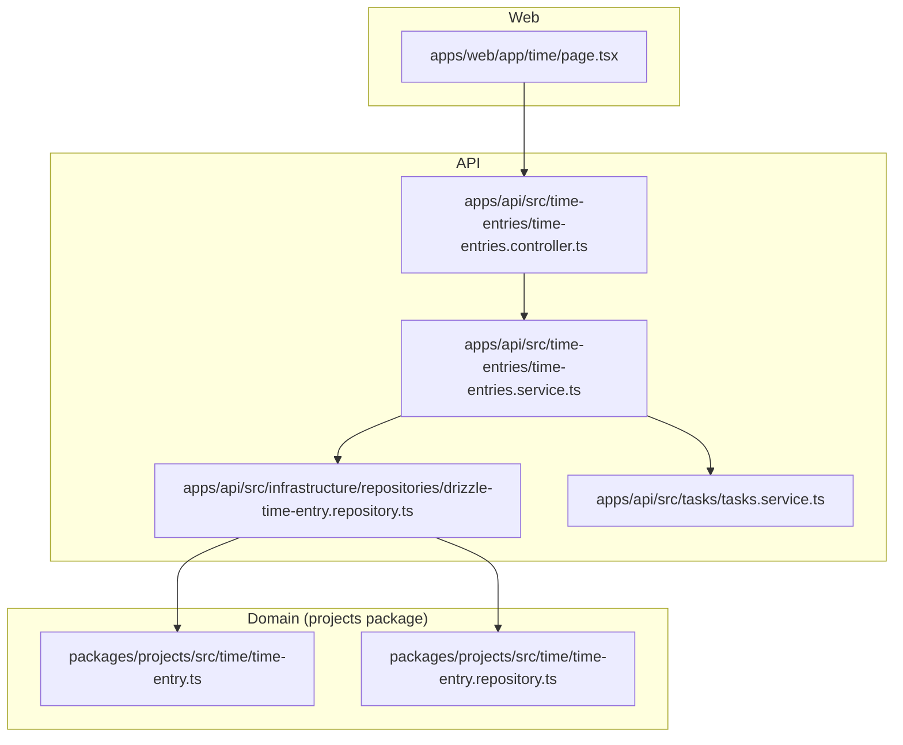
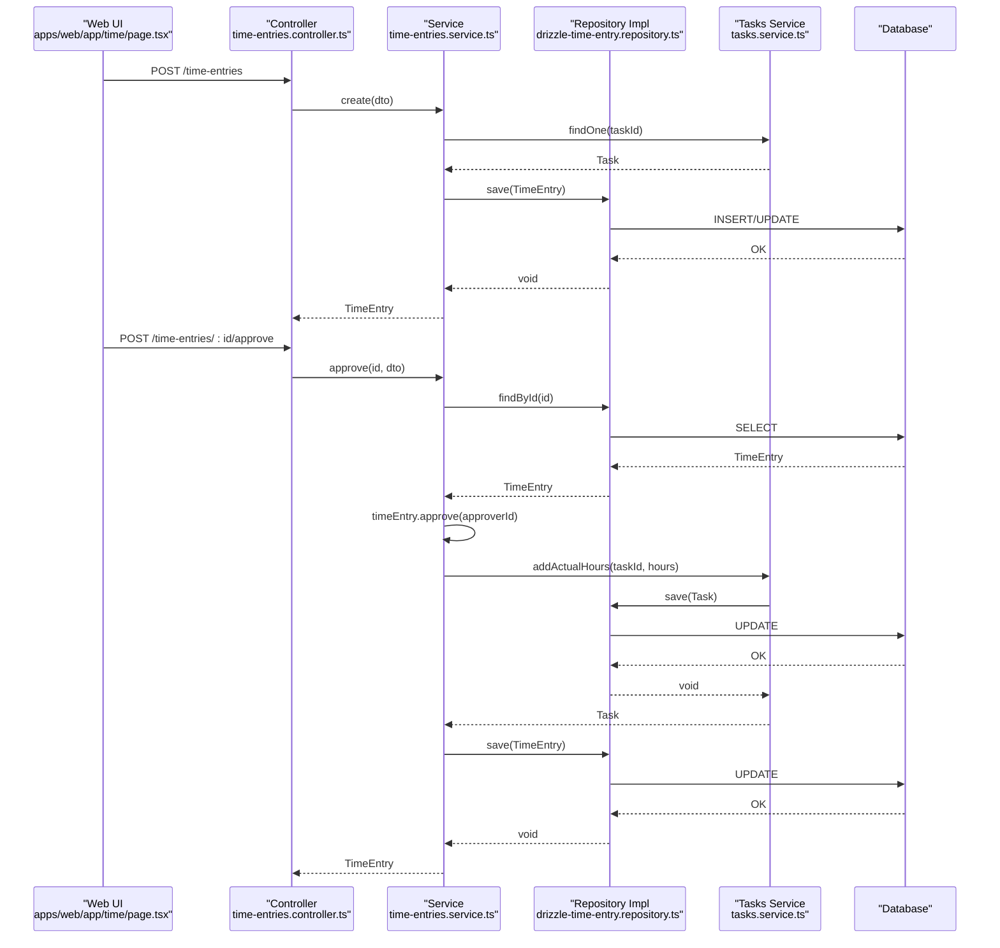
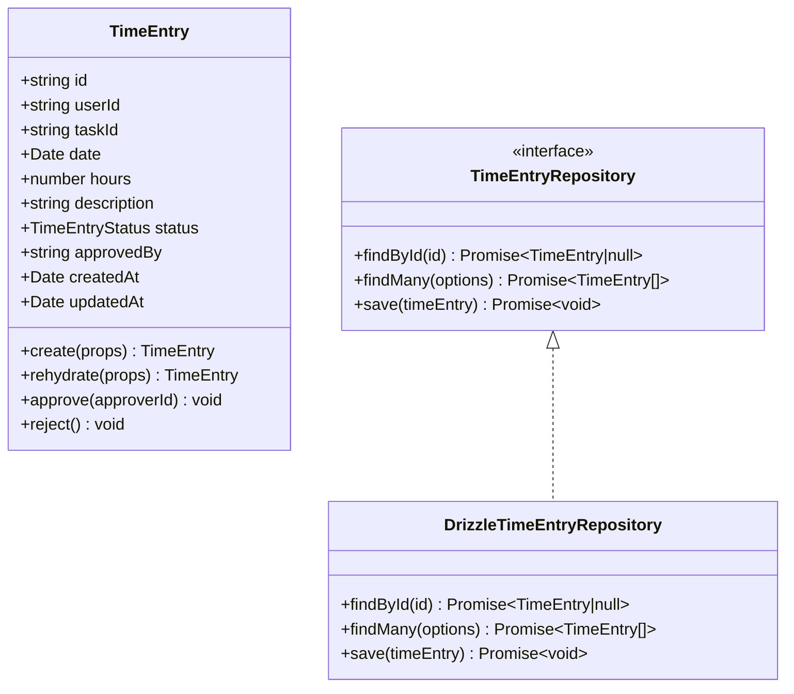
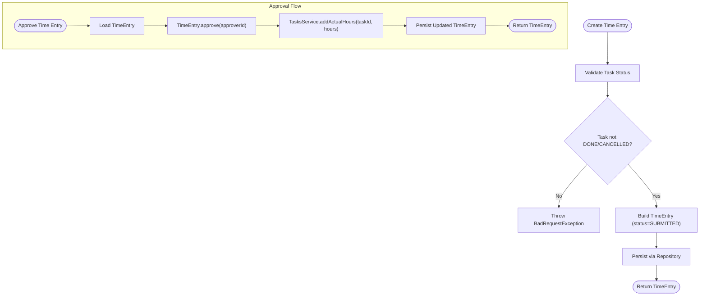
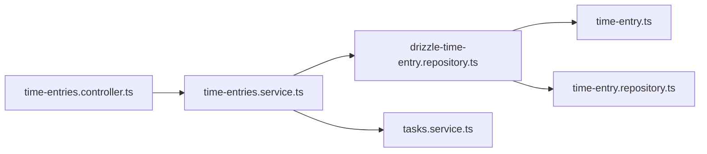
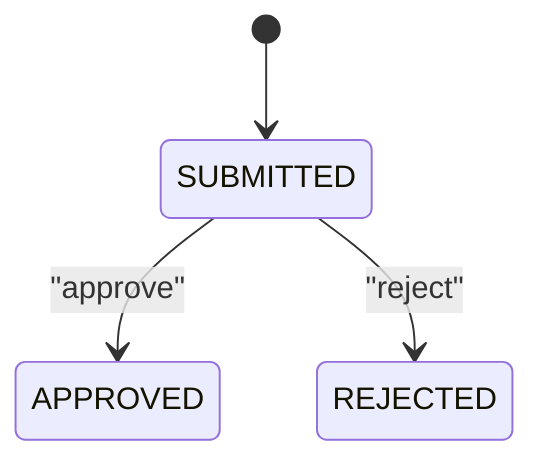

# Time Tracking

<cite>
**Referenced Files in This Document**   
- [0044-time-tracking.md](file://docs/rfcs/0044-time-tracking.md)
- [time-entries.controller.ts](file://apps/api/src/time-entries/time-entries.controller.ts)
- [time-entries.service.ts](file://apps/api/src/time-entries/time-entries.service.ts)
- [dtos.ts](file://apps/api/src/time-entries/dtos.ts)
- [page.tsx](file://apps/web/app/time/page.tsx)
- [time-entry.ts](file://packages/projects/src/time/time-entry.ts)
- [time-entry.repository.ts](file://packages/projects/src/time/time-entry.repository.ts)
- [drizzle-time-entry.repository.ts](file://apps/api/src/infrastructure/repositories/drizzle-time-entry.repository.ts)
- [tasks.service.ts](file://apps/api/src/tasks/tasks.service.ts)
</cite>

## Table of Contents
1. [Introduction](#introduction)
2. [Project Structure](#project-structure)
3. [Core Components](#core-components)
4. [Architecture Overview](#architecture-overview)
5. [Detailed Component Analysis](#detailed-component-analysis)
6. [Dependency Analysis](#dependency-analysis)
7. [Performance Considerations](#performance-considerations)
8. [Troubleshooting Guide](#troubleshooting-guide)
9. [Conclusion](#conclusion)
10. [Appendices](#appendices)

## Introduction
This document explains the time tracking capabilities in Ananya ERP’s project management system. It covers how time entries are created, edited, and approved; the data model for time entries including associations to projects and tasks, user assignments, duration tracking, and billing-related fields; validation rules; approval workflows; and integration points with payroll or billing systems. It also provides practical examples for logging time entries, generating reports, analyzing utilization, and integrating time tracking into project cost calculations.

## Project Structure
Time tracking spans a small set of focused modules:
- Domain model and repository contract live in the projects package.
- API controllers and services implement HTTP endpoints and orchestrate domain operations.
- A Drizzle-based repository persists time entries.
- The web app exposes a timesheet page for logging hours.



**Diagram sources**
- [page.tsx:1-146](file://apps/web/app/time/page.tsx#L1-L146)
- [time-entries.controller.ts:1-47](file://apps/api/src/time-entries/time-entries.controller.ts#L1-L47)
- [time-entries.service.ts:1-83](file://apps/api/src/time-entries/time-entries.service.ts#L1-L83)
- [drizzle-time-entry.repository.ts:1-85](file://apps/api/src/infrastructure/repositories/drizzle-time-entry.repository.ts#L1-L85)
- [time-entry.ts:1-99](file://packages/projects/src/time/time-entry.ts#L1-L99)
- [time-entry.repository.ts:1-16](file://packages/projects/src/time/time-entry.repository.ts#L1-L16)
- [tasks.service.ts:1-114](file://apps/api/src/tasks/tasks.service.ts#L1-L114)

**Section sources**
- [time-entries.controller.ts:1-47](file://apps/api/src/time-entries/time-entries.controller.ts#L1-L47)
- [time-entries.service.ts:1-83](file://apps/api/src/time-entries/time-entries.service.ts#L1-L83)
- [drizzle-time-entry.repository.ts:1-85](file://apps/api/src/infrastructure/repositories/drizzle-time-entry.repository.ts#L1-L85)
- [time-entry.ts:1-99](file://packages/projects/src/time/time-entry.ts#L1-L99)
- [time-entry.repository.ts:1-16](file://packages/projects/src/time/time-entry.repository.ts#L1-L16)
- [page.tsx:1-146](file://apps/web/app/time/page.tsx#L1-L146)
- [tasks.service.ts:1-114](file://apps/api/src/tasks/tasks.service.ts#L1-L114)

## Core Components
- TimeEntry domain entity: encapsulates state transitions (SUBMITTED → APPROVED/REJECTED), validates hours, and tracks approver information.
- TimeEntryRepository interface: defines persistence contracts for find-by-id, find-many with filters, and save.
- DrizzleTimeEntryRepository: implements persistence using Drizzle ORM, mapping database rows to domain entities.
- TimeEntriesController: exposes REST endpoints for create, list, get, approve, and reject.
- TimeEntriesService: orchestrates business logic, validates task status, updates task actual hours on approval, and persists changes.
- TasksService: provides task lookup and adds actual hours when time entries are approved.
- Web Timesheet Page: UI for viewing logs and opening a dialog to log hours.

Key responsibilities:
- Validation: DTOs enforce required fields and numeric ranges; domain entity enforces business invariants.
- Approval workflow: controller delegates to service; service calls domain methods and updates related task metrics.
- Data model: time entries link users and tasks, store date/hours/description/status/approver, and persist via repository.

**Section sources**
- [time-entry.ts:1-99](file://packages/projects/src/time/time-entry.ts#L1-L99)
- [time-entry.repository.ts:1-16](file://packages/projects/src/time/time-entry.repository.ts#L1-L16)
- [drizzle-time-entry.repository.ts:1-85](file://apps/api/src/infrastructure/repositories/drizzle-time-entry.repository.ts#L1-L85)
- [time-entries.controller.ts:1-47](file://apps/api/src/time-entries/time-entries.controller.ts#L1-L47)
- [time-entries.service.ts:1-83](file://apps/api/src/time-entries/time-entries.service.ts#L1-L83)
- [tasks.service.ts:1-114](file://apps/api/src/tasks/tasks.service.ts#L1-L114)
- [page.tsx:1-146](file://apps/web/app/time/page.tsx#L1-L146)

## Architecture Overview
The time tracking feature follows a layered architecture:
- Presentation layer (web): renders timesheet UI and triggers API calls.
- Application layer (controller/service): handles HTTP requests, validates inputs, coordinates domain operations.
- Domain layer (entity/repository contract): enforces business rules and state transitions.
- Infrastructure layer (repository implementation): persists data to the database.



**Diagram sources**
- [time-entries.controller.ts:10-45](file://apps/api/src/time-entries/time-entries.controller.ts#L10-L45)
- [time-entries.service.ts:25-80](file://apps/api/src/time-entries/time-entries.service.ts#L25-L80)
- [drizzle-time-entry.repository.ts:28-83](file://apps/api/src/infrastructure/repositories/drizzle-time-entry.repository.ts#L28-L83)
- [tasks.service.ts:64-112](file://apps/api/src/tasks/tasks.service.ts#L64-L112)

## Detailed Component Analysis

### Time Entry Domain Model
The TimeEntry entity models a single time entry with strong invariants:
- Required fields: userId, taskId, date, hours (>0, ≤24).
- Status lifecycle: SUBMITTED by default; can transition to APPROVED or REJECTED.
- Approver tracking: approvedBy is set on approval.



**Diagram sources**
- [time-entry.ts:1-99](file://packages/projects/src/time/time-entry.ts#L1-L99)
- [time-entry.repository.ts:1-16](file://packages/projects/src/time/time-entry.repository.ts#L1-L16)
- [drizzle-time-entry.repository.ts:1-85](file://apps/api/src/infrastructure/repositories/drizzle-time-entry.repository.ts#L1-L85)

**Section sources**
- [time-entry.ts:1-99](file://packages/projects/src/time/time-entry.ts#L1-L99)
- [time-entry.repository.ts:1-16](file://packages/projects/src/time/time-entry.repository.ts#L1-L16)

### API Endpoints and DTOs
Endpoints:
- POST /time-entries: create a new time entry.
- GET /time-entries: list with optional filters (userId, taskId, status, startDate, endDate).
- GET /time-entries/:id: retrieve a single time entry.
- POST /time-entries/:id/approve: approve an entry with approverId.
- POST /time-entries/:id/reject: reject an entry.

DTOs:
- CreateTimeEntryDto: validates userId, taskId, date, hours (0.1–24), and optional description.
- ApproveTimeEntryDto: validates approverId.

Validation rules:
- Input-level validation via DTO decorators.
- Business-level validation in service and domain (task status checks, hours bounds).

**Section sources**
- [time-entries.controller.ts:1-47](file://apps/api/src/time-entries/time-entries.controller.ts#L1-L47)
- [dtos.ts:1-39](file://apps/api/src/time-entries/dtos.ts#L1-L39)

### Service Orchestration and Approval Workflow
The service performs:
- Creation: validates task status (not DONE/CANCELLED), constructs TimeEntry, persists it.
- Listing: delegates filtering to repository.
- Approval: loads entry, calls domain approve(), increments task actual hours, persists updated entry.
- Rejection: calls domain reject(), persists updated entry.



**Diagram sources**
- [time-entries.service.ts:25-80](file://apps/api/src/time-entries/time-entries.service.ts#L25-L80)
- [tasks.service.ts:107-112](file://apps/api/src/tasks/tasks.service.ts#L107-L112)

**Section sources**
- [time-entries.service.ts:25-80](file://apps/api/src/time-entries/time-entries.service.ts#L25-L80)
- [tasks.service.ts:107-112](file://apps/api/src/tasks/tasks.service.ts#L107-L112)

### Persistence Layer
DrizzleTimeEntryRepository maps database rows to domain entities and supports:
- Filtering by userId, taskId, status, and date range.
- Upsert behavior on save to handle updates.

```mermaid
flowchart TD
RStart([Repository Operation]) --> MapRow["Map Row to TimeEntry.rehydrate(...)"]
MapRow --> Query["Apply Filters (userId/taskId/status/date range)"]
Query --> Order["Order by date DESC"]
Order --> Return([Return TimeEntry[]])
```

**Diagram sources**
- [drizzle-time-entry.repository.ts:12-57](file://apps/api/src/infrastructure/repositories/drizzle-time-entry.repository.ts#L12-L57)

**Section sources**
- [drizzle-time-entry.repository.ts:1-85](file://apps/api/src/infrastructure/repositories/drizzle-time-entry.repository.ts#L1-L85)

### Web Timesheet UI
The timesheet page:
- Loads all time entries via API client.
- Displays key columns (employee name, reference, work completed, logged hours, date).
- Provides a dialog to log hours through TimeEntryForm.
- Shows summary stats (total hours today, active timesheets, labor utilization).

Note: The current page uses a generic “labor logs” view; the underlying API still supports project/task/user filters that can be surfaced in future UI enhancements.

**Section sources**
- [page.tsx:1-146](file://apps/web/app/time/page.tsx#L1-L146)

## Dependency Analysis
High-level dependencies:
- Controller depends on Service and shared types (TimeEntryStatus).
- Service depends on Repository and TasksService.
- Repository implementation depends on Drizzle schema and query helpers.
- Domain entity is independent and used across layers.



**Diagram sources**
- [time-entries.controller.ts:1-47](file://apps/api/src/time-entries/time-entries.controller.ts#L1-L47)
- [time-entries.service.ts:1-83](file://apps/api/src/time-entries/time-entries.service.ts#L1-L83)
- [drizzle-time-entry.repository.ts:1-85](file://apps/api/src/infrastructure/repositories/drizzle-time-entry.repository.ts#L1-L85)
- [time-entry.ts:1-99](file://packages/projects/src/time/time-entry.ts#L1-L99)
- [time-entry.repository.ts:1-16](file://packages/projects/src/time/time-entry.repository.ts#L1-L16)
- [tasks.service.ts:1-114](file://apps/api/src/tasks/tasks.service.ts#L1-L114)

**Section sources**
- [time-entries.controller.ts:1-47](file://apps/api/src/time-entries/time-entries.controller.ts#L1-L47)
- [time-entries.service.ts:1-83](file://apps/api/src/time-entries/time-entries.service.ts#L1-L83)
- [drizzle-time-entry.repository.ts:1-85](file://apps/api/src/infrastructure/repositories/drizzle-time-entry.repository.ts#L1-L85)
- [time-entry.ts:1-99](file://packages/projects/src/time/time-entry.ts#L1-L99)
- [time-entry.repository.ts:1-16](file://packages/projects/src/time/time-entry.repository.ts#L1-L16)
- [tasks.service.ts:1-114](file://apps/api/src/tasks/tasks.service.ts#L1-L114)

## Performance Considerations
- Filtering at the repository level reduces payload size by applying userId, taskId, status, and date range filters directly in queries.
- Ordering by date ensures consistent listing for timesheet views.
- Upsert on save avoids extra update calls when rehydrating and saving entities.
- Avoid excessive client-side aggregation; compute totals server-side if needed for large datasets.

[No sources needed since this section provides general guidance]

## Troubleshooting Guide
Common issues and resolutions:
- Cannot log time against a task: Ensure the task is not in DONE or CANCELLED status. The service throws a clear error otherwise.
- Invalid hours: Hours must be greater than 0 and at most 24 per entry; DTO and domain both enforce this.
- Not found errors: If a time entry ID does not exist, the service returns a not found response.
- Approval failures: Approving already-approved entries or rejecting approved entries raises domain errors.

Operational tips:
- Use GET /time-entries with filters to isolate problematic records.
- Verify approverId is provided when approving.
- Check task assignment and status before creating time entries.

**Section sources**
- [time-entries.service.ts:25-80](file://apps/api/src/time-entries/time-entries.service.ts#L25-L80)
- [dtos.ts:11-31](file://apps/api/src/time-entries/dtos.ts#L11-L31)
- [time-entry.ts:51-97](file://packages/projects/src/time/time-entry.ts#L51-L97)

## Conclusion
Ananya ERP’s time tracking module provides a robust foundation for logging, validating, and approving time entries tied to tasks within projects. The domain model enforces critical invariants, while the service layer coordinates approvals and updates task actual hours. The repository abstraction enables flexible persistence and querying. With these building blocks, teams can reliably track labor, generate utilization reports, and integrate time data into project costing and billing processes.

[No sources needed since this section summarizes without analyzing specific files]

## Appendices

### Data Model Summary
- TimeEntry fields: id, userId, taskId, date, hours, description, status, approvedBy, createdAt, updatedAt.
- Status values: SUBMITTED, APPROVED, REJECTED.
- Relationships:
  - User: represented by userId.
  - Task: linked via taskId; approved entries increment task actual hours.
  - Project: indirectly associated through the task’s projectId.

**Section sources**
- [time-entry.ts:5-16](file://packages/projects/src/time/time-entry.ts#L5-L16)
- [0044-time-tracking.md:79-81](file://docs/rfcs/0044-time-tracking.md#L79-L81)

### Validation Rules
- Required: userId, taskId, date.
- Numeric constraints: hours > 0 and ≤ 24.
- Task constraints: cannot log time against DONE or CANCELLED tasks.

**Section sources**
- [dtos.ts:11-31](file://apps/api/src/time-entries/dtos.ts#L11-L31)
- [time-entries.service.ts:25-41](file://apps/api/src/time-entries/time-entries.service.ts#L25-L41)
- [time-entry.ts:51-75](file://packages/projects/src/time/time-entry.ts#L51-L75)
- [0044-time-tracking.md:55-59](file://docs/rfcs/0044-time-tracking.md#L55-L59)

### Approval Process
- States: SUBMITTED → APPROVED or REJECTED.
- Approver tracking: approvedBy set on approval.
- Side effects: approved entries increase task actual hours.



**Diagram sources**
- [0044-time-tracking.md:61-67](file://docs/rfcs/0044-time-tracking.md#L61-L67)
- [time-entry.ts:82-97](file://packages/projects/src/time/time-entry.ts#L82-L97)

**Section sources**
- [0044-time-tracking.md:61-67](file://docs/rfcs/0044-time-tracking.md#L61-L67)
- [time-entry.ts:82-97](file://packages/projects/src/time/time-entry.ts#L82-L97)

### Practical Examples

- Logging a time entry:
  - Call POST /time-entries with userId, taskId, date, hours, and optional description.
  - System validates task status and hours, creates a SUBMITTED entry, and persists it.

- Generating time reports:
  - Use GET /time-entries with filters such as userId, taskId, status, startDate, endDate to extract subsets for reporting.

- Analyzing project time utilization:
  - Aggregate approved hours per task/project to compare against estimated hours and calculate utilization ratios.

- Integrating with payroll/billing:
  - Approved time entries provide exact labor hours for commercial billing verification and payroll processing.

**Section sources**
- [time-entries.controller.ts:10-45](file://apps/api/src/time-entries/time-entries.controller.ts#L10-L45)
- [time-entries.service.ts:25-80](file://apps/api/src/time-entries/time-entries.service.ts#L25-L80)
- [0044-time-tracking.md:75-77](file://docs/rfcs/0044-time-tracking.md#L75-L77)

### Best Practices
- Always associate time entries with valid, active tasks.
- Keep descriptions concise but informative for auditability.
- Enforce daily caps (≤24 hours) and minimum meaningful increments (≥0.1 hours).
- Review approval queues regularly to keep timesheets current.
- Use filtered queries to build efficient reports and dashboards.

[No sources needed since this section provides general guidance]