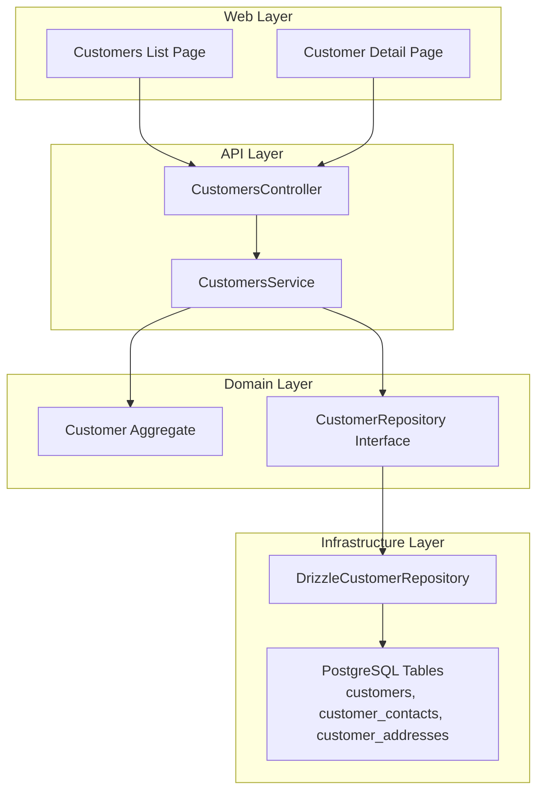
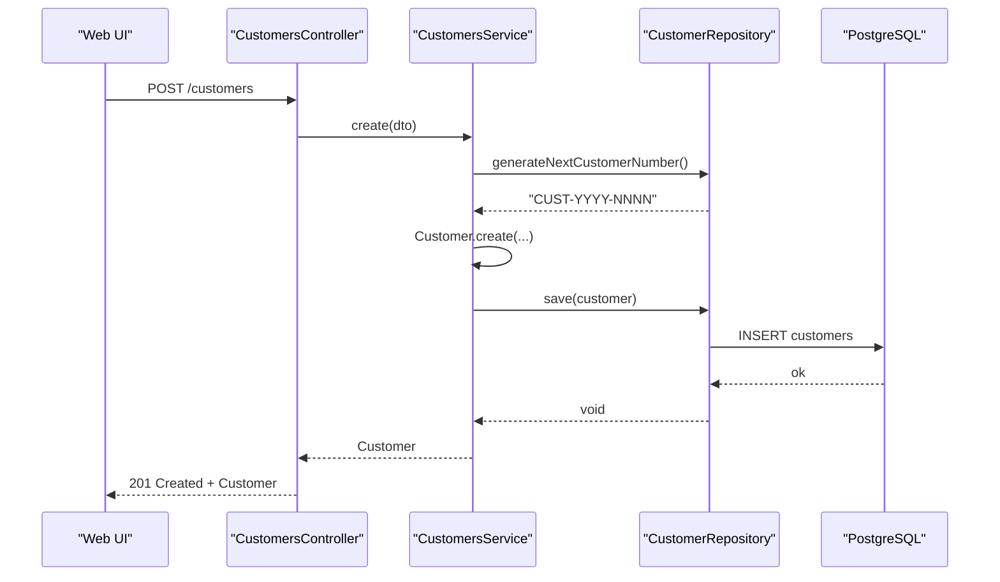
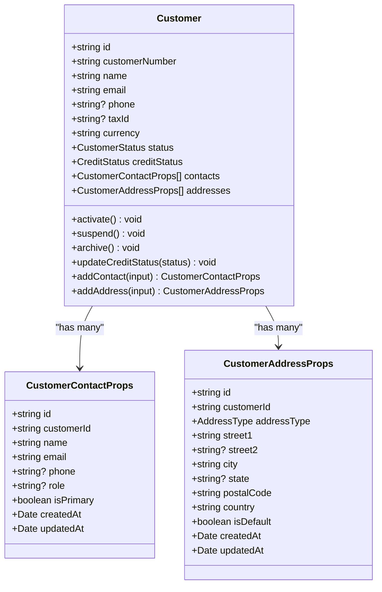
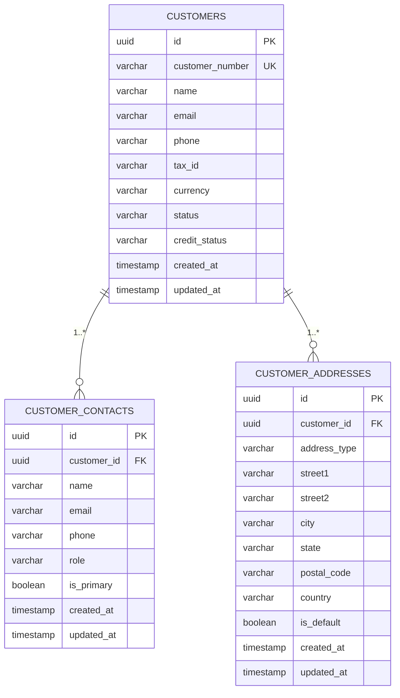
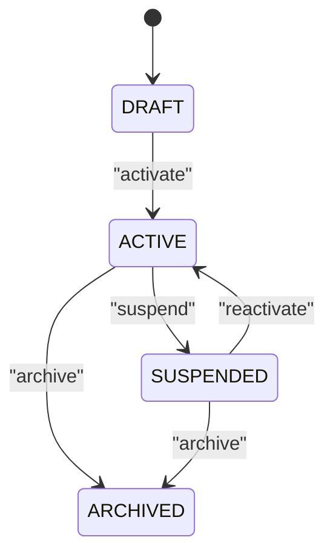
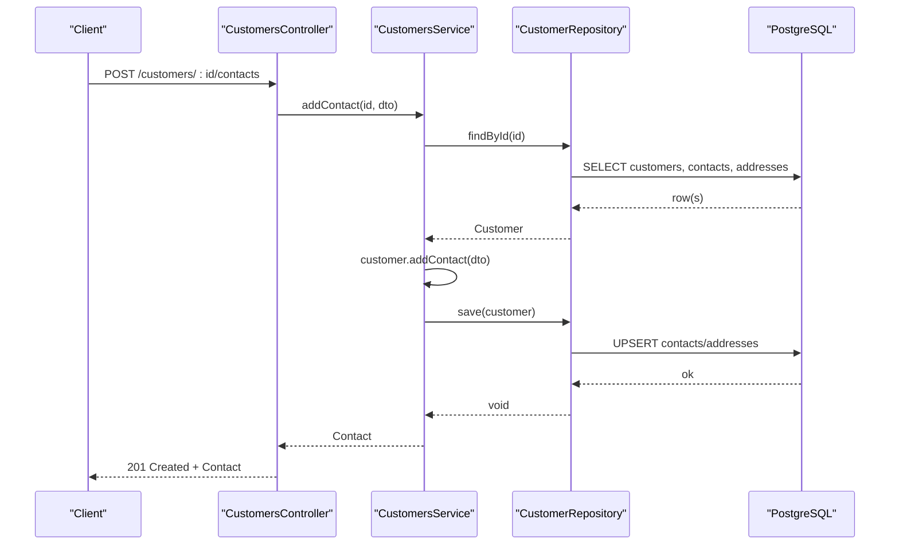
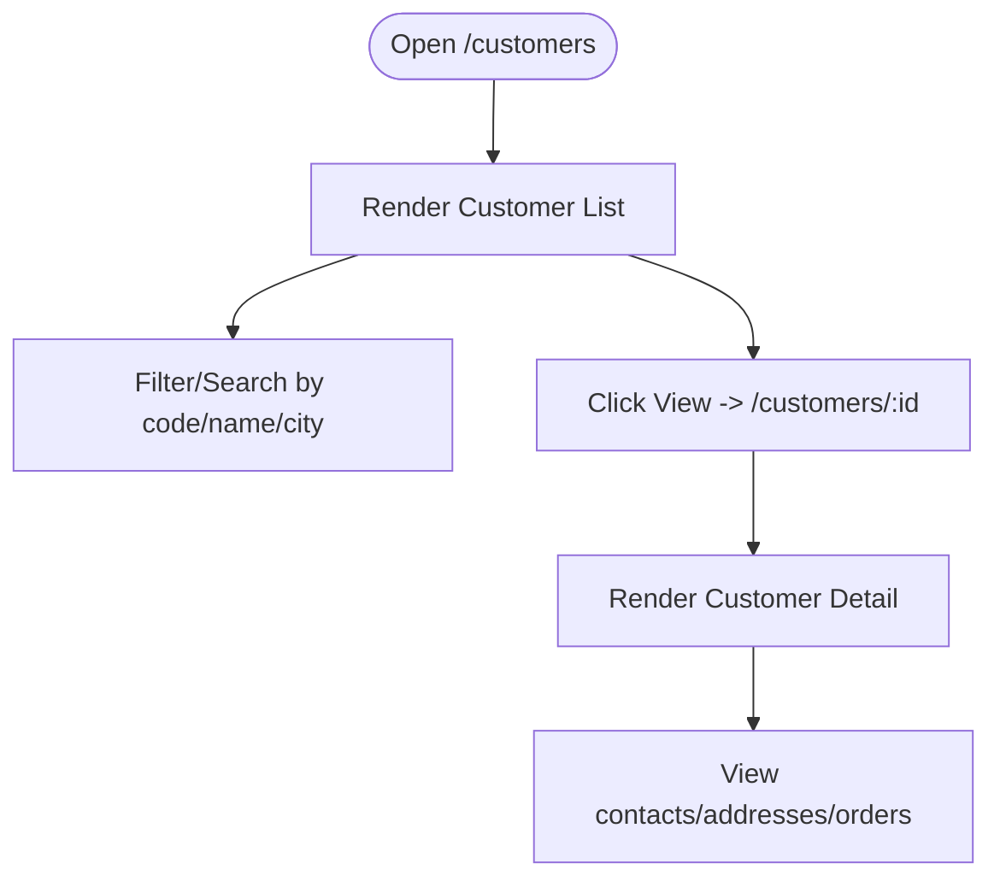
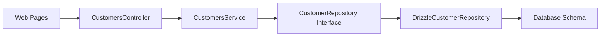

# Customer Management

<cite>
**Referenced Files in This Document**
- [RFC-0026: Customer Management](file://docs/rfcs/0026-customer-management.md)
- [Customer Domain Model](file://packages/sales/src/customers/customer.ts)
- [Customer Repository Interface](file://packages/sales/src/customers/customer.repository.ts)
- [Drizzle Customer Repository](file://apps/api/src/infrastructure/repositories/drizzle-customer.repository.ts)
- [Database Schema (Customers, Contacts, Addresses)](file://packages/database/src/schema/customers.ts)
- [Customers Controller](file://apps/api/src/customers/customers.controller.ts)
- [Customers Service](file://apps/api/src/customers/customers.service.ts)
- [Customer DTOs](file://apps/api/src/customers/dtos.ts)
- [Web Customers List Page](file://apps/web/app/customers/page.tsx)
- [Web Customer Detail Page](file://apps/web/app/customers/[id]/page.tsx)
</cite>

## Table of Contents
1. Introduction
2. Project Structure
3. Core Components
4. Architecture Overview
5. Detailed Component Analysis
6. Dependency Analysis
7. Performance Considerations
8. Troubleshooting Guide
9. Conclusion
10. Appendices

## Introduction
This document explains Ananya ERP’s Customer Management system with a focus on the customer data model, lifecycle, repository implementation, API endpoints, and frontend components. It also covers validation rules, business constraints, and integration points with CRM features such as leads and opportunities. The design follows domain-driven principles where the Customer aggregate encapsulates state transitions, contacts, and addresses, while application services orchestrate persistence via a repository abstraction.

## Project Structure
The Customer Management feature spans multiple layers:
- Domain layer defines the Customer aggregate, value types, and repository contract.
- Application layer exposes use cases through a NestJS service and controller.
- Infrastructure layer implements persistence using Drizzle ORM against PostgreSQL tables for customers, contacts, and addresses.
- Web layer provides list and detail pages for browsing and viewing customer accounts.

**Diagram sources**
- [Customers Controller](file://apps/api/src/customers/customers.controller.ts)
- [Customers Service](file://apps/api/src/customers/customers.service.ts)
- [Customer Domain Model](file://packages/sales/src/customers/customer.ts)
- [Customer Repository Interface](file://packages/sales/src/customers/customer.repository.ts)
- [Drizzle Customer Repository](file://apps/api/src/infrastructure/repositories/drizzle-customer.repository.ts)
- [Database Schema (Customers, Contacts, Addresses)](file://packages/database/src/schema/customers.ts)
- [Web Customers List Page](file://apps/web/app/customers/page.tsx)
- [Web Customer Detail Page](file://apps/web/app/customers/[id]/page.tsx)

**Section sources**
- [RFC-0026: Customer Management](file://docs/rfcs/0026-customer-management.md)

## Core Components
- Customer aggregate: Encapsulates identity, status, credit status, and collections of contacts and addresses. Provides methods to activate, suspend, archive, update credit status, add contacts, and add addresses.
- Repository interface: Defines queries by id and number, filtered listing, save operations, and generation of unique customer numbers.
- Drizzle repository: Implements persistence across three tables, mapping rows to domain objects and upserting related entities.
- Application service: Orchestrates creation, activation, suspension, contact/address management, and delegates persistence to the repository.
- Controller: Exposes REST endpoints for CRUD and lifecycle actions.
- DTOs: Validate incoming payloads for creating customers and adding contacts/addresses.
- Database schema: Defines tables for customers, contacts, and addresses with indexes and default values.
- Web pages: Provide list view with search and filters, and a detail view showing key account information.

**Section sources**
- [Customer Domain Model](file://packages/sales/src/customers/customer.ts)
- [Customer Repository Interface](file://packages/sales/src/customers/customer.repository.ts)
- [Drizzle Customer Repository](file://apps/api/src/infrastructure/repositories/drizzle-customer.repository.ts)
- [Customers Service](file://apps/api/src/customers/customers.service.ts)
- [Customers Controller](file://apps/api/src/customers/customers.controller.ts)
- [Customer DTOs](file://apps/api/src/customers/dtos.ts)
- [Database Schema (Customers, Contacts, Addresses)](file://packages/database/src/schema/customers.ts)
- [Web Customers List Page](file://apps/web/app/customers/page.tsx)
- [Web Customer Detail Page](file://apps/web/app/customers/[id]/page.tsx)

## Architecture Overview
The system follows a layered architecture:
- Presentation: Next.js pages render lists and details.
- API: NestJS controller routes requests to the service.
- Application: Service enforces workflows and delegates to domain and repository.
- Domain: Customer aggregate enforces invariants and state transitions.
- Infrastructure: Repository persists data using Drizzle ORM.

**Diagram sources**
- [Customers Controller](file://apps/api/src/customers/customers.controller.ts)
- [Customers Service](file://apps/api/src/customers/customers.service.ts)
- [Customer Domain Model](file://packages/sales/src/customers/customer.ts)
- [Customer Repository Interface](file://packages/sales/src/customers/customer.repository.ts)
- [Drizzle Customer Repository](file://apps/api/src/infrastructure/repositories/drizzle-customer.repository.ts)
- [Database Schema (Customers, Contacts, Addresses)](file://packages/database/src/schema/customers.ts)

## Detailed Component Analysis

### Customer Data Model
- Customer entity includes identifiers, name, email, phone, tax ID, currency, status, and credit status.
- Contacts are first-class entities with primary flag semantics.
- Addresses support billing/shipping types and default selection per type.
- Value types include status and credit status enums, and address type enum.

**Diagram sources**
- [Customer Domain Model](file://packages/sales/src/customers/customer.ts)

**Section sources**
- [Customer Domain Model](file://packages/sales/src/customers/customer.ts)

### Database Schema
- customers: core account fields including unique customer_number, status, credit_status, timestamps.
- customer_contacts: linked to customers with cascade delete; supports primary contact flag.
- customer_addresses: linked to customers with cascade delete; supports default address per type.

**Diagram sources**
- [Database Schema (Customers, Contacts, Addresses)](file://packages/database/src/schema/customers.ts)

**Section sources**
- [Database Schema (Customers, Contacts, Addresses)](file://packages/database/src/schema/customers.ts)

### Customer Lifecycle and State Machine
- States: DRAFT → ACTIVE → SUSPENDED → ARCHIVED.
- Activation requires valid profile; deactivation suspends commercial transactions; archiving prevents reactivation.
- Credit status can be updated independently to reflect risk posture.

**Diagram sources**
- [RFC-0026: Customer Management](file://docs/rfcs/0026-customer-management.md)
- [Customer Domain Model](file://packages/sales/src/customers/customer.ts)

**Section sources**
- [RFC-0026: Customer Management](file://docs/rfcs/0026-customer-management.md)
- [Customer Domain Model](file://packages/sales/src/customers/customer.ts)

### API Endpoints and Request Flow
- Create customer: POST /customers
- List customers: GET /customers?status=&search=
- Get customer: GET /customers/:id
- Activate: POST /customers/:id/activate
- Suspend: POST /customers/:id/suspend
- Add contact: POST /customers/:id/contacts
- Add address: POST /customers/:id/addresses

**Diagram sources**
- [Customers Controller](file://apps/api/src/customers/customers.controller.ts)
- [Customers Service](file://apps/api/src/customers/customers.service.ts)
- [Customer Repository Interface](file://packages/sales/src/customers/customer.repository.ts)
- [Drizzle Customer Repository](file://apps/api/src/infrastructure/repositories/drizzle-customer.repository.ts)
- [Database Schema (Customers, Contacts, Addresses)](file://packages/database/src/schema/customers.ts)

**Section sources**
- [Customers Controller](file://apps/api/src/customers/customers.controller.ts)
- [Customers Service](file://apps/api/src/customers/customers.service.ts)
- [Customer Repository Interface](file://packages/sales/src/customers/customer.repository.ts)
- [Drizzle Customer Repository](file://apps/api/src/infrastructure/repositories/drizzle-customer.repository.ts)

### Validation Rules and Business Constraints
- Name required; email must be valid; optional phone, tax ID, currency.
- Contact name and email required; optional phone, role, primary flag.
- Address requires type, street1, city, postal code, country; optional street2, state, default flag.
- Unique customer number per tenant; status controls transaction eligibility; at least one primary contact or address recommended before activation.

**Section sources**
- [Customer DTOs](file://apps/api/src/customers/dtos.ts)
- [RFC-0026: Customer Management](file://docs/rfcs/0026-customer-management.md)

### Frontend Components
- Customers list page displays a table with columns for code, company name, contact email, location, and status. Includes action buttons to view details.
- Customer detail page shows account summary, primary contact, and billing address.

[No sources needed since this diagram shows conceptual workflow, not actual code structure]

**Section sources**
- [Web Customers List Page](file://apps/web/app/customers/page.tsx)
- [Web Customer Detail Page](file://apps/web/app/customers/[id]/page.tsx)

## Dependency Analysis
- The controller depends on the service for business logic.
- The service depends on the domain Customer aggregate and the repository interface.
- The Drizzle repository implements the repository interface and depends on database schema definitions.
- The web pages depend on the API endpoints exposed by the controller.

**Diagram sources**
- [Customers Controller](file://apps/api/src/customers/customers.controller.ts)
- [Customers Service](file://apps/api/src/customers/customers.service.ts)
- [Customer Repository Interface](file://packages/sales/src/customers/customer.repository.ts)
- [Drizzle Customer Repository](file://apps/api/src/infrastructure/repositories/drizzle-customer.repository.ts)
- [Database Schema (Customers, Contacts, Addresses)](file://packages/database/src/schema/customers.ts)

**Section sources**
- [Customers Controller](file://apps/api/src/customers/customers.controller.ts)
- [Customers Service](file://apps/api/src/customers/customers.service.ts)
- [Customer Repository Interface](file://packages/sales/src/customers/customer.repository.ts)
- [Drizzle Customer Repository](file://apps/api/src/infrastructure/repositories/drizzle-customer.repository.ts)
- [Database Schema (Customers, Contacts, Addresses)](file://packages/database/src/schema/customers.ts)

## Performance Considerations
- Use status filtering and search parameters to reduce payload size.
- Indexes on status and email improve query performance for listing and lookups.
- Upsert operations avoid redundant writes when saving contacts and addresses.
- Avoid loading full aggregates for list endpoints if only summary fields are needed; consider projection-only queries for high-volume lists.

[No sources needed since this section provides general guidance]

## Troubleshooting Guide
- Not found errors: When retrieving a customer by id, ensure the id exists; otherwise a not found error is thrown by the service.
- Validation errors: Ensure DTOs meet required field constraints; invalid emails or missing names will be rejected.
- State transition errors: Attempting to activate an archived customer will fail due to domain invariants.
- Duplicate keys: Unique customer_number constraint will cause conflicts if duplicates are attempted.

**Section sources**
- [Customers Service](file://apps/api/src/customers/customers.service.ts)
- [Customer Domain Model](file://packages/sales/src/customers/customer.ts)
- [Customer DTOs](file://apps/api/src/customers/dtos.ts)
- [Database Schema (Customers, Contacts, Addresses)](file://packages/database/src/schema/customers.ts)

## Conclusion
Ananya ERP’s Customer Management provides a robust, domain-driven foundation for managing customer accounts, contacts, and addresses. The layered design ensures clear separation of concerns, strong validation, and maintainable persistence. Integration points with CRM and sales modules enable end-to-end workflows from lead conversion to order fulfillment.

[No sources needed since this section summarizes without analyzing specific files]

## Appendices

### Practical Examples

- Create a customer
  - Endpoint: POST /customers
  - Payload: name, email, optional phone/taxId/currency
  - Outcome: Returns newly created customer with generated customer number and DRAFT status.

- Update customer information
  - Use domain methods via service: activate, suspend, update credit status.
  - Persist changes by saving the customer aggregate.

- Manage customer contacts
  - Endpoint: POST /customers/:id/contacts
  - Payload: name, email, optional phone/role/isPrimary
  - Outcome: Adds contact; first contact becomes primary by default unless specified otherwise.

- Manage customer addresses
  - Endpoint: POST /customers/:id/addresses
  - Payload: addressType, street1, city, postalCode, country, optional street2/state/isDefault
  - Outcome: Adds address; default behavior sets first address as default for that type.

- Integrate with other sales processes
  - Ensure customer status is ACTIVE before creating quotations or sales orders.
  - Use customer number and primary contact for downstream documents.

[No sources needed since this section provides general guidance]

### Integration Points with CRM Features
- Leads and opportunities should reference customer accounts once converted.
- Activities and notes can be associated with customer accounts for relationship management.
- Quotations and sales orders must validate customer eligibility based on status and credit status.

[No sources needed since this section provides general guidance]