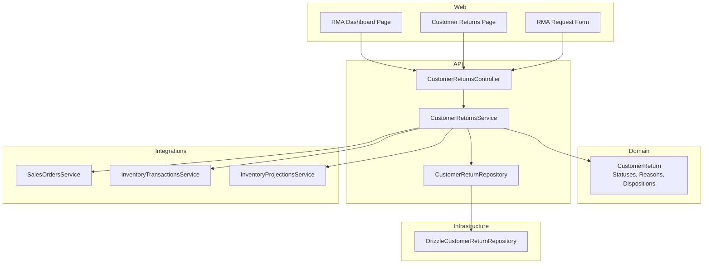
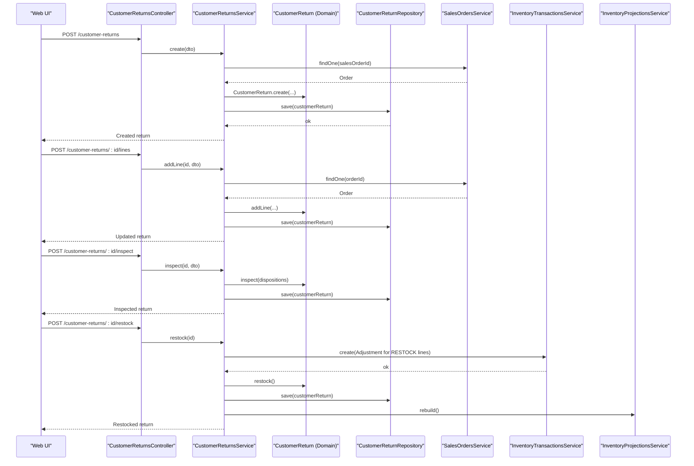
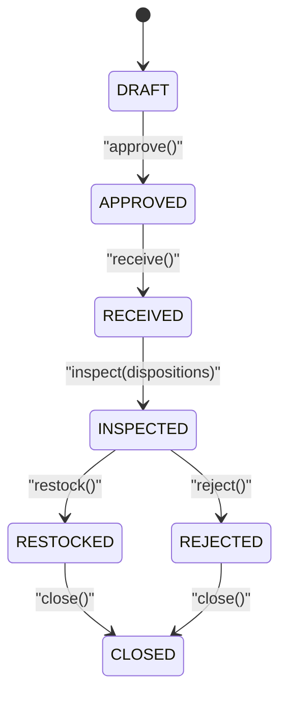
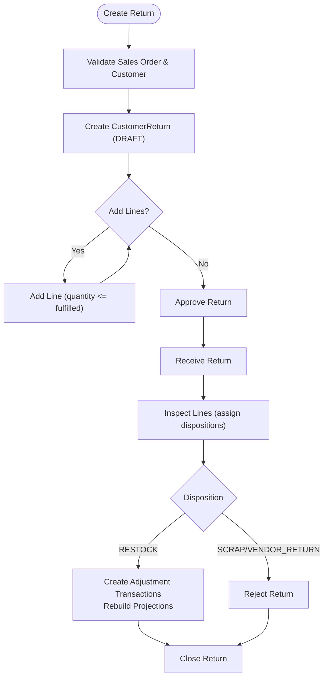
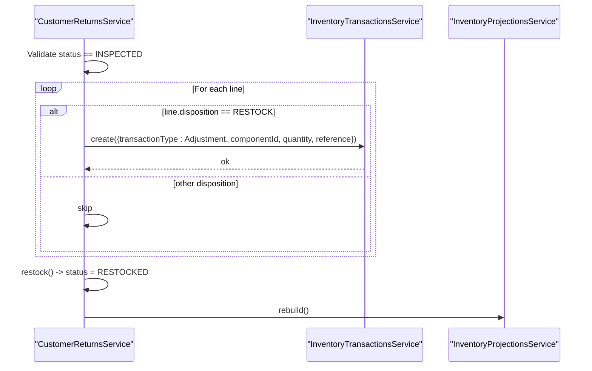
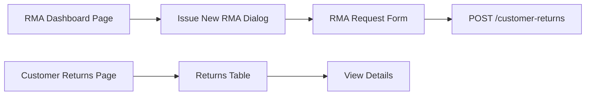
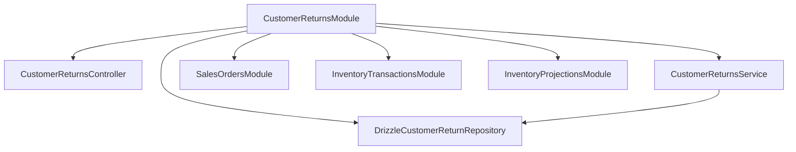

# Customer Returns

<cite>
**Referenced Files in This Document**
- [customer-return.ts](file://packages/sales/src/returns/customer-return.ts)
- [customer-return.repository.ts](file://packages/sales/src/returns/customer-return.repository.ts)
- [drizzle-customer-return.repository.ts](file://apps/api/src/infrastructure/repositories/drizzle-customer-return.repository.ts)
- [customer-returns.controller.ts](file://apps/api/src/customer-returns/customer-returns.controller.ts)
- [customer-returns.service.ts](file://apps/api/src/customer-returns/customer-returns.service.ts)
- [dtos.ts](file://apps/api/src/customer-returns/dtos.ts)
- [customer-returns.module.ts](file://apps/api/src/customer-returns/customer-returns.module.ts)
- [0030-customer-returns.md](file://docs/rfcs/0030-customer-returns.md)
- [page.tsx (RMA dashboard)](file://apps/web/app/rma/page.tsx)
- [page.tsx (Customer Returns page)](file://apps/web/app/customer-returns/page.tsx)
- [rma-request-form.tsx](file://apps/web/components/rma/rma-request-form.tsx)
</cite>

## Table of Contents
1. Introduction
2. Project Structure
3. Core Components
4. Architecture Overview
5. Detailed Component Analysis
6. Dependency Analysis
7. Performance Considerations
8. Troubleshooting Guide
9. Conclusion
10. Appendices

## Introduction
This document explains Ananya ERP’s Customer Returns system, covering the data model, lifecycle, policies, approval workflows, inventory integration, financial impact on accounts receivable, and the API and frontend components used to manage returns end-to-end. It is designed for both technical and non-technical readers, with progressive detail and diagrams that map directly to the codebase.

## Project Structure
The Customer Returns feature spans domain models, application services, repositories, APIs, and UI pages:
- Domain model defines return statuses, reasons, dispositions, and the CustomerReturn aggregate with state transitions.
- Application service orchestrates creation, line addition, approvals, receiving, inspection, restocking, rejection, and closing.
- Repository abstracts persistence and number generation.
- Controller exposes REST endpoints for each lifecycle step.
- Web pages provide dashboards and forms for creating and managing returns.

**Diagram sources**
- [customer-returns.controller.ts:10-66](file://apps/api/src/customer-returns/customer-returns.controller.ts#L10-L66)
- [customer-returns.service.ts:23-31](file://apps/api/src/customer-returns/customer-returns.service.ts#L23-L31)
- [customer-return.ts:3-15](file://packages/sales/src/returns/customer-return.ts#L3-L15)
- [drizzle-customer-return.repository.ts:75-149](file://apps/api/src/infrastructure/repositories/drizzle-customer-return.repository.ts#L75-L149)

**Section sources**
- [customer-returns.controller.ts:10-66](file://apps/api/src/customer-returns/customer-returns.controller.ts#L10-L66)
- [customer-returns.service.ts:23-31](file://apps/api/src/customer-returns/customer-returns.service.ts#L23-L31)
- [customer-return.ts:3-15](file://packages/sales/src/returns/customer-return.ts#L3-L15)
- [drizzle-customer-return.repository.ts:75-149](file://apps/api/src/infrastructure/repositories/drizzle-customer-return.repository.ts#L75-L149)

## Core Components
- Domain model: ReturnStatus, ReturnReason, ReturnDisposition, CustomerReturn aggregate with methods for addLine, approve, receive, inspect, restock, reject, close.
- DTOs: CreateCustomerReturnDto, AddReturnLineDto, InspectReturnDto for request validation.
- Service: Validates inputs, enforces business rules (e.g., quantity limits), coordinates state transitions, integrates with sales orders and inventory.
- Repository: Persistence abstraction, query filters, save operations, next return number generation.
- Controller: REST endpoints for full lifecycle management.
- Web: RMA dashboard and customer returns list pages; RMA request form for initiating returns.

Key responsibilities:
- Enforce return quantity cannot exceed fulfilled quantity on the originating sales order line.
- Ensure state machine transitions are valid before persisting changes.
- Trigger inventory adjustments for restocked items and rebuild projections.

**Section sources**
- [customer-return.ts:55-179](file://packages/sales/src/returns/customer-return.ts#L55-L179)
- [dtos.ts:11-47](file://apps/api/src/customer-returns/dtos.ts#L11-L47)
- [customer-returns.service.ts:33-159](file://apps/api/src/customer-returns/customer-returns.service.ts#L33-L159)
- [customer-return.repository.ts:1-16](file://packages/sales/src/returns/customer-return.repository.ts#L1-L16)
- [drizzle-customer-return.repository.ts:75-149](file://apps/api/src/infrastructure/repositories/drizzle-customer-return.repository.ts#L75-L149)
- [customer-returns.controller.ts:10-66](file://apps/api/src/customer-returns/customer-returns.controller.ts#L10-L66)

## Architecture Overview
The Customer Returns module follows a layered architecture:
- Presentation layer (web pages) calls API endpoints.
- Controller routes requests to the service.
- Service applies domain logic via the CustomerReturn aggregate and persists through the repository.
- Integrations handle side effects: sales order validation and inventory transactions/projections.

**Diagram sources**
- [customer-returns.controller.ts:14-66](file://apps/api/src/customer-returns/customer-returns.controller.ts#L14-L66)
- [customer-returns.service.ts:33-159](file://apps/api/src/customer-returns/customer-returns.service.ts#L33-L159)
- [customer-return.ts:97-179](file://packages/sales/src/returns/customer-return.ts#L97-L179)
- [drizzle-customer-return.repository.ts:100-149](file://apps/api/src/infrastructure/repositories/drizzle-customer-return.repository.ts#L100-L149)

## Detailed Component Analysis

### Data Model and Lifecycle
- ReturnStatus: DRAFT → APPROVED → RECEIVED → INSPECTED → RESTOCKED or REJECTED → CLOSED.
- ReturnReason: DEFECTIVE, WRONG_ITEM, DAMAGED_IN_TRANSIT, EXCESS_ORDER.
- ReturnDisposition: RESTOCK, SCRAP, VENDOR_RETURN.
- CustomerReturn aggregate enforces state transitions and line-level disposition assignment during inspection.

**Diagram sources**
- [customer-return.ts:3-15](file://packages/sales/src/returns/customer-return.ts#L3-L15)
- [customer-return.ts:121-179](file://packages/sales/src/returns/customer-return.ts#L121-L179)
- [0030-customer-returns.md:61-73](file://docs/rfcs/0030-customer-returns.md#L61-L73)

**Section sources**
- [customer-return.ts:3-15](file://packages/sales/src/returns/customer-return.ts#L3-L15)
- [customer-return.ts:121-179](file://packages/sales/src/returns/customer-return.ts#L121-L179)
- [0030-customer-returns.md:15-33](file://docs/rfcs/0030-customer-returns.md#L15-L33)

### API Endpoints and Workflows
Endpoints exposed by the controller:
- POST /customer-returns: Create a new return linked to a sales order and customer.
- GET /customer-returns: List returns with optional filters (customerId, salesOrderId, status).
- GET /customer-returns/:id: Retrieve a single return.
- POST /customer-returns/:id/lines: Add return lines referencing sales order lines and components.
- POST /customer-returns/:id/approve: Approve a draft return.
- POST /customer-returns/:id/receive: Mark as received by warehouse.
- POST /customer-returns/:id/inspect: Assign dispositions per line.
- POST /customer-returns/:id/restock: Reinstates stock for RESTOCK lines and updates projections.
- POST /customer-returns/:id/reject: Reject an inspected or received return.
- POST /customer-returns/:id/close: Close after restocked or rejected.

**Diagram sources**
- [customer-returns.controller.ts:14-66](file://apps/api/src/customer-returns/customer-returns.controller.ts#L14-L66)
- [customer-returns.service.ts:33-159](file://apps/api/src/customer-returns/customer-returns.service.ts#L33-L159)
- [customer-return.ts:97-179](file://packages/sales/src/returns/customer-return.ts#L97-L179)

**Section sources**
- [customer-returns.controller.ts:10-66](file://apps/api/src/customer-returns/customer-returns.controller.ts#L10-L66)
- [customer-returns.service.ts:33-159](file://apps/api/src/customer-returns/customer-returns.service.ts#L33-L159)

### Inventory Integration and Stock Restoration
- During restock, for each line with disposition RESTOCK, the service creates an inventory adjustment transaction referencing the return number.
- After saving the return as RESTOCKED, inventory projections are rebuilt to reflect updated availability.

**Diagram sources**
- [customer-returns.service.ts:114-143](file://apps/api/src/customer-returns/customer-returns.service.ts#L114-L143)

**Section sources**
- [customer-returns.service.ts:114-143](file://apps/api/src/customer-returns/customer-returns.service.ts#L114-L143)

### Financial Impact on Accounts Receivable
- The current implementation focuses on return authorization, inspection, and inventory adjustments.
- Credit/refund posting to accounts receivable is not explicitly implemented in the customer returns service; future extensions can integrate with receivable invoices to issue credit notes and adjust balances upon return completion.

[No sources needed since this section provides general guidance based on observed implementation]

### Frontend Components for Return Management
- RMA Dashboard page lists active RMA requests, shows metrics, and opens a dialog to issue new RMAs.
- Customer Returns page displays a table of returns with status badges and actions.
- RMA Request Form validates input fields and submits to the API to create a return request.

**Diagram sources**
- [page.tsx (RMA dashboard):93-144](file://apps/web/app/rma/page.tsx#L93-L144)
- [page.tsx (Customer Returns page):40-166](file://apps/web/app/customer-returns/page.tsx#L40-L166)
- [rma-request-form.tsx:18-66](file://apps/web/components/rma/rma-request-form.tsx#L18-L66)

**Section sources**
- [page.tsx (RMA dashboard):93-144](file://apps/web/app/rma/page.tsx#L93-L144)
- [page.tsx (Customer Returns page):40-166](file://apps/web/app/customer-returns/page.tsx#L40-L166)
- [rma-request-form.tsx:18-66](file://apps/web/components/rma/rma-request-form.tsx#L18-L66)

## Dependency Analysis
Module wiring and dependencies:
- CustomerReturnsModule imports SalesOrdersModule, InventoryTransactionsModule, InventoryProjectionsModule.
- Provides DrizzleCustomerReturnRepository as the implementation of CustomerReturnRepository.
- Controller depends on CustomerReturnsService; Service depends on domain aggregate and integrations.

**Diagram sources**
- [customer-returns.module.ts:12-26](file://apps/api/src/customer-returns/customer-returns.module.ts#L12-L26)

**Section sources**
- [customer-returns.module.ts:12-26](file://apps/api/src/customer-returns/customer-returns.module.ts#L12-L26)

## Performance Considerations
- Batched queries: Repository loads return lines per return; consider eager loading or batch joins if performance degrades with large datasets.
- Projection rebuild: Restocking triggers a full projection rebuild; schedule or throttle rebuilds if volume is high.
- Validation overhead: Service validates sales order lines per addLine; cache order lookups where appropriate to reduce repeated calls.

[No sources needed since this section provides general guidance]

## Troubleshooting Guide
Common errors and handling:
- Invalid state transitions: Domain methods enforce allowed transitions; ensure correct sequence (e.g., inspect only from RECEIVED, restock only from INSPECTED).
- Quantity exceeded: Adding a return line must not exceed the fulfilled quantity on the sales order line; validate before submission.
- Missing references: Creating or adding lines requires valid salesOrderId and salesOrderLineId; verify IDs exist.
- Not found: Retrieving a return by id throws a not found error when missing; check IDs and persistence.

Operational checks:
- Verify inventory adjustment transactions are created for RESTOCK lines.
- Confirm inventory projections are rebuilt after restocking.

**Section sources**
- [customer-return.ts:97-179](file://packages/sales/src/returns/customer-return.ts#L97-L179)
- [customer-returns.service.ts:71-91](file://apps/api/src/customer-returns/customer-returns.service.ts#L71-L91)
- [customer-returns.service.ts:107-112](file://apps/api/src/customer-returns/customer-returns.service.ts#L107-L112)
- [customer-returns.service.ts:114-143](file://apps/api/src/customer-returns/customer-returns.service.ts#L114-L143)

## Conclusion
Ananya ERP’s Customer Returns system provides a robust, stateful workflow for authorizing, receiving, inspecting, and processing returns with clear integration points into inventory. While credit/refund posting to accounts receivable is not yet implemented within this module, the foundation is in place for future financial integrations. The API and web interfaces enable efficient management of returns from initiation to closure.

[No sources needed since this section summarizes without analyzing specific files]

## Appendices

### Practical Examples

- Creating a return request:
  - Use POST /customer-returns with customerId, salesOrderId, and optional notes.
  - The service validates the sales order customer and generates a unique return number.

- Adding return lines:
  - Use POST /customer-returns/:id/lines with salesOrderLineId, componentId, quantity, and reason.
  - The service ensures quantity does not exceed the fulfilled quantity on the referenced sales order line.

- Processing returns:
  - Approve: POST /customer-returns/:id/approve
  - Receive: POST /customer-returns/:id/receive
  - Inspect: POST /customer-returns/:id/inspect with dispositions mapping line ids to RESTOCK, SCRAP, or VENDOR_RETURN.

- Issuing refunds/credits:
  - Current implementation focuses on inventory adjustments; credit memo issuance to accounts receivable can be added as an extension post-close.

- Managing analytics:
  - Use GET /customer-returns with filters (customerId, salesOrderId, status) to build dashboards and reports.
  - Frontend pages demonstrate listing and filtering returns for operational insights.

**Section sources**
- [customer-returns.controller.ts:14-66](file://apps/api/src/customer-returns/customer-returns.controller.ts#L14-L66)
- [customer-returns.service.ts:33-159](file://apps/api/src/customer-returns/customer-returns.service.ts#L33-L159)
- [page.tsx (Customer Returns page):40-166](file://apps/web/app/customer-returns/page.tsx#L40-L166)