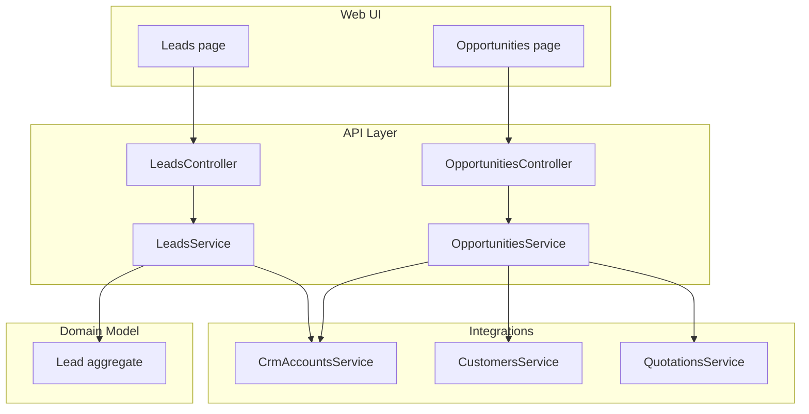
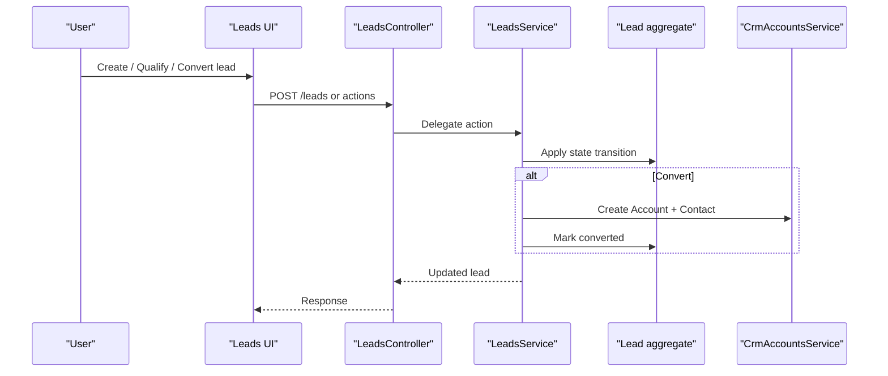
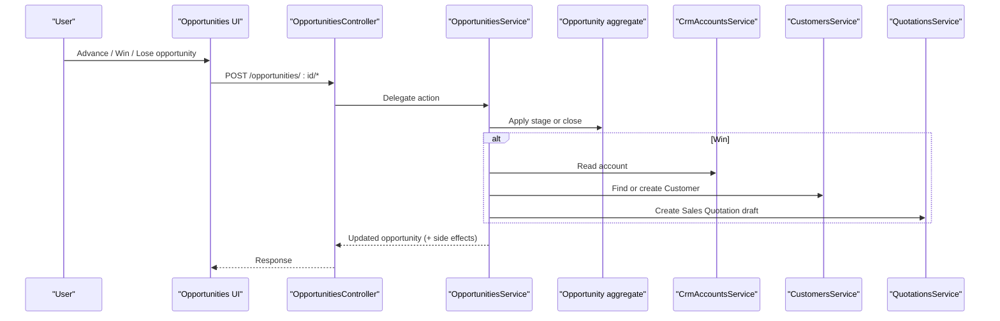
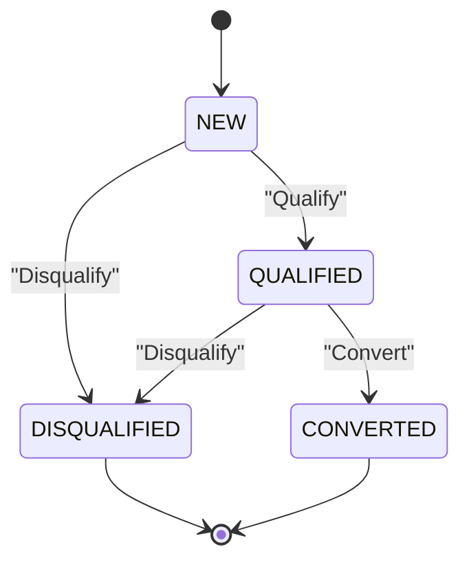
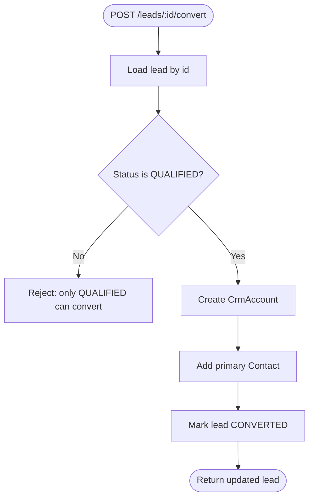
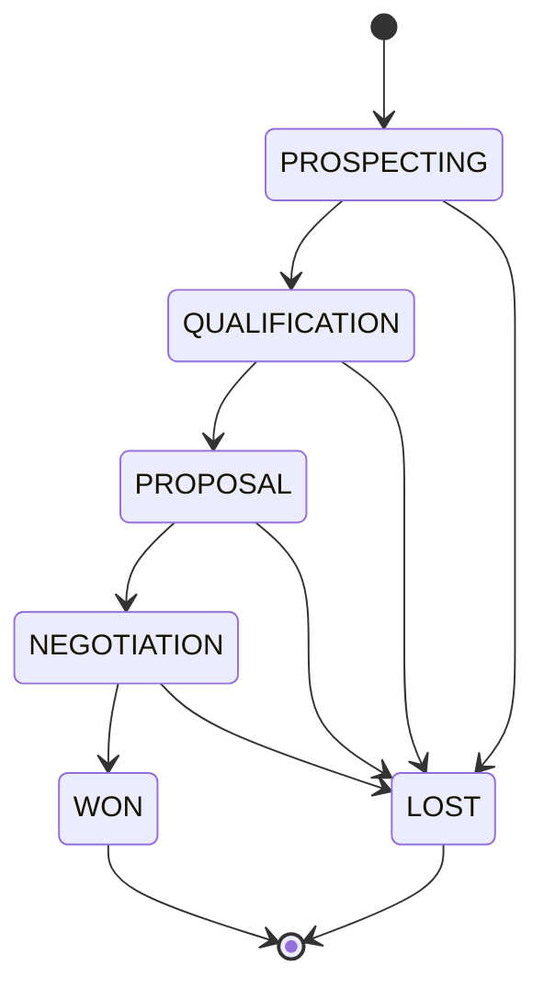
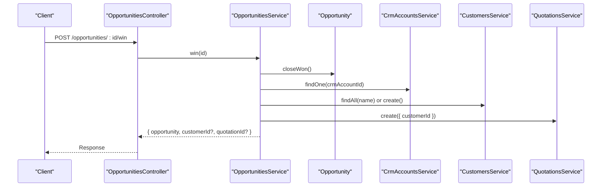
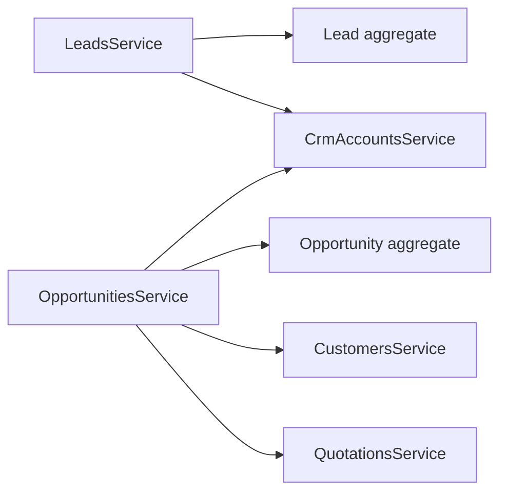

# Lead & Opportunity Management

<cite>
**Referenced Files in This Document**
- [0036-lead-management.md](file://docs/rfcs/0036-lead-management.md)
- [0038-opportunities-and-pipeline.md](file://docs/rfcs/0038-opportunities-and-pipeline.md)
- [leads.controller.ts](file://apps/api/src/leads/leads.controller.ts)
- [leads.service.ts](file://apps/api/src/leads/leads.service.ts)
- [dtos.ts (Leads)](file://apps/api/src/leads/dtos.ts)
- [opportunities.controller.ts](file://apps/api/src/opportunities/opportunities.controller.ts)
- [opportunities.service.ts](file://apps/api/src/opportunities/opportunities.service.ts)
- [dtos.ts (Opportunities)](file://apps/api/src/opportunities/dtos.ts)
- [lead.ts](file://packages/crm/src/leads/lead.ts)
- [page.tsx (Leads UI)](file://apps/web/app/leads/page.tsx)
- [page.tsx (Lead Detail UI)](file://apps/web/app/leads/[id]/page.tsx)
- [page.tsx (Opportunities UI)](file://apps/web/app/opportunities/page.tsx)
- [api.ts (Frontend API client)](file://apps/web/src/lib/api.ts)
</cite>

## Table of Contents
1. Introduction
2. Project Structure
3. Core Components
4. Architecture Overview
5. Detailed Component Analysis
6. Dependency Analysis
7. Performance Considerations
8. Troubleshooting Guide
9. Conclusion
10. Appendices

## Introduction
This document explains Ananya ERP’s Lead and Opportunity Management system, covering the end-to-end lifecycle from initial contact through qualification, conversion to opportunities, and pipeline tracking to closing. It documents data models, status and stage transitions, API endpoints, frontend interfaces, integrations with customer records, and sales forecasting considerations.

## Project Structure
The feature spans three layers:
- Domain model in the CRM package (Lead aggregate and value types)
- API layer in NestJS controllers/services for leads and opportunities
- Web UI pages for listing and managing leads and opportunities

**Diagram sources**
- [leads.controller.ts:1-49](file://apps/api/src/leads/leads.controller.ts#L1-L49)
- [leads.service.ts:1-99](file://apps/api/src/leads/leads.service.ts#L1-L99)
- [opportunities.controller.ts:1-51](file://apps/api/src/opportunities/opportunities.controller.ts#L1-L51)
- [opportunities.service.ts:1-135](file://apps/api/src/opportunities/opportunities.service.ts#L1-L135)
- [lead.ts:1-137](file://packages/crm/src/leads/lead.ts#L1-L137)

**Section sources**
- [leads.controller.ts:1-49](file://apps/api/src/leads/leads.controller.ts#L1-L49)
- [leads.service.ts:1-99](file://apps/api/src/leads/leads.service.ts#L1-L99)
- [opportunities.controller.ts:1-51](file://apps/api/src/opportunities/opportunities.controller.ts#L1-L51)
- [opportunities.service.ts:1-135](file://apps/api/src/opportunities/opportunities.service.ts#L1-L135)
- [lead.ts:1-137](file://packages/crm/src/leads/lead.ts#L1-L137)

## Core Components
- Leads domain model defines statuses and lifecycle methods for assignment, qualification, disqualification, and conversion.
- Leads API exposes endpoints to create, list, assign, qualify, disqualify, and convert leads. Conversion creates a CRM account and primary contact.
- Opportunities domain model defines pipeline stages and closing behaviors.
- Opportunities API exposes endpoints to create, list, advance stages, win, and lose opportunities. Winning integrates with customers and quotations to draft a sales quotation.

Key responsibilities:
- LeadsService orchestrates lead lifecycle and cross-module creation of accounts/contacts on conversion.
- OpportunitiesService manages pipeline progression and triggers downstream sales artifacts when an opportunity is won.

**Section sources**
- [lead.ts:1-137](file://packages/crm/src/leads/lead.ts#L1-L137)
- [leads.controller.ts:1-49](file://apps/api/src/leads/leads.controller.ts#L1-L49)
- [leads.service.ts:1-99](file://apps/api/src/leads/leads.service.ts#L1-L99)
- [opportunities.controller.ts:1-51](file://apps/api/src/opportunities/opportunities.controller.ts#L1-L51)
- [opportunities.service.ts:1-135](file://apps/api/src/opportunities/opportunities.service.ts#L1-L135)

## Architecture Overview
End-to-end flows:

**Diagram sources**
- [leads.controller.ts:10-48](file://apps/api/src/leads/leads.controller.ts#L10-L48)
- [leads.service.ts:16-97](file://apps/api/src/leads/leads.service.ts#L16-L97)
- [lead.ts:98-137](file://packages/crm/src/leads/lead.ts#L98-L137)

**Diagram sources**
- [opportunities.controller.ts:14-49](file://apps/api/src/opportunities/opportunities.controller.ts#L14-L49)
- [opportunities.service.ts:34-133](file://apps/api/src/opportunities/opportunities.service.ts#L34-L133)

## Detailed Component Analysis

### Lead Lifecycle and Data Model
- Statuses: NEW, QUALIFIED, DISQUALIFIED, CONVERTED
- Source: WEBSITE, REFERRAL, TRADE_SHOW, COLD_OUTREACH, INBOUND_PHONE
- Key operations:
  - Assign owner (guarded by non-converted/disqualified states)
  - Qualify (only from NEW)
  - Disqualify (with reason; blocked if already converted)
  - Convert (only from QUALIFIED; links to CRM account)

**Diagram sources**
- [lead.ts:3-6](file://packages/crm/src/leads/lead.ts#L3-L6)
- [lead.ts:108-137](file://packages/crm/src/leads/lead.ts#L108-L137)
- [0036-lead-management.md:64-70](file://docs/rfcs/0036-lead-management.md#L64-L70)

**Section sources**
- [lead.ts:1-137](file://packages/crm/src/leads/lead.ts#L1-L137)
- [0036-lead-management.md:1-108](file://docs/rfcs/0036-lead-management.md#L1-L108)

### Lead API Endpoints
- POST /leads — Create a new lead
- GET /leads — List with optional filters: status, source, owner, search
- GET /leads/:id — Retrieve a lead
- POST /leads/:id/assign — Reassign owner
- POST /leads/:id/qualify — Move to qualified
- POST /leads/:id/disqualify — Disqualify with reason
- POST /leads/:id/convert — Convert to CRM account and contact

Request/response payloads are defined by DTOs in the leads module.

**Section sources**
- [leads.controller.ts:10-48](file://apps/api/src/leads/leads.controller.ts#L10-L48)
- [dtos.ts (Leads):1-44](file://apps/api/src/leads/dtos.ts#L1-L44)

### Lead Conversion Flow
Conversion creates a CRM account and a primary contact, then marks the lead as converted.

**Diagram sources**
- [leads.service.ts:70-97](file://apps/api/src/leads/leads.service.ts#L70-L97)
- [lead.ts:127-137](file://packages/crm/src/leads/lead.ts#L127-L137)

**Section sources**
- [leads.service.ts:70-97](file://apps/api/src/leads/leads.service.ts#L70-L97)

### Opportunity Pipeline and Data Model
- Stages: PROSPECTING, QUALIFICATION, PROPOSAL, NEGOTIATION, WON, LOST
- Invariants: estimated value non-negative; probability between 0–100%; closed stages cannot change
- Operations:
  - Create opportunity (linked to CRM account; optional lead reference)
  - Advance stage
  - Close won (triggers customer lookup/creation and quotation draft)
  - Close lost (with reason)

**Diagram sources**
- [0038-opportunities-and-pipeline.md:62-68](file://docs/rfcs/0038-opportunities-and-pipeline.md#L62-L68)

**Section sources**
- [0038-opportunities-and-pipeline.md:1-105](file://docs/rfcs/0038-opportunities-and-pipeline.md#L1-L105)

### Opportunity API Endpoints
- POST /opportunities — Create opportunity
- GET /opportunities — List with optional filters: crmAccountId, stage, search
- GET /opportunities/:id — Retrieve an opportunity
- POST /opportunities/:id/advance — Advance to next stage
- POST /opportunities/:id/win — Close won
- POST /opportunities/:id/lose — Close lost with reason

Payloads are validated via DTOs in the opportunities module.

**Section sources**
- [opportunities.controller.ts:14-49](file://apps/api/src/opportunities/opportunities.controller.ts#L14-L49)
- [dtos.ts (Opportunities):1-48](file://apps/api/src/opportunities/dtos.ts#L1-L48)

### Opportunity Win Flow and Integrations
Winning an opportunity:
- Persists the closed-won state
- Attempts to find or create a Sales Customer linked to the CRM account
- Creates a Sales Quotation draft
- Errors during handoff are tolerated to avoid blocking the close

**Diagram sources**
- [opportunities.service.ts:81-125](file://apps/api/src/opportunities/opportunities.service.ts#L81-L125)

**Section sources**
- [opportunities.service.ts:81-125](file://apps/api/src/opportunities/opportunities.service.ts#L81-L125)

### Frontend Interfaces
- Leads list page shows key fields, status badges, filters, and navigation to detail view.
- Lead detail page provides quick actions such as converting a lead.
- Opportunities list page displays deal name, account, expected value, probability, stage, and target close date with filtering.

These pages integrate with the backend via the frontend API client.

**Section sources**
- [page.tsx (Leads UI):1-200](file://apps/web/app/leads/page.tsx#L1-L200)
- [page.tsx (Lead Detail UI):1-34](file://apps/web/app/leads/[id]/page.tsx#L1-L34)
- [page.tsx (Opportunities UI):1-188](file://apps/web/app/opportunities/page.tsx#L1-L188)
- [api.ts (Frontend API client):1348-1394](file://apps/web/src/lib/api.ts#L1348-L1394)

## Dependency Analysis
- LeadsService depends on:
  - LeadRepository (via DI token)
  - CrmAccountsService for account/contact creation on conversion
- OpportunitiesService depends on:
  - OpportunityRepository (via DI token)
  - CrmAccountsService for account lookups
  - CustomersService for customer creation/lookup
  - QuotationsService to draft a quotation on win

**Diagram sources**
- [leads.service.ts:1-99](file://apps/api/src/leads/leads.service.ts#L1-L99)
- [opportunities.service.ts:1-135](file://apps/api/src/opportunities/opportunities.service.ts#L1-L135)

**Section sources**
- [leads.service.ts:1-99](file://apps/api/src/leads/leads.service.ts#L1-L99)
- [opportunities.service.ts:1-135](file://apps/api/src/opportunities/opportunities.service.ts#L1-L135)

## Performance Considerations
- Use repository-level filtering for lists (status, source, owner, search for leads; crmAccountId, stage, search for opportunities) to minimize payload size.
- Avoid unnecessary reads in hot paths; cache CRM account details where appropriate.
- On opportunity win, handle customer/quotation creation asynchronously if possible to reduce latency for the user.
- Validate inputs early at the controller/DTO layer to fail fast and reduce database round-trips.

[No sources needed since this section provides general guidance]

## Troubleshooting Guide
Common issues and resolutions:
- Cannot qualify a lead not in NEW: Ensure the lead status is NEW before calling qualify.
- Cannot convert a lead not in QUALIFIED: Only QUALIFIED leads may be converted.
- Cannot reassign owner after conversion or disqualification: Owner changes are blocked in those states.
- Opportunity win fails due to missing sales setup: The service tolerates errors; verify that CRM account exists and sales modules are configured.

Validation and error handling:
- DTOs enforce required fields and value constraints (e.g., non-negative estimated value).
- Services throw explicit errors for invalid state transitions and return 404 for not found resources.

**Section sources**
- [lead.ts:98-137](file://packages/crm/src/leads/lead.ts#L98-L137)
- [dtos.ts (Leads):1-44](file://apps/api/src/leads/dtos.ts#L1-L44)
- [dtos.ts (Opportunities):1-48](file://apps/api/src/opportunities/dtos.ts#L1-L48)
- [leads.service.ts:41-67](file://apps/api/src/leads/leads.service.ts#L41-L67)
- [opportunities.service.ts:63-79](file://apps/api/src/opportunities/opportunities.service.ts#L63-L79)

## Conclusion
Ananya ERP’s Lead and Opportunity Management provides a robust, state-driven workflow for capturing prospects, qualifying them, converting to CRM accounts, and tracking deals through a well-defined pipeline. The system integrates tightly with CRM and sales modules to automate downstream processes like customer creation and quotation drafting, while maintaining clear boundaries and validation rules.

[No sources needed since this section summarizes without analyzing specific files]

## Appendices

### Practical Examples

- Create a lead
  - Endpoint: POST /leads
  - Body fields: name, company, email (optional), phone (optional), source (optional), industry (optional), owner
  - Reference: [leads.controller.ts:10-13](file://apps/api/src/leads/leads.controller.ts#L10-L13), [dtos.ts (Leads):4-32](file://apps/api/src/leads/dtos.ts#L4-L32)

- Assign a lead
  - Endpoint: POST /leads/:id/assign
  - Body: owner
  - Reference: [leads.controller.ts:30-33](file://apps/api/src/leads/leads.controller.ts#L30-L33), [dtos.ts (Leads):34-38](file://apps/api/src/leads/dtos.ts#L34-L38)

- Qualify a lead
  - Endpoint: POST /leads/:id/qualify
  - Reference: [leads.controller.ts:35-38](file://apps/api/src/leads/leads.controller.ts#L35-L38)

- Disqualify a lead
  - Endpoint: POST /leads/:id/disqualify
  - Body: reason
  - Reference: [leads.controller.ts:40-43](file://apps/api/src/leads/leads.controller.ts#L40-L43), [dtos.ts (Leads):40-44](file://apps/api/src/leads/dtos.ts#L40-L44)

- Convert a lead
  - Endpoint: POST /leads/:id/convert
  - Side effects: Creates CRM account and primary contact; marks lead converted
  - Reference: [leads.controller.ts:45-48](file://apps/api/src/leads/leads.controller.ts#L45-L48), [leads.service.ts:70-97](file://apps/api/src/leads/leads.service.ts#L70-L97)

- Create an opportunity
  - Endpoint: POST /opportunities
  - Body fields: name, leadId (optional), crmAccountId, estimatedValue, expectedCloseDate, probability (optional)
  - Reference: [opportunities.controller.ts:14-17](file://apps/api/src/opportunities/opportunities.controller.ts#L14-L17), [dtos.ts (Opportunities):11-35](file://apps/api/src/opportunities/dtos.ts#L11-L35)

- Advance opportunity stage
  - Endpoint: POST /opportunities/:id/advance
  - Body: stage
  - Reference: [opportunities.controller.ts:33-39](file://apps/api/src/opportunities/opportunities.controller.ts#L33-L39), [dtos.ts (Opportunities):37-41](file://apps/api/src/opportunities/dtos.ts#L37-L41)

- Close opportunity won
  - Endpoint: POST /opportunities/:id/win
  - Side effects: Attempts customer creation and quotation draft
  - Reference: [opportunities.controller.ts:41-44](file://apps/api/src/opportunities/opportunities.controller.ts#L41-L44), [opportunities.service.ts:81-125](file://apps/api/src/opportunities/opportunities.service.ts#L81-L125)

- Close opportunity lost
  - Endpoint: POST /opportunities/:id/lose
  - Body: reason
  - Reference: [opportunities.controller.ts:46-49](file://apps/api/src/opportunities/opportunities.controller.ts#L46-L49), [dtos.ts (Opportunities):43-47](file://apps/api/src/opportunities/dtos.ts#L43-L47)

### Data Models Summary

- Lead
  - Fields: id, leadNumber, name, company, email, phone, source, industry, owner, status, disqualificationReason, convertedAccountId, createdAt, updatedAt
  - Reference: [lead.ts:8-23](file://packages/crm/src/leads/lead.ts#L8-L23)

- Opportunity
  - Fields: id, opportunityNumber, leadId, crmAccountId, name, estimatedValue, expectedCloseDate, probability, stage, lostReason, createdAt, updatedAt
  - Reference: [0038-opportunities-and-pipeline.md:80-83](file://docs/rfcs/0038-opportunities-and-pipeline.md#L80-L83)

### Relationships
- Lead → CRM Account: Conversion links a lead to a CRM account and primary contact.
- Opportunity → CRM Account: Each opportunity is tied to a CRM account; winning may create or reuse a Sales Customer and generate a quotation.

**Section sources**
- [lead.ts:8-23](file://packages/crm/src/leads/lead.ts#L8-L23)
- [0038-opportunities-and-pipeline.md:80-83](file://docs/rfcs/0038-opportunities-and-pipeline.md#L80-L83)
- [leads.service.ts:70-97](file://apps/api/src/leads/leads.service.ts#L70-L97)
- [opportunities.service.ts:81-125](file://apps/api/src/opportunities/opportunities.service.ts#L81-L125)