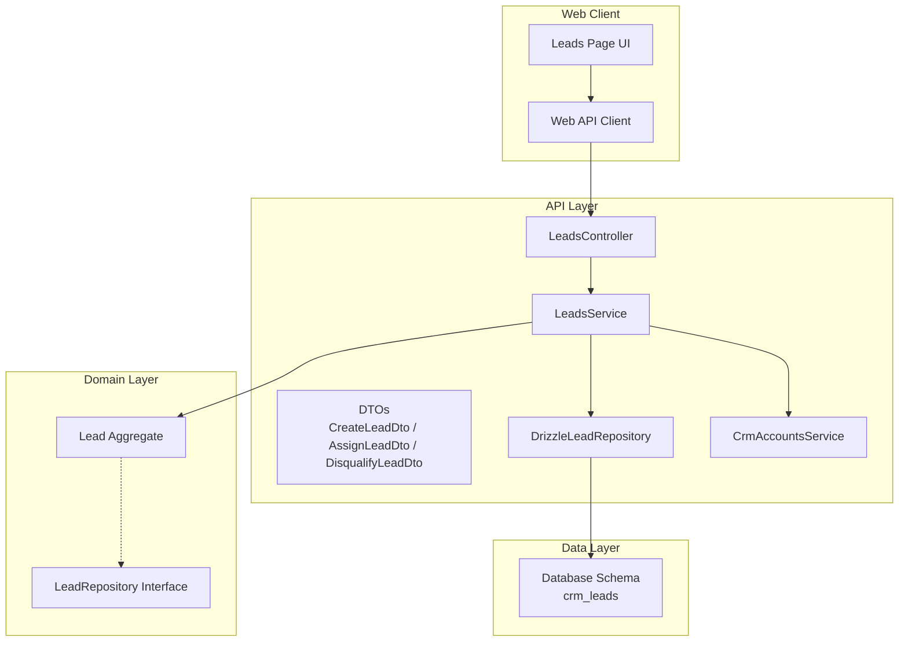
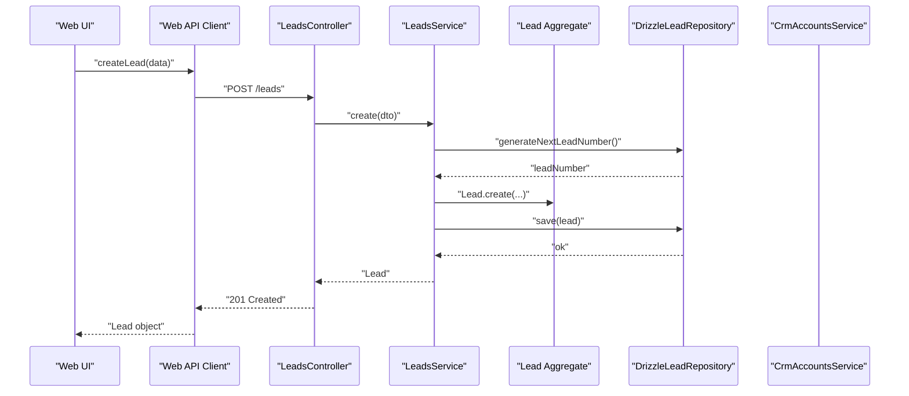
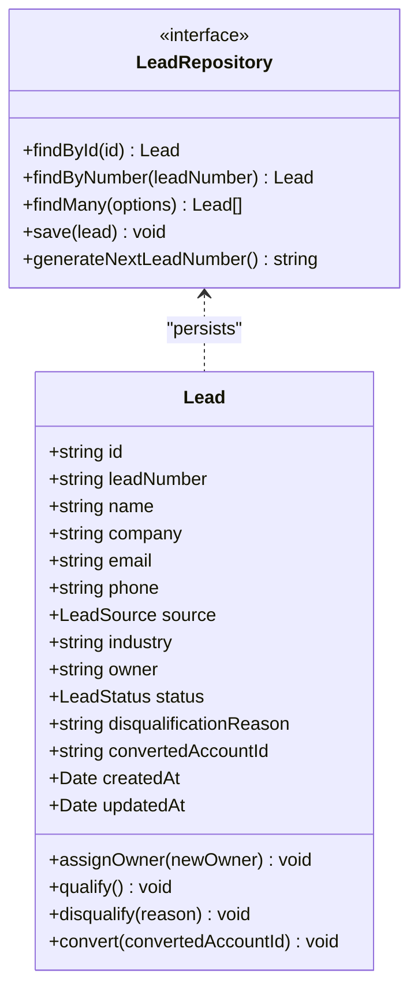
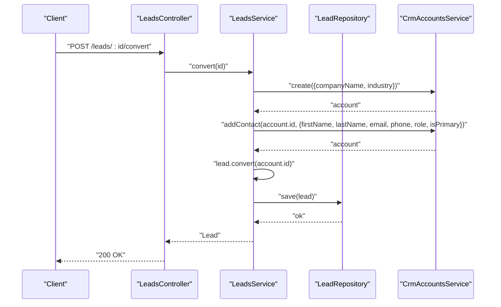
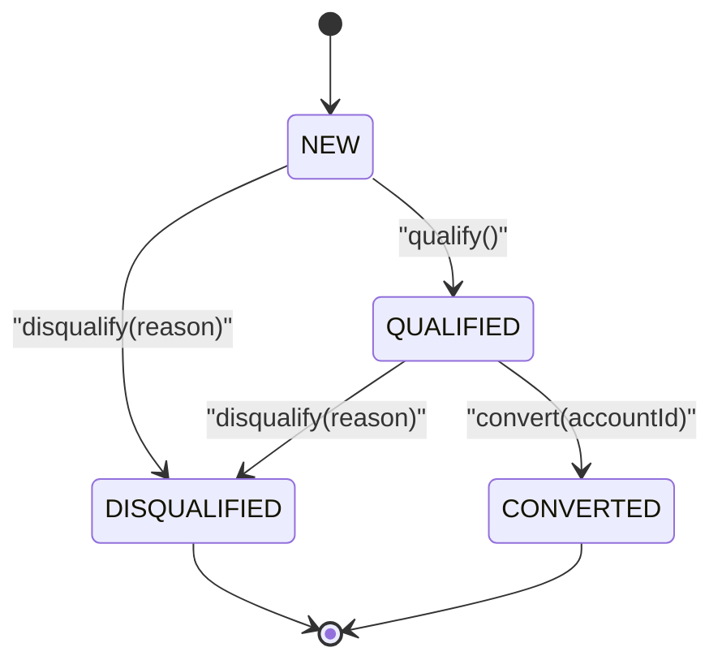
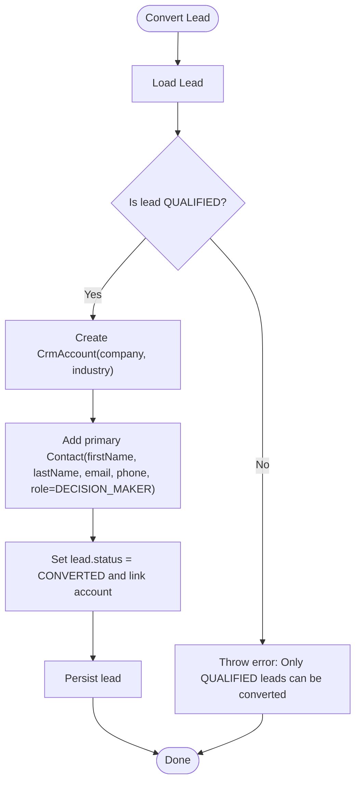
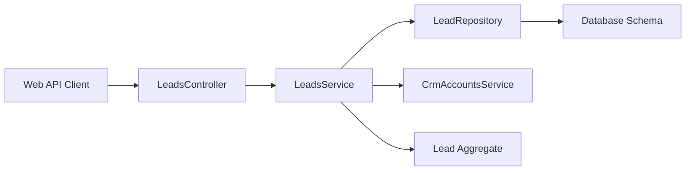

# Lead Management

<cite>
**Referenced Files in This Document**
- [0036-lead-management.md](file://docs/rfcs/0036-lead-management.md)
- [leads.controller.ts](file://apps/api/src/leads/leads.controller.ts)
- [leads.service.ts](file://apps/api/src/leads/leads.service.ts)
- [dtos.ts](file://apps/api/src/leads/dtos.ts)
- [drizzle-lead.repository.ts](file://apps/api/src/infrastructure/repositories/drizzle-lead.repository.ts)
- [crm-accounts.service.ts](file://apps/api/src/crm-accounts/crm-accounts.service.ts)
- [lead.ts](file://packages/crm/src/leads/lead.ts)
- [lead.repository.ts](file://packages/crm/src/leads/lead.repository.ts)
- [index.ts (CRM leads)](file://packages/crm/src/leads/index.ts)
- [api.ts (Web client)](file://apps/web/src/lib/api.ts)
- [page.tsx (Leads UI)](file://apps/web/app/leads/page.tsx)
</cite>

## Table of Contents
1. [Introduction](#introduction)
2. [Project Structure](#project-structure)
3. [Core Components](#core-components)
4. [Architecture Overview](#architecture-overview)
5. [Detailed Component Analysis](#detailed-component-analysis)
6. [Dependency Analysis](#dependency-analysis)
7. [Performance Considerations](#performance-considerations)
8. [Troubleshooting Guide](#troubleshooting-guide)
9. [Conclusion](#conclusion)
10. [Appendices](#appendices)

## Introduction
This document explains Ananya ERP’s Lead Management system within the CRM bounded context. It covers the complete lead lifecycle: creation, assignment, qualification, disqualification, and conversion to CRM Accounts and Contacts. It also documents status management, source tracking, data models, API endpoints, and integration points with customer records. The RFC defines the domain model, state machine, and cross-module integration rules that guide implementation.

## Project Structure
Lead Management spans multiple layers:
- Domain model and types in the CRM package
- API controllers, services, DTOs, and repository in the API layer
- Web client utilities for calling the API
- UI page for listing and navigating leads
- RFC design document defining behavior and constraints

**Diagram sources**
- [leads.controller.ts:6-48](file://apps/api/src/leads/leads.controller.ts#L6-L48)
- [leads.service.ts:8-97](file://apps/api/src/leads/leads.service.ts#L8-L97)
- [dtos.ts:4-44](file://apps/api/src/leads/dtos.ts#L4-L44)
- [drizzle-lead.repository.ts:32-116](file://apps/api/src/infrastructure/repositories/drizzle-lead.repository.ts#L32-L116)
- [crm-accounts.service.ts:8-50](file://apps/api/src/crm-accounts/crm-accounts.service.ts#L8-L50)
- [lead.ts:36-136](file://packages/crm/src/leads/lead.ts#L36-L136)
- [lead.repository.ts:10-16](file://packages/crm/src/leads/lead.repository.ts#L10-L16)
- [api.ts (Web client):1348-1394](file://apps/web/src/lib/api.ts#L1348-L1394)
- [page.tsx (Leads UI):54-199](file://apps/web/app/leads/page.tsx#L54-L199)

**Section sources**
- [0036-lead-management.md:1-108](file://docs/rfcs/0036-lead-management.md#L1-L108)
- [leads.controller.ts:6-48](file://apps/api/src/leads/leads.controller.ts#L6-L48)
- [leads.service.ts:8-97](file://apps/api/src/leads/leads.service.ts#L8-L97)
- [drizzle-lead.repository.ts:32-116](file://apps/api/src/infrastructure/repositories/drizzle-lead.repository.ts#L32-L116)
- [crm-accounts.service.ts:8-50](file://apps/api/src/crm-accounts/crm-accounts.service.ts#L8-L50)
- [lead.ts:36-136](file://packages/crm/src/leads/lead.ts#L36-L136)
- [lead.repository.ts:10-16](file://packages/crm/src/leads/lead.repository.ts#L10-L16)
- [api.ts (Web client):1348-1394](file://apps/web/src/lib/api.ts#L1348-L1394)
- [page.tsx (Leads UI):54-199](file://apps/web/app/leads/page.tsx#L54-L199)

## Core Components
- Lead aggregate: Encapsulates lead identity, contact details, source attribution, ownership, status transitions, and conversion linkage.
- Leads controller: Exposes REST endpoints for CRUD and lifecycle actions.
- Leads service: Orchestrates business operations, integrates with CRM accounts on conversion, and persists via repository.
- DTOs: Validate input for create, assign, and disqualify operations.
- Repository: Persists leads and supports filtering by status, source, owner, and search terms.
- CRM accounts service: Creates accounts and contacts during lead conversion.
- Web client: Provides typed functions to call lead endpoints from the frontend.
- UI: Lists leads, shows status badges, and provides navigation to detail views.

Key responsibilities:
- Create: Generate a unique lead number, validate inputs, persist new lead in NEW status.
- Assign: Update owner while respecting lifecycle constraints.
- Qualify: Transition from NEW to QUALIFIED.
- Disqualify: Transition to DISQUALIFIED with reason.
- Convert: Create CRM Account and primary Contact, then mark lead as CONVERTED.

**Section sources**
- [lead.ts:36-136](file://packages/crm/src/leads/lead.ts#L36-L136)
- [leads.controller.ts:6-48](file://apps/api/src/leads/leads.controller.ts#L6-L48)
- [leads.service.ts:16-97](file://apps/api/src/leads/leads.service.ts#L16-L97)
- [dtos.ts:4-44](file://apps/api/src/leads/dtos.ts#L4-L44)
- [drizzle-lead.repository.ts:32-116](file://apps/api/src/infrastructure/repositories/drizzle-lead.repository.ts#L32-L116)
- [crm-accounts.service.ts:14-43](file://apps/api/src/crm-accounts/crm-accounts.service.ts#L14-L43)
- [api.ts (Web client):1348-1394](file://apps/web/src/lib/api.ts#L1348-L1394)
- [page.tsx (Leads UI):54-199](file://apps/web/app/leads/page.tsx#L54-L199)

## Architecture Overview
The Lead Management feature follows a layered architecture:
- Presentation: Web UI lists leads and navigates to details.
- Application: Controller receives HTTP requests; Service coordinates domain logic and cross-module calls.
- Domain: Lead aggregate enforces state transitions and invariants.
- Infrastructure: Repository implements persistence using Drizzle ORM against the database schema.

**Diagram sources**
- [leads.controller.ts:10-13](file://apps/api/src/leads/leads.controller.ts#L10-L13)
- [leads.service.ts:16-29](file://apps/api/src/leads/leads.service.ts#L16-L29)
- [drizzle-lead.repository.ts:111-116](file://apps/api/src/infrastructure/repositories/drizzle-lead.repository.ts#L111-L116)
- [lead.ts:69-92](file://packages/crm/src/leads/lead.ts#L69-L92)
- [api.ts (Web client):1364-1376](file://apps/web/src/lib/api.ts#L1364-L1376)

## Detailed Component Analysis

### Lead Data Model and Lifecycle
The Lead aggregate defines the canonical data model and lifecycle methods:
- Properties include identifier, lead number, name, company, optional email and phone, source, industry, owner, status, optional disqualification reason, optional converted account ID, and timestamps.
- Statuses: NEW, QUALIFIED, DISQUALIFIED, CONVERTED.
- Sources: WEBSITE, REFERRAL, TRADE_SHOW, COLD_OUTREACH, INBOUND_PHONE.
- Lifecycle methods:
  - assignOwner(newOwner): Updates owner unless already DISQUALIFIED or CONVERTED.
  - qualify(): Allows transition only from NEW to QUALIFIED.
  - disqualify(reason): Sets DISQUALIFIED and stores reason unless already CONVERTED.
  - convert(convertedAccountId): Requires QUALIFIED; sets CONVERTED and links to account.

**Diagram sources**
- [lead.ts:36-136](file://packages/crm/src/leads/lead.ts#L36-L136)
- [lead.repository.ts:10-16](file://packages/crm/src/leads/lead.repository.ts#L10-L16)

**Section sources**
- [lead.ts:3-136](file://packages/crm/src/leads/lead.ts#L3-L136)
- [lead.repository.ts:1-16](file://packages/crm/src/leads/lead.repository.ts#L1-L16)
- [index.ts (CRM leads):1-3](file://packages/crm/src/leads/index.ts#L1-L3)

### API Endpoints and Request Flows
Endpoints exposed by LeadsController:
- POST /leads: Create a new lead.
- GET /leads: List leads with optional filters (status, source, owner, search).
- GET /leads/:id: Retrieve a single lead.
- POST /leads/:id/assign: Assign a new owner.
- POST /leads/:id/qualify: Qualify a lead.
- POST /leads/:id/disqualify: Disqualify a lead with reason.
- POST /leads/:id/convert: Convert a qualified lead into CRM Account and Contact.

**Diagram sources**
- [leads.controller.ts:45-48](file://apps/api/src/leads/leads.controller.ts#L45-L48)
- [leads.service.ts:70-97](file://apps/api/src/leads/leads.service.ts#L70-L97)
- [crm-accounts.service.ts:14-43](file://apps/api/src/crm-accounts/crm-accounts.service.ts#L14-L43)

**Section sources**
- [leads.controller.ts:6-48](file://apps/api/src/leads/leads.controller.ts#L6-L48)
- [leads.service.ts:16-97](file://apps/api/src/leads/leads.service.ts#L16-L97)
- [dtos.ts:4-44](file://apps/api/src/leads/dtos.ts#L4-L44)

### Lead Status Management and State Machine
The RFC defines the allowed transitions:
- NEW → QUALIFIED via qualify().
- NEW or QUALIFIED → DISQUALIFIED via disqualify(reason).
- QUALIFIED → CONVERTED via convert(accountId).
- Invariants: Only QUALIFIED leads may be converted; once DISQUALIFIED or CONVERTED, reassignment is restricted.

**Diagram sources**
- [0036-lead-management.md:59-70](file://docs/rfcs/0036-lead-management.md#L59-L70)
- [lead.ts:98-136](file://packages/crm/src/leads/lead.ts#L98-L136)

**Section sources**
- [0036-lead-management.md:59-70](file://docs/rfcs/0036-lead-management.md#L59-L70)
- [lead.ts:98-136](file://packages/crm/src/leads/lead.ts#L98-L136)

### Lead Source Tracking
Sources are enumerated and validated at the domain level. When creating a lead, if no source is provided, the default is WEBSITE. The repository supports filtering by source.

- Allowed values: WEBSITE, REFERRAL, TRADE_SHOW, COLD_OUTREACH, INBOUND_PHONE.
- Defaulting behavior occurs during Lead creation when not supplied.
- Filtering by source is supported in list queries.

**Section sources**
- [lead.ts:5-6](file://packages/crm/src/leads/lead.ts#L5-L6)
- [lead.ts:69-92](file://packages/crm/src/leads/lead.ts#L69-L92)
- [drizzle-lead.repository.ts:51-73](file://apps/api/src/infrastructure/repositories/drizzle-lead.repository.ts#L51-L73)

### Lead Scoring Mechanisms
There is no implemented scoring engine in the current codebase. The RFC mentions future extensions for automated lead scoring based on web interaction analytics. For now, scoring can be simulated by tagging leads with attributes or external metadata and filtering by those attributes.

[No sources needed since this section provides general guidance]

### Practical Examples

- Creating a lead from various sources:
  - Use the create endpoint with required fields (name, company, owner) and optional fields (email, phone, source, industry). If source is omitted, it defaults to WEBSITE.
  - Example flows:
    - Website form submission: set source to WEBSITE.
    - Referral program: set source to REFERRAL.
    - Trade show capture: set source to TRADE_SHOW.
    - Cold outreach campaign: set source to COLD_OUTREACH.
    - Inbound phone intake: set source to INBOUND_PHONE.

- Assigning leads to sales representatives:
  - Call the assign endpoint with the target owner identifier.
  - Assignment is blocked for DISQUALIFIED or CONVERTED leads.

- Qualifying leads through evaluation criteria:
  - Call the qualify endpoint when the lead meets intent, authority, budget, and fit criteria.
  - Only NEW leads can be qualified.

- Converting qualified leads to opportunities:
  - Conversion creates a CRM Account and a primary Contact derived from the lead’s name, email, and phone.
  - Only QUALIFIED leads can be converted.
  - After conversion, the lead becomes CONVERTED and references the created account.

**Section sources**
- [leads.controller.ts:10-48](file://apps/api/src/leads/leads.controller.ts#L10-L48)
- [leads.service.ts:16-97](file://apps/api/src/leads/leads.service.ts#L16-L97)
- [lead.ts:69-136](file://packages/crm/src/leads/lead.ts#L69-L136)
- [crm-accounts.service.ts:14-43](file://apps/api/src/crm-accounts/crm-accounts.service.ts#L14-L43)

### Integration with Customer Records
Conversion integrates with CRM Accounts and Contacts:
- On convert, an account is created using the lead’s company and industry.
- A primary contact is added using the lead’s name split into first and last names, email, phone, and role set to decision maker.
- The lead is marked as CONVERTED and linked to the created account.

**Diagram sources**
- [leads.service.ts:70-97](file://apps/api/src/leads/leads.service.ts#L70-L97)
- [crm-accounts.service.ts:14-43](file://apps/api/src/crm-accounts/crm-accounts.service.ts#L14-L43)
- [lead.ts:127-136](file://packages/crm/src/leads/lead.ts#L127-L136)

**Section sources**
- [leads.service.ts:70-97](file://apps/api/src/leads/leads.service.ts#L70-L97)
- [crm-accounts.service.ts:14-43](file://apps/api/src/crm-accounts/crm-accounts.service.ts#L14-L43)

### Web Client and UI
- Web client exposes functions for all lead operations: getLeads, getLead, createLead, assignLead, qualifyLead, disqualifyLead, convertLead.
- UI page displays a table of leads with columns for lead ID, company/contact, email, status badge, and date added. It includes filter controls for status and a header action to add a new lead.

**Section sources**
- [api.ts (Web client):1348-1394](file://apps/web/src/lib/api.ts#L1348-L1394)
- [page.tsx (Leads UI):54-199](file://apps/web/app/leads/page.tsx#L54-L199)

## Dependency Analysis
- Controller depends on LeadsService and DTOs.
- Service depends on LeadRepository interface and CrmAccountsService.
- Repository implements persistence over the database schema and maps rows to domain objects.
- Domain Lead aggregate encapsulates lifecycle logic and validates transitions.
- Web client depends on the controller endpoints.

**Diagram sources**
- [leads.controller.ts:6-48](file://apps/api/src/leads/leads.controller.ts#L6-L48)
- [leads.service.ts:8-97](file://apps/api/src/leads/leads.service.ts#L8-L97)
- [drizzle-lead.repository.ts:32-116](file://apps/api/src/infrastructure/repositories/drizzle-lead.repository.ts#L32-L116)
- [crm-accounts.service.ts:8-50](file://apps/api/src/crm-accounts/crm-accounts.service.ts#L8-L50)
- [lead.ts:36-136](file://packages/crm/src/leads/lead.ts#L36-L136)
- [api.ts (Web client):1348-1394](file://apps/web/src/lib/api.ts#L1348-L1394)

**Section sources**
- [leads.controller.ts:6-48](file://apps/api/src/leads/leads.controller.ts#L6-L48)
- [leads.service.ts:8-97](file://apps/api/src/leads/leads.service.ts#L8-L97)
- [drizzle-lead.repository.ts:32-116](file://apps/api/src/infrastructure/repositories/drizzle-lead.repository.ts#L32-L116)
- [crm-accounts.service.ts:8-50](file://apps/api/src/crm-accounts/crm-accounts.service.ts#L8-L50)
- [lead.ts:36-136](file://packages/crm/src/leads/lead.ts#L36-L136)
- [api.ts (Web client):1348-1394](file://apps/web/src/lib/api.ts#L1348-L1394)

## Performance Considerations
- Query performance:
  - The repository supports filtering by status, source, owner, and search across name, company, and lead number.
  - Database indexes exist for status, owner, and source to optimize common queries.
- Persistence:
  - Upsert behavior ensures efficient updates without duplicate writes.
- Conversion overhead:
  - Conversion triggers two additional operations (account creation and contact addition); consider batching or background processing for high-volume conversions.

Recommendations:
- Leverage existing indexes for status, owner, and source in reporting dashboards.
- Paginate large lead lists in the UI to reduce payload size.
- Monitor conversion latency and consider asynchronous processing if conversion volume increases.

**Section sources**
- [drizzle-lead.repository.ts:51-108](file://apps/api/src/infrastructure/repositories/drizzle-lead.repository.ts#L51-L108)
- [0036-lead-management.md:82-84](file://docs/rfcs/0036-lead-management.md#L82-L84)

## Troubleshooting Guide
Common issues and resolutions:
- Cannot assign owner:
  - Cause: Attempting to reassign a lead in DISQUALIFIED or CONVERTED status.
  - Resolution: Reassign before disqualification or conversion.
- Cannot qualify lead:
  - Cause: Lead is not in NEW status.
  - Resolution: Ensure the lead has not been moved to another terminal state.
- Cannot disqualify lead:
  - Cause: Attempting to disqualify a CONVERTED lead.
  - Resolution: Do not disqualify after conversion; use conversion workflow instead.
- Cannot convert lead:
  - Cause: Lead is not QUALIFIED.
  - Resolution: Qualify the lead first; conversion requires QUALIFIED status.
- Not found errors:
  - Cause: Referencing a non-existent lead ID.
  - Resolution: Verify the ID exists via list or get endpoints.

Validation notes:
- CreateLeadDto requires name, company, and owner; email, phone, source, and industry are optional.
- DisqualifyLeadDto requires a reason string.

**Section sources**
- [lead.ts:98-136](file://packages/crm/src/leads/lead.ts#L98-L136)
- [leads.service.ts:41-47](file://apps/api/src/leads/leads.service.ts#L41-L47)
- [dtos.ts:4-44](file://apps/api/src/leads/dtos.ts#L4-L44)

## Conclusion
Ananya ERP’s Lead Management provides a robust, domain-driven approach to managing prospective customers. The Lead aggregate enforces clear lifecycle rules, while the API and repository layers provide reliable persistence and query capabilities. Conversion seamlessly integrates with CRM Accounts and Contacts, enabling smooth handoff from marketing or inbound channels to sales workflows. Future enhancements such as automated lead scoring can extend the system without disrupting core invariants.

[No sources needed since this section summarizes without analyzing specific files]

## Appendices

### API Reference Summary
- POST /leads
  - Purpose: Create a new lead.
  - Body: CreateLeadDto (name, company, owner required; email, phone, source, industry optional).
- GET /leads
  - Purpose: List leads with optional filters: status, source, owner, search.
- GET /leads/:id
  - Purpose: Retrieve a single lead by ID.
- POST /leads/:id/assign
  - Purpose: Assign a new owner.
  - Body: AssignLeadDto (owner required).
- POST /leads/:id/qualify
  - Purpose: Qualify a lead (NEW → QUALIFIED).
- POST /leads/:id/disqualify
  - Purpose: Disqualify a lead (NEW or QUALIFIED → DISQUALIFIED).
  - Body: DisqualifyLeadDto (reason required).
- POST /leads/:id/convert
  - Purpose: Convert a qualified lead to CRM Account and Contact (QUALIFIED → CONVERTED).

**Section sources**
- [leads.controller.ts:10-48](file://apps/api/src/leads/leads.controller.ts#L10-L48)
- [dtos.ts:4-44](file://apps/api/src/leads/dtos.ts#L4-L44)
- [0036-lead-management.md:86-94](file://docs/rfcs/0036-lead-management.md#L86-L94)