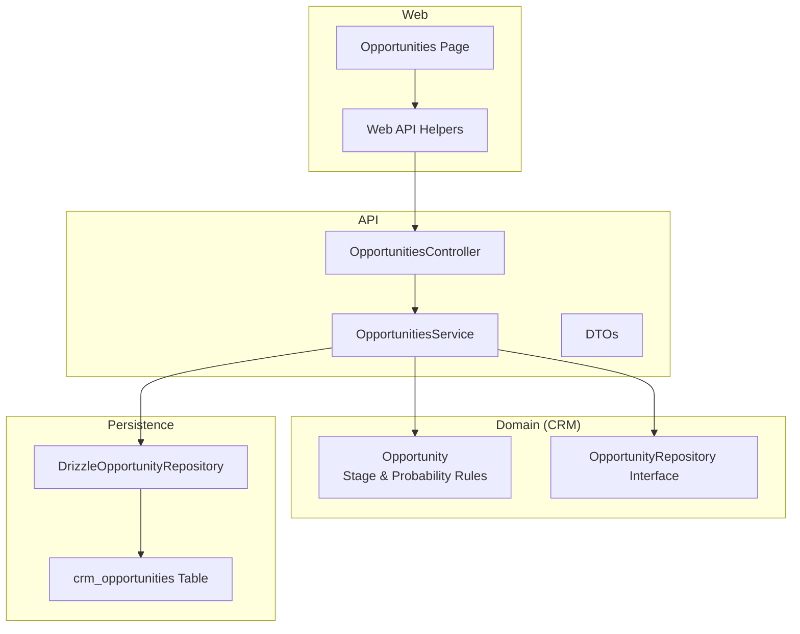
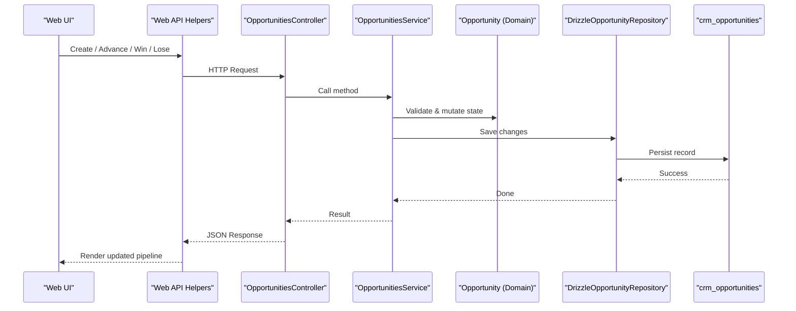
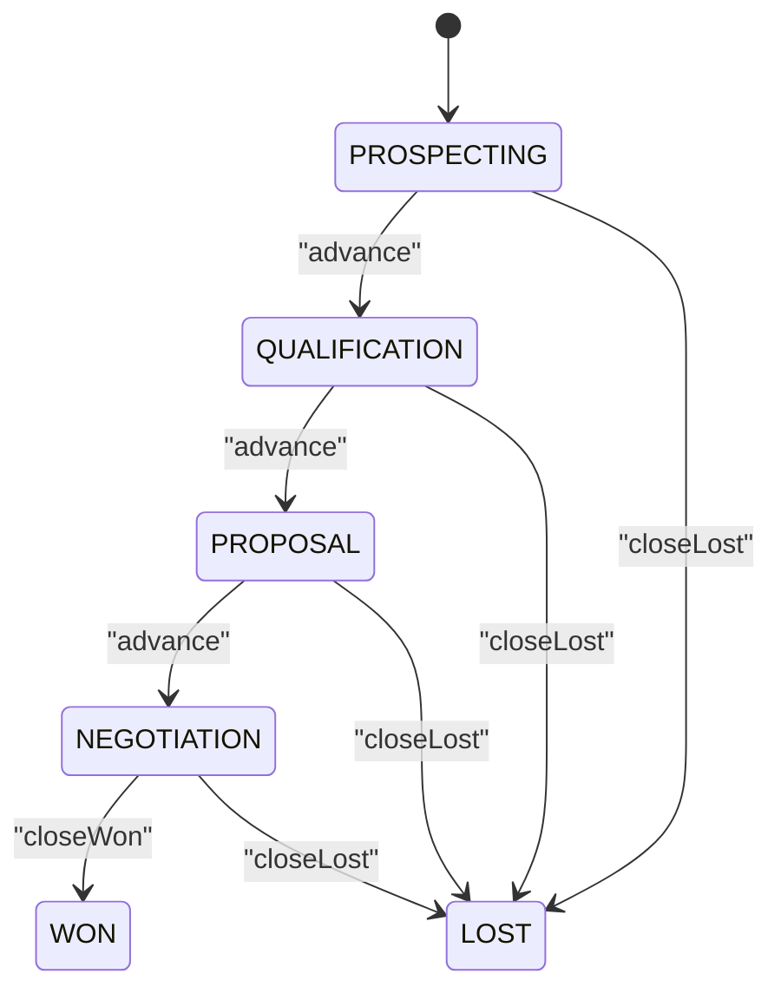
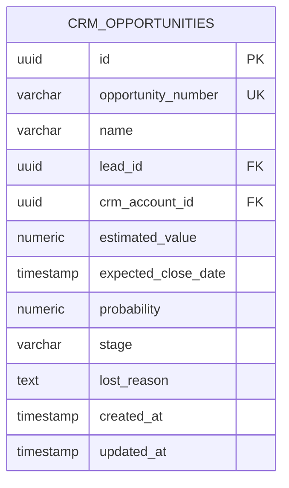
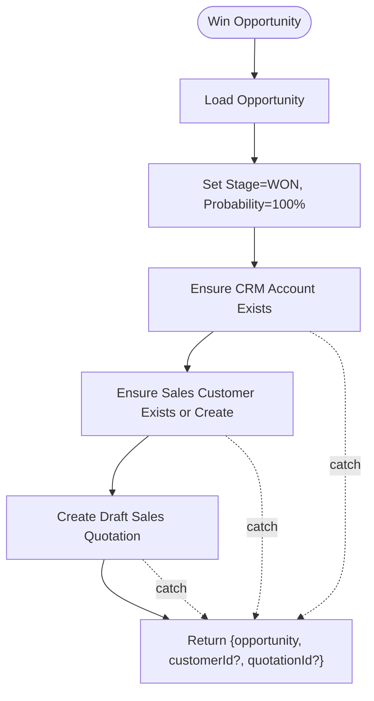
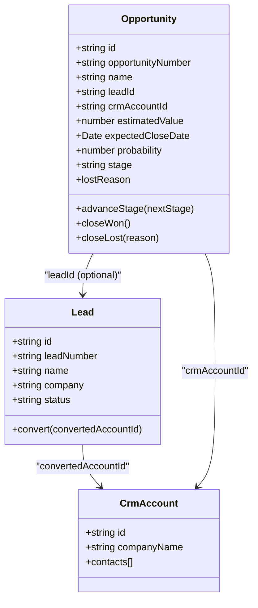
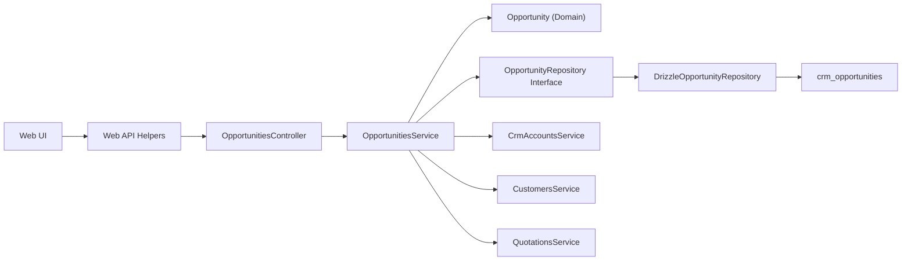

# Opportunity Management

<cite>
**Referenced Files in This Document**
- [opportunity.ts](file://packages/crm/src/opportunities/opportunity.ts)
- [opportunity.repository.ts](file://packages/crm/src/opportunities/opportunity.repository.ts)
- [drizzle-opportunity.repository.ts](file://apps/api/src/infrastructure/repositories/drizzle-opportunity.repository.ts)
- [crm-opportunities.ts](file://packages/database/src/schema/crm-opportunities.ts)
- [opportunities.controller.ts](file://apps/api/src/opportunities/opportunities.controller.ts)
- [opportunities.service.ts](file://apps/api/src/opportunities/opportunities.service.ts)
- [dtos.ts](file://apps/api/src/opportunities/dtos.ts)
- [0038-opportunities-and-pipeline.md](file://docs/rfcs/0038-opportunities-and-pipeline.md)
- [page.tsx (Opportunities UI)](file://apps/web/app/opportunities/page.tsx)
- [api.ts (Web client API helpers)](file://apps/web/src/lib/api.ts)
- [lead.ts](file://packages/crm/src/leads/lead.ts)
- [leads.service.ts](file://apps/api/src/leads/leads.service.ts)
- [activity.ts](file://packages/crm/src/activities/activity.ts)
- [note.ts](file://packages/crm/src/notes/note.ts)
</cite>

## Table of Contents
1. [Introduction](#introduction)
2. [Project Structure](#project-structure)
3. [Core Components](#core-components)
4. [Architecture Overview](#architecture-overview)
5. [Detailed Component Analysis](#detailed-component-analysis)
6. [Dependency Analysis](#dependency-analysis)
7. [Performance Considerations](#performance-considerations)
8. [Troubleshooting Guide](#troubleshooting-guide)
9. [Conclusion](#conclusion)

## Introduction
This document explains Ananya ERP’s Opportunity Management system: how opportunities are created, progressed through pipeline stages, closed as won or lost, and integrated with CRM accounts, leads, activities, notes, and sales quotations. It covers data models, probability rules, expected close dates, pipeline forecasting, collaboration features, and the REST API endpoints for opportunity operations.

## Project Structure
The Opportunity Management feature spans domain logic, application services, repository persistence, database schema, API controllers, and web UI:
- Domain model and state machine live in the CRM package.
- Application service orchestrates lifecycle transitions and cross-module handoffs.
- Repository abstracts persistence; Drizzle implementation persists to Postgres.
- NestJS controller exposes REST endpoints.
- Web UI provides a pipeline view and forecast summaries.

**Diagram sources**
- [opportunity.ts:1-122](file://packages/crm/src/opportunities/opportunity.ts#L1-L122)
- [opportunity.repository.ts:1-16](file://packages/crm/src/opportunities/opportunity.repository.ts#L1-L16)
- [drizzle-opportunity.repository.ts:1-102](file://apps/api/src/infrastructure/repositories/drizzle-opportunity.repository.ts#L1-L102)
- [crm-opportunities.ts:1-53](file://packages/database/src/schema/crm-opportunities.ts#L1-L53)
- [opportunities.controller.ts:1-51](file://apps/api/src/opportunities/opportunities.controller.ts#L1-L51)
- [opportunities.service.ts:1-135](file://apps/api/src/opportunities/opportunities.service.ts#L1-L135)
- [page.tsx (Opportunities UI):1-187](file://apps/web/app/opportunities/page.tsx#L1-L187)
- [api.ts (Web client API helpers):1440-1482](file://apps/web/src/lib/api.ts#L1440-L1482)

**Section sources**
- [0038-opportunities-and-pipeline.md:1-105](file://docs/rfcs/0038-opportunities-and-pipeline.md#L1-L105)

## Core Components
- Opportunity domain model: defines stage progression, probability updates, and closing behavior.
- Opportunity repository interface and Drizzle implementation: persistence and number generation.
- OpportunitiesService: orchestrates creation, querying, stage advancement, and win/lose flows including sales handoff.
- OpportunitiesController: REST endpoints for create, list, get, advance, win, lose.
- DTOs: request validation for create, advance, and lose operations.
- Database schema: crm_opportunities table with indexes for account, stage, and lead.
- Web UI: opportunities page with pipeline stats and filtering.
- Web API helpers: typed client methods for opportunity operations.

**Section sources**
- [opportunity.ts:1-122](file://packages/crm/src/opportunities/opportunity.ts#L1-L122)
- [opportunity.repository.ts:1-16](file://packages/crm/src/opportunities/opportunity.repository.ts#L1-L16)
- [drizzle-opportunity.repository.ts:1-102](file://apps/api/src/infrastructure/repositories/drizzle-opportunity.repository.ts#L1-L102)
- [crm-opportunities.ts:1-53](file://packages/database/src/schema/crm-opportunities.ts#L1-L53)
- [opportunities.controller.ts:1-51](file://apps/api/src/opportunities/opportunities.controller.ts#L1-L51)
- [opportunities.service.ts:1-135](file://apps/api/src/opportunities/opportunities.service.ts#L1-L135)
- [dtos.ts:1-48](file://apps/api/src/opportunities/dtos.ts#L1-L48)
- [page.tsx (Opportunities UI):1-187](file://apps/web/app/opportunities/page.tsx#L1-L187)
- [api.ts (Web client API helpers):1440-1482](file://apps/web/src/lib/api.ts#L1440-L1482)

## Architecture Overview
The system follows a layered architecture:
- Presentation layer (web UI) calls typed API helpers.
- API layer (NestJS) routes requests to an application service.
- Application service enforces business rules via the domain model and coordinates cross-module actions.
- Repository abstraction decouples persistence from business logic.
- Database schema stores opportunities with appropriate indexes.

**Diagram sources**
- [opportunities.controller.ts:1-51](file://apps/api/src/opportunities/opportunities.controller.ts#L1-L51)
- [opportunities.service.ts:1-135](file://apps/api/src/opportunities/opportunities.service.ts#L1-L135)
- [opportunity.ts:1-122](file://packages/crm/src/opportunities/opportunity.ts#L1-L122)
- [drizzle-opportunity.repository.ts:1-102](file://apps/api/src/infrastructure/repositories/drizzle-opportunity.repository.ts#L1-L102)
- [crm-opportunities.ts:1-53](file://packages/database/src/schema/crm-opportunities.ts#L1-L53)

## Detailed Component Analysis

### Opportunity Lifecycle and State Machine
- Stages: PROSPECTING → QUALIFICATION → PROPOSAL → NEGOTIATION → WON or LOST.
- Default initial stage is PROSPECTING with default probability 20%.
- Advancing stages sets probability: QUALIFICATION=40%, PROPOSAL=60%, NEGOTIATION=80%.
- Closing as WON sets probability to 100%; closing as LOST sets probability to 0% and records reason.
- Closed opportunities cannot change stage.

**Diagram sources**
- [opportunity.ts:91-121](file://packages/crm/src/opportunities/opportunity.ts#L91-L121)

**Section sources**
- [opportunity.ts:1-122](file://packages/crm/src/opportunities/opportunity.ts#L1-L122)
- [0038-opportunities-and-pipeline.md:62-68](file://docs/rfcs/0038-opportunities-and-pipeline.md#L62-L68)

### Data Model and Value Tracking
Key fields on Opportunity:
- id, opportunityNumber, name, leadId (optional), crmAccountId, estimatedValue, expectedCloseDate, probability, stage, lostReason, createdAt, updatedAt.
- estimatedValue must be non-negative.
- probability defaults to 20% at creation and is updated by stage transitions.
- expectedCloseDate supports pipeline forecasting and weighted calculations.

Database mapping:
- Numeric precision for monetary values and probabilities.
- Indexes on crmAccountId, stage, and leadId for efficient queries.

**Diagram sources**
- [crm-opportunities.ts:14-50](file://packages/database/src/schema/crm-opportunities.ts#L14-L50)

**Section sources**
- [opportunity.ts:6-19](file://packages/crm/src/opportunities/opportunity.ts#L6-L19)
- [crm-opportunities.ts:14-50](file://packages/database/src/schema/crm-opportunities.ts#L14-L50)

### API Endpoints for Opportunity Operations
- POST /opportunities — Create an opportunity.
- GET /opportunities — List opportunities with optional filters: crmAccountId, stage, search.
- GET /opportunities/:id — Get a single opportunity.
- POST /opportunities/:id/advance — Advance to next stage.
- POST /opportunities/:id/win — Close as won and trigger sales handoff.
- POST /opportunities/:id/lose — Close as lost with reason.

Request/response contracts:
- Create: requires name, crmAccountId, estimatedValue, expectedCloseDate; optional leadId and probability.
- Advance: requires stage.
- Lose: requires reason.

Validation:
- DTOs enforce required fields, types, and constraints (e.g., non-negative estimatedValue).

**Section sources**
- [opportunities.controller.ts:10-49](file://apps/api/src/opportunities/opportunities.controller.ts#L10-L49)
- [dtos.ts:11-47](file://apps/api/src/opportunities/dtos.ts#L11-L47)
- [0038-opportunities-and-pipeline.md:84-91](file://docs/rfcs/0038-opportunities-and-pipeline.md#L84-L91)

### Service Orchestration and Sales Handoff
- create: validates CRM account existence, generates opportunity number, constructs domain object, saves.
- findAll/findOne: repository-backed retrieval with error handling for missing records.
- advanceStage: loads opportunity, delegates to domain to update stage and probability, persists.
- win: closes as won, then attempts to ensure a sales Customer exists and creates a draft Sales Quotation; errors are ignored to allow partial success if setup is pending.
- lose: closes as lost with reason and persists.

**Diagram sources**
- [opportunities.service.ts:81-125](file://apps/api/src/opportunities/opportunities.service.ts#L81-L125)

**Section sources**
- [opportunities.service.ts:34-133](file://apps/api/src/opportunities/opportunities.service.ts#L34-L133)

### Relationships with Leads, Customers, and Deals
- Lead-to-CRM Account conversion: qualified leads can be converted into CRM Accounts with primary contacts.
- Opportunity links to a CRM Account and optionally to a Lead.
- When an opportunity is won, the service ensures a sales Customer exists and creates a draft Sales Quotation, linking the deal to downstream fulfillment processes.

**Diagram sources**
- [lead.ts:36-137](file://packages/crm/src/leads/lead.ts#L36-L137)
- [opportunity.ts:31-122](file://packages/crm/src/opportunities/opportunity.ts#L31-L122)
- [opportunities.service.ts:89-120](file://apps/api/src/opportunities/opportunities.service.ts#L89-L120)

**Section sources**
- [lead.ts:36-137](file://packages/crm/src/leads/lead.ts#L36-L137)
- [leads.service.ts:70-97](file://apps/api/src/leads/leads.service.ts#L70-L97)
- [opportunity.ts:31-122](file://packages/crm/src/opportunities/opportunity.ts#L31-L122)
- [opportunities.service.ts:89-120](file://apps/api/src/opportunities/opportunities.service.ts#L89-L120)

### Pipeline Forecasting and Weighted Values
- The web UI displays active opportunities, total pipeline value, and a weighted forecast based on probabilities.
- Weighted forecast is computed as sum(expectedValue × probability) across opportunities.
- Expected close date enables time-based forecasting and reporting.

Practical example:
- If two opportunities have values 145,000 at 85% and 89,000 at 60%, the weighted forecast is approximately 176,150.

**Section sources**
- [page.tsx (Opportunities UI):50-63](file://apps/web/app/opportunities/page.tsx#L50-L63)

### Collaboration Features: Activities and Notes
- Activities can be attached to opportunities (relatedOpportunityId) to track calls, meetings, emails, tasks, and demos.
- Notes can be attached to opportunities (opportunityId) to capture context and decisions.
- These provide audit trails and collaboration timelines around deals.

**Section sources**
- [activity.ts:7-19](file://packages/crm/src/activities/activity.ts#L7-L19)
- [note.ts:3-13](file://packages/crm/src/notes/note.ts#L3-L13)
- [0039-activities-and-notes.md:81-84](file://docs/rfcs/0039-activities-and-notes.md#L81-L84)

### Practical Workflows and Examples

#### Creating an Opportunity from a Qualified Lead
- Convert a qualified lead to a CRM Account using the lead conversion flow.
- Create an opportunity linked to the new CRM Account and optionally the original Lead ID.
- Set estimatedValue, expectedCloseDate, and initial probability (defaults to 20%).

Steps:
1. Qualify the lead.
2. Convert the lead to a CRM Account (creates account and primary contact).
3. Create an opportunity with crmAccountId and optional leadId.

**Section sources**
- [leads.service.ts:70-97](file://apps/api/src/leads/leads.service.ts#L70-L97)
- [opportunities.service.ts:34-49](file://apps/api/src/opportunities/opportunities.service.ts#L34-L49)

#### Updating Opportunity Stages
- Use the advance endpoint to move an opportunity through QUALIFICATION → PROPOSAL → NEGOTIATION.
- Probability updates automatically per stage rules.

**Section sources**
- [opportunity.ts:91-102](file://packages/crm/src/opportunities/opportunity.ts#L91-L102)
- [opportunities.controller.ts:33-39](file://apps/api/src/opportunities/opportunities.controller.ts#L33-L39)

#### Tracking Deal Values and Generating Forecasts
- Maintain accurate estimatedValue and expectedCloseDate.
- Compute weighted forecast by multiplying each opportunity’s estimatedValue by its probability and summing results.
- Use the opportunities page to visualize totals and forecasts.

**Section sources**
- [page.tsx (Opportunities UI):50-63](file://apps/web/app/opportunities/page.tsx#L50-L63)

#### Closing Opportunities
- Close as Won: triggers customer/quotation handoff.
- Close as Lost: records reason and zeroes probability.

**Section sources**
- [opportunities.service.ts:81-133](file://apps/api/src/opportunities/opportunities.service.ts#L81-L133)

### API Reference Summary
- Create Opportunity
  - Method: POST
  - Path: /opportunities
  - Body: name, crmAccountId, estimatedValue, expectedCloseDate, optional leadId, probability
- List Opportunities
  - Method: GET
  - Path: /opportunities
  - Query: crmAccountId, stage, search
- Get Opportunity
  - Method: GET
  - Path: /opportunities/:id
- Advance Stage
  - Method: POST
  - Path: /opportunities/:id/advance
  - Body: stage
- Win Opportunity
  - Method: POST
  - Path: /opportunities/:id/win
- Lose Opportunity
  - Method: POST
  - Path: /opportunities/:id/lose
  - Body: reason

**Section sources**
- [opportunities.controller.ts:10-49](file://apps/api/src/opportunities/opportunities.controller.ts#L10-L49)
- [api.ts (Web client API helpers):1440-1482](file://apps/web/src/lib/api.ts#L1440-L1482)

## Dependency Analysis
- Controller depends on service and DTOs.
- Service depends on domain model, repository interface, and external services (CRM accounts, customers, quotations).
- Repository implements persistence against the database schema.
- Web UI uses typed API helpers to call backend endpoints.

**Diagram sources**
- [opportunities.controller.ts:1-51](file://apps/api/src/opportunities/opportunities.controller.ts#L1-L51)
- [opportunities.service.ts:1-135](file://apps/api/src/opportunities/opportunities.service.ts#L1-L135)
- [opportunity.repository.ts:1-16](file://packages/crm/src/opportunities/opportunity.repository.ts#L1-L16)
- [drizzle-opportunity.repository.ts:1-102](file://apps/api/src/infrastructure/repositories/drizzle-opportunity.repository.ts#L1-L102)
- [crm-opportunities.ts:1-53](file://packages/database/src/schema/crm-opportunities.ts#L1-L53)
- [api.ts (Web client API helpers):1440-1482](file://apps/web/src/lib/api.ts#L1440-L1482)

**Section sources**
- [opportunities.controller.ts:1-51](file://apps/api/src/opportunities/opportunities.controller.ts#L1-L51)
- [opportunities.service.ts:1-135](file://apps/api/src/opportunities/opportunities.service.ts#L1-L135)
- [opportunity.repository.ts:1-16](file://packages/crm/src/opportunities/opportunity.repository.ts#L1-L16)
- [drizzle-opportunity.repository.ts:1-102](file://apps/api/src/infrastructure/repositories/drizzle-opportunity.repository.ts#L1-L102)

## Performance Considerations
- Indexes on crmAccountId, stage, and leadId improve query performance for filtered lists and dashboards.
- Probability and stage updates are lightweight domain mutations; persistence uses upsert semantics to avoid unnecessary writes when unchanged.
- For large pipelines, consider server-side pagination and filtering by stage/account to reduce payload sizes.

[No sources needed since this section provides general guidance]

## Troubleshooting Guide
Common issues and resolutions:
- Cannot advance closed opportunities:
  - Cause: Attempting to advance stage after WON or LOST.
  - Resolution: Only open-stage opportunities can advance; use win/lose endpoints to finalize.
- Cannot mark lost as won or vice versa:
  - Cause: Incompatible state transition.
  - Resolution: Reopen only via administrative process outside current domain rules.
- Negative estimatedValue rejected:
  - Cause: Validation fails for negative values.
  - Resolution: Provide a non-negative estimatedValue.
- Missing CRM Account on create:
  - Cause: Invalid or nonexistent crmAccountId.
  - Resolution: Ensure the CRM Account exists before creating the opportunity.
- Sales handoff failures on win:
  - Cause: Customer already exists or sales setup incomplete.
  - Resolution: Errors are intentionally ignored to allow partial success; verify customer/quotation creation separately.

**Section sources**
- [opportunity.ts:91-121](file://packages/crm/src/opportunities/opportunity.ts#L91-L121)
- [opportunities.service.ts:89-123](file://apps/api/src/opportunities/opportunities.service.ts#L89-L123)

## Conclusion
Ananya ERP’s Opportunity Management provides a robust, domain-driven pipeline with clear stage transitions, automatic probability updates, and strong integration points to CRM accounts, leads, activities, notes, and sales quotations. The REST API and web UI enable practical workflows for creating opportunities from qualified leads, advancing stages, tracking deal values, and generating weighted forecasts. With well-defined validation rules, repository abstractions, and indexed storage, the system supports scalable sales operations and analytics.

[No sources needed since this section summarizes without analyzing specific files]