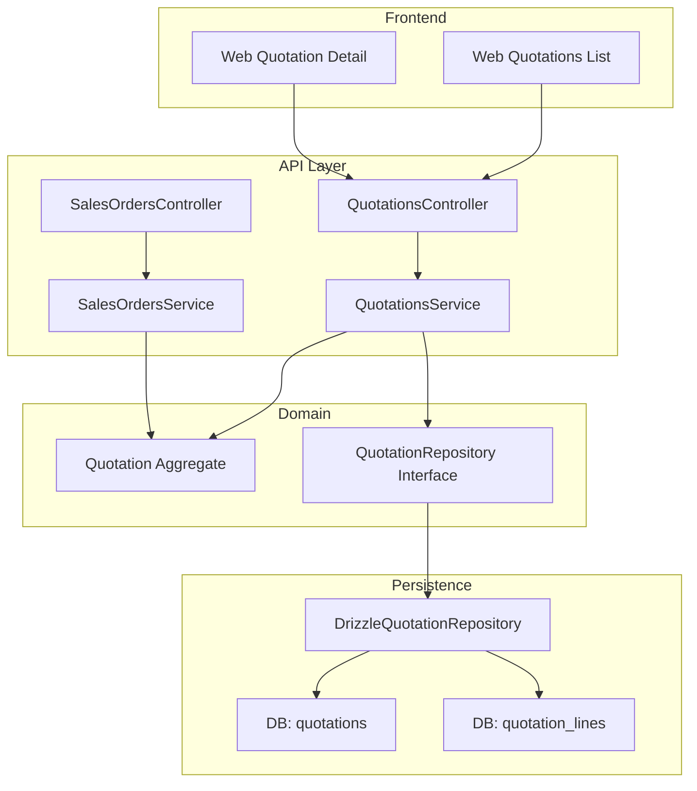
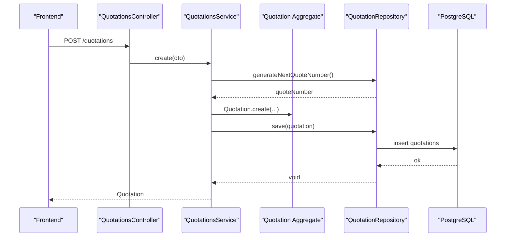
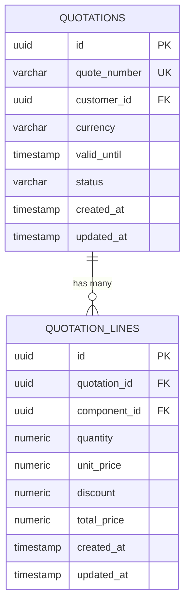
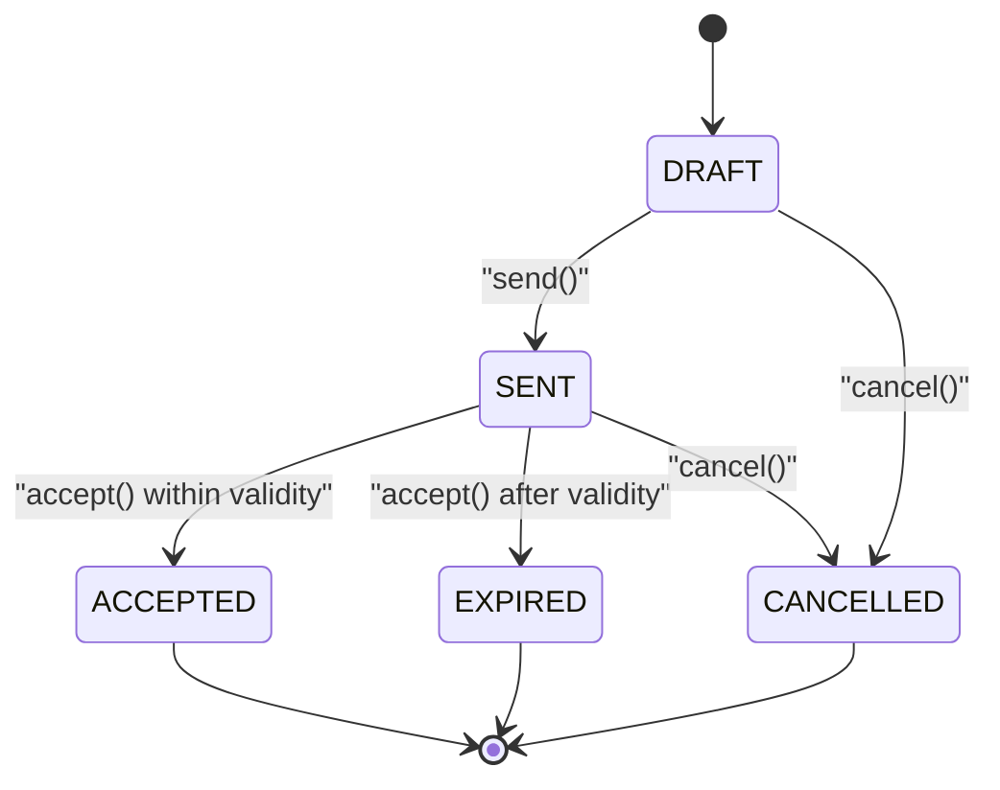
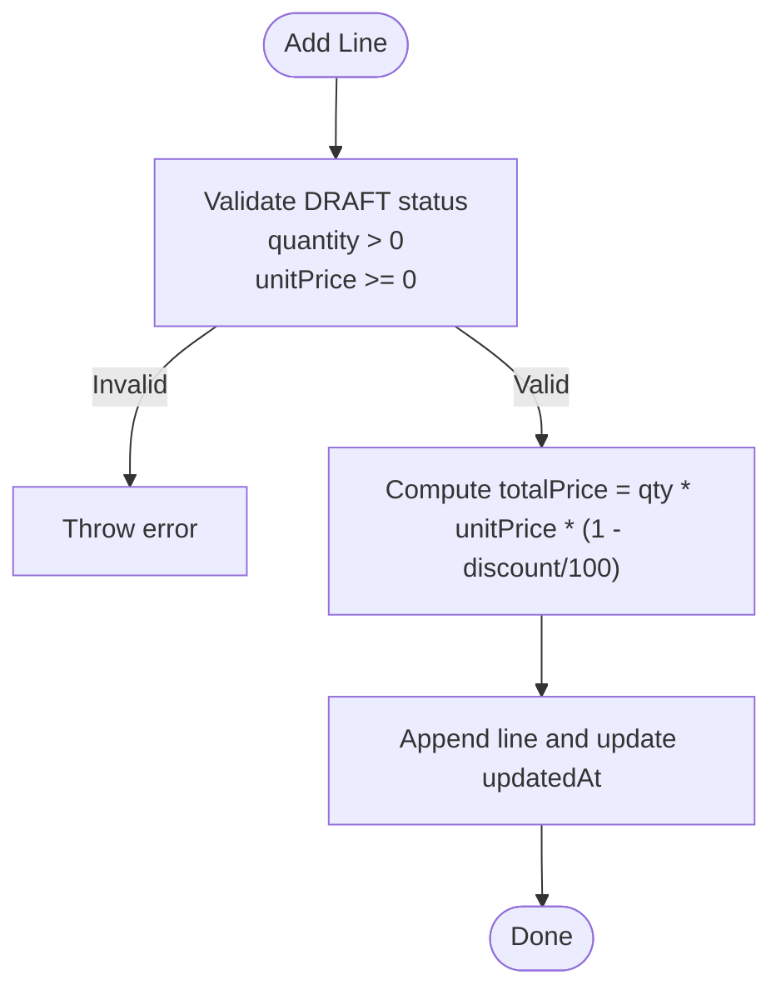
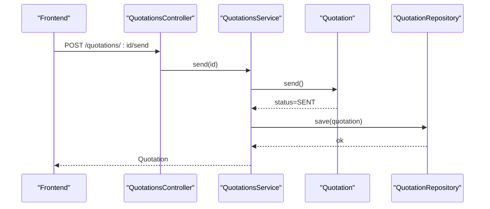
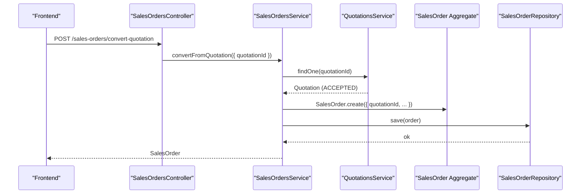
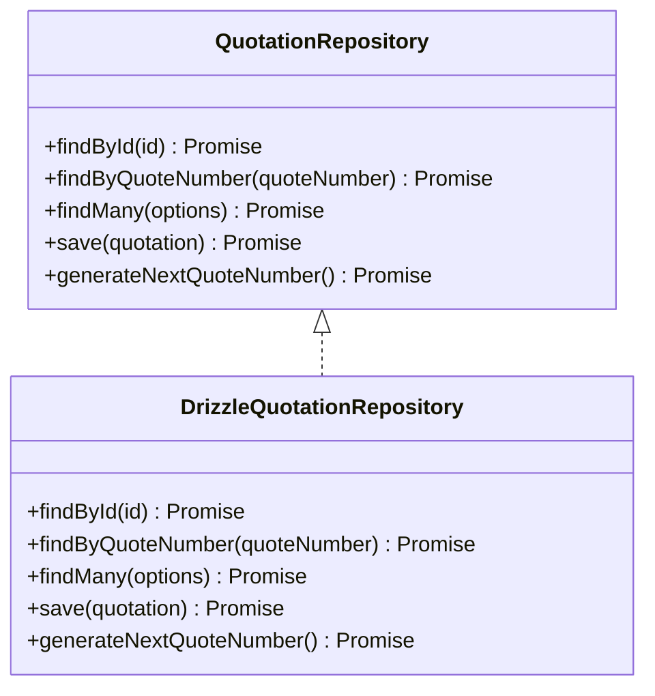
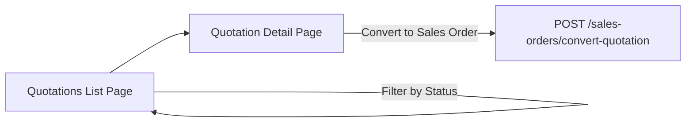
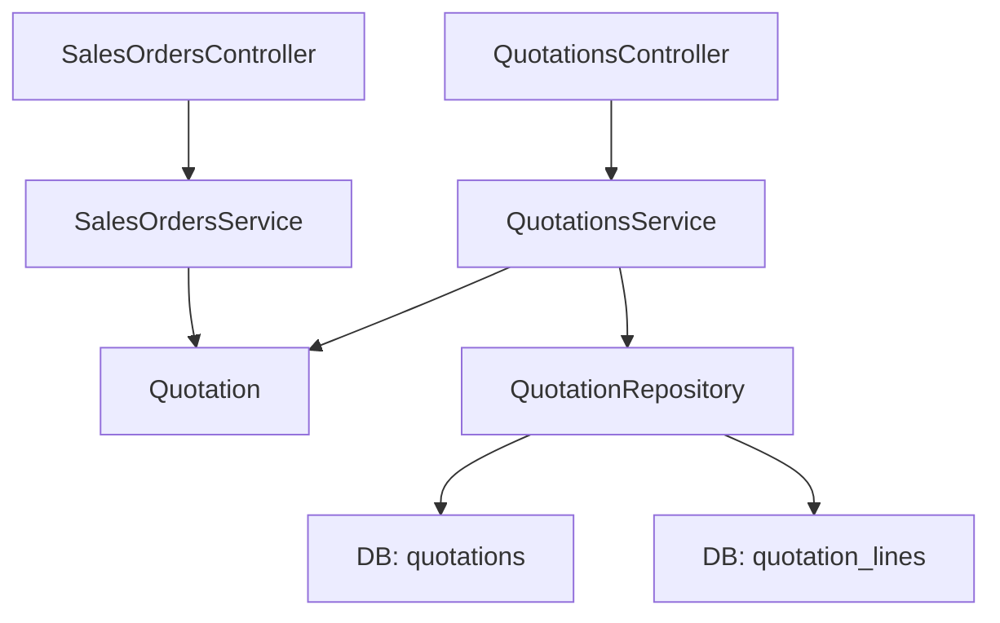

# Quotation Management

<cite>
**Referenced Files in This Document**
- [0027-quotations-and-sales-orders.md](file://docs/rfcs/0027-quotations-and-sales-orders.md)
- [quotation.ts](file://packages/sales/src/quotations/quotation.ts)
- [quotation.repository.ts](file://packages/sales/src/quotations/quotation.repository.ts)
- [drizzle-quotation.repository.ts](file://apps/api/src/infrastructure/repositories/drizzle-quotation.repository.ts)
- [quotations.controller.ts](file://apps/api/src/quotations/quotations.controller.ts)
- [quotations.service.ts](file://apps/api/src/quotations/quotations.service.ts)
- [dtos.ts (Quotations)](file://apps/api/src/quotations/dtos.ts)
- [quotations schema](file://packages/database/src/schema/quotations.ts)
- [sales-orders.controller.ts](file://apps/api/src/sales-orders/sales-orders.controller.ts)
- [sales-orders.service.ts](file://apps/api/src/sales-orders/sales-orders.service.ts)
- [sales-orders dtos.ts](file://apps/api/src/sales-orders/dtos.ts)
- [web quotations page](file://apps/web/app/quotations/page.tsx)
- [web quotation detail page](file://apps/web/app/quotations/[id]/page.tsx)
</cite>

## Table of Contents
1. [Introduction](#introduction)
2. [Project Structure](#project-structure)
3. [Core Components](#core-components)
4. [Architecture Overview](#architecture-overview)
5. [Detailed Component Analysis](#detailed-component-analysis)
6. [Dependency Analysis](#dependency-analysis)
7. [Performance Considerations](#performance-considerations)
8. [Troubleshooting Guide](#troubleshooting-guide)
9. [Conclusion](#conclusion)
10. [Appendices](#appendices)

## Introduction
This document explains Ananya ERP’s Quotation Management system end-to-end: the data model, lifecycle, pricing and discount calculations, validity handling, templates/versioning considerations, approval workflows, integration with inventory/pricing, and the API and frontend components that implement these capabilities. It also covers conversion from accepted quotations to sales orders and how warehouse fulfillment is triggered downstream.

## Project Structure
The quotation feature spans domain logic, application services, persistence, and UI:
- Domain model and repository contract live in the sales package.
- Application service and NestJS controller expose REST endpoints.
- Drizzle-based repository persists quotations and line items.
- Web app provides list and detail views for quotations.

**Diagram sources**
- [quotations.controller.ts:6-47](file://apps/api/src/quotations/quotations.controller.ts#L6-L47)
- [quotations.service.ts:14-82](file://apps/api/src/quotations/quotations.service.ts#L14-L82)
- [quotation.ts:44-156](file://packages/sales/src/quotations/quotation.ts#L44-L156)
- [quotation.repository.ts:8-14](file://packages/sales/src/quotations/quotation.repository.ts#L8-L14)
- [drizzle-quotation.repository.ts:42-142](file://apps/api/src/infrastructure/repositories/drizzle-quotation.repository.ts#L42-L142)
- [sales-orders.controller.ts:10-56](file://apps/api/src/sales-orders/sales-orders.controller.ts#L10-L56)
- [sales-orders.service.ts:31-66](file://apps/api/src/sales-orders/sales-orders.service.ts#L31-L66)

**Section sources**
- [0027-quotations-and-sales-orders.md:1-114](file://docs/rfcs/0027-quotations-and-sales-orders.md#L1-L114)

## Core Components
- Quotation aggregate: encapsulates state transitions (DRAFT → SENT → ACCEPTED/EXPIRED/CANCELLED), line item management, totals, and validity checks.
- Repository interface: defines queries, save, and quote number generation.
- Drizzle repository: maps domain objects to relational tables and handles upserts for header and lines.
- Application service: orchestrates validation (customer status), creates quotations, adds lines, sends/accepts/cancels, and persists changes.
- Controller: exposes REST endpoints for CRUD and lifecycle actions.
- Sales Order integration: converts accepted quotations into sales orders and supports approval/release flows.

Key responsibilities:
- Pricing and discounts are computed per line; total amount aggregates line totals.
- Validity period enforced on accept.
- Customer must be active to create or modify quotations.
- Conversion to sales order requires an accepted quotation.

**Section sources**
- [quotation.ts:18-156](file://packages/sales/src/quotations/quotation.ts#L18-L156)
- [quotation.repository.ts:1-15](file://packages/sales/src/quotations/quotation.repository.ts#L1-L15)
- [drizzle-quotation.repository.ts:42-142](file://apps/api/src/infrastructure/repositories/drizzle-quotation.repository.ts#L42-L142)
- [quotations.service.ts:21-82](file://apps/api/src/quotations/quotations.service.ts#L21-L82)
- [quotations.controller.ts:6-47](file://apps/api/src/quotations/quotations.controller.ts#L6-L47)
- [sales-orders.service.ts:31-66](file://apps/api/src/sales-orders/sales-orders.service.ts#L31-L66)

## Architecture Overview
The system follows a layered architecture with clear separation between presentation (controller), application orchestration (service), domain rules (aggregate), and persistence (repository).

**Diagram sources**
- [quotations.controller.ts:10-13](file://apps/api/src/quotations/quotations.controller.ts#L10-L13)
- [quotations.service.ts:21-38](file://apps/api/src/quotations/quotations.service.ts#L21-L38)
- [drizzle-quotation.repository.ts:136-142](file://apps/api/src/infrastructure/repositories/drizzle-quotation.repository.ts#L136-L142)
- [drizzle-quotation.repository.ts:91-110](file://apps/api/src/infrastructure/repositories/drizzle-quotation.repository.ts#L91-L110)

## Detailed Component Analysis

### Data Model and Persistence
- Header fields include unique quote number, customer reference, currency, validity date, status, and timestamps.
- Line items store component reference, quantity, unit price, discount percentage, and computed total price.
- Indexes optimize lookups by customer and status, and by quotation/component relationships.

**Diagram sources**
- [quotations schema:13-64](file://packages/database/src/schema/quotations.ts#L13-L64)

**Section sources**
- [quotations schema:13-69](file://packages/database/src/schema/quotations.ts#L13-L69)

### Domain Model: Quotation Aggregate
- Creation sets default currency and validity window if not provided.
- Line addition validates DRAFT status, positive quantity, non-negative unit price, and computes line total with optional discount.
- Send enforces DRAFT and presence of at least one line.
- Accept enforces SENT status and validity window; expired quotations transition to EXPIRED.
- Cancel prevents cancellation once ACCEPTED.

**Diagram sources**
- [quotation.ts:67-156](file://packages/sales/src/quotations/quotation.ts#L67-L156)

**Section sources**
- [quotation.ts:18-156](file://packages/sales/src/quotations/quotation.ts#L18-L156)

### Pricing and Totals
- Per-line total = quantity × unitPrice × (1 − discount/100).
- Quotation totalAmount sums all line totals.
- Discounts are percentages applied before computing line totals.

**Diagram sources**
- [quotation.ts:93-123](file://packages/sales/src/quotations/quotation.ts#L93-L123)

**Section sources**
- [quotation.ts:89-123](file://packages/sales/src/quotations/quotation.ts#L89-L123)

### Quotation Lifecycle and API
- Create: validates customer ACTIVE, generates quote number, persists.
- Add Line: only allowed in DRAFT.
- Send: transitions DRAFT → SENT; requires at least one line.
- Accept: transitions SENT → ACCEPTED if within validity; otherwise SENT → EXPIRED.
- Cancel: transitions to CANCELLED unless ACCEPTED.

**Diagram sources**
- [quotations.controller.ts:33-36](file://apps/api/src/quotations/quotations.controller.ts#L33-L36)
- [quotations.service.ts:62-67](file://apps/api/src/quotations/quotations.service.ts#L62-L67)
- [quotation.ts:125-134](file://packages/sales/src/quotations/quotation.ts#L125-L134)

**Section sources**
- [quotations.controller.ts:10-47](file://apps/api/src/quotations/quotations.controller.ts#L10-L47)
- [quotations.service.ts:21-82](file://apps/api/src/quotations/quotations.service.ts#L21-L82)
- [quotation.ts:67-156](file://packages/sales/src/quotations/quotation.ts#L67-L156)

### Conversion to Sales Orders
- Only ACCEPTED quotations can be converted.
- Conversion creates a new sales order linked to the quotation and optionally sets required date.
- Downstream, approved and released orders trigger fulfillment requests to warehouse.

**Diagram sources**
- [sales-orders.controller.ts:19-22](file://apps/api/src/sales-orders/sales-orders.controller.ts#L19-L22)
- [sales-orders.service.ts:51-66](file://apps/api/src/sales-orders/sales-orders.service.ts#L51-L66)
- [0027-quotations-and-sales-orders.md:45-90](file://docs/rfcs/0027-quotations-and-sales-orders.md#L45-L90)

**Section sources**
- [sales-orders.controller.ts:10-56](file://apps/api/src/sales-orders/sales-orders.controller.ts#L10-L56)
- [sales-orders.service.ts:31-66](file://apps/api/src/sales-orders/sales-orders.service.ts#L31-L66)
- [0027-quotations-and-sales-orders.md:45-90](file://docs/rfcs/0027-quotations-and-sales-orders.md#L45-L90)

### Repository Implementation
- Reads quotation by ID or quote number, including related lines.
- Lists quotations with optional filters by customer and status.
- Saves header and lines with upsert semantics to ensure consistency.
- Generates next quote number using year-based sequence.

**Diagram sources**
- [quotation.repository.ts:8-14](file://packages/sales/src/quotations/quotation.repository.ts#L8-L14)
- [drizzle-quotation.repository.ts:42-142](file://apps/api/src/infrastructure/repositories/drizzle-quotation.repository.ts#L42-L142)

**Section sources**
- [drizzle-quotation.repository.ts:42-142](file://apps/api/src/infrastructure/repositories/drizzle-quotation.repository.ts#L42-L142)

### Frontend Components
- Quotations list page displays key columns (quote number, customer, total, validity, status) and actions to view details.
- Quotation detail page shows summary metrics and proposed line items, with actions to send PDF and convert to sales order.

**Diagram sources**
- [web quotations page:54-195](file://apps/web/app/quotations/page.tsx#L54-L195)
- [web quotation detail page:11-103](file://apps/web/app/quotations/[id]/page.tsx#L11-L103)
- [sales-orders.controller.ts:19-22](file://apps/api/src/sales-orders/sales-orders.controller.ts#L19-L22)

**Section sources**
- [web quotations page:54-195](file://apps/web/app/quotations/page.tsx#L54-L195)
- [web quotation detail page:11-103](file://apps/web/app/quotations/[id]/page.tsx#L11-L103)

## Dependency Analysis
- Controllers depend on services for business orchestration.
- Services depend on domain aggregates and repositories.
- Repositories depend on database schema definitions and Drizzle ORM.
- Web pages depend on controllers via HTTP calls (not shown here) and present user interactions.

**Diagram sources**
- [quotations.controller.ts:6-47](file://apps/api/src/quotations/quotations.controller.ts#L6-L47)
- [quotations.service.ts:14-82](file://apps/api/src/quotations/quotations.service.ts#L14-L82)
- [drizzle-quotation.repository.ts:42-142](file://apps/api/src/infrastructure/repositories/drizzle-quotation.repository.ts#L42-L142)
- [sales-orders.controller.ts:10-56](file://apps/api/src/sales-orders/sales-orders.controller.ts#L10-L56)
- [sales-orders.service.ts:31-66](file://apps/api/src/sales-orders/sales-orders.service.ts#L31-L66)

**Section sources**
- [0027-quotations-and-sales-orders.md:45-90](file://docs/rfcs/0027-quotations-and-sales-orders.md#L45-L90)

## Performance Considerations
- Use indexed queries for filtering by customer and status to reduce latency.
- Batch saves for lines when updating multiple lines to minimize round trips.
- Avoid loading full quotation history unless needed; fetch only current version.
- Cache frequently accessed master data (e.g., customers) where appropriate.

[No sources needed since this section provides general guidance]

## Troubleshooting Guide
Common issues and resolutions:
- Cannot add lines: ensure quotation is in DRAFT status.
- Cannot send quotation: ensure at least one line exists and status is DRAFT.
- Cannot accept quotation: ensure status is SENT and not past validUntil; otherwise it becomes EXPIRED.
- Cannot cancel quotation: cannot cancel ACCEPTED quotations.
- Customer not active: creation blocked until customer status is ACTIVE.

Validation and error points:
- DTOs enforce required fields and numeric constraints for line items.
- Service layer validates customer status before creating quotations.
- Domain methods throw errors on invalid state transitions or inputs.

**Section sources**
- [dtos.ts (Quotations):10-41](file://apps/api/src/quotations/dtos.ts#L10-L41)
- [quotations.service.ts:21-38](file://apps/api/src/quotations/quotations.service.ts#L21-L38)
- [quotation.ts:93-156](file://packages/sales/src/quotations/quotation.ts#L93-L156)

## Conclusion
Ananya ERP’s Quotation Management provides a robust, domain-driven implementation for creating, managing, and converting quotations to sales orders. It enforces critical business rules around validity, approvals, and conversions while exposing clean APIs and intuitive UI flows. The modular design allows future enhancements such as templates, versioning, advanced pricing tiers, and automated workflows without disrupting core functionality.

[No sources needed since this section summarizes without analyzing specific files]

## Appendices

### API Endpoints Summary
- Quotations
  - POST /quotations: Create a new quotation
  - GET /quotations: List quotations (filters: customerId, status)
  - GET /quotations/:id: Get quotation details
  - POST /quotations/:id/lines: Add a line item
  - POST /quotations/:id/send: Send quotation (DRAFT → SENT)
  - POST /quotations/:id/accept: Accept quotation (SENT → ACCEPTED or EXPIRED)
  - POST /quotations/:id/cancel: Cancel quotation (unless ACCEPTED)
- Sales Orders
  - POST /sales-orders: Create a sales order
  - POST /sales-orders/convert-quotation: Convert accepted quotation to sales order
  - GET /sales-orders: List sales orders (filters: customerId, status)
  - GET /sales-orders/:id: Get sales order details
  - POST /sales-orders/:id/lines: Add a line item
  - POST /sales-orders/:id/approve: Approve sales order
  - POST /sales-orders/:id/release: Release sales order for fulfillment
  - POST /sales-orders/:id/cancel: Cancel sales order

**Section sources**
- [quotations.controller.ts:6-47](file://apps/api/src/quotations/quotations.controller.ts#L6-L47)
- [sales-orders.controller.ts:10-56](file://apps/api/src/sales-orders/sales-orders.controller.ts#L10-L56)
- [0027-quotations-and-sales-orders.md:96-104](file://docs/rfcs/0027-quotations-and-sales-orders.md#L96-L104)

### Practical Examples
- Creating a quotation: call POST /quotations with customerId, optional currency and validUntil.
- Adding line items: call POST /quotations/:id/lines with componentId, quantity, unitPrice, optional discount.
- Sending a quotation: call POST /quotations/:id/send when ready to share with the customer.
- Converting to sales order: call POST /sales-orders/convert-quotation with quotationId and optional requiredDate.

**Section sources**
- [quotations.controller.ts:10-47](file://apps/api/src/quotations/quotations.controller.ts#L10-L47)
- [sales-orders.controller.ts:14-22](file://apps/api/src/sales-orders/sales-orders.controller.ts#L14-L22)
- [sales-orders.dtos.ts:10-36](file://apps/api/src/sales-orders/dtos.ts#L10-L36)