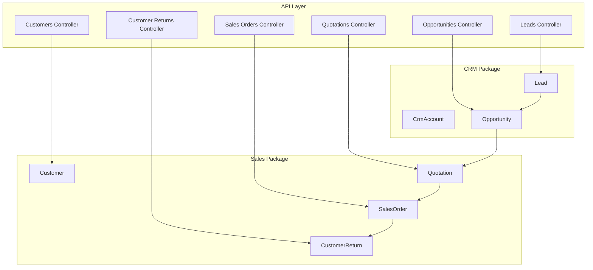
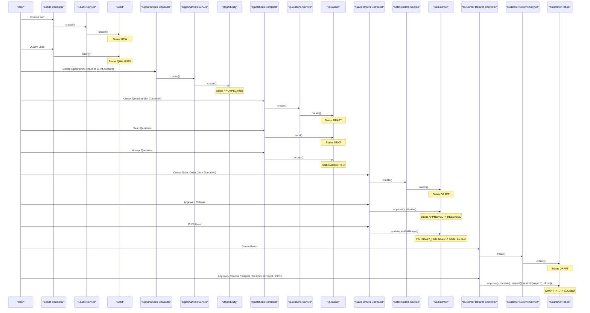
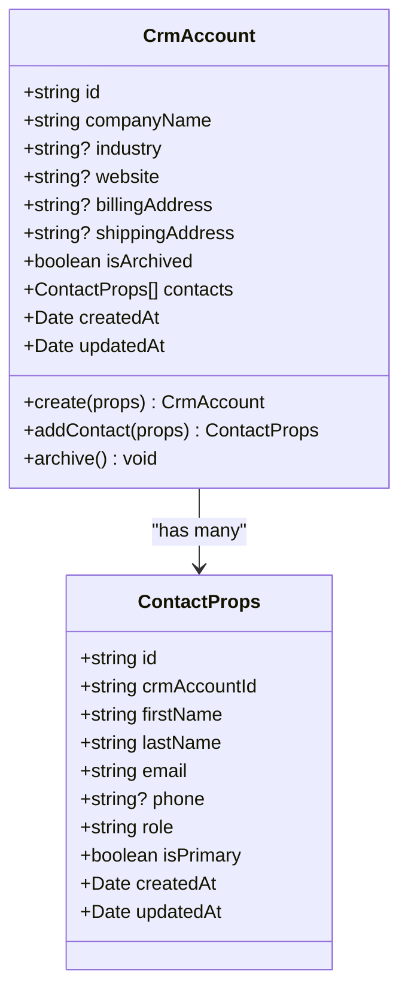
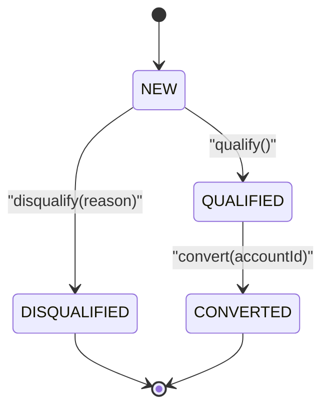
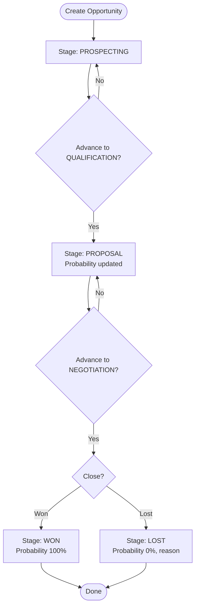
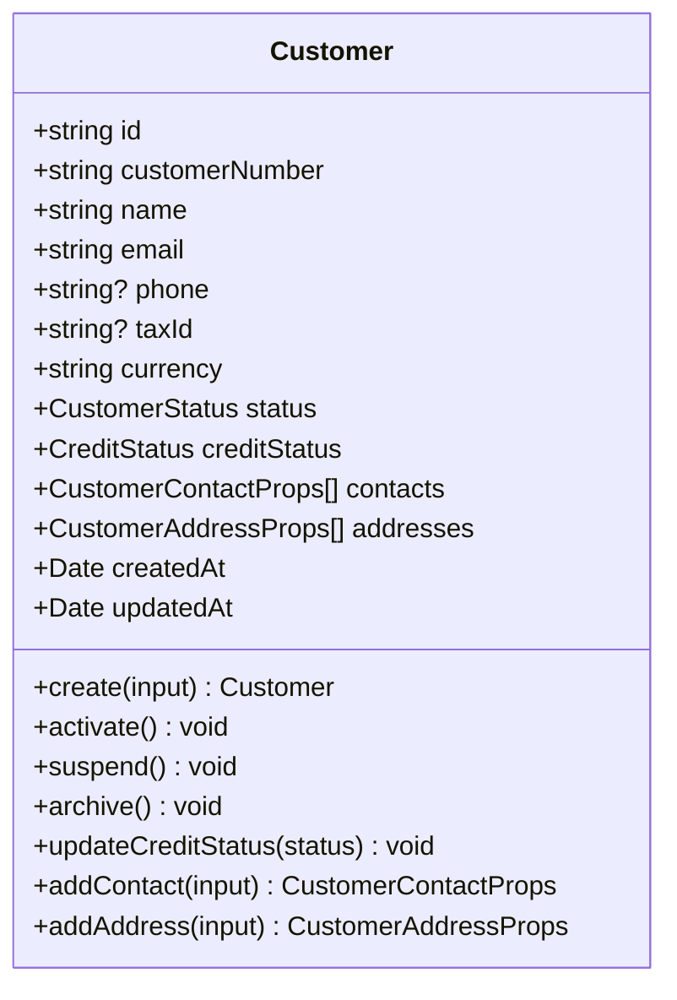
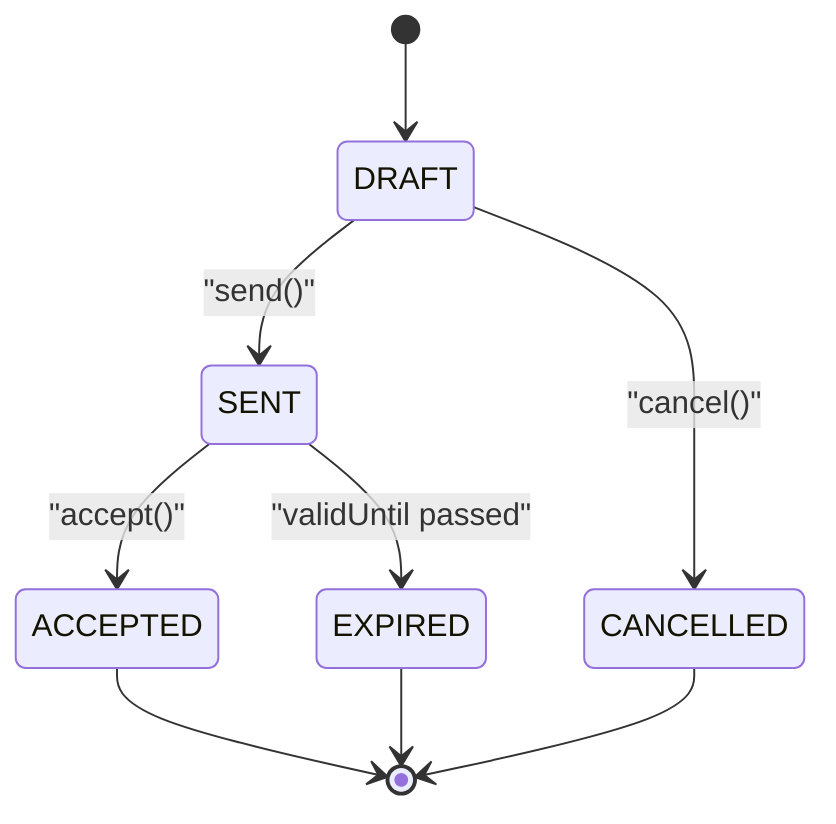
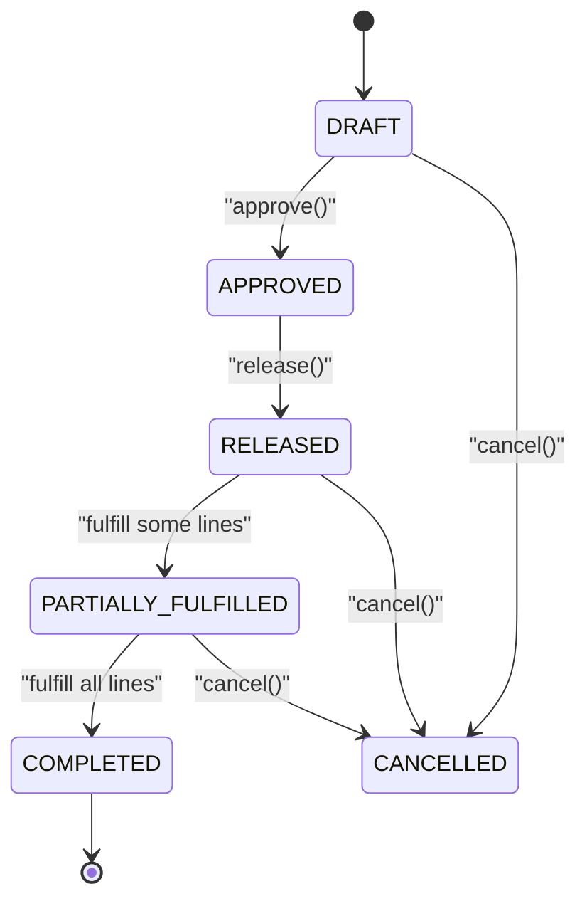
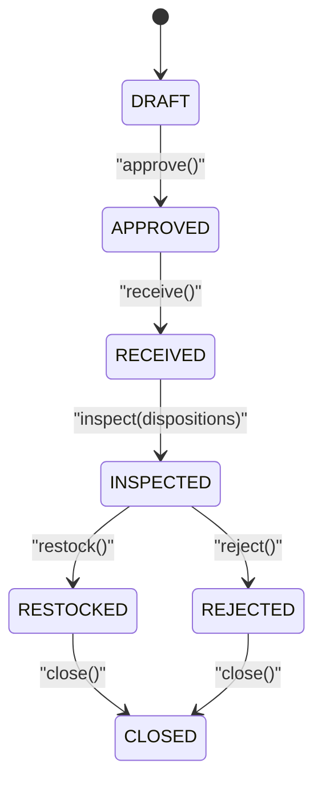
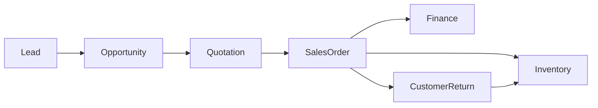

# Sales & CRM

<cite>
**Referenced Files in This Document**
- [customer.ts](file://packages/sales/src/customers/customer.ts)
- [crm-account.ts](file://packages/crm/src/accounts/crm-account.ts)
- [lead.ts](file://packages/crm/src/leads/lead.ts)
- [opportunity.ts](file://packages/crm/src/opportunities/opportunity.ts)
- [quotation.ts](file://packages/sales/src/quotations/quotation.ts)
- [sales-order.ts](file://packages/sales/src/sales-orders/sales-order.ts)
- [customer-return.ts](file://packages/sales/src/returns/customer-return.ts)
- [customers.controller.ts](file://apps/api/src/customers/customers.controller.ts)
- [customers.service.ts](file://apps/api/src/customers/customers.service.ts)
- [leads.controller.ts](file://apps/api/src/leads/leads.controller.ts)
- [leads.service.ts](file://apps/api/src/leads/leads.service.ts)
- [opportunities.controller.ts](file://apps/api/src/opportunities/opportunities.controller.ts)
- [opportunities.service.ts](file://apps/api/src/opportunities/opportunities.service.ts)
- [quotations.controller.ts](file://apps/api/src/quotations/quotations.controller.ts)
- [quotations.service.ts](file://apps/api/src/quotations/quotations.service.ts)
- [sales-orders.controller.ts](file://apps/api/src/sales-orders/sales-orders.controller.ts)
- [sales-orders.service.ts](file://apps/api/src/sales-orders/sales-orders.service.ts)
- [customer-returns.controller.ts](file://apps/api/src/customer-returns/customer-returns.controller.ts)
- [customer-returns.service.ts](file://apps/api/src/customer-returns/customer-returns.service.ts)
</cite>

## Table of Contents
1. Introduction
2. Project Structure
3. Core Components
4. Architecture Overview
5. Detailed Component Analysis
6. Dependency Analysis
7. Performance Considerations
8. Troubleshooting Guide
9. Conclusion

## Introduction
This document explains Ananya ERP’s Sales and CRM domain, covering customer management, lead and opportunity tracking, quotations, sales orders, and customer returns. It describes the data model, key workflows from lead generation through post-sale support, practical usage examples, package boundaries, and integration points with finance and inventory domains.

## Project Structure
The Sales & CRM functionality is implemented across two primary packages:
- CRM package: accounts (companies), leads, opportunities, activities, notes
- Sales package: customers, quotations, sales orders, returns, fulfillment requests

At the API layer, NestJS controllers and services expose endpoints for each domain entity, delegating to service logic that applies business rules via domain classes in the packages.

**Diagram sources**
- [customers.controller.ts](file://apps/api/src/customers/customers.controller.ts)
- [leads.controller.ts](file://apps/api/src/leads/leads.controller.ts)
- [opportunities.controller.ts](file://apps/api/src/opportunities/opportunities.controller.ts)
- [quotations.controller.ts](file://apps/api/src/quotations/quotations.controller.ts)
- [sales-orders.controller.ts](file://apps/api/src/sales-orders/sales-orders.controller.ts)
- [customer-returns.controller.ts](file://apps/api/src/customer-returns/customer-returns.controller.ts)
- [crm-account.ts](file://packages/crm/src/accounts/crm-account.ts)
- [lead.ts](file://packages/crm/src/leads/lead.ts)
- [opportunity.ts](file://packages/crm/src/opportunities/opportunity.ts)
- [customer.ts](file://packages/sales/src/customers/customer.ts)
- [quotation.ts](file://packages/sales/src/quotations/quotation.ts)
- [sales-order.ts](file://packages/sales/src/sales-orders/sales-order.ts)
- [customer-return.ts](file://packages/sales/src/returns/customer-return.ts)

**Section sources**
- [customers.controller.ts](file://apps/api/src/customers/customers.controller.ts)
- [leads.controller.ts](file://apps/api/src/leads/leads.controller.ts)
- [opportunities.controller.ts](file://apps/api/src/opportunities/opportunities.controller.ts)
- [quotations.controller.ts](file://apps/api/src/quotations/quotations.controller.ts)
- [sales-orders.controller.ts](file://apps/api/src/sales-orders/sales-orders.controller.ts)
- [customer-returns.controller.ts](file://apps/api/src/customer-returns/customer-returns.controller.ts)

## Core Components
- Customer (Sales): Represents a selling customer with contacts, addresses, status, and credit status. Supports activation, suspension, archiving, and contact/address management.
- CrmAccount (CRM): Represents a company account with contacts and archival state.
- Lead (CRM): Tracks prospective buyers with lifecycle states and conversion to CRM Accounts.
- Opportunity (CRM): Tracks potential deals with stages, value, probability, and close outcomes.
- Quotation (Sales): Price proposals to customers with line items, validity, and acceptance flow.
- Sales Order (Sales): Firm orders derived from accepted quotations or created directly; supports approval, release, partial/full fulfillment, and completion.
- Customer Return (Sales): Post-sale return processing with receipt, inspection, disposition, restock/reject, and closure.

**Section sources**
- [customer.ts](file://packages/sales/src/customers/customer.ts)
- [crm-account.ts](file://packages/crm/src/accounts/crm-account.ts)
- [lead.ts](file://packages/crm/src/leads/lead.ts)
- [opportunity.ts](file://packages/crm/src/opportunities/opportunity.ts)
- [quotation.ts](file://packages/sales/src/quotations/quotation.ts)
- [sales-order.ts](file://packages/sales/src/sales-orders/sales-order.ts)
- [customer-return.ts](file://packages/sales/src/returns/customer-return.ts)

## Architecture Overview
End-to-end flow from lead to post-sale:
- Lead creation and qualification
- Conversion to CRM Account and creation of Opportunity
- Quotation creation and sending; acceptance triggers order creation
- Sales order approval, release, fulfillment updates
- Customer returns handling after delivery

**Diagram sources**
- [leads.controller.ts](file://apps/api/src/leads/leads.controller.ts)
- [leads.service.ts](file://apps/api/src/leads/leads.service.ts)
- [lead.ts](file://packages/crm/src/leads/lead.ts)
- [opportunities.controller.ts](file://apps/api/src/opportunities/opportunities.controller.ts)
- [opportunities.service.ts](file://apps/api/src/opportunities/opportunities.service.ts)
- [opportunity.ts](file://packages/crm/src/opportunities/opportunity.ts)
- [quotations.controller.ts](file://apps/api/src/quotations/quotations.controller.ts)
- [quotations.service.ts](file://apps/api/src/quotations/quotations.service.ts)
- [quotation.ts](file://packages/sales/src/quotations/quotation.ts)
- [sales-orders.controller.ts](file://apps/api/src/sales-orders/sales-orders.controller.ts)
- [sales-orders.service.ts](file://apps/api/src/sales-orders/sales-orders.service.ts)
- [sales-order.ts](file://packages/sales/src/sales-orders/sales-order.ts)
- [customer-returns.controller.ts](file://apps/api/src/customer-returns/customer-returns.controller.ts)
- [customer-returns.service.ts](file://apps/api/src/customer-returns/customer-returns.service.ts)
- [customer-return.ts](file://packages/sales/src/returns/customer-return.ts)

## Detailed Component Analysis

### CRM Accounts and Contacts
- Purpose: Represent companies and their stakeholders involved in sales.
- Key behaviors: Create account, add contacts with roles, archive accounts.
- Validation: Company name required; contact requires first/last name and email; primary contact enforced.

**Diagram sources**
- [crm-account.ts](file://packages/crm/src/accounts/crm-account.ts)

**Section sources**
- [crm-account.ts](file://packages/crm/src/accounts/crm-account.ts)

### Leads and Conversion
- Purpose: Capture and manage prospective buyers until they are qualified or disqualified.
- Lifecycle: NEW → QUALIFIED → CONVERTED; DISQUALIFIED terminal.
- Business rules: Owner assignment blocked when converted/disqualified; qualification only from NEW; conversion requires QUALIFIED.

**Diagram sources**
- [lead.ts](file://packages/crm/src/leads/lead.ts)

**Section sources**
- [lead.ts](file://packages/crm/src/leads/lead.ts)

### Opportunities and Pipeline
- Purpose: Track potential deals linked to CRM Accounts, with stage progression and probability updates.
- Stages: PROSPECTING → QUALIFICATION → PROPOSAL → NEGOTIATION → WON/LOST.
- Rules: Closed stages cannot advance; probability set on stage transitions; lost reason captured.

**Diagram sources**
- [opportunity.ts](file://packages/crm/src/opportunities/opportunity.ts)

**Section sources**
- [opportunity.ts](file://packages/crm/src/opportunities/opportunity.ts)

### Customers
- Purpose: Master records for selling customers with contacts and addresses.
- Behaviors: Activate, suspend, archive; update credit status; add contacts and addresses with defaults and primary flags.

**Diagram sources**
- [customer.ts](file://packages/sales/src/customers/customer.ts)

**Section sources**
- [customer.ts](file://packages/sales/src/customers/customer.ts)

### Quotations
- Purpose: Formal price offers to customers with line items and validity period.
- Flow: DRAFT → SENT → ACCEPTED; can be expired or cancelled.
- Rules: Only DRAFT allows adding lines; must have lines to send; acceptance checks validity date.

**Diagram sources**
- [quotation.ts](file://packages/sales/src/quotations/quotation.ts)

**Section sources**
- [quotation.ts](file://packages/sales/src/quotations/quotation.ts)

### Sales Orders
- Purpose: Firm orders for fulfillment, optionally derived from accepted quotations.
- Flow: DRAFT → APPROVED → RELEASED → PARTIALLY_FULFILLED → COMPLETED; can be cancelled.
- Rules: Approval requires lines; release only from approved; fulfillment updates auto-adjust status.

**Diagram sources**
- [sales-order.ts](file://packages/sales/src/sales-orders/sales-order.ts)

**Section sources**
- [sales-order.ts](file://packages/sales/src/sales-orders/sales-order.ts)

### Customer Returns
- Purpose: Manage post-delivery returns with receipt, inspection, disposition, and closure.
- Flow: DRAFT → APPROVED → RECEIVED → INSPECTED → RESTOCKED or REJECTED → CLOSED.
- Rules: Each step enforces current state; inspection assigns per-line dispositions; closing requires final disposition.

**Diagram sources**
- [customer-return.ts](file://packages/sales/src/returns/customer-return.ts)

**Section sources**
- [customer-return.ts](file://packages/sales/src/returns/customer-return.ts)

## Dependency Analysis
- CRM to Sales: Opportunities often originate from qualified leads; accepted quotations become sales orders.
- Sales to Inventory: Sales orders drive fulfillment and reservations; returns affect stock via restock/scrap.
- Sales to Finance: Accepted quotations and fulfilled orders typically trigger receivable invoices and revenue recognition downstream.

[No diagram sources needed since this diagram shows conceptual relationships without mapping to specific files]

**Section sources**
- [lead.ts](file://packages/crm/src/leads/lead.ts)
- [opportunity.ts](file://packages/crm/src/opportunities/opportunity.ts)
- [quotation.ts](file://packages/sales/src/quotations/quotation.ts)
- [sales-order.ts](file://packages/sales/src/sales-orders/sales-order.ts)
- [customer-return.ts](file://packages/sales/src/returns/customer-return.ts)

## Performance Considerations
- Keep quotation and sales order line operations minimal and batched where possible to reduce repeated recalculations.
- Use read-only totals computed from line arrays efficiently; avoid unnecessary recomputation by caching totals when appropriate at the service layer.
- Enforce validation early in controllers/services to fail fast and minimize database round-trips.
- For high-volume pipelines, consider asynchronous processing for notifications and downstream integrations (e.g., invoicing, inventory reservation).

[No sources needed since this section provides general guidance]

## Troubleshooting Guide
Common errors and how to resolve them:
- Cannot activate archived customer: Ensure the customer is not archived before activation.
- Only NEW leads can be qualified: Verify lead status before calling qualification.
- Converted leads cannot be disqualified: Reassign owner or handle conversion path instead.
- Only DRAFT quotations can be sent: Add line items and ensure status is DRAFT before sending.
- Quotation has expired: Extend validity or recreate quotation if past validUntil.
- Only DRAFT sales orders can be approved: Ensure no prior approvals and include line items.
- Only APPROVED sales orders can be released: Complete approval workflow first.
- Cannot cancel completed sales order: Cancel earlier in the process or use returns for corrections.
- Return steps require correct state: Follow DRAFT → APPROVED → RECEIVED → INSPECTED → RESTOCKED/REJECTED → CLOSED sequence.

**Section sources**
- [customer.ts](file://packages/sales/src/customers/customer.ts)
- [lead.ts](file://packages/crm/src/leads/lead.ts)
- [quotation.ts](file://packages/sales/src/quotations/quotation.ts)
- [sales-order.ts](file://packages/sales/src/sales-orders/sales-order.ts)
- [customer-return.ts](file://packages/sales/src/returns/customer-return.ts)

## Conclusion
Ananya ERP’s Sales & CRM domain provides a robust, state-driven model for managing the entire sales lifecycle—from leads and opportunities to quotations, orders, and returns. The clear separation between CRM and Sales packages, combined with explicit state machines in domain classes, ensures predictable behavior and strong invariants. Integration points with inventory and finance enable end-to-end order fulfillment and accounting while maintaining clean domain boundaries.