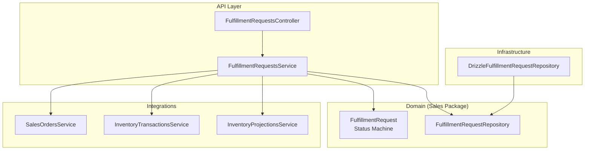
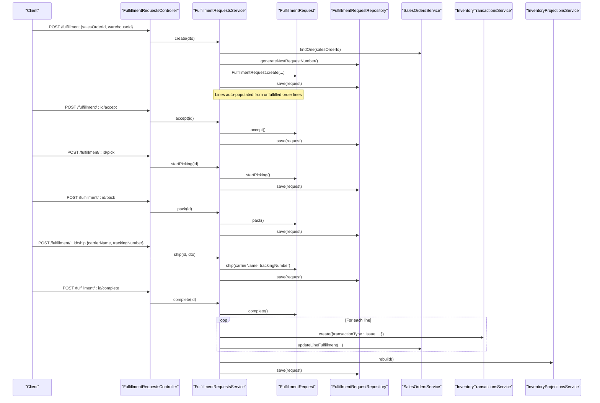
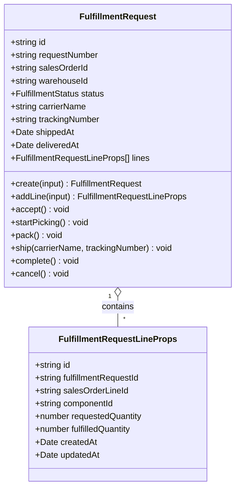
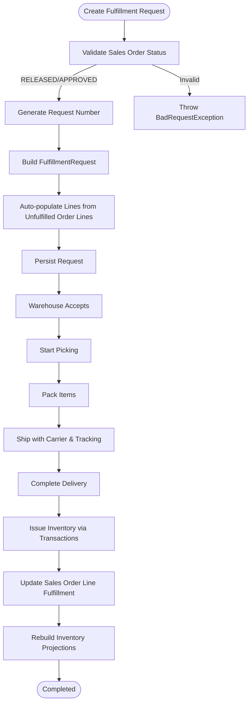
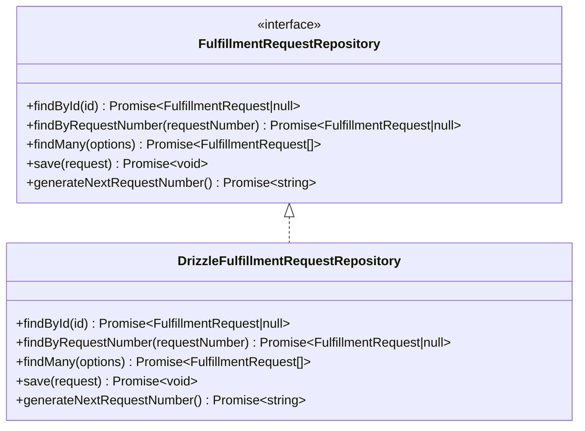
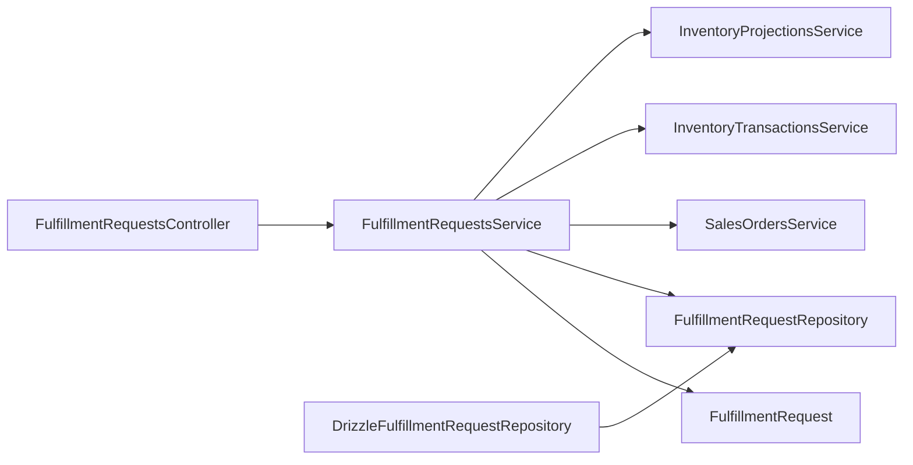

# Fulfillment Management

<cite>
**Referenced Files in This Document**
- [fulfillment-request.ts](file://packages/sales/src/fulfillment/fulfillment-request.ts)
- [fulfillment-request.repository.ts](file://packages/sales/src/fulfillment/fulfillment-request.repository.ts)
- [drizzle-fulfillment-request.repository.ts](file://apps/api/src/infrastructure/repositories/drizzle-fulfillment-request.repository.ts)
- [dtos.ts](file://apps/api/src/fulfillment/dtos.ts)
- [fulfillment-requests.controller.ts](file://apps/api/src/fulfillment/fulfillment-requests.controller.ts)
- [fulfillment-requests.service.ts](file://apps/api/src/fulfillment/fulfillment-requests.service.ts)
- [0028-order-fulfillment-requests.md](file://docs/rfcs/0028-order-fulfillment-requests.md)
- [0029-shipping-and-delivery.md](file://docs/rfcs/0029-shipping-and-delivery.md)
</cite>

## Table of Contents
1. [Introduction](#introduction)
2. [Project Structure](#project-structure)
3. [Core Components](#core-components)
4. [Architecture Overview](#architecture-overview)
5. [Detailed Component Analysis](#detailed-component-analysis)
6. [Dependency Analysis](#dependency-analysis)
7. [Performance Considerations](#performance-considerations)
8. [Troubleshooting Guide](#troubleshooting-guide)
9. [Conclusion](#conclusion)

## Introduction
This document explains Ananya ERP’s Fulfillment Management system. It covers the fulfillment request data model, fulfillment workflow from order confirmation through delivery, statuses, partial fulfillments and backorders, warehouse integration, API endpoints, repository implementation, and operational guidance for creating, allocating, tracking, and exception-handling fulfillment requests.

## Project Structure
The fulfillment feature spans domain models, application services, controllers, and a Drizzle-based repository:
- Domain model and state machine live in the Sales package.
- Application service orchestrates fulfillment operations and integrates with Sales Orders and Inventory subsystems.
- Controller exposes REST endpoints for fulfillment lifecycle actions.
- Repository persists fulfillment requests and lines using Drizzle.

**Diagram sources**
- [fulfillment-requests.controller.ts:10-68](file://apps/api/src/fulfillment/fulfillment-requests.controller.ts#L10-L68)
- [fulfillment-requests.service.ts:24-172](file://apps/api/src/fulfillment/fulfillment-requests.service.ts#L24-L172)
- [fulfillment-request.ts:50-169](file://packages/sales/src/fulfillment/fulfillment-request.ts#L50-L169)
- [fulfillment-request.repository.ts:9-19](file://packages/sales/src/fulfillment/fulfillment-request.repository.ts#L9-L19)
- [drizzle-fulfillment-request.repository.ts:47-159](file://apps/api/src/infrastructure/repositories/drizzle-fulfillment-request.repository.ts#L47-L159)

**Section sources**
- [fulfillment-requests.controller.ts:10-68](file://apps/api/src/fulfillment/fulfillment-requests.controller.ts#L10-L68)
- [fulfillment-requests.service.ts:24-172](file://apps/api/src/fulfillment/fulfillment-requests.service.ts#L24-L172)
- [fulfillment-request.ts:50-169](file://packages/sales/src/fulfillment/fulfillment-request.ts#L50-L169)
- [fulfillment-request.repository.ts:9-19](file://packages/sales/src/fulfillment/fulfillment-request.repository.ts#L9-L19)
- [drizzle-fulfillment-request.repository.ts:47-159](file://apps/api/src/infrastructure/repositories/drizzle-fulfillment-request.repository.ts#L47-L159)

## Core Components
- Fulfillment Request domain object defines the lifecycle states and line items.
- Repository interface abstracts persistence; Drizzle implementation provides SQL-backed storage.
- Service coordinates creation, status transitions, inventory deduction, and sales order updates.
- Controller exposes REST endpoints for each lifecycle action.
- DTOs validate input for create, add-line, and ship operations.

Key responsibilities:
- FulfillmentRequest: encapsulates state transitions and line-level tracking.
- FulfillmentRequestRepository: read/write contract for fulfillment requests.
- DrizzleFulfillmentRequestRepository: maps DB rows to domain objects and persists changes.
- FulfillmentRequestsService: enforces business rules, integrates with Sales and Inventory.
- FulfillmentRequestsController: routes HTTP requests to service methods.
- DTOs: enforce validation constraints on incoming payloads.

**Section sources**
- [fulfillment-request.ts:3-169](file://packages/sales/src/fulfillment/fulfillment-request.ts#L3-L169)
- [fulfillment-request.repository.ts:1-20](file://packages/sales/src/fulfillment/fulfillment-request.repository.ts#L1-L20)
- [drizzle-fulfillment-request.repository.ts:18-159](file://apps/api/src/infrastructure/repositories/drizzle-fulfillment-request.repository.ts#L18-L159)
- [fulfillment-requests.service.ts:24-172](file://apps/api/src/fulfillment/fulfillment-requests.service.ts#L24-L172)
- [fulfillment-requests.controller.ts:10-68](file://apps/api/src/fulfillment/fulfillment-requests.controller.ts#L10-L68)
- [dtos.ts:3-35](file://apps/api/src/fulfillment/dtos.ts#L3-L35)

## Architecture Overview
The fulfillment flow bridges Sales and Warehouse domains:
- Create a fulfillment request from an approved or released sales order.
- Warehouse accepts, picks, packs, ships, and completes delivery.
- On completion, physical stock is issued and sales order lines are updated.

**Diagram sources**
- [fulfillment-requests.controller.ts:16-68](file://apps/api/src/fulfillment/fulfillment-requests.controller.ts#L16-L68)
- [fulfillment-requests.service.ts:33-163](file://apps/api/src/fulfillment/fulfillment-requests.service.ts#L33-L163)
- [fulfillment-request.ts:79-169](file://packages/sales/src/fulfillment/fulfillment-request.ts#L79-L169)
- [drizzle-fulfillment-request.repository.ts:103-159](file://apps/api/src/infrastructure/repositories/drizzle-fulfillment-request.repository.ts#L103-L159)

## Detailed Component Analysis

### Data Model and State Machine
- FulfillmentRequest holds identifiers, warehouse assignment, carrier/tracking metadata, timestamps, and line items.
- Statuses: PENDING, ACCEPTED, PICKING, PACKED, SHIPPED, COMPLETED, CANCELLED.
- Line items track requested vs fulfilled quantities per component and link back to sales order lines.

**Diagram sources**
- [fulfillment-request.ts:12-36](file://packages/sales/src/fulfillment/fulfillment-request.ts#L12-L36)
- [fulfillment-request.ts:50-169](file://packages/sales/src/fulfillment/fulfillment-request.ts#L50-L169)

**Section sources**
- [fulfillment-request.ts:3-169](file://packages/sales/src/fulfillment/fulfillment-request.ts#L3-L169)

### Fulfillment Workflow
End-to-end process:
- Creation validates that the referenced sales order is RELEASED or APPROVED.
- Lines are auto-populated from unfulfilled order lines unless explicitly added later.
- Warehouse acceptance starts picking; packing follows; shipping records carrier and tracking; completion issues inventory and updates sales order lines.

**Diagram sources**
- [fulfillment-requests.service.ts:33-163](file://apps/api/src/fulfillment/fulfillment-requests.service.ts#L33-L163)
- [fulfillment-request.ts:79-169](file://packages/sales/src/fulfillment/fulfillment-request.ts#L79-L169)

**Section sources**
- [fulfillment-requests.service.ts:33-163](file://apps/api/src/fulfillment/fulfillment-requests.service.ts#L33-L163)
- [fulfillment-request.ts:79-169](file://packages/sales/src/fulfillment/fulfillment-request.ts#L79-L169)

### API Endpoints
- POST /fulfillment — Create fulfillment request from a sales order and warehouse.
- GET /fulfillment — List requests with optional filters by salesOrderId, warehouseId, status.
- GET /fulfillment/:id — Get a single fulfillment request.
- POST /fulfillment/:id/lines — Add a line to a pending request.
- POST /fulfillment/:id/accept — Warehouse accepts the request.
- POST /fulfillment/:id/pick — Start picking.
- POST /fulfillment/:id/pack — Pack items.
- POST /fulfillment/:id/ship — Record carrier and tracking number.
- POST /fulfillment/:id/complete — Finalize delivery, issue inventory, update sales orders, rebuild projections.
- POST /fulfillment/:id/cancel — Cancel a non-completed request.

Validation inputs:
- Create: salesOrderId, warehouseId.
- Add line: salesOrderLineId, componentId, requestedQuantity.
- Ship: carrierName, trackingNumber.

**Section sources**
- [fulfillment-requests.controller.ts:16-68](file://apps/api/src/fulfillment/fulfillment-requests.controller.ts#L16-L68)
- [dtos.ts:3-35](file://apps/api/src/fulfillment/dtos.ts#L3-L35)

### Repository and Persistence
- Repository interface defines find-by-id, find-by-number, find-many with filters, save, and next request number generation.
- Drizzle implementation maps database rows to domain objects, persists both header and lines, and generates sequential request numbers.

**Diagram sources**
- [fulfillment-request.repository.ts:1-20](file://packages/sales/src/fulfillment/fulfillment-request.repository.ts#L1-L20)
- [drizzle-fulfillment-request.repository.ts:47-159](file://apps/api/src/infrastructure/repositories/drizzle-fulfillment-request.repository.ts#L47-L159)

**Section sources**
- [fulfillment-request.repository.ts:1-20](file://packages/sales/src/fulfillment/fulfillment-request.repository.ts#L1-L20)
- [drizzle-fulfillment-request.repository.ts:18-159](file://apps/api/src/infrastructure/repositories/drizzle-fulfillment-request.repository.ts#L18-L159)

### Integration Points
- Sales Orders:
  - Creation requires order status RELEASED or APPROVED.
  - Completion updates line fulfillment balances.
- Inventory:
  - Completion issues stock via InventoryTransactionsService.
  - After completion, InventoryProjectionsService rebuilds projections.
- RFC references confirm these integrations and expected sequences.

**Section sources**
- [fulfillment-requests.service.ts:33-163](file://apps/api/src/fulfillment/fulfillment-requests.service.ts#L33-L163)
- [0028-order-fulfillment-requests.md:70-82](file://docs/rfcs/0028-order-fulfillment-requests.md#L70-L82)

### Practical Examples

#### Creating a Fulfillment Request
- Call POST /fulfillment with salesOrderId and warehouseId.
- The service validates the sales order status, generates a request number, creates the request, and auto-populates lines from unfulfilled order lines.

**Section sources**
- [fulfillment-requests.controller.ts:16-19](file://apps/api/src/fulfillment/fulfillment-requests.controller.ts#L16-L19)
- [fulfillment-requests.service.ts:33-62](file://apps/api/src/fulfillment/fulfillment-requests.service.ts#L33-L62)

#### Allocating Inventory to Orders
- Allocation occurs implicitly when lines are created from unfulfilled order lines during request creation.
- Physical allocation is recorded at completion via inventory transactions.

**Section sources**
- [fulfillment-requests.service.ts:48-60](file://apps/api/src/fulfillment/fulfillment-requests.service.ts#L48-L60)
- [fulfillment-requests.service.ts:135-154](file://apps/api/src/fulfillment/fulfillment-requests.service.ts#L135-L154)

#### Tracking Fulfillment Progress
- Use GET /fulfillment with filters (salesOrderId, warehouseId, status) to list requests.
- Use GET /fulfillment/:id to inspect details including lines and status.

**Section sources**
- [fulfillment-requests.controller.ts:21-33](file://apps/api/src/fulfillment/fulfillment-requests.controller.ts#L21-L33)

#### Handling Exceptions
- Invalid order status on creation throws a bad request error.
- Completing a non-SHIPPED request throws a bad request error.
- Adding lines is restricted to PENDING requests by the domain model.

**Section sources**
- [fulfillment-requests.service.ts:35-39](file://apps/api/src/fulfillment/fulfillment-requests.service.ts#L35-L39)
- [fulfillment-requests.service.ts:129-133](file://apps/api/src/fulfillment/fulfillment-requests.service.ts#L129-L133)
- [fulfillment-request.ts:97-100](file://packages/sales/src/fulfillment/fulfillment-request.ts#L97-L100)

## Dependency Analysis
High-level dependencies:
- Controller depends on Service.
- Service depends on Domain (FulfillmentRequest), Repository interface, SalesOrdersService, InventoryTransactionsService, and InventoryProjectionsService.
- Drizzle repository implements Repository interface and uses database schema tables for fulfillment_requests and fulfillment_request_lines.

**Diagram sources**
- [fulfillment-requests.controller.ts:10-68](file://apps/api/src/fulfillment/fulfillment-requests.controller.ts#L10-L68)
- [fulfillment-requests.service.ts:24-172](file://apps/api/src/fulfillment/fulfillment-requests.service.ts#L24-L172)
- [fulfillment-request.repository.ts:9-19](file://packages/sales/src/fulfillment/fulfillment-request.repository.ts#L9-L19)
- [drizzle-fulfillment-request.repository.ts:47-159](file://apps/api/src/infrastructure/repositories/drizzle-fulfillment-request.repository.ts#L47-L159)

**Section sources**
- [fulfillment-requests.controller.ts:10-68](file://apps/api/src/fulfillment/fulfillment-requests.controller.ts#L10-L68)
- [fulfillment-requests.service.ts:24-172](file://apps/api/src/fulfillment/fulfillment-requests.service.ts#L24-L172)
- [fulfillment-request.repository.ts:9-19](file://packages/sales/src/fulfillment/fulfillment-request.repository.ts#L9-L19)
- [drizzle-fulfillment-request.repository.ts:47-159](file://apps/api/src/infrastructure/repositories/drizzle-fulfillment-request.repository.ts#L47-L159)

## Performance Considerations
- Batch persistence: Repository.save writes both header and lines in a single transactional-like operation using upserts to minimize round-trips.
- Projection rebuild: Inventory projections are rebuilt after completion to ensure downstream analytics reflect actual stock movements.
- Filtering: Repository.findMany supports filtering by salesOrderId, warehouseId, and status to reduce payload sizes for listing endpoints.

[No sources needed since this section provides general guidance]

## Troubleshooting Guide
Common issues and resolutions:
- Cannot create fulfillment request: Ensure the sales order is RELEASED or APPROVED before calling create.
- Cannot complete fulfillment: Only SHIPPED requests can be completed; verify prior ship step.
- Cannot add lines: Only PENDING requests allow adding lines; move to ACCEPTED/PICKING/... to proceed without adding.
- Missing carrier/tracking: Ship endpoint requires carrierName and trackingNumber; provide both.

Operational checks:
- Verify inventory transactions were issued upon completion.
- Confirm sales order line fulfillment balances were updated.
- Ensure inventory projections were rebuilt post-completion.

**Section sources**
- [fulfillment-requests.service.ts:35-39](file://apps/api/src/fulfillment/fulfillment-requests.service.ts#L35-L39)
- [fulfillment-requests.service.ts:129-133](file://apps/api/src/fulfillment/fulfillment-requests.service.ts#L129-L133)
- [fulfillment-request.ts:97-100](file://packages/sales/src/fulfillment/fulfillment-request.ts#L97-L100)
- [fulfillment-requests.service.ts:135-163](file://apps/api/src/fulfillment/fulfillment-requests.service.ts#L135-L163)

## Conclusion
Ananya ERP’s Fulfillment Management system provides a robust, state-driven workflow that translates approved sales orders into actionable warehouse tasks. It enforces clear invariants, integrates tightly with sales and inventory subsystems, and exposes a concise set of APIs for end-to-end fulfillment orchestration. The design supports partial fulfillments through line-level tracking and enables reliable reconciliation between commercial commitments and physical stock movements.