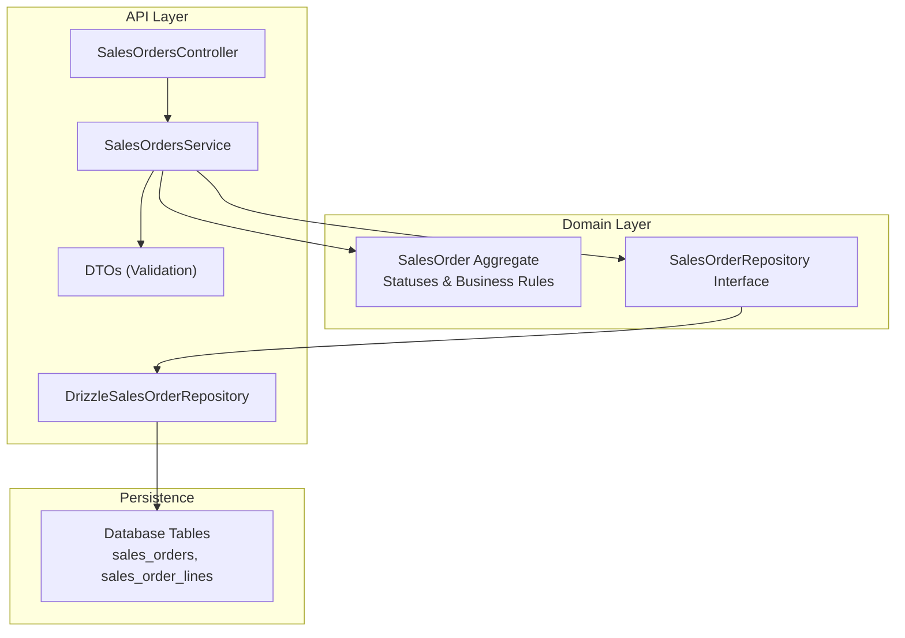
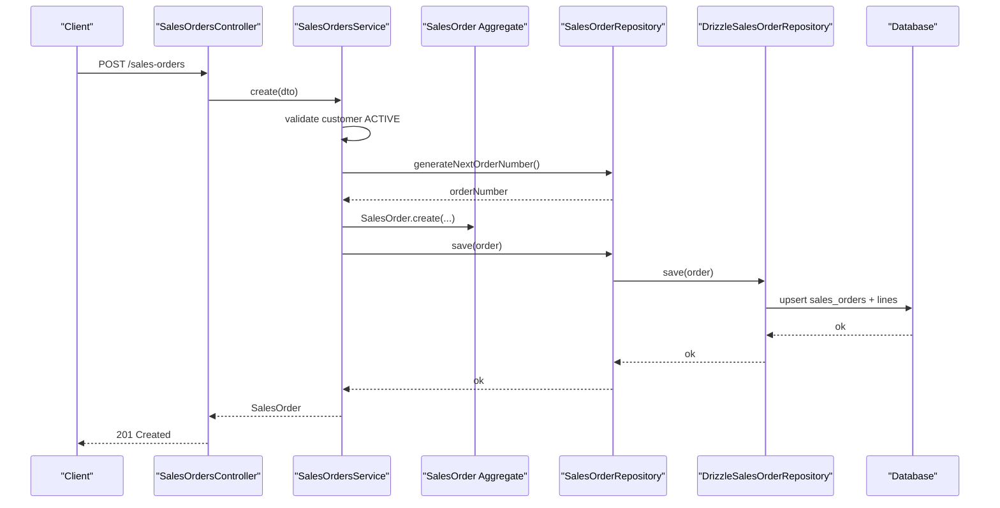
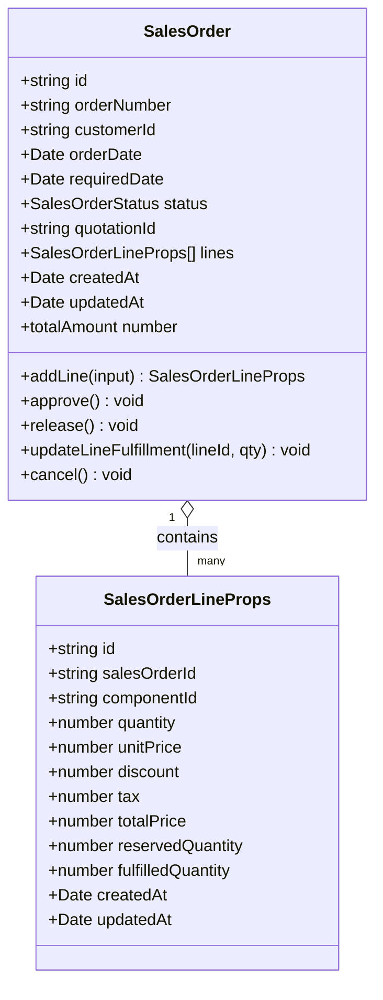
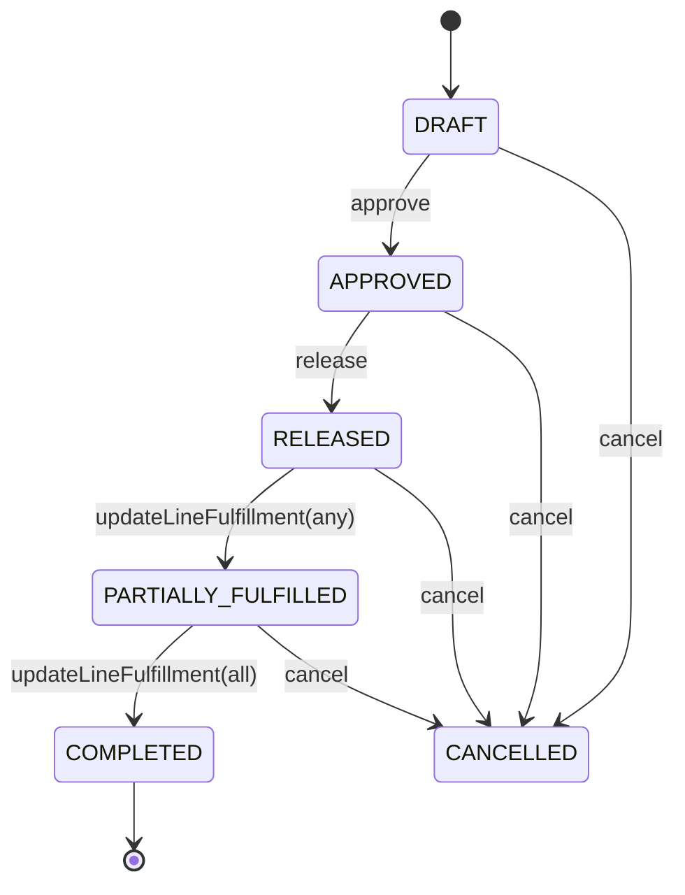
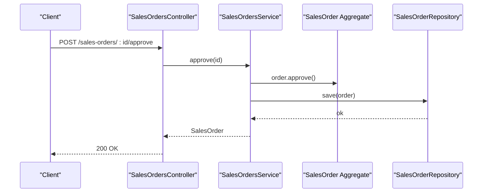
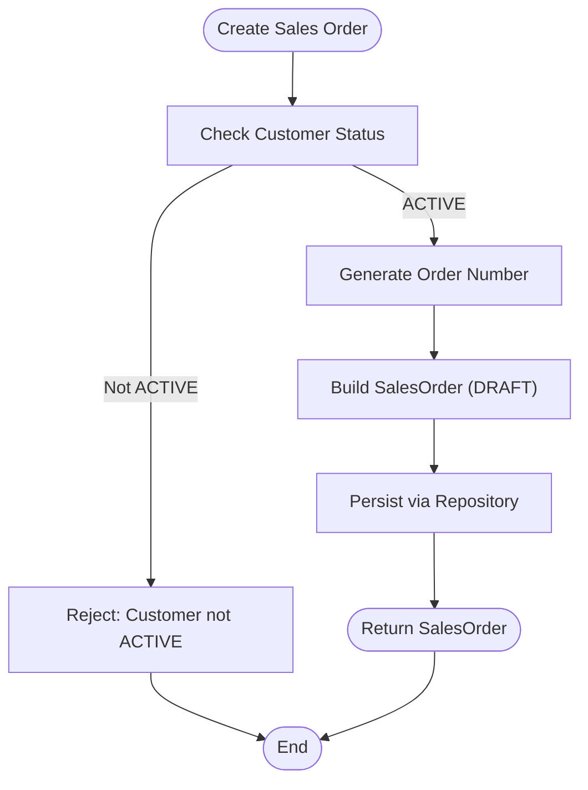
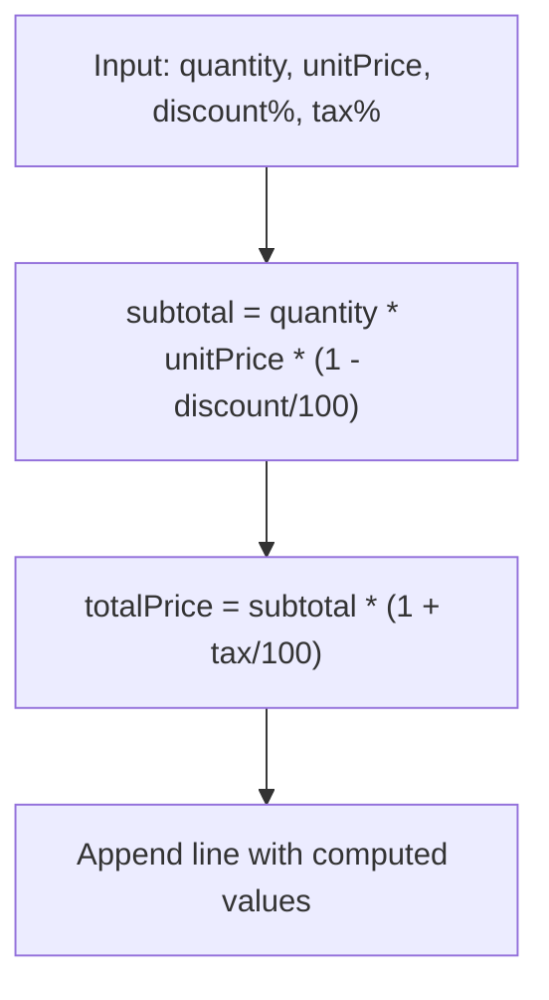
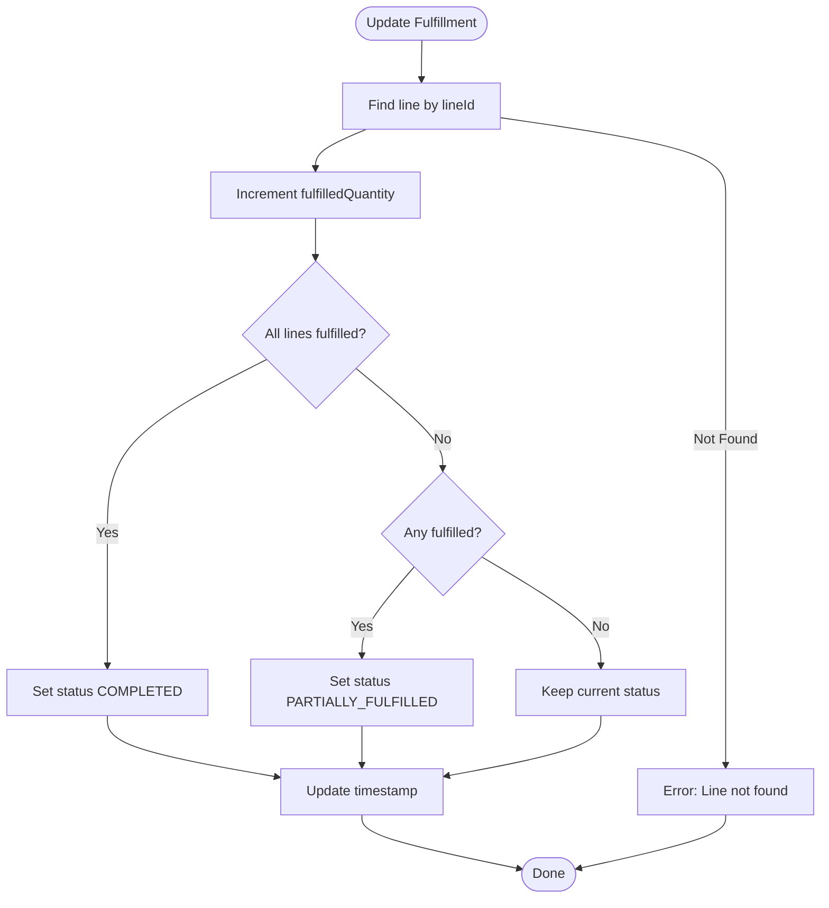
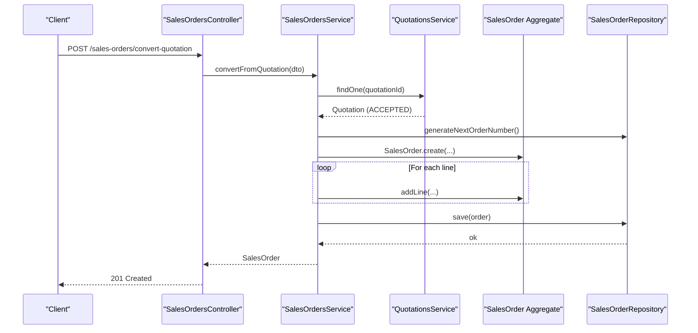
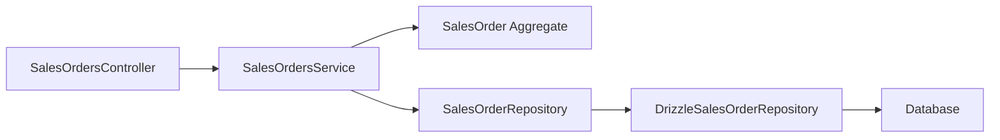

# Sales Order Management

<cite>
**Referenced Files in This Document**
- [0027-quotations-and-sales-orders.md](file://docs/rfcs/0027-quotations-and-sales-orders.md)
- [sales-orders.controller.ts](file://apps/api/src/sales-orders/sales-orders.controller.ts)
- [sales-orders.service.ts](file://apps/api/src/sales-orders/sales-orders.service.ts)
- [dtos.ts](file://apps/api/src/sales-orders/dtos.ts)
- [sales-order.ts](file://packages/sales/src/sales-orders/sales-order.ts)
- [sales-order.repository.ts](file://packages/sales/src/sales-orders/sales-order.repository.ts)
- [drizzle-sales-order.repository.ts](file://apps/api/src/infrastructure/repositories/drizzle-sales-order.repository.ts)
</cite>

## Table of Contents
1. [Introduction](#introduction)
2. [Project Structure](#project-structure)
3. [Core Components](#core-components)
4. [Architecture Overview](#architecture-overview)
5. [Detailed Component Analysis](#detailed-component-analysis)
6. [Dependency Analysis](#dependency-analysis)
7. [Performance Considerations](#performance-considerations)
8. [Troubleshooting Guide](#troubleshooting-guide)
9. [Conclusion](#conclusion)

## Introduction
This document explains Ananya ERP’s Sales Order Management system, covering the data model, lifecycle, business rules, API endpoints, repository implementation, and frontend integration points. It is intended for both technical and non-technical readers to understand how sales orders are created, validated, priced, fulfilled, and tracked through their lifecycle.

## Project Structure
The Sales Order feature spans three layers:
- Domain layer (packages/sales): Defines the SalesOrder aggregate, statuses, line item structure, and repository contract.
- Application/API layer (apps/api): Provides controllers, services, DTOs, and a Drizzle-based repository implementation.
- Documentation (docs/rfcs): Describes domain concepts, state machines, and workflows.

**Diagram sources**
- [sales-order.ts:3-10](file://packages/sales/src/sales-orders/sales-order.ts#L3-L10)
- [sales-order.repository.ts:8-14](file://packages/sales/src/sales-orders/sales-order.repository.ts#L8-L14)
- [sales-orders.controller.ts:10-55](file://apps/api/src/sales-orders/sales-orders.controller.ts#L10-L55)
- [sales-orders.service.ts:22-29](file://apps/api/src/sales-orders/sales-orders.service.ts#L22-L29)
- [drizzle-sales-order.repository.ts:46-153](file://apps/api/src/infrastructure/repositories/drizzle-sales-order.repository.ts#L46-L153)

**Section sources**
- [0027-quotations-and-sales-orders.md:20-33](file://docs/rfcs/0027-quotations-and-sales-orders.md#L20-L33)
- [sales-order.ts:3-10](file://packages/sales/src/sales-orders/sales-order.ts#L3-L10)
- [sales-orders.controller.ts:10-55](file://apps/api/src/sales-orders/sales-orders.controller.ts#L10-L55)

## Core Components
- SalesOrder aggregate: Encapsulates order headers, line items, pricing calculations, fulfillment tracking, and status transitions.
- SalesOrderRepository interface: Defines persistence operations and query filters.
- DrizzleSalesOrderRepository: Implements persistence using Drizzle ORM with upsert semantics for orders and lines.
- SalesOrdersService: Orchestrates business logic including customer validation, quotation conversion, line management, approvals, releases, fulfillment updates, and cancellations.
- SalesOrdersController: Exposes REST endpoints for CRUD and workflow actions.
- DTOs: Validate inputs for creating orders, converting quotations, and adding line items.

Key responsibilities:
- Data modeling and invariants live in the domain aggregate.
- Validation and orchestration live in the service layer.
- Persistence details live in the repository implementation.
- HTTP contracts live in the controller.

**Section sources**
- [sales-order.ts:56-191](file://packages/sales/src/sales-orders/sales-order.ts#L56-L191)
- [sales-order.repository.ts:8-14](file://packages/sales/src/sales-orders/sales-order.repository.ts#L8-L14)
- [drizzle-sales-order.repository.ts:46-153](file://apps/api/src/infrastructure/repositories/drizzle-sales-order.repository.ts#L46-L153)
- [sales-orders.service.ts:31-133](file://apps/api/src/sales-orders/sales-orders.service.ts#L31-L133)
- [sales-orders.controller.ts:10-55](file://apps/api/src/sales-orders/sales-orders.controller.ts#L10-L55)
- [dtos.ts:10-60](file://apps/api/src/sales-orders/dtos.ts#L10-L60)

## Architecture Overview
The system follows layered architecture with clear separation between domain, application, and infrastructure concerns. The SalesOrder aggregate enforces business rules; the service coordinates cross-cutting concerns like customer checks and quotation conversion; the repository abstracts persistence.

**Diagram sources**
- [sales-orders.controller.ts:14-17](file://apps/api/src/sales-orders/sales-orders.controller.ts#L14-L17)
- [sales-orders.service.ts:31-49](file://apps/api/src/sales-orders/sales-orders.service.ts#L31-L49)
- [sales-order.ts:81-95](file://packages/sales/src/sales-orders/sales-order.ts#L81-L95)
- [drizzle-sales-order.repository.ts:95-145](file://apps/api/src/infrastructure/repositories/drizzle-sales-order.repository.ts#L95-L145)

## Detailed Component Analysis

### Data Model
- Order header fields include identifiers, customer reference, dates, status, optional quotation link, timestamps.
- Line items include component reference, quantity, unit price, discount, tax, computed total price, reserved and fulfilled quantities, timestamps.
- Pricing calculation applies discount percentage then tax percentage on subtotal per line.
- Fulfillment tracking uses per-line fulfilledQuantity and reservedQuantity to derive overall order status.

**Diagram sources**
- [sales-order.ts:12-38](file://packages/sales/src/sales-orders/sales-order.ts#L12-L38)
- [sales-order.ts:56-103](file://packages/sales/src/sales-orders/sales-order.ts#L56-L103)
- [sales-order.ts:105-140](file://packages/sales/src/sales-orders/sales-order.ts#L105-L140)

**Section sources**
- [sales-order.ts:12-38](file://packages/sales/src/sales-orders/sales-order.ts#L12-L38)
- [sales-order.ts:101-140](file://packages/sales/src/sales-orders/sales-order.ts#L101-L140)

### Lifecycle and Status Transitions
Valid statuses: DRAFT, APPROVED, RELEASED, ALLOCATED, PARTIALLY_FULFILLED, COMPLETED, CANCELLED.

Rules:
- Lines can only be added when status is DRAFT.
- Approve requires at least one line.
- Release requires APPROVED status.
- Fulfillment updates transition to PARTIALLY_FULFILLED or COMPLETED based on per-line fulfillment.
- Cancel is disallowed from COMPLETED.

**Diagram sources**
- [sales-order.ts:3-10](file://packages/sales/src/sales-orders/sales-order.ts#L3-L10)
- [sales-order.ts:142-190](file://packages/sales/src/sales-orders/sales-order.ts#L142-L190)

**Section sources**
- [sales-order.ts:142-190](file://packages/sales/src/sales-orders/sales-order.ts#L142-L190)

### API Endpoints
- Create sales order: POST /sales-orders
- Convert accepted quotation to sales order: POST /sales-orders/convert-quotation
- List sales orders: GET /sales-orders?customerId=&status=
- Get sales order by ID: GET /sales-orders/:id
- Add line item: POST /sales-orders/:id/lines
- Approve: POST /sales-orders/:id/approve
- Release: POST /sales-orders/:id/release
- Cancel: POST /sales-orders/:id/cancel

**Diagram sources**
- [sales-orders.controller.ts:42-45](file://apps/api/src/sales-orders/sales-orders.controller.ts#L42-L45)
- [sales-orders.service.ts:103-108](file://apps/api/src/sales-orders/sales-orders.service.ts#L103-L108)
- [sales-order.ts:142-151](file://packages/sales/src/sales-orders/sales-order.ts#L142-L151)

**Section sources**
- [sales-orders.controller.ts:10-55](file://apps/api/src/sales-orders/sales-orders.controller.ts#L10-L55)

### Validation Rules
- Customer must be ACTIVE to create an order.
- Only ACCEPTED quotations can be converted to sales orders.
- Line creation requires positive quantity and non-negative unit price.
- Discount and tax are optional but must be non-negative when provided.

**Diagram sources**
- [sales-orders.service.ts:31-49](file://apps/api/src/sales-orders/sales-orders.service.ts#L31-L49)
- [dtos.ts:10-26](file://apps/api/src/sales-orders/dtos.ts#L10-L26)

**Section sources**
- [sales-orders.service.ts:31-49](file://apps/api/src/sales-orders/sales-orders.service.ts#L31-L49)
- [dtos.ts:10-60](file://apps/api/src/sales-orders/dtos.ts#L10-L60)

### Pricing Calculations and Tax Handling
- Per-line subtotal = quantity × unitPrice × (1 - discount/100).
- Per-line total price = subtotal × (1 + tax/100).
- Order total amount is the sum of all line total prices.

**Diagram sources**
- [sales-order.ts:116-130](file://packages/sales/src/sales-orders/sales-order.ts#L116-L130)

**Section sources**
- [sales-order.ts:101-140](file://packages/sales/src/sales-orders/sales-order.ts#L101-L140)

### Inventory Checks and Fulfillment
- Sales orders do not directly issue inventory; they track reserved and fulfilled quantities per line.
- Fulfillment updates increment fulfilledQuantity and adjust order status accordingly.
- Warehouse integration occurs when an order is released, typically via a separate fulfillment request mechanism.

**Diagram sources**
- [sales-order.ts:163-182](file://packages/sales/src/sales-orders/sales-order.ts#L163-L182)

**Section sources**
- [sales-order.ts:163-182](file://packages/sales/src/sales-orders/sales-order.ts#L163-L182)

### Quotation to Sales Order Conversion
- Only ACCEPTED quotations can be converted.
- Conversion copies customer and line items, preserving pricing and discounts.
- Optional required date can be set during conversion.

**Diagram sources**
- [sales-orders.controller.ts:19-22](file://apps/api/src/sales-orders/sales-orders.controller.ts#L19-L22)
- [sales-orders.service.ts:51-79](file://apps/api/src/sales-orders/sales-orders.service.ts#L51-L79)

**Section sources**
- [sales-orders.service.ts:51-79](file://apps/api/src/sales-orders/sales-orders.service.ts#L51-L79)

### Frontend Integration Points
- Typical UI flows:
  - Create sales order form bound to POST /sales-orders.
  - Edit/add lines while order is DRAFT via POST /sales-orders/:id/lines.
  - Workflow buttons for Approve and Release mapped to respective endpoints.
  - Fulfillment screens updating line fulfillment via service methods exposed by backend.
- The RFC outlines UI routes for managing quotations and sales orders.

**Section sources**
- [0027-quotations-and-sales-orders.md:101-104](file://docs/rfcs/0027-quotations-and-sales-orders.md#L101-L104)

## Dependency Analysis

**Diagram sources**
- [sales-orders.controller.ts:10-55](file://apps/api/src/sales-orders/sales-orders.controller.ts#L10-L55)
- [sales-orders.service.ts:22-29](file://apps/api/src/sales-orders/sales-orders.service.ts#L22-L29)
- [sales-order.repository.ts:8-14](file://packages/sales/src/sales-orders/sales-order.repository.ts#L8-L14)
- [drizzle-sales-order.repository.ts:46-153](file://apps/api/src/infrastructure/repositories/drizzle-sales-order.repository.ts#L46-L153)

**Section sources**
- [sales-orders.controller.ts:10-55](file://apps/api/src/sales-orders/sales-orders.controller.ts#L10-L55)
- [sales-orders.service.ts:22-29](file://apps/api/src/sales-orders/sales-orders.service.ts#L22-L29)
- [sales-order.repository.ts:8-14](file://packages/sales/src/sales-orders/sales-order.repository.ts#L8-L14)
- [drizzle-sales-order.repository.ts:46-153](file://apps/api/src/infrastructure/repositories/drizzle-sales-order.repository.ts#L46-L153)

## Performance Considerations
- Repository queries load lines eagerly per order; consider batching or pagination for large datasets.
- Upsert semantics for orders and lines reduce round-trips but may increase payload size; ensure indexes on frequently filtered fields such as customerId and status.
- Avoid unnecessary recomputation of totals; leverage persisted totalPrice where possible.

[No sources needed since this section provides general guidance]

## Troubleshooting Guide
Common issues and resolutions:
- Cannot add lines after approval: Ensure order remains in DRAFT before adding lines.
- Cannot approve without lines: Add at least one line before approving.
- Cannot release unless approved: Approve first, then release.
- Cannot cancel completed orders: Orders in COMPLETED cannot be cancelled.
- Customer not active: Ensure customer status is ACTIVE before creating orders.
- Quotation not accepted: Only ACCEPTED quotations can be converted.

Operational tips:
- Use list endpoints with filters (customerId, status) to locate problematic orders.
- Inspect line-level fulfillment to diagnose partial vs. complete fulfillment states.

**Section sources**
- [sales-order.ts:105-114](file://packages/sales/src/sales-orders/sales-order.ts#L105-L114)
- [sales-order.ts:142-190](file://packages/sales/src/sales-orders/sales-order.ts#L142-L190)
- [sales-orders.service.ts:31-49](file://apps/api/src/sales-orders/sales-orders.service.ts#L31-L49)
- [sales-orders.service.ts:51-79](file://apps/api/src/sales-orders/sales-orders.service.ts#L51-L79)

## Conclusion
Ananya ERP’s Sales Order Management provides a robust, domain-driven model with clear lifecycle controls, precise pricing and tax handling, and extensible fulfillment tracking. The layered architecture ensures maintainability and testability, while the API exposes straightforward endpoints for common order workflows. Adhering to the documented validation rules and status transitions will help teams implement reliable order processing and reporting.