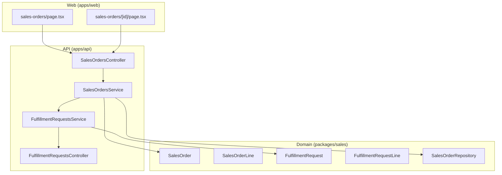
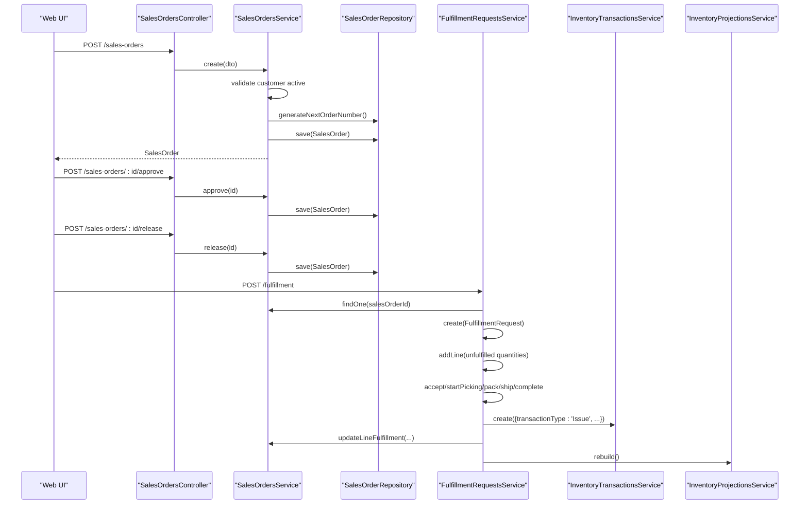
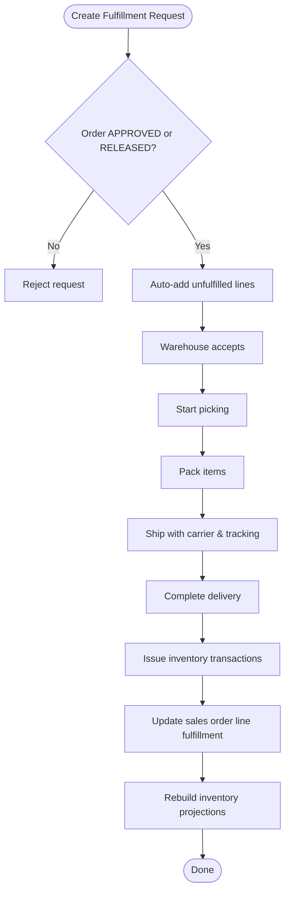
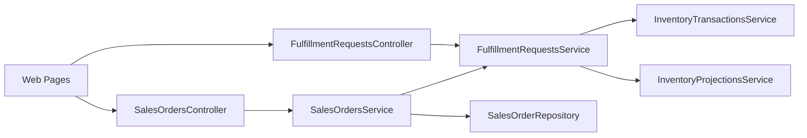

# Sales Order Processing

<cite>
**Referenced Files in This Document**
- [RFC-0027: Quotations & Sales Orders](file://docs/rfcs/0027-quotations-and-sales-orders.md)
- [RFC-0028: Order Fulfillment Requests](file://docs/rfcs/0028-order-fulfillment-requests.md)
- [RFC-0029: Shipping & Delivery](file://docs/rfcs/0029-shipping-and-delivery.md)
- [SalesOrder domain model](file://packages/sales/src/sales-orders/sales-order.ts)
- [SalesOrder repository interface](file://packages/sales/src/sales-orders/sales-order.repository.ts)
- [FulfillmentRequest domain model](file://packages/sales/src/fulfillment/fulfillment-request.ts)
- [SalesOrdersService](file://apps/api/src/sales-orders/sales-orders.service.ts)
- [SalesOrdersController](file://apps/api/src/sales-orders/sales-orders.controller.ts)
- [SalesOrders DTOs](file://apps/api/src/sales-orders/dtos.ts)
- [FulfillmentRequestsService](file://apps/api/src/fulfillment/fulfillment-requests.service.ts)
- [FulfillmentRequestsController](file://apps/api/src/fulfillment/fulfillment-requests.controller.ts)
- [Web Sales Orders list page](file://apps/web/app/sales-orders/page.tsx)
- [Web Sales Order detail page](file://apps/web/app/sales-orders/[id]/page.tsx)
</cite>

## Table of Contents
1. Introduction
2. Project Structure
3. Core Components
4. Architecture Overview
5. Detailed Component Analysis
6. Dependency Analysis
7. Performance Considerations
8. Troubleshooting Guide
9. Conclusion
10. Appendices

## Introduction
This document explains Ananya ERP’s Sales Order Processing system end-to-end. It covers the sales order data model (order headers, line items, pricing, shipping information, and fulfillment status), the complete lifecycle from creation through fulfillment (validation, inventory allocation, picking, packing, shipping, delivery confirmation), statuses and workflow transitions, and integrations with inventory, warehouse, and finance systems. It also includes practical examples for creating orders, processing fulfillments, tracking status, and handling modifications, along with API endpoints, repository usage, fulfillment request integration, and frontend components.

## Project Structure
The Sales Order Processing feature spans three layers:
- Domain models and repositories in packages/sales
- Application services and REST controllers in apps/api
- User interfaces in apps/web

**Diagram sources**
- [SalesOrder domain model](file://packages/sales/src/sales-orders/sales-order.ts)
- [FulfillmentRequest domain model](file://packages/sales/src/fulfillment/fulfillment-request.ts)
- [SalesOrdersService](file://apps/api/src/sales-orders/sales-orders.service.ts)
- [SalesOrdersController](file://apps/api/src/sales-orders/sales-orders.controller.ts)
- [FulfillmentRequestsService](file://apps/api/src/fulfillment/fulfillment-requests.service.ts)
- [FulfillmentRequestsController](file://apps/api/src/fulfillment/fulfillment-requests.controller.ts)
- [Web Sales Orders list page](file://apps/web/app/sales-orders/page.tsx)
- [Web Sales Order detail page](file://apps/web/app/sales-orders/[id]/page.tsx)

**Section sources**
- [RFC-0027: Quotations & Sales Orders](file://docs/rfcs/0027-quotations-and-sales-orders.md)
- [RFC-0028: Order Fulfillment Requests](file://docs/rfcs/0028-order-fulfillment-requests.md)
- [RFC-0029: Shipping & Delivery](file://docs/rfcs/0029-shipping-and-delivery.md)

## Core Components
- SalesOrder aggregate: defines order header fields, line items, pricing calculations, and lifecycle methods (approve, release, update fulfillment, cancel).
- FulfillmentRequest aggregate: bridges Sales to Warehouse operations; manages pick/pack/ship states and links back to Sales Order lines.
- Repositories: abstract persistence for SalesOrder and FulfillmentRequest.
- Application Services: orchestrate business rules, validation, cross-service calls (inventory, projections), and persistence.
- Controllers: expose REST endpoints for UI and external clients.
- Frontend pages: provide listing, filtering, and detail views for sales orders.

Key responsibilities:
- SalesOrdersService validates customers, creates orders, converts accepted quotations, approves/releases orders, updates fulfillment balances, and cancels orders.
- FulfillmentRequestsService creates fulfillment requests from released/approved orders, advances warehouse states, issues inventory transactions on completion, updates sales order line fulfillment, and rebuilds projections.

**Section sources**
- [SalesOrder domain model](file://packages/sales/src/sales-orders/sales-order.ts)
- [SalesOrder repository interface](file://packages/sales/src/sales-orders/sales-order.repository.ts)
- [FulfillmentRequest domain model](file://packages/sales/src/fulfillment/fulfillment-request.ts)
- [SalesOrdersService](file://apps/api/src/sales-orders/sales-orders.service.ts)
- [FulfillmentRequestsService](file://apps/api/src/fulfillment/fulfillment-requests.service.ts)

## Architecture Overview
The system follows a layered architecture with clear separation between domain logic, application orchestration, and presentation.

**Diagram sources**
- [SalesOrdersController](file://apps/api/src/sales-orders/sales-orders.controller.ts)
- [SalesOrdersService](file://apps/api/src/sales-orders/sales-orders.service.ts)
- [FulfillmentRequestsService](file://apps/api/src/fulfillment/fulfillment-requests.service.ts)
- [SalesOrder domain model](file://packages/sales/src/sales-orders/sales-order.ts)
- [FulfillmentRequest domain model](file://packages/sales/src/fulfillment/fulfillment-request.ts)

## Detailed Component Analysis

### Sales Order Data Model
- Order header: unique identifier, order number, customer reference, order date, required date, optional quotation link, status, timestamps.
- Line items: component reference, quantity, unit price, discount, tax, computed total price, reserved and fulfilled quantities, timestamps.
- Pricing: line total is derived from quantity, unit price, discount percentage, and tax percentage.
- Statuses: DRAFT, APPROVED, RELEASED, ALLOCATED, PARTIALLY_FULFILLED, COMPLETED, CANCELLED.

Lifecycle highlights:
- Create: initializes in DRAFT with empty lines.
- Add lines: allowed only in DRAFT; enforces positive quantity and non-negative unit price.
- Approve: requires at least one line; transitions to APPROVED.
- Release: transitions to RELEASED to enable fulfillment.
- Fulfillment updates: increments fulfilledQuantity per line; auto-updates order status to PARTIALLY_FULFILLED or COMPLETED.
- Cancel: disallowed after COMPLETED.

**Section sources**
- [SalesOrder domain model](file://packages/sales/src/sales-orders/sales-order.ts)

### Fulfillment Request Model and Workflow
- Header: request number, sales order reference, warehouse reference, status, carrier/tracking/shipped/delivered timestamps.
- Lines: map to sales order lines, requested vs fulfilled quantities.
- Statuses: PENDING, ACCEPTED, PICKING, PACKED, SHIPPED, COMPLETED, CANCELLED.
- Workflow:
  - Create from an APPROVED or RELEASED sales order; auto-populates unfulfilled lines.
  - Accept by warehouse, start picking, pack, ship (requires carrier and tracking), complete (issues inventory and updates sales order fulfillment).

**Diagram sources**
- [FulfillmentRequestsService](file://apps/api/src/fulfillment/fulfillment-requests.service.ts)
- [FulfillmentRequest domain model](file://packages/sales/src/fulfillment/fulfillment-request.ts)

**Section sources**
- [RFC-0028: Order Fulfillment Requests](file://docs/rfcs/0028-order-fulfillment-requests.md)
- [FulfillmentRequestsService](file://apps/api/src/fulfillment/fulfillment-requests.service.ts)
- [FulfillmentRequest domain model](file://packages/sales/src/fulfillment/fulfillment-request.ts)

### API Endpoints and Usage Examples
Sales Orders
- POST /sales-orders: Create a new sales order for an active customer.
- POST /sales-orders/convert-quotation: Convert an accepted quotation into a sales order.
- GET /sales-orders?customerId=&status=: List orders with optional filters.
- GET /sales-orders/:id: Retrieve a specific order.
- POST /sales-orders/:id/lines: Add a line item (only when DRAFT).
- POST /sales-orders/:id/approve: Approve a DRAFT order.
- POST /sales-orders/:id/release: Release an APPROVED order for fulfillment.
- POST /sales-orders/:id/cancel: Cancel an order (not allowed if COMPLETED).

Fulfillment
- POST /fulfillment: Create a fulfillment request from an approved/released order.
- GET /fulfillment?salesOrderId=&warehouseId=&status=: List fulfillment requests.
- GET /fulfillment/:id: Get a specific fulfillment request.
- POST /fulfillment/:id/lines: Add lines to a PENDING request.
- POST /fulfillment/:id/accept: Warehouse accepts the request.
- POST /fulfillment/:id/pick: Start picking.
- POST /fulfillment/:id/pack: Pack items.
- POST /fulfillment/:id/ship: Ship with carrier name and tracking number.
- POST /fulfillment/:id/complete: Confirm delivery; issues inventory and updates sales order fulfillment.
- POST /fulfillment/:id/cancel: Cancel before completion.

Practical example flows
- Create and approve an order:
  - Call POST /sales-orders with customerId and optional dates.
  - Add line items via POST /sales-orders/:id/lines while DRAFT.
  - Approve via POST /sales-orders/:id/approve.
- Release and fulfill:
  - Release via POST /sales-orders/:id/release.
  - Create fulfillment via POST /fulfillment with salesOrderId and warehouseId.
  - Advance through accept/pick/pack/ship/complete using respective endpoints.
- Track status:
  - Query GET /sales-orders?status=RELEASED to find orders ready for fulfillment.
  - Query GET /fulfillment?status=PICKING to monitor warehouse progress.

**Section sources**
- [SalesOrdersController](file://apps/api/src/sales-orders/sales-orders.controller.ts)
- [SalesOrdersService](file://apps/api/src/sales-orders/sales-orders.service.ts)
- [SalesOrders DTOs](file://apps/api/src/sales-orders/dtos.ts)
- [FulfillmentRequestsController](file://apps/api/src/fulfillment/fulfillment-requests.controller.ts)
- [FulfillmentRequestsService](file://apps/api/src/fulfillment/fulfillment-requests.service.ts)
- [RFC-0027: Quotations & Sales Orders](file://docs/rfcs/0027-quotations-and-sales-orders.md)
- [RFC-0028: Order Fulfillment Requests](file://docs/rfcs/0028-order-fulfillment-requests.md)
- [RFC-0029: Shipping & Delivery](file://docs/rfcs/0029-shipping-and-delivery.md)

### Repository and Persistence
- SalesOrderRepository provides findById, findByOrderNumber, findMany with filters, save, and generateNextOrderNumber.
- FulfillmentRequestRepository mirrors similar capabilities for fulfillment requests.

These abstractions decouple domain logic from storage and support testability and future migration.

**Section sources**
- [SalesOrder repository interface](file://packages/sales/src/sales-orders/sales-order.repository.ts)

### Integrations
- Inventory: On fulfillment completion, the system issues inventory transactions to deduct stock and rebuilds inventory projections for accurate availability.
- Finance: While not directly implemented here, completed sales orders and fulfilled lines are typical triggers for invoicing and accounts receivable workflows downstream.
- Warehouse: Fulfillment requests encapsulate pick/pack/ship tasks and integrate with warehouse processes via state transitions and line-level fulfillment mapping.

**Section sources**
- [FulfillmentRequestsService](file://apps/api/src/fulfillment/fulfillment-requests.service.ts)
- [RFC-0028: Order Fulfillment Requests](file://docs/rfcs/0028-order-fulfillment-requests.md)

### Frontend Components
- Sales Orders list page: Displays summary stats, filterable table of orders, and navigation to details.
- Sales Order detail page: Shows key order info, fulfillment status, and line items; includes actions such as printing packing slips and dispatching shipments.

These pages demonstrate how users interact with the sales order lifecycle and fulfillment controls.

**Section sources**
- [Web Sales Orders list page](file://apps/web/app/sales-orders/page.tsx)
- [Web Sales Order detail page](file://apps/web/app/sales-orders/[id]/page.tsx)

## Dependency Analysis
High-level dependencies among modules:

- Coupling: Controllers depend on services; services depend on domain aggregates and repositories; fulfillment service depends on inventory services for stock movements and projections.
- Cohesion: Each service encapsulates a bounded context (sales orders vs fulfillment), keeping related operations together.
- External boundaries: Inventory and projection services act as integration points for stock and planning.

**Diagram sources**
- [SalesOrdersController](file://apps/api/src/sales-orders/sales-orders.controller.ts)
- [SalesOrdersService](file://apps/api/src/sales-orders/sales-orders.service.ts)
- [FulfillmentRequestsController](file://apps/api/src/fulfillment/fulfillment-requests.controller.ts)
- [FulfillmentRequestsService](file://apps/api/src/fulfillment/fulfillment-requests.service.ts)

**Section sources**
- [RFC-0027: Quotations & Sales Orders](file://docs/rfcs/0027-quotations-and-sales-orders.md)
- [RFC-0028: Order Fulfillment Requests](file://docs/rfcs/0028-order-fulfillment-requests.md)

## Performance Considerations
- Batch operations: When completing fulfillment, consider batching inventory transaction writes and projection rebuilds to reduce overhead.
- Indexing: Ensure indexes on frequently queried fields such as sales order numbers, customer IDs, and fulfillment statuses.
- Validation early: Fail fast on invalid inputs (e.g., inactive customers, negative prices) to avoid unnecessary database round-trips.
- Projections rebuild: Triggered after fulfillment completion; schedule or throttle heavy rebuilds if needed.

[No sources needed since this section provides general guidance]

## Troubleshooting Guide
Common issues and resolutions:
- Cannot add lines to non-DRAFT order: Ensure the order is still in DRAFT before adding or modifying lines.
- Cannot approve without lines: Add at least one line item before approving.
- Cannot release unless APPROVED: Approve the order first.
- Cannot create fulfillment unless order is APPROVED or RELEASED: Check order status before creating fulfillment requests.
- Cannot ship without carrier and tracking: Provide both fields when calling ship endpoint.
- Cannot complete unless SHIPPED: Ensure the fulfillment request has been shipped before completing delivery.
- Customer not ACTIVE: Create sales orders only for active customers.

Error handling patterns:
- Service layer throws domain-specific exceptions (e.g., BadRequestException, NotFoundException) which controllers surface as appropriate HTTP responses.

**Section sources**
- [SalesOrdersService](file://apps/api/src/sales-orders/sales-orders.service.ts)
- [FulfillmentRequestsService](file://apps/api/src/fulfillment/fulfillment-requests.service.ts)
- [SalesOrder domain model](file://packages/sales/src/sales-orders/sales-order.ts)
- [FulfillmentRequest domain model](file://packages/sales/src/fulfillment/fulfillment-request.ts)

## Conclusion
Ananya ERP’s Sales Order Processing integrates domain-driven design with clear application services and REST APIs to manage the full order lifecycle. The SalesOrder aggregate enforces robust validation and state transitions, while FulfillmentRequest bridges commercial orders with warehouse execution. Integration with inventory ensures accurate stock deductions and projections upon completion. The frontend provides intuitive workflows for order management and fulfillment control. Together, these components deliver a reliable, extensible foundation for sales order processing across quoting, approval, fulfillment, shipping, and delivery confirmation.

[No sources needed since this section summarizes without analyzing specific files]

## Appendices

### State Machines Summary
- Sales Order: DRAFT → APPROVED → RELEASED → (PARTIALLY_FULFILLED) → COMPLETED; can be CANCELLED except when COMPLETED.
- Fulfillment Request: PENDING → ACCEPTED → PICKING → PACKED → SHIPPED → COMPLETED; can be CANCELled except when COMPLETED.

**Section sources**
- [RFC-0027: Quotations & Sales Orders](file://docs/rfcs/0027-quotations-and-sales-orders.md)
- [RFC-0028: Order Fulfillment Requests](file://docs/rfcs/0028-order-fulfillment-requests.md)