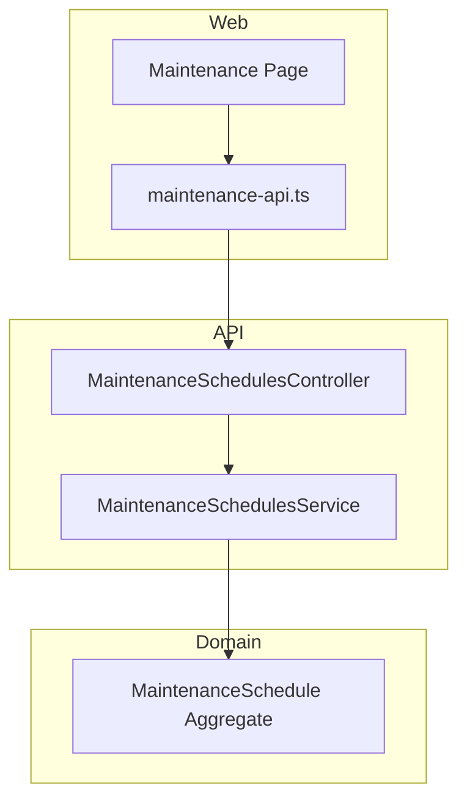
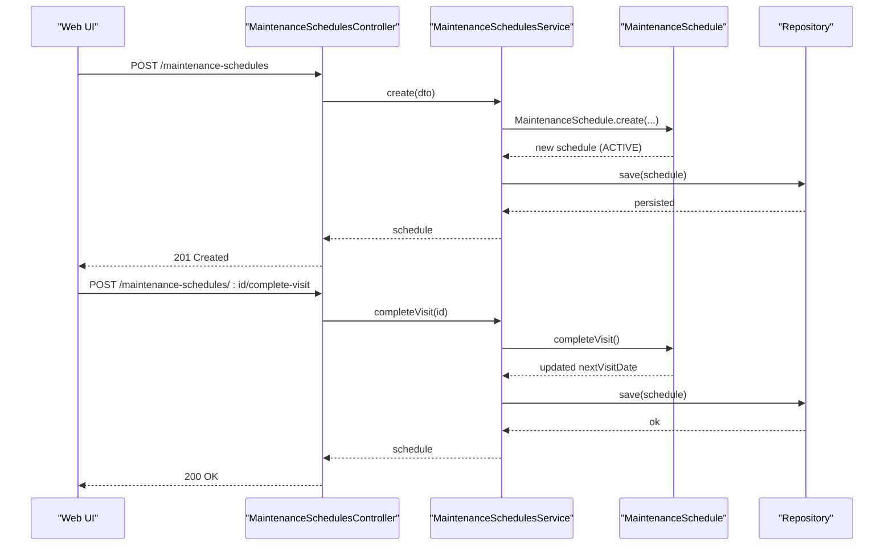
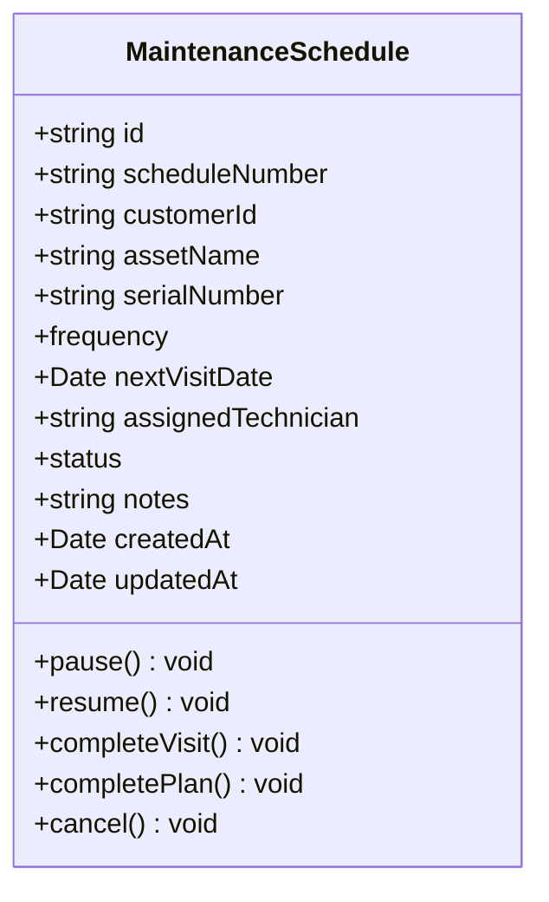
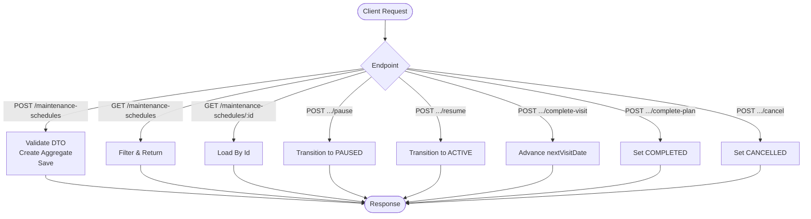
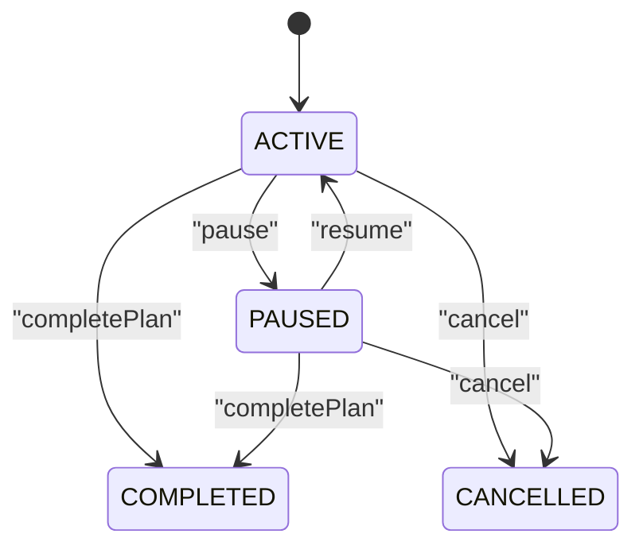
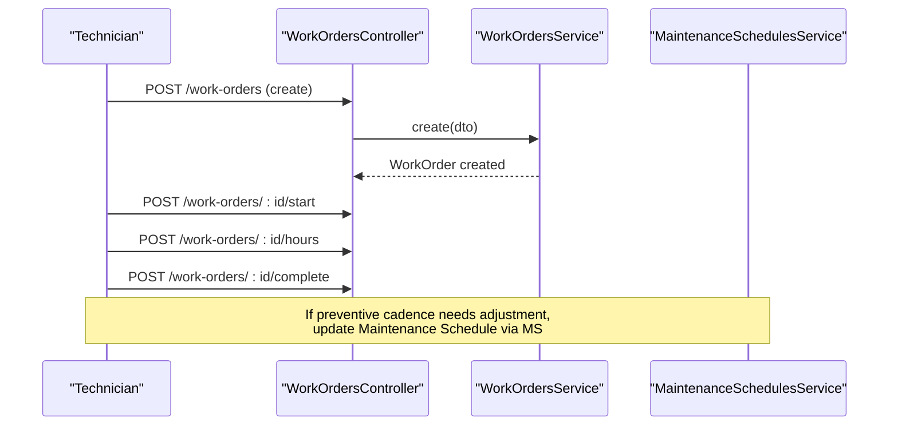
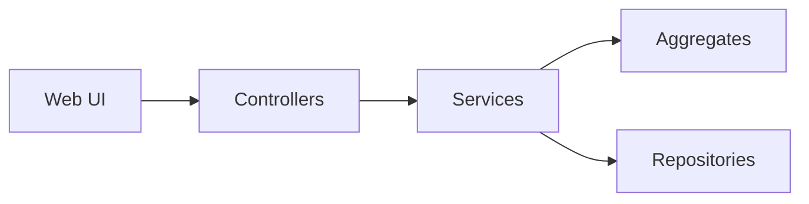

# Maintenance Schedules

<cite>
**Referenced Files in This Document**
- [maintenance-schedules.controller.ts](file://apps/api/src/maintenance-schedules/maintenance-schedules.controller.ts)
- [maintenance-schedules.service.ts](file://apps/api/src/maintenance-schedules/maintenance-schedules.service.ts)
- [dtos.ts](file://apps/api/src/maintenance-schedules/dtos.ts)
- [maintenance-schedule.ts](file://packages/service/src/maintenance/maintenance-schedule.ts)
- [maintenance-api.ts](file://apps/web/lib/api/maintenance-api.ts)
- [page.tsx](file://apps/web/app/maintenance/page.tsx)
- [work-orders.controller.ts](file://apps/api/src/work-orders/work-orders.controller.ts)
- [inventory-transactions.controller.ts](file://apps/api/src/inventory-transactions/inventory-transactions.controller.ts)
- [0049-field-service-and-maintenance.md](file://docs/rfcs/0049-field-service-and-maintenance.md)
</cite>

## Table of Contents
1. Introduction
2. Project Structure
3. Core Components
4. Architecture Overview
5. Detailed Component Analysis
6. Dependency Analysis
7. Performance Considerations
8. Troubleshooting Guide
9. Conclusion
10. Appendices

## Introduction
This document explains Ananya ERP’s Maintenance Scheduling system with a focus on the data model, workflows, API surface, and integrations. It covers preventive maintenance scheduling, visit completion logic, state transitions, and how schedules relate to work orders and inventory transactions. It also outlines practical scenarios (routine inspections, predictive triggers, emergency repairs), optimization considerations, downtime analysis, and compliance reporting approaches.

## Project Structure
The Maintenance Scheduling feature is implemented as a NestJS module under apps/api/src/maintenance-schedules, backed by a domain aggregate in packages/service/src/maintenance. The web client exposes a maintenance page and an API client for scheduling operations.

**Diagram sources**
- [maintenance-schedules.controller.ts:6-62](file://apps/api/src/maintenance-schedules/maintenance-schedules.controller.ts#L6-L62)
- [maintenance-schedules.service.ts:14-101](file://apps/api/src/maintenance-schedules/maintenance-schedules.service.ts#L14-L101)
- [maintenance-schedule.ts:33-149](file://packages/service/src/maintenance/maintenance-schedule.ts#L33-L149)
- [maintenance-api.ts:22-56](file://apps/web/lib/api/maintenance-api.ts#L22-L56)
- [page.tsx:199-288](file://apps/web/app/maintenance/page.tsx#L199-L288)

**Section sources**
- [maintenance-schedules.controller.ts:6-62](file://apps/api/src/maintenance-schedules/maintenance-schedules.controller.ts#L6-L62)
- [maintenance-schedules.service.ts:14-101](file://apps/api/src/maintenance-schedules/maintenance-schedules.service.ts#L14-L101)
- [maintenance-schedule.ts:33-149](file://packages/service/src/maintenance/maintenance-schedule.ts#L33-L149)
- [maintenance-api.ts:22-56](file://apps/web/lib/api/maintenance-api.ts#L22-L56)
- [page.tsx:199-288](file://apps/web/app/maintenance/page.tsx#L199-L288)

## Core Components
- Maintenance Schedule Aggregate: Encapsulates schedule identity, customer and asset references, frequency rules, next visit date, assigned technician, status, notes, and timestamps. It enforces invariants and provides lifecycle methods such as pause, resume, completeVisit, completePlan, and cancel.
- Application Service: Orchestrates create, find, pause/resume, complete visit/plan, and cancel operations, validates inputs, and persists changes via a repository abstraction.
- Controller: Exposes REST endpoints for creating, listing, retrieving, pausing, resuming, completing visits/plans, and cancelling schedules.
- Web Client: Provides UI for viewing schedules, filtering by status, and performing actions like completing visits or pausing/resuming.

Key responsibilities:
- Data validation at the DTO layer.
- Domain rule enforcement inside the aggregate.
- Clean separation between HTTP boundaries and business logic.

**Section sources**
- [maintenance-schedule.ts:3-149](file://packages/service/src/maintenance/maintenance-schedule.ts#L3-L149)
- [maintenance-schedules.service.ts:22-101](file://apps/api/src/maintenance-schedules/maintenance-schedules.service.ts#L22-L101)
- [maintenance-schedules.controller.ts:6-62](file://apps/api/src/maintenance-schedules/maintenance-schedules.controller.ts#L6-L62)
- [dtos.ts:9-37](file://apps/api/src/maintenance-schedules/dtos.ts#L9-L37)
- [maintenance-api.ts:22-56](file://apps/web/lib/api/maintenance-api.ts#L22-L56)

## Architecture Overview
The system follows a layered architecture:
- Presentation: Next.js pages and API client.
- API Layer: NestJS controllers handling HTTP requests.
- Application Layer: Services coordinating use cases.
- Domain Layer: Aggregates enforcing business rules.
- Infrastructure: Repository interface and persistence (not shown here).

**Diagram sources**
- [maintenance-schedules.controller.ts:12-56](file://apps/api/src/maintenance-schedules/maintenance-schedules.controller.ts#L12-L56)
- [maintenance-schedules.service.ts:22-86](file://apps/api/src/maintenance-schedules/maintenance-schedules.service.ts#L22-L86)
- [maintenance-schedule.ts:62-132](file://packages/service/src/maintenance/maintenance-schedule.ts#L62-L132)

## Detailed Component Analysis

### Data Model: Maintenance Schedule
The Maintenance Schedule aggregate defines:
- Identity and identifiers: id, scheduleNumber
- Customer and asset context: customerId, assetName, serialNumber
- Frequency and scheduling: frequency (MONTHLY | QUARTERLY | BIANNUAL | ANNUAL), nextVisitDate
- Execution context: assignedTechnician, notes
- Lifecycle: status (ACTIVE | PAUSED | COMPLETED | CANCELLED), createdAt, updatedAt

Lifecycle methods enforce invariants:
- pause/resume toggle ACTIVE/PAUSED
- completeVisit advances nextVisitDate based on frequency
- completePlan sets COMPLETED
- cancel sets CANCELLED (with guard against already completed)

**Diagram sources**
- [maintenance-schedule.ts:3-149](file://packages/service/src/maintenance/maintenance-schedule.ts#L3-L149)

**Section sources**
- [maintenance-schedule.ts:3-149](file://packages/service/src/maintenance/maintenance-schedule.ts#L3-L149)

### API Endpoints
- Create schedule: POST /maintenance-schedules
- List schedules: GET /maintenance-schedules?customerId=&assignedTechnician=&status=&frequency=&search=
- Get schedule: GET /maintenance-schedules/:id
- Pause: POST /maintenance-schedules/:id/pause
- Resume: POST /maintenance-schedules/:id/resume
- Complete visit: POST /maintenance-schedules/:id/complete-visit
- Complete plan: POST /maintenance-schedules/:id/complete-plan
- Cancel: POST /maintenance-schedules/:id/cancel

Request/response contracts:
- Create payload includes customerId, assetName, optional serialNumber, frequency, nextVisitDate, optional assignedTechnician, optional notes.
- Responses return the persisted MaintenanceSchedule entity.

**Diagram sources**
- [maintenance-schedules.controller.ts:6-62](file://apps/api/src/maintenance-schedules/maintenance-schedules.controller.ts#L6-L62)
- [maintenance-schedules.service.ts:22-101](file://apps/api/src/maintenance-schedules/maintenance-schedules.service.ts#L22-L101)
- [dtos.ts:9-37](file://apps/api/src/maintenance-schedules/dtos.ts#L9-L37)

**Section sources**
- [maintenance-schedules.controller.ts:6-62](file://apps/api/src/maintenance-schedules/maintenance-schedules.controller.ts#L6-L62)
- [maintenance-schedules.service.ts:22-101](file://apps/api/src/maintenance-schedules/maintenance-schedules.service.ts#L22-L101)
- [dtos.ts:9-37](file://apps/api/src/maintenance-schedules/dtos.ts#L9-L37)

### Preventive Maintenance Workflow
Preventive maintenance follows a recurring cadence:
- Create a schedule with a frequency and next visit date.
- When a visit is performed, mark it complete; the system automatically calculates the next visit date based on frequency.
- Optionally pause/resume schedules when assets are offline or out of scope.
- Mark plans complete when the entire recurring plan is finished.

**Diagram sources**
- [maintenance-schedule.ts:95-149](file://packages/service/src/maintenance/maintenance-schedule.ts#L95-L149)

**Section sources**
- [maintenance-schedule.ts:95-149](file://packages/service/src/maintenance/maintenance-schedule.ts#L95-L149)

### Corrective Maintenance Workflow
Corrective maintenance typically originates from a service request or work order. While the current Maintenance Scheduling module focuses on preventive recurrence, corrective execution can be modeled by:
- Creating a Work Order for the specific repair task.
- Linking the Work Order to the relevant asset/customer context.
- Logging hours and completing the Work Order upon resolution.
- If the root cause suggests a change in preventive cadence, update the related Maintenance Schedule (e.g., adjust frequency or nextVisitDate).

**Diagram sources**
- [work-orders.controller.ts:10-69](file://apps/api/src/work-orders/work-orders.controller.ts#L10-L69)

**Section sources**
- [work-orders.controller.ts:10-69](file://apps/api/src/work-orders/work-orders.controller.ts#L10-L69)

### Integration Points

#### Work Orders
- Use Work Orders to execute corrective tasks tied to assets and customers.
- After corrective work, review whether preventive schedules need updates (frequency or next visit date).

**Section sources**
- [work-orders.controller.ts:10-69](file://apps/api/src/work-orders/work-orders.controller.ts#L10-L69)

#### Inventory for Spare Parts
- Record consumption of spare parts using inventory transactions linked to a reference (e.g., work order or schedule).
- Query inventory transactions by component, location, type, reference, or creator for traceability and cost accounting.

**Section sources**
- [inventory-transactions.controller.ts:14-51](file://apps/api/src/inventory-transactions/inventory-transactions.controller.ts#L14-L51)

#### Asset Management
- Maintenance schedules reference customer and asset names; future extensions may link directly to Equipment or Asset entities for richer tracking.

**Section sources**
- [maintenance-schedule.ts:7-31](file://packages/service/src/maintenance/maintenance-schedule.ts#L7-L31)

### Practical Scenarios

#### Routine Inspections
- Create a monthly or quarterly schedule for an asset.
- Technicians complete visits; next due dates auto-advance.
- Use filters to view upcoming and overdue tasks.

**Section sources**
- [maintenance-schedules.controller.ts:17-31](file://apps/api/src/maintenance-schedules/maintenance-schedules.controller.ts#L17-L31)
- [maintenance-schedule.ts:111-132](file://packages/service/src/maintenance/maintenance-schedule.ts#L111-L132)

#### Predictive Maintenance
- Integrate external telemetry to trigger schedule adjustments or create ad-hoc corrective work orders when anomalies are detected.
- Update nextVisitDate or frequency proactively based on condition monitoring.

[No sources needed since this section describes conceptual integration]

#### Emergency Repairs
- Immediately create a Work Order for urgent repairs.
- Log hours and complete the Work Order.
- Review preventive schedules to ensure future visits reflect lessons learned.

**Section sources**
- [work-orders.controller.ts:14-69](file://apps/api/src/work-orders/work-orders.controller.ts#L14-L69)

## Dependency Analysis
- Controllers depend on services for orchestration.
- Services depend on domain aggregates for business rules and repositories for persistence.
- Web client depends on controller endpoints through typed API helpers.

**Diagram sources**
- [maintenance-schedules.controller.ts:6-62](file://apps/api/src/maintenance-schedules/maintenance-schedules.controller.ts#L6-L62)
- [maintenance-schedules.service.ts:14-101](file://apps/api/src/maintenance-schedules/maintenance-schedules.service.ts#L14-L101)
- [maintenance-schedule.ts:33-149](file://packages/service/src/maintenance/maintenance-schedule.ts#L33-L149)

**Section sources**
- [maintenance-schedules.controller.ts:6-62](file://apps/api/src/maintenance-schedules/maintenance-schedules.controller.ts#L6-L62)
- [maintenance-schedules.service.ts:14-101](file://apps/api/src/maintenance-schedules/maintenance-schedules.service.ts#L14-L101)

## Performance Considerations
- Index queries on frequently filtered fields such as customerId, assignedTechnician, status, and frequency to optimize list operations.
- Batch updates when adjusting multiple schedules after corrective events.
- Avoid heavy computations in list endpoints; compute derived fields (e.g., overdue flags) on demand or via background jobs.
- Cache read-heavy views (e.g., dashboard counts) where appropriate.

[No sources needed since this section provides general guidance]

## Troubleshooting Guide
Common issues and resolutions:
- Invalid state transitions: Ensure only ACTIVE schedules can be paused; only PAUSED can be resumed; completed cannot be cancelled.
- Missing required fields: Validate customerId and assetName during creation.
- Not found errors: Verify schedule IDs exist before invoking update operations.
- Date calculation errors: Confirm frequency values are valid when completing visits.

Operational checks:
- Use GET /maintenance-schedules with filters to inspect current states.
- Validate DTOs on the client side to reduce server errors.
- Log and monitor transitions for auditability.

**Section sources**
- [maintenance-schedule.ts:62-149](file://packages/service/src/maintenance/maintenance-schedule.ts#L62-L149)
- [maintenance-schedules.service.ts:58-66](file://apps/api/src/maintenance-schedules/maintenance-schedules.service.ts#L58-L66)

## Conclusion
Ananya ERP’s Maintenance Scheduling system provides a robust foundation for preventive maintenance planning with clear state management, automatic next-date calculations, and extensibility for corrective and predictive workflows. Integrating with Work Orders and Inventory Transactions enables end-to-end traceability from scheduling to execution and parts usage. With proper indexing, caching, and audit logging, the system supports efficient operations, downtime analysis, and compliance reporting.

[No sources needed since this section summarizes without analyzing specific files]

## Appendices

### RFC Reference
The design aligns with the accepted RFC that defines the domain language, state machine, API endpoints, and database schema for field service and maintenance.

**Section sources**
- [0049-field-service-and-maintenance.md:15-101](file://docs/rfcs/0049-field-service-and-maintenance.md#L15-L101)

### Web UI Usage
The maintenance page displays scheduled tasks, allows filtering by status, and provides actions to schedule new maintenance and manage existing schedules.

**Section sources**
- [page.tsx:199-288](file://apps/web/app/maintenance/page.tsx#L199-L288)
- [maintenance-api.ts:22-56](file://apps/web/lib/api/maintenance-api.ts#L22-L56)