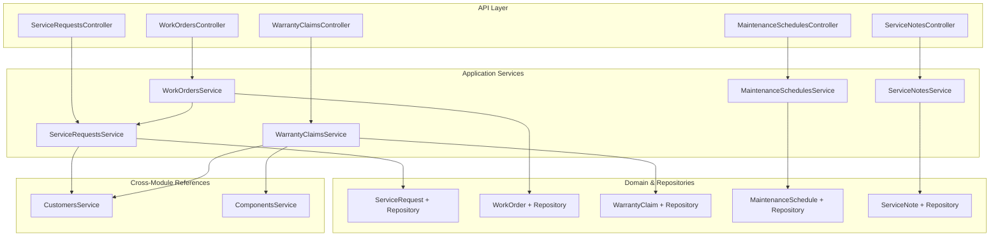
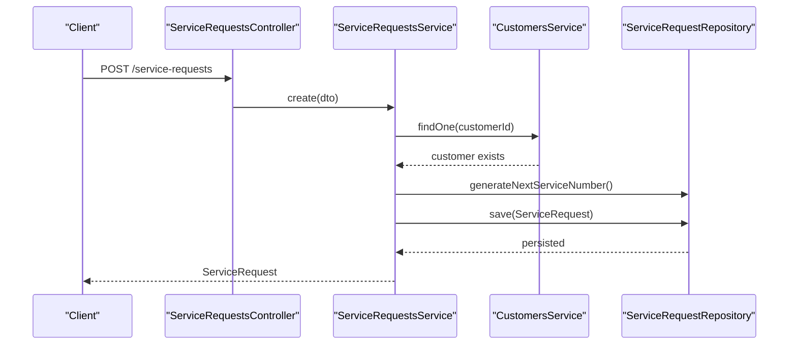
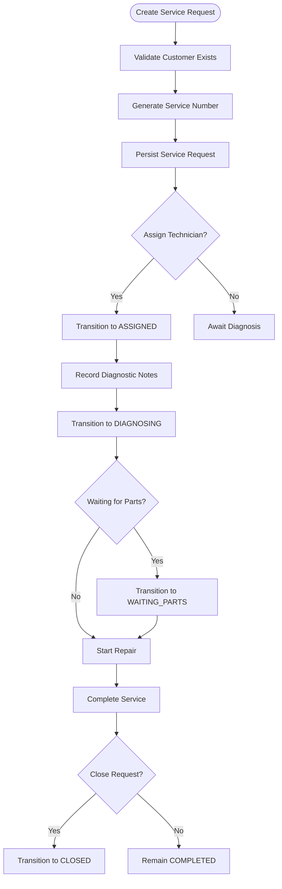
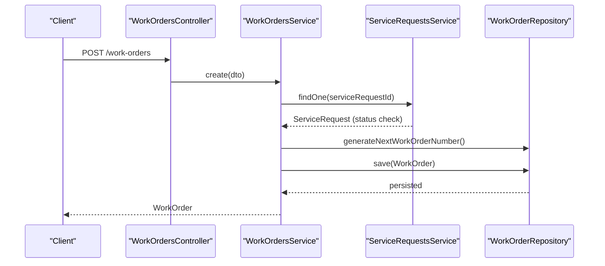
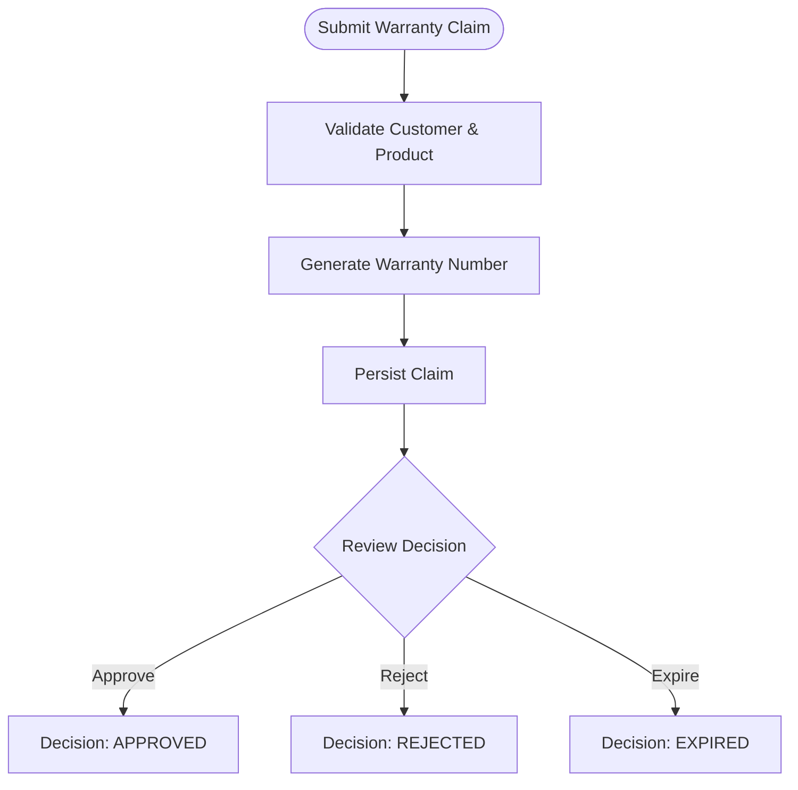
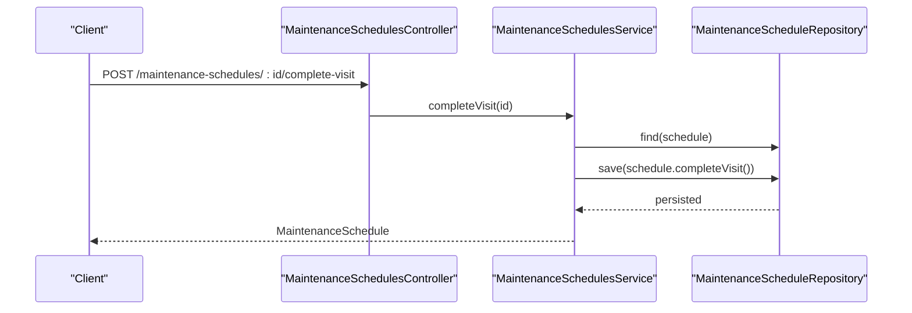
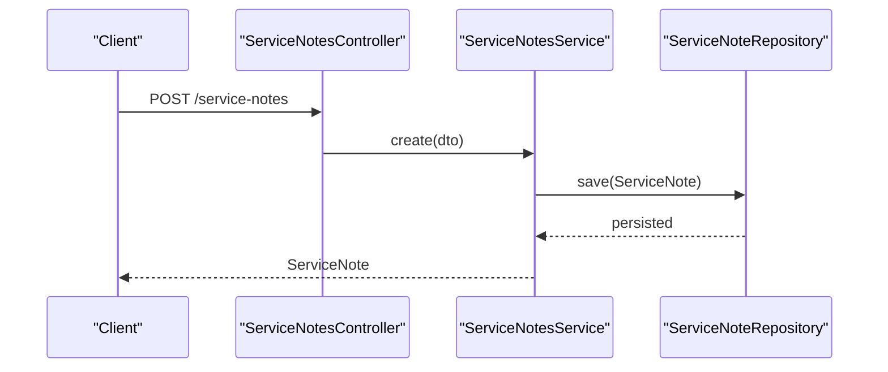
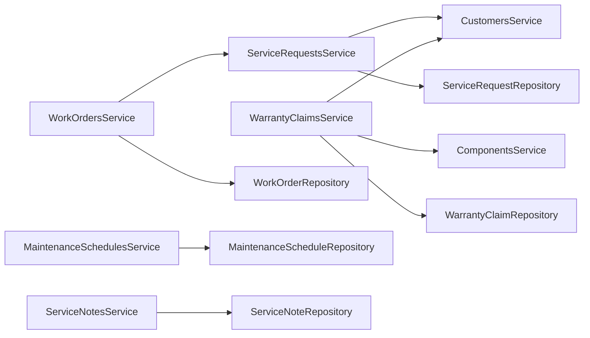

# Service Management

<cite>
**Referenced Files in This Document**
- [0046-service-requests.md](file://docs/rfcs/0046-service-requests.md)
- [0047-work-orders-and-repairs.md](file://docs/rfcs/0047-work-orders-and-repairs.md)
- [0048-warranty-and-rma.md](file://docs/rfcs/0048-warranty-and-rma.md)
- [0049-field-service-and-maintenance.md](file://docs/rfcs/0049-field-service-and-maintenance.md)
- [0050-service-integration.md](file://docs/rfcs/0050-service-integration.md)
- [service-requests.controller.ts](file://apps/api/src/service-requests/service-requests.controller.ts)
- [service-requests.service.ts](file://apps/api/src/service-requests/service-requests.service.ts)
- [work-orders.controller.ts](file://apps/api/src/work-orders/work-orders.controller.ts)
- [work-orders.service.ts](file://apps/api/src/work-orders/work-orders.service.ts)
- [warranty-claims.controller.ts](file://apps/api/src/warranty-claims/warranty-claims.controller.ts)
- [warranty-claims.service.ts](file://apps/api/src/warranty-claims/warranty-claims.service.ts)
- [maintenance-schedules.controller.ts](file://apps/api/src/maintenance-schedules/maintenance-schedules.controller.ts)
- [maintenance-schedules.service.ts](file://apps/api/src/maintenance-schedules/maintenance-schedules.service.ts)
- [service-notes.controller.ts](file://apps/api/src/service-notes/service-notes.controller.ts)
- [service-notes.service.ts](file://apps/api/src/service-notes/service-notes.service.ts)
</cite>

## Table of Contents
1. Introduction
2. Project Structure
3. Core Components
4. Architecture Overview
5. Detailed Component Analysis
6. Dependency Analysis
7. Performance Considerations
8. Troubleshooting Guide
9. Conclusion
10. Appendices

## Introduction
This document provides comprehensive documentation for Ananya ERP’s Service Management domain. It covers service request handling, work order management, warranty claims processing, maintenance scheduling, and service notes. It explains the data model, key workflows from intake through resolution, preventive maintenance, and service documentation. It also documents the package structure, domain boundaries, and integration points with Inventory and Finance.

## Project Structure
The Service Management domain is implemented as a set of NestJS modules under apps/api/src, each exposing REST endpoints and application services that coordinate domain logic via repositories and cross-module references. The RFCs define the domain models, state machines, and integration contracts.

**Diagram sources**
- [service-requests.controller.ts:14-83](file://apps/api/src/service-requests/service-requests.controller.ts#L14-L83)
- [service-requests.service.ts:18-127](file://apps/api/src/service-requests/service-requests.service.ts#L18-L127)
- [work-orders.controller.ts:10-71](file://apps/api/src/work-orders/work-orders.controller.ts#L10-L71)
- [work-orders.service.ts:22-119](file://apps/api/src/work-orders/work-orders.service.ts#L22-L119)
- [warranty-claims.controller.ts:6-50](file://apps/api/src/warranty-claims/warranty-claims.controller.ts#L6-L50)
- [warranty-claims.service.ts:13-84](file://apps/api/src/warranty-claims/warranty-claims.service.ts#L13-L84)
- [maintenance-schedules.controller.ts:6-64](file://apps/api/src/maintenance-schedules/maintenance-schedules.controller.ts#L6-L64)
- [maintenance-schedules.service.ts:14-103](file://apps/api/src/maintenance-schedules/maintenance-schedules.service.ts#L14-L103)
- [service-notes.controller.ts:5-32](file://apps/api/src/service-notes/service-notes.controller.ts#L5-L32)
- [service-notes.service.ts:7-46](file://apps/api/src/service-notes/service-notes.service.ts#L7-L46)

**Section sources**
- [0046-service-requests.md:1-129](file://docs/rfcs/0046-service-requests.md#L1-L129)
- [0047-work-orders-and-repairs.md:1-126](file://docs/rfcs/0047-work-orders-and-repairs.md#L1-L126)
- [0048-warranty-and-rma.md:1-125](file://docs/rfcs/0048-warranty-and-rma.md#L1-L125)
- [0049-field-service-and-maintenance.md:1-114](file://docs/rfcs/0049-field-service-and-maintenance.md#L1-L114)
- [0050-service-integration.md:1-106](file://docs/rfcs/0050-service-integration.md#L1-L106)

## Core Components
- Service Requests: Intake, classification, assignment, diagnosis, parts waiting, repair, completion, closure, and cancellation.
- Work Orders: Technical task creation, assignment, execution (start/pause), hours logging, completion, and cancellation.
- Warranty Claims: Claim submission, review, approval/rejection, and downstream handoff to RMA or service.
- Maintenance Schedules: Recurring preventive maintenance plans with visit completion and next visit calculation.
- Service Notes: Time-stamped collaboration notes attached to service requests, work orders, or warranty claims.

Key responsibilities:
- Controllers expose REST endpoints for CRUD and workflow transitions.
- Application services enforce invariants, orchestrate cross-module lookups, and persist changes via repositories.
- Domain entities encapsulate state machines and business rules.

**Section sources**
- [service-requests.controller.ts:14-83](file://apps/api/src/service-requests/service-requests.controller.ts#L14-L83)
- [service-requests.service.ts:26-127](file://apps/api/src/service-requests/service-requests.service.ts#L26-L127)
- [work-orders.controller.ts:10-71](file://apps/api/src/work-orders/work-orders.controller.ts#L10-L71)
- [work-orders.service.ts:30-119](file://apps/api/src/work-orders/work-orders.service.ts#L30-L119)
- [warranty-claims.controller.ts:6-50](file://apps/api/src/warranty-claims/warranty-claims.controller.ts#L6-L50)
- [warranty-claims.service.ts:22-84](file://apps/api/src/warranty-claims/warranty-claims.service.ts#L22-L84)
- [maintenance-schedules.controller.ts:6-64](file://apps/api/src/maintenance-schedules/maintenance-schedules.controller.ts#L6-L64)
- [maintenance-schedules.service.ts:22-103](file://apps/api/src/maintenance-schedules/maintenance-schedules.service.ts#L22-L103)
- [service-notes.controller.ts:5-32](file://apps/api/src/service-notes/service-notes.controller.ts#L5-L32)
- [service-notes.service.ts:14-46](file://apps/api/src/service-notes/service-notes.service.ts#L14-L46)

## Architecture Overview
The Service Management bounded context coordinates post-delivery operations across CRM, Sales, Projects, Inventory, Warehouse, and Finance by maintaining read-only references and delegating mutations to owning domains.

**Diagram sources**
- [service-requests.controller.ts:20-23](file://apps/api/src/service-requests/service-requests.controller.ts#L20-L23)
- [service-requests.service.ts:26-44](file://apps/api/src/service-requests/service-requests.service.ts#L26-L44)

**Section sources**
- [0050-service-integration.md:74-86](file://docs/rfcs/0050-service-integration.md#L74-L86)

## Detailed Component Analysis

### Service Requests
- Purpose: Capture and manage customer-reported issues or support requests, including classification, assignment, diagnosis, and lifecycle transitions.
- Data Model Highlights:
  - Identifier: service_number
  - References: customerId, salesOrderId, projectId, componentId, serialNumber
  - Attributes: title, description, priority, category, status, assignedTechnician, diagnostic_notes
- State Machine: OPEN → ASSIGNED → DIAGNOSING → WAITING_PARTS → REPAIRING → COMPLETED → CLOSED; optional CANCELLED from multiple states.
- Key Workflows:
  - Create: Validate customer, generate number, persist.
  - Assign: Set technician and transition to ASSIGNED.
  - Diagnose: Record diagnostic notes and move to DIAGNOSING.
  - Waiting Parts: Transition when parts are pending.
  - Start Repair: Begin repair activities.
  - Complete/Close/Cancel: Finalize or terminate the request.

**Diagram sources**
- [service-requests.service.ts:26-127](file://apps/api/src/service-requests/service-requests.service.ts#L26-L127)

**Section sources**
- [0046-service-requests.md:15-129](file://docs/rfcs/0046-service-requests.md#L15-L129)
- [service-requests.controller.ts:14-83](file://apps/api/src/service-requests/service-requests.controller.ts#L14-L83)
- [service-requests.service.ts:26-127](file://apps/api/src/service-requests/service-requests.service.ts#L26-L127)

### Work Orders
- Purpose: Manage technical tasks linked to service requests, tracking planned vs actual labor and execution state.
- Data Model Highlights:
  - Identifier: work_order_number
  - Reference: serviceRequestId
  - Attributes: assignedTechnician, title, description, plannedHours, actualHours, priority, status
- State Machine: CREATED → ASSIGNED → IN_PROGRESS ↔ PAUSED → COMPLETED; optional CANCELLED.
- Key Workflows:
  - Create: Ensure parent service request is not closed/cancelled, generate number, persist.
  - Assign/Start/Pause: Control execution flow.
  - Log Hours: Increment actual hours (guarded by invariants).
  - Complete/Cancel: Finalize or terminate.

**Diagram sources**
- [work-orders.controller.ts:14-17](file://apps/api/src/work-orders/work-orders.controller.ts#L14-L17)
- [work-orders.service.ts:30-51](file://apps/api/src/work-orders/work-orders.service.ts#L30-L51)

**Section sources**
- [0047-work-orders-and-repairs.md:15-126](file://docs/rfcs/0047-work-orders-and-repairs.md#L15-L126)
- [work-orders.controller.ts:10-71](file://apps/api/src/work-orders/work-orders.controller.ts#L10-L71)
- [work-orders.service.ts:30-119](file://apps/api/src/work-orders/work-orders.service.ts#L30-L119)

### Warranty Claims
- Purpose: Handle entitlement evaluation and adjudication for covered products, enabling downstream RMA or service actions.
- Data Model Highlights:
  - Identifier: warranty_number
  - References: customerId, productId, serialNumber
  - Attributes: purchaseDate, expiryDate, claimReason, decision, decision_notes
- State Machine: SUBMITTED → UNDER_REVIEW → APPROVED | REJECTED | EXPIRED.
- Key Workflows:
  - Create: Validate customer and product, generate number, persist.
  - Review: Move to UNDER_REVIEW.
  - Approve/Reject: Finalize decision with notes.

**Diagram sources**
- [warranty-claims.service.ts:22-84](file://apps/api/src/warranty-claims/warranty-claims.service.ts#L22-L84)

**Section sources**
- [0048-warranty-and-rma.md:15-125](file://docs/rfcs/0048-warranty-and-rma.md#L15-L125)
- [warranty-claims.controller.ts:6-50](file://apps/api/src/warranty-claims/warranty-claims.controller.ts#L6-L50)
- [warranty-claims.service.ts:22-84](file://apps/api/src/warranty-claims/warranty-claims.service.ts#L22-L84)

### Maintenance Schedules
- Purpose: Plan and track recurring preventive maintenance for customer assets, computing next visit dates based on frequency.
- Data Model Highlights:
  - Identifier: schedule_number
  - References: customerId
  - Attributes: assetName, serialNumber, frequency, nextVisitDate, assignedTechnician, status, notes
- State Machine: ACTIVE ↔ PAUSED → COMPLETED; optional CANCELLED.
- Key Workflows:
  - Create: Validate customer, generate number, persist with next visit date.
  - Pause/Resume: Temporarily suspend or re-enable visits.
  - Complete Visit: Mark visit done and compute next visit date.
  - Complete Plan/Cancel: End plan or cancel entirely.

**Diagram sources**
- [maintenance-schedules.controller.ts:49-52](file://apps/api/src/maintenance-schedules/maintenance-schedules.controller.ts#L49-L52)
- [maintenance-schedules.service.ts:82-87](file://apps/api/src/maintenance-schedules/maintenance-schedules.service.ts#L82-L87)

**Section sources**
- [0049-field-service-and-maintenance.md:15-114](file://docs/rfcs/0049-field-service-and-maintenance.md#L15-L114)
- [maintenance-schedules.controller.ts:6-64](file://apps/api/src/maintenance-schedules/maintenance-schedules.controller.ts#L6-L64)
- [maintenance-schedules.service.ts:22-103](file://apps/api/src/maintenance-schedules/maintenance-schedules.service.ts#L22-L103)

### Service Notes
- Purpose: Attach collaborative notes to service requests, work orders, or warranty claims for auditability and communication.
- Data Model Highlights:
  - References: serviceRequestId, workOrderId, warrantyClaimId
  - Attributes: author, body, created_at
- Key Workflows:
  - Create: Persist note linked to target entity.
  - Query: Retrieve notes by target entity.

**Diagram sources**
- [service-notes.controller.ts:9-12](file://apps/api/src/service-notes/service-notes.controller.ts#L9-L12)
- [service-notes.service.ts:14-24](file://apps/api/src/service-notes/service-notes.service.ts#L14-L24)

**Section sources**
- [0050-service-integration.md:20-106](file://docs/rfcs/0050-service-integration.md#L20-L106)
- [service-notes.controller.ts:5-32](file://apps/api/src/service-notes/service-notes.controller.ts#L5-L32)
- [service-notes.service.ts:14-46](file://apps/api/src/service-notes/service-notes.service.ts#L14-L46)

## Dependency Analysis
- Intra-domain dependencies:
  - WorkOrdersService depends on ServiceRequestsService to validate parent service request state before creating work orders.
- Cross-module dependencies:
  - ServiceRequestsService validates customers via CustomersService.
  - WarrantyClaimsService validates customers and components via CustomersService and ComponentsService.
  - All modules use repositories injected via tokens to persist domain entities.
- Integration boundaries:
  - Service Management maintains read-only references to CRM, Sales, Projects, Inventory, Warehouse, and Finance per RFC-0050.
  - Actual mutations to inventory or finance occur through their respective domains.

**Diagram sources**
- [work-orders.service.ts:22-31](file://apps/api/src/work-orders/work-orders.service.ts#L22-L31)
- [service-requests.service.ts:18-24](file://apps/api/src/service-requests/service-requests.service.ts#L18-L24)
- [warranty-claims.service.ts:13-20](file://apps/api/src/warranty-claims/warranty-claims.service.ts#L13-L20)
- [maintenance-schedules.service.ts:14-20](file://apps/api/src/maintenance-schedules/maintenance-schedules.service.ts#L14-L20)
- [service-notes.service.ts:7-12](file://apps/api/src/service-notes/service-notes.service.ts#L7-L12)

**Section sources**
- [0050-service-integration.md:80-86](file://docs/rfcs/0050-service-integration.md#L80-L86)

## Performance Considerations
- Prefer filtering at the repository layer using query parameters exposed by controllers to reduce payload sizes.
- Avoid unnecessary cross-module calls; cache read-only references where appropriate within request scope.
- Use idempotent endpoints for state transitions to safely retry failed requests.
- Keep DTO validation minimal and focused on required fields to reduce overhead.

[No sources needed since this section provides general guidance]

## Troubleshooting Guide
Common errors and resolutions:
- Not Found: When retrieving an entity by ID, a NotFoundException is thrown if the record does not exist. Verify IDs and ensure persistence succeeded.
- Bad Request: Creating a work order for a service request in CLOSED or CANCELLED status raises a BadRequestException. Ensure the parent service request is open or active.
- Validation Failures: DTOs rely on class-validator constraints; ensure required fields like customerId, title, and category are provided where applicable.

**Section sources**
- [service-requests.service.ts:64-70](file://apps/api/src/service-requests/service-requests.service.ts#L64-L70)
- [work-orders.service.ts:30-36](file://apps/api/src/work-orders/work-orders.service.ts#L30-L36)
- [warranty-claims.service.ts:55-61](file://apps/api/src/warranty-claims/warranty-claims.service.ts#L55-L61)
- [maintenance-schedules.service.ts:58-66](file://apps/api/src/maintenance-schedules/maintenance-schedules.service.ts#L58-L66)
- [service-notes.service.ts:38-44](file://apps/api/src/service-notes/service-notes.service.ts#L38-L44)

## Conclusion
Ananya ERP’s Service Management domain provides a robust, well-bounded system for managing post-delivery service operations. It enforces clear state machines, maintains strict domain boundaries, and integrates with other modules through read-only references while delegating mutations to owning domains. The APIs offer practical entry points for intake, execution, warranty adjudication, preventive maintenance, and collaborative documentation.

[No sources needed since this section summarizes without analyzing specific files]

## Appendices

### Practical Examples

- Create a Service Request
  - Endpoint: POST /service-requests
  - Body includes: customerId, salesOrderId (optional), projectId (optional), componentId (optional), serialNumber (optional), title, description, priority, category
  - Outcome: New Service Request in OPEN status with generated service_number

  **Section sources**
  - [service-requests.controller.ts:20-23](file://apps/api/src/service-requests/service-requests.controller.ts#L20-L23)
  - [service-requests.service.ts:26-44](file://apps/api/src/service-requests/service-requests.service.ts#L26-L44)

- Manage Work Orders
  - Create: POST /work-orders with serviceRequestId, title, plannedHours, priority
  - Assign: POST /work-orders/:id/assign
  - Start/Pause: POST /work-orders/:id/start, /pause
  - Log Hours: POST /work-orders/:id/hours
  - Complete/Cancel: POST /work-orders/:id/complete, /cancel

  **Section sources**
  - [work-orders.controller.ts:14-71](file://apps/api/src/work-orders/work-orders.controller.ts#L14-L71)
  - [work-orders.service.ts:30-119](file://apps/api/src/work-orders/work-orders.service.ts#L30-L119)

- Process Warranty Claims
  - Submit: POST /warranty-claims with customerId, productId, serialNumber, purchaseDate, expiryDate, claimReason
  - Review: POST /warranty-claims/:id/review
  - Approve/Reject: POST /warranty-claims/:id/approve, /reject with notes

  **Section sources**
  - [warranty-claims.controller.ts:10-50](file://apps/api/src/warranty-claims/warranty-claims.controller.ts#L10-L50)
  - [warranty-claims.service.ts:22-84](file://apps/api/src/warranty-claims/warranty-claims.service.ts#L22-L84)

- Schedule Preventive Maintenance
  - Create: POST /maintenance-schedules with customerId, assetName, frequency, nextVisitDate, assignedTechnician, notes
  - Pause/Resume: POST /maintenance-schedules/:id/pause, /resume
  - Complete Visit: POST /maintenance-schedules/:id/complete-visit
  - Complete Plan/Cancel: POST /maintenance-schedules/:id/complete-plan, /cancel

  **Section sources**
  - [maintenance-schedules.controller.ts:12-64](file://apps/api/src/maintenance-schedules/maintenance-schedules.controller.ts#L12-L64)
  - [maintenance-schedules.service.ts:22-103](file://apps/api/src/maintenance-schedules/maintenance-schedules.service.ts#L22-L103)

- Document Service Activities
  - Create Note: POST /service-notes with serviceRequestId, workOrderId, warrantyClaimId, author, body
  - Query Notes: GET /service-notes?serviceRequestId=...&workOrderId=...&warrantyClaimId=...

  **Section sources**
  - [service-notes.controller.ts:9-32](file://apps/api/src/service-notes/service-notes.controller.ts#L9-L32)
  - [service-notes.service.ts:14-46](file://apps/api/src/service-notes/service-notes.service.ts#L14-L46)

### Data Model Summary

- Service Request
  - Fields: id, service_number, customer_id, sales_order_id, project_id, component_id, serial_number, title, description, priority, category, status, assigned_technician, diagnostic_notes, created_at, updated_at

  **Section sources**
  - [0046-service-requests.md:102-105](file://docs/rfcs/0046-service-requests.md#L102-L105)

- Work Order
  - Fields: id, work_order_number, service_request_id, assigned_technician, title, description, planned_hours, actual_hours, priority, status, created_at, updated_at

  **Section sources**
  - [0047-work-orders-and-repairs.md:98-101](file://docs/rfcs/0047-work-orders-and-repairs.md#L98-L101)

- Warranty Claim
  - Fields: id, warranty_number, customer_id, product_id, serial_number, purchase_date, expiry_date, claim_reason, decision, decision_notes, created_at, updated_at

  **Section sources**
  - [0048-warranty-and-rma.md:103-106](file://docs/rfcs/0048-warranty-and-rma.md#L103-L106)

- Maintenance Schedule
  - Fields: id, schedule_number, customer_id, asset_name, serial_number, frequency, next_visit_date, assigned_technician, status, notes, created_at, updated_at

  **Section sources**
  - [0049-field-service-and-maintenance.md:89-92](file://docs/rfcs/0049-field-service-and-maintenance.md#L89-L92)

- Service Note
  - Fields: id, service_request_id, work_order_id, warranty_claim_id, author, body, created_at

  **Section sources**
  - [0050-service-integration.md:87-90](file://docs/rfcs/0050-service-integration.md#L87-L90)

### Integration Points

- Inventory
  - Read-only references to componentId and serialNumber for traceability; inventory receipts for RMAs or replacements occur through Warehouse/Customer Returns channels.

  **Section sources**
  - [0046-service-requests.md:95-101](file://docs/rfcs/0046-service-requests.md#L95-L101)
  - [0050-service-integration.md:80-86](file://docs/rfcs/0050-service-integration.md#L80-L86)

- Finance
  - Read-only reference; service does not record general ledger postings directly. Billing and financial transactions are handled by Finance modules.

  **Section sources**
  - [0050-service-integration.md:80-86](file://docs/rfcs/0050-service-integration.md#L80-L86)