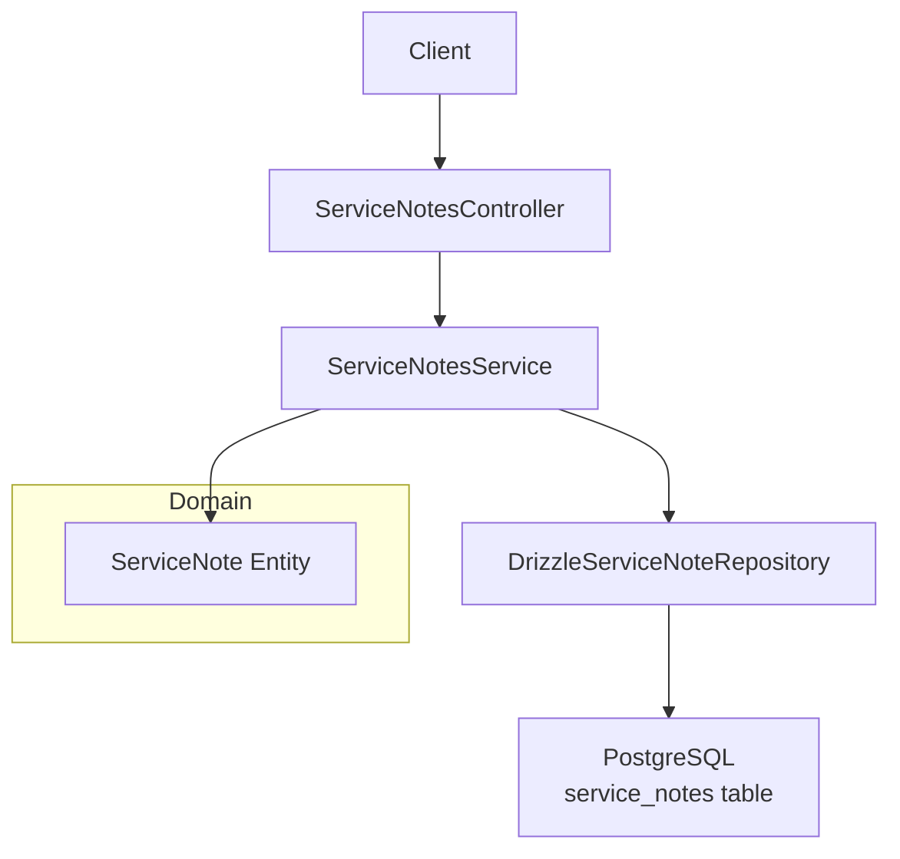
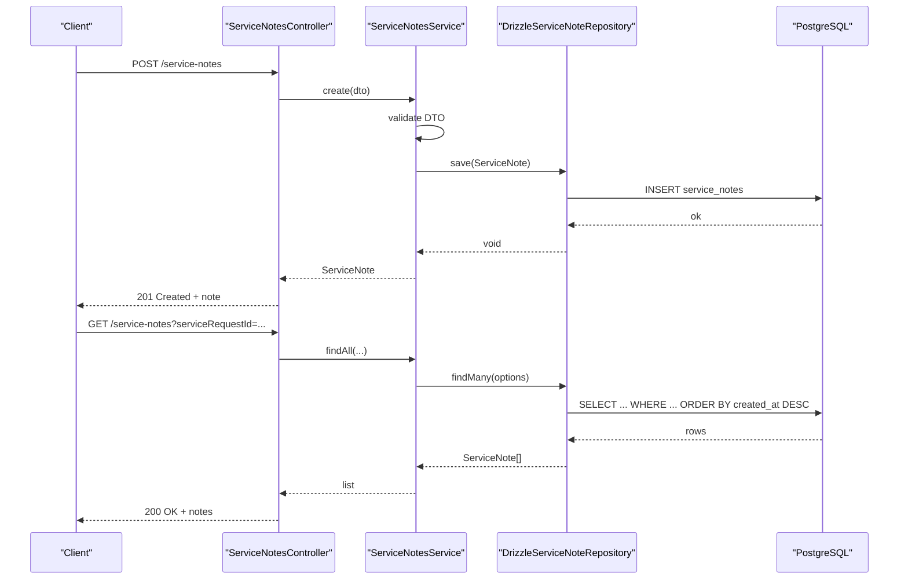
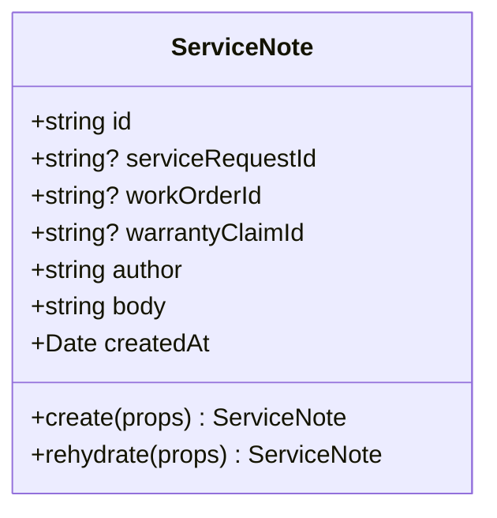
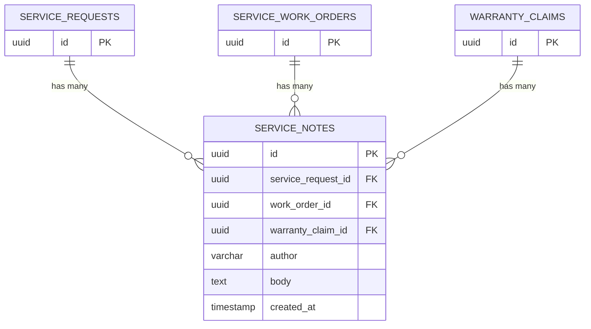
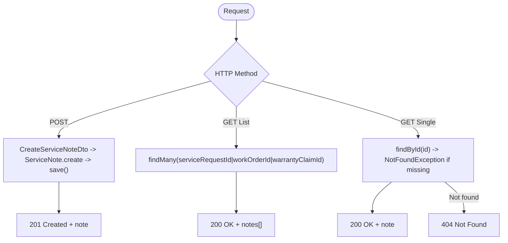
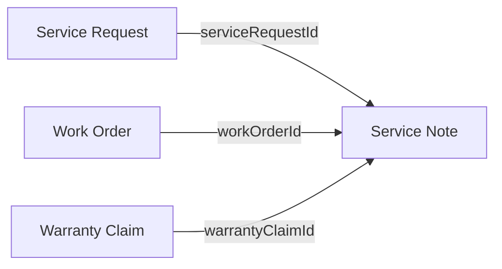
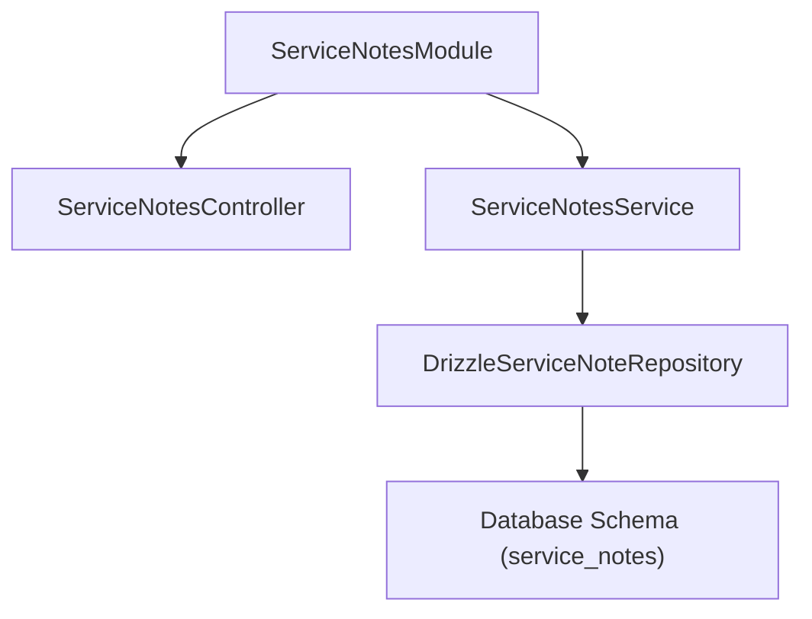

# Service Notes

<cite>
**Referenced Files in This Document**
- [service-notes.controller.ts](file://apps/api/src/service-notes/service-notes.controller.ts)
- [service-notes.service.ts](file://apps/api/src/service-notes/service-notes.service.ts)
- [dtos.ts](file://apps/api/src/service-notes/dtos.ts)
- [service-notes.module.ts](file://apps/api/src/service-notes/service-notes.module.ts)
- [drizzle-service-note.repository.ts](file://apps/api/src/infrastructure/repositories/drizzle-service-note.repository.ts)
- [service-note.ts](file://packages/service/src/notes/service-note.ts)
- [service-note.repository.ts](file://packages/service/src/notes/service-note.repository.ts)
- [service.ts (schema)](file://packages/database/src/schema/service.ts)
- [service-request.ts](file://packages/service/src/requests/service-request.ts)
- [work-order.ts](file://packages/service/src/work-orders/work-order.ts)
- [warranty-claim.ts](file://packages/service/src/warranty/warranty-claim.ts)
</cite>

## Table of Contents
1. [Introduction](#introduction)
2. [Project Structure](#project-structure)
3. [Core Components](#core-components)
4. [Architecture Overview](#architecture-overview)
5. [Detailed Component Analysis](#detailed-component-analysis)
6. [Dependency Analysis](#dependency-analysis)
7. [Performance Considerations](#performance-considerations)
8. [Troubleshooting Guide](#troubleshooting-guide)
9. [Conclusion](#conclusion)
10. [Appendices](#appendices)

## Introduction
This document explains Ananya ERP’s Service Notes system: the data model, API endpoints, integration points with service requests, work orders, and warranty claims, and how notes support documentation across the service lifecycle from initial assessment to final resolution. It also covers search capabilities, versioning considerations, and compliance-related aspects based on the current implementation.

## Project Structure
Service Notes are implemented as a NestJS feature module with a clear separation between API layer, domain model, and persistence:
- API layer: controller and service for HTTP endpoints and orchestration
- Domain model: immutable entity with validation rules
- Persistence: repository implementing Drizzle queries against a Postgres schema

**Diagram sources**
- [service-notes.controller.ts:5-31](file://apps/api/src/service-notes/service-notes.controller.ts#L5-L31)
- [service-notes.service.ts:7-45](file://apps/api/src/service-notes/service-notes.service.ts#L7-L45)
- [drizzle-service-note.repository.ts:23-64](file://apps/api/src/infrastructure/repositories/drizzle-service-note.repository.ts#L23-L64)
- [service-note.ts:21-71](file://packages/service/src/notes/service-note.ts#L21-L71)
- [service.ts (schema):186-212](file://packages/database/src/schema/service.ts#L186-L212)

**Section sources**
- [service-notes.controller.ts:5-31](file://apps/api/src/service-notes/service-notes.controller.ts#L5-L31)
- [service-notes.service.ts:7-45](file://apps/api/src/service-notes/service-notes.service.ts#L7-L45)
- [service-notes.module.ts:9-19](file://apps/api/src/service-notes/service-notes.module.ts#L9-L19)
- [drizzle-service-note.repository.ts:23-64](file://apps/api/src/infrastructure/repositories/drizzle-service-note.repository.ts#L23-L64)
- [service-note.ts:21-71](file://packages/service/src/notes/service-note.ts#L21-L71)
- [service.ts (schema):186-212](file://packages/database/src/schema/service.ts#L186-L212)

## Core Components
- ServiceNote entity: immutable domain object representing a note attached to one or more service entities (service request, work order, warranty claim). Enforces required fields and at least one target association.
- ServiceNoteRepository interface: defines findById, findMany (with optional filters), and save.
- DrizzleServiceNoteRepository: implements repository using Drizzle ORM; supports filtering by serviceRequestId, workOrderId, warrantyClaimId; returns results ordered by creation time descending.
- ServiceNotesService: orchestrates create/find operations and maps DTOs to domain objects.
- ServiceNotesController: exposes REST endpoints for creating and retrieving notes.

Key behaviors:
- Creation requires author and body; must associate with at least one target ID.
- Retrieval supports filtering by any of the three foreign keys.
- Results are sorted newest-first.

**Section sources**
- [service-note.ts:21-71](file://packages/service/src/notes/service-note.ts#L21-L71)
- [service-note.repository.ts:3-13](file://packages/service/src/notes/service-note.repository.ts#L3-L13)
- [drizzle-service-note.repository.ts:23-64](file://apps/api/src/infrastructure/repositories/drizzle-service-note.repository.ts#L23-L64)
- [service-notes.service.ts:14-44](file://apps/api/src/service-notes/service-notes.service.ts#L14-L44)
- [service-notes.controller.ts:9-30](file://apps/api/src/service-notes/service-notes.controller.ts#L9-L30)

## Architecture Overview
The Service Notes feature follows a layered architecture:
- Controller receives HTTP requests and delegates to the service.
- Service validates input via DTOs, constructs domain entities, and persists through the repository.
- Repository translates domain objects to/from database records using Drizzle.
- Database schema enforces referential integrity and indexes for efficient lookups.

**Diagram sources**
- [service-notes.controller.ts:9-30](file://apps/api/src/service-notes/service-notes.controller.ts#L9-L30)
- [service-notes.service.ts:14-44](file://apps/api/src/service-notes/service-notes.service.ts#L14-L44)
- [drizzle-service-note.repository.ts:23-64](file://apps/api/src/infrastructure/repositories/drizzle-service-note.repository.ts#L23-L64)
- [service.ts (schema):186-212](file://packages/database/src/schema/service.ts#L186-L212)

## Detailed Component Analysis

### Data Model: Service Note
- Fields: id, serviceRequestId (optional), workOrderId (optional), warrantyClaimId (optional), author, body, createdAt.
- Validation: author and body are required; at least one target ID must be provided.
- Immutability: constructed via static factory methods; rehydration supported for persistence round-trips.

**Diagram sources**
- [service-note.ts:21-71](file://packages/service/src/notes/service-note.ts#L21-L71)

**Section sources**
- [service-note.ts:21-71](file://packages/service/src/notes/service-note.ts#L21-L71)

### Database Schema and Indexes
- Table: service_notes
- Columns: id (UUID PK), service_request_id (FK to service_requests), work_order_id (FK to service_work_orders), warranty_claim_id (FK to warranty_claims), author (varchar 100), body (text), created_at (timestamp with timezone, default now).
- Indexes: service_notes_service_request_id_idx, service_notes_work_order_id_idx, service_notes_warranty_claim_id_idx.

**Diagram sources**
- [service.ts (schema):186-212](file://packages/database/src/schema/service.ts#L186-L212)

**Section sources**
- [service.ts (schema):186-212](file://packages/database/src/schema/service.ts#L186-L212)

### API Endpoints and Access Controls
- POST /service-notes
  - Request body: CreateServiceNoteDto (author, body required; optional serviceRequestId, workOrderId, warrantyClaimId)
  - Behavior: creates a ServiceNote and persists it
- GET /service-notes
  - Query params: serviceRequestId?, workOrderId?, warrantyClaimId?
  - Behavior: returns notes filtered by provided IDs, ordered by creation date descending
- GET /service-notes/:id
  - Path param: id
  - Behavior: returns a single note or 404 if not found

Access controls:
- No explicit role-based guards are defined in the Service Notes module. Authorization is enforced at higher layers or via global guards not shown here.

**Diagram sources**
- [service-notes.controller.ts:9-30](file://apps/api/src/service-notes/service-notes.controller.ts#L9-L30)
- [service-notes.service.ts:14-44](file://apps/api/src/service-notes/service-notes.service.ts#L14-L44)
- [dtos.ts:3-23](file://apps/api/src/service-notes/dtos.ts#L3-L23)

**Section sources**
- [service-notes.controller.ts:5-31](file://apps/api/src/service-notes/service-notes.controller.ts#L5-L31)
- [service-notes.service.ts:14-44](file://apps/api/src/service-notes/service-notes.service.ts#L14-L44)
- [dtos.ts:3-23](file://apps/api/src/service-notes/dtos.ts#L3-L23)

### Integration with Service Lifecycle Entities
Service notes can be associated with:
- Service Requests: capture diagnostic findings, status changes, and customer communications tied to a request.
- Work Orders: document repair procedures, parts used, and technician actions during execution.
- Warranty Claims: record decisions, approvals/rejections, and supporting evidence.

These associations enable contextual documentation throughout the lifecycle:
- Initial assessment: link notes to service requests for diagnosis and triage.
- Execution: attach notes to work orders for step-by-step procedures and observations.
- Resolution: close out with notes on warranty claims for auditability.

**Diagram sources**
- [service-note.ts:21-71](file://packages/service/src/notes/service-note.ts#L21-L71)
- [service.ts (schema):186-212](file://packages/database/src/schema/service.ts#L186-L212)

**Section sources**
- [service-request.ts:1-184](file://packages/service/src/requests/service-request.ts#L1-L184)
- [work-order.ts:1-148](file://packages/service/src/work-orders/work-order.ts#L1-L148)
- [warranty-claim.ts:1-118](file://packages/service/src/warranty/warranty-claim.ts#L1-L118)
- [service-note.ts:21-71](file://packages/service/src/notes/service-note.ts#L21-L71)
- [service.ts (schema):186-212](file://packages/database/src/schema/service.ts#L186-L212)

### Practical Usage Examples
- Diagnostic findings: create a note linked to a service request with details of symptoms, tests performed, and conclusions.
- Repair procedures: create notes linked to a work order describing steps taken, components replaced, and verification checks.
- Customer communications: create notes linked to a service request summarizing calls, emails, or messages with customers.
- Quality records: create notes linked to a work order or warranty claim documenting inspections, calibrations, or compliance checks.

[No sources needed since this section provides conceptual usage examples]

### Search Capabilities
- Filtering: notes can be retrieved by serviceRequestId, workOrderId, or warrantyClaimId via query parameters.
- Ordering: results are ordered by creation date descending.
- Global search: the application includes a general search service that aggregates results from multiple providers; Service Notes are not currently listed among active providers in the search service.

**Section sources**
- [drizzle-service-note.repository.ts:33-48](file://apps/api/src/infrastructure/repositories/drizzle-service-note.repository.ts#L33-L48)
- [search.service.ts:1-42](file://apps/api/src/search/search.service.ts#L1-L42)

### Versioning and Audit Trails
- Current model stores a single immutable note per row with a createdAt timestamp. There is no built-in versioning field or history table for edits.
- To support versioned updates or full audit trails, consider:
  - Adding an updatedAt timestamp and a version number to the entity and schema.
  - Implementing an append-only audit log table that captures snapshots of changes.
  - Using database triggers or application logic to persist change events.

[No sources needed since this section proposes enhancements beyond current implementation]

### Compliance Requirements
- Referential integrity: foreign keys ensure notes remain linked to valid service entities; cascade delete maintains consistency.
- Immutable creation: entity validation ensures required fields and at least one target association at creation time.
- Timestamps: created_at provides a reliable point-in-time reference for compliance reporting.

**Section sources**
- [service.ts (schema):186-212](file://packages/database/src/schema/service.ts#L186-L212)
- [service-note.ts:40-66](file://packages/service/src/notes/service-note.ts#L40-L66)

## Dependency Analysis
Module wiring and dependencies:
- ServiceNotesModule registers the controller and service, and binds the repository interface to DrizzleServiceNoteRepository.
- ServiceNotesService depends on the repository abstraction, enabling testability and decoupling from persistence details.
- Repository depends on Drizzle schema and query helpers.

**Diagram sources**
- [service-notes.module.ts:9-19](file://apps/api/src/service-notes/service-notes.module.ts#L9-L19)
- [service-notes.service.ts:7-12](file://apps/api/src/service-notes/service-notes.service.ts#L7-L12)
- [drizzle-service-note.repository.ts:1-9](file://apps/api/src/infrastructure/repositories/drizzle-service-note.repository.ts#L1-L9)
- [service.ts (schema):186-212](file://packages/database/src/schema/service.ts#L186-L212)

**Section sources**
- [service-notes.module.ts:9-19](file://apps/api/src/service-notes/service-notes.module.ts#L9-L19)
- [service-notes.service.ts:7-12](file://apps/api/src/service-notes/service-notes.service.ts#L7-L12)
- [drizzle-service-note.repository.ts:1-9](file://apps/api/src/infrastructure/repositories/drizzle-service-note.repository.ts#L1-L9)

## Performance Considerations
- Indexes: foreign key columns are indexed to optimize filtering by serviceRequestId, workOrderId, and warrantyClaimId.
- Ordering: results are ordered by created_at descending; ensure client-side pagination for large lists.
- Query composition: repository applies optional filters only when provided, avoiding unnecessary joins or conditions.

[No sources needed since this section provides general guidance]

## Troubleshooting Guide
Common issues and resolutions:
- Missing required fields: creation fails if author or body is empty; ensure DTO validation passes before calling create.
- Missing association: creation fails if none of serviceRequestId, workOrderId, warrantyClaimId is provided; always link a note to at least one target.
- Not found: GET /service-notes/:id returns 404 if the ID does not exist; verify the ID and permissions.
- Filtering returns empty: confirm the filter parameter matches an existing entity ID; check case sensitivity and typos.

**Section sources**
- [service-note.ts:40-66](file://packages/service/src/notes/service-note.ts#L40-L66)
- [service-notes.service.ts:38-44](file://apps/api/src/service-notes/service-notes.service.ts#L38-L44)
- [drizzle-service-note.repository.ts:33-48](file://apps/api/src/infrastructure/repositories/drizzle-service-note.repository.ts#L33-L48)

## Conclusion
Service Notes provide a flexible, auditable way to document service activities across requests, work orders, and warranty claims. The current implementation offers robust creation and retrieval with strong referential integrity and indexing. For advanced needs such as versioning and comprehensive audit trails, extending the entity and schema with timestamps and change logs is recommended.

[No sources needed since this section summarizes without analyzing specific files]

## Appendices

### API Reference Summary
- POST /service-notes
  - Body: CreateServiceNoteDto (author, body required; optional serviceRequestId, workOrderId, warrantyClaimId)
  - Response: ServiceNote
- GET /service-notes
  - Query: serviceRequestId?, workOrderId?, warrantyClaimId?
  - Response: ServiceNote[]
- GET /service-notes/:id
  - Path: id
  - Response: ServiceNote or 404

**Section sources**
- [service-notes.controller.ts:9-30](file://apps/api/src/service-notes/service-notes.controller.ts#L9-L30)
- [service-notes.service.ts:14-44](file://apps/api/src/service-notes/service-notes.service.ts#L14-L44)
- [dtos.ts:3-23](file://apps/api/src/service-notes/dtos.ts#L3-L23)