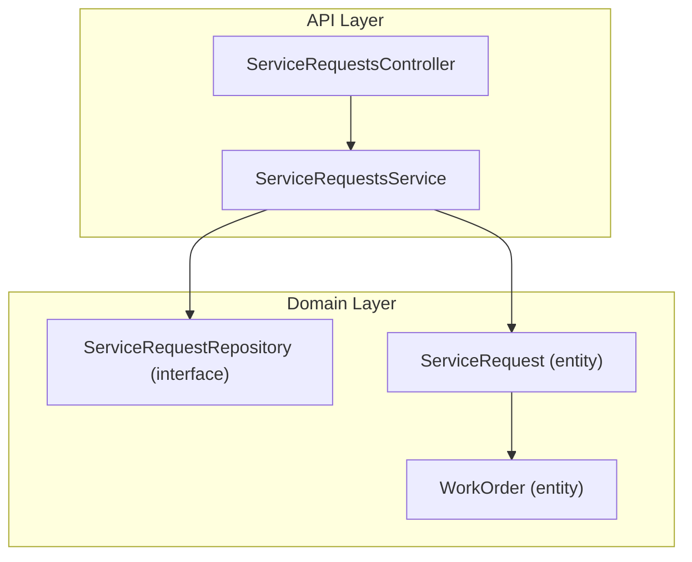
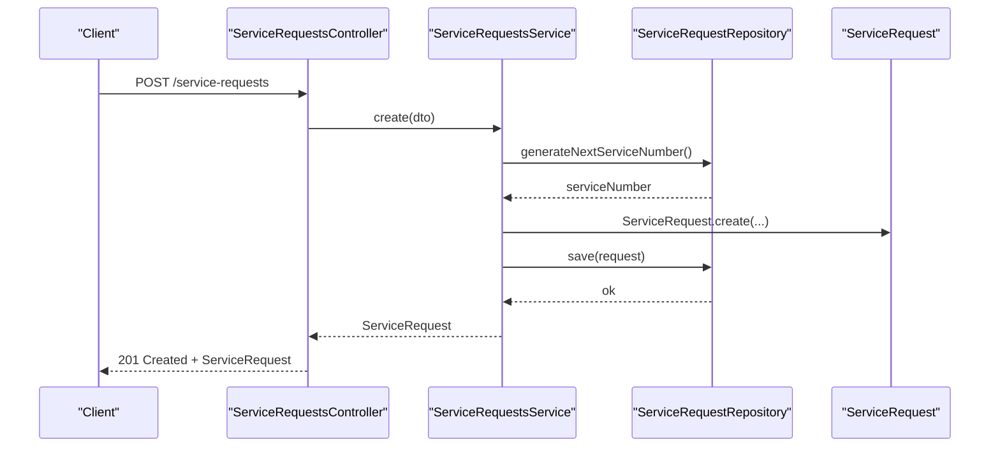
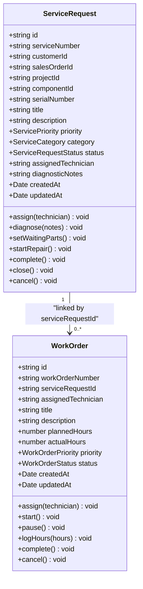
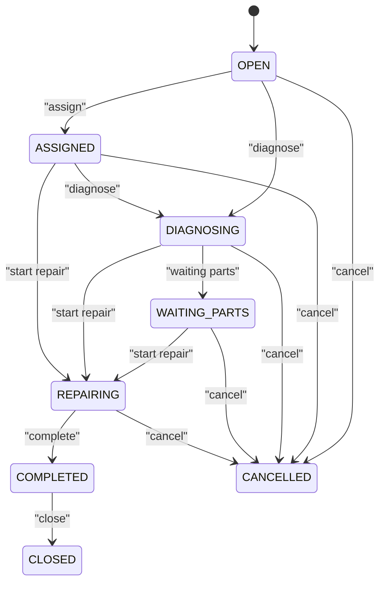
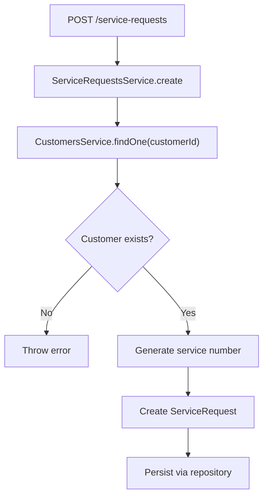
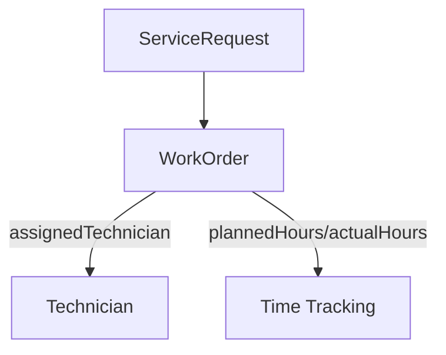
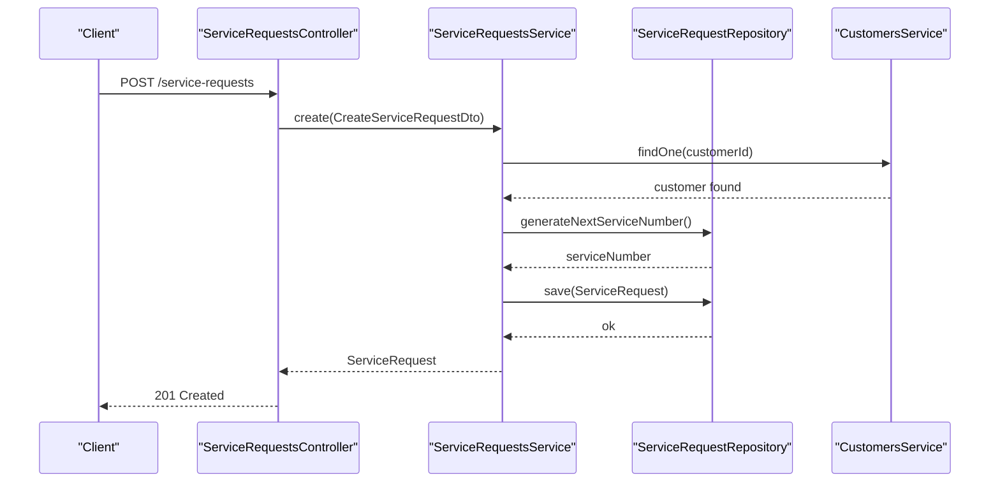
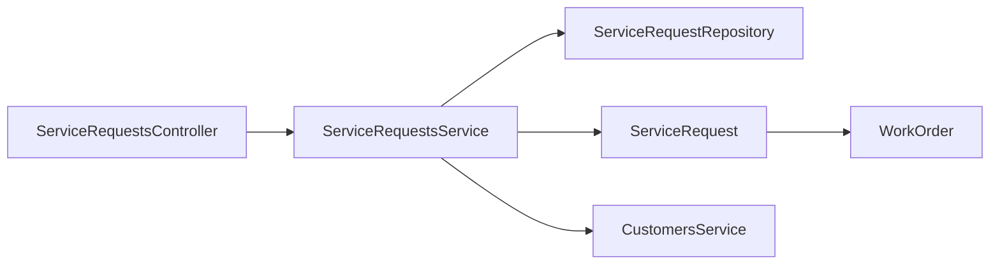

# Service Requests

<cite>
**Referenced Files in This Document**
- [service-requests.controller.ts](file://apps/api/src/service-requests/service-requests.controller.ts)
- [service-requests.service.ts](file://apps/api/src/service-requests/service-requests.service.ts)
- [dtos.ts](file://apps/api/src/service-requests/dtos.ts)
- [service-request.ts](file://packages/service/src/requests/service-request.ts)
- [service-request.repository.ts](file://packages/service/src/requests/service-request.repository.ts)
- [work-order.ts](file://packages/service/src/work-orders/work-order.ts)
- [index.ts (service package)](file://packages/service/src/index.ts)
</cite>

## Table of Contents
1. [Introduction](#introduction)
2. [Project Structure](#project-structure)
3. [Core Components](#core-components)
4. [Architecture Overview](#architecture-overview)
5. [Detailed Component Analysis](#detailed-component-analysis)
6. [Dependency Analysis](#dependency-analysis)
7. [Performance Considerations](#performance-considerations)
8. [Troubleshooting Guide](#troubleshooting-guide)
9. [Conclusion](#conclusion)

## Introduction
This document explains Ananya ERP’s Service Request management system. It covers the data model, lifecycle, API endpoints, integrations with customers and work orders, categorization, and operational workflows such as customer-initiated requests, automated alerts, and escalation procedures. The goal is to help developers and operators understand how service requests are created, tracked, assigned, diagnosed, repaired, completed, closed, or cancelled.

## Project Structure
The Service Requests feature spans two layers:
- API layer (NestJS): Controllers expose HTTP endpoints; services orchestrate business logic and repository calls.
- Domain layer (packages/service): Defines entities, enumerations, and repository interfaces for service requests and related artifacts like work orders.

**Diagram sources**
- [service-requests.controller.ts:14-83](file://apps/api/src/service-requests/service-requests.controller.ts#L14-L83)
- [service-requests.service.ts:18-126](file://apps/api/src/service-requests/service-requests.service.ts#L18-L126)
- [service-request.repository.ts:17-23](file://packages/service/src/requests/service-request.repository.ts#L17-L23)
- [service-request.ts:50-182](file://packages/service/src/requests/service-request.ts#L50-L182)
- [work-order.ts:33-147](file://packages/service/src/work-orders/work-order.ts#L33-L147)

**Section sources**
- [service-requests.controller.ts:14-83](file://apps/api/src/service-requests/service-requests.controller.ts#L14-L83)
- [service-requests.service.ts:18-126](file://apps/api/src/service-requests/service-requests.service.ts#L18-L126)
- [service-request.ts:50-182](file://packages/service/src/requests/service-request.ts#L50-L182)
- [work-order.ts:33-147](file://packages/service/src/work-orders/work-order.ts#L33-L147)

## Core Components
- ServiceRequest entity: Encapsulates request state, metadata, and lifecycle transitions.
- ServiceRequestsController: Exposes REST endpoints for CRUD and lifecycle operations.
- ServiceRequestsService: Validates inputs, enforces business rules, and persists changes via repository.
- ServiceRequestRepository interface: Abstracts persistence and query capabilities.
- WorkOrder entity: Represents repair tasks linked to a service request.

Key responsibilities:
- Data model and enumerations (status, priority, category).
- Lifecycle enforcement through domain methods.
- API routing and input validation via DTOs.
- Repository abstraction for persistence and queries.

**Section sources**
- [service-request.ts:3-182](file://packages/service/src/requests/service-request.ts#L3-L182)
- [service-requests.controller.ts:14-83](file://apps/api/src/service-requests/service-requests.controller.ts#L14-L83)
- [service-requests.service.ts:18-126](file://apps/api/src/service-requests/service-requests.service.ts#L18-L126)
- [service-request.repository.ts:8-23](file://packages/service/src/requests/service-request.repository.ts#L8-L23)
- [work-order.ts:3-147](file://packages/service/src/work-orders/work-order.ts#L3-L147)

## Architecture Overview
The system follows a layered architecture:
- Controller handles HTTP requests and maps them to service methods.
- Service coordinates domain logic and repository interactions.
- Domain entities enforce state machine rules.
- Repository interface abstracts storage and querying.

**Diagram sources**
- [service-requests.controller.ts:20-23](file://apps/api/src/service-requests/service-requests.controller.ts#L20-L23)
- [service-requests.service.ts:26-44](file://apps/api/src/service-requests/service-requests.service.ts#L26-L44)
- [service-request.ts:87-112](file://packages/service/src/requests/service-request.ts#L87-L112)
- [service-request.repository.ts:21-22](file://packages/service/src/requests/service-request.repository.ts#L21-L22)

## Detailed Component Analysis

### Data Model
- Statuses: OPEN, ASSIGNED, DIAGNOSING, WAITING_PARTS, REPAIRING, COMPLETED, CLOSED, CANCELLED.
- Priorities: LOW, MEDIUM, HIGH, URGENT.
- Categories: HARDWARE, SOFTWARE, MAINTENANCE, INSTALLATION, INSPECTION.
- Customer linkage: customerId required; optional salesOrderId, projectId, componentId, serialNumber.
- Assignment and diagnostics: assignedTechnician, diagnosticNotes.
- Timestamps: createdAt, updatedAt.

**Diagram sources**
- [service-request.ts:3-182](file://packages/service/src/requests/service-request.ts#L3-L182)
- [work-order.ts:3-147](file://packages/service/src/work-orders/work-order.ts#L3-L147)

**Section sources**
- [service-request.ts:3-182](file://packages/service/src/requests/service-request.ts#L3-L182)
- [work-order.ts:3-147](file://packages/service/src/work-orders/work-order.ts#L3-L147)

### API Endpoints
Base path: /service-requests

- Create
  - Method: POST
  - Path: /service-requests
  - Body: CreateServiceRequestDto
  - Response: ServiceRequest
- List
  - Method: GET
  - Path: /service-requests
  - Query params: status, priority, category, customerId, assignedTechnician, search
  - Response: ServiceRequest[]
- Get one
  - Method: GET
  - Path: /service-requests/:id
  - Response: ServiceRequest
- Assign
  - Method: POST
  - Path: /service-requests/:id/assign
  - Body: AssignServiceRequestDto
  - Response: ServiceRequest
- Diagnose
  - Method: POST
  - Path: /service-requests/:id/diagnose
  - Body: DiagnoseServiceRequestDto
  - Response: ServiceRequest
- Waiting parts
  - Method: POST
  - Path: /service-requests/:id/waiting-parts
  - Response: ServiceRequest
- Start repair
  - Method: POST
  - Path: /service-requests/:id/start-repair
  - Response: ServiceRequest
- Complete
  - Method: POST
  - Path: /service-requests/:id/complete
  - Response: ServiceRequest
- Close
  - Method: POST
  - Path: /service-requests/:id/close
  - Response: ServiceRequest
- Cancel
  - Method: POST
  - Path: /service-requests/:id/cancel
  - Response: ServiceRequest

Validation and types:
- CreateServiceRequestDto requires customerId and title; category is required; priority is optional.
- AssignServiceRequestDto requires technician.
- DiagnoseServiceRequestDto requires notes.

**Section sources**
- [service-requests.controller.ts:14-83](file://apps/api/src/service-requests/service-requests.controller.ts#L14-L83)
- [dtos.ts:4-52](file://apps/api/src/service-requests/dtos.ts#L4-L52)

### Lifecycle and State Machine
The ServiceRequest entity enforces a strict lifecycle:
- Creation: status defaults to OPEN.
- Assignment: moves to ASSIGNED.
- Diagnosis: records notes and moves to DIAGNOSING.
- Waiting parts: moves to WAITING_PARTS.
- Repair: moves to REPAIRING.
- Completion: moves to COMPLETED.
- Closure: moves to CLOSED.
- Cancellation: moves to CANCELLED.

**Diagram sources**
- [service-request.ts:118-182](file://packages/service/src/requests/service-request.ts#L118-L182)

**Section sources**
- [service-request.ts:87-182](file://packages/service/src/requests/service-request.ts#L87-L182)

### Integrations

#### Customers
- On creation, the service validates that the referenced customer exists before creating the request.

**Diagram sources**
- [service-requests.service.ts:26-44](file://apps/api/src/service-requests/service-requests.service.ts#L26-L44)

**Section sources**
- [service-requests.service.ts:26-44](file://apps/api/src/service-requests/service-requests.service.ts#L26-L44)

#### Work Orders
- WorkOrder entities link to a ServiceRequest via serviceRequestId.
- Typical flow: create a ServiceRequest, then create one or more WorkOrders to track repair tasks.

**Diagram sources**
- [work-order.ts:8-21](file://packages/service/src/work-orders/work-order.ts#L8-L21)
- [work-order.ts:62-87](file://packages/service/src/work-orders/work-order.ts#L62-L87)

**Section sources**
- [work-order.ts:33-147](file://packages/service/src/work-orders/work-order.ts#L33-L147)

### Request Categorization and SLA Management
- Categorization: Use ServiceCategory to classify requests (HARDWARE, SOFTWARE, MAINTENANCE, INSTALLATION, INSPECTION).
- Priority: Use ServicePriority to reflect urgency (LOW, MEDIUM, HIGH, URGENT).
- SLA management: Not implemented in the current codebase. You can extend the ServiceRequest entity and repository to add SLA fields (e.g., target resolution time), compute deadlines based on priority/category, and trigger notifications when thresholds are breached.

[No sources needed since this section provides general guidance]

### Notification Systems
- Notifications module exists in the API but is not wired into Service Requests in the analyzed files.
- Recommended approach: integrate with the existing notifications subsystem to send alerts on key events (assignment, diagnosis, waiting parts, completion, closure, cancellation).

[No sources needed since this section provides general guidance]

### Practical Workflows

#### Customer-Initiated Request
- Steps:
  1. Client calls POST /service-requests with customer context and details.
  2. System validates customer, generates service number, creates request in OPEN status.
  3. Optional: create WorkOrder(s) to plan repair tasks.

**Diagram sources**
- [service-requests.controller.ts:20-23](file://apps/api/src/service-requests/service-requests.controller.ts#L20-L23)
- [service-requests.service.ts:26-44](file://apps/api/src/service-requests/service-requests.service.ts#L26-L44)

**Section sources**
- [service-requests.controller.ts:20-23](file://apps/api/src/service-requests/service-requests.controller.ts#L20-L23)
- [service-requests.service.ts:26-44](file://apps/api/src/service-requests/service-requests.service.ts#L26-L44)

#### Automated Alerts and Escalation
- Trigger points:
  - Assignment: notify assignee and stakeholders.
  - Diagnosis: update status to DIAGNOSING and notify relevant teams.
  - Waiting parts: alert procurement/logistics.
  - Completion/Closure: inform customer and close follow-ups.
- Escalation:
  - If SLA thresholds are exceeded (extension point), escalate to higher-priority queues or managers.

[No sources needed since this section provides general guidance]

## Dependency Analysis
- Controller depends on ServiceRequestsService.
- Service depends on:
  - ServiceRequestRepository (interface).
  - CustomersService (for validation).
  - ServiceRequest entity (domain behavior).
- ServiceRequest entity references enumerations and links to WorkOrder conceptually.

**Diagram sources**
- [service-requests.controller.ts:14-83](file://apps/api/src/service-requests/service-requests.controller.ts#L14-L83)
- [service-requests.service.ts:18-126](file://apps/api/src/service-requests/service-requests.service.ts#L18-L126)
- [service-request.repository.ts:17-23](file://packages/service/src/requests/service-request.repository.ts#L17-L23)
- [service-request.ts:50-182](file://packages/service/src/requests/service-request.ts#L50-L182)
- [work-order.ts:33-147](file://packages/service/src/work-orders/work-order.ts#L33-L147)

**Section sources**
- [service-requests.controller.ts:14-83](file://apps/api/src/service-requests/service-requests.controller.ts#L14-L83)
- [service-requests.service.ts:18-126](file://apps/api/src/service-requests/service-requests.service.ts#L18-L126)
- [service-request.repository.ts:17-23](file://packages/service/src/requests/service-request.repository.ts#L17-L23)
- [service-request.ts:50-182](file://packages/service/src/requests/service-request.ts#L50-L182)
- [work-order.ts:33-147](file://packages/service/src/work-orders/work-order.ts#L33-L147)

## Performance Considerations
- Query filtering: Use status, priority, category, customerId, assignedTechnician, and search parameters to narrow results efficiently at the repository level.
- Pagination: Consider adding pagination to findAll to handle large datasets.
- Indexing: Ensure database indexes on frequently filtered fields (customerId, status, priority, category, assignedTechnician).
- Idempotency: For external integrations, consider idempotent create endpoints to prevent duplicate requests.

[No sources needed since this section provides general guidance]

## Troubleshooting Guide
Common issues and resolutions:
- Invalid customer reference:
  - Symptom: Error during request creation.
  - Cause: Referenced customerId does not exist.
  - Resolution: Verify customer exists before creating the request.
- Invalid state transitions:
  - Symptom: Errors when calling assign, diagnose, startRepair, complete, close, cancel.
  - Cause: Attempting to transition from an invalid state (e.g., closing a cancelled request).
  - Resolution: Ensure the current status allows the requested action.
- Missing required fields:
  - Symptom: Validation errors on create or assign.
  - Cause: Required fields missing (e.g., customerId, title, technician).
  - Resolution: Provide all required fields per DTO definitions.

**Section sources**
- [service-requests.service.ts:26-44](file://apps/api/src/service-requests/service-requests.service.ts#L26-L44)
- [service-request.ts:118-182](file://packages/service/src/requests/service-request.ts#L118-L182)
- [dtos.ts:4-52](file://apps/api/src/service-requests/dtos.ts#L4-L52)

## Conclusion
Ananya ERP’s Service Request system provides a robust, state-driven model for managing support and repair processes. The API exposes clear endpoints for creating, assigning, diagnosing, repairing, completing, closing, and cancelling requests. Integration with customers ensures referential integrity, while the WorkOrder entity supports detailed task tracking. Extensibility points exist for SLA management and notifications to meet advanced operational requirements.