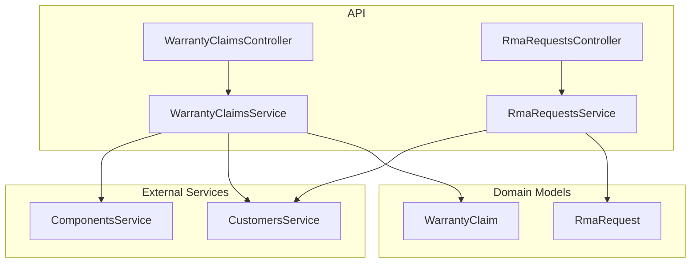
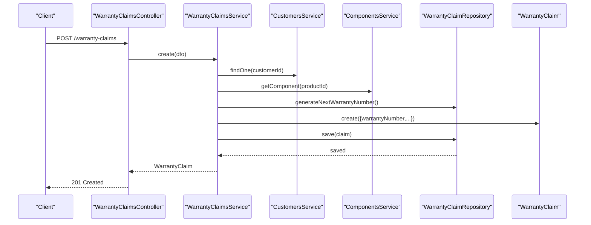
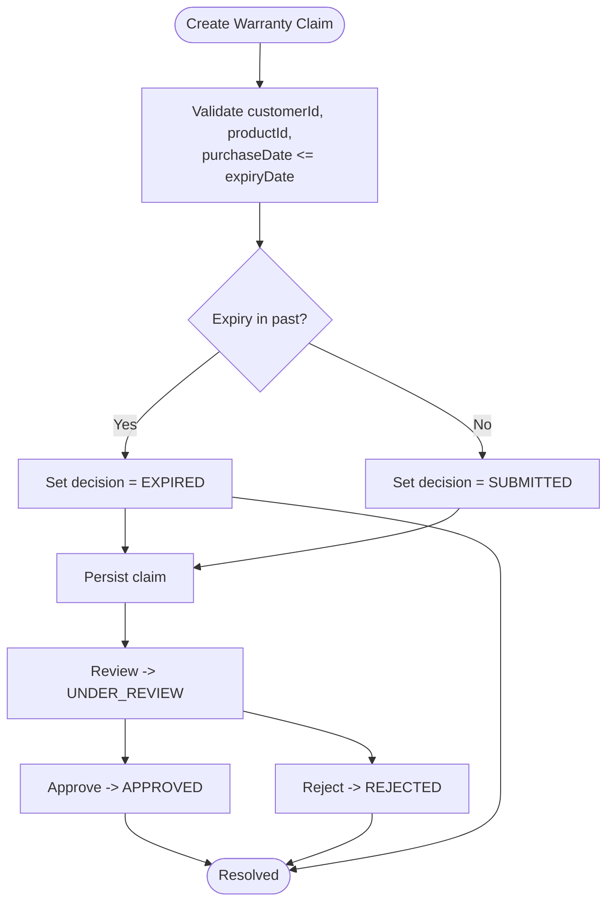
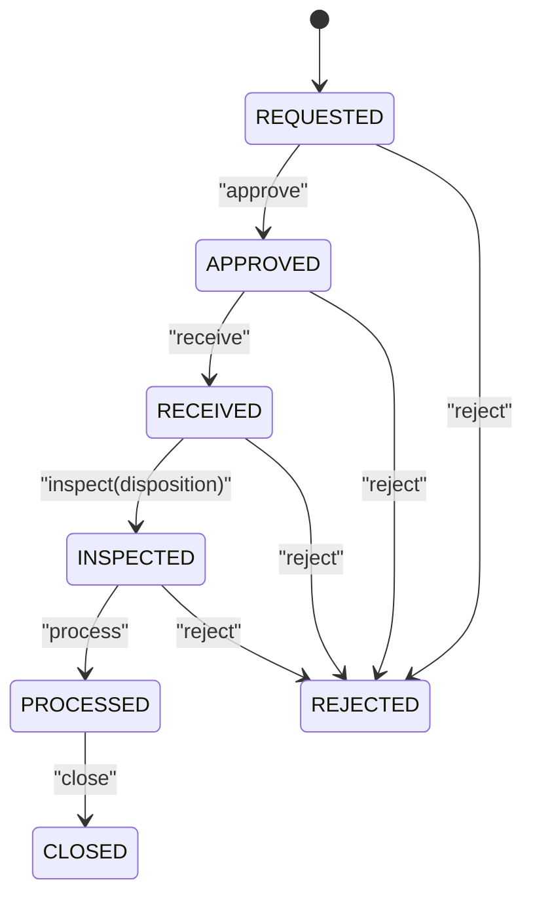
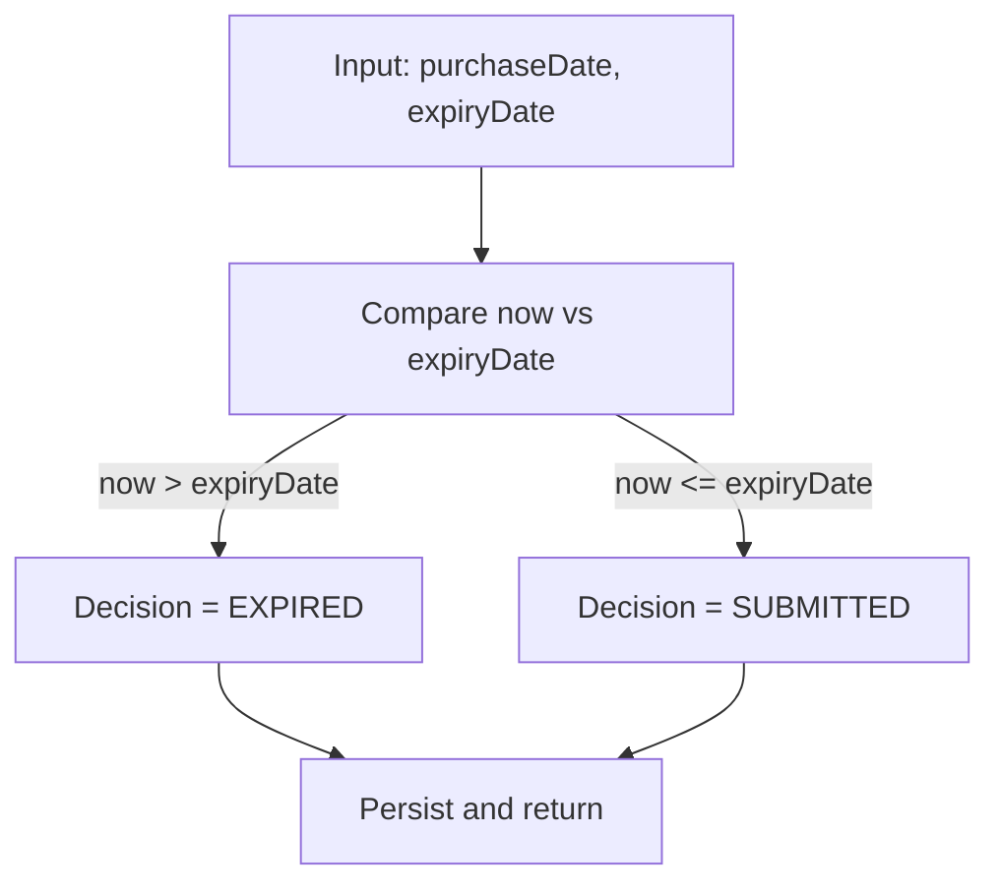
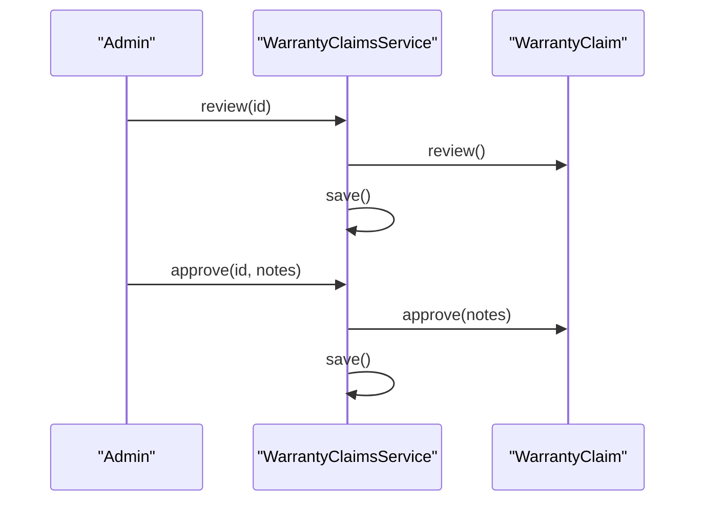
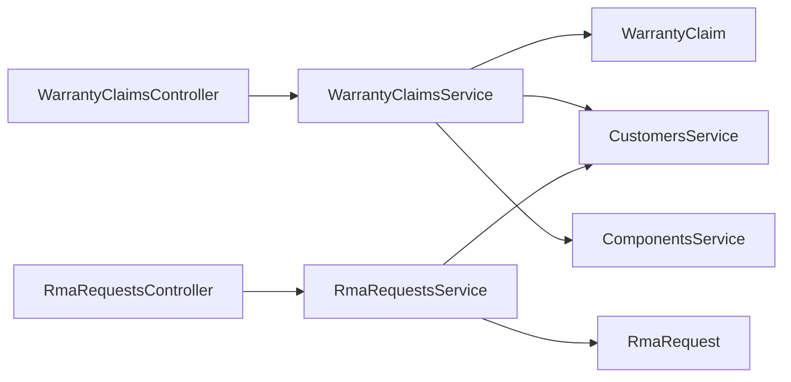

# Warranty Claims

<cite>
**Referenced Files in This Document**
- [0048-warranty-and-rma.md](file://docs/rfcs/0048-warranty-and-rma.md)
- [warranty-claim.ts](file://packages/service/src/warranty/warranty-claim.ts)
- [rma-request.ts](file://packages/service/src/rma/rma-request.ts)
- [warranty-claims.controller.ts](file://apps/api/src/warranty-claims/warranty-claims.controller.ts)
- [warranty-claims.service.ts](file://apps/api/src/warranty-claims/warranty-claims.service.ts)
- [dtos.ts (Warranty)](file://apps/api/src/warranty-claims/dtos.ts)
- [rma-requests.controller.ts](file://apps/api/src/rma-requests/rma-requests.controller.ts)
- [rma-requests.service.ts](file://apps/api/src/rma-requests/rma-requests.service.ts)
- [dtos.ts (RMA)](file://apps/api/src/rma-requests/dtos.ts)
- [page.tsx (Web Warranty)](file://apps/web/app/warranty/page.tsx)
- [page.tsx (Web RMA)](file://apps/web/app/rma/page.tsx)
</cite>

## Table of Contents
1. Introduction
2. Project Structure
3. Core Components
4. Architecture Overview
5. Detailed Component Analysis
6. Dependency Analysis
7. Performance Considerations
8. Troubleshooting Guide
9. Conclusion
10. Appendices

## Introduction
This document explains Ananya ERP’s Warranty Claims and Return Merchandise Authorization (RMA) processing system. It covers the warranty claim data model, coverage periods, claim types, validation rules, approval workflows, end-to-end lifecycle from submission to resolution, API endpoints for creating claims, checking warranty coverage, processing approvals, and handling settlements. It also includes practical scenarios such as product defects, manufacturing issues, and customer complaints; integration with serial numbers and financial modules; and guidance for analytics, fraud detection, and supplier liability tracking.

## Project Structure
The warranty and RMA capabilities are implemented across:
- Domain models in the service package
- REST controllers and services in the API application
- DTOs for input validation
- Web pages for user workflows
- RFC defining state machines, cross-module boundaries, and database schema

**Diagram sources**
- [warranty-claims.controller.ts:1-50](file://apps/api/src/warranty-claims/warranty-claims.controller.ts#L1-L50)
- [warranty-claims.service.ts:1-84](file://apps/api/src/warranty-claims/warranty-claims.service.ts#L1-L84)
- [rma-requests.controller.ts:1-67](file://apps/api/src/rma-requests/rma-requests.controller.ts#L1-L67)
- [rma-requests.service.ts:1-102](file://apps/api/src/rma-requests/rma-requests.service.ts#L1-L102)
- [warranty-claim.ts:1-118](file://packages/service/src/warranty/warranty-claim.ts#L1-L118)
- [rma-request.ts:1-144](file://packages/service/src/rma/rma-request.ts#L1-L144)

**Section sources**
- [0048-warranty-and-rma.md:1-125](file://docs/rfcs/0048-warranty-and-rma.md#L1-L125)

## Core Components
- WarrantyClaim domain model defines entitlement evaluation, coverage dates, decision states, and business rules for review, approve, and reject transitions.
- RmaRequest domain model defines return authorization flow, inspection disposition, and processing/closing rules.
- API controllers expose REST endpoints for creating, querying, reviewing, approving, rejecting claims, and managing RMA lifecycles.
- DTOs enforce input validation for both warranty claims and RMAs.
- Web pages provide dashboards and forms for filing claims and issuing RMAs.

Key responsibilities:
- WarrantyClaimsService validates external references (customer, component), generates warranty numbers, constructs WarrantyClaim entities, persists them, and orchestrates state transitions.
- RmaRequestsService validates customer reference, generates RMA numbers, constructs RmaRequest entities, persists them, and enforces RMA state transitions.

**Section sources**
- [warranty-claim.ts:1-118](file://packages/service/src/warranty/warranty-claim.ts#L1-L118)
- [rma-request.ts:1-144](file://packages/service/src/rma/rma-request.ts#L1-L144)
- [warranty-claims.service.ts:1-84](file://apps/api/src/warranty-claims/warranty-claims.service.ts#L1-L84)
- [rma-requests.service.ts:1-102](file://apps/api/src/rma-requests/rma-requests.service.ts#L1-L102)
- [dtos.ts (Warranty):1-39](file://apps/api/src/warranty-claims/dtos.ts#L1-L39)
- [dtos.ts (RMA):1-35](file://apps/api/src/rma-requests/dtos.ts#L1-L35)

## Architecture Overview
The system follows a layered architecture:
- Presentation layer: Web UI for filing claims and managing RMAs.
- API layer: NestJS controllers exposing REST endpoints.
- Application layer: Services orchestrating domain logic and repository calls.
- Domain layer: Entities encapsulating business rules and state machines.
- Integration points: Customer and component master data via other services; future integration with sales, warehouse, and finance modules per RFC.

**Diagram sources**
- [warranty-claims.controller.ts:10-13](file://apps/api/src/warranty-claims/warranty-claims.controller.ts#L10-L13)
- [warranty-claims.service.ts:22-39](file://apps/api/src/warranty-claims/warranty-claims.service.ts#L22-L39)
- [warranty-claim.ts:60-86](file://packages/service/src/warranty/warranty-claim.ts#L60-L86)

## Detailed Component Analysis

### Warranty Claim Data Model and Lifecycle
- Fields include unique identifiers, customer/product references, optional serial number, purchase/expiry dates, reason, decision, notes, and timestamps.
- Decision states: SUBMITTED, UNDER_REVIEW, APPROVED, REJECTED, EXPIRED.
- Creation validates required fields and date ordering; expired claims are marked EXPIRED at creation if expiry is in the past.
- Transitions:
  - Review: moves to UNDER_REVIEW unless already EXPIRED.
  - Approve: sets APPROVED and optional notes; disallowed on EXPIRED.
  - Reject: sets REJECTED and optional notes; disallowed after APPROVED.

**Diagram sources**
- [warranty-claim.ts:60-117](file://packages/service/src/warranty/warranty-claim.ts#L60-L117)

**Section sources**
- [warranty-claim.ts:1-118](file://packages/service/src/warranty/warranty-claim.ts#L1-L118)

### RMA Request Data Model and Lifecycle
- Fields include unique identifiers, customer/sales order references, item description, optional serial number, reason, status, disposition, inspection notes, and timestamps.
- Status states: REQUESTED, APPROVED, RECEIVED, INSPECTED, PROCESSED, CLOSED, REJECTED.
- Disposition values: REPAIR, REPLACE, SCRAP, RETURN.
- Transitions:
  - Approve: only from REQUESTED.
  - Receive: only from APPROVED.
  - Inspect: only from RECEIVED; sets disposition and moves to INSPECTED.
  - Process: only from INSPECTED.
  - Close: allowed except when REJECTED.
  - Reject: allowed except when CLOSED or PROCESSED.

**Diagram sources**
- [rma-request.ts:94-143](file://packages/service/src/rma/rma-request.ts#L94-L143)

**Section sources**
- [rma-request.ts:1-144](file://packages/service/src/rma/rma-request.ts#L1-L144)

### API Endpoints

#### Warranty Claims
- Create claim: POST /warranty-claims
- List claims: GET /warranty-claims?customerId=&productId=&decision=&search=
- Get claim: GET /warranty-claims/:id
- Review claim: POST /warranty-claims/:id/review
- Approve claim: POST /warranty-claims/:id/approve { notes }
- Reject claim: POST /warranty-claims/:id/reject { notes }

Validation:
- CreateWarrantyClaimDto requires customerId, productId, purchaseDate, expiryDate, claimReason; serialNumber is optional.
- DecisionNotesDto allows optional notes.

Integration:
- Service verifies customer existence and component validity before creating a claim.

**Section sources**
- [warranty-claims.controller.ts:6-49](file://apps/api/src/warranty-claims/warranty-claims.controller.ts#L6-L49)
- [warranty-claims.service.ts:22-82](file://apps/api/src/warranty-claims/warranty-claims.service.ts#L22-L82)
- [dtos.ts (Warranty):8-38](file://apps/api/src/warranty-claims/dtos.ts#L8-L38)

#### RMA Requests
- Create RMA: POST /rma-requests
- List RMAs: GET /rma-requests?customerId=&salesOrderId=&status=&disposition=&search=
- Get RMA: GET /rma-requests/:id
- Approve RMA: POST /rma-requests/:id/approve
- Receive RMA: POST /rma-requests/:id/receive
- Inspect RMA: POST /rma-requests/:id/inspect { disposition, notes }
- Process RMA: POST /rma-requests/:id/process
- Close RMA: POST /rma-requests/:id/close
- Reject RMA: POST /rma-requests/:id/reject

Validation:
- CreateRmaRequestDto requires customerId, itemDescription, reason; salesOrderId and serialNumber are optional.
- InspectRmaDto requires disposition; notes are optional.

Integration:
- Service verifies customer existence before creating an RMA.

**Section sources**
- [rma-requests.controller.ts:6-66](file://apps/api/src/rma-requests/rma-requests.controller.ts#L6-L66)
- [rma-requests.service.ts:21-100](file://apps/api/src/rma-requests/rma-requests.service.ts#L21-L100)
- [dtos.ts (RMA):4-34](file://apps/api/src/rma-requests/dtos.ts#L4-L34)

### Warranty Coverage Check
Coverage is evaluated at claim creation by comparing current time with expiry date:
- If expiry date is in the past, the claim is created with decision EXPIRED.
- Otherwise, it starts as SUBMITTED and can be reviewed/approved/rejected.

**Diagram sources**
- [warranty-claim.ts:67-85](file://packages/service/src/warranty/warranty-claim.ts#L67-L85)

**Section sources**
- [warranty-claim.ts:60-86](file://packages/service/src/warranty/warranty-claim.ts#L60-L86)

### Approval Workflows
- Warranty claim workflow:
  - Submit -> Under Review -> Approved/Rejected/Expired
  - Notes captured on approve/reject
- RMA workflow:
  - Requested -> Approved -> Received -> Inspected -> Processed -> Closed
  - Rejection possible at multiple stages; close not allowed for rejected

**Diagram sources**
- [warranty-claims.service.ts:63-82](file://apps/api/src/warranty-claims/warranty-claims.service.ts#L63-L82)
- [warranty-claim.ts:92-116](file://packages/service/src/warranty/warranty-claim.ts#L92-L116)

**Section sources**
- [warranty-claims.service.ts:63-82](file://apps/api/src/warranty-claims/warranty-claims.service.ts#L63-L82)
- [warranty-claim.ts:92-116](file://packages/service/src/warranty/warranty-claim.ts#L92-L116)

### Settlements and Financial Integration
- Per RFC, warranty approval authorizes downstream operational services but does not directly modify Inventory or Finance.
- RMA inspection disposition drives downstream actions (e.g., repair, replace, scrap, return).
- Future extensions include automated vendor warranty back-to-back recovery workflows.

Practical settlement patterns:
- Replace: trigger replacement inventory issuance and related financial adjustments through sales/warehouse interfaces.
- Repair: coordinate with maintenance/work orders and record costs.
- Scrap: adjust inventory and record loss.
- Return: process customer return receipt and potential refund through finance module.

**Section sources**
- [0048-warranty-and-rma.md:66-71](file://docs/rfcs/0048-warranty-and-rma.md#L66-L71)
- [0048-warranty-and-rma.md:98-101](file://docs/rfcs/0048-warranty-and-rma.md#L98-L101)
- [0048-warranty-and-rma.md:122-125](file://docs/rfcs/0048-warranty-and-rma.md#L122-L125)

### Serial Numbers and Traceability
- Both WarrantyClaim and RmaRequest support optional serialNumber fields to link claims/RMAs to specific units.
- Web UI surfaces search placeholders indicating serial-based queries.

Operational guidance:
- Capture serial numbers at claim creation and RMA creation for precise traceability.
- Use serial numbers to correlate returns with original purchases and warranty terms.

**Section sources**
- [warranty-claim.ts:6-18](file://packages/service/src/warranty/warranty-claim.ts#L6-L18)
- [rma-request.ts:14-27](file://packages/service/src/rma/rma-request.ts#L14-L27)
- [page.tsx (Web Warranty):127-135](file://apps/web/app/warranty/page.tsx#L127-L135)
- [page.tsx (Web RMA):120-128](file://apps/web/app/rma/page.tsx#L120-L128)

### Practical Scenarios

- Product defect:
  - File warranty claim with product and serial details; claim starts SUBMITTED or EXPIRED based on dates.
  - Review and approve; issue RMA to receive and inspect the defective unit; set disposition REPLACE or REPAIR.
- Manufacturing issue:
  - Batch-level correlation may be needed; use serial numbers where available.
  - After approval, inspect and set disposition SCRAP or REPLACE depending on severity.
- Customer complaint:
  - Create RMA without warranty claim if outside coverage; inspect and decide RETURN or REPLACE.

These flows align with the defined state machines and validation rules.

**Section sources**
- [warranty-claim.ts:60-117](file://packages/service/src/warranty/warranty-claim.ts#L60-L117)
- [rma-request.ts:67-143](file://packages/service/src/rma/rma-request.ts#L67-L143)

## Dependency Analysis
- Controllers depend on services for orchestration.
- Services depend on domain models and repositories via dependency injection.
- WarrantyClaimsService depends on CustomersService and ComponentsService for referential integrity.
- RmaRequestsService depends on CustomersService for referential integrity.

**Diagram sources**
- [warranty-claims.controller.ts:1-49](file://apps/api/src/warranty-claims/warranty-claims.controller.ts#L1-L49)
- [warranty-claims.service.ts:1-20](file://apps/api/src/warranty-claims/warranty-claims.service.ts#L1-L20)
- [rma-requests.controller.ts:1-19](file://apps/api/src/rma-requests/rma-requests.controller.ts#L1-L19)
- [rma-requests.service.ts:1-19](file://apps/api/src/rma-requests/rma-requests.service.ts#L1-L19)

**Section sources**
- [warranty-claims.service.ts:1-20](file://apps/api/src/warranty-claims/warranty-claims.service.ts#L1-L20)
- [rma-requests.service.ts:1-19](file://apps/api/src/rma-requests/rma-requests.service.ts#L1-L19)

## Performance Considerations
- Validation at DTO and domain layers prevents invalid state mutations early.
- Repository abstraction enables efficient querying and pagination strategies.
- Avoid unnecessary external calls by caching master data lookups where appropriate.
- Keep state transitions minimal and idempotent to reduce write amplification.

[No sources needed since this section provides general guidance]

## Troubleshooting Guide
Common errors and resolutions:
- Invalid dates: Ensure purchaseDate <= expiryDate during claim creation.
- Expired claims cannot be reviewed/approved: Reopen or create a new claim if applicable.
- Cannot reject approved claims: Adjust workflow permissions or rework approval steps.
- RMA state violations: Ensure transitions follow REQUESTED -> APPROVED -> RECEIVED -> INSPECTED -> PROCESSED -> CLOSED.
- Missing references: Verify customerId exists before creating claims or RMAs.

**Section sources**
- [warranty-claim.ts:60-117](file://packages/service/src/warranty/warranty-claim.ts#L60-L117)
- [rma-request.ts:94-143](file://packages/service/src/rma/rma-request.ts#L94-L143)

## Conclusion
Ananya ERP’s Warranty Claims and RMA subsystems provide robust, state-driven workflows for evaluating entitlements, adjudicating claims, and managing returns. The design emphasizes clear domain invariants, strict validation, and separation of concerns, enabling reliable integration with inventory, sales, and finance modules while supporting advanced features like serial traceability, analytics, fraud detection, and supplier liability tracking.

[No sources needed since this section summarizes without analyzing specific files]

## Appendices

### Database Schema Summary
- warranty_claims: id, warranty_number, customer_id, product_id, serial_number, purchase_date, expiry_date, claim_reason, decision, decision_notes, created_at, updated_at
- rma_requests: id, rma_number, customer_id, sales_order_id, item_description, serial_number, reason, status, disposition, inspection_notes, created_at, updated_at

**Section sources**
- [0048-warranty-and-rma.md:103-107](file://docs/rfcs/0048-warranty-and-rma.md#L103-L107)

### Analytics, Fraud Detection, and Supplier Liability Tracking
- Analytics: Track claim volume, approval rates, turnaround times, and disposition outcomes by product/customer/serial.
- Fraud detection: Flag anomalies such as repeated claims on same serial, mismatched purchase/expiry dates, or unusual rejection patterns.
- Supplier liability: Correlate RMA dispositions and reasons with supplier batches to quantify back-to-back recovery opportunities.

[No sources needed since this section provides general guidance]