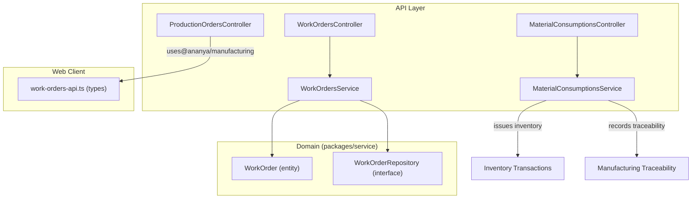
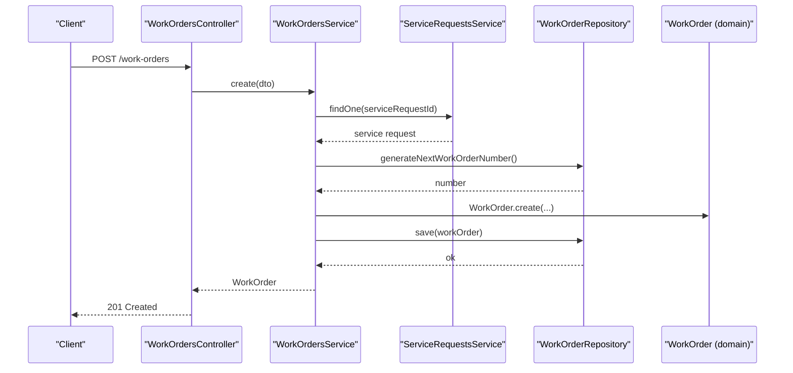
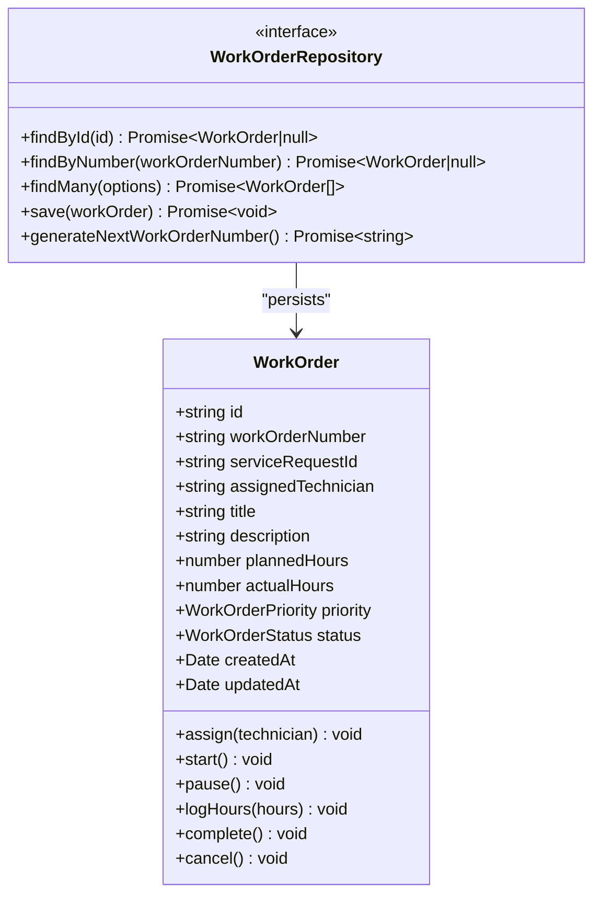
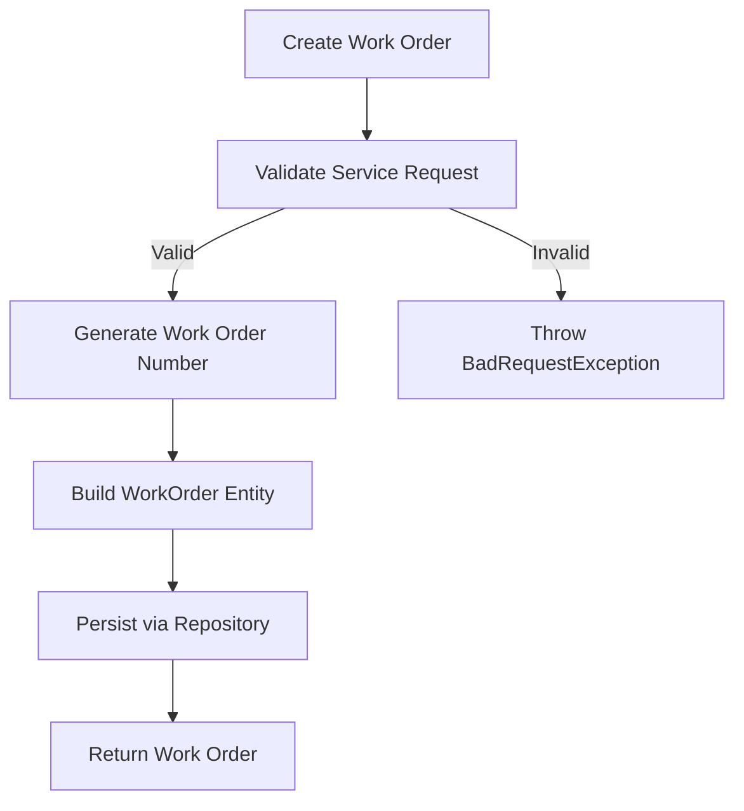
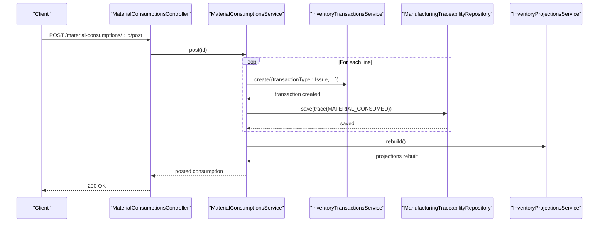
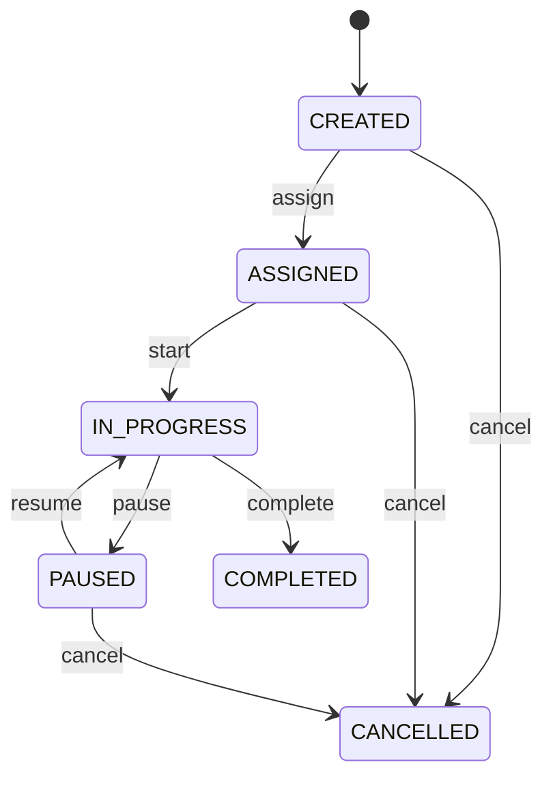
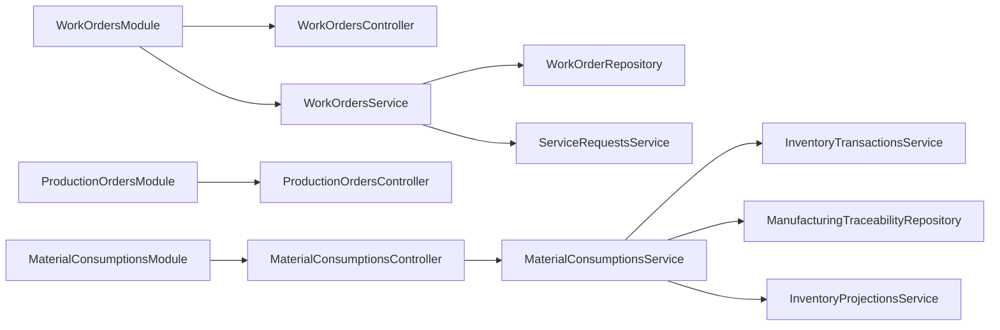

# Work Orders

<cite>
**Referenced Files in This Document**
- [work-orders.controller.ts](file://apps/api/src/work-orders/work-orders.controller.ts)
- [work-orders.service.ts](file://apps/api/src/work-orders/work-orders.service.ts)
- [dtos.ts](file://apps/api/src/work-orders/dtos.ts)
- [work-orders.module.ts](file://apps/api/src/work-orders/work-orders.module.ts)
- [work-order.ts](file://packages/service/src/work-orders/work-order.ts)
- [work-order.repository.ts](file://packages/service/src/work-orders/work-order.repository.ts)
- [production-orders.controller.ts](file://apps/api/src/production-orders/production-orders.controller.ts)
- [material-consumptions.controller.ts](file://apps/api/src/material-consumptions/material-consumptions.controller.ts)
- [material-consumptions.service.ts](file://apps/api/src/material-consumptions/material-consumptions.service.ts)
- [work-orders-api.ts](file://apps/web/lib/api/work-orders-api.ts)
- [0017-production-orders.md](file://docs/rfcs/0017-production-orders.md)
</cite>

## Table of Contents
1. Introduction
2. Project Structure
3. Core Components
4. Architecture Overview
5. Detailed Component Analysis
6. Dependency Analysis
7. Performance Considerations
8. Troubleshooting Guide
9. Conclusion
10. Appendices

## Introduction
This document explains Ananya ERP’s Work Order management system, covering both service-oriented work orders and manufacturing production orders. It details the data model (order types, resource allocation, material requirements, progress tracking), lifecycle from creation to completion, API endpoints for managing orders, assigning resources, tracking time and materials, and recording output/scrap. It also includes practical workflows for repair orders, maintenance tasks, and production jobs, plus integration points with inventory, manufacturing (BOMs), and finance (cost tracking). Scheduling, resource planning, and performance metrics are addressed conceptually where code is not yet implemented.

## Project Structure
The Work Orders feature spans:
- Service-oriented Work Orders (repair/maintenance): controller, service, DTOs, module, domain entity, repository interface
- Manufacturing Production Orders: controller exposing BOM-driven operations, material consumption, and traceability
- Web client types for status/priority and production order models

**Diagram sources**
- [work-orders.controller.ts:10-69](file://apps/api/src/work-orders/work-orders.controller.ts#L10-L69)
- [work-orders.service.ts:22-118](file://apps/api/src/work-orders/work-orders.service.ts#L22-L118)
- [work-order.ts:33-147](file://packages/service/src/work-orders/work-order.ts#L33-L147)
- [work-order.repository.ts:11-17](file://packages/service/src/work-orders/work-order.repository.ts#L11-L17)
- [production-orders.controller.ts:26-128](file://apps/api/src/production-orders/production-orders.controller.ts#L26-L128)
- [material-consumptions.controller.ts:5-34](file://apps/api/src/material-consumptions/material-consumptions.controller.ts#L5-L34)
- [material-consumptions.service.ts:22-113](file://apps/api/src/material-consumptions/material-consumptions.service.ts#L22-L113)
- [work-orders-api.ts:3-64](file://apps/web/lib/api/work-orders-api.ts#L3-L64)

**Section sources**
- [work-orders.controller.ts:10-69](file://apps/api/src/work-orders/work-orders.controller.ts#L10-L69)
- [work-orders.service.ts:22-118](file://apps/api/src/work-orders/work-orders.service.ts#L22-L118)
- [production-orders.controller.ts:26-128](file://apps/api/src/production-orders/production-orders.controller.ts#L26-L128)
- [material-consumptions.controller.ts:5-34](file://apps/api/src/material-consumptions/material-consumptions.controller.ts#L5-L34)
- [material-consumptions.service.ts:22-113](file://apps/api/src/material-consumptions/material-consumptions.service.ts#L22-L113)
- [work-orders-api.ts:3-64](file://apps/web/lib/api/work-orders-api.ts#L3-L64)

## Core Components
- WorkOrder domain entity: encapsulates state transitions, hours logging, and validation rules.
- WorkOrdersService: orchestrates creation, assignment, start/pause, hours logging, completion/cancellation; validates linked service request before creation.
- WorkOrdersController: exposes REST endpoints for CRUD and lifecycle actions.
- WorkOrderRepository interface: abstracts persistence and number generation.
- ProductionOrdersController: exposes BOM-driven production order operations including release, start, partial output, scrap, pause/resume, complete/close/cancel.
- MaterialConsumptionsController/Service: manages material consumption records, posts issues to inventory, and records traceability events.

Key responsibilities:
- Data integrity via domain methods (e.g., cannot log hours on completed/cancelled).
- Cross-module integration: service requests validation, inventory transactions, traceability.

**Section sources**
- [work-order.ts:33-147](file://packages/service/src/work-orders/work-order.ts#L33-L147)
- [work-orders.service.ts:30-118](file://apps/api/src/work-orders/work-orders.service.ts#L30-L118)
- [work-orders.controller.ts:10-69](file://apps/api/src/work-orders/work-orders.controller.ts#L10-L69)
- [work-order.repository.ts:11-17](file://packages/service/src/work-orders/work-order.repository.ts#L11-L17)
- [production-orders.controller.ts:26-128](file://apps/api/src/production-orders/production-orders.controller.ts#L26-L128)
- [material-consumptions.service.ts:70-113](file://apps/api/src/material-consumptions/material-consumptions.service.ts#L70-L113)

## Architecture Overview
The system separates concerns across API controllers, services, domain entities, and repositories. The service layer enforces business rules and coordinates cross-cutting integrations (service requests, inventory, traceability).

**Diagram sources**
- [work-orders.controller.ts:14-17](file://apps/api/src/work-orders/work-orders.controller.ts#L14-L17)
- [work-orders.service.ts:30-50](file://apps/api/src/work-orders/work-orders.service.ts#L30-L50)
- [work-order.ts:62-88](file://packages/service/src/work-orders/work-order.ts#L62-L88)

## Detailed Component Analysis

### Work Order Domain Model
- Statuses: CREATED, ASSIGNED, IN_PROGRESS, PAUSED, COMPLETED, CANCELLED
- Priority: LOW, MEDIUM, HIGH, URGENT
- Properties include identifiers, title, description, planned/actual hours, timestamps
- Invariants enforced by domain methods:
  - Assignment only allowed when not completed/cancelled
  - Start requires non-terminal states
  - Pause only from IN_PROGRESS
  - Hours logging requires positive values and non-terminal states
  - Completion/cancellation guard against reverse transitions

**Diagram sources**
- [work-order.ts:3-45](file://packages/service/src/work-orders/work-order.ts#L3-L45)
- [work-order.ts:62-147](file://packages/service/src/work-orders/work-order.ts#L62-L147)
- [work-order.repository.ts:11-17](file://packages/service/src/work-orders/work-order.repository.ts#L11-L17)

**Section sources**
- [work-order.ts:3-45](file://packages/service/src/work-orders/work-order.ts#L3-L45)
- [work-order.ts:62-147](file://packages/service/src/work-orders/work-order.ts#L62-L147)
- [work-order.repository.ts:11-17](file://packages/service/src/work-orders/work-order.repository.ts#L11-L17)

### Work Orders API (Service-Oriented)
Endpoints:
- POST /work-orders: Create a work order linked to a service request
- GET /work-orders: List with filters (serviceRequestId, assignedTechnician, status, priority, search)
- GET /work-orders/:id: Retrieve one
- POST /work-orders/:id/assign: Assign technician
- POST /work-orders/:id/start: Start execution
- POST /work-orders/:id/pause: Pause execution
- POST /work-orders/:id/hours: Log additional hours
- POST /work-orders/:id/complete: Mark completed
- POST /work-orders/:id/cancel: Cancel

Validation and flow:
- Creation validates linked service request is not closed/cancelled
- Numbering generated via repository
- State transitions enforced by domain object

**Diagram sources**
- [work-orders.service.ts:30-50](file://apps/api/src/work-orders/work-orders.service.ts#L30-L50)
- [work-orders.controller.ts:14-17](file://apps/api/src/work-orders/work-orders.controller.ts#L14-L17)

**Section sources**
- [work-orders.controller.ts:10-69](file://apps/api/src/work-orders/work-orders.controller.ts#L10-L69)
- [work-orders.service.ts:30-118](file://apps/api/src/work-orders/work-orders.service.ts#L30-L118)
- [dtos.ts:10-46](file://apps/api/src/work-orders/dtos.ts#L10-L46)

### Production Orders API (Manufacturing)
Endpoints:
- POST /production-orders: Create production order
- GET /production-orders: List with filters (componentId, bomId, locationId, status, priority, search)
- GET /production-orders/:id: Retrieve one
- GET /production-orders/:id/materials: Get material requirements (BOM-derived)
- GET /production-orders/:id/timeline: Get activity timeline
- PUT /production-orders/:id: Update
- POST /production-orders/:id/release: Release order
- POST /production-orders/:id/start: Start production
- POST /production-orders/:id/record-output: Record partial output
- POST /production-orders/:id/record-scrap: Record scrap
- POST /production-orders/:id/pause: Pause
- POST /production-orders/:id/resume: Resume
- POST /production-orders/:id/complete: Complete (optionally final quantities)
- POST /production-orders/:id/close: Close
- POST /production-orders/:id/cancel: Cancel
- DELETE /production-orders/:id: Delete

Notes:
- Controller binds to both /work-orders and /production-orders routes for backward compatibility.
- Types for statuses, priorities, and production activities are defined in web client types.

**Section sources**
- [production-orders.controller.ts:26-128](file://apps/api/src/production-orders/production-orders.controller.ts#L26-L128)
- [work-orders-api.ts:3-64](file://apps/web/lib/api/work-orders-api.ts#L3-L64)
- [0017-production-orders.md:191-208](file://docs/rfcs/0017-production-orders.md#L191-L208)

### Material Consumption and Inventory Integration
- MaterialConsumptionsController exposes create, list, get, add line, and post.
- Posting a material consumption:
  - Issues inventory for each line via InventoryTransactionsService
  - Records ManufacturingTraceability event MATERIAL_CONSUMED
  - Marks consumption as posted
  - Rebuilds inventory projections

**Diagram sources**
- [material-consumptions.controller.ts:26-34](file://apps/api/src/material-consumptions/material-consumptions.controller.ts#L26-L34)
- [material-consumptions.service.ts:70-113](file://apps/api/src/material-consumptions/material-consumptions.service.ts#L70-L113)

**Section sources**
- [material-consumptions.controller.ts:5-34](file://apps/api/src/material-consumptions/material-consumptions.controller.ts#L5-L34)
- [material-consumptions.service.ts:33-113](file://apps/api/src/material-consumptions/material-consumptions.service.ts#L33-L113)

### Work Order Lifecycle
Service-oriented Work Order lifecycle:
- CREATED -> ASSIGNED -> IN_PROGRESS -> PAUSED -> IN_PROGRESS -> COMPLETED or CANCELLED

**Diagram sources**
- [work-order.ts:94-147](file://packages/service/src/work-orders/work-order.ts#L94-L147)

**Section sources**
- [work-order.ts:94-147](file://packages/service/src/work-orders/work-order.ts#L94-L147)

## Dependency Analysis
- WorkOrdersModule wires WorkOrdersController and WorkOrdersService, injecting DrizzleWorkOrderRepository under WORK_ORDER_REPOSITORY and importing ServiceRequestsModule.
- WorkOrdersService depends on:
  - WorkOrderRepository (persistence abstraction)
  - ServiceRequestsService (pre-create validation)
- ProductionOrdersController uses @ananya/manufacturing types for status/priority.
- MaterialConsumptionsService integrates:
  - InventoryTransactionsService (issue parts)
  - ManufacturingTraceabilityRepository (trace events)
  - InventoryProjectionsService (rebuild projections)

**Diagram sources**
- [work-orders.module.ts:10-22](file://apps/api/src/work-orders/work-orders.module.ts#L10-L22)
- [work-orders.service.ts:22-28](file://apps/api/src/work-orders/work-orders.service.ts#L22-L28)
- [material-consumptions.service.ts:22-31](file://apps/api/src/material-consumptions/material-consumptions.service.ts#L22-L31)

**Section sources**
- [work-orders.module.ts:10-22](file://apps/api/src/work-orders/work-orders.module.ts#L10-L22)
- [work-orders.service.ts:22-28](file://apps/api/src/work-orders/work-orders.service.ts#L22-L28)
- [material-consumptions.service.ts:22-31](file://apps/api/src/material-consumptions/material-consumptions.service.ts#L22-L31)

## Performance Considerations
- Batch operations: When posting material consumptions, consider batching inventory transactions and traceability writes to reduce round-trips.
- Projection rebuild: Inventory projection rebuild can be expensive; schedule during off-peak or use incremental updates if available.
- Query filters: Use provided query parameters (status, priority, componentId, bomId) to limit result sets.
- Idempotency: Ensure repeated calls to record-output/record-scrap are guarded at the service layer to avoid double-counting.

[No sources needed since this section provides general guidance]

## Troubleshooting Guide
Common errors and resolutions:
- Cannot create work order for service request in CLOSED/CANCELLED status: ensure the linked service request is open before creating a work order.
- Cannot assign/log hours/start/complete/cancel due to invalid state: verify current status and apply valid transitions.
- Material consumption already posted: only draft consumptions can be posted; correct the workflow to add lines before posting.
- Not found exceptions: confirm IDs exist before calling single-resource endpoints.

**Section sources**
- [work-orders.service.ts:30-50](file://apps/api/src/work-orders/work-orders.service.ts#L30-L50)
- [work-order.ts:94-147](file://packages/service/src/work-orders/work-order.ts#L94-L147)
- [material-consumptions.service.ts:70-76](file://apps/api/src/material-consumptions/material-consumptions.service.ts#L70-L76)

## Conclusion
Ananya ERP’s Work Orders provide two complementary flows:
- Service-oriented work orders for repairs and maintenance tasks with clear state transitions and time tracking
- Manufacturing production orders driven by BOMs with material consumption, output/scrap recording, and full traceability

The design emphasizes strong domain invariants, clean separation of concerns, and well-defined integration points with inventory and traceability systems. Where scheduling and capacity planning are not yet implemented, the architecture supports future extensions such as workstation planning and shop-floor scheduling.

[No sources needed since this section summarizes without analyzing specific files]

## Appendices

### Practical Workflows

#### Repair Order Workflow
- Create work order linked to an open service request
- Assign a technician
- Start work, optionally pause/resume
- Log hours as work progresses
- Complete or cancel

**Section sources**
- [work-orders.controller.ts:14-69](file://apps/api/src/work-orders/work-orders.controller.ts#L14-L69)
- [work-orders.service.ts:30-118](file://apps/api/src/work-orders/work-orders.service.ts#L30-L118)

#### Maintenance Task Workflow
- Similar to repair order but may be scheduled periodically via maintenance schedules (module present in repository index)
- Track hours and notes; close upon completion

**Section sources**
- [work-orders.controller.ts:14-69](file://apps/api/src/work-orders/work-orders.controller.ts#L14-L69)

#### Production Job Workflow
- Create production order referencing a BOM
- Release and start
- Record partial outputs and scrap as needed
- Post material consumption to issue parts and record traceability
- Complete and close

**Section sources**
- [production-orders.controller.ts:33-128](file://apps/api/src/production-orders/production-orders.controller.ts#L33-L128)
- [material-consumptions.controller.ts:11-34](file://apps/api/src/material-consumptions/material-consumptions.controller.ts#L11-L34)
- [material-consumptions.service.ts:70-113](file://apps/api/src/material-consumptions/material-consumptions.service.ts#L70-L113)

### API Endpoints Summary

- Work Orders (service-oriented)
  - POST /work-orders
  - GET /work-orders
  - GET /work-orders/:id
  - POST /work-orders/:id/assign
  - POST /work-orders/:id/start
  - POST /work-orders/:id/pause
  - POST /work-orders/:id/hours
  - POST /work-orders/:id/complete
  - POST /work-orders/:id/cancel

- Production Orders (manufacturing)
  - POST /production-orders
  - GET /production-orders
  - GET /production-orders/:id
  - GET /production-orders/:id/materials
  - GET /production-orders/:id/timeline
  - PUT /production-orders/:id
  - POST /production-orders/:id/release
  - POST /production-orders/:id/start
  - POST /production-orders/:id/record-output
  - POST /production-orders/:id/record-scrap
  - POST /production-orders/:id/pause
  - POST /production-orders/:id/resume
  - POST /production-orders/:id/complete
  - POST /production-orders/:id/close
  - POST /production-orders/:id/cancel
  - DELETE /production-orders/:id

- Material Consumptions
  - POST /material-consumptions
  - GET /material-consumptions
  - GET /material-consumptions/:id
  - POST /material-consumptions/:id/lines
  - POST /material-consumptions/:id/post

**Section sources**
- [work-orders.controller.ts:10-69](file://apps/api/src/work-orders/work-orders.controller.ts#L10-L69)
- [production-orders.controller.ts:26-128](file://apps/api/src/production-orders/production-orders.controller.ts#L26-L128)
- [material-consumptions.controller.ts:5-34](file://apps/api/src/material-consumptions/material-consumptions.controller.ts#L5-L34)