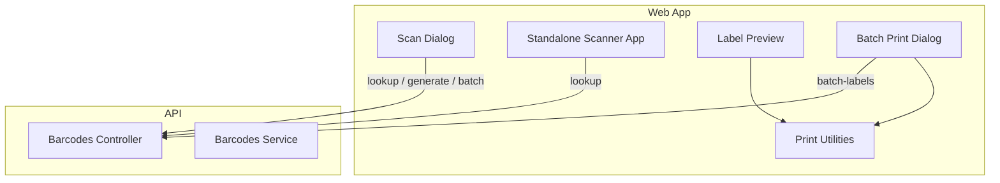
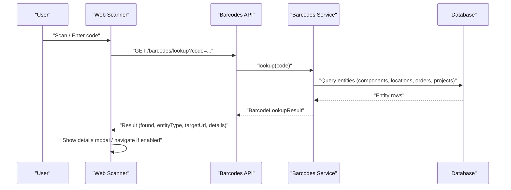
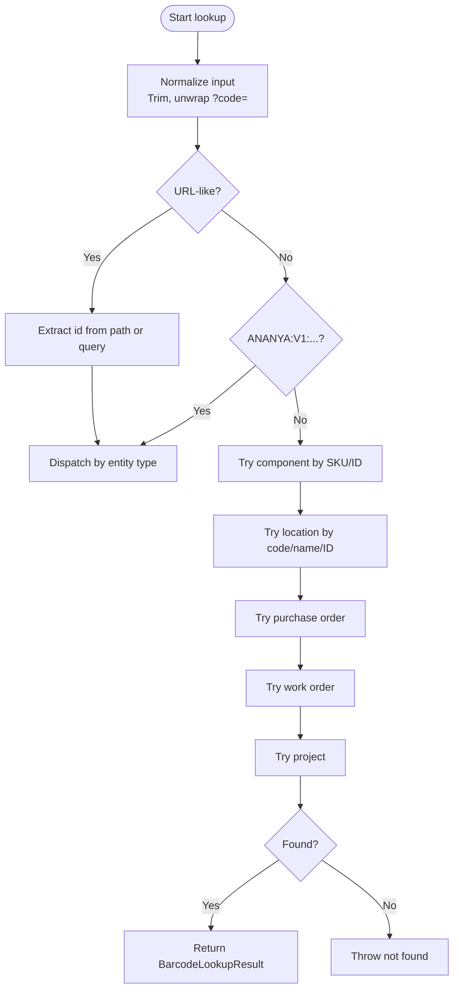
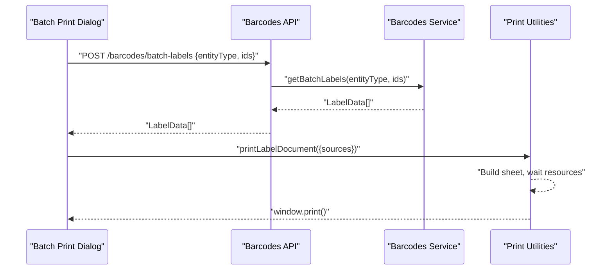
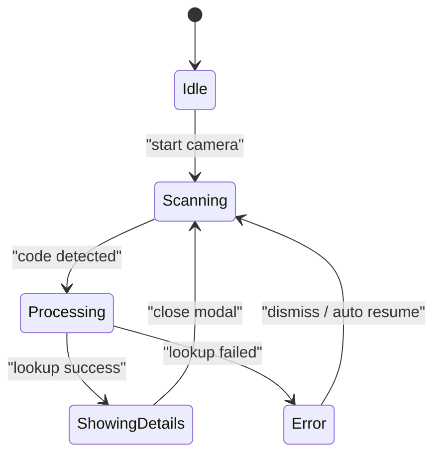
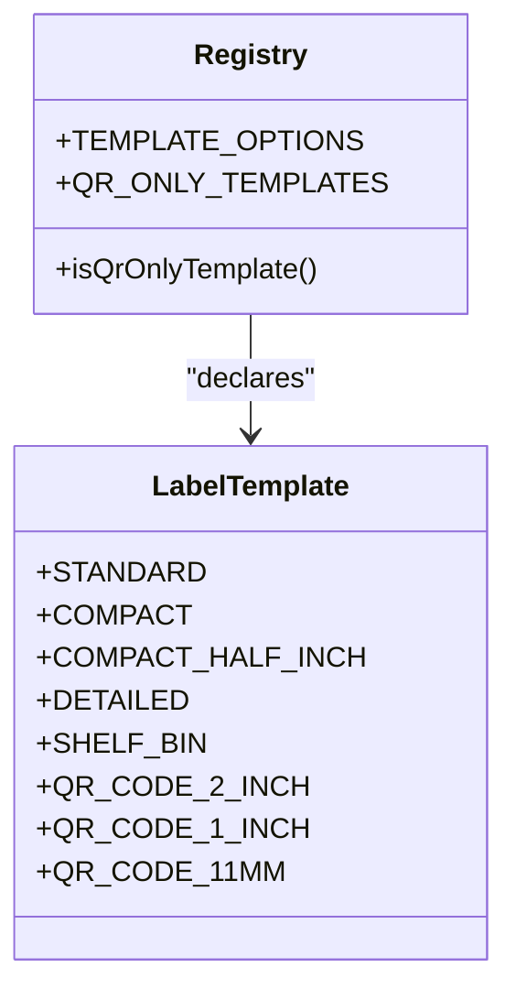
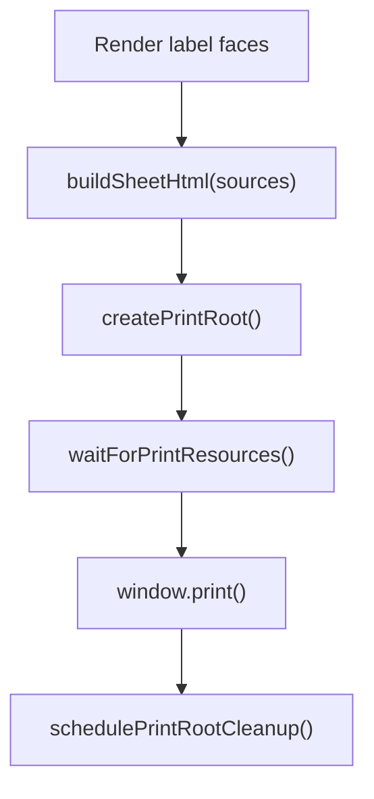
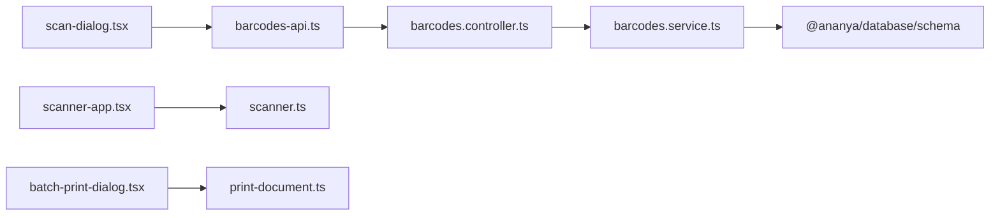

# Barcode Scanning & Label Management

<cite>
**Referenced Files in This Document**
- [barcodes.controller.ts](file://apps/api/src/barcodes/barcodes.controller.ts)
- [barcodes.service.ts](file://apps/api/src/barcodes/barcodes.service.ts)
- [barcodes-api.ts](file://apps/web/lib/api/barcodes-api.ts)
- [scan-dialog.tsx](file://apps/web/components/barcodes/scan-dialog.tsx)
- [scanner-app.tsx](file://apps/web/components/scanner/scanner-app.tsx)
- [scanner.ts](file://apps/web/lib/scanner.ts)
- [print-document.ts](file://apps/web/lib/print/print-document.ts)
- [templates/index.ts](file://apps/web/components/barcodes/templates/index.ts)
- [templates/registry.ts](file://apps/web/components/barcodes/templates/registry.ts)
- [standard-label.tsx](file://apps/web/components/barcodes/templates/standard-label.tsx)
- [batch-print-dialog.tsx](file://apps/web/components/barcodes/batch-print-dialog.tsx)
- [page.tsx](file://apps/web/app/barcodes/page.tsx)
- [SCANNER_APP.md](file://docs/SCANNER_APP.md)
</cite>

## Table of Contents
1. Introduction
2. Project Structure
3. Core Components
4. Architecture Overview
5. Detailed Component Analysis
6. Dependency Analysis
7. Performance Considerations
8. Troubleshooting Guide
9. Conclusion
10. Appendices

## Introduction
This document explains how Ananya ERP integrates barcode scanning and label management across the web application and API. It covers supported formats, label templates, printing capabilities, configuration for scanners and printers, and end-to-end workflows such as receiving, picking, and inventory adjustments. It also documents mobile scanning support, error handling for unreadable codes, duplicate detection, and data validation during scanning operations.

## Project Structure
The feature spans a NestJS API and a Next.js web app:
- API exposes endpoints to generate labels, batch-generate labels, and resolve scanned codes into ERP entities.
- Web provides:
  - A quick scan dialog with live camera scanning, manual entry, and image upload decoding.
  - A standalone scanner surface optimized for mobile (installable on iOS).
  - Label preview and print utilities that build printable sheets from rendered label faces.
  - A registry of label templates and multiple template implementations.

**Diagram sources**
- [scan-dialog.tsx:171-226](file://apps/web/components/barcodes/scan-dialog.tsx#L171-L226)
- [scanner-app.tsx:42-80](file://apps/web/components/scanner/scanner-app.tsx#L42-L80)
- [barcodes.controller.ts:48-68](file://apps/api/src/barcodes/barcodes.controller.ts#L48-L68)
- [barcodes.service.ts:54-149](file://apps/api/src/barcodes/barcodes.service.ts#L54-L149)
- [print-document.ts:312-335](file://apps/web/lib/print/print-document.ts#L312-L335)

**Section sources**
- [barcodes.controller.ts:48-68](file://apps/api/src/barcodes/barcodes.controller.ts#L48-L68)
- [barcodes.service.ts:54-149](file://apps/api/src/barcodes/barcodes.service.ts#L54-L149)
- [scan-dialog.tsx:171-226](file://apps/web/components/barcodes/scan-dialog.tsx#L171-L226)
- [scanner-app.tsx:42-80](file://apps/web/components/scanner/scanner-app.tsx#L42-L80)
- [print-document.ts:312-335](file://apps/web/lib/print/print-document.ts#L312-L335)

## Core Components
- Barcodes API
  - Lookup: resolves any scanned value (QR payload, URL with code param, SKU, location code, PO number, production number, project number) into an ERP entity.
  - Generate: builds a label payload for a specific entity type and ID.
  - Batch labels: generates label payloads for multiple IDs.
- Web Scan Interfaces
  - Quick scan dialog supports live camera scanning, manual entry, and image upload decoding.
  - Standalone scanner app is a full-screen, installable PWA experience for mobile.
- Label Templates and Printing
  - Template registry defines available templates and QR-only rules.
  - Print utilities create a dedicated off-screen print root, serialize label faces, and invoke the browser print dialog with safe margins and no page splits.

Supported barcode formats
- 1D barcodes: Code 128, Code 39, EAN-13, UPC-A.
- QR codes: Any QR payload; Ananya uses a structured format ANANYA:V1:<TYPE>:<ID>.

Supported entity types for labels and lookups
- COMPONENT, LOCATION, WORK_ORDER, PURCHASE_ORDER, PROJECT.

**Section sources**
- [barcodes.controller.ts:15-68](file://apps/api/src/barcodes/barcodes.controller.ts#L15-L68)
- [barcodes.service.ts:13-47](file://apps/api/src/barcodes/barcodes.service.ts#L13-L47)
- [barcodes-api.ts:1-85](file://apps/web/lib/api/barcodes-api.ts#L1-L85)
- [templates/registry.ts:12-64](file://apps/web/components/barcodes/templates/registry.ts#L12-L64)
- [standard-label.tsx:14-22](file://apps/web/components/barcodes/templates/standard-label.tsx#L14-L22)

## Architecture Overview
Scanning flows through a consistent path:
- The web layer decodes or accepts input, then calls the API lookup.
- The service resolves the code against multiple entity stores and returns a unified result including target URL and details.
- For label generation, the same service composes label payloads used by preview and print utilities.

**Diagram sources**
- [scan-dialog.tsx:171-226](file://apps/web/components/barcodes/scan-dialog.tsx#L171-L226)
- [barcodes.controller.ts:52-55](file://apps/api/src/barcodes/barcodes.controller.ts#L52-L55)
- [barcodes.service.ts:54-149](file://apps/api/src/barcodes/barcodes.service.ts#L54-L149)

## Detailed Component Analysis

### Barcode Lookup and Resolution
- Input normalization and URL unwrapping are handled both in the web client and server to support deep links and phone-camera-captured URLs.
- The service tries multiple strategies:
  - Structured QR payload ANANYA:V1:<TYPE>:<ID>
  - Direct resource URLs like /components/:id
  - Fallback lookups by SKU, location code/name, PO number, production number, project number
- Returns a unified result with entityType, entityId, primaryCode, qrPayload, title, subtitle, targetUrl, and details.

**Diagram sources**
- [barcodes.service.ts:54-149](file://apps/api/src/barcodes/barcodes.service.ts#L54-L149)

**Section sources**
- [barcodes.service.ts:54-149](file://apps/api/src/barcodes/barcodes.service.ts#L54-L149)
- [barcodes-api.ts:45-65](file://apps/web/lib/api/barcodes-api.ts#L45-L65)

### Label Generation and Batch Printing
- Single label generation: POST /barcodes/generate with entityType and entityId returns a LabelData object suitable for rendering.
- Batch label generation: POST /barcodes/batch-labels accepts an array of ids and returns LabelData[] for queueing prints.
- The web UI renders label faces using templates and sends them to the print utility which serializes them into a dedicated print root and triggers window.print().

**Diagram sources**
- [barcodes.controller.ts:65-68](file://apps/api/src/barcodes/barcodes.controller.ts#L65-L68)
- [barcodes.service.ts:405-468](file://apps/api/src/barcodes/barcodes.service.ts#L405-L468)
- [print-document.ts:312-335](file://apps/web/lib/print/print-document.ts#L312-L335)

**Section sources**
- [barcodes.controller.ts:57-68](file://apps/api/src/barcodes/barcodes.controller.ts#L57-L68)
- [barcodes.service.ts:405-468](file://apps/api/src/barcodes/barcodes.service.ts#L405-L468)
- [print-document.ts:312-335](file://apps/web/lib/print/print-document.ts#L312-L335)

### Mobile Scanner Surface
- Standalone scanner at /scan is installable on iPhone Home Screen and runs in a full-screen mode without ERP shell chrome.
- Uses native BarcodeDetector when available, falls back to jsQR with center crop and full-frame passes.
- Implements duplicate detection and suppression to avoid repeated lookups while a code remains in view.
- Displays friendly errors and resumes scanning automatically.

**Diagram sources**
- [scanner-app.tsx:33-40](file://apps/web/components/scanner/scanner-app.tsx#L33-L40)
- [scanner.ts:23-38](file://apps/web/lib/scanner.ts#L23-L38)

**Section sources**
- [scanner-app.tsx:42-80](file://apps/web/components/scanner/scanner-app.tsx#L42-L80)
- [scanner.ts:64-158](file://apps/web/lib/scanner.ts#L64-L158)
- [SCANNER_APP.md:1-65](file://docs/SCANNER_APP.md#L1-L65)

### Label Templates and Customization
- Template registry centralizes available templates and QR-only classification.
- Standard label includes title, subtitle, primary code, QR, and a 1D barcode; other templates focus on QR or compact sizes.
- Physical dimensions are declared per template and enforced by tests to match picker labels.

**Diagram sources**
- [templates/registry.ts:12-64](file://apps/web/components/barcodes/templates/registry.ts#L12-L64)

**Section sources**
- [templates/index.ts:1-41](file://apps/web/components/barcodes/templates/index.ts#L1-L41)
- [templates/registry.ts:12-64](file://apps/web/components/barcodes/templates/registry.ts#L12-L64)
- [standard-label.tsx:14-22](file://apps/web/components/barcodes/templates/standard-label.tsx#L14-L22)

### Printing Pipeline
- Labels are printed by building a dedicated off-screen print root containing serialized label faces.
- A stylesheet sets @page margin and ensures labels do not split across pages.
- Resources (fonts, images) are awaited before invoking window.print(), and cleanup occurs after printing.

**Diagram sources**
- [print-document.ts:172-185](file://apps/web/lib/print/print-document.ts#L172-L185)
- [print-document.ts:216-227](file://apps/web/lib/print/print-document.ts#L216-L227)
- [print-document.ts:240-270](file://apps/web/lib/print/print-document.ts#L240-L270)
- [print-document.ts:312-335](file://apps/web/lib/print/print-document.ts#L312-L335)

**Section sources**
- [print-document.ts:104-166](file://apps/web/lib/print/print-document.ts#L104-L166)
- [print-document.ts:312-335](file://apps/web/lib/print/print-document.ts#L312-L335)

## Dependency Analysis
- Web components depend on the barcodes API client for lookup, generate, and batch operations.
- The API controller depends on the service for business logic and database queries.
- The service depends on database schema modules for components, locations, purchase orders, production orders, and projects.
- Printing utilities are independent of the rest of the app once label faces are provided.

**Diagram sources**
- [scan-dialog.tsx:171-226](file://apps/web/components/barcodes/scan-dialog.tsx#L171-L226)
- [scanner-app.tsx:42-80](file://apps/web/components/scanner/scanner-app.tsx#L42-L80)
- [barcodes.controller.ts:48-68](file://apps/api/src/barcodes/barcodes.controller.ts#L48-L68)
- [barcodes.service.ts:1-11](file://apps/api/src/barcodes/barcodes.service.ts#L1-L11)
- [print-document.ts:312-335](file://apps/web/lib/print/print-document.ts#L312-L335)

**Section sources**
- [barcodes.controller.ts:48-68](file://apps/api/src/barcodes/barcodes.controller.ts#L48-L68)
- [barcodes.service.ts:1-11](file://apps/api/src/barcodes/barcodes.service.ts#L1-L11)
- [barcodes-api.ts:45-85](file://apps/web/lib/api/barcodes-api.ts#L45-L85)

## Performance Considerations
- Scanning loop uses native BarcodeDetector when available and falls back to jsQR with center crop to reduce decode cost.
- Duplicate detection prevents repeated lookups for the same code within a short window and requires the frame to clear before rearming.
- Batch label generation processes each ID independently and continues on failure to maximize throughput.
- Printing waits for fonts and images to settle and avoids splitting labels across pages.

[No sources needed since this section provides general guidance]

## Troubleshooting Guide
Common issues and resolutions:
- Unreadable or invalid code
  - The scanner shows a friendly error and keeps scanning; ensure lighting and focus, try torch if available, or use manual entry/image upload.
- Not found
  - The API returns a not found for unknown codes; verify the code belongs to an entity or use the global search link offered by the UI.
- Session expired
  - Re-authenticate to continue scanning.
- Camera unavailable
  - Ensure HTTPS context on mobile devices; grant camera permission; retry opening the camera.

Error handling paths:
- Web scanner maps API errors to user-friendly messages and distinguishes network vs session vs not found cases.
- The quick scan dialog catches lookup errors and displays actionable messages.

**Section sources**
- [scanner.ts:196-249](file://apps/web/lib/scanner.ts#L196-L249)
- [scan-dialog.tsx:213-223](file://apps/web/components/barcodes/scan-dialog.tsx#L213-L223)
- [SCANNER_APP.md:33-65](file://docs/SCANNER_APP.md#L33-L65)

## Conclusion
Ananya ERP provides a robust, integrated barcode scanning and label management system. The API unifies lookup and label generation across multiple entity types, while the web offers flexible scanning experiences—from an in-app dialog to a dedicated mobile scanner—and reliable label printing with customizable templates. With strong error handling, duplicate detection, and performance-conscious design, teams can adopt scan-based workflows for receiving, picking, and inventory adjustments with confidence.

## Appendices

### Supported Formats and Entities Summary
- Formats: Code 128, Code 39, EAN-13, UPC-A, QR.
- Entities: COMPONENT, LOCATION, WORK_ORDER, PURCHASE_ORDER, PROJECT.

**Section sources**
- [barcodes-api.ts:1-85](file://apps/web/lib/api/barcodes-api.ts#L1-L85)
- [barcodes.service.ts:13-47](file://apps/api/src/barcodes/barcodes.service.ts#L13-L47)

### Implementing Scan-Based Workflows

#### Receiving (Goods Receipt)
- Use the quick scan dialog to scan PO numbers or QR labels attached to incoming goods.
- On successful lookup, open the PO details and proceed with receipt steps.
- Optionally enable auto-navigate to jump directly to the PO page.

**Section sources**
- [scan-dialog.tsx:171-226](file://apps/web/components/barcodes/scan-dialog.tsx#L171-L226)
- [barcodes.service.ts:272-307](file://apps/api/src/barcodes/barcodes.service.ts#L272-L307)

#### Picking
- Scan location or bin labels to confirm pick zone.
- Scan component SKUs or QR labels to validate items being picked.
- Use the details modal to review stock and move forward with fulfillment.

**Section sources**
- [barcodes.service.ts:151-270](file://apps/api/src/barcodes/barcodes.service.ts#L151-L270)
- [scan-dialog.tsx:171-226](file://apps/web/components/barcodes/scan-dialog.tsx#L171-L226)

#### Inventory Adjustment
- Scan component or location labels to quickly locate records for adjustment.
- Use the details modal to access stock information and perform counts or adjustments.

**Section sources**
- [barcodes.service.ts:151-270](file://apps/api/src/barcodes/barcodes.service.ts#L151-L270)
- [scan-dialog.tsx:171-226](file://apps/web/components/barcodes/scan-dialog.tsx#L171-L226)

### Configuration Notes
- Mobile scanner requires HTTPS; install via “Add to Home Screen” on iOS for a full-screen experience.
- Torch control appears only on devices that expose it; otherwise, rely on ambient light or manual entry.
- Printer setup relies on the OS print dialog; ensure correct paper size and margins for label stock.

**Section sources**
- [SCANNER_APP.md:15-47](file://docs/SCANNER_APP.md#L15-L47)
- [print-document.ts:65-77](file://apps/web/lib/print/print-document.ts#L65-L77)