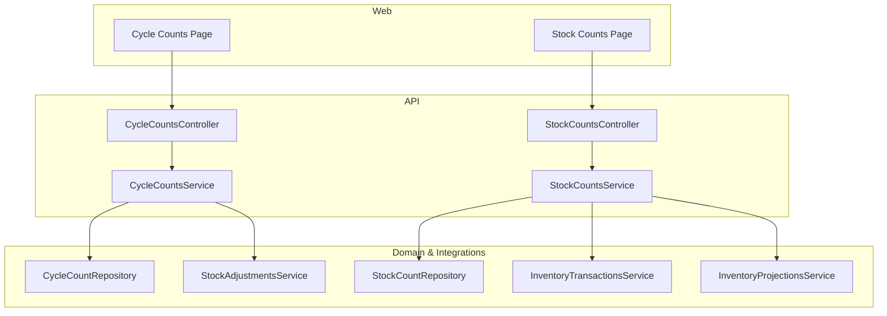
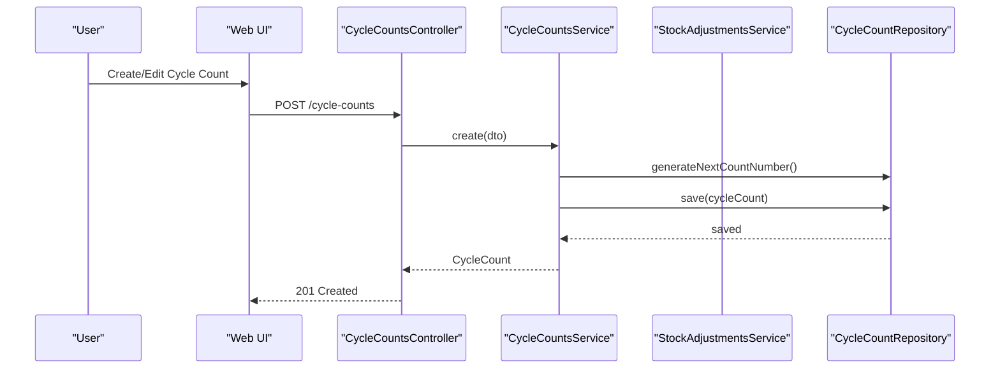
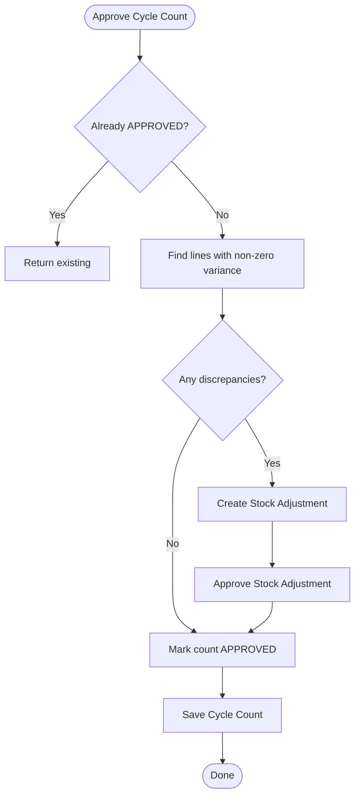
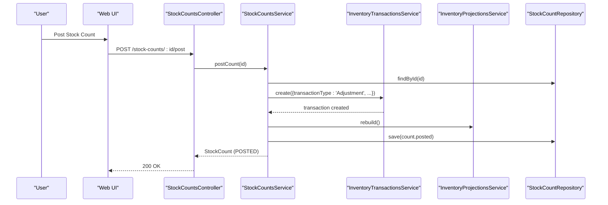
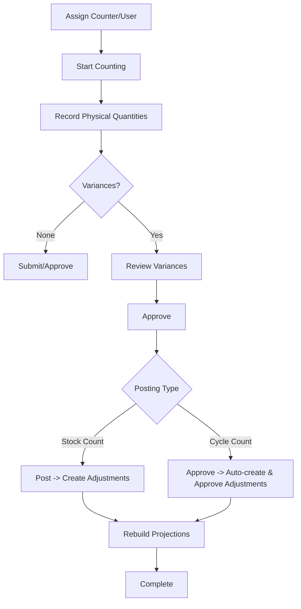
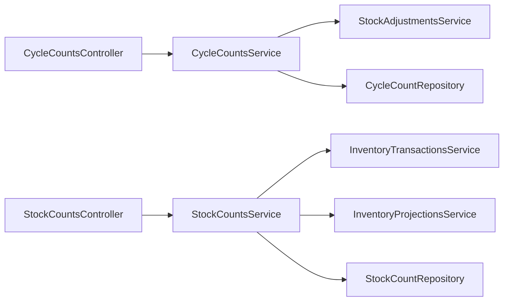

# Cycle Counting & Stock Audits

<cite>
**Referenced Files in This Document**
- [0023-cycle-counting.md](file://docs/rfcs/0023-cycle-counting.md)
- [0022-stock-counts.md](file://docs/rfcs/0022-stock-counts.md)
- [cycle-counts.controller.ts](file://apps/api/src/cycle-counts/cycle-counts.controller.ts)
- [cycle-counts.service.ts](file://apps/api/src/cycle-counts/cycle-counts.service.ts)
- [cycle-counts.dtos.ts](file://apps/api/src/cycle-counts/dtos.ts)
- [stock-counts.controller.ts](file://apps/api/src/stock-counts/stock-counts.controller.ts)
- [stock-counts.service.ts](file://apps/api/src/stock-counts/stock-counts.service.ts)
- [stock-counts.dtos.ts](file://apps/api/src/stock-counts/dtos.ts)
- [cycle-counts-page.tsx](file://apps/web/app/cycle-counts/page.tsx)
- [stock-counts-page.tsx](file://apps/web/app/stock-counts/page.tsx)
</cite>

## Table of Contents
1. [Introduction](#introduction)
2. [Project Structure](#project-structure)
3. [Core Components](#core-components)
4. [Architecture Overview](#architecture-overview)
5. [Detailed Component Analysis](#detailed-component-analysis)
6. [Dependency Analysis](#dependency-analysis)
7. [Performance Considerations](#performance-considerations)
8. [Troubleshooting Guide](#troubleshooting-guide)
9. [Conclusion](#conclusion)
10. [Appendices](#appendices)

## Introduction
This document explains cycle counting and stock audit functionality in Ananya ERP, focusing on how to plan, schedule, execute, and reconcile physical inventory counts. It clarifies the difference between cycle counts and stock counts, outlines workflows for count creation, scheduling, execution, variance handling, and integration with inventory adjustments. It also covers permissions, audit trails, and reporting capabilities exposed by the UI and APIs.

## Project Structure
The feature spans RFCs (design), API controllers/services (backend logic), and web pages (frontend). The key modules are:
- Cycle Counts API: create, update, assign, start counting, record counts, review variances, approve, cancel, delete
- Stock Counts API: create, assign user, add lines, submit, approve, post, cancel
- Web UI: dashboards and forms to initiate and manage counts

**Diagram sources**
- [cycle-counts.controller.ts:23-95](file://apps/api/src/cycle-counts/cycle-counts.controller.ts#L23-L95)
- [cycle-counts.service.ts:31-209](file://apps/api/src/cycle-counts/cycle-counts.service.ts#L31-L209)
- [stock-counts.controller.ts:6-57](file://apps/api/src/stock-counts/stock-counts.controller.ts#L6-L57)
- [stock-counts.service.ts:18-122](file://apps/api/src/stock-counts/stock-counts.service.ts#L18-L122)

**Section sources**
- [cycle-counts.controller.ts:23-95](file://apps/api/src/cycle-counts/cycle-counts.controller.ts#L23-L95)
- [stock-counts.controller.ts:6-57](file://apps/api/src/stock-counts/stock-counts.controller.ts#L6-L57)

## Core Components
- Cycle Counts: Periodic or ad-hoc physical verification at a location with assigned counters, line-level recording, variance review, and approval that can trigger stock adjustments.
- Stock Counts: Physical audit documents with lifecycle states from draft through posted, generating inventory adjustment transactions upon posting.

Key responsibilities:
- Create/update count scope and lines
- Assign counters/users
- Start counting and record physical quantities
- Review variances and approve
- Post adjustments and rebuild projections

**Section sources**
- [cycle-counts.service.ts:39-209](file://apps/api/src/cycle-counts/cycle-counts.service.ts#L39-L209)
- [stock-counts.service.ts:27-122](file://apps/api/src/stock-counts/stock-counts.service.ts#L27-L122)

## Architecture Overview
High-level flow:
- Users interact via web pages to create and manage counts.
- Controllers route requests to services.
- Services enforce domain rules, persist via repositories, and integrate with inventory services to adjust stock and rebuild projections.

**Diagram sources**
- [cycle-counts.controller.ts:28-31](file://apps/api/src/cycle-counts/cycle-counts.controller.ts#L28-L31)
- [cycle-counts.service.ts:39-55](file://apps/api/src/cycle-counts/cycle-counts.service.ts#L39-L55)

**Section sources**
- [cycle-counts.controller.ts:23-95](file://apps/api/src/cycle-counts/cycle-counts.controller.ts#L23-L95)
- [cycle-counts.service.ts:31-209](file://apps/api/src/cycle-counts/cycle-counts.service.ts#L31-L209)

## Detailed Component Analysis

### Cycle Counts
Purpose:
- Plan and run periodic or scheduled counts at locations.
- Record physical quantities per line, compute variances, and reconcile via stock adjustments upon approval.

Key endpoints:
- Create, Update, List, Get, Assign Counter, Start Counting, Record Physical Counts, Review Variances, Approve, Cancel, Delete

Lifecycle highlights:
- Draft -> Assigned -> Counting -> Review (variance) -> Approved (reconciled) -> Cancelled
- On approval with discrepancies, a stock adjustment is created and approved to post immutable inventory transactions.

Variance processing:
- Discrepancy summary includes matching, shortage, surplus items and total quantity difference.
- Non-zero variance lines drive stock adjustment creation and approval.

Permissions and safety:
- Editing allowed only in DRAFT status.
- Deletion allowed only for DRAFT.

**Diagram sources**
- [cycle-counts.service.ts:156-193](file://apps/api/src/cycle-counts/cycle-counts.service.ts#L156-L193)

**Section sources**
- [cycle-counts.controller.ts:23-95](file://apps/api/src/cycle-counts/cycle-counts.controller.ts#L23-L95)
- [cycle-counts.service.ts:39-209](file://apps/api/src/cycle-counts/cycle-counts.service.ts#L39-L209)
- [cycle-counts.dtos.ts:12-119](file://apps/api/src/cycle-counts/dtos.ts#L12-L119)

### Stock Counts
Purpose:
- Execute physical audits with a clear lifecycle and direct posting of inventory adjustments.

Key endpoints:
- Create, Assign User, Add Line, Submit, Approve, Post, Cancel

Lifecycle highlights:
- Draft -> Assigned -> Counting -> Submitted -> Approved -> Posted -> Cancelled
- Posting requires APPROVED status; creates Inventory Adjustment Transactions for each line with non-zero variance and rebuilds projections.

**Diagram sources**
- [stock-counts.controller.ts:48-51](file://apps/api/src/stock-counts/stock-counts.controller.ts#L48-L51)
- [stock-counts.service.ts:82-114](file://apps/api/src/stock-counts/stock-counts.service.ts#L82-L114)

**Section sources**
- [stock-counts.controller.ts:6-57](file://apps/api/src/stock-counts/stock-counts.controller.ts#L6-L57)
- [stock-counts.service.ts:18-122](file://apps/api/src/stock-counts/stock-counts.service.ts#L18-L122)
- [stock-counts.dtos.ts:9-46](file://apps/api/src/stock-counts/dtos.ts#L9-L46)

### Count Plan Creation and Scheduling
- Cycle counts support creating schedules with frequency and selection rules at design time (RFC).
- At runtime, cycle counts can be created with a scheduled date and executed manually or by automation to generate count documents.

Practical steps:
- Define warehouse/location, frequency, and bin selection criteria per RFC.
- Create a cycle count with a scheduled date and target lines.
- Trigger execution to generate a count document when due.

**Section sources**
- [0023-cycle-counting.md:17-23](file://docs/rfcs/0023-cycle-counting.md#L17-L23)
- [0023-cycle-counting.md:129-155](file://docs/rfcs/0023-cycle-counting.md#L129-L155)
- [cycle-counts.controller.ts:28-31](file://apps/api/src/cycle-counts/cycle-counts.controller.ts#L28-L31)
- [cycle-counts.service.ts:39-55](file://apps/api/src/cycle-counts/cycle-counts.service.ts#L39-L55)

### Count Execution Workflow
- Assign a counter/user to the count.
- Start counting to allow entry of physical quantities.
- Record physical counts per line.
- Review variances and approve.
- For stock counts, post to create inventory adjustments; for cycle counts, approval triggers stock adjustments automatically if discrepancies exist.

**Diagram sources**
- [cycle-counts.service.ts:105-193](file://apps/api/src/cycle-counts/cycle-counts.service.ts#L105-L193)
- [stock-counts.service.ts:54-114](file://apps/api/src/stock-counts/stock-counts.service.ts#L54-L114)

**Section sources**
- [cycle-counts.controller.ts:63-89](file://apps/api/src/cycle-counts/cycle-counts.controller.ts#L63-L89)
- [stock-counts.controller.ts:28-51](file://apps/api/src/stock-counts/stock-counts.controller.ts#L28-L51)

### Count Item Selection Criteria
- Cycle counts can use zone-based, ABC velocity-based, or high-value component rules to select bins/items for counting (RFC).
- In practice, lines are added to the count with system quantities and optional counted quantities.

**Section sources**
- [0023-cycle-counting.md:17-23](file://docs/rfcs/0023-cycle-counting.md#L17-L23)
- [cycle-counts.dtos.ts:12-33](file://apps/api/src/cycle-counts/dtos.ts#L12-L33)

### Variance Handling and Reconciliation
- Variance equals counted minus expected/system quantity.
- Cycle counts: approval with discrepancies auto-creates and approves a stock adjustment to reconcile.
- Stock counts: posting creates inventory adjustment transactions for each line with non-zero variance and rebuilds projections.

**Section sources**
- [0022-stock-counts.md:21-23](file://docs/rfcs/0022-stock-counts.md#L21-L23)
- [cycle-counts.service.ts:129-193](file://apps/api/src/cycle-counts/cycle-counts.service.ts#L129-L193)
- [stock-counts.service.ts:82-114](file://apps/api/src/stock-counts/stock-counts.service.ts#L82-L114)

### Permissions, Audit Trails, and Integration
- Permissions:
  - Edit/delete operations are guarded by status checks (e.g., only DRAFT can be edited/deleted).
- Audit trails:
  - Count numbers are generated uniquely.
  - Approval actions capture approver identifiers.
  - Stock adjustments reference the originating count number for traceability.
- Integration:
  - Stock counts post directly to inventory transactions and rebuild projections.
  - Cycle counts reconcile via stock adjustments which then post immutable inventory transactions.

**Section sources**
- [cycle-counts.service.ts:57-80](file://apps/api/src/cycle-counts/cycle-counts.service.ts#L57-L80)
- [cycle-counts.service.ts:156-193](file://apps/api/src/cycle-counts/cycle-counts.service.ts#L156-L193)
- [stock-counts.service.ts:82-114](file://apps/api/src/stock-counts/stock-counts.service.ts#L82-L114)

### Reporting Capabilities
- Cycle Counts page shows KPIs: total counts, active floor counting, under variance review, and approved/reconciled counts.
- Stock Counts page shows totals, active audits, and reconciled audits, plus variance indicators per count.

**Section sources**
- [cycle-counts-page.tsx:87-101](file://apps/web/app/cycle-counts/page.tsx#L87-L101)
- [cycle-counts-page.tsx:306-332](file://apps/web/app/cycle-counts/page.tsx#L306-L332)
- [stock-counts-page.tsx:95-108](file://apps/web/app/stock-counts/page.tsx#L95-L108)
- [stock-counts-page.tsx:251-267](file://apps/web/app/stock-counts/page.tsx#L251-L267)

## Dependency Analysis
- Controllers depend on services for business logic.
- Services depend on repositories and cross-cutting services:
  - CycleCountsService depends on StockAdjustmentsService for reconciliation.
  - StockCountsService depends on InventoryTransactionsService and InventoryProjectionsService for posting and projection updates.

**Diagram sources**
- [cycle-counts.controller.ts:23-95](file://apps/api/src/cycle-counts/cycle-counts.controller.ts#L23-L95)
- [cycle-counts.service.ts:31-209](file://apps/api/src/cycle-counts/cycle-counts.service.ts#L31-L209)
- [stock-counts.controller.ts:6-57](file://apps/api/src/stock-counts/stock-counts.controller.ts#L6-L57)
- [stock-counts.service.ts:18-122](file://apps/api/src/stock-counts/stock-counts.service.ts#L18-L122)

**Section sources**
- [cycle-counts.service.ts:31-209](file://apps/api/src/cycle-counts/cycle-counts.service.ts#L31-L209)
- [stock-counts.service.ts:18-122](file://apps/api/src/stock-counts/stock-counts.service.ts#L18-L122)

## Performance Considerations
- Batch recording of physical counts reduces API calls.
- Avoid frequent projection rebuilds; perform once after posting.
- Use filters and search on lists to minimize payload sizes.
- Keep count scopes focused (zone-based or ABC rules) to limit line counts.

[No sources needed since this section provides general guidance]

## Troubleshooting Guide
Common issues and resolutions:
- Cannot edit or delete a count: Ensure the count is in DRAFT status before editing/deleting.
- Posting fails: Verify the count is APPROVED before posting.
- No adjustments created: Confirm there are lines with non-zero variance; otherwise no adjustments are generated.
- UI errors: Check network responses and ensure required fields are provided in DTOs.

Operational checks:
- Validate status transitions via controller endpoints.
- Inspect discrepancy summaries to understand shortages/surpluses.

**Section sources**
- [cycle-counts.service.ts:57-80](file://apps/api/src/cycle-counts/cycle-counts.service.ts#L57-L80)
- [cycle-counts.service.ts:202-209](file://apps/api/src/cycle-counts/cycle-counts.service.ts#L202-L209)
- [stock-counts.service.ts:82-88](file://apps/api/src/stock-counts/stock-counts.service.ts#L82-L88)

## Conclusion
Ananya ERP’s cycle counting and stock audit features provide robust mechanisms to plan, schedule, execute, and reconcile physical inventory counts. Cycle counts enable recurring, targeted audits with automatic reconciliation via stock adjustments, while stock counts offer a straightforward path to post inventory adjustments and rebuild projections. Together, they ensure accurate inventory records with clear audit trails and actionable reporting.

[No sources needed since this section summarizes without analyzing specific files]

## Appendices

### Differences Between Cycle Counts and Stock Counts
- Cycle Counts:
  - Designed for recurring schedules and targeted bin/item selection.
  - Approval can automatically create and approve stock adjustments for discrepancies.
- Stock Counts:
  - Directly post inventory adjustments upon approval and rebuilding projections.

**Section sources**
- [0023-cycle-counting.md:11-23](file://docs/rfcs/0023-cycle-counting.md#L11-L23)
- [0022-stock-counts.md:11-23](file://docs/rfcs/0022-stock-counts.md#L11-L23)

### Example Workflows

- Setting up an automated cycle count plan:
  - Define frequency and selection rules per RFC.
  - Create a cycle count with a scheduled date and target lines.
  - Trigger execution to generate a count document on schedule.

- Conducting a physical count:
  - Assign a counter/user.
  - Start counting and record physical quantities per line.
  - Review variances and approve.

- Reconciling discrepancies:
  - For cycle counts, approval auto-creates and approves stock adjustments.
  - For stock counts, post to create adjustments and rebuild projections.

**Section sources**
- [0023-cycle-counting.md:129-155](file://docs/rfcs/0023-cycle-counting.md#L129-L155)
- [cycle-counts.service.ts:105-193](file://apps/api/src/cycle-counts/cycle-counts.service.ts#L105-L193)
- [stock-counts.service.ts:54-114](file://apps/api/src/stock-counts/stock-counts.service.ts#L54-L114)