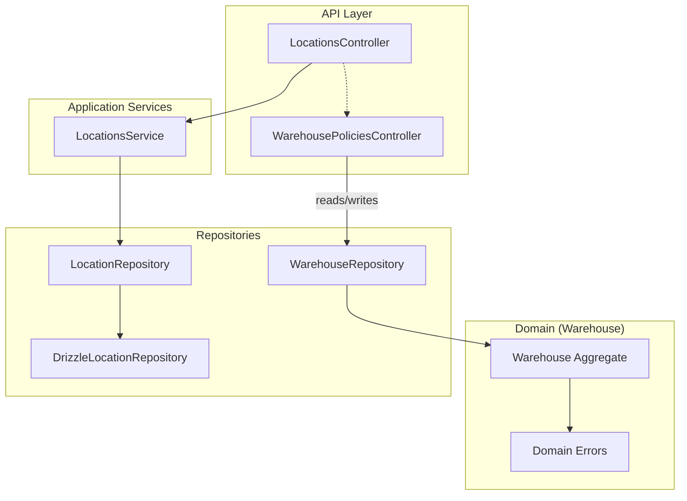
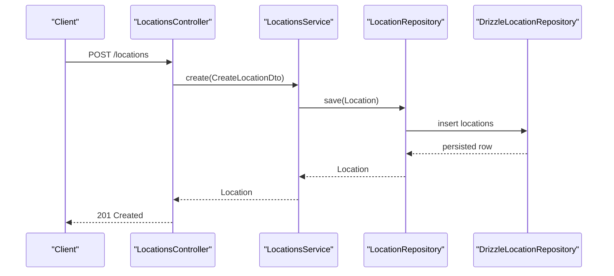
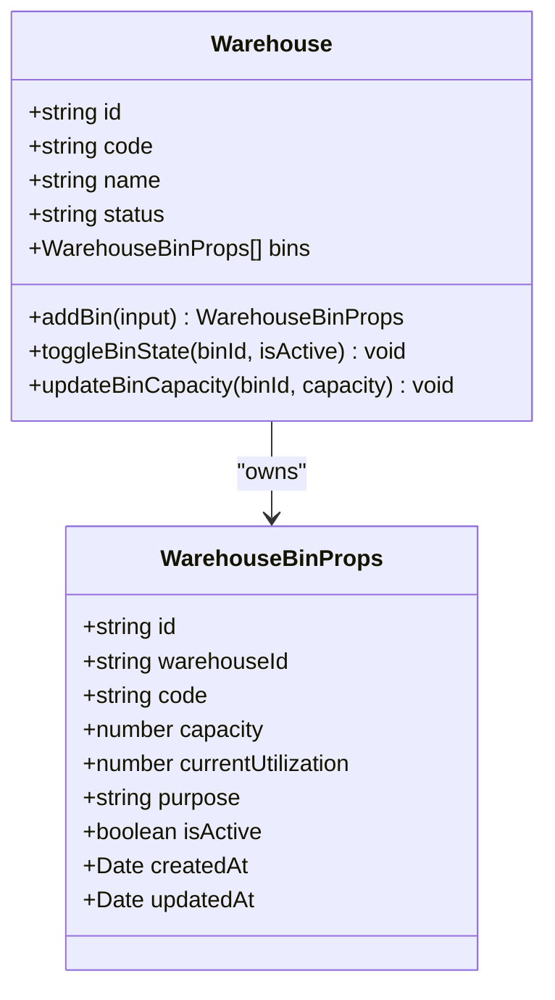
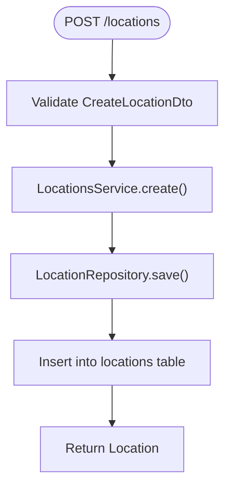
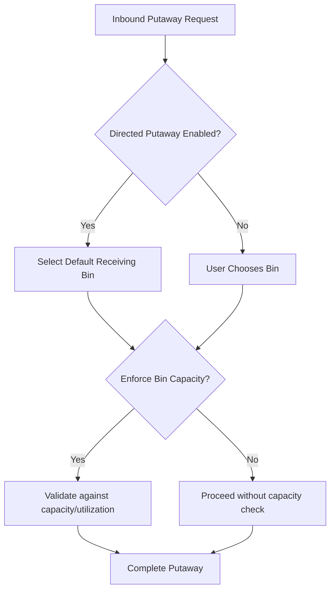
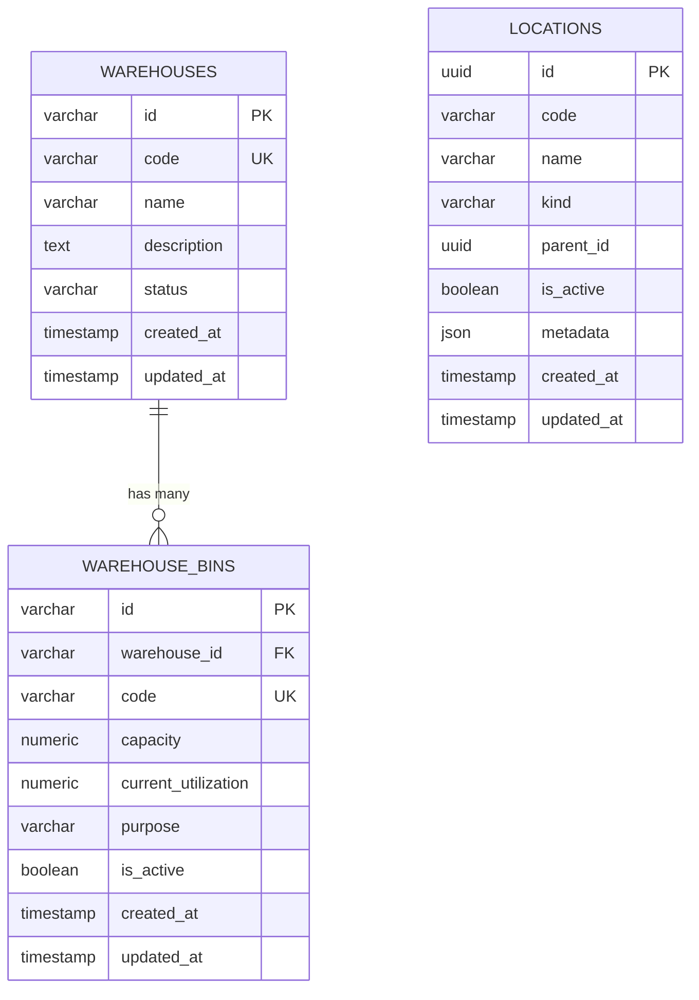
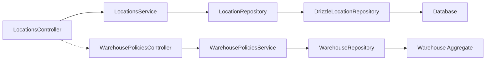

# Location & Bin Management

<cite>
**Referenced Files in This Document**
- [0021-warehouse-structure-and-bin-locations.md](file://docs/rfcs/0021-warehouse-structure-and-bin-locations.md)
- [locations.controller.ts](file://apps/api/src/locations/locations.controller.ts)
- [locations.service.ts](file://apps/api/src/locations/locations.service.ts)
- [create-location.dto.ts](file://apps/api/src/locations/create-location.dto.ts)
- [update-location.dto.ts](file://apps/api/src/locations/update-location.dto.ts)
- [location.repository.ts](file://packages/inventory/src/locations/location.repository.ts)
- [drizzle-location.repository.ts](file://apps/api/src/infrastructure/repositories/drizzle-location.repository.ts)
- [warehouse.ts](file://packages/warehouse/src/warehouses/warehouse.ts)
- [warehouse.errors.ts](file://packages/warehouse/src/warehouses/warehouse.errors.ts)
- [warehouse.repository.ts](file://packages/warehouse/src/warehouses/warehouse.repository.ts)
- [warehouse-policies.controller.ts](file://apps/api/src/warehouse-policies/warehouse-policies.controller.ts)
- [warehouse-policies.service.ts](file://apps/api/src/warehouse-policies/warehouse-policies.service.ts)
- [dtos.ts](file://apps/api/src/warehouse-policies/dtos.ts)
</cite>

## Table of Contents
1. [Introduction](#introduction)
2. [Project Structure](#project-structure)
3. [Core Components](#core-components)
4. [Architecture Overview](#architecture-overview)
5. [Detailed Component Analysis](#detailed-component-analysis)
6. [Dependency Analysis](#dependency-analysis)
7. [Performance Considerations](#performance-considerations)
8. [Troubleshooting Guide](#troubleshooting-guide)
9. [Conclusion](#conclusion)
10. [Appendices](#appendices)

## Introduction
This document explains how Ananya ERP models and manages locations and bins within the warehouse system. It covers the physical hierarchy from warehouses down to bins, location types and attributes, capacity tracking, stock allocation strategies, and operational workflows for creating and organizing locations and bins. It also addresses permissions, access controls, and integration with physical warehouse operations such as putaway, picking, transfers, and counts.

## Project Structure
The location and bin management spans multiple layers:
- API layer exposes endpoints for locations and policies.
- Application services orchestrate domain commands for locations.
- Domain models define warehouse aggregates and bin rules.
- Repositories persist data and enforce usage checks.
- Policies configure behavior like directed putaway/picking and default bins.

**Diagram sources**
- [locations.controller.ts:19-51](file://apps/api/src/locations/locations.controller.ts#L19-L51)
- [locations.service.ts:14-51](file://apps/api/src/locations/locations.service.ts#L14-L51)
- [location.repository.ts:5-13](file://packages/inventory/src/locations/location.repository.ts#L5-L13)
- [drizzle-location.repository.ts:53-150](file://apps/api/src/infrastructure/repositories/drizzle-location.repository.ts#L53-L150)
- [warehouse.ts:45-139](file://packages/warehouse/src/warehouses/warehouse.ts#L45-L139)
- [warehouse.errors.ts:1-22](file://packages/warehouse/src/warehouses/warehouse.errors.ts#L1-L22)
- [warehouse.repository.ts:3-9](file://packages/warehouse/src/warehouses/warehouse.repository.ts#L3-L9)
- [warehouse-policies.controller.ts:1-200](file://apps/api/src/warehouse-policies/warehouse-policies.controller.ts)

**Section sources**
- [locations.controller.ts:19-51](file://apps/api/src/locations/locations.controller.ts#L19-L51)
- [locations.service.ts:14-51](file://apps/api/src/locations/locations.service.ts#L14-L51)
- [location.repository.ts:5-13](file://packages/inventory/src/locations/location.repository.ts#L5-L13)
- [drizzle-location.repository.ts:53-150](file://apps/api/src/infrastructure/repositories/drizzle-location.repository.ts#L53-L150)
- [warehouse.ts:45-139](file://packages/warehouse/src/warehouses/warehouse.ts#L45-L139)
- [warehouse.errors.ts:1-22](file://packages/warehouse/src/warehouses/warehouse.errors.ts#L1-L22)
- [warehouse.repository.ts:3-9](file://packages/warehouse/src/warehouses/warehouse.repository.ts#L3-L9)

## Core Components
- Locations API: CRUD endpoints for inventory locations used by transactions and UIs.
- Warehouse aggregate: Defines bins, capacity, purpose, and lifecycle state.
- Policies: Configure enforcement of bin capacity, directed putaway/picking, and default bins per warehouse.
- Repositories: Persist and query locations and warehouses; check if a location is in use.

Key responsibilities:
- Create, update, delete locations with hierarchical relationships via parentId.
- Manage warehouse bins with capacity and utilization tracking.
- Enforce business rules through domain errors and repository checks.
- Provide policy-driven behavior for putaway and picking flows.

**Section sources**
- [locations.controller.ts:19-51](file://apps/api/src/locations/locations.controller.ts#L19-L51)
- [locations.service.ts:14-51](file://apps/api/src/locations/locations.service.ts#L14-L51)
- [create-location.dto.ts:9-32](file://apps/api/src/locations/create-location.dto.ts#L9-L32)
- [update-location.dto.ts:3-27](file://apps/api/src/locations/update-location.dto.ts#L3-L27)
- [warehouse.ts:45-139](file://packages/warehouse/src/warehouses/warehouse.ts#L45-L139)
- [warehouse.errors.ts:1-22](file://packages/warehouse/src/warehouses/warehouse.errors.ts#L1-L22)
- [warehouse.repository.ts:3-9](file://packages/warehouse/src/warehouses/warehouse.repository.ts#L3-L9)

## Architecture Overview
The system separates concerns across API, application, domain, and infrastructure layers. The RFC defines the intended 6-level hierarchy (Warehouse → Zone → Aisle → Rack → Shelf → Bin), while the current implementation provides:
- Inventory locations with hierarchical structure via parentId and kind.
- Warehouse bins with capacity, utilization, purpose, and active status.
- Policy flags that influence automated putaway/picking and default bin selection.

**Diagram sources**
- [locations.controller.ts:24-31](file://apps/api/src/locations/locations.controller.ts#L24-L31)
- [locations.service.ts:29-31](file://apps/api/src/locations/locations.service.ts#L29-L31)
- [location.repository.ts:5-13](file://packages/inventory/src/locations/location.repository.ts#L5-L13)
- [drizzle-location.repository.ts:90-101](file://apps/api/src/infrastructure/repositories/drizzle-location.repository.ts#L90-L101)

## Detailed Component Analysis

### Warehouse Hierarchy and Bins
The warehouse aggregate models bins with capacity, utilization, purpose, and active state. It validates non-negative capacity and toggles states.

**Diagram sources**
- [warehouse.ts:45-139](file://packages/warehouse/src/warehouses/warehouse.ts#L45-L139)

Operational purposes include receiving, storage, production, shipping, and quality hold. Capacity enforcement and utilization tracking are central to safe putaway and picking.

**Section sources**
- [warehouse.ts:7-20](file://packages/warehouse/src/warehouses/warehouse.ts#L7-L20)
- [warehouse.ts:87-133](file://packages/warehouse/src/warehouses/warehouse.ts#L87-L133)
- [warehouse.errors.ts:10-22](file://packages/warehouse/src/warehouses/warehouse.errors.ts#L10-L22)

### Locations API and Service
The locations module exposes standard CRUD operations for inventory locations. Inputs are validated via DTOs, and service methods delegate to domain commands and repositories.

**Diagram sources**
- [locations.controller.ts:24-31](file://apps/api/src/locations/locations.controller.ts#L24-L31)
- [create-location.dto.ts:9-32](file://apps/api/src/locations/create-location.dto.ts#L9-L32)
- [locations.service.ts:29-31](file://apps/api/src/locations/locations.service.ts#L29-L31)
- [location.repository.ts:5-13](file://packages/inventory/src/locations/location.repository.ts#L5-L13)
- [drizzle-location.repository.ts:90-101](file://apps/api/src/infrastructure/repositories/drizzle-location.repository.ts#L90-L101)

Hierarchy modeling uses parentId to build trees (e.g., warehouse → zone → aisle → rack → shelf → bin). The repository supports querying by parent ID and listing all locations.

**Section sources**
- [locations.controller.ts:19-51](file://apps/api/src/locations/locations.controller.ts#L19-L51)
- [locations.service.ts:14-51](file://apps/api/src/locations/locations.service.ts#L14-L51)
- [create-location.dto.ts:9-32](file://apps/api/src/locations/create-location.dto.ts#L9-L32)
- [update-location.dto.ts:3-27](file://apps/api/src/locations/update-location.dto.ts#L3-L27)
- [location.repository.ts:5-13](file://packages/inventory/src/locations/location.repository.ts#L5-L13)
- [drizzle-location.repository.ts:74-88](file://apps/api/src/infrastructure/repositories/drizzle-location.repository.ts#L74-L88)

### Warehouse Policies and Allocation Strategies
Policies control whether bin capacity is enforced and whether putaway/picking are directed. They also allow setting default bins for receiving, production, and shipping. These settings influence automation in downstream processes.

**Diagram sources**
- [warehouse-policies.controller.ts:1-200](file://apps/api/src/warehouse-policies/warehouse-policies.controller.ts)
- [warehouse-policies.service.ts:1-200](file://apps/api/src/warehouse-policies/warehouse-policies.service.ts)
- [dtos.ts:1-200](file://apps/api/src/warehouse-policies/dtos.ts)

Note: The referenced files define policy configuration endpoints and services that govern directed operations and defaults.

**Section sources**
- [warehouse-policies.controller.ts:1-200](file://apps/api/src/warehouse-policies/warehouse-policies.controller.ts)
- [warehouse-policies.service.ts:1-200](file://apps/api/src/warehouse-policies/warehouse-policies.service.ts)
- [dtos.ts:1-200](file://apps/api/src/warehouse-policies/dtos.ts)

### Data Model and Schema Alignment
The warehouse schema includes tables for warehouses and bins with fields for capacity, utilization, purpose, and active status. Inventory locations are stored separately and linked to transactions and projections.

**Diagram sources**
- [0021-warehouse-structure-and-bin-locations.md:144-175](file://docs/rfcs/0021-warehouse-structure-and-bin-locations.md#L144-L175)

**Section sources**
- [0021-warehouse-structure-and-bin-locations.md:144-175](file://docs/rfcs/0021-warehouse-structure-and-bin-locations.md#L144-L175)

## Dependency Analysis
- API depends on application services for validation and orchestration.
- Services depend on repositories for persistence and queries.
- Domain models encapsulate business rules and state transitions.
- Infrastructure repositories implement SQL persistence and usage checks.

**Diagram sources**
- [locations.controller.ts:19-51](file://apps/api/src/locations/locations.controller.ts#L19-L51)
- [locations.service.ts:14-51](file://apps/api/src/locations/locations.service.ts#L14-L51)
- [location.repository.ts:5-13](file://packages/inventory/src/locations/location.repository.ts#L5-L13)
- [drizzle-location.repository.ts:53-150](file://apps/api/src/infrastructure/repositories/drizzle-location.repository.ts#L53-L150)
- [warehouse-policies.controller.ts:1-200](file://apps/api/src/warehouse-policies/warehouse-policies.controller.ts)
- [warehouse-policies.service.ts:1-200](file://apps/api/src/warehouse-policies/warehouse-policies.service.ts)
- [warehouse.repository.ts:3-9](file://packages/warehouse/src/warehouses/warehouse.repository.ts#L3-L9)
- [warehouse.ts:45-139](file://packages/warehouse/src/warehouses/warehouse.ts#L45-L139)

**Section sources**
- [locations.controller.ts:19-51](file://apps/api/src/locations/locations.controller.ts#L19-L51)
- [locations.service.ts:14-51](file://apps/api/src/locations/locations.service.ts#L14-L51)
- [location.repository.ts:5-13](file://packages/inventory/src/locations/location.repository.ts#L5-L13)
- [drizzle-location.repository.ts:53-150](file://apps/api/src/infrastructure/repositories/drizzle-location.repository.ts#L53-L150)
- [warehouse-policies.controller.ts:1-200](file://apps/api/src/warehouse-policies/warehouse-policies.controller.ts)
- [warehouse-policies.service.ts:1-200](file://apps/api/src/warehouse-policies/warehouse-policies.service.ts)
- [warehouse.repository.ts:3-9](file://packages/warehouse/src/warehouses/warehouse.repository.ts#L3-L9)
- [warehouse.ts:45-139](file://packages/warehouse/src/warehouses/warehouse.ts#L45-L139)

## Performance Considerations
- Use findByParentId to efficiently render hierarchical trees for large warehouses.
- Limit list queries with filters (e.g., by warehouse or kind) to reduce payload size.
- Avoid unnecessary updates to updatedAt timestamps unless attributes change.
- When enforcing bin capacity, pre-check available capacity before attempting writes to minimize retries.

[No sources needed since this section provides general guidance]

## Troubleshooting Guide
Common issues and resolutions:
- Location not found: Ensure the ID exists; service throws a specific error when missing.
- Invalid inputs: Validate DTO fields (code, name, kind, optional parentId/metadata).
- Bin disabled: Domain error indicates the bin cannot be used while inactive.
- Capacity exceeded: Validate capacity against current utilization; adjust bin capacity or move stock.
- Cannot delete location: Repository checks if the location is in use by goods receipts, projections, or transfers.

**Section sources**
- [locations.service.ts:45-51](file://apps/api/src/locations/locations.service.ts#L45-L51)
- [create-location.dto.ts:9-32](file://apps/api/src/locations/create-location.dto.ts#L9-L32)
- [update-location.dto.ts:3-27](file://apps/api/src/locations/update-location.dto.ts#L3-L27)
- [warehouse.errors.ts:10-22](file://packages/warehouse/src/warehouses/warehouse.errors.ts#L10-L22)
- [drizzle-location.repository.ts:125-150](file://apps/api/src/infrastructure/repositories/drizzle-location.repository.ts#L125-L150)

## Conclusion
Ananya’s location and bin management combines a flexible hierarchical location model with robust warehouse bin capabilities. The design supports capacity tracking, purpose-based workflows, and policy-driven automation for efficient storage and retrieval. By leveraging APIs, domain rules, and repository safeguards, teams can model complex warehouse layouts, manage bin capacities, and optimize storage efficiency while maintaining integrity and safety.

[No sources needed since this section summarizes without analyzing specific files]

## Appendices

### Creating Complex Warehouse Layouts
- Define top-level locations for each warehouse and set their kinds appropriately.
- Build nested hierarchies using parentId to represent zones, aisles, racks, shelves, and bins.
- Assign meaningful codes and names to improve scanning and navigation.
- Use policies to enable directed putaway/picking and set default bins for streamlined operations.

[No sources needed since this section provides general guidance]

### Managing Bin Capacities
- Set initial capacity when adding bins; ensure non-negative values.
- Monitor current utilization to avoid overflows; adjust capacity as needed.
- Disable bins temporarily during maintenance or reorganization.

**Section sources**
- [warehouse.ts:87-133](file://packages/warehouse/src/warehouses/warehouse.ts#L87-L133)
- [warehouse.errors.ts:10-22](file://packages/warehouse/src/warehouses/warehouse.errors.ts#L10-L22)

### Optimizing Storage Efficiency
- Use purpose tags to segregate receiving, production, shipping, and quality hold areas.
- Enable directed putaway/picking to automate optimal placement and retrieval.
- Regularly review utilization metrics and rebalance stock across bins.

**Section sources**
- [warehouse.ts:7-20](file://packages/warehouse/src/warehouses/warehouse.ts#L7-L20)
- [warehouse-policies.controller.ts:1-200](file://apps/api/src/warehouse-policies/warehouse-policies.controller.ts)
- [warehouse-policies.service.ts:1-200](file://apps/api/src/warehouse-policies/warehouse-policies.service.ts)

### Permissions and Access Controls
- Restrict creation and modification of locations and bins to authorized roles.
- Apply guards at controller level to enforce write permissions where applicable.
- Audit changes to critical warehouse structures and policies.

[No sources needed since this section provides general guidance]

### Integration with Physical Operations
- Link locations to inventory ledger entries for accurate stock tracking.
- Use transfers to move stock between source and destination locations safely.
- Integrate scans and handheld devices with location codes for fast operations.

**Section sources**
- [drizzle-location.repository.ts:125-150](file://apps/api/src/infrastructure/repositories/drizzle-location.repository.ts#L125-L150)
- [0021-warehouse-structure-and-bin-locations.md:134-139](file://docs/rfcs/0021-warehouse-structure-and-bin-locations.md#L134-L139)