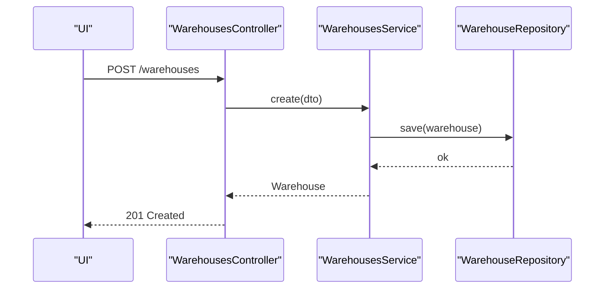
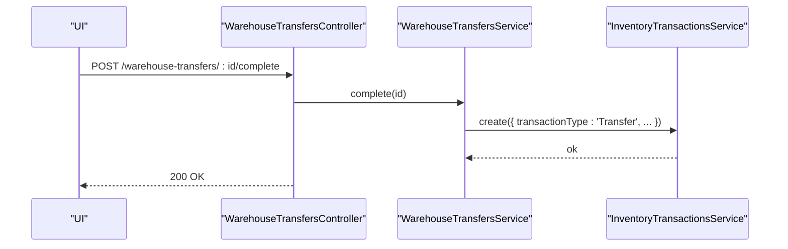
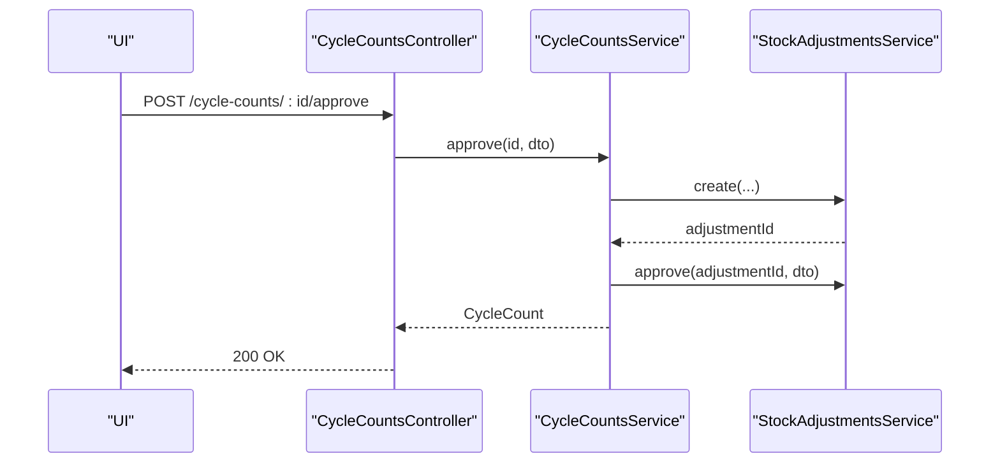
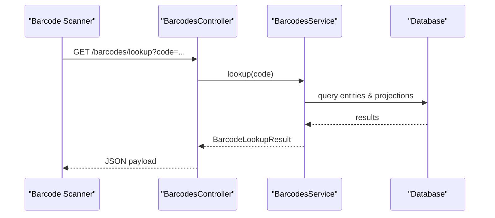
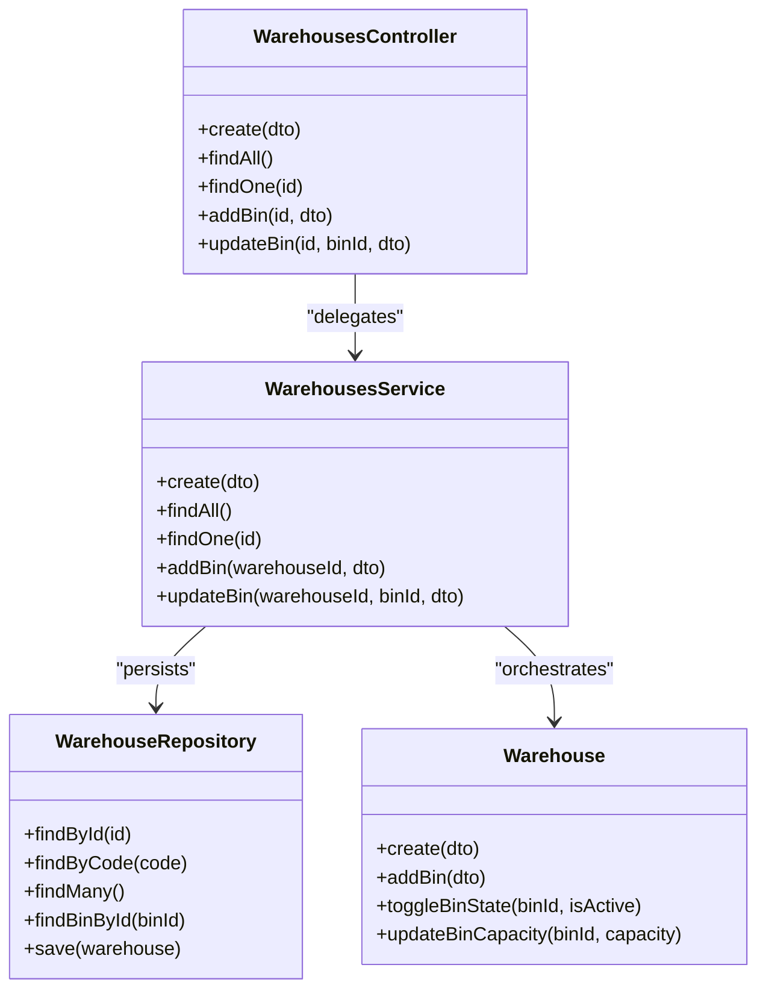
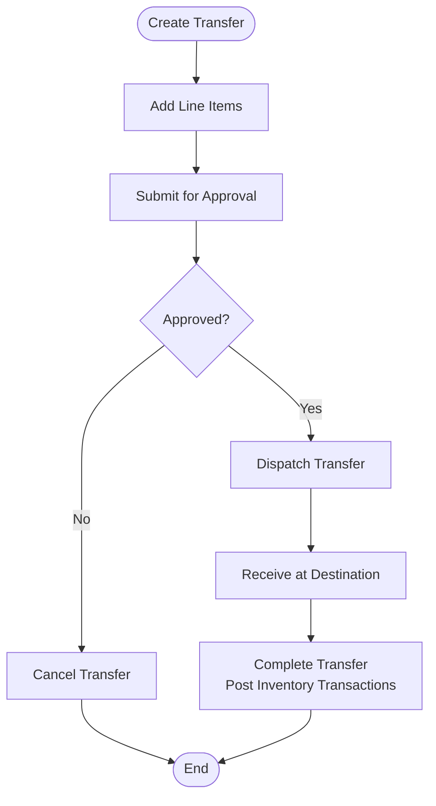
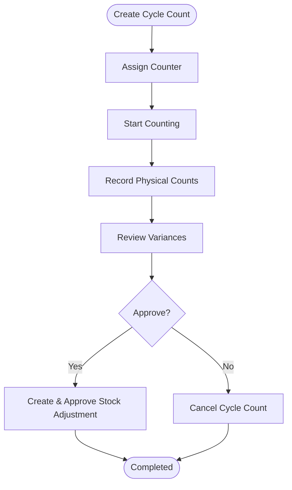
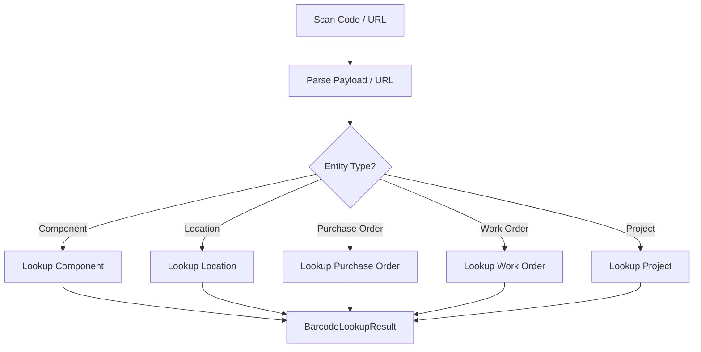
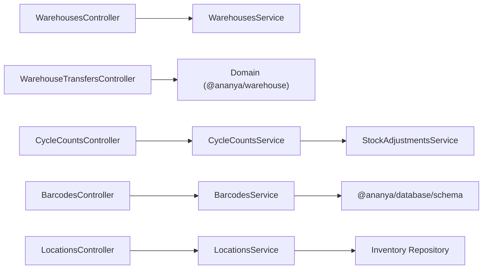

# Warehouse Management

<cite>
**Referenced Files in This Document**
- [0021-warehouse-structure-and-bin-locations.md](file://docs/rfcs/0021-warehouse-structure-and-bin-locations.md)
- [0024-warehouse-transfers.md](file://docs/rfcs/0024-warehouse-transfers.md)
- [0023-cycle-counting.md](file://docs/rfcs/0023-cycle-counting.md)
- [0025-warehouse-policies.md](file://docs/rfcs/0025-warehouse-policies.md)
- [warehouses.controller.ts](file://apps/api/src/warehouses/warehouses.controller.ts)
- [warehouses.service.ts](file://apps/api/src/warehouses/warehouses.service.ts)
- [locations.controller.ts](file://apps/api/src/locations/locations.controller.ts)
- [locations.service.ts](file://apps/api/src/locations/locations.service.ts)
- [warehouse-transfers.controller.ts](file://apps/api/src/warehouse-transfers/warehouse-transfers.controller.ts)
- [cycle-counts.controller.ts](file://apps/api/src/cycle-counts/cycle-counts.controller.ts)
- [cycle-counts.service.ts](file://apps/api/src/cycle-counts/cycle-counts.service.ts)
- [barcodes.controller.ts](file://apps/api/src/barcodes/barcodes.controller.ts)
- [barcodes.service.ts](file://apps/api/src/barcodes/barcodes.service.ts)
</cite>

## Table of Contents
1. [Introduction](#introduction)
2. [Project Structure](#project-structure)
3. [Core Components](#core-components)
4. [Architecture Overview](#architecture-overview)
5. [Detailed Component Analysis](#detailed-component-analysis)
6. [Dependency Analysis](#dependency-analysis)
7. [Performance Considerations](#performance-considerations)
8. [Troubleshooting Guide](#troubleshooting-guide)
9. [Conclusion](#conclusion)
10. [Appendices](#appendices)

## Introduction
This document explains Ananya ERP’s Warehouse Management domain, focusing on warehouse structure and bin locations, stock transfers, cycle counting, and barcode scanning integration. It covers the data model, key workflows from setup to inventory movements and physical counts, practical configuration examples, and how the warehouse module integrates with inventory management. The goal is to help both technical and non-technical users understand how to configure warehouses, move stock, conduct audits, and operate barcode scanners effectively.

## Project Structure
The Warehouse Management domain spans:
- RFCs defining the domain model and workflows for warehouses, bins, transfers, cycle counts, and policies.
- API controllers and services implementing endpoints for warehouse hierarchy, transfers, cycle counts, and barcodes.
- Integration points with Inventory (locations, projections) and Stock Adjustments for reconciliations.

```mermaid
graph TB
subgraph "Warehouse Domain"
WCtrl["WarehousesController"]
WSvc["WarehousesService"]
WTxCtrl["WarehouseTransfersController"]
CCtlr["CycleCountsController"]
CSvc["CycleCountsService"]
BCtrl["BarcodesController"]
BSvc["BarcodesService"]
end
subgraph "Inventory Domain"
LCtrl["LocationsController"]
LSvc["LocationsService"]
end
WCtrl --> WSvc
WTxCtrl --> |"uses"@ananya/warehouse
CCtlr --> CSvc
BCtrl --> BSvc
LCtrl --> LSvc
```

**Diagram sources**
- [warehouses.controller.ts:5-36](file://apps/api/src/warehouses/warehouses.controller.ts#L5-L36)
- [warehouses.service.ts:11-60](file://apps/api/src/warehouses/warehouses.service.ts#L11-L60)
- [warehouse-transfers.controller.ts:21-84](file://apps/api/src/warehouse-transfers/warehouse-transfers.controller.ts#L21-L84)
- [cycle-counts.controller.ts:23-94](file://apps/api/src/cycle-counts/cycle-counts.controller.ts#L23-L94)
- [cycle-counts.service.ts:31-209](file://apps/api/src/cycle-counts/cycle-counts.service.ts#L31-L209)
- [barcodes.controller.ts:48-68](file://apps/api/src/barcodes/barcodes.controller.ts#L48-L68)
- [barcodes.service.ts:53-468](file://apps/api/src/barcodes/barcodes.service.ts#L53-L468)
- [locations.controller.ts:19-51](file://apps/api/src/locations/locations.controller.ts#L19-L51)
- [locations.service.ts:14-51](file://apps/api/src/locations/locations.service.ts#L14-L51)

**Section sources**
- [0021-warehouse-structure-and-bin-locations.md:11-23](file://docs/rfcs/0021-warehouse-structure-and-bin-locations.md#L11-L23)
- [0024-warehouse-transfers.md:11-23](file://docs/rfcs/0024-warehouse-transfers.md#L11-L23)
- [0023-cycle-counting.md:11-23](file://docs/rfcs/0023-cycle-counting.md#L11-L23)
- [0025-warehouse-policies.md:11-24](file://docs/rfcs/0025-warehouse-policies.md#L11-L24)

## Core Components
- Warehouse and Bin Hierarchy: Defines the physical storage structure and bin capacity/purpose rules.
- Warehouse Transfers: Coordinates bin-to-bin movement and triggers inventory transactions upon completion.
- Cycle Counting: Manages recurring schedules and reconciliation via stock adjustments.
- Barcode Scanning: Provides lookup and label generation across components, locations, purchase orders, work orders, and projects.
- Locations (Inventory): Represents logical/physical locations that map to warehouse bins during stock movements.

Key responsibilities:
- WarehousesService orchestrates warehouse creation, bin addition, and bin state/capacity updates.
- WarehouseTransfersController exposes transfer lifecycle endpoints (create, add lines, submit, dispatch, receive, cancel).
- CycleCountsController provides full count lifecycle including assignment, start, record counts, approve, and variance review.
- BarcodesController offers lookup, generate, and batch-label endpoints.
- LocationsController and LocationsService manage inventory locations used by warehouse operations.

**Section sources**
- [warehouses.controller.ts:5-36](file://apps/api/src/warehouses/warehouses.controller.ts#L5-L36)
- [warehouses.service.ts:11-60](file://apps/api/src/warehouses/warehouses.service.ts#L11-L60)
- [warehouse-transfers.controller.ts:21-84](file://apps/api/src/warehouse-transfers/warehouse-transfers.controller.ts#L21-L84)
- [cycle-counts.controller.ts:23-94](file://apps/api/src/cycle-counts/cycle-counts.controller.ts#L23-L94)
- [cycle-counts.service.ts:31-209](file://apps/api/src/cycle-counts/cycle-counts.service.ts#L31-L209)
- [barcodes.controller.ts:48-68](file://apps/api/src/barcodes/barcodes.controller.ts#L48-L68)
- [barcodes.service.ts:53-468](file://apps/api/src/barcodes/barcodes.service.ts#L53-L468)
- [locations.controller.ts:19-51](file://apps/api/src/locations/locations.controller.ts#L19-L51)
- [locations.service.ts:14-51](file://apps/api/src/locations/locations.service.ts#L14-L51)

## Architecture Overview
The warehouse domain follows a clear separation between orchestration (controllers/services), domain logic (aggregates in @ananya/warehouse), and persistence (repositories). Inventory changes are performed exclusively through inventory application services; the warehouse layer never writes directly to inventory tables.



**Diagram sources**
- [warehouses.controller.ts:9-12](file://apps/api/src/warehouses/warehouses.controller.ts#L9-L12)
- [warehouses.service.ts:18-22](file://apps/api/src/warehouses/warehouses.service.ts#L18-L22)



**Diagram sources**
- [warehouse-transfers.controller.ts:71-74](file://apps/api/src/warehouse-transfers/warehouse-transfers.controller.ts#L71-L74)
- [0024-warehouse-transfers.md:115-140](file://docs/rfcs/0024-warehouse-transfers.md#L115-L140)



**Diagram sources**
- [cycle-counts.controller.ts:81-84](file://apps/api/src/cycle-counts/cycle-counts.controller.ts#L81-L84)
- [cycle-counts.service.ts:156-192](file://apps/api/src/cycle-counts/cycle-counts.service.ts#L156-L192)



**Diagram sources**
- [barcodes.controller.ts:52-55](file://apps/api/src/barcodes/barcodes.controller.ts#L52-L55)
- [barcodes.service.ts:55-149](file://apps/api/src/barcodes/barcodes.service.ts#L55-L149)

## Detailed Component Analysis

### Warehouse Structure and Bin Management
Purpose:
- Model the physical hierarchy: Warehouse → Zone → Aisle → Rack → Shelf → Bin.
- Enforce bin capacity and utilization tracking.
- Configure operational purposes (Receiving, Storage, Production, Shipping, Quality Hold).
- Manage bin lifecycle (Active, Disabled, Maintenance).

Data model highlights:
- Aggregate root: Warehouse.
- Entities: WarehouseZone, WarehouseAisle, WarehouseRack, WarehouseShelf, WarehouseBin.
- Value objects: BinPurpose, WarehouseStatus.
- Invariants: Unique codes, non-negative capacity, disabled bins cannot accept new putaways/transfers.

API surface:
- Create warehouse, list warehouses, get warehouse details.
- Add bin to warehouse, update bin capacity/state.

Practical example:
- Create a warehouse, then add bins with purpose and capacity. Toggle bin active state when maintenance is required.

Integration:
- Bins map to inventory Location records during stock movements.
- Warehouse never updates inventory_ledger directly.



**Diagram sources**
- [warehouses.controller.ts:5-36](file://apps/api/src/warehouses/warehouses.controller.ts#L5-L36)
- [warehouses.service.ts:11-60](file://apps/api/src/warehouses/warehouses.service.ts#L11-L60)
- [0021-warehouse-structure-and-bin-locations.md:37-100](file://docs/rfcs/0021-warehouse-structure-and-bin-locations.md#L37-L100)

**Section sources**
- [0021-warehouse-structure-and-bin-locations.md:11-23](file://docs/rfcs/0021-warehouse-structure-and-bin-locations.md#L11-L23)
- [0021-warehouse-structure-and-bin-locations.md:37-100](file://docs/rfcs/0021-warehouse-structure-and-bin-locations.md#L37-L100)
- [0021-warehouse-structure-and-bin-locations.md:134-139](file://docs/rfcs/0021-warehouse-structure-and-bin-locations.md#L134-L139)
- [warehouses.controller.ts:5-36](file://apps/api/src/warehouses/warehouses.controller.ts#L5-L36)
- [warehouses.service.ts:11-60](file://apps/api/src/warehouses/warehouses.service.ts#L11-L60)

### Warehouse Transfers
Purpose:
- Coordinate physical bin-to-bin stock relocation within or between warehouses.
- Maintain transfer line items with component, quantity, batch, and serials.
- Workflow: DRAFT → APPROVED → IN_TRANSIT → COMPLETED (or CANCELLED).
- On completion, create Inventory Transfer Transactions.

Data model highlights:
- Aggregate root: WarehouseTransfer.
- Entity: WarehouseTransferLine.
- Value objects: TransferNumber, TransferStatus.
- Invariants: Distinct source/destination bins, strictly positive quantities, immutability after completion/cancellation.

API surface:
- Create transfer, add lines, submit, dispatch, receive, cancel, delete.

Practical example:
- Create a transfer, add lines for components, submit for approval, dispatch physically, then receive to complete and post inventory transactions.



**Diagram sources**
- [warehouse-transfers.controller.ts:26-84](file://apps/api/src/warehouse-transfers/warehouse-transfers.controller.ts#L26-L84)
- [0024-warehouse-transfers.md:55-80](file://docs/rfcs/0024-warehouse-transfers.md#L55-L80)
- [0024-warehouse-transfers.md:105-111](file://docs/rfcs/0024-warehouse-transfers.md#L105-L111)

**Section sources**
- [0024-warehouse-transfers.md:11-23](file://docs/rfcs/0024-warehouse-transfers.md#L11-L23)
- [0024-warehouse-transfers.md:36-80](file://docs/rfcs/0024-warehouse-transfers.md#L36-L80)
- [0024-warehouse-transfers.md:97-111](file://docs/rfcs/0024-warehouse-transfers.md#L97-L111)
- [0024-warehouse-transfers.md:144-148](file://docs/rfcs/0024-warehouse-transfers.md#L144-L148)
- [warehouse-transfers.controller.ts:21-84](file://apps/api/src/warehouse-transfers/warehouse-transfers.controller.ts#L21-L84)

### Cycle Counting
Purpose:
- Provide recurring schedule configuration (Daily, Weekly, Monthly, Quarterly) for auditing specific zones/bins.
- Generate StockCount documents on scheduled dates.
- Track next execution date and schedule status.

Data model highlights:
- Aggregate root: CycleCount.
- Value objects: CountFrequency, CycleCountStatus.
- Invariants: Next scheduled date must be future; execution requires ACTIVE schedule.

API surface:
- Create/update cycle count, assign counter, start counting, record physical counts, review variances, approve, cancel, delete.

Practical example:
- Create a cycle count for a location, assign a counter, start counting, record physical counts, review variances, and approve to reconcile via stock adjustments.



**Diagram sources**
- [cycle-counts.controller.ts:28-94](file://apps/api/src/cycle-counts/cycle-counts.controller.ts#L28-L94)
- [cycle-counts.service.ts:39-209](file://apps/api/src/cycle-counts/cycle-counts.service.ts#L39-L209)
- [0023-cycle-counting.md:53-79](file://docs/rfcs/0023-cycle-counting.md#L53-L79)

**Section sources**
- [0023-cycle-counting.md:11-23](file://docs/rfcs/0023-cycle-counting.md#L11-L23)
- [0023-cycle-counting.md:34-79](file://docs/rfcs/0023-cycle-counting.md#L34-L79)
- [0023-cycle-counting.md:93-125](file://docs/rfcs/0023-cycle-counting.md#L93-L125)
- [cycle-counts.controller.ts:23-94](file://apps/api/src/cycle-counts/cycle-counts.controller.ts#L23-L94)
- [cycle-counts.service.ts:31-209](file://apps/api/src/cycle-counts/cycle-counts.service.ts#L31-L209)

### Barcode Scanning Integration
Purpose:
- Resolve scanned codes or QR payloads to entities (components, locations, purchase orders, work orders, projects).
- Generate printable labels with QR payloads and contextual metadata.

Capabilities:
- Lookup endpoint resolves structured QR payloads and direct URLs.
- Generate endpoint returns label data for printing.
- Batch-label endpoint supports multiple IDs.

Practical example:
- Scan a component SKU or location code to retrieve entity details and current stock projections.
- Generate labels for a batch of components or locations for labeling and scanning workflows.



**Diagram sources**
- [barcodes.service.ts:55-149](file://apps/api/src/barcodes/barcodes.service.ts#L55-L149)
- [barcodes.controller.ts:52-68](file://apps/api/src/barcodes/barcodes.controller.ts#L52-L68)

**Section sources**
- [barcodes.controller.ts:48-68](file://apps/api/src/barcodes/barcodes.controller.ts#L48-L68)
- [barcodes.service.ts:53-468](file://apps/api/src/barcodes/barcodes.service.ts#L53-L468)

### Locations and Inventory Integration
Purpose:
- Manage inventory locations that correspond to physical storage areas.
- Provide CRUD operations for locations consumed by warehouse processes.

Integration notes:
- Warehouse bins map to inventory Location records during stock movements.
- Locations service uses inventory domain abstractions (CreateLocation, UpdateLocation, DeleteLocation) and repository contracts.

**Section sources**
- [locations.controller.ts:19-51](file://apps/api/src/locations/locations.controller.ts#L19-L51)
- [locations.service.ts:14-51](file://apps/api/src/locations/locations.service.ts#L14-L51)
- [0021-warehouse-structure-and-bin-locations.md:134-139](file://docs/rfcs/0021-warehouse-structure-and-bin-locations.md#L134-L139)

## Dependency Analysis
High-level dependencies:
- Controllers depend on services for business logic.
- Services depend on domain aggregates from @ananya/warehouse and repositories for persistence.
- Cycle counts depend on StockAdjustmentsService for reconciliation.
- Barcodes service queries database schema tables and inventory projections for enriched lookups.
- Warehouse operations integrate with inventory via application services, not direct table writes.



**Diagram sources**
- [warehouses.controller.ts:5-36](file://apps/api/src/warehouses/warehouses.controller.ts#L5-L36)
- [warehouses.service.ts:11-60](file://apps/api/src/warehouses/warehouses.service.ts#L11-L60)
- [warehouse-transfers.controller.ts:21-84](file://apps/api/src/warehouse-transfers/warehouse-transfers.controller.ts#L21-L84)
- [cycle-counts.controller.ts:23-94](file://apps/api/src/cycle-counts/cycle-counts.controller.ts#L23-L94)
- [cycle-counts.service.ts:31-209](file://apps/api/src/cycle-counts/cycle-counts.service.ts#L31-L209)
- [barcodes.controller.ts:48-68](file://apps/api/src/barcodes/barcodes.controller.ts#L48-L68)
- [barcodes.service.ts:1-11](file://apps/api/src/barcodes/barcodes.service.ts#L1-L11)
- [locations.controller.ts:19-51](file://apps/api/src/locations/locations.controller.ts#L19-L51)
- [locations.service.ts:14-51](file://apps/api/src/locations/locations.service.ts#L14-L51)

**Section sources**
- [0024-warehouse-transfers.md:144-148](file://docs/rfcs/0024-warehouse-transfers.md#L144-L148)
- [0023-cycle-counting.md:122-125](file://docs/rfcs/0023-cycle-counting.md#L122-L125)
- [0025-warehouse-policies.md:118-121](file://docs/rfcs/0025-warehouse-policies.md#L118-L121)

## Performance Considerations
- Barcode lookups perform multiple fallback attempts; prefer structured QR payloads to reduce branching and queries.
- Batch label generation iterates over IDs; consider caching frequent lookups and using batched queries where possible.
- Cycle count variance review computes totals per line; ensure indexes on cycle count lines for large datasets.
- Transfer completion loops over line items to create inventory transactions; keep line item counts reasonable and leverage asynchronous processing if needed.
- Warehouse bin capacity checks should leverage cached utilization metrics to avoid repeated calculations.

[No sources needed since this section provides general guidance]

## Troubleshooting Guide
Common issues and resolutions:
- Not found errors:
  - Warehouse or cycle count ID not found: verify IDs and permissions.
  - Barcode lookup fails: confirm code format or try structured QR payload.
- Validation errors:
  - Cannot edit cycle count in non-DRAFT status: change workflow state before editing.
  - Only DRAFT cycle counts can be deleted: cancel or complete first.
- Integration errors:
  - Inventory transaction failures during transfer completion: check source/destination bin validity and policy constraints.
  - Stock adjustment creation/approval failures: ensure user has permission and location exists.

Operational tips:
- Use exception filters attached to controllers to standardize error responses.
- Validate DTOs at controller boundaries to fail fast.
- Log repository calls and domain events for auditability.

**Section sources**
- [warehouses.service.ts:28-34](file://apps/api/src/warehouses/warehouses.service.ts#L28-L34)
- [cycle-counts.service.ts:57-80](file://apps/api/src/cycle-counts/cycle-counts.service.ts#L57-L80)
- [cycle-counts.service.ts:202-208](file://apps/api/src/cycle-counts/cycle-counts.service.ts#L202-L208)
- [barcodes.service.ts:55-61](file://apps/api/src/barcodes/barcodes.service.ts#L55-L61)
- [barcodes.service.ts:146-148](file://apps/api/src/barcodes/barcodes.service.ts#L146-L148)

## Conclusion
Ananya ERP’s Warehouse Management domain provides a robust foundation for managing physical storage hierarchies, coordinating stock transfers, conducting cycle counts, and integrating barcode scanning. By adhering to clear domain boundaries and delegating inventory mutations to dedicated services, the system ensures consistency, auditability, and scalability. Operators can confidently configure warehouses, move stock, reconcile discrepancies, and streamline scanning workflows.

[No sources needed since this section summarizes without analyzing specific files]

## Appendices

### Practical Configuration Examples
- Warehouse setup:
  - Create a warehouse and add bins with appropriate purposes and capacities.
  - Toggle bin states for maintenance or seasonal reorganization.
- Stock transfers:
  - Create a transfer, add line items, submit for approval, dispatch, receive, and complete to post inventory transactions.
- Cycle counts:
  - Create a cycle count for a location, assign a counter, start counting, record physical counts, review variances, and approve to reconcile via stock adjustments.
- Barcode operations:
  - Generate labels for components and locations; scan structured QR payloads for fast resolution.

[No sources needed since this section provides general guidance]