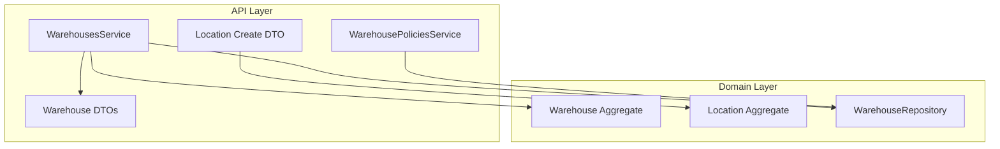
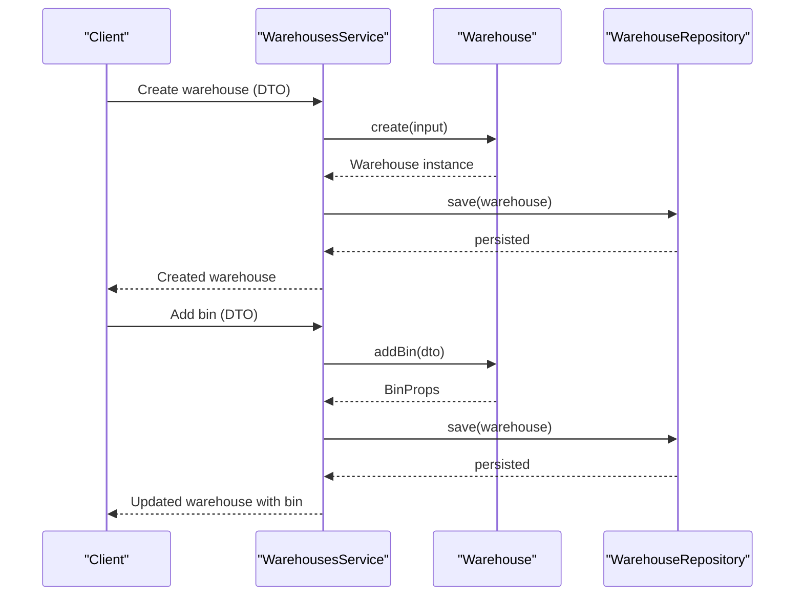
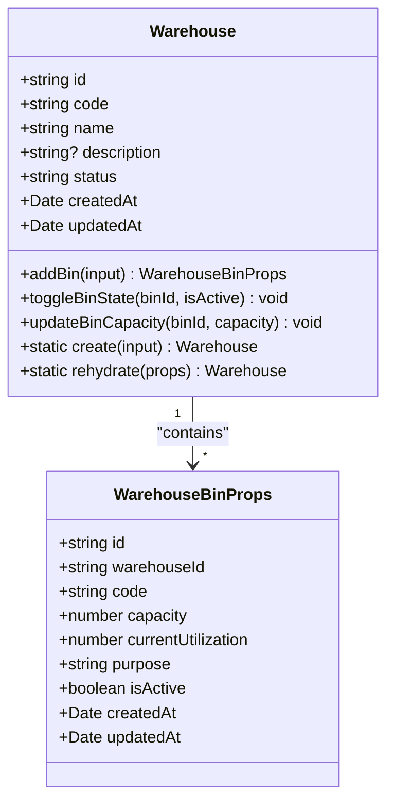
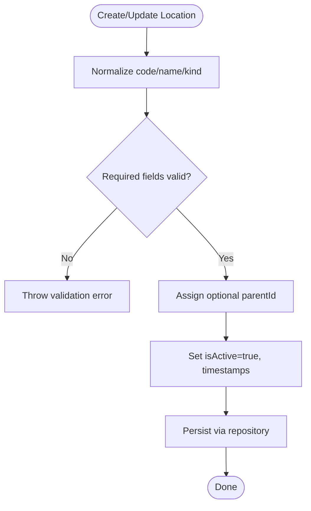
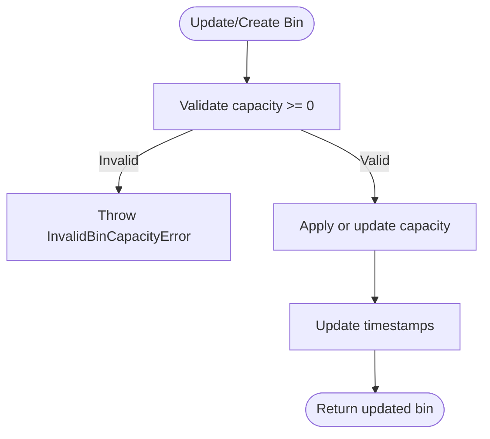
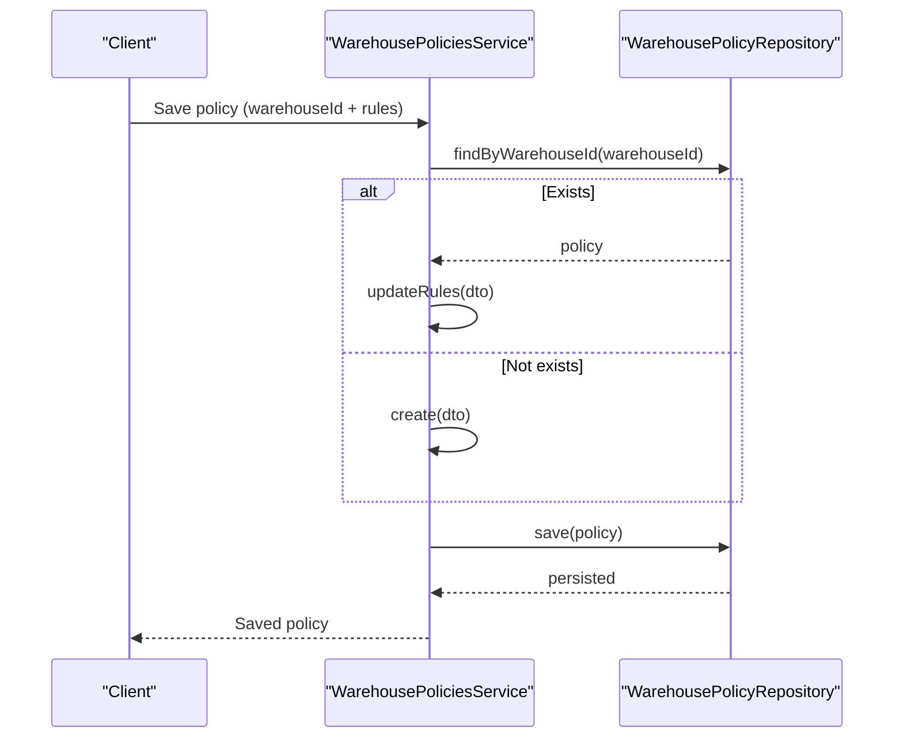
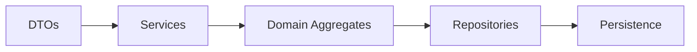
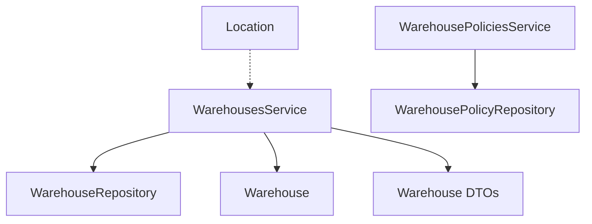

# Warehouse Structure & Configuration

<cite>
**Referenced Files in This Document**
- [warehouse.ts](file://packages/warehouse/src/warehouses/warehouse.ts)
- [warehouse.repository.ts](file://packages/warehouse/src/warehouses/warehouse.repository.ts)
- [dtos.ts](file://apps/api/src/warehouses/dtos.ts)
- [warehouses.service.ts](file://apps/api/src/warehouses/warehouses.service.ts)
- [warehouse-policies.service.ts](file://apps/api/src/warehouse-policies/warehouse-policies.service.ts)
- [warehouse-policies dtos.ts](file://apps/api/src/warehouse-policies/dtos.ts)
- [location.ts](file://packages/inventory/src/locations/location.ts)
- [create-location.dto.ts](file://apps/api/src/locations/create-location.dto.ts)
</cite>

## Table of Contents
1. Introduction
2. Project Structure
3. Core Components
4. Architecture Overview
5. Detailed Component Analysis
6. Dependency Analysis
7. Performance Considerations
8. Troubleshooting Guide
9. Conclusion
10. Appendices

## Introduction
This document explains how Ananya ERP models and configures warehouses, including the warehouse entity model, hierarchical locations, capacity management, and policies that govern storage rules, allocation strategies, and operational constraints. It also covers how to configure multiple warehouses, define warehouse-specific behaviors, set up layouts via bins and locations, and how these configurations integrate with inventory operations such as receiving, production, picking, and shipping.

## Project Structure
Warehouse-related functionality spans domain logic in packages and API orchestration in apps:
- Domain model for warehouses and bins resides in the warehouse package.
- Location hierarchy (hierarchical organization) is modeled in the inventory package.
- API services and DTOs expose configuration endpoints for warehouses and policies.

**Diagram sources**
- [warehouses.service.ts:1-62](file://apps/api/src/warehouses/warehouses.service.ts#L1-L62)
- [warehouse-policies.service.ts:1-39](file://apps/api/src/warehouse-policies/warehouse-policies.service.ts#L1-L39)
- [warehouse.ts:45-139](file://packages/warehouse/src/warehouses/warehouse.ts#L45-L139)
- [location.ts:37-149](file://packages/inventory/src/locations/location.ts#L37-L149)
- [warehouse.repository.ts:1-10](file://packages/warehouse/src/warehouses/warehouse.repository.ts#L1-L10)
- [dtos.ts:10-49](file://apps/api/src/warehouses/dtos.ts#L10-L49)
- [create-location.dto.ts:9-33](file://apps/api/src/locations/create-location.dto.ts#L9-L33)

**Section sources**
- [warehouses.service.ts:1-62](file://apps/api/src/warehouses/warehouses.service.ts#L1-L62)
- [warehouse-policies.service.ts:1-39](file://apps/api/src/warehouse-policies/warehouse-policies.service.ts#L1-L39)
- [warehouse.ts:45-139](file://packages/warehouse/src/warehouses/warehouse.ts#L45-L139)
- [location.ts:37-149](file://packages/inventory/src/locations/location.ts#L37-L149)
- [warehouse.repository.ts:1-10](file://packages/warehouse/src/warehouses/warehouse.repository.ts#L1-L10)
- [dtos.ts:10-49](file://apps/api/src/warehouses/dtos.ts#L10-L49)
- [create-location.dto.ts:9-33](file://apps/api/src/locations/create-location.dto.ts#L9-L33)

## Core Components
- Warehouse aggregate: defines properties, creation, bin management, and state toggles.
- Bin model: purpose-driven bins with capacity and utilization tracking.
- Location aggregate: hierarchical locations with parent-child relationships.
- Policies: per-warehouse rules controlling negative inventory, capacity enforcement, directed putaway/picking, and default bins.
- Repository interface: abstracts persistence for warehouses and bins.

Key responsibilities:
- Validate inputs and enforce invariants at the domain level.
- Provide service methods to create/update warehouses and bins.
- Persist policy rules per warehouse and provide lookup by warehouse ID.
- Support hierarchical location modeling for layout planning.

**Section sources**
- [warehouse.ts:22-139](file://packages/warehouse/src/warehouses/warehouse.ts#L22-L139)
- [warehouse.repository.ts:1-10](file://packages/warehouse/src/warehouses/warehouse.repository.ts#L1-L10)
- [warehouse-policies.service.ts:14-33](file://apps/api/src/warehouse-policies/warehouse-policies.service.ts#L14-L33)
- [location.ts:8-149](file://packages/inventory/src/locations/location.ts#L8-L149)

## Architecture Overview
The API layer composes domain aggregates and repository abstractions to manage warehouses, bins, and policies. Services validate requests using DTOs, mutate domain objects, and persist changes through repositories.

**Diagram sources**
- [warehouses.service.ts:18-44](file://apps/api/src/warehouses/warehouses.service.ts#L18-L44)
- [warehouse.ts:66-113](file://packages/warehouse/src/warehouses/warehouse.ts#L66-L113)
- [warehouse.repository.ts:3-9](file://packages/warehouse/src/warehouses/warehouse.repository.ts#L3-L9)

**Section sources**
- [warehouses.service.ts:18-60](file://apps/api/src/warehouses/warehouses.service.ts#L18-L60)
- [warehouse.ts:66-139](file://packages/warehouse/src/warehouses/warehouse.ts#L66-L139)
- [warehouse.repository.ts:3-9](file://packages/warehouse/src/warehouses/warehouse.repository.ts#L3-L9)

## Detailed Component Analysis

### Warehouse Entity Model
- Properties: id, code, name, description, status, bins array, timestamps.
- Creation: normalizes code to uppercase, sets default status ACTIVE, generates IDs and timestamps.
- Bins: purpose-driven categories (RECEIVING, STORAGE, PRODUCTION, SHIPPING, QUALITY_HOLD), capacity defaults, utilization tracking, active/inactive state.
- Mutations: add bin, toggle bin active state, update bin capacity; all update timestamps.

**Diagram sources**
- [warehouse.ts:22-139](file://packages/warehouse/src/warehouses/warehouse.ts#L22-L139)

**Section sources**
- [warehouse.ts:22-139](file://packages/warehouse/src/warehouses/warehouse.ts#L22-L139)

### Hierarchical Organization (Locations)
- Locations support a parent-child hierarchy via parentId, enabling multi-level site structures (e.g., facility > building > aisle > rack).
- Each location has a unique code, name, kind, active flag, and metadata for flexible attributes.
- Creation and updates normalize fields and enforce required values.

**Diagram sources**
- [location.ts:64-149](file://packages/inventory/src/locations/location.ts#L64-L149)
- [create-location.dto.ts:9-33](file://apps/api/src/locations/create-location.dto.ts#L9-L33)

**Section sources**
- [location.ts:8-149](file://packages/inventory/src/locations/location.ts#L8-L149)
- [create-location.dto.ts:9-33](file://apps/api/src/locations/create-location.dto.ts#L9-L33)

### Capacity Management
- Bin capacity is enforced at creation and update; non-negative constraint is validated.
- Utilization field tracks current usage against capacity; policies can enforce capacity limits during operations.
- Default capacity is applied when not specified during bin creation.

**Diagram sources**
- [warehouse.ts:87-133](file://packages/warehouse/src/warehouses/warehouse.ts#L87-L133)

**Section sources**
- [warehouse.ts:87-133](file://packages/warehouse/src/warehouses/warehouse.ts#L87-L133)

### Warehouse Policies
- Per-warehouse policy flags:
  - allowNegativeInventory: whether stock can go below zero.
  - enforceBinCapacity: whether to block allocations exceeding bin capacity.
  - directedPutaway: require system-directed bin selection on receipt.
  - directedPicking: require system-directed bin selection on issue.
- Default bins:
  - defaultReceivingBinId, defaultProductionBinId, defaultShippingBinId.
- Service supports creating or updating an existing policy per warehouse.

**Diagram sources**
- [warehouse-policies.service.ts:14-23](file://apps/api/src/warehouse-policies/warehouse-policies.service.ts#L14-L23)
- [warehouse-policies dtos.ts:3-35](file://apps/api/src/warehouse-policies/dtos.ts#L3-L35)

**Section sources**
- [warehouse-policies.service.ts:14-33](file://apps/api/src/warehouse-policies/warehouse-policies.service.ts#L14-L33)
- [warehouse-policies dtos.ts:3-35](file://apps/api/src/warehouse-policies/dtos.ts#L3-L35)

### API Integration and Data Flow
- DTOs validate incoming requests for warehouses and bins.
- Services orchestrate domain mutations and persistence.
- Repositories abstract data access for warehouses and policies.

**Diagram sources**
- [dtos.ts:10-49](file://apps/api/src/warehouses/dtos.ts#L10-L49)
- [warehouses.service.ts:18-60](file://apps/api/src/warehouses/warehouses.service.ts#L18-L60)
- [warehouse.repository.ts:3-9](file://packages/warehouse/src/warehouses/warehouse.repository.ts#L3-L9)

**Section sources**
- [dtos.ts:10-49](file://apps/api/src/warehouses/dtos.ts#L10-L49)
- [warehouses.service.ts:18-60](file://apps/api/src/warehouses/warehouses.service.ts#L18-L60)
- [warehouse.repository.ts:3-9](file://packages/warehouse/src/warehouses/warehouse.repository.ts#L3-L9)

## Dependency Analysis
- WarehousesService depends on WarehouseRepository and Warehouse aggregate.
- WarehousePoliciesService depends on WarehousePolicyRepository and WarehousePolicy aggregate.
- Location aggregate is independent but used to model hierarchical structure across the system.
- DTOs are consumed by services for input validation.

**Diagram sources**
- [warehouses.service.ts:1-62](file://apps/api/src/warehouses/warehouses.service.ts#L1-L62)
- [warehouse-policies.service.ts:1-39](file://apps/api/src/warehouse-policies/warehouse-policies.service.ts#L1-L39)
- [warehouse.repository.ts:1-10](file://packages/warehouse/src/warehouses/warehouse.repository.ts#L1-L10)
- [dtos.ts:10-49](file://apps/api/src/warehouses/dtos.ts#L10-L49)
- [location.ts:37-149](file://packages/inventory/src/locations/location.ts#L37-L149)

**Section sources**
- [warehouses.service.ts:1-62](file://apps/api/src/warehouses/warehouses.service.ts#L1-L62)
- [warehouse-policies.service.ts:1-39](file://apps/api/src/warehouse-policies/warehouse-policies.service.ts#L1-L39)
- [warehouse.repository.ts:1-10](file://packages/warehouse/src/warehouses/warehouse.repository.ts#L1-L10)
- [dtos.ts:10-49](file://apps/api/src/warehouses/dtos.ts#L10-L49)
- [location.ts:37-149](file://packages/inventory/src/locations/location.ts#L37-L149)

## Performance Considerations
- Keep bin capacity and utilization accurate to avoid unnecessary recalculations during allocation.
- Use directed putaway/picking only where necessary to reduce decision overhead.
- Batch updates to warehouse bins when possible to minimize persistence calls.
- Cache frequently accessed policies per warehouse to reduce repository lookups.

[No sources needed since this section provides general guidance]

## Troubleshooting Guide
Common issues and resolutions:
- Invalid warehouse code: ensure code is provided and normalized; creation enforces non-empty uppercase codes.
- Negative bin capacity: capacity must be non-negative; adjust before saving.
- Missing warehouse policy: if a policy is required for operations, create or update it via the policy service.
- Not found errors: verify IDs exist before performing updates; services throw not-found exceptions when entities are missing.

Operational checks:
- Confirm bins are active and have sufficient capacity for intended operations.
- Verify policy flags align with business rules (e.g., enforceBinCapacity should be true if you want hard limits).

**Section sources**
- [warehouse.ts:66-93](file://packages/warehouse/src/warehouses/warehouse.ts#L66-L93)
- [warehouse.ts:115-133](file://packages/warehouse/src/warehouses/warehouse.ts#L115-L133)
- [warehouses.service.ts:28-33](file://apps/api/src/warehouses/warehouses.service.ts#L28-L33)
- [warehouse-policies.service.ts:25-33](file://apps/api/src/warehouse-policies/warehouse-policies.service.ts#L25-L33)

## Conclusion
Ananya ERP’s warehouse model combines a robust domain aggregate for warehouses and bins with a flexible location hierarchy and configurable policies. This design enables precise control over storage rules, allocation strategies, and operational constraints while integrating cleanly with inventory operations. By configuring warehouses, defining hierarchical locations, setting policies, and managing bin capacities, organizations can tailor stock operations to their specific workflows.

[No sources needed since this section summarizes without analyzing specific files]

## Appendices

### Practical Examples

- Creating a warehouse:
  - Provide code, name, and optional description via the warehouse DTO.
  - The service creates the domain object and persists it.

- Adding bins and setting purposes:
  - Add bins with code, optional capacity, and purpose (RECEIVING, STORAGE, PRODUCTION, SHIPPING, QUALITY_HOLD).
  - Toggle bin activity and update capacity as needed.

- Configuring policies:
  - Save a policy per warehouse to control negative inventory, capacity enforcement, directed putaway/picking, and default bins.

- Setting up hierarchical locations:
  - Create locations with codes, names, kinds, and optional parent IDs to build multi-level layouts.

- Integrating with inventory operations:
  - Use directed putaway/picking to guide receipts and issues to specific bins.
  - Enforce bin capacity to prevent over-allocation.
  - Leverage default bins for standard flows (receiving, production, shipping).

**Section sources**
- [dtos.ts:10-49](file://apps/api/src/warehouses/dtos.ts#L10-L49)
- [warehouses.service.ts:18-60](file://apps/api/src/warehouses/warehouses.service.ts#L18-L60)
- [warehouse-policies.service.ts:14-33](file://apps/api/src/warehouse-policies/warehouse-policies.service.ts#L14-L33)
- [warehouse-policies dtos.ts:3-35](file://apps/api/src/warehouse-policies/dtos.ts#L3-L35)
- [create-location.dto.ts:9-33](file://apps/api/src/locations/create-location.dto.ts#L9-L33)
- [location.ts:64-149](file://packages/inventory/src/locations/location.ts#L64-L149)