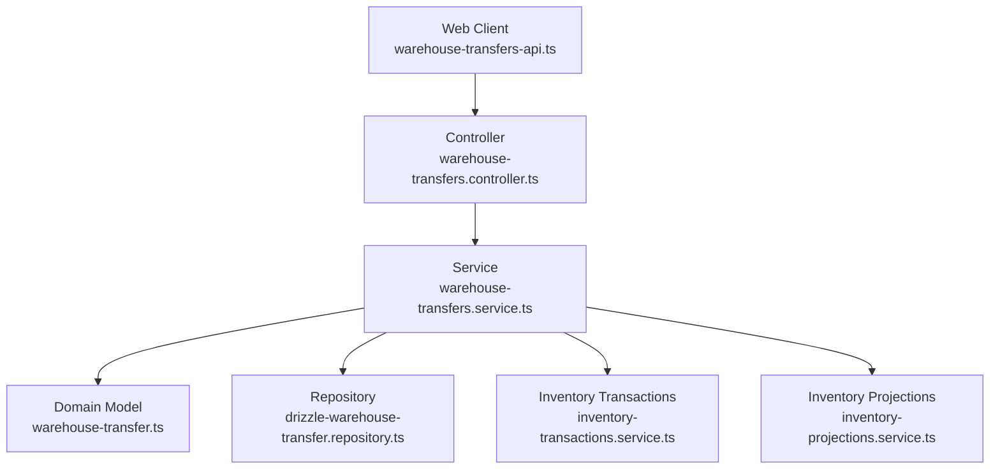
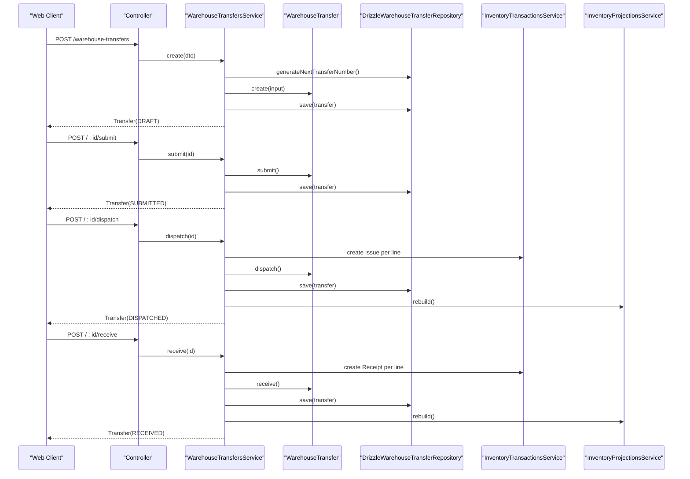
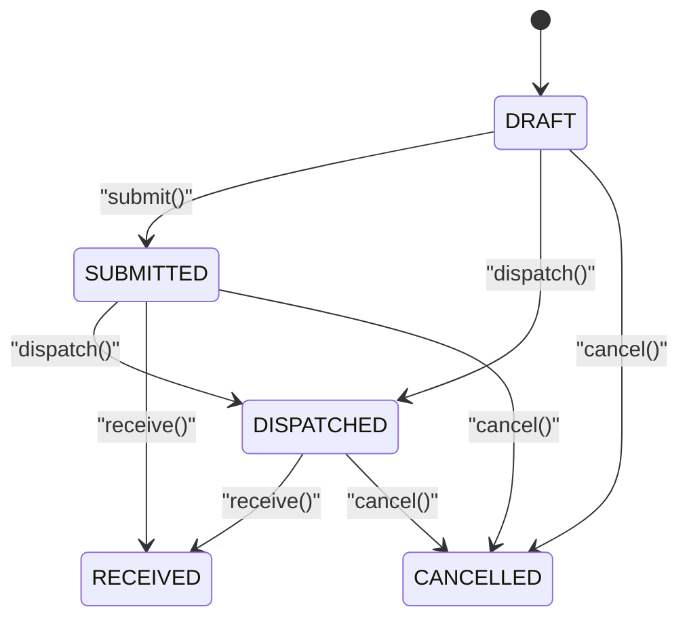
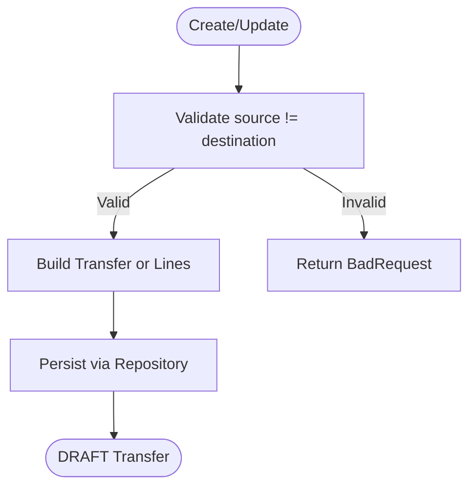
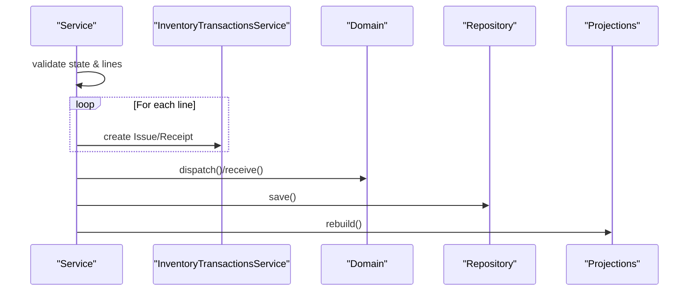
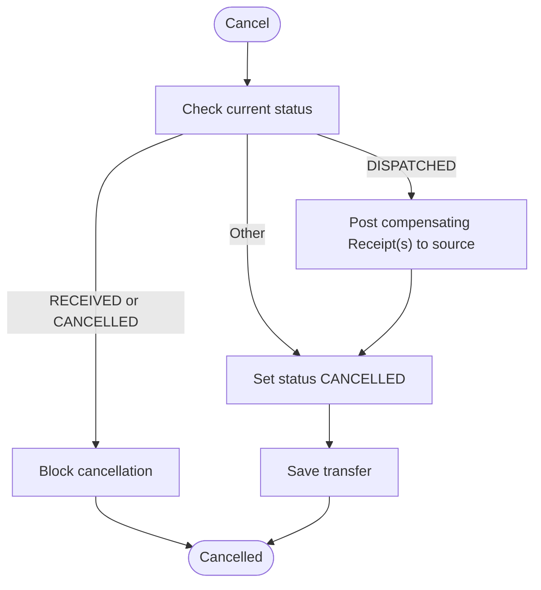
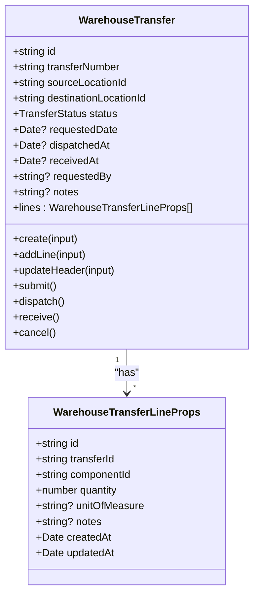
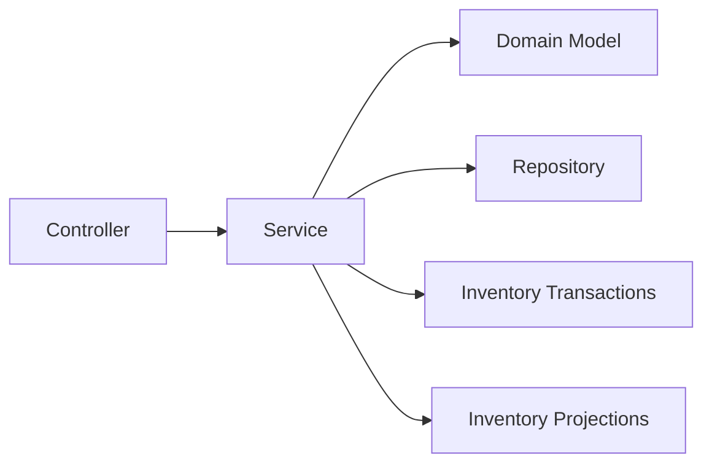

# Warehouse Transfers & Movements

<cite>
**Referenced Files in This Document**
- [warehouse-transfers.controller.ts](file://apps/api/src/warehouse-transfers/warehouse-transfers.controller.ts)
- [warehouse-transfers.service.ts](file://apps/api/src/warehouse-transfers/warehouse-transfers.service.ts)
- [dtos.ts](file://apps/api/src/warehouse-transfers/dtos.ts)
- [drizzle-warehouse-transfer.repository.ts](file://apps/api/src/infrastructure/repositories/drizzle-warehouse-transfer.repository.ts)
- [warehouse-transfer.ts](file://packages/warehouse/src/transfers/warehouse-transfer.ts)
- [transfer.errors.ts](file://packages/warehouse/src/transfers/transfer.errors.ts)
- [0024-warehouse-transfers.md](file://docs/rfcs/0024-warehouse-transfers.md)
- [warehouse-transfers-api.ts](file://apps/web/lib/api/warehouse-transfers-api.ts)
- [inventory-transactions.service.ts](file://apps/api/src/inventory-transactions/inventory-transactions.service.ts)
- [inventory-projections.service.ts](file://apps/api/src/inventory-projections/inventory-projections.service.ts)
</cite>

## Table of Contents
1. Introduction
2. Project Structure
3. Core Components
4. Architecture Overview
5. Detailed Component Analysis
6. Dependency Analysis
7. Performance Considerations
8. Troubleshooting Guide
9. Conclusion
10. Appendices

## Introduction
This document explains how warehouse transfers and inventory movements work in Ananya ERP. It covers the transfer lifecycle from creation to completion, including status transitions, validation rules, integration with inventory transactions, and auditability through linked ledger entries. It also clarifies differences between the RFC design and current implementation, and provides practical guidance for intra-warehouse moves, inter-warehouse transfers, and bulk operations.

## Project Structure
The warehouse transfer feature spans API controllers, services, domain models, repositories, and web client APIs:
- API layer exposes endpoints for creating, updating, submitting, dispatching, receiving, and canceling transfers.
- Service layer enforces business rules, coordinates state transitions, and integrates with inventory transactions and projections.
- Domain model defines the transfer aggregate, line items, and immutable state transitions.
- Repository persists transfers and lines to the database.
- Web client provides a typed API wrapper for UI interactions.

**Diagram sources**
- [warehouse-transfers.controller.ts:21-84](file://apps/api/src/warehouse-transfers/warehouse-transfers.controller.ts#L21-L84)
- [warehouse-transfers.service.ts:22-29](file://apps/api/src/warehouse-transfers/warehouse-transfers.service.ts#L22-L29)
- [warehouse-transfer.ts:68-221](file://packages/warehouse/src/transfers/warehouse-transfer.ts#L68-L221)
- [drizzle-warehouse-transfer.repository.ts:48-190](file://apps/api/src/infrastructure/repositories/drizzle-warehouse-transfer.repository.ts#L48-L190)
- [inventory-transactions.service.ts](file://apps/api/src/inventory-transactions/inventory-transactions.service.ts)
- [inventory-projections.service.ts](file://apps/api/src/inventory-projections/inventory-projections.service.ts)

**Section sources**
- [warehouse-transfers.controller.ts:21-84](file://apps/api/src/warehouse-transfers/warehouse-transfers.controller.ts#L21-L84)
- [warehouse-transfers.service.ts:22-29](file://apps/api/src/warehouse-transfers/warehouse-transfers.service.ts#L22-L29)
- [warehouse-transfer.ts:68-221](file://packages/warehouse/src/transfers/warehouse-transfer.ts#L68-L221)
- [drizzle-warehouse-transfer.repository.ts:48-190](file://apps/api/src/infrastructure/repositories/drizzle-warehouse-transfer.repository.ts#L48-L190)

## Core Components
- Transfer DTOs define request shapes for create, update, and adding lines, including quantity validation and optional unit of measure.
- Controller exposes REST endpoints for full CRUD plus workflow actions (submit, dispatch, receive, cancel).
- Service orchestrates transfer lifecycle, validates inputs, delegates to domain model for state transitions, persists via repository, and integrates with inventory transactions and projections.
- Domain model enforces invariants (no identical source/destination, positive quantities, immutability after receipt/cancellation) and manages strict state transitions.
- Repository handles persistence, queries, and generating unique transfer numbers.

Key responsibilities:
- Validation: Source vs destination distinctness; positive quantities; editability only in DRAFT.
- State machine: DRAFT → SUBMITTED → DISPATCHED → RECEIVED; CANCELLED at any time except RECEIVED/CANCELLED.
- Inventory integration: On dispatch, issue outbound; on receive, post inbound; on cancel after dispatch, compensate with return receipts.
- Auditability: Each action creates inventory ledger entries referencing the transfer number.

**Section sources**
- [dtos.ts:12-83](file://apps/api/src/warehouse-transfers/dtos.ts#L12-L83)
- [warehouse-transfers.controller.ts:21-84](file://apps/api/src/warehouse-transfers/warehouse-transfers.controller.ts#L21-L84)
- [warehouse-transfers.service.ts:31-240](file://apps/api/src/warehouse-transfers/warehouse-transfers.service.ts#L31-L240)
- [warehouse-transfer.ts:68-221](file://packages/warehouse/src/transfers/warehouse-transfer.ts#L68-L221)
- [drizzle-warehouse-transfer.repository.ts:48-190](file://apps/api/src/infrastructure/repositories/drizzle-warehouse-transfer.repository.ts#L48-L190)

## Architecture Overview
The transfer flow is orchestrated by the service layer using the domain model’s state machine and persisted via the repository. Inventory changes are posted through the inventory transactions service, ensuring separation of concerns and consistent auditing.

**Diagram sources**
- [warehouse-transfers.controller.ts:26-79](file://apps/api/src/warehouse-transfers/warehouse-transfers.controller.ts#L26-L79)
- [warehouse-transfers.service.ts:31-199](file://apps/api/src/warehouse-transfers/warehouse-transfers.service.ts#L31-L199)
- [warehouse-transfer.ts:99-216](file://packages/warehouse/src/transfers/warehouse-transfer.ts#L99-L216)
- [drizzle-warehouse-transfer.repository.ts:131-175](file://apps/api/src/infrastructure/repositories/drizzle-warehouse-transfer.repository.ts#L131-L175)

## Detailed Component Analysis

### Transfer Lifecycle and Status Management
- States: DRAFT, SUBMITTED, DISPATCHED, RECEIVED, CANCELLED.
- Allowed transitions enforced by the domain model:
  - Submit: DRAFT → SUBMITTED (requires at least one line).
  - Dispatch: SUBMITTED or DRAFT → DISPATCHED (sets dispatched timestamp).
  - Receive: DISPATCHED or SUBMITTED → RECEIVED (sets received timestamp).
  - Cancel: Any state except RECEIVED or CANCELLED → CANCELLED.
- Immutability: Once RECEIVED or CANCELLED, no further modifications are allowed.

**Diagram sources**
- [warehouse-transfer.ts:179-216](file://packages/warehouse/src/transfers/warehouse-transfer.ts#L179-L216)

**Section sources**
- [warehouse-transfer.ts:99-221](file://packages/warehouse/src/transfers/warehouse-transfer.ts#L99-L221)
- [transfer.errors.ts:1-31](file://packages/warehouse/src/transfers/transfer.errors.ts#L1-L31)

### Transfer Creation and Updates
- Create: Validates distinct source/destination, generates transfer number, initializes DRAFT, optionally adds lines.
- Update: Only allowed in DRAFT; prevents identical source/destination; can replace lines.
- Add Line: Only in DRAFT; enforces positive quantity.

**Diagram sources**
- [warehouse-transfers.service.ts:31-92](file://apps/api/src/warehouse-transfers/warehouse-transfers.service.ts#L31-L92)
- [warehouse-transfer.ts:99-177](file://packages/warehouse/src/transfers/warehouse-transfer.ts#L99-L177)
- [drizzle-warehouse-transfer.repository.ts:131-175](file://apps/api/src/infrastructure/repositories/drizzle-warehouse-transfer.repository.ts#L131-L175)

**Section sources**
- [warehouse-transfers.service.ts:31-92](file://apps/api/src/warehouse-transfers/warehouse-transfers.service.ts#L31-L92)
- [warehouse-transfer.ts:99-177](file://packages/warehouse/src/transfers/warehouse-transfer.ts#L99-L177)
- [dtos.ts:12-83](file://apps/api/src/warehouse-transfers/dtos.ts#L12-L83)

### Dispatch and Receive: Inventory Integration
- Dispatch:
  - Validates state and presence of lines.
  - Posts Issue transactions for each line from source location.
  - Transfers to DISPATCHED and rebuilds projections.
- Receive:
  - Validates state.
  - Posts Receipt transactions for each line into destination location.
  - Transfers to RECEIVED and rebuilds projections.

**Diagram sources**
- [warehouse-transfers.service.ts:135-199](file://apps/api/src/warehouse-transfers/warehouse-transfers.service.ts#L135-L199)
- [warehouse-transfer.ts:192-208](file://packages/warehouse/src/transfers/warehouse-transfer.ts#L192-L208)

**Section sources**
- [warehouse-transfers.service.ts:135-199](file://apps/api/src/warehouse-transfers/warehouse-transfers.service.ts#L135-L199)

### Cancellation and Compensation
- Cancellation:
  - Prevents cancellation if already RECEIVED or CANCELLED.
  - If already DISPATCHED, posts compensating Receipt transactions back to source location to reverse outbound movement.
  - Rebuilds projections when compensation occurs.

**Diagram sources**
- [warehouse-transfers.service.ts:201-229](file://apps/api/src/warehouse-transfers/warehouse-transfers.service.ts#L201-L229)
- [warehouse-transfer.ts:210-216](file://packages/warehouse/src/transfers/warehouse-transfer.ts#L210-L216)

**Section sources**
- [warehouse-transfers.service.ts:201-229](file://apps/api/src/warehouse-transfers/warehouse-transfers.service.ts#L201-L229)

### Data Models and Persistence
- Domain model includes header fields (source/destination locations, timestamps), transfer lines (component, quantity, unit of measure, notes), and immutable state transitions.
- Repository maps records to domain objects, supports filtering by source/destination/status/search, and replaces lines atomically on save.
- Transfer numbering uses a simple sequential scheme based on current count.

**Diagram sources**
- [warehouse-transfer.ts:12-81](file://packages/warehouse/src/transfers/warehouse-transfer.ts#L12-L81)
- [warehouse-transfer.ts:99-177](file://packages/warehouse/src/transfers/warehouse-transfer.ts#L99-L177)

**Section sources**
- [warehouse-transfer.ts:12-81](file://packages/warehouse/src/transfers/warehouse-transfer.ts#L12-L81)
- [drizzle-warehouse-transfer.repository.ts:18-46](file://apps/api/src/infrastructure/repositories/drizzle-warehouse-transfer.repository.ts#L18-L46)
- [drizzle-warehouse-transfer.repository.ts:87-129](file://apps/api/src/infrastructure/repositories/drizzle-warehouse-transfer.repository.ts#L87-L129)
- [drizzle-warehouse-transfer.repository.ts:131-175](file://apps/api/src/infrastructure/repositories/drizzle-warehouse-transfer.repository.ts#L131-L175)
- [drizzle-warehouse-transfer.repository.ts:182-189](file://apps/api/src/infrastructure/repositories/drizzle-warehouse-transfer.repository.ts#L182-L189)

### API Surface and Client Usage
- Endpoints:
  - POST /warehouse-transfers: Create transfer
  - GET /warehouse-transfers: List with filters
  - GET /warehouse-transfers/:id: Get details
  - PUT /warehouse-transfers/:id: Update (DRAFT only)
  - POST /warehouse-transfers/:id/lines: Add line (DRAFT only)
  - POST /warehouse-transfers/:id/submit: Submit for approval
  - POST /warehouse-transfers/:id/dispatch: Dispatch stock
  - POST /warehouse-transfers/:id/receive: Receive stock
  - POST /warehouse-transfers/:id/cancel: Cancel transfer
  - DELETE /warehouse-transfers/:id: Delete (DRAFT only)
- Web client API wrapper provides strongly typed methods for all actions.

**Section sources**
- [warehouse-transfers.controller.ts:21-84](file://apps/api/src/warehouse-transfers/warehouse-transfers.controller.ts#L21-L84)
- [warehouse-transfers-api.ts:76-121](file://apps/web/lib/api/warehouse-transfers-api.ts#L76-L121)

## Dependency Analysis
- Controller depends on Service for business logic.
- Service depends on:
  - Domain model for state transitions and invariants.
  - Repository for persistence and queries.
  - Inventory transactions service for ledger postings.
  - Inventory projections service for rebuilding projections after changes.
- Repository depends on database schema and query utilities.

**Diagram sources**
- [warehouse-transfers.controller.ts:21-84](file://apps/api/src/warehouse-transfers/warehouse-transfers.controller.ts#L21-L84)
- [warehouse-transfers.service.ts:22-29](file://apps/api/src/warehouse-transfers/warehouse-transfers.service.ts#L22-L29)

**Section sources**
- [warehouse-transfers.service.ts:22-29](file://apps/api/src/warehouse-transfers/warehouse-transfers.service.ts#L22-L29)

## Performance Considerations
- Batch operations: Adding multiple lines during create/update reduces round-trips compared to repeated add-line calls.
- Projection rebuild: Invoked after dispatch and receive; consider batching or background jobs if high volume.
- Query performance: Filtering by source/destination/status and search leverages indexed columns; ensure indexes exist on frequently filtered fields.
- Transaction boundaries: Ensure inventory postings and transfer updates occur within appropriate transactional scopes to maintain consistency.

[No sources needed since this section provides general guidance]

## Troubleshooting Guide
Common errors and resolutions:
- Identical source and destination:
  - Cause: Creating or updating transfer with same locations.
  - Resolution: Ensure distinct locations before submission.
- Invalid quantity:
  - Cause: Non-positive quantity on line item.
  - Resolution: Provide strictly positive quantity.
- Invalid status transition:
  - Cause: Attempting unsupported state change (e.g., dispatch from non-SUBMITTED/DRAFT).
  - Resolution: Follow allowed transitions defined by domain model.
- Immutable transfer:
  - Cause: Modifying RECEIVED or CANCELLED transfer.
  - Resolution: Use new transfer or adjust workflow earlier in lifecycle.
- Cannot cancel RECEIVED or CANCELLED:
  - Cause: Already finalized or cancelled.
  - Resolution: Initiate corrective actions outside of cancellation.

**Section sources**
- [transfer.errors.ts:1-31](file://packages/warehouse/src/transfers/transfer.errors.ts#L1-L31)
- [warehouse-transfers.service.ts:31-92](file://apps/api/src/warehouse-transfers/warehouse-transfers.service.ts#L31-L92)
- [warehouse-transfer.ts:179-216](file://packages/warehouse/src/transfers/warehouse-transfer.ts#L179-L216)

## Conclusion
Ananya ERP’s warehouse transfers provide a robust, auditable mechanism for moving inventory between locations. The domain model enforces strict state transitions and invariants, while the service layer integrates with inventory transactions to ensure accurate ledger entries and projections. Although the RFC outlines an alternative state machine and completion flow, the current implementation uses a clear lifecycle that supports both intra-warehouse and inter-warehouse movements, partial operations via line items, and comprehensive tracking through linked inventory transactions.

[No sources needed since this section summarizes without analyzing specific files]

## Appendices

### Practical Examples
- Intra-warehouse move:
  - Create transfer with source and destination bins within the same warehouse.
  - Add line items for components and quantities.
  - Submit, then dispatch and receive to complete the move.
- Inter-warehouse transfer:
  - Create transfer with source and destination in different warehouses.
  - Follow the same submit-dispatch-receive flow; inventory postings reflect cross-location movement.
- Bulk transfer operations:
  - Use create with multiple lines or batched add-line calls to handle large volumes efficiently.
  - Monitor linked inventory transactions by transfer number for auditability.

[No sources needed since this section provides general guidance]

### RFC vs Implementation Notes
- RFC describes states DRAFT → APPROVED → IN_TRANSIT → COMPLETED and completes transfers by invoking inventory transfer transactions upon completion.
- Current implementation uses DRAFT → SUBMITTED → DISPATCHED → RECEIVED and posts Issue/Receipt transactions on dispatch/receive respectively.
- Both approaches ensure inventory accuracy and audit trails; choose workflow alignment based on organizational policies.

**Section sources**
- [0024-warehouse-transfers.md:17-23](file://docs/rfcs/0024-warehouse-transfers.md#L17-L23)
- [0024-warehouse-transfers.md:105-148](file://docs/rfcs/0024-warehouse-transfers.md#L105-L148)
- [warehouse-transfers.service.ts:135-199](file://apps/api/src/warehouse-transfers/warehouse-transfers.service.ts#L135-L199)