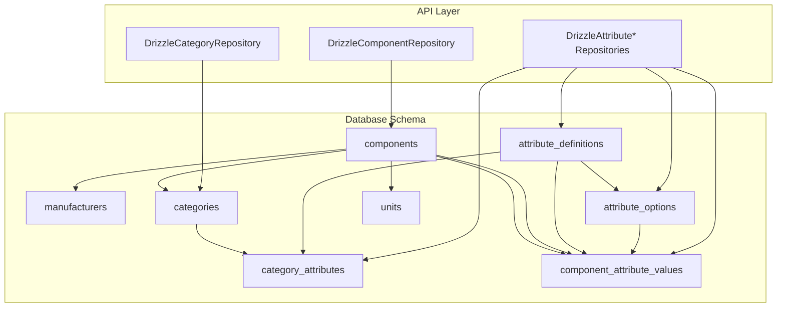
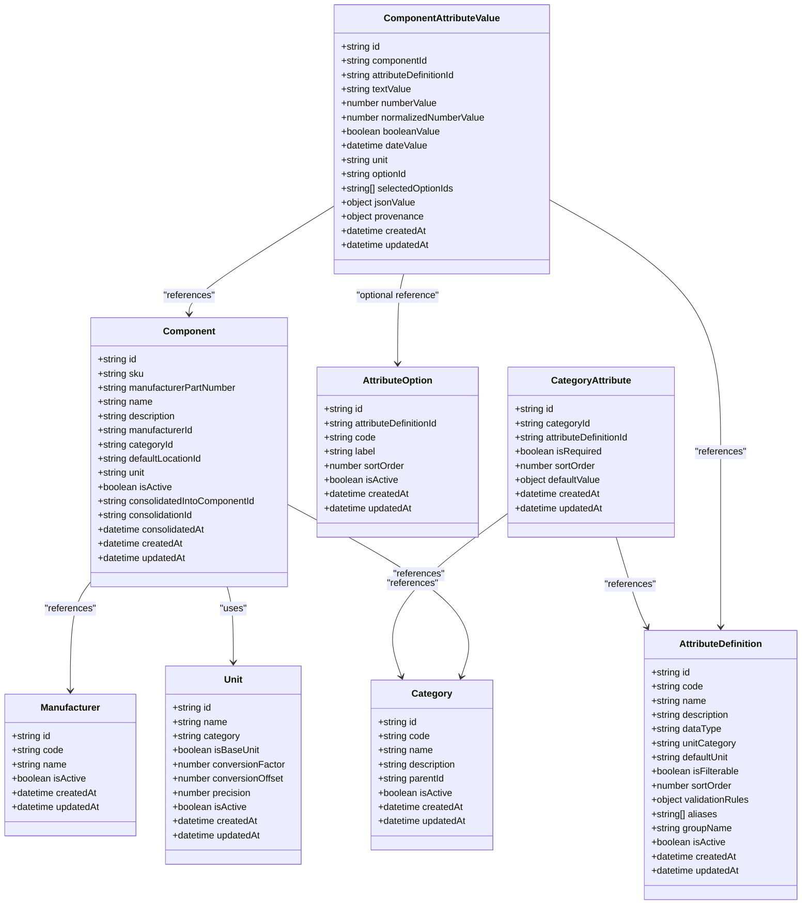
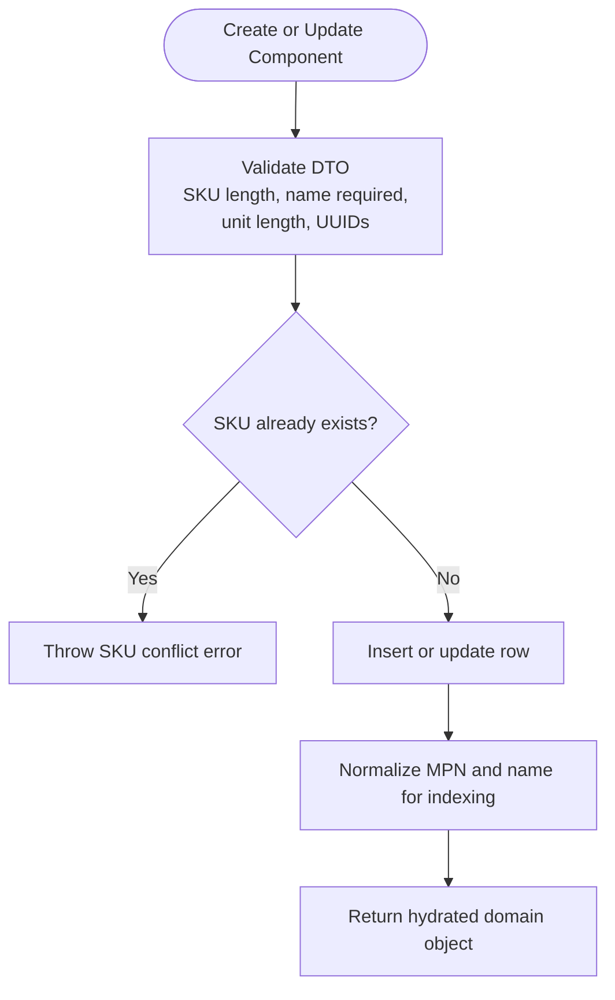
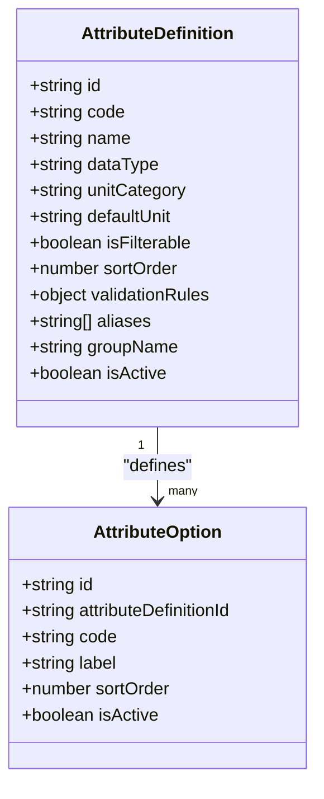
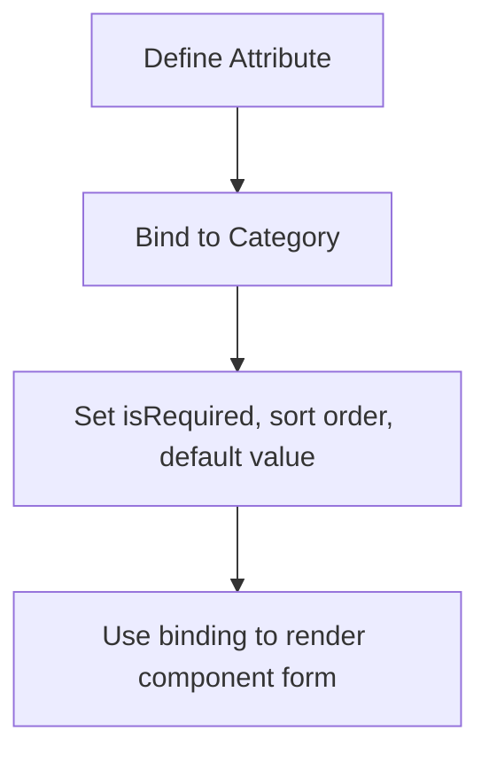
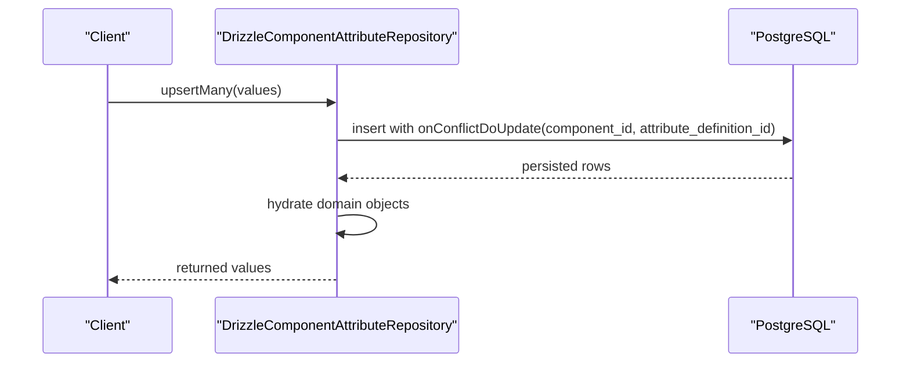
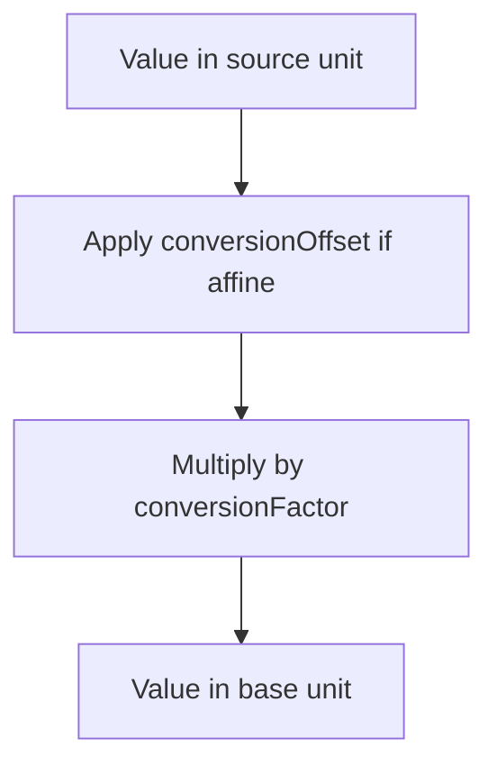
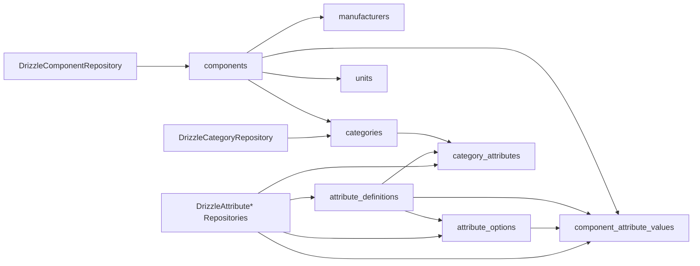

# Core Entities & Foundation

<cite>
**Referenced Files in This Document**
- [components.ts](file://packages/database/src/schema/components.ts)
- [manufacturers.ts](file://packages/database/src/schema/manufacturers.ts)
- [categories.ts](file://packages/database/src/schema/categories.ts)
- [attributes.ts](file://packages/database/src/schema/attributes.ts)
- [units.ts](file://packages/database/src/schema/units.ts)
- [drizzle-component.repository.ts](file://apps/api/src/infrastructure/repositories/drizzle-component.repository.ts)
- [drizzle-attribute.repository.ts](file://apps/api/src/infrastructure/repositories/drizzle-attribute.repository.ts)
- [drizzle-category.repository.ts](file://apps/api/src/infrastructure/repositories/drizzle-category.repository.ts)
- [create-component.dto.ts](file://apps/api/src/components/create-component.dto.ts)
</cite>

## Table of Contents
1. [Introduction](#introduction)
2. [Project Structure](#project-structure)
3. [Core Components](#core-components)
4. [Architecture Overview](#architecture-overview)
5. [Detailed Component Analysis](#detailed-component-analysis)
6. [Dependency Analysis](#dependency-analysis)
7. [Performance Considerations](#performance-considerations)
8. [Troubleshooting Guide](#troubleshooting-guide)
9. [Conclusion](#conclusion)

## Introduction
This document describes the core master data model for Ananya ERP, focusing on Components, Manufacturers, Categories, Attributes, and Units. It explains entity relationships, field definitions, primary and foreign keys, indexes, constraints, validation rules, and the dynamic attribute system that lets categories define required or optional attributes with typed values. It also documents Drizzle ORM repository access patterns, data lifecycle and versioning strategies, and performance considerations for high-volume master data operations.

## Project Structure
The database schema is defined in the shared database package using Drizzle ORM, while API-layer repositories translate between database rows and domain aggregates. The core entities live under `packages/database/src/schema`, and their Drizzle-based repository implementations live under `apps/api/src/infrastructure/repositories`.

**Diagram sources**
- [components.ts:28-126](file://packages/database/src/schema/components.ts#L28-L126)
- [manufacturers.ts:11-39](file://packages/database/src/schema/manufacturers.ts#L11-L39)
- [categories.ts:12-45](file://packages/database/src/schema/categories.ts#L12-L45)
- [attributes.ts:20-270](file://packages/database/src/schema/attributes.ts#L20-L270)
- [units.ts:12-71](file://packages/database/src/schema/units.ts#L12-L71)
- [drizzle-component.repository.ts:65-156](file://apps/api/src/infrastructure/repositories/drizzle-component.repository.ts#L65-L156)
- [drizzle-attribute.repository.ts:25-679](file://apps/api/src/infrastructure/repositories/drizzle-attribute.repository.ts#L25-L679)
- [drizzle-category.repository.ts:36-145](file://apps/api/src/infrastructure/repositories/drizzle-category.repository.ts#L36-L145)

**Section sources**
- [components.ts:15-126](file://packages/database/src/schema/components.ts#L15-L126)
- [manufacturers.ts:11-43](file://packages/database/src/schema/manufacturers.ts#L11-L43)
- [categories.ts:12-49](file://packages/database/src/schema/categories.ts#L12-L49)
- [attributes.ts:16-276](file://packages/database/src/schema/attributes.ts#L16-L276)
- [units.ts:12-75](file://packages/database/src/schema/units.ts#L12-L75)
- [drizzle-component.repository.ts:16-156](file://apps/api/src/infrastructure/repositories/drizzle-component.repository.ts#L16-L156)
- [drizzle-attribute.repository.ts:1-679](file://apps/api/src/infrastructure/repositories/drizzle-attribute.repository.ts#L1-L679)
- [drizzle-category.repository.ts:1-146](file://apps/api/src/infrastructure/repositories/drizzle-category.repository.ts#L1-L146)

## Core Components
This section summarizes each core entity, its fields, types, keys, constraints, and indexes.

### Components
Components represent product master records. They support SKU uniqueness, manufacturer and category associations, a default location, unit of measure, and a consolidation lifecycle.

- Primary key: `id` (UUID).
- Unique constraint: `sku`.
- Foreign keys:
  - `manufacturerId` → manufacturers.id.
  - `categoryId` → categories.id.
  - `defaultLocationId` → locations.id (set null on delete).
  - `consolidatedIntoComponentId` → components.id (restrict delete to preserve retirement trail).
  - `consolidationId` → consolidations.id (restrict delete).
- Important boolean flag: `isActive`.
- Lifecycle columns: `consolidatedIntoComponentId`, `consolidationId`, `consolidatedAt`.
- Timestamps: `createdAt`, `updatedAt`.
- Indexes:
  - Unique index on `sku`.
  - B-tree indexes on `manufacturerId`, `categoryId`, `defaultLocationId`, `unit`, `consolidatedIntoComponentId`, `consolidationId`.
  - Normalized MPN index using an expression over `manufacturerPartNumber`.
  - Normalized name index using an expression over `name`.

Validation rules are enforced at multiple layers:
- Database-level unique constraint on `sku`.
- API DTO validation requires non-empty `name`, bounded lengths for `sku`, `manufacturerPartNumber`, and `unit`, and validates UUIDs where applicable.
- Frontend form validation enforces required fields and normalizes input such as uppercasing SKU and lowercasing unit.

**Section sources**
- [components.ts:28-126](file://packages/database/src/schema/components.ts#L28-L126)
- [create-component.dto.ts:44-94](file://apps/api/src/components/create-component.dto.ts#L44-L94)

### Manufacturers
Manufacturers are simple lookup entities used by components.

- Primary key: `id` (UUID).
- Unique constraint: `code`.
- Boolean flag: `isActive`.
- Timestamps: `createdAt`, `updatedAt`.
- Index: unique index on `code`.

**Section sources**
- [manufacturers.ts:11-43](file://packages/database/src/schema/manufacturers.ts#L11-L43)

### Categories
Categories provide hierarchical classification for components.

- Primary key: `id` (UUID).
- Unique constraint: `code`.
- Self-referencing foreign key: `parentId` → categories.id (restrict delete).
- Boolean flag: `isActive`.
- Timestamps: `createdAt`, `updatedAt`.
- Index: on `parentId`.

**Section sources**
- [categories.ts:12-49](file://packages/database/src/schema/categories.ts#L12-L49)

### Attributes System
The attribute system defines reusable attribute metadata, predefined options, category bindings, and per-component values.

#### Attribute Definitions
Defines the shape of an attribute such as Resistance, Package, or Tolerance.

- Primary key: `id` (UUID).
- Unique constraint: `code`.
- Fields include:
  - `name`, `description`.
  - `dataType`: supports TEXT, NUMBER, INTEGER, BOOLEAN, SELECT, MULTI_SELECT, QUANTITY, DATE.
  - `unitCategory`, `defaultUnit`.
  - `isFilterable`, `sortOrder`.
  - `validationRules` (JSONB).
  - `aliases` (array stored as JSONB).
  - `groupName`.
  - `isActive`.
- Timestamps: `createdAt`, `updatedAt`.
- Indexes:
  - Unique index on `code`.
  - B-tree indexes on `dataType`, `unitCategory`, `isFilterable`, `groupName`.

#### Attribute Options
Predefined choices for SELECT and MULTI_SELECT attributes.

- Primary key: `id` (UUID).
- Composite unique constraint: (`attributeDefinitionId`, `code`).
- Fields include:
  - `attributeDefinitionId` → attribute_definitions.id (cascade delete).
  - `code`, `label`, `sortOrder`, `isActive`.
- Timestamps: `createdAt`, `updatedAt`.
- Indexes:
  - Composite unique index on (`attributeDefinitionId`, `code`).
  - B-tree indexes on `attributeDefinitionId`, `sortOrder`.

#### Category-Attribute Bindings
Associates attribute definitions with categories, enabling inheritance and overrides.

- Primary key: `id` (UUID).
- Composite unique constraint: (`categoryId`, `attributeDefinitionId`).
- Fields include:
  - `categoryId` → categories.id (cascade delete).
  - `attributeDefinitionId` → attribute_definitions.id (cascade delete).
  - `isRequired`, `sortOrder`, `defaultValue` (JSONB).
- Timestamps: `createdAt`, `updatedAt`.
- Indexes:
  - Composite unique index on (`categoryId`, `attributeDefinitionId`).
  - B-tree indexes on `categoryId`, `attributeDefinitionId`.

#### Component Attribute Values
Typed storage for component-specific attribute values.

- Primary key: `id` (UUID).
- Composite unique constraint: (`componentId`, `attributeDefinitionId`).
- Fields include:
  - `componentId` → components.id (cascade delete).
  - `attributeDefinitionId` → attribute_definitions.id (cascade delete).
  - `textValue`, `numberValue`, `normalizedNumberValue`, `booleanValue`, `dateValue`.
  - `unit`.
  - `optionId` → attribute_options.id (set null on delete).
  - `selectedOptionIds` (JSONB array).
  - `jsonValue` (JSONB).
  - `provenance` (JSONB): tracks why a value was set automatically versus manually.
- Timestamps: `createdAt`, `updatedAt`.
- Indexes:
  - Composite unique index on (`componentId`, `attributeDefinitionId`).
  - B-tree indexes on `componentId`, (`attributeDefinitionId`, `normalizedNumberValue`), (`attributeDefinitionId`, `numberValue`), (`attributeDefinitionId`, `optionId`), (`attributeDefinitionId`, `booleanValue`), (`attributeDefinitionId`, `textValue`).

**Section sources**
- [attributes.ts:20-276](file://packages/database/src/schema/attributes.ts#L20-L276)

### Units
Units define units of measure with conversion semantics.

- Primary key: `id` (UUID).
- Unique constraint: `name`.
- Fields include:
  - `name`, `category`.
  - `isBaseUnit`.
  - `conversionFactor` (high precision numeric).
  - `conversionOffset` (affine offset applied before factor).
  - `precision`.
  - `isActive`.
- Timestamps: `createdAt`, `updatedAt`.
- Indexes:
  - Unique index on `name`.
  - B-tree indexes on `category`, `isBaseUnit`.

**Section sources**
- [units.ts:12-75](file://packages/database/src/schema/units.ts#L12-L75)

## Architecture Overview
The architecture separates schema definition from API access:

- Schema layer: Drizzle table definitions in `packages/database/src/schema`.
- Repository layer: Drizzle-based repositories in `apps/api/src/infrastructure/repositories` implement domain interfaces and convert between row objects and domain aggregates.
- Domain layer: Aggregates such as Component, AttributeDefinition, Category, etc., are hydrated by repositories.

**Diagram sources**
- [components.ts:28-126](file://packages/database/src/schema/components.ts#L28-L126)
- [manufacturers.ts:11-43](file://packages/database/src/schema/manufacturers.ts#L11-L43)
- [categories.ts:12-49](file://packages/database/src/schema/categories.ts#L12-L49)
- [attributes.ts:20-276](file://packages/database/src/schema/attributes.ts#L20-L276)
- [units.ts:12-75](file://packages/database/src/schema/units.ts#L12-L75)

## Detailed Component Analysis

### Component Data Model
The component model centers on stable identity through UUIDs and business identity through SKU. It supports soft retirement via consolidation rather than hard deletion, preserving historical references.

Key design points:
- SKU uniqueness prevents duplicate catalog entries.
- Consolidation links allow retiring a component into another without breaking existing FKs.
- Normalized indexes on MPN and name enable efficient duplicate candidate discovery.
- Unit of measure is stored as a string, intended to match a canonical unit record.

**Diagram sources**
- [create-component.dto.ts:44-94](file://apps/api/src/components/create-component.dto.ts#L44-L94)
- [drizzle-component.repository.ts:97-150](file://apps/api/src/infrastructure/repositories/drizzle-component.repository.ts#L97-L150)
- [components.ts:90-125](file://packages/database/src/schema/components.ts#L90-L125)

**Section sources**
- [components.ts:15-126](file://packages/database/src/schema/components.ts#L15-L126)
- [drizzle-component.repository.ts:26-156](file://apps/api/src/infrastructure/repositories/drizzle-component.repository.ts#L26-L156)
- [create-component.dto.ts:44-94](file://apps/api/src/components/create-component.dto.ts#L44-L94)

### Attribute Definition and Option Model
Attribute definitions describe reusable attribute metadata, including supported data types and unit hints. Attribute options provide controlled vocabularies for select-style attributes.

Important behaviors:
- Attribute codes are globally unique.
- Options are scoped per attribute definition.
- Sorting and activation flags control UI ordering and visibility.
- Validation rules and aliases are extensible via JSONB.

**Diagram sources**
- [attributes.ts:20-118](file://packages/database/src/schema/attributes.ts#L20-L118)

**Section sources**
- [attributes.ts:20-118](file://packages/database/src/schema/attributes.ts#L20-L118)
- [drizzle-attribute.repository.ts:25-334](file://apps/api/src/infrastructure/repositories/drizzle-attribute.repository.ts#L25-L334)

### Category-Attribute Binding Model
Categories bind attribute definitions to determine which attributes apply to components in that category.

Design highlights:
- Composite unique constraint ensures one binding per category-definition pair.
- Required flags and defaults guide form generation.
- Sort order controls presentation.
- Cascade deletes keep the schema consistent when categories or definitions change.

**Diagram sources**
- [attributes.ts:120-166](file://packages/database/src/schema/attributes.ts#L120-L166)

**Section sources**
- [attributes.ts:120-166](file://packages/database/src/schema/attributes.ts#L120-L166)
- [drizzle-attribute.repository.ts:336-484](file://apps/api/src/infrastructure/repositories/drizzle-attribute.repository.ts#L336-L484)

### Component Attribute Value Model
Component attribute values store typed data per component per attribute definition.

Key capabilities:
- One value row per component-definition pair.
- Multiple typed columns accommodate different data types.
- `normalizedNumberValue` enables fast range queries across quantities.
- `provenance` captures whether a value came from intelligent extraction or manual editing.
- Composite unique constraint prevents duplicate values.

**Diagram sources**
- [attributes.ts:175-270](file://packages/database/src/schema/attributes.ts#L175-L270)
- [drizzle-attribute.repository.ts:563-655](file://apps/api/src/infrastructure/repositories/drizzle-attribute.repository.ts#L563-L655)

**Section sources**
- [attributes.ts:171-276](file://packages/database/src/schema/attributes.ts#L171-L276)
- [drizzle-attribute.repository.ts:486-679](file://apps/api/src/infrastructure/repositories/drizzle-attribute.repository.ts#L486-L679)

### Unit Model
Units define measurement scales with precise conversion semantics.

Important details:
- Base units have `isBaseUnit = true`.
- Multiplicative conversions use `conversionFactor`.
- Affine conversions use both `conversionOffset` and `conversionFactor`.
- High-precision numeric types avoid rounding errors for repeating decimals.

**Diagram sources**
- [units.ts:23-46](file://packages/database/src/schema/units.ts#L23-L46)

**Section sources**
- [units.ts:12-75](file://packages/database/src/schema/units.ts#L12-L75)

## Dependency Analysis
The following diagram shows how core entities depend on each other and how repositories interact with them.

**Diagram sources**
- [components.ts:28-126](file://packages/database/src/schema/components.ts#L28-L126)
- [manufacturers.ts:11-43](file://packages/database/src/schema/manufacturers.ts#L11-L43)
- [categories.ts:12-49](file://packages/database/src/schema/categories.ts#L12-L49)
- [attributes.ts:20-276](file://packages/database/src/schema/attributes.ts#L20-L276)
- [units.ts:12-75](file://packages/database/src/schema/units.ts#L12-L75)
- [drizzle-component.repository.ts:65-156](file://apps/api/src/infrastructure/repositories/drizzle-component.repository.ts#L65-L156)
- [drizzle-attribute.repository.ts:25-679](file://apps/api/src/infrastructure/repositories/drizzle-attribute.repository.ts#L25-L679)
- [drizzle-category.repository.ts:36-145](file://apps/api/src/infrastructure/repositories/drizzle-category.repository.ts#L36-L145)

**Section sources**
- [components.ts:28-126](file://packages/database/src/schema/components.ts#L28-L126)
- [attributes.ts:20-276](file://packages/database/src/schema/attributes.ts#L20-L276)
- [drizzle-component.repository.ts:65-156](file://apps/api/src/infrastructure/repositories/drizzle-component.repository.ts#L65-L156)
- [drizzle-attribute.repository.ts:25-679](file://apps/api/src/infrastructure/repositories/drizzle-attribute.repository.ts#L25-L679)
- [drizzle-category.repository.ts:36-145](file://apps/api/src/infrastructure/repositories/drizzle-category.repository.ts#L36-L145)

## Performance Considerations
- Use composite unique indexes to prevent duplicates efficiently:
  - `components.sku`.
  - `attribute_definitions.code`.
  - `attribute_options(attribute_definition_id, code)`.
  - `category_attributes(category_id, attribute_definition_id)`.
  - `component_attribute_values(component_id, attribute_definition_id)`.
- Leverage normalized expression indexes for duplicate detection:
  - Normalized MPN index on `components.manufacturerPartNumber`.
  - Normalized name index on `components.name`.
- Prefer range queries on `normalizedNumberValue` for quantity attributes instead of parsing strings.
- Batch writes for attribute values using `upsertMany` to reduce round-trips.
- Keep lookups selective by filtering on `isActive` where appropriate.
- Avoid selecting unnecessary columns; repositories should project only needed fields for large catalogs.
- Monitor index usage for expression indexes and consider partial indexes where most rows are null.

[No sources needed since this section provides general guidance]

## Troubleshooting Guide
Common issues and resolutions:

- Duplicate SKU creation:
  - Cause: Inserting or updating a component with an existing SKU.
  - Resolution: Ensure SKU uniqueness at the application layer and handle PostgreSQL unique violation errors by throwing a domain-specific conflict error.
  - Evidence: Repository catches unique violations and throws a SKU conflict error.

- Missing category or attribute bindings:
  - Cause: A component’s category does not bind required attributes.
  - Resolution: Add or update `category_attributes` to include required attributes and defaults.

- Incorrect attribute value type:
  - Cause: Storing incompatible data in typed columns.
  - Resolution: Use the correct typed column based on `attribute_definitions.dataType`; rely on repository hydration logic to map database values to domain types.

- Unit conversion inaccuracies:
  - Cause: Using approximate numeric precision.
  - Resolution: Use the high-precision `conversionFactor` and `conversionOffset` columns and ensure base unit configuration is correct.

- Deleting referenced entities:
  - Cause: Attempting to delete categories or definitions referenced by other tables.
  - Resolution: Respect cascade and restrict policies; remove dependent bindings or values first.

**Section sources**
- [drizzle-component.repository.ts:97-150](file://apps/api/src/infrastructure/repositories/drizzle-component.repository.ts#L97-L150)
- [attributes.ts:120-166](file://packages/database/src/schema/attributes.ts#L120-L166)
- [attributes.ts:175-270](file://packages/database/src/schema/attributes.ts#L175-L270)
- [units.ts:23-46](file://packages/database/src/schema/units.ts#L23-L46)

## Conclusion
Ananya ERP’s core master data model is built around stable identifiers, clear hierarchies, and flexible attribute modeling. Components link to manufacturers, categories, units, and typed attribute values. Categories define which attributes apply and how they behave. Units support precise conversions for quantitative attributes. Drizzle repositories provide clean data access patterns, enforce constraints, and support high-volume operations through batching and indexed queries. The consolidation lifecycle preserves historical integrity while keeping active catalogs clean.

[No sources needed since this section summarizes without analyzing specific files]