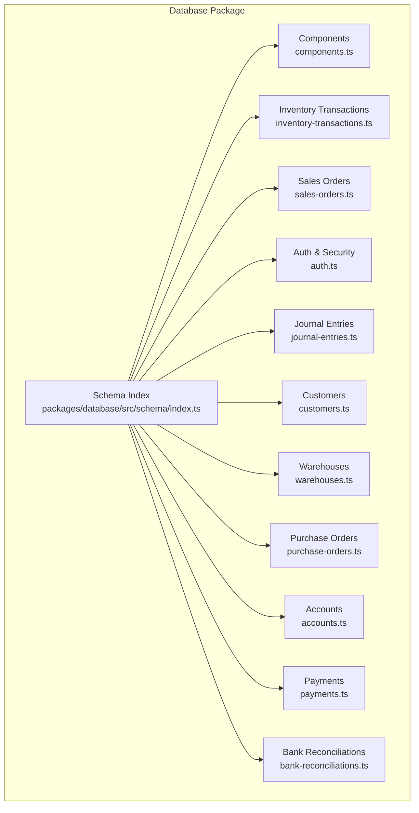
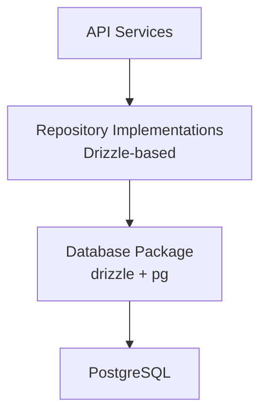
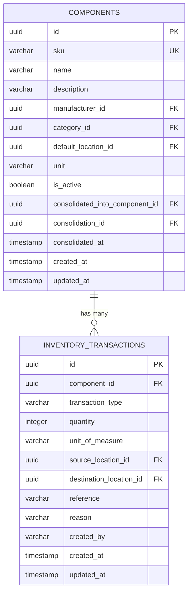
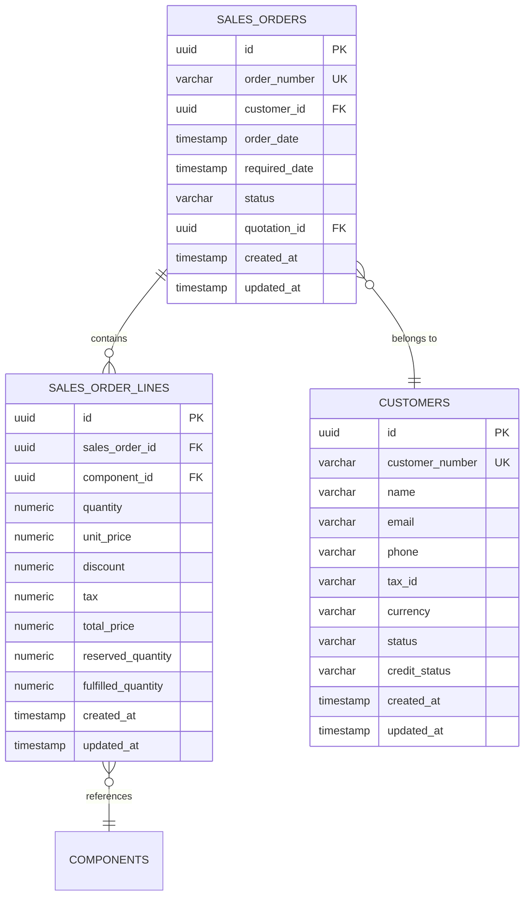
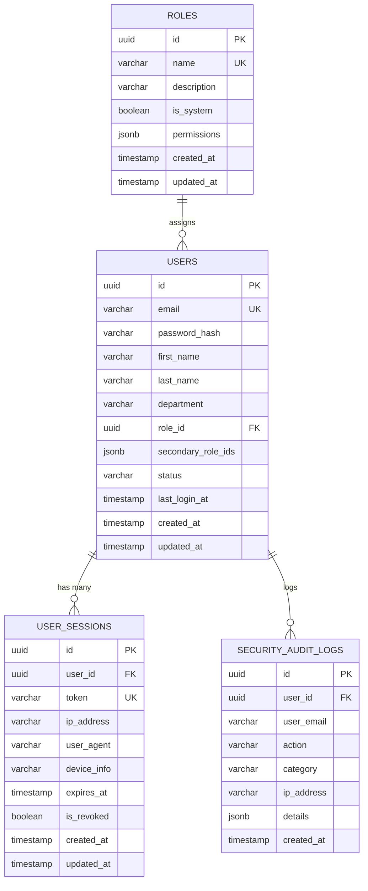
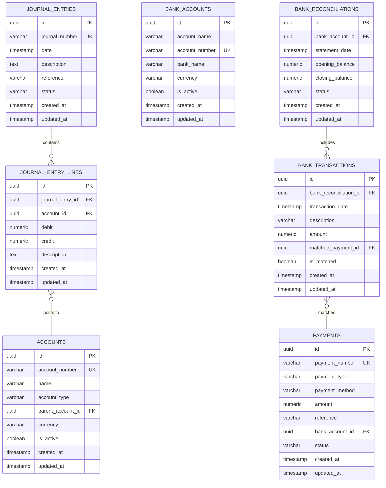
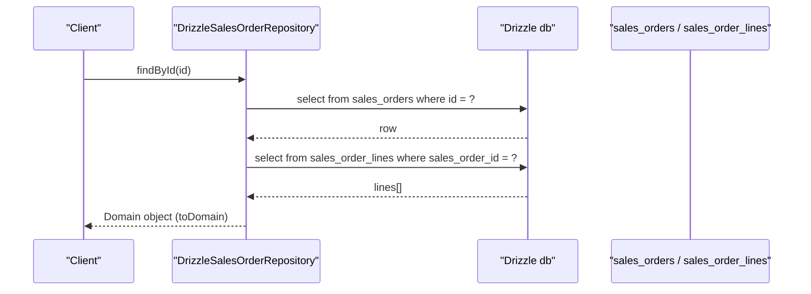
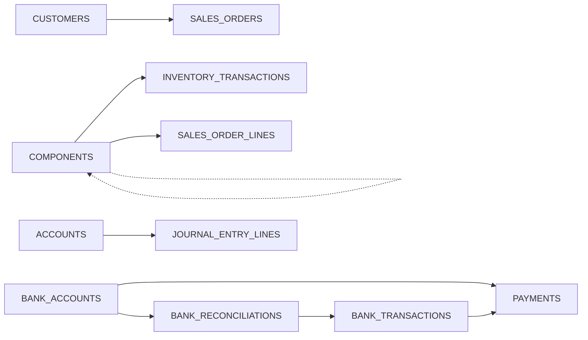

# Database Schema & Data Models

<cite>
**Referenced Files in This Document**
- [packages/database/src/schema/index.ts](file://packages/database/src/schema/index.ts)
- [packages/database/src/schema/components.ts](file://packages/database/src/schema/components.ts)
- [packages/database/src/schema/inventory-transactions.ts](file://packages/database/src/schema/inventory-transactions.ts)
- [packages/database/src/schema/sales-orders.ts](file://packages/database/src/schema/sales-orders.ts)
- [packages/database/src/schema/auth.ts](file://packages/database/src/schema/auth.ts)
- [packages/database/src/schema/journal-entries.ts](file://packages/database/src/schema/journal-entries.ts)
- [packages/database/src/schema/customers.ts](file://packages/database/src/schema/customers.ts)
- [packages/database/src/schema/warehouses.ts](file://packages/database/src/schema/warehouses.ts)
- [packages/database/src/schema/purchase-orders.ts](file://packages/database/src/schema/purchase-orders.ts)
- [packages/database/src/schema/accounts.ts](file://packages/database/src/schema/accounts.ts)
- [packages/database/src/schema/payments.ts](file://packages/database/src/schema/payments.ts)
- [packages/database/src/schema/bank-reconciliations.ts](file://packages/database/src/schema/bank-reconciliations.ts)
- [packages/database/src/index.ts](file://packages/database/src/index.ts)
- [packages/database/drizzle.config.ts](file://packages/database/drizzle.config.ts)
- [packages/database/src/setup/migrate.ts](file://packages/database/src/setup/migrate.ts)
- [apps/api/src/infrastructure/repositories/drizzle-sales-order.repository.ts](file://apps/api/src/infrastructure/repositories/drizzle-sales-order.repository.ts)
- [docs/database/README.md](file://docs/database/README.md)
</cite>

## Table of Contents
1. Introduction
2. Project Structure
3. Core Components
4. Architecture Overview
5. Detailed Component Analysis
6. Dependency Analysis
7. Performance Considerations
8. Troubleshooting Guide
9. Conclusion
10. Appendices

## Introduction
This document describes the PostgreSQL database schema and data models for Ananya ERP, focusing on entity relationships, field definitions, data types, keys, indexes, constraints, and validation rules across key domains: Components, Transactions, Orders, Users, and Financial records. It also explains how Drizzle ORM is used to access data, outlines repository patterns, and provides guidance on migrations, backups, performance tuning, data lifecycle, security, and privacy.

## Project Structure
The persistence layer is centralized in the database package. Schema files define tables, columns, constraints, and indexes using Drizzle’s PostgreSQL dialect. The package exposes a shared database client and pool, migration utilities, and an index that re-exports all domain schemas.

**Diagram sources**
- [packages/database/src/schema/index.ts:1-61](file://packages/database/src/schema/index.ts#L1-L61)

**Section sources**
- [docs/database/README.md:1-85](file://docs/database/README.md#L1-L85)
- [packages/database/src/schema/index.ts:1-61](file://packages/database/src/schema/index.ts#L1-L61)

## Core Components
This section summarizes the primary entities, their fields, types, keys, indexes, and constraints as defined in the schema files.

- Components
  - Primary key: id (UUID)
  - Unique: sku
  - Foreign keys: manufacturerId, categoryId, defaultLocationId (locations), consolidatedIntoComponentId (self-reference), consolidationId (consolidations)
  - Notable fields: name, description, unit, isActive, consolidatedIntoComponentId, consolidationId, consolidatedAt, createdAt, updatedAt
  - Indexes: sku unique, manufacturerId, categoryId, defaultLocationId, unit, consolidatedIntoComponentId, consolidationId, normalized MPN expression index, normalized name expression index
  - Validation notes: SKU uniqueness enforced; self-referential consolidation uses RESTRICT delete to preserve history; soft-delete via isActive and consolidation pointers

- Inventory Transactions
  - Primary key: id (UUID)
  - Foreign keys: componentId (components), sourceLocationId (locations), destinationLocationId (locations)
  - Fields: transactionType, quantity (integer), unitOfMeasure, reference, reason, createdBy, timestamps
  - Indexes: componentId, sourceLocationId, destinationLocationId, transactionType, createdAt
  - Validation notes: quantity is integer; foreign keys cascade or set null per referenced table behavior

- Sales Orders and Lines
  - sales_orders: id (UUID), orderNumber (unique), customerId (customers), orderDate, requiredDate, status (default DRAFT), quotationId (quotations), timestamps
  - sales_order_lines: id (UUID), salesOrderId (cascade), componentId (components), quantity (numeric), unitPrice (numeric), discount (numeric), tax (numeric), totalPrice (numeric), reservedQuantity (numeric), fulfilledQuantity (numeric), timestamps
  - Indexes: customer_id, status, lines by order_id and component_id
  - Validation notes: numeric precision for monetary values; status defaults to DRAFT

- Users, Roles, Sessions, Invitations, Audit Logs
  - roles: id, name (unique), description, isSystem, permissions (JSONB), timestamps
  - users: id, email (unique), passwordHash, firstName, lastName, department, roleId (roles), secondaryRoleIds (JSONB), status, lastLoginAt, timestamps
  - user_sessions: id, userId (users, cascade), token (unique), ipAddress, userAgent, deviceInfo, expiresAt, isRevoked, timestamps
  - password_reset_tokens: id, userId (users, cascade), token (unique), expiresAt, isUsed, createdAt
  - security_audit_logs: id, userId (users, set null), userEmail, action, category, ipAddress, details (JSONB), createdAt
  - user_invitations: id, email, roleId (roles, cascade), department, token (unique), expiresAt, status, invitedById (users, set null), createdAt
  - organization_setup_status: id, isCompleted, completedAt, completedById (users, set null), createdAt
  - Indexes: role membership, status, token uniqueness, audit log filters

- Journal Entries and Lines
  - journal_entries: id (UUID), journalNumber (unique), date, description, reference, status (default DRAFT), timestamps
  - journal_entry_lines: id (UUID), journalEntryId (cascade), accountId (accounts), debit (numeric), credit (numeric), description, timestamps
  - Indexes: status, date, lines by entry_id and account_id

- Customers and Contacts/Addresses
  - customers: id (UUID), customerNumber (unique), name, email, phone, taxId, currency (default INR), status (default DRAFT), creditStatus (default OK), timestamps
  - customer_contacts: id, customerId (cascade), name, email, phone, role, isPrimary, timestamps
  - customer_addresses: id, customerId (cascade), addressType (default BILLING), street1, street2, city, state, postalCode, country, isDefault, timestamps
  - Indexes: status, email, contacts/addresses by customer_id

- Warehouses, Zones, Bins
  - warehouses: id, code (unique), name, description, status (default ACTIVE), timestamps
  - warehouse_zones: id, warehouseId (cascade), code, name, timestamps
  - warehouse_bins: id, warehouseId (cascade), code (unique), capacity (decimal), currentUtilization (decimal), purpose (default STORAGE), isActive (default true), timestamps
  - Indexes: status, zones/bin by warehouse_id, bins by purpose

- Purchase Orders and Lines
  - purchase_orders: id, poNumber (unique), supplierId (suppliers), status (default DRAFT), currency (default INR), subtotal/taxTotal/grandTotal (decimal), notes, issuedAt, expectedDeliveryDate, trackingNumber, carrier, shippingProvider, trackingUrl, timestamps
  - purchase_order_lines: id, purchaseOrderId (cascade), componentId (components), vendorPartNumber, unitPrice (decimal), quantityOrdered (integer), quantityReceived (integer), taxRate (decimal), lineTotal (decimal), timestamps
  - Indexes: po_number unique, supplier_id, status, lines by po_id and component_id

- Accounts, Payments, Bank Reconciliations
  - accounts: id (UUID), accountNumber (unique), name, accountType, parentAccountId, currency (default INR), isActive (default true), timestamps
  - payments: id (UUID), paymentNumber (unique), paymentType, paymentMethod, amount (numeric), reference, bankAccountId (bank_accounts), status (default DRAFT), timestamps
  - bank_accounts: id (UUID), accountName, accountNumber (unique), bankName, currency (default INR), isActive (default true), timestamps
  - bank_reconciliations: id (UUID), bankAccountId (bank_accounts), statementDate, openingBalance (numeric), closingBalance (numeric), status (default IN_PROGRESS), timestamps
  - bank_transactions: id (UUID), bankReconciliationId (cascade), transactionDate, description, amount (numeric), matchedPaymentId (payments), isMatched (default false), timestamps
  - Indexes: account_type, is_active, payment_type, bank_account_id, status, reconciliation/account links

**Section sources**
- [packages/database/src/schema/components.ts:15-126](file://packages/database/src/schema/components.ts#L15-L126)
- [packages/database/src/schema/inventory-transactions.ts:12-74](file://packages/database/src/schema/inventory-transactions.ts#L12-L74)
- [packages/database/src/schema/sales-orders.ts:14-78](file://packages/database/src/schema/sales-orders.ts#L14-L78)
- [packages/database/src/schema/auth.ts:12-167](file://packages/database/src/schema/auth.ts#L12-L167)
- [packages/database/src/schema/journal-entries.ts:13-61](file://packages/database/src/schema/journal-entries.ts#L13-L61)
- [packages/database/src/schema/customers.ts:12-88](file://packages/database/src/schema/customers.ts#L12-L88)
- [packages/database/src/schema/warehouses.ts:13-84](file://packages/database/src/schema/warehouses.ts#L13-L84)
- [packages/database/src/schema/purchase-orders.ts:15-90](file://packages/database/src/schema/purchase-orders.ts#L15-L90)
- [packages/database/src/schema/accounts.ts:11-32](file://packages/database/src/schema/accounts.ts#L11-L32)
- [packages/database/src/schema/payments.ts:11-34](file://packages/database/src/schema/payments.ts#L11-L34)
- [packages/database/src/schema/bank-reconciliations.ts:13-92](file://packages/database/src/schema/bank-reconciliations.ts#L13-L92)

## Architecture Overview
Ananya uses PostgreSQL with Drizzle ORM. The database package defines schemas, manages migrations, and exposes a typed database client. Application services use repository implementations that query through Drizzle against these schemas.

**Diagram sources**
- [packages/database/src/index.ts:1-60](file://packages/database/src/index.ts#L1-L60)
- [apps/api/src/infrastructure/repositories/drizzle-sales-order.repository.ts:46-73](file://apps/api/src/infrastructure/repositories/drizzle-sales-order.repository.ts#L46-L73)

**Section sources**
- [docs/database/README.md:20-73](file://docs/database/README.md#L20-L73)
- [packages/database/src/index.ts:1-60](file://packages/database/src/index.ts#L1-L60)

## Detailed Component Analysis

### Components and Inventory Ledger
Components are master items with identity constraints (SKU unique) and optional consolidation into a canonical record. Inventory transactions record movements between locations tied to components.

**Diagram sources**
- [packages/database/src/schema/components.ts:28-126](file://packages/database/src/schema/components.ts#L28-L126)
- [packages/database/src/schema/inventory-transactions.ts:12-74](file://packages/database/src/schema/inventory-transactions.ts#L12-L74)

**Section sources**
- [packages/database/src/schema/components.ts:15-126](file://packages/database/src/schema/components.ts#L15-L126)
- [packages/database/src/schema/inventory-transactions.ts:12-74](file://packages/database/src/schema/inventory-transactions.ts#L12-L74)

### Sales Orders and Fulfillment
Sales orders link to customers and quotations, with line items referencing components and tracking quantities, pricing, discounts, taxes, reservations, and fulfillment progress.

**Diagram sources**
- [packages/database/src/schema/sales-orders.ts:14-78](file://packages/database/src/schema/sales-orders.ts#L14-L78)
- [packages/database/src/schema/customers.ts:12-39](file://packages/database/src/schema/customers.ts#L12-L39)
- [packages/database/src/schema/components.ts:28-126](file://packages/database/src/schema/components.ts#L28-L126)

**Section sources**
- [packages/database/src/schema/sales-orders.ts:14-78](file://packages/database/src/schema/sales-orders.ts#L14-L78)
- [packages/database/src/schema/customers.ts:12-39](file://packages/database/src/schema/customers.ts#L12-L39)

### Users, Roles, Sessions, and Audit
Authentication and authorization rely on roles, users, sessions, invitations, and audit logs. Sensitive tokens and hashes are stored securely; sessions track device and network context.

**Diagram sources**
- [packages/database/src/schema/auth.ts:12-167](file://packages/database/src/schema/auth.ts#L12-L167)

**Section sources**
- [packages/database/src/schema/auth.ts:12-167](file://packages/database/src/schema/auth.ts#L12-L167)

### Financial Records: Accounts, Journal Entries, Payments, Bank Reconciliations
Financial operations center around chart-of-accounts, double-entry journaling, payments, and bank reconciliation with matching to payments.

**Diagram sources**
- [packages/database/src/schema/accounts.ts:11-32](file://packages/database/src/schema/accounts.ts#L11-L32)
- [packages/database/src/schema/journal-entries.ts:13-61](file://packages/database/src/schema/journal-entries.ts#L13-L61)
- [packages/database/src/schema/payments.ts:11-34](file://packages/database/src/schema/payments.ts#L11-L34)
- [packages/database/src/schema/bank-reconciliations.ts:13-92](file://packages/database/src/schema/bank-reconciliations.ts#L13-L92)

**Section sources**
- [packages/database/src/schema/accounts.ts:11-32](file://packages/database/src/schema/accounts.ts#L11-L32)
- [packages/database/src/schema/journal-entries.ts:13-61](file://packages/database/src/schema/journal-entries.ts#L13-L61)
- [packages/database/src/schema/payments.ts:11-34](file://packages/database/src/schema/payments.ts#L11-L34)
- [packages/database/src/schema/bank-reconciliations.ts:13-92](file://packages/database/src/schema/bank-reconciliations.ts#L13-L92)

### Data Access Patterns with Drizzle ORM
Repositories implement domain interfaces using Drizzle queries. For example, sales order retrieval composes header and line reads and maps to domain objects.

**Diagram sources**
- [apps/api/src/infrastructure/repositories/drizzle-sales-order.repository.ts:46-73](file://apps/api/src/infrastructure/repositories/drizzle-sales-order.repository.ts#L46-L73)
- [packages/database/src/schema/sales-orders.ts:14-78](file://packages/database/src/schema/sales-orders.ts#L14-L78)

**Section sources**
- [apps/api/src/infrastructure/repositories/drizzle-sales-order.repository.ts:46-73](file://apps/api/src/infrastructure/repositories/drizzle-sales-order.repository.ts#L46-L73)

## Dependency Analysis
Schema dependencies are explicit via foreign keys and references. Key relationships include:
- Components referenced by inventory transactions and order lines
- Customers referenced by sales orders
- Accounts referenced by journal entry lines
- Bank accounts referenced by payments and reconciliations
- Self-referential consolidation in components

**Diagram sources**
- [packages/database/src/schema/components.ts:28-126](file://packages/database/src/schema/components.ts#L28-L126)
- [packages/database/src/schema/inventory-transactions.ts:12-74](file://packages/database/src/schema/inventory-transactions.ts#L12-L74)
- [packages/database/src/schema/sales-orders.ts:14-78](file://packages/database/src/schema/sales-orders.ts#L14-L78)
- [packages/database/src/schema/journal-entries.ts:13-61](file://packages/database/src/schema/journal-entries.ts#L13-L61)
- [packages/database/src/schema/payments.ts:11-34](file://packages/database/src/schema/payments.ts#L11-L34)
- [packages/database/src/schema/bank-reconciliations.ts:13-92](file://packages/database/src/schema/bank-reconciliations.ts#L13-L92)

**Section sources**
- [packages/database/src/schema/index.ts:1-61](file://packages/database/src/schema/index.ts#L1-L61)

## Performance Considerations
- Indexing strategy
  - Use existing indexes for common filters: status, dates, foreign keys, and business keys (e.g., order_number, po_number, account_number).
  - Expression indexes support normalized lookups for duplicate detection (MPN and name normalization).
- Query optimization
  - Prefer selective WHERE clauses leveraging indexes.
  - Avoid SELECT *; fetch only needed columns.
  - Use pagination and limit for large result sets.
- Transactional integrity
  - Keep writes short and grouped within transactions to reduce lock contention.
- Storage considerations
  - Numeric precision chosen for financial fields prevents rounding errors but increases storage; ensure appropriate indexing strategies for range queries.
- Monitoring
  - Monitor slow queries and adjust indexes based on actual usage patterns.

[No sources needed since this section provides general guidance]

## Troubleshooting Guide
- Migration failures
  - Ensure DATABASE_URL is configured before running migrations.
  - Use the provided migration runner to apply changes and handle errors gracefully.
- Connection issues
  - Verify the database pool is initialized and closed properly to avoid resource leaks.
- Common schema errors
  - Unique constraint violations (e.g., SKU, order numbers, account numbers) indicate duplicate inputs; validate at application layer.
  - Foreign key violations suggest referential integrity issues; ensure related records exist before inserts.

**Section sources**
- [packages/database/drizzle.config.ts:1-23](file://packages/database/drizzle.config.ts#L1-L23)
- [packages/database/src/setup/migrate.ts:1-21](file://packages/database/src/setup/migrate.ts#L1-L21)
- [packages/database/src/index.ts:1-60](file://packages/database/src/index.ts#L1-L60)

## Conclusion
Ananya’s database schema is modeled with clear relational boundaries, strong constraints, and targeted indexes to support high-performance operations across inventory, sales, procurement, finance, and security domains. Drizzle ORM provides type-safe access, while repositories encapsulate data access patterns. Migrations manage evolution safely, and the design supports future enhancements such as projections and reporting models.

[No sources needed since this section summarizes without analyzing specific files]

## Appendices

### Data Lifecycle, Retention, and Archival
- Soft deletes and archival
  - Components use isActive and consolidation pointers to retain historical identity without hard deletion.
- Session and token retention
  - User sessions and password reset tokens have expiration fields; implement periodic cleanup jobs to remove expired entries.
- Audit logs
  - Security audit logs capture actions; consider retention policies and archival to cold storage for compliance.
- Financial records
  - Journal entries and reconciliations are immutable once posted; maintain long-term retention for accounting compliance.

[No sources needed since this section provides general guidance]

### Security, Privacy, and Access Control
- Authentication and authorization
  - Passwords stored as hashes; roles and permissions control access.
  - Sessions track device and IP context; support revocation.
- Auditability
  - Security audit logs record actions with contextual metadata.
- Data minimization
  - Store only necessary PII; mask or tokenize sensitive fields where possible.
- Encryption
  - Use TLS for connections; encrypt sensitive data at rest if required by policy.

**Section sources**
- [packages/database/src/schema/auth.ts:12-167](file://packages/database/src/schema/auth.ts#L12-L167)

### Migrations, Backup, and Recovery
- Migrations
  - Drizzle-managed migrations under packages/database/drizzle; run via the migration utility.
- Backups
  - Schedule regular logical backups (e.g., pg_dump) and point-in-time recovery setups.
- Disaster recovery
  - Test restore procedures regularly; maintain offsite copies.

**Section sources**
- [packages/database/src/setup/migrate.ts:1-21](file://packages/database/src/setup/migrate.ts#L1-L21)
- [packages/database/drizzle.config.ts:1-23](file://packages/database/drizzle.config.ts#L1-L23)