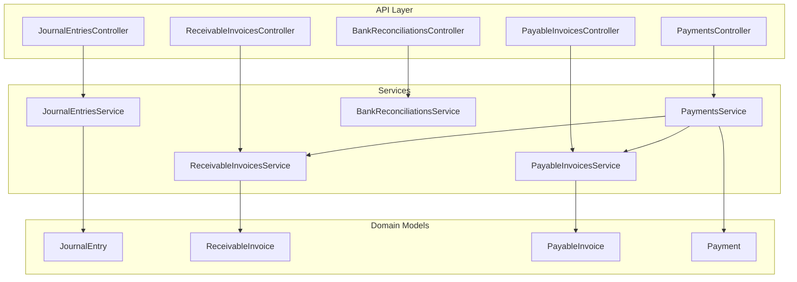
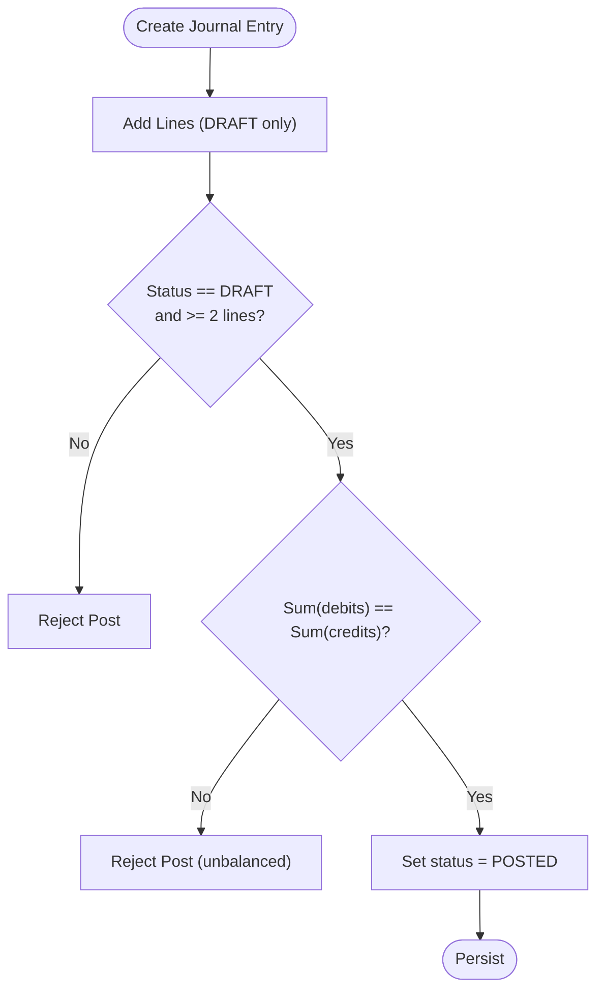
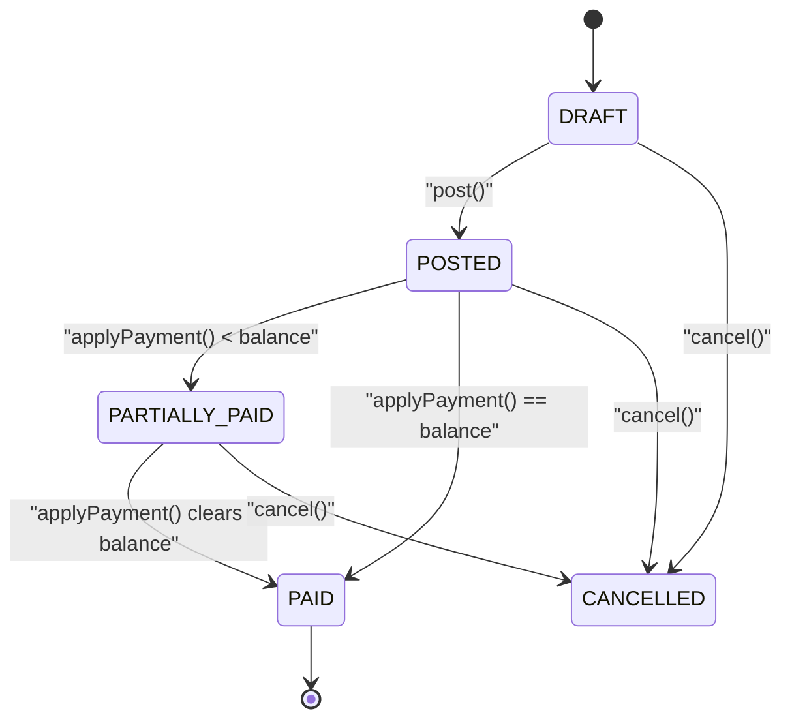
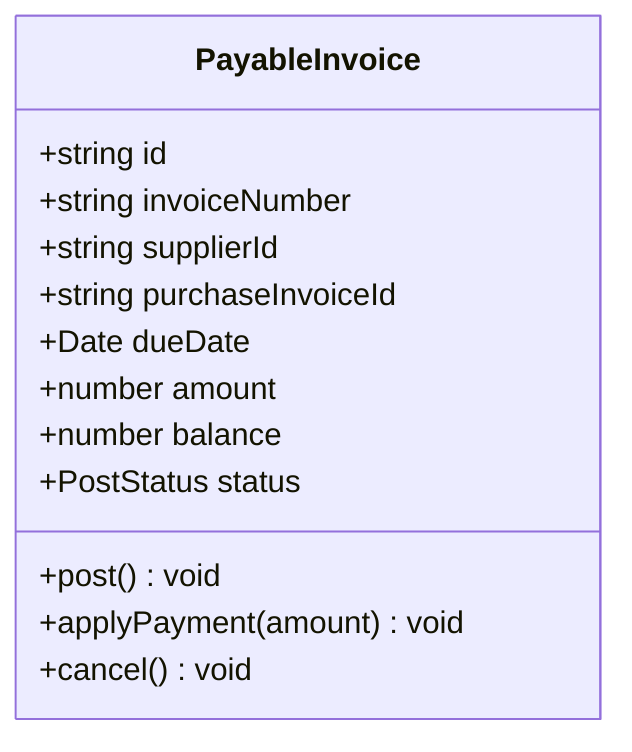
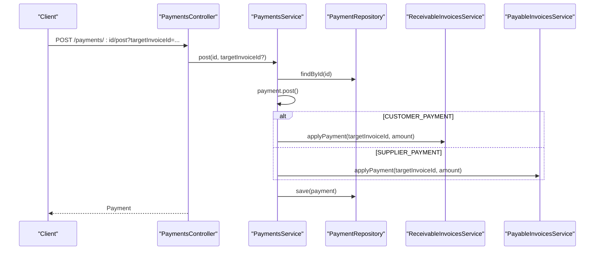
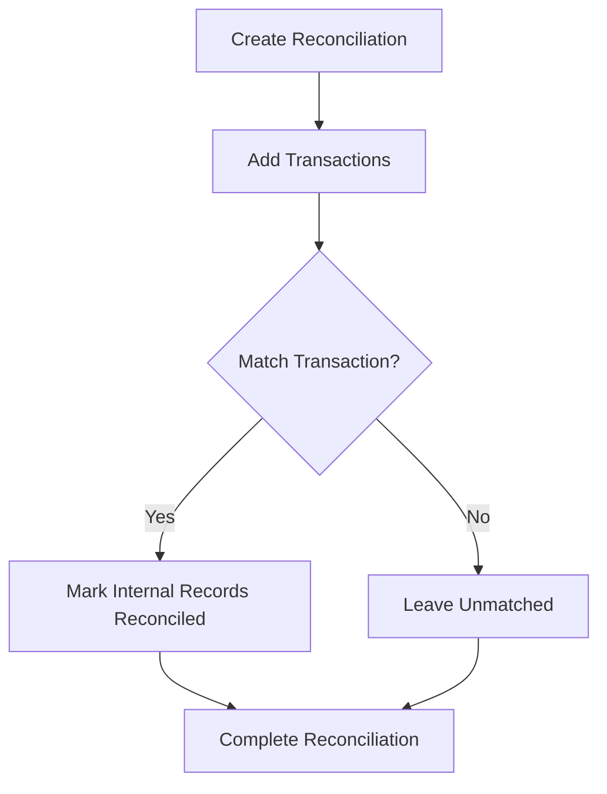
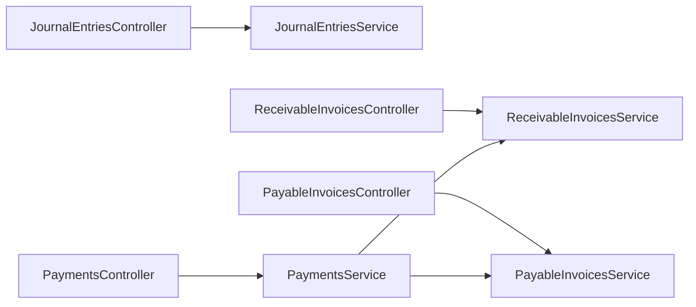

# Finance & Accounting Schema

<cite>
**Referenced Files in This Document**
- [journal-entries.controller.ts](file://apps/api/src/journal-entries/journal-entries.controller.ts)
- [journal-entries.service.ts](file://apps/api/src/journal-entries/journal-entries.service.ts)
- [receivable-invoices.controller.ts](file://apps/api/src/receivable-invoices/receivable-invoices.controller.ts)
- [receivable-invoices.service.ts](file://apps/api/src/receivable-invoices/receivable-invoices.service.ts)
- [payable-invoices.controller.ts](file://apps/api/src/payable-invoices/payable-invoices.controller.ts)
- [payable-invoices.service.ts](file://apps/api/src/payable-invoices/payable-invoices.service.ts)
- [payments.controller.ts](file://apps/api/src/payments/payments.controller.ts)
- [payments.service.ts](file://apps/api/src/payments/payments.service.ts)
- [bank-reconciliations.controller.ts](file://apps/api/src/bank-reconciliations/bank-reconciliations.controller.ts)
- [journal-entry.ts](file://packages/finance/src/journals/journal-entry.ts)
- [receivable-invoice.ts](file://packages/finance/src/receivables/receivable-invoice.ts)
- [payable-invoice.ts](file://packages/finance/src/payables/payable-invoice.ts)
- [payment.ts](file://packages/finance/src/payments/payment.ts)
</cite>

## Table of Contents
1. Introduction
2. Project Structure
3. Core Components
4. Architecture Overview
5. Detailed Component Analysis
6. Dependency Analysis
7. Performance Considerations
8. Troubleshooting Guide
9. Conclusion

## Introduction
This document describes the finance and accounting schema with a focus on double-entry journaling, accounts receivable, accounts payable, payment processing, and bank reconciliation. It explains how invoices are created, posted, and settled; how payments are recorded and optionally auto-applied to invoices; and how bank reconciliations match transactions to internal records. It also outlines data structures for financial reporting and audit trails, and highlights controls such as state transitions and validation rules that support segregation of duties and compliance.

## Project Structure
The finance domain is implemented across:
- API layer (controllers and services) exposing REST endpoints for journals, invoices, payments, and reconciliations
- Domain models in the finance package defining entities, statuses, and business rules
- Repository abstractions injected into services for persistence and number generation



**Diagram sources**
- [journal-entries.controller.ts:6-46](file://apps/api/src/journal-entries/journal-entries.controller.ts#L6-L46)
- [journal-entries.service.ts:11-73](file://apps/api/src/journal-entries/journal-entries.service.ts#L11-L73)
- [receivable-invoices.controller.ts:6-37](file://apps/api/src/receivable-invoices/receivable-invoices.controller.ts#L6-L37)
- [receivable-invoices.service.ts:11-77](file://apps/api/src/receivable-invoices/receivable-invoices.service.ts#L11-L77)
- [payable-invoices.controller.ts:6-37](file://apps/api/src/payable-invoices/payable-invoices.controller.ts#L6-L37)
- [payable-invoices.service.ts:11-75](file://apps/api/src/payable-invoices/payable-invoices.service.ts#L11-L75)
- [payments.controller.ts:6-40](file://apps/api/src/payments/payments.controller.ts#L6-L40)
- [payments.service.ts:14-87](file://apps/api/src/payments/payments.service.ts#L14-L87)
- [bank-reconciliations.controller.ts:10-45](file://apps/api/src/bank-reconciliations/bank-reconciliations.controller.ts#L10-L45)

**Section sources**
- [journal-entries.controller.ts:6-46](file://apps/api/src/journal-entries/journal-entries.controller.ts#L6-L46)
- [journal-entries.service.ts:11-73](file://apps/api/src/journal-entries/journal-entries.service.ts#L11-L73)
- [receivable-invoices.controller.ts:6-37](file://apps/api/src/receivable-invoices/receivable-invoices.controller.ts#L6-L37)
- [receivable-invoices.service.ts:11-77](file://apps/api/src/receivable-invoices/receivable-invoices.service.ts#L11-L77)
- [payable-invoices.controller.ts:6-37](file://apps/api/src/payable-invoices/payable-invoices.controller.ts#L6-L37)
- [payable-invoices.service.ts:11-75](file://apps/api/src/payable-invoices/payable-invoices.service.ts#L11-L75)
- [payments.controller.ts:6-40](file://apps/api/src/payments/payments.controller.ts#L6-L40)
- [payments.service.ts:14-87](file://apps/api/src/payments/payments.service.ts#L14-L87)
- [bank-reconciliations.controller.ts:10-45](file://apps/api/src/bank-reconciliations/bank-reconciliations.controller.ts#L10-L45)

## Core Components
- Journal Entries: Double-entry ledger with lines, status lifecycle, and balance enforcement at post time.
- Accounts Receivable: Customer invoices with posting, payment application, and cancellation rules.
- Accounts Payable: Supplier invoices with posting, payment application, and cancellation rules.
- Payments: Record inflows/outflows, optional auto-allocation to invoices, and reconciliation state.
- Bank Reconciliation: Create reconciliation sessions, add bank transactions, match to internal records, and complete.

Key responsibilities:
- Controllers expose REST endpoints for CRUD and workflow actions (create, find, post, cancel, reverse, void).
- Services orchestrate domain logic, call repositories for persistence and numbering, and enforce invariants via domain models.
- Domain models encapsulate business rules, state transitions, and validations.

**Section sources**
- [journal-entries.controller.ts:10-46](file://apps/api/src/journal-entries/journal-entries.controller.ts#L10-L46)
- [journal-entries.service.ts:18-73](file://apps/api/src/journal-entries/journal-entries.service.ts#L18-L73)
- [receivable-invoices.controller.ts:10-37](file://apps/api/src/receivable-invoices/receivable-invoices.controller.ts#L10-L37)
- [receivable-invoices.service.ts:18-77](file://apps/api/src/receivable-invoices/receivable-invoices.service.ts#L18-L77)
- [payable-invoices.controller.ts:10-37](file://apps/api/src/payable-invoices/payable-invoices.controller.ts#L10-L37)
- [payable-invoices.service.ts:18-75](file://apps/api/src/payable-invoices/payable-invoices.service.ts#L18-L75)
- [payments.controller.ts:10-40](file://apps/api/src/payments/payments.controller.ts#L10-L40)
- [payments.service.ts:23-87](file://apps/api/src/payments/payments.service.ts#L23-L87)
- [bank-reconciliations.controller.ts:14-45](file://apps/api/src/bank-reconciliations/bank-reconciliations.controller.ts#L14-L45)

## Architecture Overview
The system follows a layered architecture:
- API controllers receive HTTP requests and delegate to services
- Services coordinate domain operations and repository calls
- Domain models enforce business invariants and manage state transitions
- Repositories abstract persistence and sequence generation

```mermaid
sequenceDiagram
participant Client as "Client"
participant PayCtrl as "PaymentsController"
participant PaySvc as "PaymentsService"
participant Repo as "PaymentRepository"
participant RSvc as "ReceivableInvoicesService"
participant PSvc as "PayableInvoicesService"
Client->>PayCtrl : POST /payments
PayCtrl->>PaySvc : create(dto)
PaySvc->>Repo : generateNextPaymentNumber()
PaySvc->>Repo : save(payment)
Client->>PayCtrl : POST /payments/ : id/post?targetInvoiceId=...
PayCtrl->>PaySvc : post(id, targetInvoiceId?)
PaySvc->>Repo : findById(id)
PaySvc->>PaySvc : payment.post()
alt target invoice provided and type matches
PaySvc->>RSvc : applyPayment(invoiceId, amount)
or
PaySvc->>PSvc : applyPayment(invoiceId, amount)
end
PaySvc->>Repo : save(payment)
PayCtrl-->>Client : Payment
```

**Diagram sources**
- [payments.controller.ts:10-40](file://apps/api/src/payments/payments.controller.ts#L10-L40)
- [payments.service.ts:23-87](file://apps/api/src/payments/payments.service.ts#L23-L87)
- [receivable-invoices.service.ts:61-68](file://apps/api/src/receivable-invoices/receivable-invoices.service.ts#L61-L68)
- [payable-invoices.service.ts:59-66](file://apps/api/src/payable-invoices/payable-invoices.service.ts#L59-L66)

## Detailed Component Analysis

### Journal Entries (Double-Entry Ledger)
- Data model: JournalEntry with lines containing accountId, debit, credit, and timestamps. Statuses include DRAFT, POSTED, REVERSED, VOID.
- Business rules:
  - Lines can be added only in DRAFT
  - Debit and credit must be non-negative and at least one positive per line
  - Posting requires at least two lines and balanced totals (debits equal credits within tolerance)
  - Only POSTED entries can be reversed; only DRAFT entries can be voided
- API:
  - Create, add lines, post, reverse, void, and query by status/search



**Diagram sources**
- [journal-entry.ts:91-156](file://packages/finance/src/journals/journal-entry.ts#L91-L156)
- [journal-entries.service.ts:46-71](file://apps/api/src/journal-entries/journal-entries.service.ts#L46-L71)

**Section sources**
- [journal-entry.ts:3-156](file://packages/finance/src/journals/journal-entry.ts#L3-L156)
- [journal-entries.controller.ts:10-46](file://apps/api/src/journal-entries/journal-entries.controller.ts#L10-L46)
- [journal-entries.service.ts:18-73](file://apps/api/src/journal-entries/journal-entries.service.ts#L18-L73)

### Accounts Receivable
- Data model: ReceivableInvoice with customer, sales order link, due date, amount, running balance, and status (DRAFT, POSTED, PARTIALLY_PAID, PAID, CANCELLED).
- Business rules:
  - Amount must be positive on creation
  - Posting transitions from DRAFT to POSTED
  - Payment application reduces balance and updates status accordingly; cannot exceed remaining balance
  - Paid invoices cannot be cancelled
- API:
  - Create, find, post, apply payment, cancel



**Diagram sources**
- [receivable-invoice.ts:3-111](file://packages/finance/src/receivables/receivable-invoice.ts#L3-L111)
- [receivable-invoices.service.ts:18-77](file://apps/api/src/receivable-invoices/receivable-invoices.service.ts#L18-L77)

**Section sources**
- [receivable-invoice.ts:3-111](file://packages/finance/src/receivables/receivable-invoice.ts#L3-L111)
- [receivable-invoices.controller.ts:10-37](file://apps/api/src/receivable-invoices/receivable-invoices.controller.ts#L10-L37)
- [receivable-invoices.service.ts:18-77](file://apps/api/src/receivable-invoices/receivable-invoices.service.ts#L18-L77)

### Accounts Payable
- Data model: PayableInvoice with supplier, purchase invoice link, due date, amount, running balance, and status (DRAFT, POSTED, PARTIALLY_PAID, PAID, CANCELLED).
- Business rules mirror receivables: positive amounts, posting, payment application, and cancellation constraints.
- API:
  - Create, find, post, apply payment, cancel



**Diagram sources**
- [payable-invoice.ts:3-111](file://packages/finance/src/payables/payable-invoice.ts#L3-L111)

**Section sources**
- [payable-invoice.ts:3-111](file://packages/finance/src/payables/payable-invoice.ts#L3-L111)
- [payable-invoices.controller.ts:10-37](file://apps/api/src/payable-invoices/payable-invoices.controller.ts#L10-L37)
- [payable-invoices.service.ts:18-75](file://apps/api/src/payable-invoices/payable-invoices.service.ts#L18-L75)

### Payment Processing
- Data model: Payment with type (customer/supplier/internal/refund), method, amount, reference, bank account, and status (DRAFT, POSTED, RECONCILED, CANCELLED).
- Business rules:
  - Positive amount required
  - Posting transitions from DRAFT to POSTED
  - Mark reconciled only when POSTED
  - Cannot cancel if already RECONCILED
- Auto-allocation:
  - On post, if a target invoice ID is provided, automatically applies the payment to the corresponding receivable or payable invoice based on payment type



**Diagram sources**
- [payments.controller.ts:29-35](file://apps/api/src/payments/payments.controller.ts#L29-L35)
- [payments.service.ts:58-79](file://apps/api/src/payments/payments.service.ts#L58-L79)
- [receivable-invoices.service.ts:61-68](file://apps/api/src/receivable-invoices/receivable-invoices.service.ts#L61-L68)
- [payable-invoices.service.ts:59-66](file://apps/api/src/payable-invoices/payable-invoices.service.ts#L59-L66)

**Section sources**
- [payment.ts:3-105](file://packages/finance/src/payments/payment.ts#L3-L105)
- [payments.controller.ts:10-40](file://apps/api/src/payments/payments.controller.ts#L10-L40)
- [payments.service.ts:23-87](file://apps/api/src/payments/payments.service.ts#L23-L87)

### Bank Reconciliation
- Workflow:
  - Create a reconciliation session for a bank account
  - Add bank transactions (from statements or feeds)
  - Match transactions to internal records (e.g., posted payments)
  - Complete reconciliation once matched
- API:
  - Create, find, add transaction, match transaction, complete



**Diagram sources**
- [bank-reconciliations.controller.ts:14-45](file://apps/api/src/bank-reconciliations/bank-reconciliations.controller.ts#L14-L45)

**Section sources**
- [bank-reconciliations.controller.ts:10-45](file://apps/api/src/bank-reconciliations/bank-reconciliations.controller.ts#L10-L45)

## Dependency Analysis
- Controller-to-service coupling: Each controller depends on a single service for its feature area, promoting cohesion.
- Service-to-domain coupling: Services depend on domain models for business rules and on repositories for persistence and sequencing.
- Cross-service dependency: PaymentsService depends on ReceivableInvoicesService and PayableInvoicesService to auto-allocate payments.
- Number generation: Services request next numbers from repositories before creating entities, ensuring unique identifiers.



**Diagram sources**
- [journal-entries.controller.ts:6-46](file://apps/api/src/journal-entries/journal-entries.controller.ts#L6-L46)
- [receivable-invoices.controller.ts:6-37](file://apps/api/src/receivable-invoices/receivable-invoices.controller.ts#L6-L37)
- [payable-invoices.controller.ts:6-37](file://apps/api/src/payable-invoices/payable-invoices.controller.ts#L6-L37)
- [payments.controller.ts:6-40](file://apps/api/src/payments/payments.controller.ts#L6-L40)
- [payments.service.ts:14-21](file://apps/api/src/payments/payments.service.ts#L14-L21)

**Section sources**
- [payments.service.ts:14-21](file://apps/api/src/payments/payments.service.ts#L14-L21)

## Performance Considerations
- Use repository-level filtering and search parameters to minimize payload sizes (e.g., filter by status, IDs).
- Batch operations where possible (e.g., adding multiple journal lines before posting).
- Avoid unnecessary re-fetches by caching read-only lookups in short-lived scopes.
- Ensure database indexes on frequently queried fields such as status, foreign keys, and dates.

[No sources needed since this section provides general guidance]

## Troubleshooting Guide
Common errors and their causes:
- Invalid state transitions: Attempting to post, reverse, void, or cancel an entity in an incompatible state will throw an error. Validate current status before invoking actions.
- Unbalanced journal entry: Posting requires equal total debits and credits; verify all lines sum correctly.
- Overpayment: Applying more than the remaining invoice balance is rejected; ensure partial payments do not exceed outstanding amounts.
- Reconciliation constraints: Only POSTED payments can be marked reconciled; confirm payment status prior to marking.

Operational checks:
- Verify that number generation succeeded before saving entities.
- Confirm references (e.g., targetInvoiceId) exist and match expected types before auto-allocation.

**Section sources**
- [journal-entry.ts:91-156](file://packages/finance/src/journals/journal-entry.ts#L91-L156)
- [receivable-invoice.ts:76-111](file://packages/finance/src/receivables/receivable-invoice.ts#L76-L111)
- [payable-invoice.ts:76-111](file://packages/finance/src/payables/payable-invoice.ts#L76-L111)
- [payment.ts:82-105](file://packages/finance/src/payments/payment.ts#L82-L105)

## Conclusion
The finance module implements a robust double-entry system with clear state machines for journals, invoices, and payments. Automated payment allocation streamlines settlement workflows, while bank reconciliation supports matching and completion. The design emphasizes strong invariants, explicit state transitions, and separation of concerns between API, services, and domain models, providing a solid foundation for financial reporting, auditability, and compliance.

[No sources needed since this section summarizes without analyzing specific files]