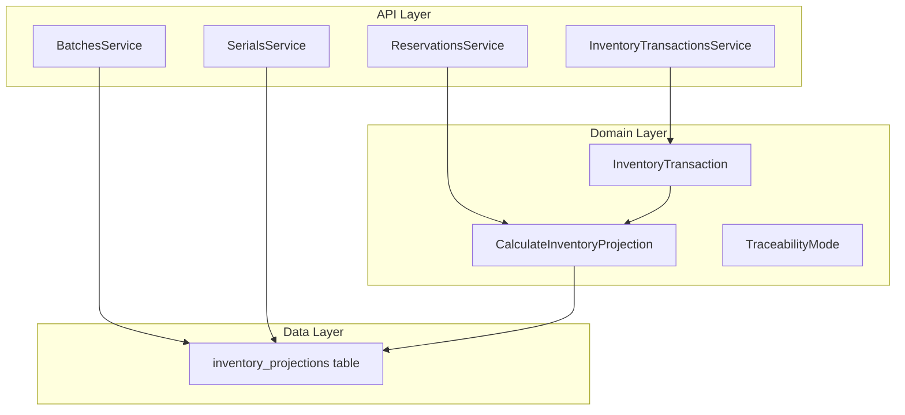
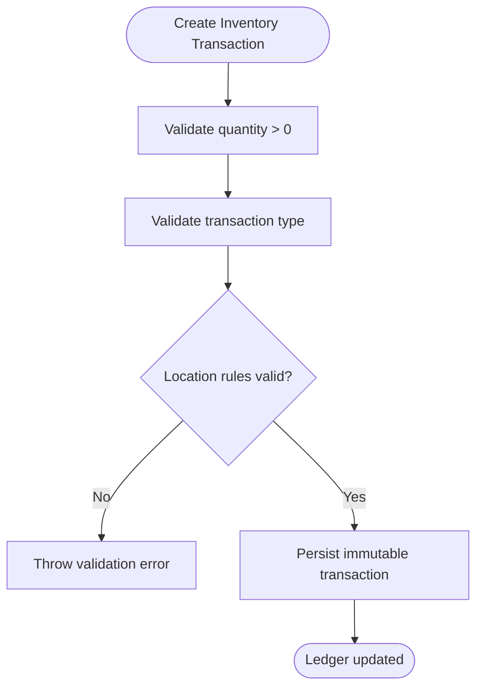
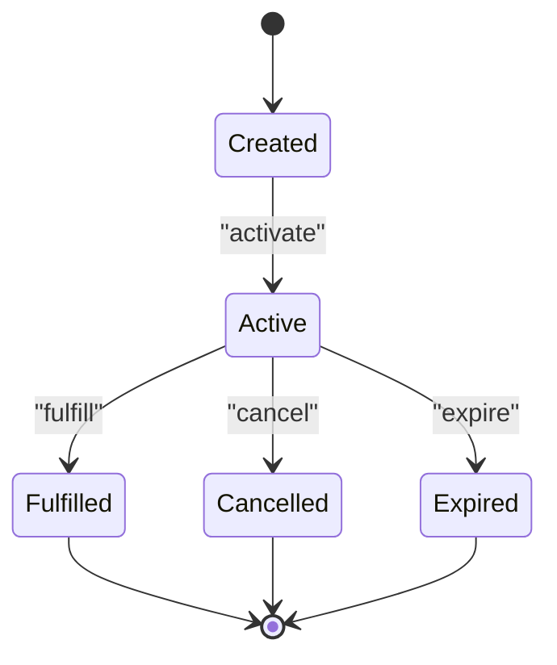
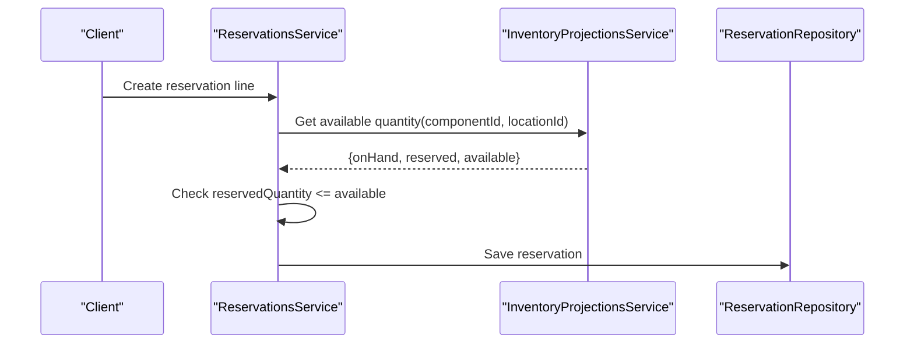
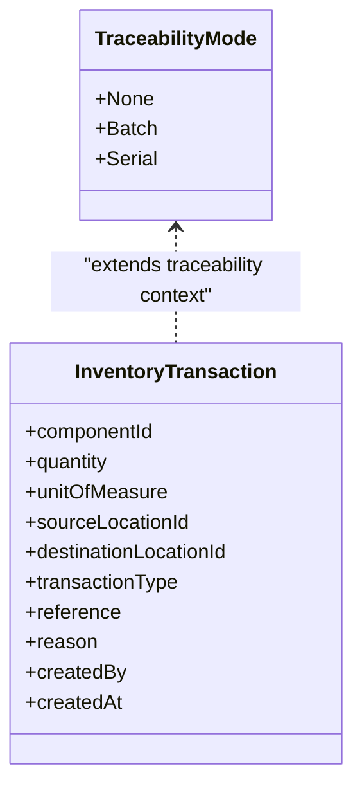
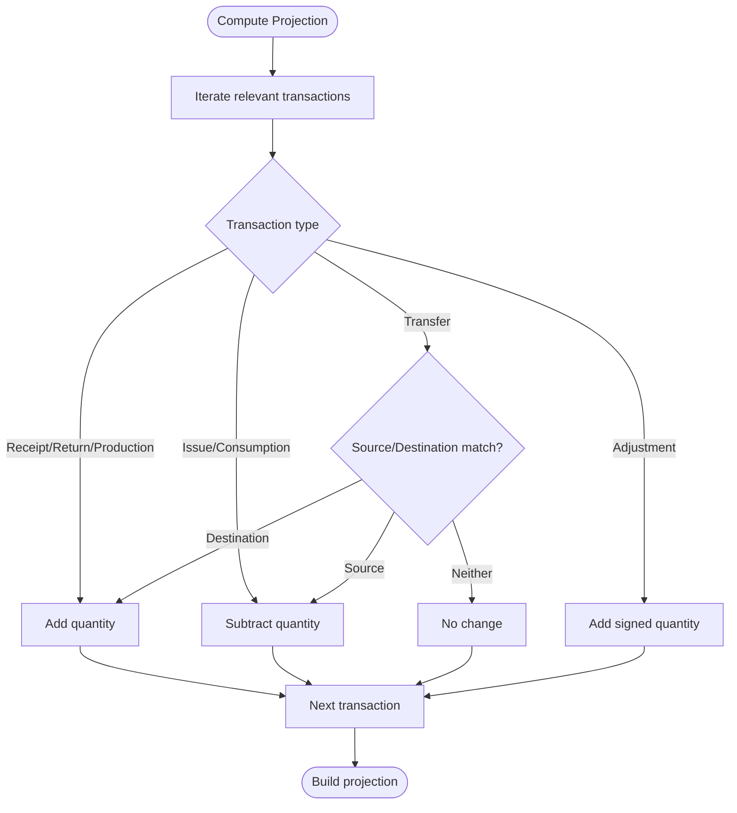
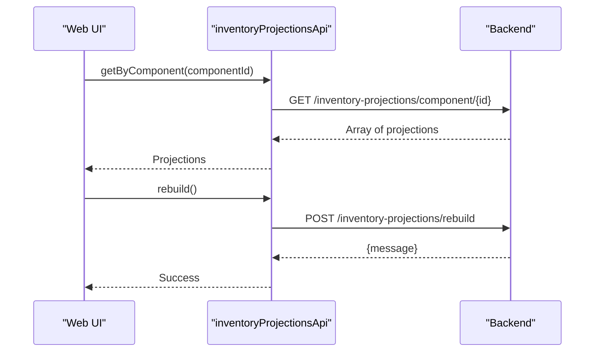
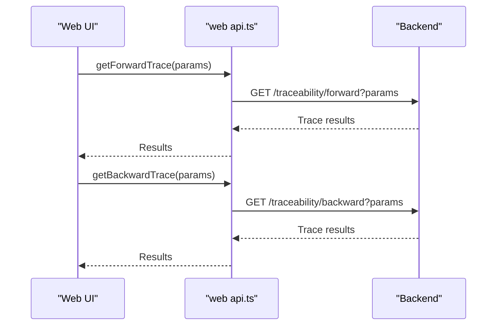
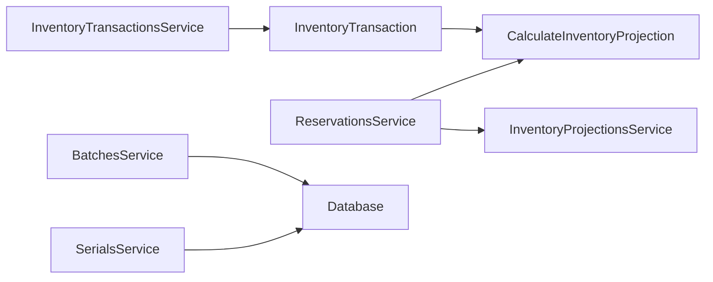

# Inventory Management Schema

<cite>
**Referenced Files in This Document**
- [0003-inventory-ledger.md](file://docs/rfcs/0003-inventory-ledger.md)
- [0007-batch-and-serial-tracking.md](file://docs/rfcs/0007-batch-and-serial-tracking.md)
- [0008-inventory-reservations.md](file://docs/rfcs/0008-inventory-reservations.md)
- [inventory-transactions.service.ts](file://apps/api/src/inventory-transactions/inventory-transactions.service.ts)
- [reservations.service.ts](file://apps/api/src/reservations/reservations.service.ts)
- [batches.service.ts](file://apps/api/src/batches/batches.service.ts)
- [serials.service.ts](file://apps/api/src/serials/serials.service.ts)
- [inventory-transaction.ts](file://packages/inventory/src/ledger/inventory-transaction.ts)
- [calculate-inventory-projection.ts](file://packages/inventory/src/projection/calculate-inventory-projection.ts)
- [inventory-projections.ts](file://packages/database/src/schema/inventory-projections.ts)
- [traceability.ts](file://packages/inventory/src/components/traceability.ts)
- [api.ts](file://apps/web/src/lib/api.ts)
- [inventory-projections-api.ts](file://apps/web/lib/api/inventory-projections-api.ts)
</cite>

## Table of Contents
1. [Introduction](#introduction)
2. [Project Structure](#project-structure)
3. [Core Components](#core-components)
4. [Architecture Overview](#architecture-overview)
5. [Detailed Component Analysis](#detailed-component-analysis)
6. [Dependency Analysis](#dependency-analysis)
7. [Performance Considerations](#performance-considerations)
8. [Troubleshooting Guide](#troubleshooting-guide)
9. [Conclusion](#conclusion)

## Introduction
This document defines the inventory management schema and operational model for a double-entry inventory system. It covers:
- Transaction ledger design, transaction types, quantities, and audit trails
- Reservation mechanisms for stock allocation and fulfillment
- Batch and serial number tracking for traceability
- Inventory projection calculations and forecasting interfaces
- Query optimization strategies for high-frequency operations
- Data consistency, concurrency control, and performance tuning guidance

The system separates immutable history (ledger) from derived state (projections), ensuring deterministic, auditable inventory accounting.

## Project Structure
Inventory functionality spans API services, domain models, projections, database schemas, and web APIs:
- Domain models define transactions, reservations, batches, and serials
- API services enforce business rules and orchestrate persistence
- Projections compute current on-hand, reserved, and available quantities
- Database schemas provide optimized storage and indexes
- Web APIs expose query endpoints for projections and traceability



**Diagram sources**
- [inventory-transactions.service.ts:19-31](file://apps/api/src/inventory-transactions/inventory-transactions.service.ts#L19-L31)
- [reservations.service.ts:27-70](file://apps/api/src/reservations/reservations.service.ts#L27-L70)
- [batches.service.ts:19-22](file://apps/api/src/batches/batches.service.ts#L19-L22)
- [serials.service.ts:19-22](file://apps/api/src/serials/serials.service.ts#L19-L22)
- [inventory-transaction.ts:53-155](file://packages/inventory/src/ledger/inventory-transaction.ts#L53-L155)
- [calculate-inventory-projection.ts:37-92](file://packages/inventory/src/projection/calculate-inventory-projection.ts#L37-L92)
- [inventory-projections.ts:13-47](file://packages/database/src/schema/inventory-projections.ts#L13-L47)

**Section sources**
- [inventory-transactions.service.ts:19-31](file://apps/api/src/inventory-transactions/inventory-transactions.service.ts#L19-L31)
- [reservations.service.ts:27-70](file://apps/api/src/reservations/reservations.service.ts#L27-L70)
- [batches.service.ts:19-22](file://apps/api/src/batches/batches.service.ts#L19-L22)
- [serials.service.ts:19-22](file://apps/api/src/serials/serials.service.ts#L19-L22)
- [inventory-transaction.ts:53-155](file://packages/inventory/src/ledger/inventory-transaction.ts#L53-L155)
- [calculate-inventory-projection.ts:37-92](file://packages/inventory/src/projection/calculate-inventory-projection.ts#L37-L92)
- [inventory-projections.ts:13-47](file://packages/database/src/schema/inventory-projections.ts#L13-L47)

## Core Components
- Double-entry inventory ledger with immutable transactions
- Reservation lifecycle managing allocation and fulfillment
- Batch and serial tracking for traceability
- Inventory projections for fast reads and availability checks
- Web APIs for projections and traceability queries

Key responsibilities:
- Ledger records all movements; inventory is derived via projections
- Reservations allocate without mutating inventory until fulfillment
- Batches and serials extend transactions to support traceability
- Projections are stored and indexed for efficient querying

**Section sources**
- [0003-inventory-ledger.md:175-218](file://docs/rfcs/0003-inventory-ledger.md#L175-L218)
- [0008-inventory-reservations.md:95-123](file://docs/rfcs/0008-inventory-reservations.md#L95-L123)
- [0007-batch-and-serial-tracking.md:103-159](file://docs/rfcs/0007-batch-and-serial-tracking.md#L103-L159)

## Architecture Overview
The architecture follows an event-driven ledger with derived projections:
- Business workflows create immutable inventory transactions
- Projections calculate current on-hand, reserved, and available quantities
- Reservations allocate stock without changing physical inventory
- Traceability metadata (batch/serial) is attached to transactions

```mermaid
sequenceDiagram
participant Client as "Client"
participant API as "ReservationsService"
participant Proj as "InventoryProjectionsService"
participant Repo as "ReservationRepository"
participant Ledger as "Inventory Transactions"
Client->>API : Create reservation
API->>Proj : Get available quantity
Proj-->>API : On hand, reserved, available
API->>Repo : Save reservation
Note over API,Repo : Allocation recorded; no inventory mutation yet
Client->>API : Fulfill reservation
API->>Ledger : Create inventory transaction(s)
API->>Repo : Update reservation status
Note over API,Ledger : Physical movement recorded; reserved decreases
```

**Diagram sources**
- [reservations.service.ts:27-70](file://apps/api/src/reservations/reservations.service.ts#L27-L70)
- [reservations.service.ts:146-150](file://apps/api/src/reservations/reservations.service.ts#L146-L150)
- [reservations.service.ts:177-208](file://apps/api/src/reservations/reservations.service.ts#L177-L208)
- [inventory-transactions.service.ts:19-31](file://apps/api/src/inventory-transactions/inventory-transactions.service.ts#L19-L31)

## Detailed Component Analysis

### Transaction Ledger and Audit Trail
The ledger enforces immutability and comprehensive auditability:
- Every movement is recorded as an immutable transaction
- Inventory is derived deterministically from the ledger
- Corrections use compensating transactions rather than edits

Transaction creation validates:
- Positive quantities
- Valid transaction types
- Location constraints per type (receipt, issue, transfer, adjustment, etc.)



**Diagram sources**
- [inventory-transaction.ts:53-155](file://packages/inventory/src/ledger/inventory-transaction.ts#L53-L155)

**Section sources**
- [0003-inventory-ledger.md:175-218](file://docs/rfcs/0003-inventory-ledger.md#L175-L218)
- [inventory-transaction.ts:53-155](file://packages/inventory/src/ledger/inventory-transaction.ts#L53-L155)
- [inventory-transactions.service.ts:19-31](file://apps/api/src/inventory-transactions/inventory-transactions.service.ts#L19-L31)

### Reservation Mechanisms and Fulfillment
Reservations allocate inventory without changing physical stock:
- Available = On Hand − Reserved
- Only active reservations affect available inventory
- Fulfillment creates inventory transactions and reduces reserved quantities

Lifecycle states include Created, Active, Fulfilled, Cancelled, Expired, Released.



**Diagram sources**
- [0008-inventory-reservations.md:125-163](file://docs/rfcs/0008-inventory-reservations.md#L125-L163)

Availability calculation:
- Uses projected on-hand and sums active reservation lines per component/location
- Prevents over-reservation by checking available before creating/updating



**Diagram sources**
- [reservations.service.ts:27-70](file://apps/api/src/reservations/reservations.service.ts#L27-L70)
- [reservations.service.ts:177-208](file://apps/api/src/reservations/reservations.service.ts#L177-L208)

**Section sources**
- [0008-inventory-reservations.md:95-123](file://docs/rfcs/0008-inventory-reservations.md#L95-L123)
- [reservations.service.ts:27-70](file://apps/api/src/reservations/reservations.service.ts#L27-L70)
- [reservations.service.ts:177-208](file://apps/api/src/reservations/reservations.service.ts#L177-L208)

### Batch and Serial Number Tracking
Traceability is optional and per component:
- TraceabilityMode supports None, Batch, Serial
- Batch-tracked components include batch information in transactions
- Serial-tracked components include unique serial numbers in transactions
- History remains immutable; corrections use additional transactions



**Diagram sources**
- [traceability.ts:1-5](file://packages/inventory/src/components/traceability.ts#L1-L5)
- [inventory-transaction.ts:22-47](file://packages/inventory/src/ledger/inventory-transaction.ts#L22-L47)

**Section sources**
- [0007-batch-and-serial-tracking.md:103-159](file://docs/rfcs/0007-batch-and-serial-tracking.md#L103-L159)
- [traceability.ts:1-5](file://packages/inventory/src/components/traceability.ts#L1-L5)

### Inventory Projection Calculations
Projections derive current inventory from transactions:
- Receipt, Return, Production increase inventory
- Issue, Consumption decrease inventory
- Transfer adjusts based on source/destination locations
- Adjustment adds or subtracts depending on sign



**Diagram sources**
- [calculate-inventory-projection.ts:37-92](file://packages/inventory/src/projection/calculate-inventory-projection.ts#L37-L92)

**Section sources**
- [calculate-inventory-projection.ts:37-92](file://packages/inventory/src/projection/calculate-inventory-projection.ts#L37-L92)

### Forecasting and Projections Interfaces
Web APIs expose projection queries and rebuild operations:
- Get projections by component, location, or both
- Rebuild projections when needed



**Diagram sources**
- [inventory-projections-api.ts:12-31](file://apps/web/lib/api/inventory-projections-api.ts#L12-L31)

**Section sources**
- [inventory-projections-api.ts:12-31](file://apps/web/lib/api/inventory-projections-api.ts#L12-L31)

### Traceability Queries
Web APIs provide forward and backward traceability endpoints:
- Forward trace: track items downstream from a batch/serial/component
- Backward trace: track items upstream to a batch/serial/component



**Diagram sources**
- [api.ts:594-622](file://apps/web/src/lib/api.ts#L594-L622)

**Section sources**
- [api.ts:594-622](file://apps/web/src/lib/api.ts#L594-L622)

## Dependency Analysis
- API services depend on domain models and repositories
- Reservations service depends on inventory projections for availability
- Batches and serials services persist traceability entities
- Projections depend on ledger transactions to compute state



**Diagram sources**
- [inventory-transactions.service.ts:19-31](file://apps/api/src/inventory-transactions/inventory-transactions.service.ts#L19-L31)
- [reservations.service.ts:27-70](file://apps/api/src/reservations/reservations.service.ts#L27-L70)
- [reservations.service.ts:177-208](file://apps/api/src/reservations/reservations.service.ts#L177-L208)
- [batches.service.ts:19-22](file://apps/api/src/batches/batches.service.ts#L19-L22)
- [serials.service.ts:19-22](file://apps/api/src/serials/serials.service.ts#L19-L22)
- [calculate-inventory-projection.ts:37-92](file://packages/inventory/src/projection/calculate-inventory-projection.ts#L37-L92)

**Section sources**
- [inventory-transactions.service.ts:19-31](file://apps/api/src/inventory-transactions/inventory-transactions.service.ts#L19-L31)
- [reservations.service.ts:27-70](file://apps/api/src/reservations/reservations.service.ts#L27-L70)
- [reservations.service.ts:177-208](file://apps/api/src/reservations/reservations.service.ts#L177-L208)
- [batches.service.ts:19-22](file://apps/api/src/batches/batches.service.ts#L19-L22)
- [serials.service.ts:19-22](file://apps/api/src/serials/serials.service.ts#L19-L22)
- [calculate-inventory-projection.ts:37-92](file://packages/inventory/src/projection/calculate-inventory-projection.ts#L37-L92)

## Performance Considerations
- Use precomputed inventory projections for read-heavy workloads
- Index projections by component and location for fast lookups
- Avoid recalculating projections on every request; trigger rebuilds after bulk ledger updates
- Partition large historical ledgers if necessary; keep projections current
- Cache available inventory at the application layer for short-lived sessions
- Batch write operations where possible to reduce transaction overhead

[No sources needed since this section provides general guidance]

## Troubleshooting Guide
Common issues and resolutions:
- Over-reservation errors: Ensure available quantity meets reserved demand before creating or updating reservations
- Retired component activity: New transactions or reservations are blocked for consolidated/retired components
- Invalid transaction types or locations: Validate against allowed types and location constraints per transaction type
- Projection inconsistencies: Rebuild projections after correcting ledger data

Operational checks:
- Verify reservation status transitions are valid
- Confirm traceability metadata is present for batch/serial tracked components
- Validate that fulfillment creates corresponding inventory transactions

**Section sources**
- [reservations.service.ts:27-70](file://apps/api/src/reservations/reservations.service.ts#L27-L70)
- [inventory-transactions.service.ts:19-31](file://apps/api/src/inventory-transactions/inventory-transactions.service.ts#L19-L31)
- [inventory-transaction.ts:53-155](file://packages/inventory/src/ledger/inventory-transaction.ts#L53-L155)

## Conclusion
The inventory management schema implements a robust double-entry ledger with immutable transactions, reservation-based allocation, and flexible traceability through batches and serials. Projections provide efficient access to current inventory states, while web APIs enable forecasting and traceability queries. Adhering to these patterns ensures data consistency, strong auditability, and scalable performance for large-scale inventory operations.

[No sources needed since this section summarizes without analyzing specific files]