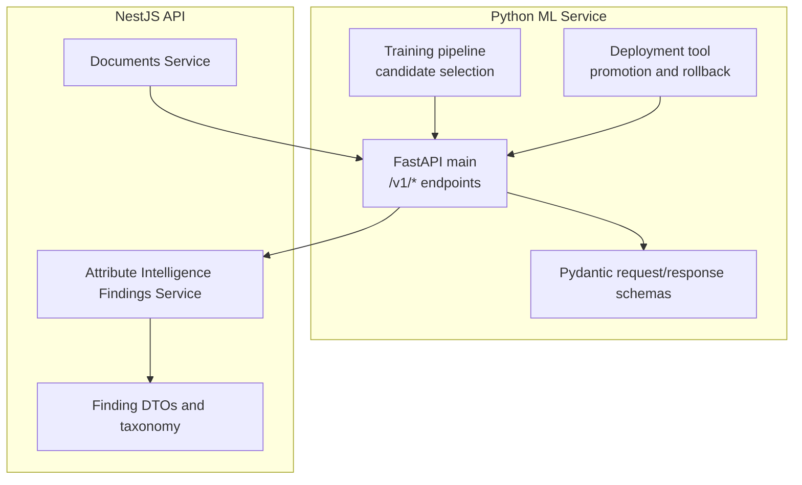
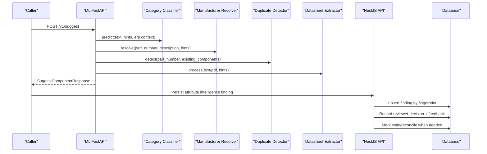
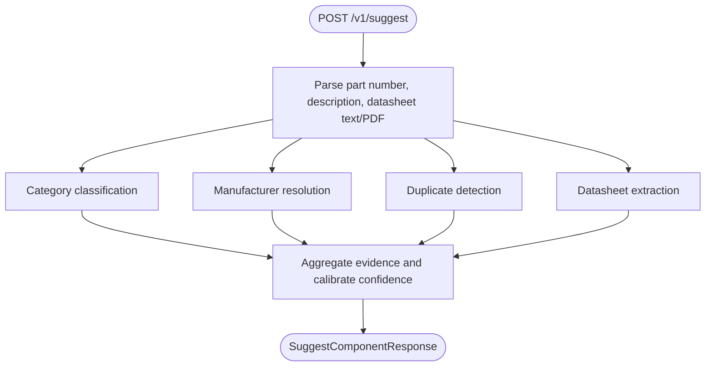
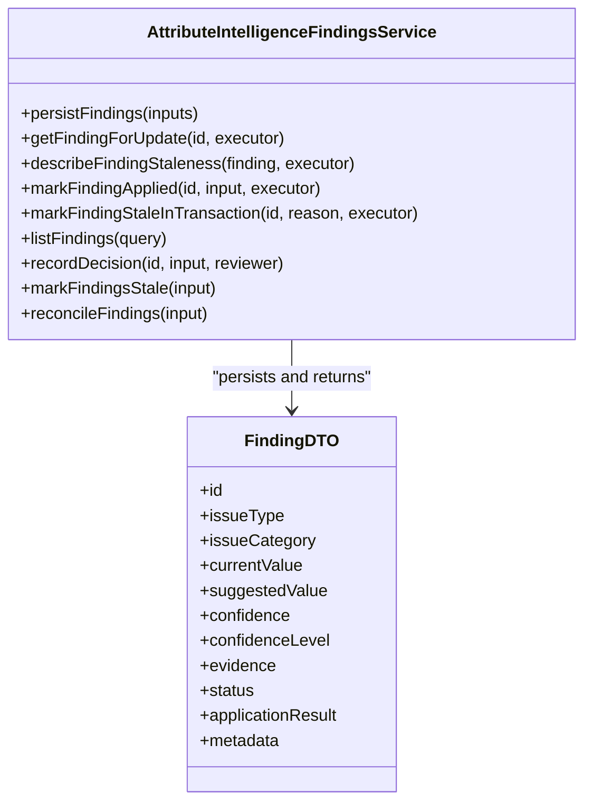
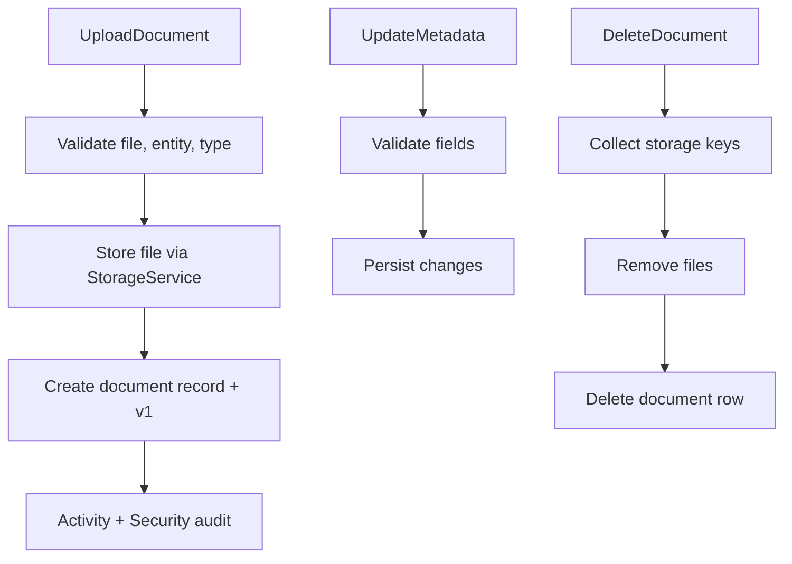
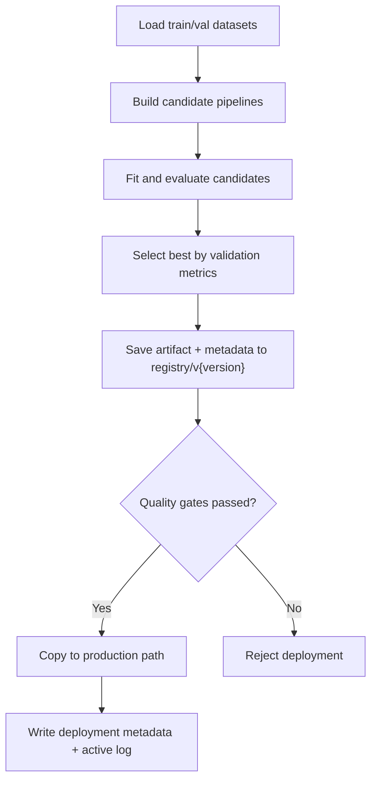
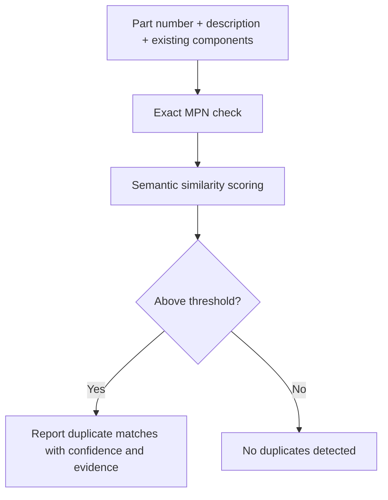
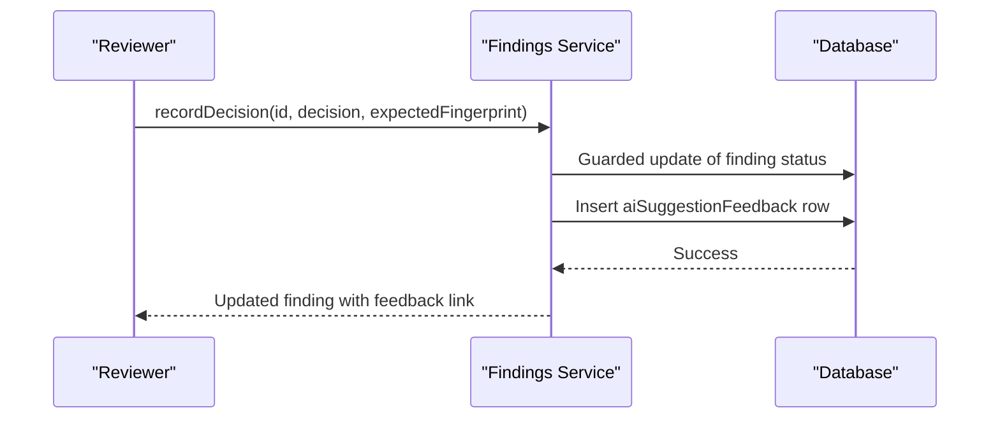
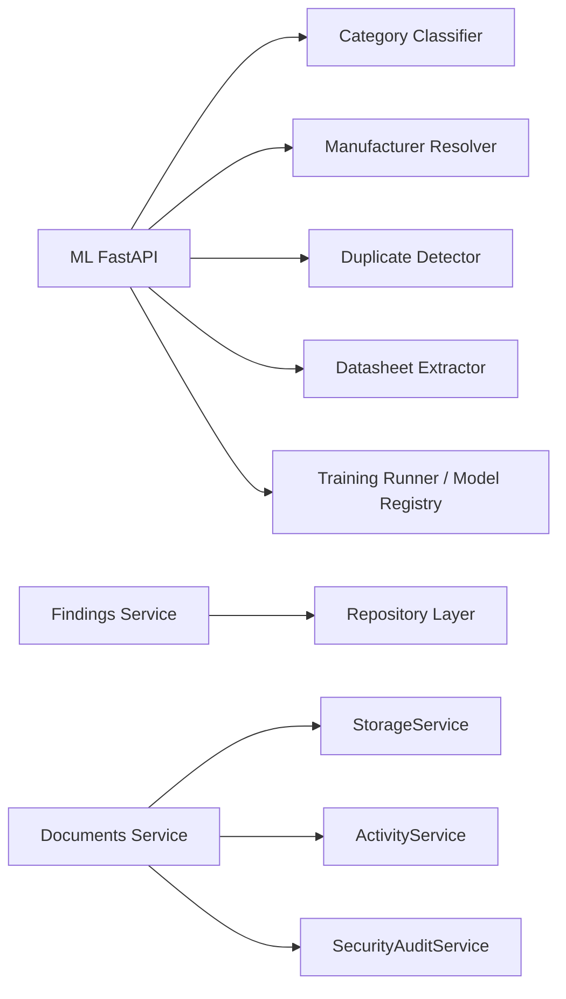

# ML Intelligence & Automation Schema

<cite>
**Referenced Files in This Document**   
- [apps/ml/app/main.py](file://apps/ml/app/main.py)
- [apps/ml/app/schemas.py](file://apps/ml/app/schemas.py)
- [apps/ml/pipeline/train.py](file://apps/ml/pipeline/train.py)
- [apps/ml/pipeline/deploy.py](file://apps/ml/pipeline/deploy.py)
- [apps/api/src/ml/attribute-findings/attribute-finding.service.ts](file://apps/api/src/ml/attribute-findings/attribute-finding.service.ts)
- [apps/api/src/ml/attribute-findings/attribute-finding.dtos.ts](file://apps/api/src/ml/attribute-findings/attribute-finding.dtos.ts)
- [apps/api/src/documents/documents.service.ts](file://apps/api/src/documents/documents.service.ts)
</cite>

## Table of Contents
1. [Introduction](#introduction)
2. [Project Structure](#project-structure)
3. [Core Components](#core-components)
4. [Architecture Overview](#architecture-overview)
5. [Detailed Component Analysis](#detailed-component-analysis)
6. [Dependency Analysis](#dependency-analysis)
7. [Performance Considerations](#performance-considerations)
8. [Troubleshooting Guide](#troubleshooting-guide)
9. [Conclusion](#conclusion)

## Introduction
This document defines the ML intelligence and automation schema for component intelligence, document processing, attribute intelligence, model training, deployment tracking, duplicate detection, data consolidation, feedback loops, human-in-the-loop review, and privacy and ethics considerations. It maps how the Python ML service exposes classification, manufacturer resolution, datasheet extraction, attribute suggestions, and ML operations endpoints; how the NestJS API persists attribute intelligence findings with confidence scores and review status; and how documents are acquired, stored, versioned, and linked to ERP entities.

## Project Structure
The ML intelligence surface spans two services:
- Python FastAPI ML service: inference endpoints, schemas, and ML operations control plane.
- NestJS API: attribute intelligence findings workflow, document storage, and integration points.

**Diagram sources**
- [apps/ml/app/main.py:60-101](file://apps/ml/app/main.py#L60-L101)
- [apps/ml/app/schemas.py:1-582](file://apps/ml/app/schemas.py#L1-L582)
- [apps/ml/pipeline/train.py:54-193](file://apps/ml/pipeline/train.py#L54-L193)
- [apps/ml/pipeline/deploy.py:16-116](file://apps/ml/pipeline/deploy.py#L16-L116)
- [apps/api/src/ml/attribute-findings/attribute-finding.service.ts:76-124](file://apps/api/src/ml/attribute-findings/attribute-finding.service.ts#L76-L124)
- [apps/api/src/ml/attribute-findings/attribute-finding.dtos.ts:29-84](file://apps/api/src/ml/attribute-findings/attribute-finding.dtos.ts#L29-L84)
- [apps/api/src/documents/documents.service.ts:116-124](file://apps/api/src/documents/documents.service.ts#L116-L124)

**Section sources**
- [apps/ml/app/main.py:60-101](file://apps/ml/app/main.py#L60-L101)
- [apps/ml/app/schemas.py:1-582](file://apps/ml/app/schemas.py#L1-L582)
- [apps/api/src/ml/attribute-findings/attribute-finding.service.ts:76-124](file://apps/api/src/ml/attribute-findings/attribute-finding.service.ts#L76-L124)
- [apps/api/src/documents/documents.service.ts:116-124](file://apps/api/src/documents/documents.service.ts#L116-L124)

## Core Components
- ML Inference Endpoints: category prediction, batch prediction, manufacturer resolution, duplicate detection, datasheet extraction, composite suggestion, and attribute intelligence endpoints.
- ML Operations Control Plane: training runs, active run inspection, model registry listing, candidate deployment, rollback, reload, dataset overview.
- Attribute Intelligence Findings: idempotent persistence, fingerprinting, queue reads, staleness checks, decision recording, feedback insertion, reconciliation.
- Documents: uploaded file handling, external URL references, metadata updates, versioning, download/preview, deletion, activity and audit logging.

Key schema families:
- Evidence and hints: evidence items, datapack hints, ERP categories/manufacturers.
- Identity and classification: category predictions, manufacturer resolution, duplicates.
- Datasheet extraction: extracted attributes with canonical values, units, source values, and evidence.
- Attribute intelligence: binding suggestions, category/component attribute suggestions, enum value suggestions, library audit issues.
- ML ops: training run lifecycle, model versions, dataset snapshots, quarantine and distribution summaries.

**Section sources**
- [apps/ml/app/main.py:103-361](file://apps/ml/app/main.py#L103-L361)
- [apps/ml/app/schemas.py:61-216](file://apps/ml/app/schemas.py#L61-L216)
- [apps/ml/app/schemas.py:336-582](file://apps/ml/app/schemas.py#L336-L582)
- [apps/api/src/ml/attribute-findings/attribute-finding.service.ts:100-225](file://apps/api/src/ml/attribute-findings/attribute-finding.service.ts#L100-L225)
- [apps/api/src/documents/documents.service.ts:126-233](file://apps/api/src/documents/documents.service.ts#L126-L233)

## Architecture Overview
The system integrates three layers:
1. Client or internal caller invokes ML endpoints.
2. ML service orchestrates classifiers, resolvers, duplicate detector, and extractor.
3. NestJS API stores attribute intelligence findings and documents, enforces review workflows, and records feedback.

**Diagram sources**
- [apps/ml/app/main.py:154-256](file://apps/ml/app/main.py#L154-L256)
- [apps/api/src/ml/attribute-findings/attribute-finding.service.ts:114-225](file://apps/api/src/ml/attribute-findings/attribute-finding.service.ts#L114-L225)
- [apps/api/src/ml/attribute-findings/attribute-finding.service.ts:421-527](file://apps/api/src/ml/attribute-findings/attribute-finding.service.ts#L421-L527)

## Detailed Component Analysis

### ML Inference and Composite Suggestion
The composite suggestion endpoint coordinates multiple intelligence passes:
- Category classification with top-k candidates and evidence.
- Manufacturer resolution with match type and candidates.
- Duplicate detection using authoritative MPN and semantic similarity.
- Datasheet extraction returning canonical attributes with units and evidence.
- Confidence calibration producing an overall HIGH/MEDIUM/LOW level from signals across passes.

**Diagram sources**
- [apps/ml/app/main.py:154-256](file://apps/ml/app/main.py#L154-L256)
- [apps/ml/app/schemas.py:197-216](file://apps/ml/app/schemas.py#L197-L216)

**Section sources**
- [apps/ml/app/main.py:154-256](file://apps/ml/app/main.py#L154-L256)
- [apps/ml/app/schemas.py:61-216](file://apps/ml/app/schemas.py#L61-L216)

### Attribute Intelligence Findings Workflow
The findings service owns the review workflow:
- Idempotent persistence via deterministic fingerprints.
- Subject validation ensuring findings reference valid subjects or carry canonical codes.
- Queue reads with summary counts and pagination.
- Decision recording with optimistic concurrency and atomic feedback insertion.
- Staleness detection against live state and reconciliation to age out missing conditions.

**Diagram sources**
- [apps/api/src/ml/attribute-findings/attribute-finding.service.ts:76-124](file://apps/api/src/ml/attribute-findings/attribute-finding.service.ts#L76-L124)
- [apps/api/src/ml/attribute-findings/attribute-finding.dtos.ts:518-554](file://apps/api/src/ml/attribute-findings/attribute-finding.dtos.ts#L518-L554)

**Section sources**
- [apps/api/src/ml/attribute-findings/attribute-finding.service.ts:100-225](file://apps/api/src/ml/attribute-findings/attribute-finding.service.ts#L100-L225)
- [apps/api/src/ml/attribute-findings/attribute-finding.service.ts:421-527](file://apps/api/src/ml/attribute-findings/attribute-finding.service.ts#L421-L527)
- [apps/api/src/ml/attribute-findings/attribute-finding.dtos.ts:29-84](file://apps/api/src/ml/attribute-findings/attribute-finding.dtos.ts#L29-L84)
- [apps/api/src/ml/attribute-findings/attribute-finding.dtos.ts:367-404](file://apps/api/src/ml/attribute-findings/attribute-finding.dtos.ts#L367-L404)
- [apps/api/src/ml/attribute-findings/attribute-finding.dtos.ts:518-554](file://apps/api/src/ml/attribute-findings/attribute-finding.dtos.ts#L518-L554)

### Document Processing and Metadata Storage
The documents service supports:
- Uploaded files with secure storage keys, MIME validation, size limits, and revision history.
- External URL references without storing bytes.
- Metadata updates including tags, confidentiality, and document type.
- Download/preview with version selection and error handling for missing objects.
- Deletion that removes storage objects before database rows and logs activity and audit events.

**Diagram sources**
- [apps/api/src/documents/documents.service.ts:126-233](file://apps/api/src/documents/documents.service.ts#L126-L233)
- [apps/api/src/documents/documents.service.ts:555-641](file://apps/api/src/documents/documents.service.ts#L555-L641)
- [apps/api/src/documents/documents.service.ts:655-701](file://apps/api/src/documents/documents.service.ts#L655-L701)

**Section sources**
- [apps/api/src/documents/documents.service.ts:126-233](file://apps/api/src/documents/documents.service.ts#L126-L233)
- [apps/api/src/documents/documents.service.ts:371-437](file://apps/api/src/documents/documents.service.ts#L371-L437)
- [apps/api/src/documents/documents.service.ts:555-641](file://apps/api/src/documents/documents.service.ts#L555-L641)
- [apps/api/src/documents/documents.service.ts:655-701](file://apps/api/src/documents/documents.service.ts#L655-L701)

### ML Model Training Data, Versioning, and Deployment Tracking
Training pipeline:
- Loads authoritative datasets with zero leakage.
- Builds candidate architectures (character n-grams, word n-grams, hybrid union).
- Evaluates accuracy and top-k accuracy.
- Selects champion and saves artifact plus metadata into a versioned registry directory.

Deployment tool:
- Promotes a verified candidate only if quality gates pass.
- Creates backup of current production model.
- Writes deployment metadata and active deployment log.
- Supports rollback to previous backup.

**Diagram sources**
- [apps/ml/pipeline/train.py:23-52](file://apps/ml/pipeline/train.py#L23-L52)
- [apps/ml/pipeline/train.py:54-193](file://apps/ml/pipeline/train.py#L54-L193)
- [apps/ml/pipeline/deploy.py:16-116](file://apps/ml/pipeline/deploy.py#L16-L116)

**Section sources**
- [apps/ml/pipeline/train.py:23-52](file://apps/ml/pipeline/train.py#L23-L52)
- [apps/ml/pipeline/train.py:54-193](file://apps/ml/pipeline/train.py#L54-L193)
- [apps/ml/pipeline/deploy.py:16-116](file://apps/ml/pipeline/deploy.py#L16-L116)

### Consolidation Workflows: Duplicate Detection and Data Merging
Duplicate detection is integrated into both product-level and attribute-level intelligence:
- Product-level: exact MPN guard plus semantic similarity against existing components.
- Attribute-level: name/code similarity, alias matching, usage counts, bound categories, and suggested aliases.

These mechanisms support consolidation by surfacing likely duplicates and providing evidence for merging decisions.

**Diagram sources**
- [apps/ml/app/main.py:136-144](file://apps/ml/app/main.py#L136-L144)
- [apps/ml/app/schemas.py:132-163](file://apps/ml/app/schemas.py#L132-L163)
- [apps/ml/app/schemas.py:433-457](file://apps/ml/app/schemas.py#L433-L457)

**Section sources**
- [apps/ml/app/main.py:136-144](file://apps/ml/app/main.py#L136-L144)
- [apps/ml/app/schemas.py:132-163](file://apps/ml/app/schemas.py#L132-L163)
- [apps/ml/app/schemas.py:433-457](file://apps/ml/app/schemas.py#L433-L457)

### Feedback Loops and Human-in-the-Loop Processes
Feedback is captured when reviewers decide on attribute intelligence findings:
- The decision is recorded atomically with the finding update.
- A feedback row is inserted linking to the finding, attribute/category, predicted value, confidence, evidence, model version, user action, final value, and reviewer identity.
- Staleness checks prevent applying outdated findings; reconciliation ages out findings no longer detected.

**Diagram sources**
- [apps/api/src/ml/attribute-findings/attribute-finding.service.ts:421-527](file://apps/api/src/ml/attribute-findings/attribute-finding.service.ts#L421-L527)

**Section sources**
- [apps/api/src/ml/attribute-findings/attribute-finding.service.ts:421-527](file://apps/api/src/ml/attribute-findings/attribute-finding.service.ts#L421-L527)

### Data Privacy and AI Ethics Compliance
Privacy and security controls include:
- Document confidentiality flag and external URL host capture.
- Activity and security-audit logging for document operations.
- ML operations routes are internal-only, called by authenticated NestJS API; authorization, durable run records, and audit trails live on the API side.
- Pydantic schemas drop sensitive filesystem paths and environment values from responses.

Recommendations:
- Enforce least privilege access to ML operations endpoints.
- Retain audit logs per retention policy.
- Redact PII in evidence and extracted text previews.
- Apply data minimization for feedback records.

**Section sources**
- [apps/api/src/documents/documents.service.ts:126-233](file://apps/api/src/documents/documents.service.ts#L126-L233)
- [apps/api/src/documents/documents.service.ts:246-318](file://apps/api/src/documents/documents.service.ts#L246-L318)
- [apps/ml/app/main.py:363-380](file://apps/ml/app/main.py#L363-L380)
- [apps/ml/app/schemas.py:230-241](file://apps/ml/app/schemas.py#L230-L241)

## Dependency Analysis
High-level dependencies:
- ML FastAPI depends on classifier, resolver, duplicate detector, extractor, and training runner/model registry services.
- NestJS API depends on database schema, storage service, activity service, and security audit service.
- Findings service depends on repository layer and shared intelligence findings lifecycle.

**Diagram sources**
- [apps/ml/app/main.py:47-58](file://apps/ml/app/main.py#L47-L58)
- [apps/api/src/ml/attribute-findings/attribute-finding.service.ts:76-98](file://apps/api/src/ml/attribute-findings/attribute-finding.service.ts#L76-L98)
- [apps/api/src/documents/documents.service.ts:116-124](file://apps/api/src/documents/documents.service.ts#L116-L124)

**Section sources**
- [apps/ml/app/main.py:47-58](file://apps/ml/app/main.py#L47-L58)
- [apps/api/src/ml/attribute-findings/attribute-finding.service.ts:76-98](file://apps/api/src/ml/attribute-findings/attribute-finding.service.ts#L76-L98)
- [apps/api/src/documents/documents.service.ts:116-124](file://apps/api/src/documents/documents.service.ts#L116-L124)

## Performance Considerations
- Lightweight CPU-first models loaded eagerly at startup for fast readiness checks.
- Composite suggestion aggregates limited evidence samples to keep response latency bounded.
- Training evaluates multiple candidate architectures and selects based on validation accuracy and top-k performance.
- Document upload validates size and MIME early to avoid unnecessary storage writes.

[No sources needed since this section provides general guidance]

## Troubleshooting Guide
Common issues and resolutions:
- Unknown issue types or categories in findings: ensure new types are added to the taxonomy and validated before persistence.
- Stale findings: re-run attribute analysis to refresh expected state; reconcile findings to age out missing conditions.
- Duplicate detection false positives/negatives: adjust similarity thresholds and verify MPN normalization.
- Document download failures: confirm storage object exists and version selection is correct; handle missing object errors gracefully.
- Deployment refused: verify evaluation report indicates promotion eligibility; use rollback if backup exists.

**Section sources**
- [apps/api/src/ml/attribute-findings/attribute-finding.dtos.ts:173-187](file://apps/api/src/ml/attribute-findings/attribute-finding.dtos.ts#L173-L187)
- [apps/api/src/ml/attribute-findings/attribute-finding.service.ts:535-626](file://apps/api/src/ml/attribute-findings/attribute-finding.service.ts#L535-L626)
- [apps/api/src/documents/documents.service.ts:418-436](file://apps/api/src/documents/documents.service.ts#L418-L436)
- [apps/ml/pipeline/deploy.py:41-50](file://apps/ml/pipeline/deploy.py#L41-L50)

## Conclusion
The ML intelligence and automation schema integrates classification, manufacturer resolution, duplicate detection, datasheet extraction, attribute intelligence, and robust review workflows with feedback capture. Document processing provides secure storage, versioning, and auditability. The training and deployment pipeline ensures reproducible model artifacts with quality gates and rollback capability. Together, these components enable reliable, auditable, and ethical AI-assisted data consolidation and master data management.