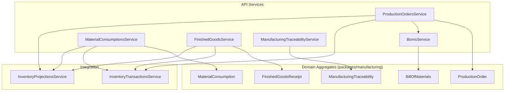
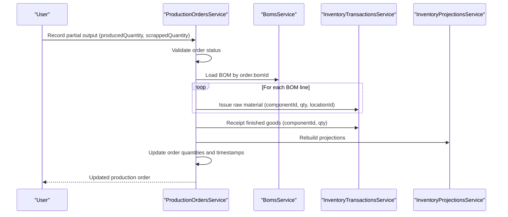
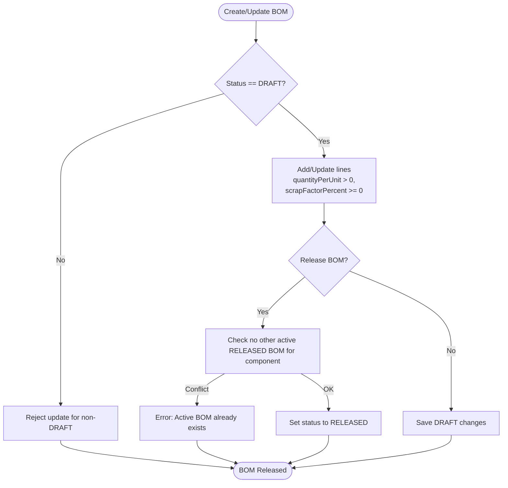
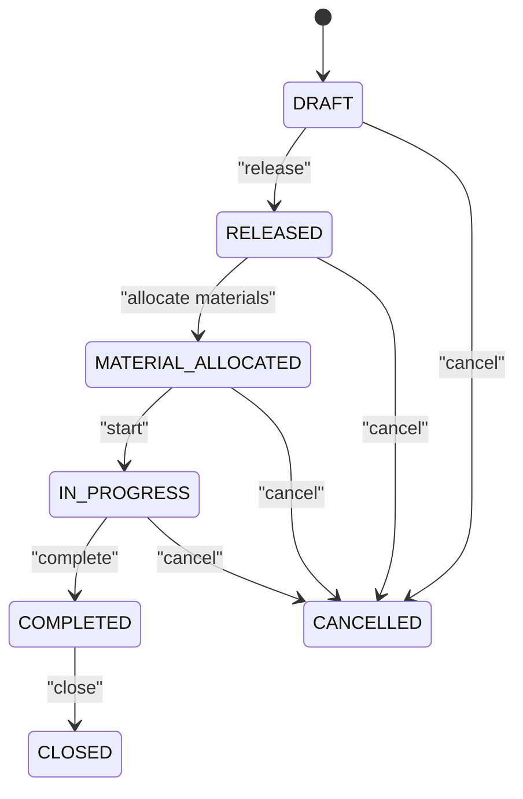
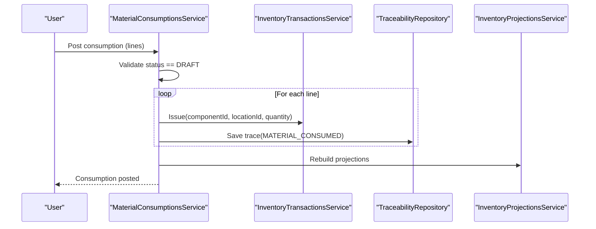
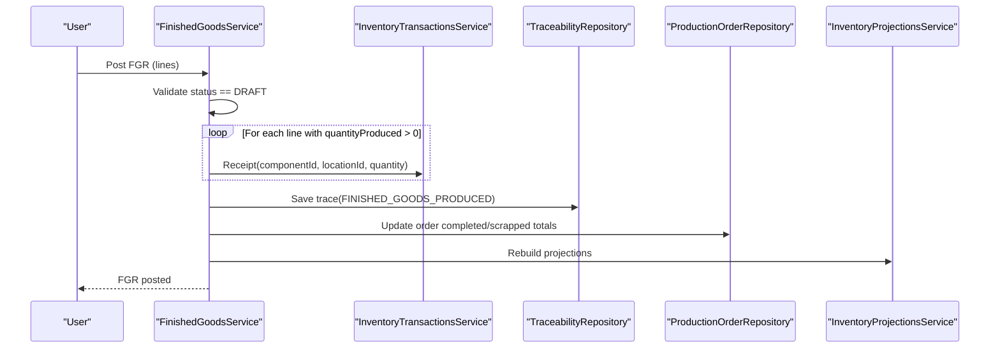
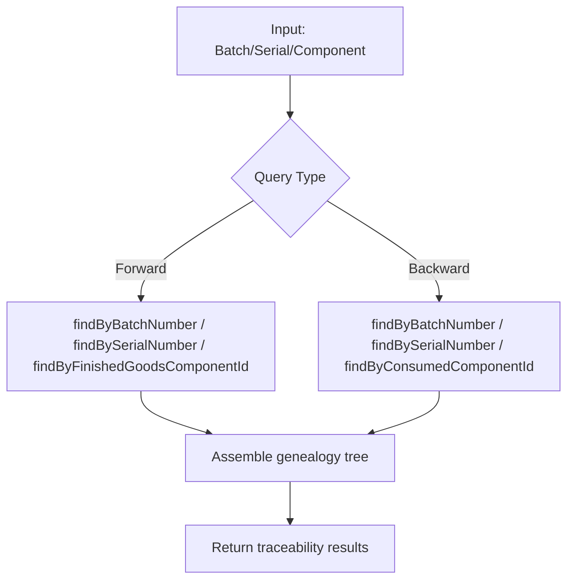
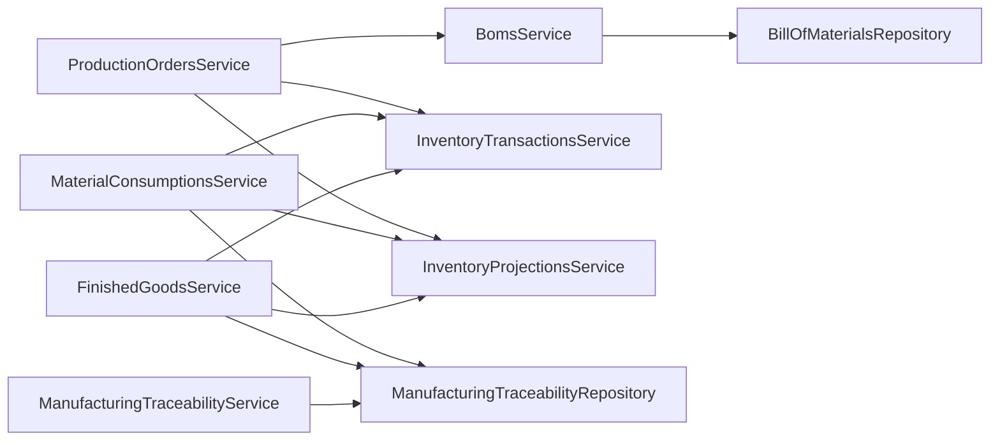

# Manufacturing Operations Schema

<cite>
**Referenced Files in This Document**
- [boms.service.ts](file://apps/api/src/boms/boms.service.ts)
- [production-orders.service.ts](file://apps/api/src/production-orders/production-orders.service.ts)
- [material-consumptions.service.ts](file://apps/api/src/material-consumptions/material-consumptions.service.ts)
- [finished-goods.service.ts](file://apps/api/src/finished-goods/finished-goods.service.ts)
- [manufacturing-traceability.service.ts](file://apps/api/src/manufacturing-traceability/manufacturing-traceability.service.ts)
- [0016-bill-of-materials.md](file://docs/rfcs/0016-bill-of-materials.md)
- [0017-production-orders.md](file://docs/rfcs/0017-production-orders.md)
- [0018-material-consumption.md](file://docs/rfcs/0018-material-consumption.md)
- [0019-finished-goods-receipt.md](file://docs/rfcs/0019-finished-goods-receipt.md)
- [0020-manufacturing-traceability.md](file://docs/rfcs/0020-manufacturing-traceability.md)
</cite>

## Table of Contents
1. Introduction
2. Project Structure
3. Core Components
4. Architecture Overview
5. Detailed Component Analysis
6. Dependency Analysis
7. Performance Considerations
8. Troubleshooting Guide
9. Conclusion
10. Appendices

## Introduction
This document describes the manufacturing schema and operational flows for bill of materials management, production order lifecycle, material consumption tracking, finished goods processing, and manufacturing traceability. It explains how BOMs define multi-level assemblies and scrap allowances, how production orders progress through states with capacity-aware scheduling hooks, how material usage is recorded and reconciled against plans, and how finished goods are received and traced for regulatory compliance and recall readiness.

## Project Structure
The manufacturing domain is implemented as a NestJS API with services that orchestrate domain aggregates from the @ananya/manufacturing package and integrate with inventory and projections via application services. RFCs define the domain models, state machines, and integration points.

**Diagram sources**
- [boms.service.ts:23-159](file://apps/api/src/boms/boms.service.ts#L23-L159)
- [production-orders.service.ts:58-471](file://apps/api/src/production-orders/production-orders.service.ts#L58-L471)
- [material-consumptions.service.ts:22-115](file://apps/api/src/material-consumptions/material-consumptions.service.ts#L22-L115)
- [finished-goods.service.ts:23-126](file://apps/api/src/finished-goods/finished-goods.service.ts#L23-L126)
- [manufacturing-traceability.service.ts:9-60](file://apps/api/src/manufacturing-traceability/manufacturing-traceability.service.ts#L9-L60)

**Section sources**
- [0016-bill-of-materials.md:1-201](file://docs/rfcs/0016-bill-of-materials.md#L1-L201)
- [0017-production-orders.md:1-208](file://docs/rfcs/0017-production-orders.md#L1-L208)
- [0018-material-consumption.md:1-216](file://docs/rfcs/0018-material-consumption.md#L1-L216)
- [0019-finished-goods-receipt.md:1-216](file://docs/rfcs/0019-finished-goods-receipt.md#L1-L216)
- [0020-manufacturing-traceability.md:1-206](file://docs/rfcs/0020-manufacturing-traceability.md#L1-L206)

## Core Components
- Bill of Materials (BOM): Defines component requirements per unit, scrap factors, and revision control. Supports release and obsolescence workflows to ensure only approved recipes drive production.
- Production Orders: Authorize manufacturing runs against released BOMs, track planned vs completed quantities, and manage state transitions including start, pause/resume, completion, close, and cancel.
- Material Consumption: Records actual raw material withdrawals during production, posts inventory issues, and captures batch/serial data for traceability.
- Finished Goods Receipt: Records production yield and scrap, posts inventory receipts, updates production order totals, and records traceability links.
- Manufacturing Traceability: Immutable event log linking consumed components and produced finished goods to production orders, enabling forward and backward genealogy queries.

**Section sources**
- [0016-bill-of-materials.md:15-114](file://docs/rfcs/0016-bill-of-materials.md#L15-L114)
- [0017-production-orders.md:11-122](file://docs/rfcs/0017-production-orders.md#L11-L122)
- [0018-material-consumption.md:11-113](file://docs/rfcs/0018-material-consumption.md#L11-L113)
- [0019-finished-goods-receipt.md:11-113](file://docs/rfcs/0019-finished-goods-receipt.md#L11-L113)
- [0020-manufacturing-traceability.md:11-115](file://docs/rfcs/0020-manufacturing-traceability.md#L11-L115)

## Architecture Overview
The system uses service layers to enforce domain rules and coordinate cross-cutting concerns such as inventory transactions and projections. BOMs provide the recipe; production orders execute it; consumptions and finished goods receipts record actuals; traceability provides auditability.

**Diagram sources**
- [production-orders.service.ts:204-273](file://apps/api/src/production-orders/production-orders.service.ts#L204-L273)

**Section sources**
- [production-orders.service.ts:58-471](file://apps/api/src/production-orders/production-orders.service.ts#L58-L471)

## Detailed Component Analysis

### Bill of Materials Management
- Multi-level assemblies: BOM lines reference components, enabling hierarchical structures where components can themselves be assembled products.
- Alternative components: The RFC outlines future support for alternative substitution rules; current implementation focuses on primary BOM lines with quantity-per-unit and scrap factor.
- Lifecycle: DRAFT allows edits; RELEASED locks the BOM; OBSOLETE deprecates older versions. Only one active RELEASED BOM per product at a time.
- Validation: Ensures new or updated lines reference usable components and enforces positive quantities and non-negative scrap factors.

**Diagram sources**
- [boms.service.ts:30-159](file://apps/api/src/boms/boms.service.ts#L30-L159)
- [0016-bill-of-materials.md:110-114](file://docs/rfcs/0016-bill-of-materials.md#L110-L114)

**Section sources**
- [boms.service.ts:30-159](file://apps/api/src/boms/boms.service.ts#L30-L159)
- [0016-bill-of-materials.md:15-114](file://docs/rfcs/0016-bill-of-materials.md#L15-L114)

### Production Order Lifecycle and Capacity Planning Integration
- States: DRAFT → RELEASED → MATERIAL_ALLOCATED → IN_PROGRESS → COMPLETED → CLOSED; CANCELLED可从 any non-terminal state.
- Scheduling: Start/end dates capture planned windows; capacity planning integration is referenced in RFCs for workstation scheduling and Gantt views.
- Execution: Partial outputs issue proportional materials and receive finished goods; scrap can be recorded separately; completion finalizes remaining issues/receipts.
- Activity timeline: Aggregates creation, start, material consumption, output produced, scrap recorded, completion events.

**Diagram sources**
- [0017-production-orders.md:115-122](file://docs/rfcs/0017-production-orders.md#L115-L122)

**Section sources**
- [production-orders.service.ts:68-471](file://apps/api/src/production-orders/production-orders.service.ts#L68-L471)
- [0017-production-orders.md:11-122](file://docs/rfcs/0017-production-orders.md#L11-L122)

### Material Consumption Tracking and Variance Analysis
- Recording: Create a consumption document linked to a production order; add lines specifying component, location, and quantity consumed; optionally include batch/serial numbers.
- Posting: On post, issues inventory for each line and creates traceability records; marks consumption as posted (immutable).
- Variance analysis: Compare planned requirements (from BOM and order progress) against actual consumption to identify over/under usage.

**Diagram sources**
- [material-consumptions.service.ts:70-115](file://apps/api/src/material-consumptions/material-consumptions.service.ts#L70-L115)

**Section sources**
- [material-consumptions.service.ts:33-115](file://apps/api/src/material-consumptions/material-consumptions.service.ts#L33-L115)
- [0018-material-consumption.md:11-113](file://docs/rfcs/0018-material-consumption.md#L11-L113)

### Finished Goods Processing and Quality Assurance Workflows
- Receipt: Create an FGR linked to a production order; add lines with produced and scrapped quantities; specify destination location and optional batch/serial.
- Posting: Issues inventory receipts for produced quantities; records traceability; updates production order totals; rebuilds projections.
- Quality assurance: RFCs outline potential quality hold statuses before posting; current flow posts directly but supports separate scrap recording for rejected units.

**Diagram sources**
- [finished-goods.service.ts:70-126](file://apps/api/src/finished-goods/finished-goods.service.ts#L70-L126)

**Section sources**
- [finished-goods.service.ts:36-126](file://apps/api/src/finished-goods/finished-goods.service.ts#L36-L126)
- [0019-finished-goods-receipt.md:11-113](file://docs/rfcs/0019-finished-goods-receipt.md#L11-L113)

### Manufacturing Traceability for Regulatory Compliance and Recall Management
- Immutability: Traceability records are append-only and cannot be modified or deleted.
- Forward trace: From finished product batch/serial to consumed components, suppliers, purchase orders, and goods receipts.
- Backward trace: From component batch/serial to all production orders and finished products that consumed it.
- Queries: Support lookups by production order, batch number, serial number, and component IDs.

**Diagram sources**
- [manufacturing-traceability.service.ts:16-60](file://apps/api/src/manufacturing-traceability/manufacturing-traceability.service.ts#L16-L60)

**Section sources**
- [manufacturing-traceability.service.ts:9-60](file://apps/api/src/manufacturing-traceability/manufacturing-traceability.service.ts#L9-L60)
- [0020-manufacturing-traceability.md:11-115](file://docs/rfcs/0020-manufacturing-traceability.md#L11-L115)

## Dependency Analysis
- BOMsService depends on BillOfMaterials aggregate and repository; validates component usability and enforces release constraints.
- ProductionOrdersService depends on BOMsService for requirement calculation and issues/receipts via InventoryTransactionsService; rebuilds projections after changes.
- MaterialConsumptionsService posts inventory issues and writes traceability records; rebuilds projections.
- FinishedGoodsService posts inventory receipts, updates production order totals, and writes traceability records; rebuilds projections.
- ManufacturingTraceabilityService provides read-model queries for genealogy traversal.

**Diagram sources**
- [boms.service.ts:23-159](file://apps/api/src/boms/boms.service.ts#L23-L159)
- [production-orders.service.ts:58-471](file://apps/api/src/production-orders/production-orders.service.ts#L58-L471)
- [material-consumptions.service.ts:22-115](file://apps/api/src/material-consumptions/material-consumptions.service.ts#L22-L115)
- [finished-goods.service.ts:23-126](file://apps/api/src/finished-goods/finished-goods.service.ts#L23-L126)
- [manufacturing-traceability.service.ts:9-60](file://apps/api/src/manufacturing-traceability/manufacturing-traceability.service.ts#L9-L60)

**Section sources**
- [boms.service.ts:23-159](file://apps/api/src/boms/boms.service.ts#L23-L159)
- [production-orders.service.ts:58-471](file://apps/api/src/production-orders/production-orders.service.ts#L58-L471)
- [material-consumptions.service.ts:22-115](file://apps/api/src/material-consumptions/material-consumptions.service.ts#L22-L115)
- [finished-goods.service.ts:23-126](file://apps/api/src/finished-goods/finished-goods.service.ts#L23-L126)
- [manufacturing-traceability.service.ts:9-60](file://apps/api/src/manufacturing-traceability/manufacturing-traceability.service.ts#L9-L60)

## Performance Considerations
- Projection rebuilds: After posting consumptions or finished goods, projections are rebuilt to reflect updated stock levels. Ensure this occurs asynchronously if high throughput is expected.
- Batch operations: When issuing multiple material lines or receiving large finished goods batches, consider batching inventory transactions to reduce overhead.
- Query optimization: Traceability queries should leverage indexes on production_order_id, batch_number, serial_numbers, and component_id for fast genealogy traversal.
- Scrap handling: Separate scrap recording avoids inflating finished goods counts and improves variance accuracy.

[No sources needed since this section provides general guidance]

## Troubleshooting Guide
- Cannot update non-DRAFT BOM: Attempting to modify a RELEASED or OBSOLETE BOM will fail; create a new revision instead.
- Cannot edit non-DRAFT production order: Editing is restricted to DRAFT; release or move to another state prevents modifications.
- Cannot post already-posted documents: Both material consumption and finished goods receipts must be in DRAFT to post; posted documents are immutable.
- Cannot record output on completed/cancelled orders: Ensure the order is IN_PROGRESS or appropriate state before recording partial outputs or scrap.
- Active BOM conflict: Releasing a BOM fails if another RELEASED BOM exists for the same component; obsolete the previous version first.

**Section sources**
- [boms.service.ts:52-159](file://apps/api/src/boms/boms.service.ts#L52-L159)
- [production-orders.service.ts:96-365](file://apps/api/src/production-orders/production-orders.service.ts#L96-L365)
- [material-consumptions.service.ts:70-115](file://apps/api/src/material-consumptions/material-consumptions.service.ts#L70-L115)
- [finished-goods.service.ts:70-126](file://apps/api/src/finished-goods/finished-goods.service.ts#L70-L126)

## Conclusion
The manufacturing schema integrates BOM-driven planning, robust production order execution, precise material consumption recording, and reliable finished goods receipt processes, all underpinned by immutable traceability for compliance and recall readiness. Capacity planning hooks and scheduling fields enable future shop-floor optimization and bottleneck identification while maintaining clear separation between manufacturing and inventory domains.

[No sources needed since this section summarizes without analyzing specific files]

## Appendices

### BOM Structure and Multi-Level Assemblies
- BOM lines define component requirements per unit with optional scrap factors; hierarchical assemblies are supported by referencing components that may themselves have BOMs.
- Revision control ensures only approved recipes drive production; releasing a BOM locks it and requires a new revision for changes.

**Section sources**
- [0016-bill-of-materials.md:15-114](file://docs/rfcs/0016-bill-of-materials.md#L15-L114)

### Production Order States and Capacity Planning
- States include DRAFT, RELEASED, MATERIAL_ALLOCATED, IN_PROGRESS, COMPLETED, CLOSED, and CANCELLED; start/end dates capture planned scheduling windows.
- Capacity planning integration is outlined for workstation scheduling and Gantt visualization; current implementation supports scheduling fields and activity timelines.

**Section sources**
- [0017-production-orders.md:11-122](file://docs/rfcs/0017-production-orders.md#L11-L122)

### Material Consumption and Variance Analysis
- Actual consumption is recorded per line with batch/serial tracking; posting issues inventory and creates traceability records.
- Variance analysis compares planned requirements (derived from BOM and order progress) against actual consumption to detect over/under usage.

**Section sources**
- [0018-material-consumption.md:11-113](file://docs/rfcs/0018-material-consumption.md#L11-L113)

### Finished Goods Receipt and Quality Assurance
- Finished goods receipts record produced and scrapped quantities; posting creates inventory receipts and updates production order totals.
- Quality assurance workflows can incorporate holds prior to posting; current flow supports separate scrap recording for rejected units.

**Section sources**
- [0019-finished-goods-receipt.md:11-113](file://docs/rfcs/0019-finished-goods-receipt.md#L11-L113)

### Traceability for Regulatory Compliance and Recalls
- Immutable traceability records link consumed components and produced finished goods to production orders.
- Forward and backward traces enable complete genealogy for compliance reporting and recall impact analysis.

**Section sources**
- [0020-manufacturing-traceability.md:11-115](file://docs/rfcs/0020-manufacturing-traceability.md#L11-L115)