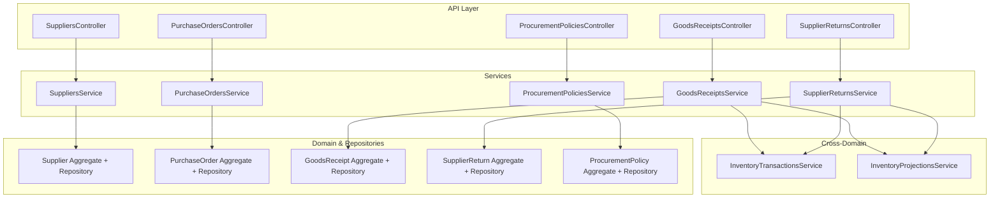
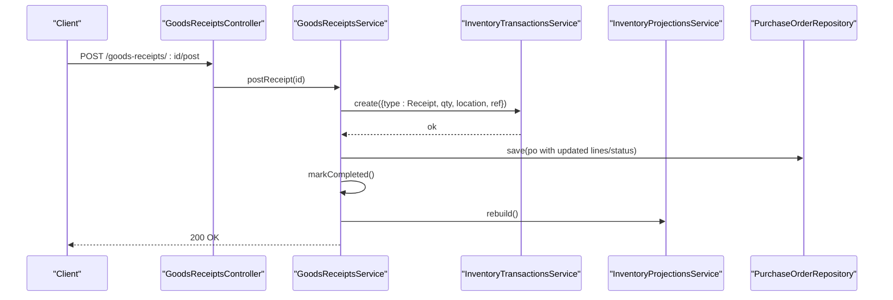
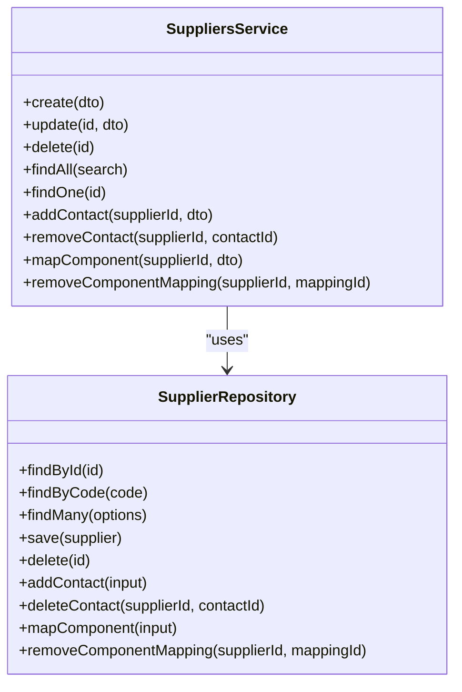
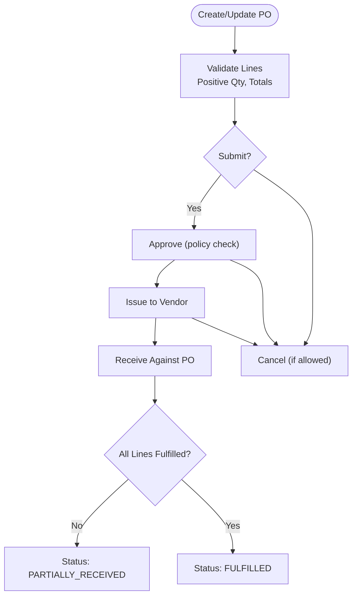
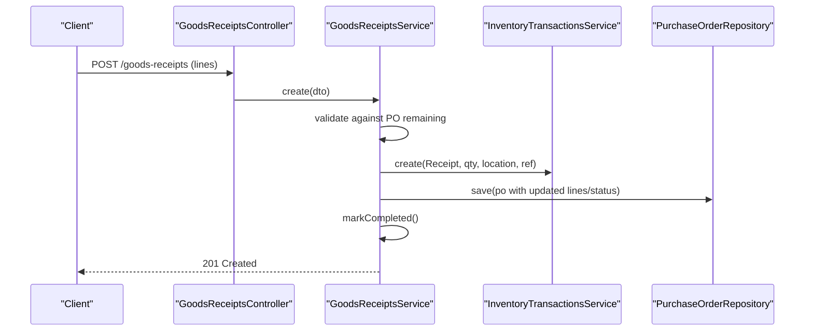
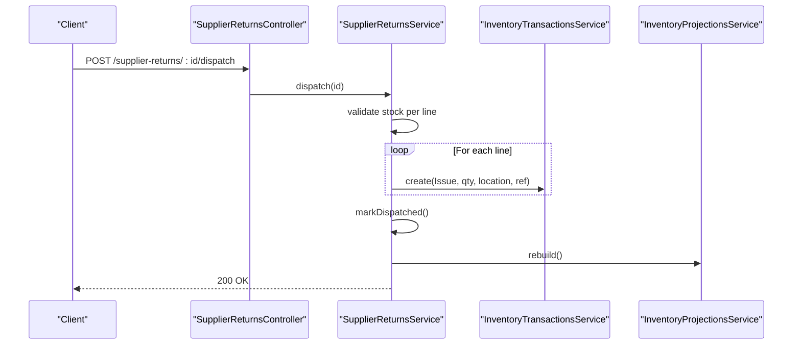
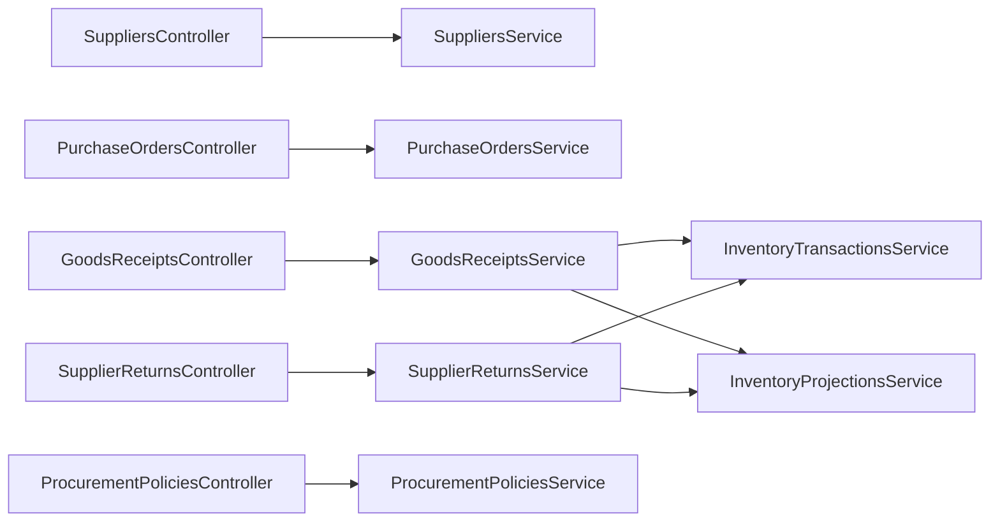
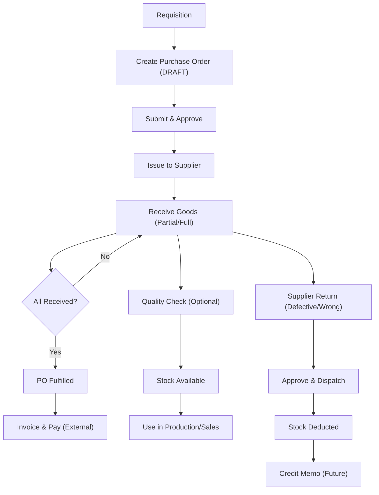

# Procurement & Supply Chain Schema

<cite>
**Referenced Files in This Document**
- [RFC-0009: Supplier Management](file://docs/rfcs/0009-supplier-management.md)
- [RFC-0010: Purchase Orders](file://docs/rfcs/0010-purchase-orders.md)
- [RFC-0011: Goods Receipt](file://docs/rfcs/0011-goods-receipt.md)
- [RFC-0012: Supplier Returns](file://docs/rfcs/0012-supplier-returns.md)
- [Suppliers Controller](file://apps/api/src/suppliers/suppliers.controller.ts)
- [Suppliers Service](file://apps/api/src/suppliers/suppliers.service.ts)
- [Purchase Orders Controller](file://apps/api/src/purchase-orders/purchase-orders.controller.ts)
- [Purchase Orders Service](file://apps/api/src/purchase-orders/purchase-orders.service.ts)
- [Goods Receipts Controller](file://apps/api/src/goods-receipts/goods-receipts.controller.ts)
- [Goods Receipts Service](file://apps/api/src/goods-receipts/goods-receipts.service.ts)
- [Supplier Returns Controller](file://apps/api/src/supplier-returns/supplier-returns.controller.ts)
- [Supplier Returns Service](file://apps/api/src/supplier-returns/supplier-returns.service.ts)
- [Procurement Policies Controller](file://apps/api/src/procurement-policies/procurement-policies.controller.ts)
- [Procurement Policies Service](file://apps/api/src/procurement-policies/procurement-policies.service.ts)
</cite>

## Table of Contents
1. Introduction
2. Project Structure
3. Core Components
4. Architecture Overview
5. Detailed Component Analysis
6. Dependency Analysis
7. Performance Considerations
8. Troubleshooting Guide
9. Conclusion
10. Appendices

## Introduction
This document describes the procurement and supply chain schema across supplier management, purchase orders, goods receipt processing, and supplier returns. It covers the end-to-end lifecycle from requisition to payment, including state machines, approval workflows, policy enforcement, inventory and financial integrations, quality control considerations, and auditability. The content is grounded in the repository’s RFCs and API implementations for each domain.

## Project Structure
The procurement subsystem is implemented as a NestJS API with feature modules per domain (suppliers, purchase orders, goods receipts, supplier returns, procurement policies). Each module exposes REST endpoints via controllers and delegates business logic to services that coordinate with repositories and cross-domain services (inventory transactions and projections). Domain rules are defined in RFCs and enforced by services and domain aggregates exposed through shared packages.

**Diagram sources**
- [Suppliers Controller:23-81](file://apps/api/src/suppliers/suppliers.controller.ts#L23-L81)
- [Suppliers Service:20-103](file://apps/api/src/suppliers/suppliers.service.ts#L20-L103)
- [Purchase Orders Controller:23-82](file://apps/api/src/purchase-orders/purchase-orders.controller.ts#L23-L82)
- [Purchase Orders Service:22-145](file://apps/api/src/purchase-orders/purchase-orders.service.ts#L22-L145)
- [Goods Receipts Controller:14-46](file://apps/api/src/goods-receipts/goods-receipts.controller.ts#L14-L46)
- [Goods Receipts Service:26-207](file://apps/api/src/goods-receipts/goods-receipts.service.ts#L26-L207)
- [Supplier Returns Controller:20-89](file://apps/api/src/supplier-returns/supplier-returns.controller.ts#L20-L89)
- [Supplier Returns Service:23-262](file://apps/api/src/supplier-returns/supplier-returns.service.ts#L23-L262)
- [Procurement Policies Controller:5-23](file://apps/api/src/procurement-policies/procurement-policies.controller.ts#L5-L23)
- [Procurement Policies Service:10-37](file://apps/api/src/procurement-policies/procurement-policies.service.ts#L10-L37)

**Section sources**
- [RFC-0009: Supplier Management:1-242](file://docs/rfcs/0009-supplier-management.md#L1-L242)
- [RFC-0010: Purchase Orders:1-232](file://docs/rfcs/0010-purchase-orders.md#L1-L232)
- [RFC-0011: Goods Receipt:1-219](file://docs/rfcs/0011-goods-receipt.md#L1-L219)
- [RFC-0012: Supplier Returns:1-208](file://docs/rfcs/0012-supplier-returns.md#L1-L208)

## Core Components
- Supplier Management: Lifecycle, contacts, catalog mapping, ratings, terms, currency, and active status controls.
- Purchase Orders: Drafting, line items, approvals, issuance, partial/full receiving, cancellation, totals, and tax handling.
- Goods Receipt: Receiving against open PO lines, validation against remaining quantities, integration with inventory ledger and projections, PO line updates, and status transitions.
- Supplier Returns: Return creation, approval, dispatch with stock deduction, completion/cancellation, and RMA tracking.
- Procurement Policies: Policy definitions used to enforce constraints such as approval thresholds and tolerances.

Key implementation highlights:
- Suppliers service orchestrates create/update/delete, contact management, and component mapping using repository abstractions.
- Purchase orders service enforces component usability checks, resolves currency, and drives state transitions (submit/approve/issue/cancel).
- Goods receipts service validates receiving against PO outstanding quantities, records inventory receipts, updates PO lines/status, and rebuilds projections.
- Supplier returns service validates stock availability before adding/dispatching lines, issues inventory transactions on dispatch, and supports cancel restoration.
- Procurement policies service provides CRUD for policy entities consumed by workflow validations.

**Section sources**
- [Suppliers Service:35-103](file://apps/api/src/suppliers/suppliers.service.ts#L35-L103)
- [Purchase Orders Service:38-145](file://apps/api/src/purchase-orders/purchase-orders.service.ts#L38-L145)
- [Goods Receipts Service:42-207](file://apps/api/src/goods-receipts/goods-receipts.service.ts#L42-L207)
- [Supplier Returns Service:32-262](file://apps/api/src/supplier-returns/supplier-returns.service.ts#L32-L262)
- [Procurement Policies Service:17-37](file://apps/api/src/procurement-policies/procurement-policies.service.ts#L17-L37)

## Architecture Overview
The system follows a layered architecture with clear separation between API controllers, application services, domain aggregates/repositories, and cross-domain integrations. State machines are enforced at the domain level and surfaced through service methods. Inventory integration occurs via transactional calls to record receipts/issues and projection rebuilds.

**Diagram sources**
- [Goods Receipts Controller:42-45](file://apps/api/src/goods-receipts/goods-receipts.controller.ts#L42-L45)
- [Goods Receipts Service:146-180](file://apps/api/src/goods-receipts/goods-receipts.service.ts#L146-L180)

**Section sources**
- [RFC-0011: Goods Receipt:88-130](file://docs/rfcs/0011-goods-receipt.md#L88-L130)

## Detailed Component Analysis

### Supplier Management
- Responsibilities: Create/update suppliers, manage contacts, map components to vendors with pricing/lead times, enforce uniqueness and active status.
- State: Active/Inactive/Blacklisted; inactive/blacklisted cannot be selected for new POs.
- Integration: References inventory components for catalog mapping.

**Diagram sources**
- [Suppliers Service:20-103](file://apps/api/src/suppliers/suppliers.service.ts#L20-L103)

**Section sources**
- [RFC-0009: Supplier Management:116-139](file://docs/rfcs/0009-supplier-management.md#L116-L139)
- [Suppliers Controller:23-81](file://apps/api/src/suppliers/suppliers.controller.ts#L23-L81)
- [Suppliers Service:35-103](file://apps/api/src/suppliers/suppliers.service.ts#L35-L103)

### Purchase Orders
- Responsibilities: Draft creation, line management, submission/approval/issuance/cancellation, totals and tax calculations, currency resolution.
- State: DRAFT → SUBMITTED → APPROVED → ISSUED → PARTIALLY_RECEIVED → FULFILLED; CANCELLED from multiple states.
- Validation: At least one line required to leave DRAFT; lines locked after APPROVED; positive ordered quantities; totals consistency.

**Diagram sources**
- [RFC-0010: Purchase Orders:114-132](file://docs/rfcs/0010-purchase-orders.md#L114-L132)
- [Purchase Orders Service:117-145](file://apps/api/src/purchase-orders/purchase-orders.service.ts#L117-L145)

**Section sources**
- [RFC-0010: Purchase Orders:114-139](file://docs/rfcs/0010-purchase-orders.md#L114-L139)
- [Purchase Orders Controller:23-82](file://apps/api/src/purchase-orders/purchase-orders.controller.ts#L23-L82)
- [Purchase Orders Service:38-145](file://apps/api/src/purchase-orders/purchase-orders.service.ts#L38-L145)

### Goods Receipt Processing
- Responsibilities: Create draft receipt, add lines, validate against PO outstanding quantities, record inventory receipts, update PO lines/status, complete receipt.
- Quality Control: Batch/expiry/serial capture; over-receipt tolerance validation via domain service.
- Integration: Records RECEIPT transactions and triggers projection rebuild.

**Diagram sources**
- [Goods Receipts Controller:19-45](file://apps/api/src/goods-receipts/goods-receipts.controller.ts#L19-L45)
- [Goods Receipts Service:42-116](file://apps/api/src/goods-receipts/goods-receipts.service.ts#L42-L116)

**Section sources**
- [RFC-0011: Goods Receipt:73-130](file://docs/rfcs/0011-goods-receipt.md#L73-L130)
- [Goods Receipts Service:42-116](file://apps/api/src/goods-receipts/goods-receipts.service.ts#L42-L116)

### Supplier Returns
- Responsibilities: Create return, add lines with reason/location, approve with RMA, dispatch to issue stock, complete or cancel.
- Stock Controls: Validates available stock before adding/dispatching; restores stock on cancellation if already dispatched.
- Integration: Issues ISSUE transactions on dispatch; rebuilds projections.

**Diagram sources**
- [Supplier Returns Controller:75-78](file://apps/api/src/supplier-returns/supplier-returns.controller.ts#L75-L78)
- [Supplier Returns Service:129-181](file://apps/api/src/supplier-returns/supplier-returns.service.ts#L129-L181)

**Section sources**
- [RFC-0012: Supplier Returns:75-124](file://docs/rfcs/0012-supplier-returns.md#L75-L124)
- [Supplier Returns Service:129-181](file://apps/api/src/supplier-returns/supplier-returns.service.ts#L129-L181)

### Procurement Policies
- Responsibilities: Define and retrieve policies that govern approvals, tolerances, and other constraints.
- Usage: Consumed by workflow services to enforce business rules (e.g., approval thresholds, receiving tolerances).

**Section sources**
- [Procurement Policies Controller:5-23](file://apps/api/src/procurement-policies/procurement-policies.controller.ts#L5-L23)
- [Procurement Policies Service:17-37](file://apps/api/src/procurement-policies/procurement-policies.service.ts#L17-L37)

## Dependency Analysis
- Coupling: Services depend on their respective repositories and cross-domain services (inventory transactions/projections). Controllers are thin and delegate to services.
- Cohesion: Each service encapsulates a single aggregate’s lifecycle and related cross-cutting concerns (validation, integration).
- External Dependencies: Inventory Transactions and Projections are invoked during goods receipt posting and supplier return dispatch/cancellation.

**Diagram sources**
- [Goods Receipts Service:17-38](file://apps/api/src/goods-receipts/goods-receipts.service.ts#L17-L38)
- [Supplier Returns Service:18-30](file://apps/api/src/supplier-returns/supplier-returns.service.ts#L18-L30)

**Section sources**
- [Goods Receipts Service:17-38](file://apps/api/src/goods-receipts/goods-receipts.service.ts#L17-L38)
- [Supplier Returns Service:18-30](file://apps/api/src/supplier-returns/supplier-returns.service.ts#L18-L30)

## Performance Considerations
- Projection Rebuilds: Goods receipt and supplier return flows trigger inventory projection rebuilds; consider batching or asynchronous processing for high-volume receipts.
- Transaction Boundaries: Ensure database transactions encompass all side effects (receipts, PO updates, GR completion) to maintain consistency under failure.
- Validation Early Exit: Validate PO remaining quantities and stock availability early to avoid unnecessary downstream calls.

[No sources needed since this section provides general guidance]

## Troubleshooting Guide
Common errors and resolutions:
- Exceeded Remaining Quantity Error: Occurs when receiving more than the PO line’s remaining quantity. Reduce received quantity or adjust PO lines prior to receipt.
- Invalid Status Transitions: Attempting to post a non-draft receipt or modify non-draft returns will fail; ensure correct state before operations.
- Insufficient Stock for Returns: Return dispatch requires sufficient stock at the specified location; verify projections or adjust locations/quantities.
- Not Found Errors: Missing IDs for suppliers, POs, receipts, or returns result in not found exceptions; confirm identifiers and existence.

**Section sources**
- [Goods Receipts Service:46-60](file://apps/api/src/goods-receipts/goods-receipts.service.ts#L46-L60)
- [Supplier Returns Service:64-82](file://apps/api/src/supplier-returns/supplier-returns.service.ts#L64-L82)
- [Supplier Returns Service:129-156](file://apps/api/src/supplier-returns/supplier-returns.service.ts#L129-L156)

## Conclusion
The procurement schema implements a robust, stateful workflow from supplier setup through purchase orders, goods receipt, and supplier returns, with strong integration to inventory systems. Policies and validations enforce compliance, while audit-friendly references (document numbers, RMA numbers) support traceability. Future enhancements can include advanced quality inspection holds, automated vendor evaluation metrics, and deeper accounting integrations for credit memos and payments.

[No sources needed since this section summarizes without analyzing specific files]

## Appendices

### End-to-End Procurement Lifecycle

[No sources needed since this diagram shows conceptual workflow, not actual code structure]