# Project & Service Management Schema

<cite>
**Referenced Files in This Document**
- [0041-project-management.md](file://docs/rfcs/0041-project-management.md)
- [0042-milestones-and-deliverables.md](file://docs/rfcs/0042-milestones-and-deliverables.md)
- [0043-task-management.md](file://docs/rfcs/0043-task-management.md)
- [0044-time-tracking.md](file://docs/rfcs/0044-time-tracking.md)
- [0045-project-integration.md](file://docs/rfcs/0045-project-integration.md)
- [0046-service-requests.md](file://docs/rfcs/0046-service-requests.md)
- [0047-work-orders-and-repairs.md](file://docs/rfcs/0047-work-orders-and-repairs.md)
- [0051-material-requirements-planning.md](file://docs/rfcs/0051-material-requirements-planning.md)
- [0052-demand-and-supply-planning.md](file://docs/rfcs/0052-demand-and-supply-planning.md)
- [projects.controller.ts](file://apps/api/src/projects/projects.controller.ts)
- [projects.service.ts](file://apps/api/src/projects/projects.service.ts)
- [service-requests.controller.ts](file://apps/api/src/service-requests/service-requests.controller.ts)
- [work-orders.controller.ts](file://apps/api/src/work-orders/work-orders.controller.ts)
- [material-requirements.controller.ts](file://apps/api/src/material-requirements/material-requirements.controller.ts)
</cite>

## Table of Contents
1. Introduction
2. Project Structure
3. Core Components
4. Architecture Overview
5. Detailed Component Analysis
6. Dependency Analysis
7. Performance Considerations
8. Troubleshooting Guide
9. Conclusion

## Introduction
This document defines the project and service management schema for planning, task management, service requests, work orders, and material requirements planning (MRP). It explains the project lifecycle with milestones and deliverables, service request workflows from intake to resolution, maintenance and repair operations via work orders, MRP calculations for demand forecasting and supply chain optimization, time tracking integration, resource allocation, project profitability analysis, and service level agreement monitoring.

## Project Structure
The system is organized by bounded contexts: Projects, Tasks, Time Tracking, Service Requests, Work Orders, and Material Requirements Planning. Each context exposes REST endpoints through NestJS controllers and delegates domain logic to application services that coordinate repositories and cross-context integrations.

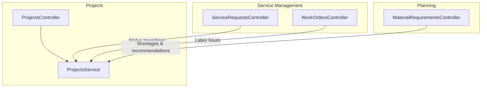

**Diagram sources**
- [projects.controller.ts:24-120](file://apps/api/src/projects/projects.controller.ts#L24-L120)
- [projects.service.ts:30-282](file://apps/api/src/projects/projects.service.ts#L30-L282)
- [service-requests.controller.ts:14-83](file://apps/api/src/service-requests/service-requests.controller.ts#L14-L83)
- [work-orders.controller.ts:10-70](file://apps/api/src/work-orders/work-orders.controller.ts#L10-L70)
- [material-requirements.controller.ts:6-36](file://apps/api/src/material-requirements/material-requirements.controller.ts#L6-L36)

**Section sources**
- [0041-project-management.md:1-112](file://docs/rfcs/0041-project-management.md#L1-L112)
- [0046-service-requests.md:1-129](file://docs/rfcs/0046-service-requests.md#L1-L129)
- [0047-work-orders-and-repairs.md:1-126](file://docs/rfcs/0047-work-orders-and-repairs.md#L1-L126)
- [0051-material-requirements-planning.md:1-114](file://docs/rfcs/0051-material-requirements-planning.md#L1-L114)

## Core Components
- Project Management: Lifecycle states, milestones, deliverables, and material allocation/issue/return within projects.
- Task Management: Discrete work items linked to projects with status transitions and hour estimation vs actuals.
- Time Tracking: Submission, approval workflow, and aggregation into task actual hours.
- Service Requests: Intake, assignment, diagnosis, parts waiting, repair, completion, closure, and cancellation.
- Work Orders: Technician dispatch, planned vs actual labor hours, and execution state.
- MRP: Planning runs, net requirement calculation, shortage identification, and recommendation generation.

Key responsibilities:
- Controllers expose HTTP endpoints and route to services.
- Services enforce invariants, orchestrate cross-context references, and persist aggregates.
- RFCs define domain models, state machines, commands, queries, and API design.

**Section sources**
- [0041-project-management.md:15-112](file://docs/rfcs/0041-project-management.md#L15-L112)
- [0042-milestones-and-deliverables.md:15-98](file://docs/rfcs/0042-milestones-and-deliverables.md#L15-L98)
- [0043-task-management.md:15-118](file://docs/rfcs/0043-task-management.md#L15-L118)
- [0044-time-tracking.md:15-103](file://docs/rfcs/0044-time-tracking.md#L15-L103)
- [0046-service-requests.md:15-129](file://docs/rfcs/0046-service-requests.md#L15-L129)
- [0047-work-orders-and-repairs.md:15-126](file://docs/rfcs/0047-work-orders-and-repairs.md#L15-L126)
- [0051-material-requirements-planning.md:14-114](file://docs/rfcs/0051-material-requirements-planning.md#L14-L114)
- [0052-demand-and-supply-planning.md:13-102](file://docs/rfcs/0052-demand-and-supply-planning.md#L13-L102)

## Architecture Overview
The architecture separates concerns across bounded contexts with clear integration boundaries. Projects integrate with Sales and Inventory; Service Requests reference CRM/Sales/Projects/Inventory; Work Orders are scoped to Service Requests; MRP reads demand and supply signals without mutating source systems.

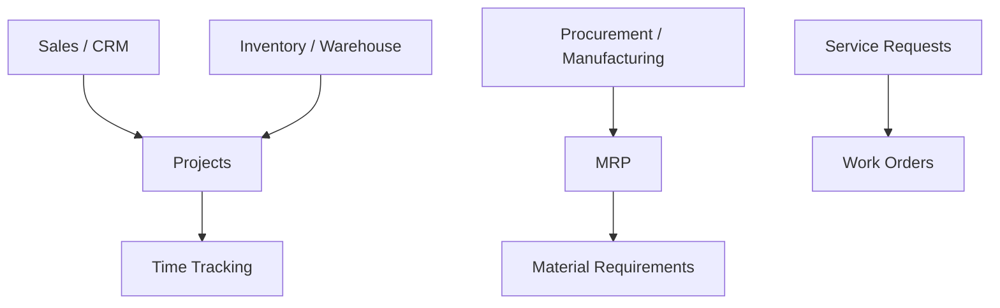

**Diagram sources**
- [0045-project-integration.md:71-79](file://docs/rfcs/0045-project-integration.md#L71-L79)
- [0046-service-requests.md:95-100](file://docs/rfcs/0046-service-requests.md#L95-L100)
- [0051-material-requirements-planning.md:83-88](file://docs/rfcs/0051-material-requirements-planning.md#L83-L88)

## Detailed Component Analysis

### Project Lifecycle and Milestones
- States: PLANNING → ACTIVE → COMPLETED, with ON_HOLD and CANCELLED branches.
- Milestones: OPEN → COMPLETED, with reopen capability; contribute weighted progress to project completion.
- Material operations: allocate, issue, return with stock validation and inventory transaction logging.

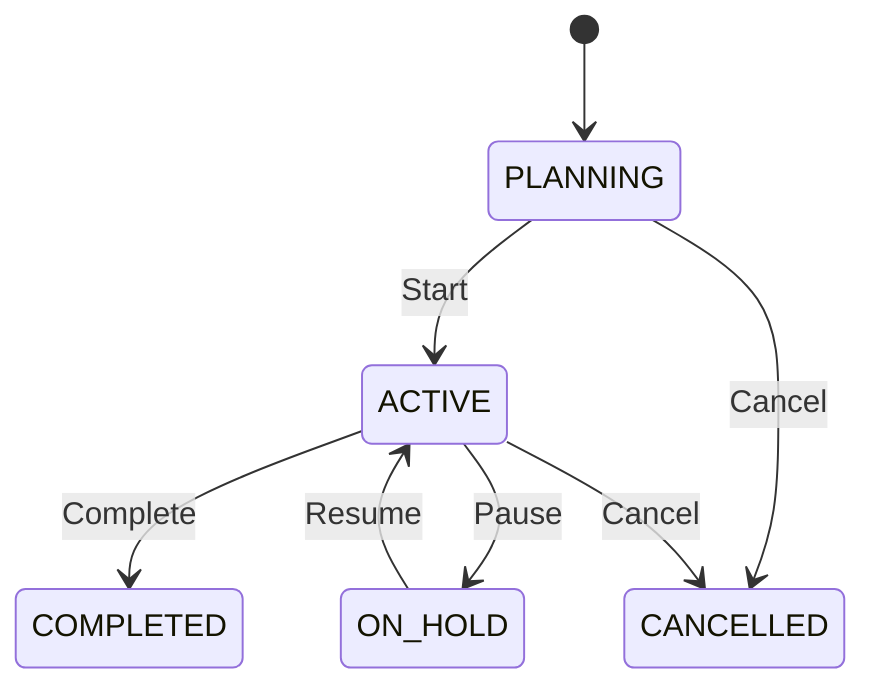

**Diagram sources**
- [0041-project-management.md:65-73](file://docs/rfcs/0041-project-management.md#L65-L73)

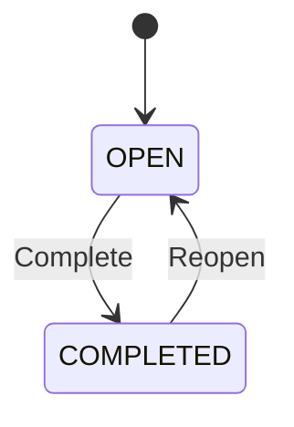

**Diagram sources**
- [0042-milestones-and-deliverables.md:60-64](file://docs/rfcs/0042-milestones-and-deliverables.md#L60-L64)

API surface highlights:
- Create, update, list, find project.
- Start, pause, complete, archive, cancel project.
- Add milestone, complete milestone.
- Allocate, issue, return materials.

**Section sources**
- [projects.controller.ts:29-119](file://apps/api/src/projects/projects.controller.ts#L29-L119)
- [projects.service.ts:40-280](file://apps/api/src/projects/projects.service.ts#L40-L280)
- [0041-project-management.md:21-112](file://docs/rfcs/0041-project-management.md#L21-L112)
- [0042-milestones-and-deliverables.md:20-98](file://docs/rfcs/0042-milestones-and-deliverables.md#L20-L98)

### Task Management
- States: TODO → IN_PROGRESS → DONE, with BLOCKED and CANCELLED branches.
- Estimated vs actual hours: Actual hours accumulate from approved time entries.
- Assignments: Track assigned users and priority.

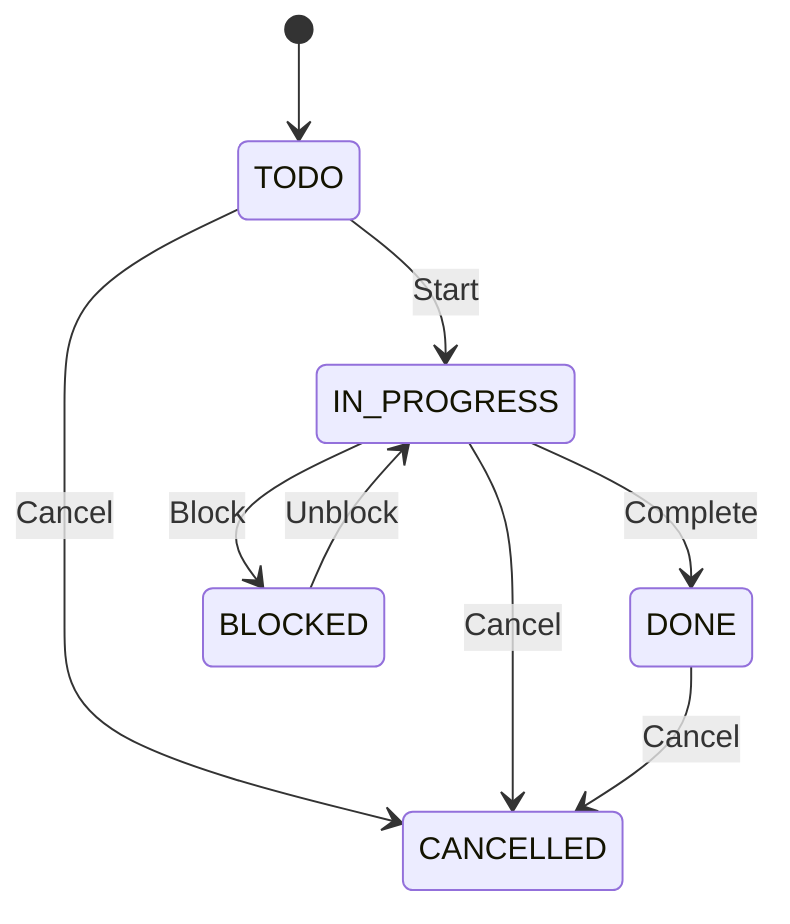

**Diagram sources**
- [0043-task-management.md:67-75](file://docs/rfcs/0043-task-management.md#L67-L75)

Integration points:
- Linked to projects and milestones.
- Time entries update actual hours upon approval.

**Section sources**
- [0043-task-management.md:15-118](file://docs/rfcs/0043-task-management.md#L15-L118)
- [0044-time-tracking.md:75-81](file://docs/rfcs/0044-time-tracking.md#L75-L81)

### Time Tracking Integration
- States: SUBMITTED → APPROVED or REJECTED.
- Approval updates task actual hours.
- Constraints: Hours per entry > 0 and ≤ 24; only open/in-progress/blocked tasks accept time entries.

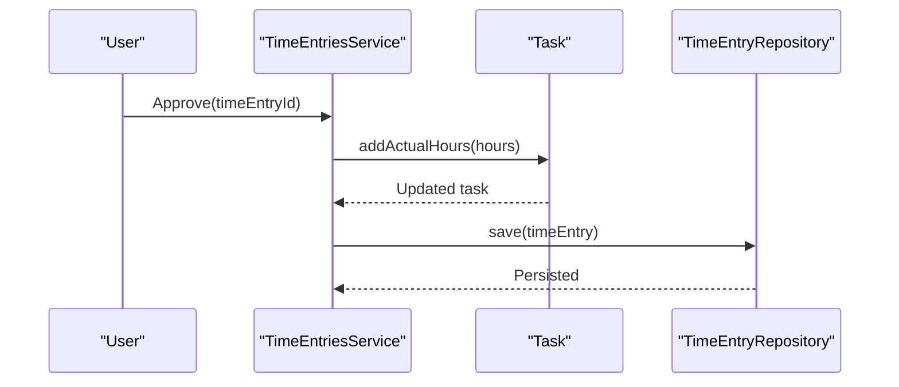

**Diagram sources**
- [0044-time-tracking.md:69-73](file://docs/rfcs/0044-time-tracking.md#L69-L73)

**Section sources**
- [0044-time-tracking.md:15-103](file://docs/rfcs/0044-time-tracking.md#L15-L103)

### Service Request Workflow
- States: OPEN → ASSIGNED → DIAGNOSING → WAITING_PARTS → REPAIRING → COMPLETED → CLOSED; CANCELLED branch.
- Cross-context references: Customer, Sales Order, Project, Component/Serial.

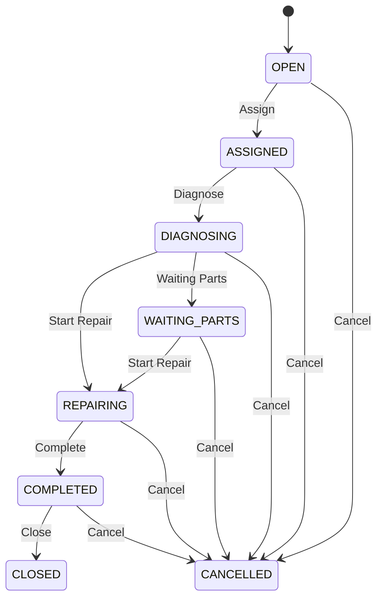

**Diagram sources**
- [0046-service-requests.md:71-84](file://docs/rfcs/0046-service-requests.md#L71-L84)

API surface highlights:
- Create, list, find service request.
- Assign, diagnose, set waiting parts, start repair, complete, close, cancel.

**Section sources**
- [service-requests.controller.ts:20-82](file://apps/api/src/service-requests/service-requests.controller.ts#L20-L82)
- [0046-service-requests.md:21-129](file://docs/rfcs/0046-service-requests.md#L21-L129)

### Work Order Management
- States: CREATED → ASSIGNED → IN_PROGRESS → PAUSED → COMPLETED; CANCELLED branch.
- Tracks planned vs actual labor hours; integrates with service requests.

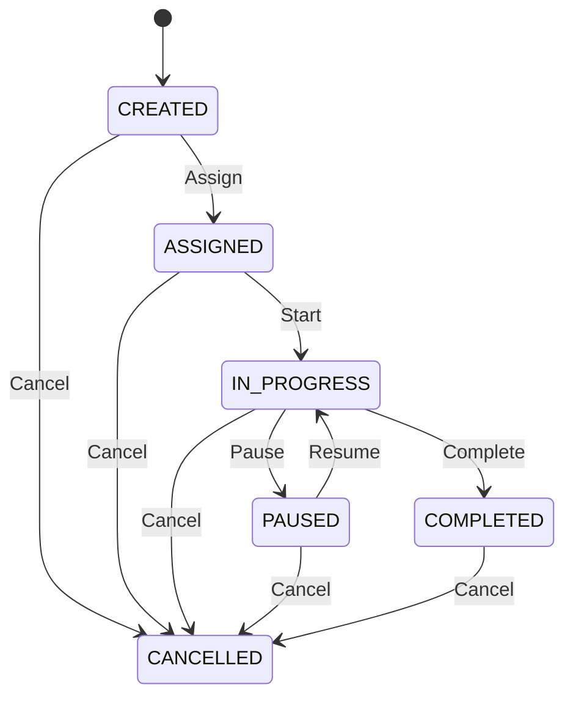

**Diagram sources**
- [0047-work-orders-and-repairs.md:70-82](file://docs/rfcs/0047-work-orders-and-repairs.md#L70-L82)

API surface highlights:
- Create, list, find work order.
- Assign, start, pause, log hours, complete, cancel.

**Section sources**
- [work-orders.controller.ts:14-69](file://apps/api/src/work-orders/work-orders.controller.ts#L14-L69)
- [0047-work-orders-and-repairs.md:22-126](file://docs/rfcs/0047-work-orders-and-repairs.md#L22-L126)

### Material Requirements Planning (MRP)
- Planning Run lifecycle: DRAFT → RUNNING → COMPLETED; CANCELLED branch.
- Net Requirement Calculation: Gross Demand - (Available Stock + Scheduled Receipts) = Shortage (min 0).
- Sources: Sales, Projects, Manufacturing, Forecast; Supplies: Inventory, Purchase Orders, Production Orders.

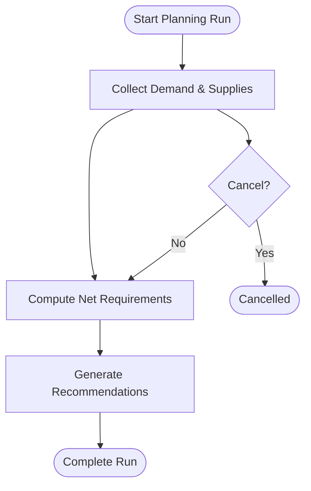

**Diagram sources**
- [0051-material-requirements-planning.md:64-81](file://docs/rfcs/0051-material-requirements-planning.md#L64-L81)

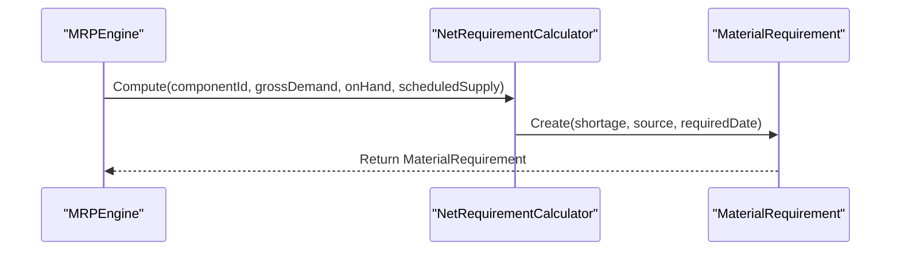

**Diagram sources**
- [0052-demand-and-supply-planning.md:66-74](file://docs/rfcs/0052-demand-and-supply-planning.md#L66-L74)

API surface highlights:
- Create material requirement.
- List with filters: planning run, component, source, shortages only.
- Find by ID.

**Section sources**
- [material-requirements.controller.ts:12-35](file://apps/api/src/material-requirements/material-requirements.controller.ts#L12-L35)
- [0051-material-requirements-planning.md:21-114](file://docs/rfcs/0051-material-requirements-planning.md#L21-L114)
- [0052-demand-and-supply-planning.md:21-102](file://docs/rfcs/0052-demand-and-supply-planning.md#L21-L102)

## Dependency Analysis
Cross-context relationships and constraints:
- Projects reference Sales and Customers; do not mutate external tables directly.
- Service Requests reference CRM/Sales/Projects/Inventory read-only.
- Work Orders depend on Service Requests but do not mutate Inventory/Finance directly.
- MRP reads demand/supply signals from Sales/Projects/Inventory/Procurement/Manufacturing.

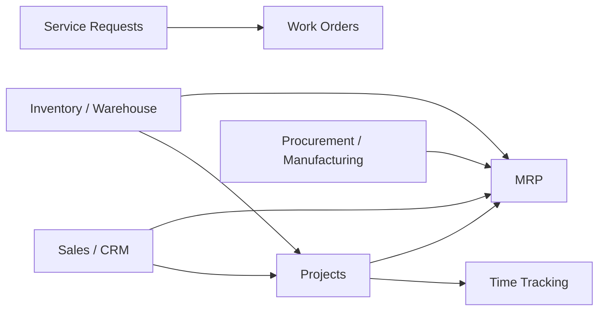

**Diagram sources**
- [0045-project-integration.md:71-79](file://docs/rfcs/0045-project-integration.md#L71-L79)
- [0046-service-requests.md:95-100](file://docs/rfcs/0046-service-requests.md#L95-L100)
- [0051-material-requirements-planning.md:83-88](file://docs/rfcs/0051-material-requirements-planning.md#L83-L88)

**Section sources**
- [0045-project-integration.md:52-79](file://docs/rfcs/0045-project-integration.md#L52-L79)
- [0046-service-requests.md:64-100](file://docs/rfcs/0046-service-requests.md#L64-L100)
- [0047-work-orders-and-repairs.md:93-100](file://docs/rfcs/0047-work-orders-and-repairs.md#L93-L100)
- [0051-material-requirements-planning.md:83-91](file://docs/rfcs/0051-material-requirements-planning.md#L83-L91)

## Performance Considerations
- Batch operations: Use bulk create/update where supported to reduce round trips.
- Projections: Leverage inventory projections to validate allocations/issues efficiently.
- Filtering: Apply server-side filters on controllers/services to minimize payload sizes.
- Indexing: Ensure database indexes on frequently filtered fields (status, priority, customer, dates).
- Idempotency: Design commands (start, complete, assign) to be idempotent for retries.
- Concurrency: Use optimistic concurrency control on aggregates to prevent lost updates.

[No sources needed since this section provides general guidance]

## Troubleshooting Guide
Common issues and resolutions:
- Invalid state transitions: Validate current state before applying command; ensure correct sequence (e.g., cannot approve time entries for completed/cancelled tasks).
- Insufficient stock: Check available stock via projections before allocating/issuing materials; handle BadRequest responses gracefully.
- Missing references: Validate existence of customer/sales order/component IDs before creating entities.
- SLA escalation: Implement automated triggers based on service request age and priority; monitor SLA breaches.
- Profitability variance: Compare estimated vs actual hours and costs; investigate deviations at project/task level.

Operational checks:
- Verify repository persistence after state changes.
- Confirm inventory projection rebuild after material transactions.
- Audit logs for critical actions (start, complete, cancel, approve).

**Section sources**
- [projects.service.ts:185-253](file://apps/api/src/projects/projects.service.ts#L185-L253)
- [0044-time-tracking.md:55-59](file://docs/rfcs/0044-time-tracking.md#L55-L59)
- [0046-service-requests.md:64-69](file://docs/rfcs/0046-service-requests.md#L64-L69)

## Conclusion
This schema unifies project planning, task execution, service request handling, work order management, and MRP-driven supply planning. It enforces clear state machines, robust cross-context references, and auditability. Time tracking integrates with tasks to support profitability analysis, while MRP optimizes demand forecasting and supply chain efficiency. The design supports extensibility for SLA monitoring, automated planning runs, and advanced analytics.

[No sources needed since this section summarizes without analyzing specific files]