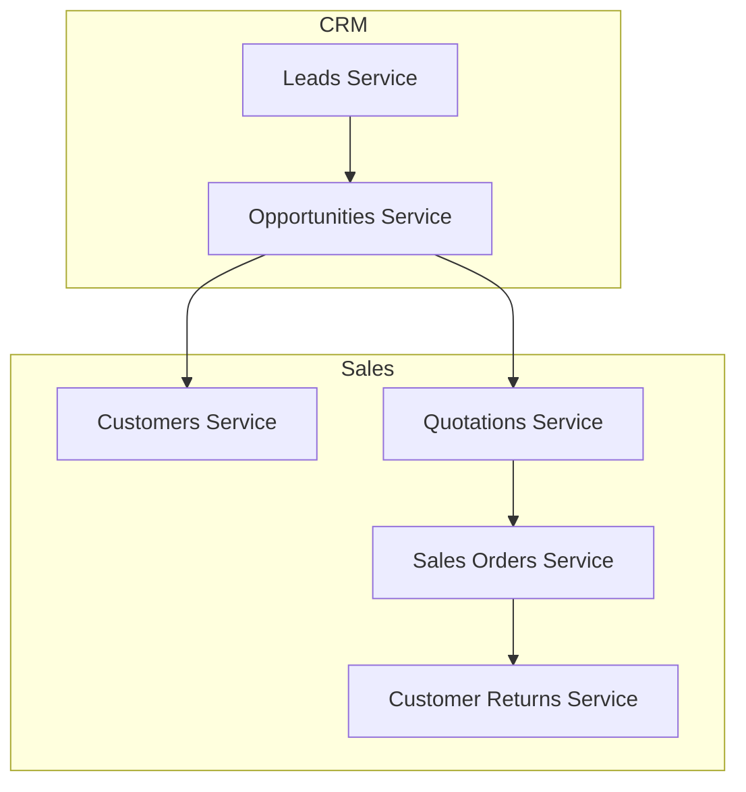
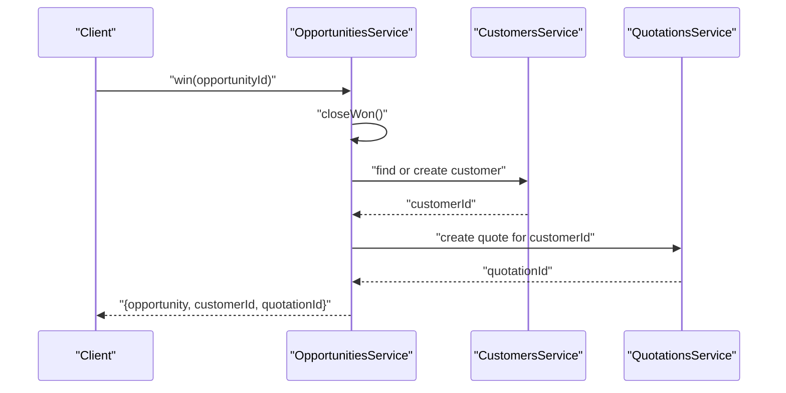
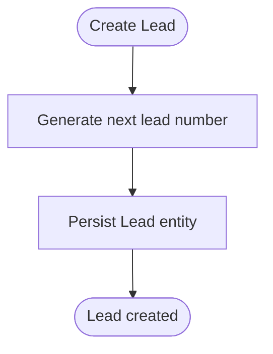
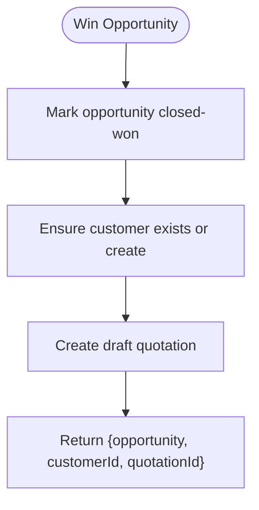
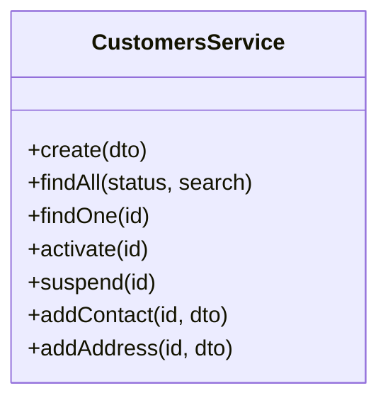
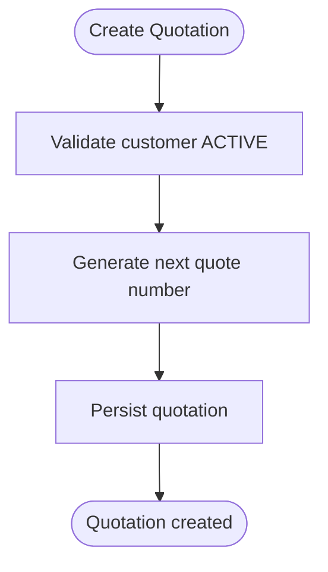
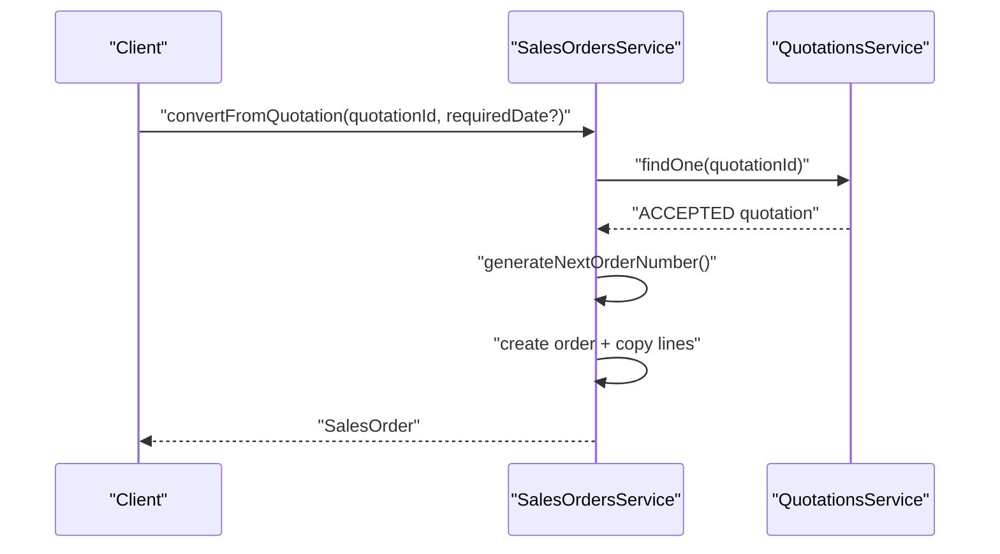
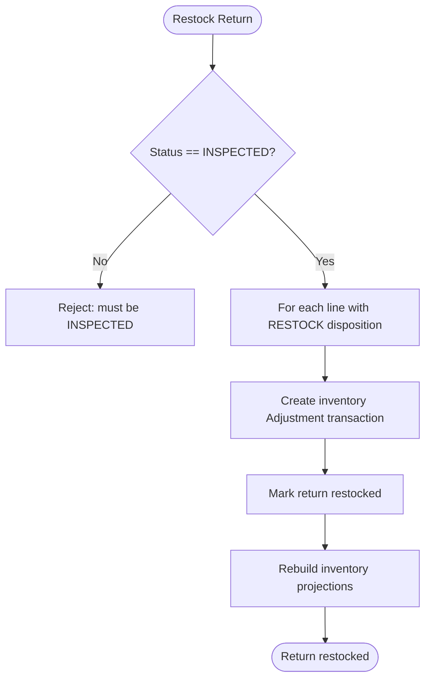
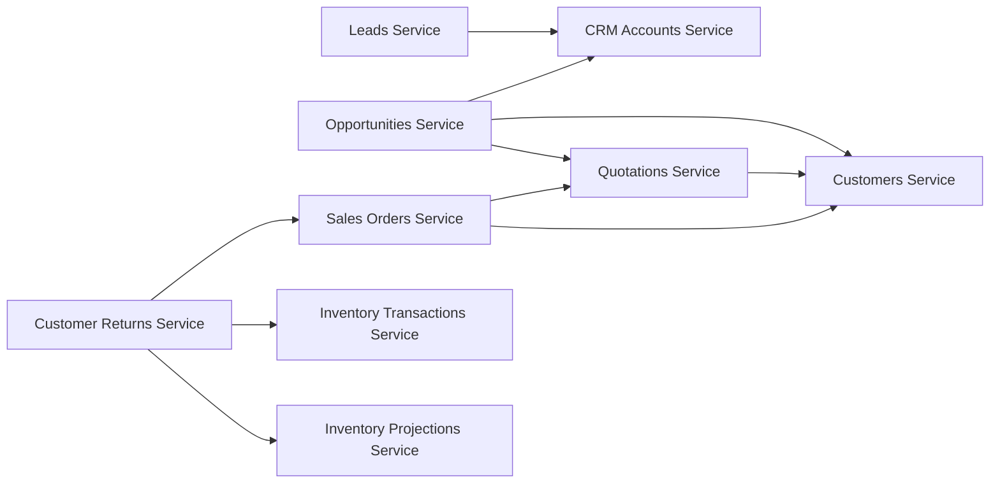

# Sales & CRM Schema

<cite>
**Referenced Files in This Document**
- [leads/dtos.ts](file://apps/api/src/leads/dtos.ts)
- [leads.service.ts](file://apps/api/src/leads/leads.service.ts)
- [opportunities/dtos.ts](file://apps/api/src/opportunities/dtos.ts)
- [opportunities.service.ts](file://apps/api/src/opportunities/opportunities.service.ts)
- [customers/dtos.ts](file://apps/api/src/customers/dtos.ts)
- [customers.service.ts](file://apps/api/src/customers/customers.service.ts)
- [quotations/dtos.ts](file://apps/api/src/quotations/dtos.ts)
- [quotations.service.ts](file://apps/api/src/quotations/quotations.service.ts)
- [sales-orders/dtos.ts](file://apps/api/src/sales-orders/dtos.ts)
- [sales-orders.service.ts](file://apps/api/src/sales-orders/sales-orders.service.ts)
- [customer-returns/dtos.ts](file://apps/api/src/customer-returns/dtos.ts)
- [customer-returns.service.ts](file://apps/api/src/customer-returns/customer-returns.service.ts)
</cite>

## Table of Contents
1. Introduction
2. Project Structure
3. Core Components
4. Architecture Overview
5. Detailed Component Analysis
6. Dependency Analysis
7. Performance Considerations
8. Troubleshooting Guide
9. Conclusion
10. Appendices

## Introduction
This document describes the sales and CRM schema and workflows implemented in the API layer, covering customer management, lead tracking, opportunity management, quotations, sales orders, and customer returns. It explains the end-to-end pipeline from lead generation to order fulfillment and return processing, including integration points with inventory projections for restocking. The focus is on data structures (DTOs), service logic, state transitions, and cross-module interactions that enable a complete sales lifecycle.

## Project Structure
The sales and CRM functionality is organized as NestJS modules under apps/api/src, each exposing controllers, services, and DTOs:
- Leads: capture and qualify leads; convert to CRM accounts and contacts
- Opportunities: manage pipeline stages; win/lose outcomes; handoff to sales
- Customers: master customer records with contacts and addresses
- Quotations: create/send/accept quotes with line items and pricing
- Sales Orders: create orders, convert from accepted quotations, approve/release/cancel
- Customer Returns: create/receive/inspect/restock/reject/close returns with inventory integration

**Diagram sources**
- [leads.service.ts:1-99](file://apps/api/src/leads/leads.service.ts#L1-L99)
- [opportunities.service.ts:1-135](file://apps/api/src/opportunities/opportunities.service.ts#L1-L135)
- [customers.service.ts:1-85](file://apps/api/src/customers/customers.service.ts#L1-L85)
- [quotations.service.ts:1-83](file://apps/api/src/quotations/quotations.service.ts#L1-L83)
- [sales-orders.service.ts:1-135](file://apps/api/src/sales-orders/sales-orders.service.ts#L1-L135)
- [customer-returns.service.ts:1-160](file://apps/api/src/customer-returns/customer-returns.service.ts#L1-L160)

**Section sources**
- [leads.service.ts:1-99](file://apps/api/src/leads/leads.service.ts#L1-L99)
- [opportunities.service.ts:1-135](file://apps/api/src/opportunities/opportunities.service.ts#L1-L135)
- [customers.service.ts:1-85](file://apps/api/src/customers/customers.service.ts#L1-L85)
- [quotations.service.ts:1-83](file://apps/api/src/quotations/quotations.service.ts#L1-L83)
- [sales-orders.service.ts:1-135](file://apps/api/src/sales-orders/sales-orders.service.ts#L1-L135)
- [customer-returns.service.ts:1-160](file://apps/api/src/customer-returns/customer-returns.service.ts#L1-L160)

## Core Components
- Lead Management: Create, assign, qualify/disqualify, and convert leads into CRM accounts and primary contacts.
- Opportunity Pipeline: Create opportunities linked to CRM accounts; advance stages; close won/lost; auto-create customer and draft quotation on win.
- Customer Master Data: Create customers with currency and tax identifiers; add contacts and addresses; activate/suspend status.
- Quotations: Create quotes for active customers; add line items with quantity, unit price, discount; send/accept/cancel; enforce validity.
- Sales Orders: Create orders referencing customers and optional quotations; convert accepted quotations to orders preserving lines and pricing; approve/release/update fulfillment/cancel.
- Customer Returns: Create returns against sales orders; add lines with reasons; approve/receive/inspect; restock eligible items via inventory transactions; reject/close.

Key input models (DTOs) define required fields and validations across these components.

**Section sources**
- [leads/dtos.ts:1-45](file://apps/api/src/leads/dtos.ts#L1-L45)
- [opportunities/dtos.ts:1-48](file://apps/api/src/opportunities/dtos.ts#L1-L48)
- [customers/dtos.ts:1-87](file://apps/api/src/customers/dtos.ts#L1-L87)
- [quotations/dtos.ts:1-42](file://apps/api/src/quotations/dtos.ts#L1-L42)
- [sales-orders/dtos.ts:1-61](file://apps/api/src/sales-orders/dtos.ts#L1-L61)
- [customer-returns/dtos.ts:1-48](file://apps/api/src/customer-returns/dtos.ts#L1-L48)

## Architecture Overview
The system follows a layered architecture where controllers delegate to services, which orchestrate domain entities and repositories. Cross-cutting flows include:
- CRM to Sales handoff on opportunity win
- Quotation-to-Order conversion preserving pricing and discounts
- Return processing with inventory adjustments and projection rebuild

**Diagram sources**
- [opportunities.service.ts:81-126](file://apps/api/src/opportunities/opportunities.service.ts#L81-L126)
- [customers.service.ts:24-37](file://apps/api/src/customers/customers.service.ts#L24-L37)
- [quotations.service.ts:21-38](file://apps/api/src/quotations/quotations.service.ts#L21-L38)

## Detailed Component Analysis

### Lead Management
- Creation: Generates unique lead number; persists lead with name, company, email, phone, source, industry, owner.
- Assignment/Qualification: Assign owner; qualify or disqualify with reason; persist state changes.
- Conversion: On convert, creates a CRM account and a primary contact derived from lead details; updates lead state.

**Diagram sources**
- [leads.service.ts:16-30](file://apps/api/src/leads/leads.service.ts#L16-L30)

**Section sources**
- [leads/dtos.ts:1-45](file://apps/api/src/leads/dtos.ts#L1-L45)
- [leads.service.ts:16-97](file://apps/api/src/leads/leads.service.ts#L16-L97)

### Opportunity Pipeline
- Creation: Validates CRM account existence; generates opportunity number; persists estimated value, expected close date, probability.
- Stage Advancement: Enforces stage transitions; persists updated stage.
- Close Won: Marks opportunity won; attempts to create or reuse a customer; creates a draft quotation; returns IDs for downstream use.
- Close Lost: Records reason and persists lost state.

**Diagram sources**
- [opportunities.service.ts:81-126](file://apps/api/src/opportunities/opportunities.service.ts#L81-L126)

**Section sources**
- [opportunities/dtos.ts:1-48](file://apps/api/src/opportunities/dtos.ts#L1-L48)
- [opportunities.service.ts:34-133](file://apps/api/src/opportunities/opportunities.service.ts#L34-L133)

### Customer Management
- Creation: Generates customer number; persists name, email, phone, tax ID, currency.
- Contacts and Addresses: Add multiple contacts and addresses; mark primary/default flags.
- Status Control: Activate or suspend customers; enforced by downstream services before creating quotes/orders.

**Diagram sources**
- [customers.service.ts:18-84](file://apps/api/src/customers/customers.service.ts#L18-L84)

**Section sources**
- [customers/dtos.ts:1-87](file://apps/api/src/customers/dtos.ts#L1-L87)
- [customers.service.ts:24-84](file://apps/api/src/customers/customers.service.ts#L24-L84)

### Quotations
- Creation: Validates customer is ACTIVE; generates quote number; sets currency (defaults to customer currency); optional validity period.
- Line Items: Adds lines with component, quantity, unit price, and optional discount.
- Lifecycle: Send, accept, cancel; enforces state transitions.

**Diagram sources**
- [quotations.service.ts:21-38](file://apps/api/src/quotations/quotations.service.ts#L21-L38)

**Section sources**
- [quotations/dtos.ts:1-42](file://apps/api/src/quotations/dtos.ts#L1-L42)
- [quotations.service.ts:21-81](file://apps/api/src/quotations/quotations.service.ts#L21-L81)

### Sales Orders
- Creation: Validates customer ACTIVE; generates order number; supports optional order/required dates and quotation reference.
- Quotation Conversion: Converts ACCEPTED quotations to orders, copying lines with quantities, prices, and discounts; preserves required date if provided.
- Fulfillment: Approve, release, update per-line fulfillment, cancel.

**Diagram sources**
- [sales-orders.service.ts:51-79](file://apps/api/src/sales-orders/sales-orders.service.ts#L51-L79)

**Section sources**
- [sales-orders/dtos.ts:1-61](file://apps/api/src/sales-orders/dtos.ts#L1-L61)
- [sales-orders.service.ts:31-133](file://apps/api/src/sales-orders/sales-orders.service.ts#L31-L133)

### Customer Returns
- Creation: Validates sales order belongs to the returning customer; generates return number; persists notes.
- Lines: Add return lines tied to sales order lines; validate quantity against fulfilled quantity.
- Inspection and Restocking: Approve, receive, inspect dispositions; restock eligible items by creating inventory adjustment transactions; rebuild inventory projections.
- Finalization: Reject or close returns.

**Diagram sources**
- [customer-returns.service.ts:114-143](file://apps/api/src/customer-returns/customer-returns.service.ts#L114-L143)

**Section sources**
- [customer-returns/dtos.ts:1-48](file://apps/api/src/customer-returns/dtos.ts#L1-L48)
- [customer-returns.service.ts:33-158](file://apps/api/src/customer-returns/customer-returns.service.ts#L33-L158)

## Dependency Analysis
- Leads depend on CRM accounts to create accounts and contacts during conversion.
- Opportunities depend on CRM accounts, customers, and quotations to perform the sales handoff on win.
- Quotations depend on customers to ensure ACTIVE status and inherit currency.
- Sales Orders depend on customers and quotations for creation and conversion.
- Customer Returns depend on sales orders for validation and on inventory services for restocking and projection rebuild.

**Diagram sources**
- [leads.service.ts:1-99](file://apps/api/src/leads/leads.service.ts#L1-L99)
- [opportunities.service.ts:1-135](file://apps/api/src/opportunities/opportunities.service.ts#L1-L135)
- [quotations.service.ts:1-83](file://apps/api/src/quotations/quotations.service.ts#L1-L83)
- [sales-orders.service.ts:1-135](file://apps/api/src/sales-orders/sales-orders.service.ts#L1-L135)
- [customer-returns.service.ts:1-160](file://apps/api/src/customer-returns/customer-returns.service.ts#L1-L160)

**Section sources**
- [leads.service.ts:1-99](file://apps/api/src/leads/leads.service.ts#L1-L99)
- [opportunities.service.ts:1-135](file://apps/api/src/opportunities/opportunities.service.ts#L1-L135)
- [quotations.service.ts:1-83](file://apps/api/src/quotations/quotations.service.ts#L1-L83)
- [sales-orders.service.ts:1-135](file://apps/api/src/sales-orders/sales-orders.service.ts#L1-L135)
- [customer-returns.service.ts:1-160](file://apps/api/src/customer-returns/customer-returns.service.ts#L1-L160)

## Performance Considerations
- Repository calls are centralized in services; ensure efficient queries for list endpoints by leveraging repository filters (status, search, IDs).
- Avoid unnecessary lookups: opportunities win path performs a single customer lookup or creation followed by one quotation creation.
- Inventory projection rebuild occurs only after restocking returns; batch operations can reduce repeated rebuilds if multiple returns are processed together.
- Validation at DTO level reduces round-trips by catching invalid inputs early.

[No sources needed since this section provides general guidance]

## Troubleshooting Guide
Common errors and their causes:
- Creating quotations or sales orders for inactive customers: Services enforce ACTIVE status; activate the customer first.
- Converting non-accepted quotations: Only ACCEPTED quotations can be converted to sales orders.
- Returning more than fulfilled quantity: Return lines cannot exceed the shipped/fulfilled quantity on the corresponding sales order line.
- Restocking without inspection: Returns must reach INSPECTED status before restocking.

Remediation steps:
- Verify customer status before creating quotes/orders.
- Ensure quotations are sent and accepted prior to conversion.
- Check sales order line fulfillment before adding return lines.
- Follow the return workflow: approve -> receive -> inspect -> restock/reject/close.

**Section sources**
- [quotations.service.ts:21-38](file://apps/api/src/quotations/quotations.service.ts#L21-L38)
- [sales-orders.service.ts:31-57](file://apps/api/src/sales-orders/sales-orders.service.ts#L31-L57)
- [customer-returns.service.ts:71-89](file://apps/api/src/customer-returns/customer-returns.service.ts#L71-L89)
- [customer-returns.service.ts:114-119](file://apps/api/src/customer-returns/customer-returns.service.ts#L114-L119)

## Conclusion
The API implements a cohesive sales and CRM pipeline:
- Leads convert to CRM accounts and contacts
- Opportunities drive pipeline progression and hand off to sales upon winning
- Quotations formalize pricing and terms, convertible to sales orders
- Sales orders manage fulfillment and can be adjusted over time
- Customer returns integrate with inventory to adjust stock and projections

These components provide a robust foundation for managing the end-to-end sales lifecycle with clear state transitions and integrations.

[No sources needed since this section summarizes without analyzing specific files]

## Appendices

### Data Models Summary (by DTOs)
- Leads: name, company, email, phone, source, industry, owner; assignment and disqualification reasons
- Opportunities: name, leadId, crmAccountId, estimatedValue, expectedCloseDate, probability; stage advancement and close reasons
- Customers: name, email, phone, taxId, currency; contacts (name, email, phone, role, isPrimary); addresses (type, street, city, postalCode, country, isDefault)
- Quotations: customerId, currency, validUntil; lines (componentId, quantity, unitPrice, discount)
- Sales Orders: customerId, orderDate, requiredDate, quotationId; lines (componentId, quantity, unitPrice, discount, tax); conversion from quotations
- Customer Returns: customerId, salesOrderId, notes; lines (salesOrderLineId, componentId, quantity, reason); inspection dispositions

**Section sources**
- [leads/dtos.ts:1-45](file://apps/api/src/leads/dtos.ts#L1-L45)
- [opportunities/dtos.ts:1-48](file://apps/api/src/opportunities/dtos.ts#L1-L48)
- [customers/dtos.ts:1-87](file://apps/api/src/customers/dtos.ts#L1-L87)
- [quotations/dtos.ts:1-42](file://apps/api/src/quotations/dtos.ts#L1-L42)
- [sales-orders/dtos.ts:1-61](file://apps/api/src/sales-orders/dtos.ts#L1-L61)
- [customer-returns/dtos.ts:1-48](file://apps/api/src/customer-returns/dtos.ts#L1-L48)