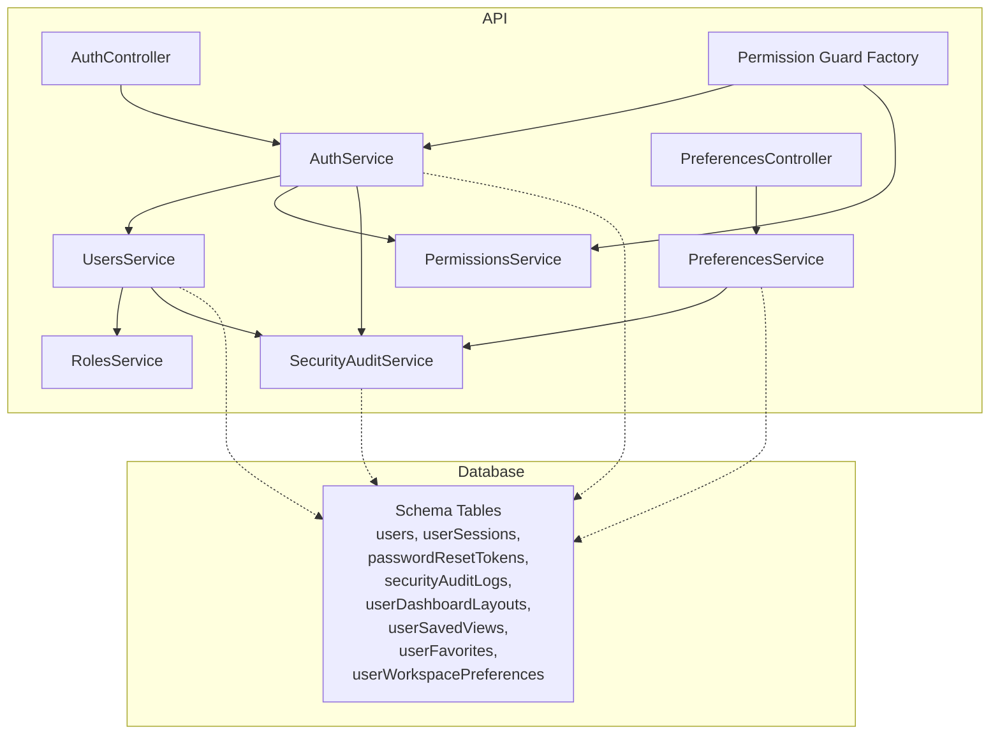
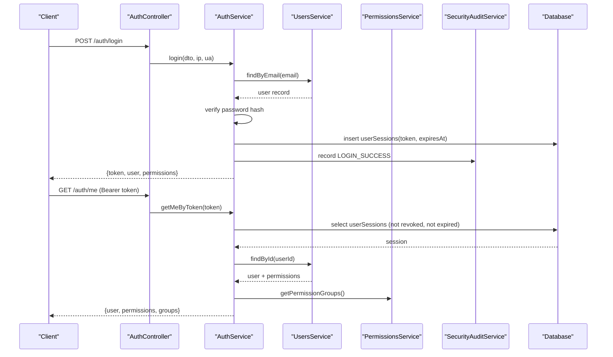
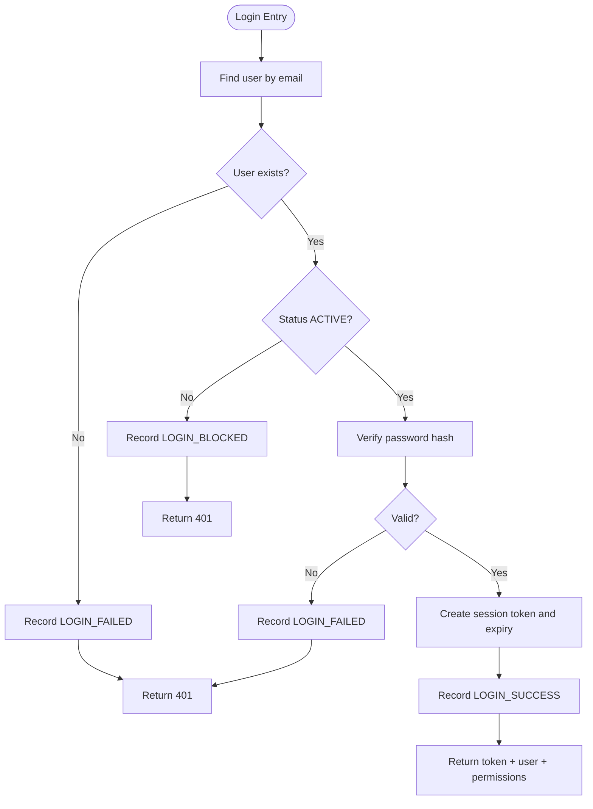
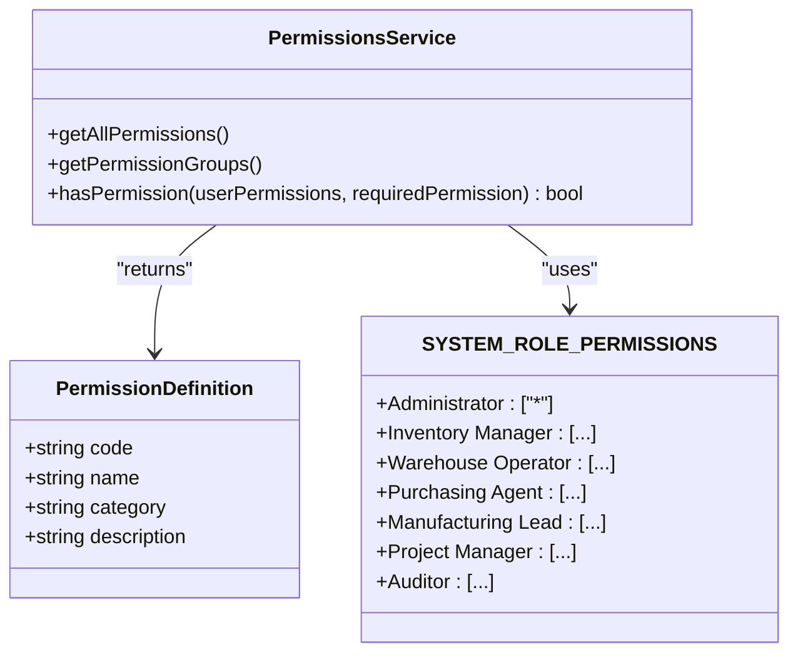
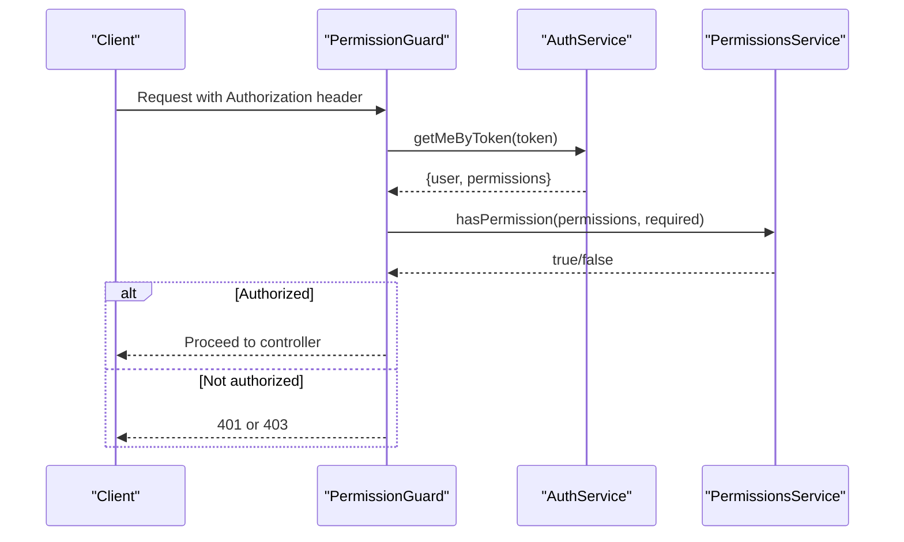
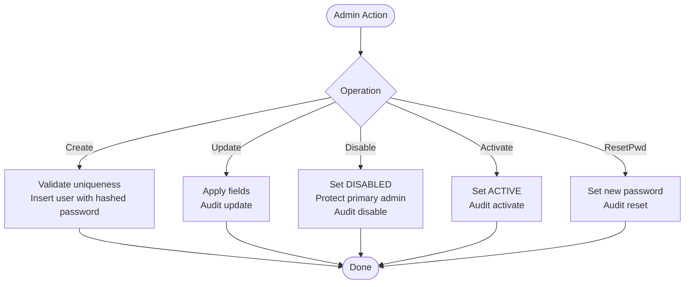
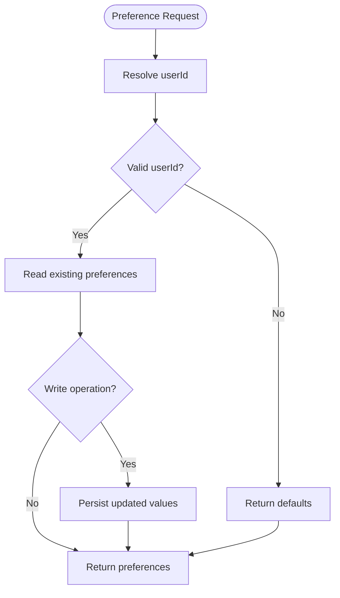
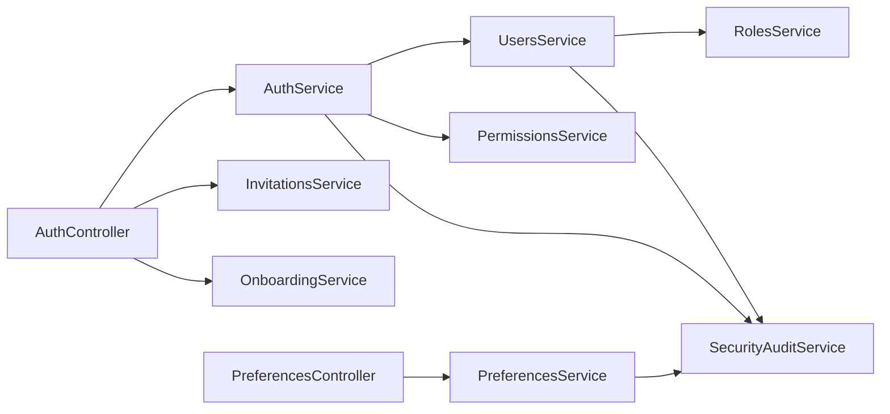

# User & Security Schema

<cite>
**Referenced Files in This Document**
- [auth.controller.ts](file://apps/api/src/auth/auth.controller.ts)
- [auth.service.ts](file://apps/api/src/auth/auth.service.ts)
- [permission.guard.ts](file://apps/api/src/auth/permission.guard.ts)
- [component-write.guard.ts](file://apps/api/src/auth/component-write.guard.ts)
- [permissions.service.ts](file://apps/api/src/permissions/permissions.service.ts)
- [security-audit.service.ts](file://apps/api/src/security-audit/security-audit.service.ts)
- [users.controller.ts](file://apps/api/src/users/users.controller.ts)
- [users.service.ts](file://apps/api/src/users/users.service.ts)
- [roles.controller.ts](file://apps/api/src/roles/roles.controller.ts)
- [preferences.controller.ts](file://apps/api/src/preferences/preferences.controller.ts)
- [preferences.service.ts](file://apps/api/src/preferences/preferences.service.ts)
- [organization-reset.service.ts](file://apps/api/src/settings/organization-reset.service.ts)
- [AUTHENTICATION.md](file://docs/AUTHENTICATION.md)
- [SECURITY.md](file://SECURITY.md)
</cite>

## Table of Contents
1. Introduction
2. Project Structure
3. Core Components
4. Architecture Overview
5. Detailed Component Analysis
6. Dependency Analysis
7. Performance Considerations
8. Troubleshooting Guide
9. Conclusion
10. Appendices

## Introduction
This document describes the user and security schema for authentication, authorization, account management, preferences, audit logging, and multi-tenancy support. It explains role-based access control (RBAC), session management, security event tracking, preference storage, provisioning workflows, and bulk operations where applicable. The goal is to provide a clear, code-mapped reference for both technical and non-technical readers.

## Project Structure
The user and security features are implemented primarily in the API application under apps/api/src with supporting documentation in docs and a security policy at the repository root. Key areas include:
- Authentication endpoints and session lifecycle
- RBAC permission definitions and guards
- User and role administration
- Preferences for personalization and workspace settings
- Security audit logging
- Multi-tenant data reset behavior

**Diagram sources**
- [auth.controller.ts:24-110](file://apps/api/src/auth/auth.controller.ts#L24-L110)
- [auth.service.ts:29-333](file://apps/api/src/auth/auth.service.ts#L29-L333)
- [permission.guard.ts:67-150](file://apps/api/src/auth/permission.guard.ts#L67-L150)
- [permissions.service.ts:15-248](file://apps/api/src/permissions/permissions.service.ts#L15-L248)
- [security-audit.service.ts:15-51](file://apps/api/src/security-audit/security-audit.service.ts#L15-L51)
- [users.controller.ts:5-50](file://apps/api/src/users/users.controller.ts#L5-L50)
- [users.service.ts:19-248](file://apps/api/src/users/users.service.ts#L19-L248)
- [preferences.controller.ts:19-86](file://apps/api/src/preferences/preferences.controller.ts#L19-L86)
- [preferences.service.ts:56-312](file://apps/api/src/preferences/preferences.service.ts#L56-L312)

**Section sources**
- [auth.controller.ts:24-110](file://apps/api/src/auth/auth.controller.ts#L24-L110)
- [AUTHENTICATION.md:1-65](file://docs/AUTHENTICATION.md#L1-L65)

## Core Components
- Authentication and sessions: login, logout, password change/reset, session validation, token revocation.
- Authorization: permission definitions, system roles, guard-based enforcement.
- Account management: create, update, activate/disable users; admin password resets.
- Preferences: dashboard layout, saved views, favorites, workspace preferences.
- Audit logging: security events for auth, user changes, preferences, and organization reset.
- Multi-tenancy: membership model and organization reset preserving tenant configuration.

**Section sources**
- [auth.service.ts:37-333](file://apps/api/src/auth/auth.service.ts#L37-L333)
- [permissions.service.ts:15-248](file://apps/api/src/permissions/permissions.service.ts#L15-L248)
- [users.service.ts:121-248](file://apps/api/src/users/users.service.ts#L121-L248)
- [preferences.service.ts:75-312](file://apps/api/src/preferences/preferences.service.ts#L75-L312)
- [security-audit.service.ts:15-51](file://apps/api/src/security-audit/security-audit.service.ts#L15-L51)
- [organization-reset.service.ts:43-144](file://apps/api/src/settings/organization-reset.service.ts#L43-L144)

## Architecture Overview
Authentication uses Bearer tokens stored as server-side sessions. Requests are authenticated by validating the session token and checking user status. Authorization is enforced via permission guards that check explicit permissions or wildcard domain-level permissions. All sensitive actions are recorded in the security audit log.

**Diagram sources**
- [auth.controller.ts:32-49](file://apps/api/src/auth/auth.controller.ts#L32-L49)
- [auth.service.ts:37-184](file://apps/api/src/auth/auth.service.ts#L37-L184)
- [permissions.service.ts:214-248](file://apps/api/src/permissions/permissions.service.ts#L214-L248)
- [security-audit.service.ts:15-51](file://apps/api/src/security-audit/security-audit.service.ts#L15-L51)

## Detailed Component Analysis

### Authentication and Session Management
- Login flow validates credentials, updates last login, creates a session token with expiry based on remember-me, and records success.
- Logout revokes the session and logs the action.
- Password change verifies current password and updates the hash; password reset issues a time-bound token and marks it used upon completion.
- Session validation rejects missing, expired, or revoked tokens and ensures user status is active.

**Diagram sources**
- [auth.service.ts:37-138](file://apps/api/src/auth/auth.service.ts#L37-L138)

**Section sources**
- [auth.controller.ts:32-69](file://apps/api/src/auth/auth.controller.ts#L32-L69)
- [auth.service.ts:37-333](file://apps/api/src/auth/auth.service.ts#L37-L333)

### Role-Based Access Control (RBAC)
- Permission definitions are grouped by category (Inventory, Procurement, Manufacturing, Projects, Reporting, Administration).
- System roles map to specific permissions; Administrator has wildcard access.
- Guards enforce required permissions per endpoint; missing permissions result in 403.

**Diagram sources**
- [permissions.service.ts:15-248](file://apps/api/src/permissions/permissions.service.ts#L15-L248)

**Section sources**
- [permissions.service.ts:15-248](file://apps/api/src/permissions/permissions.service.ts#L15-L248)
- [permission.guard.ts:67-150](file://apps/api/src/auth/permission.guard.ts#L67-L150)
- [component-write.guard.ts:8-34](file://apps/api/src/auth/component-write.guard.ts#L8-L34)

### Authorization Guard Flow
- Extracts Bearer token from headers.
- Validates session via AuthService.getMeByToken.
- Ensures user status is active.
- Checks required permission using PermissionsService.hasPermission.
- Populates request.user and sets request context.

**Diagram sources**
- [permission.guard.ts:67-150](file://apps/api/src/auth/permission.guard.ts#L67-L150)
- [auth.service.ts:164-184](file://apps/api/src/auth/auth.service.ts#L164-L184)
- [permissions.service.ts:235-248](file://apps/api/src/permissions/permissions.service.ts#L235-L248)

**Section sources**
- [permission.guard.ts:67-150](file://apps/api/src/auth/permission.guard.ts#L67-L150)
- [component-write.guard.ts:8-34](file://apps/api/src/auth/component-write.guard.ts#L8-L34)

### Account Management
- Create user with hashed password and default ACTIVE status; audit creation.
- Update user profile and role; audit updates.
- Disable/activate users; protect primary admin from disabling; audit state changes.
- Admin password reset; audit reset.

**Diagram sources**
- [users.service.ts:121-248](file://apps/api/src/users/users.service.ts#L121-L248)

**Section sources**
- [users.controller.ts:5-50](file://apps/api/src/users/users.controller.ts#L5-L50)
- [users.service.ts:121-248](file://apps/api/src/users/users.service.ts#L121-L248)

### Roles Management
- CRUD endpoints for roles; system roles ensured at startup.

**Section sources**
- [roles.controller.ts:13-42](file://apps/api/src/roles/roles.controller.ts#L13-L42)
- [users.service.ts:26-36](file://apps/api/src/users/users.service.ts#L26-L36)

### Preferences Storage
- Dashboard layout: default widgets if none exist; update persists JSON layout.
- Saved views: store filters, sorting, columns per module; audit creation.
- Favorites: add/remove entity references; ownership by userId.
- Workspace preferences: landing page, table density, theme; defaults applied when no user context.

**Diagram sources**
- [preferences.service.ts:63-312](file://apps/api/src/preferences/preferences.service.ts#L63-L312)

**Section sources**
- [preferences.controller.ts:19-86](file://apps/api/src/preferences/preferences.controller.ts#L19-L86)
- [preferences.service.ts:63-312](file://apps/api/src/preferences/preferences.service.ts#L63-L312)

### Security Audit Logging
- Records login attempts, successes, blocks, password changes, resets, user lifecycle events, session revocations, and organization resets.
- Provides filtered retrieval by category and user.

**Section sources**
- [security-audit.service.ts:15-51](file://apps/api/src/security-audit/security-audit.service.ts#L15-L51)
- [auth.service.ts:37-333](file://apps/api/src/auth/auth.service.ts#L37-L333)
- [users.service.ts:146-248](file://apps/api/src/users/users.service.ts#L146-L248)
- [preferences.service.ts:129-194](file://apps/api/src/preferences/preferences.service.ts#L129-L194)
- [organization-reset.service.ts:114-144](file://apps/api/src/settings/organization-reset.service.ts#L114-L144)

### Multi-Tenancy Support and Data Isolation
- Membership model maps users to organizations with roles and scopes; switching active organization does not require re-authentication.
- Organization reset purges business data while preserving tenant configuration, users, roles, and audit logs.

**Section sources**
- [AUTHENTICATION.md:45-65](file://docs/AUTHENTICATION.md#L45-L65)
- [organization-reset.service.ts:43-144](file://apps/api/src/settings/organization-reset.service.ts#L43-L144)

### User Provisioning Workflows and Bulk Operations
- Invitation-based join flow validates tokens and assigns roles upon acceptance.
- Bulk user operations are supported through import/export modules elsewhere in the API; this document focuses on user and security schema.

**Section sources**
- [AUTHENTICATION.md:26-42](file://docs/AUTHENTICATION.md#L26-L42)
- [auth.controller.ts:71-95](file://apps/api/src/auth/auth.controller.ts#L71-L95)

## Dependency Analysis
- Controllers depend on services for business logic and persistence.
- Services depend on database schemas and shared services like SecurityAuditService.
- Permission guards bridge authentication and authorization, relying on AuthService and PermissionsService.

**Diagram sources**
- [auth.controller.ts:24-110](file://apps/api/src/auth/auth.controller.ts#L24-L110)
- [auth.service.ts:29-333](file://apps/api/src/auth/auth.service.ts#L29-L333)
- [users.service.ts:19-248](file://apps/api/src/users/users.service.ts#L19-L248)
- [preferences.controller.ts:19-86](file://apps/api/src/preferences/preferences.controller.ts#L19-L86)
- [preferences.service.ts:56-312](file://apps/api/src/preferences/preferences.service.ts#L56-L312)

**Section sources**
- [auth.controller.ts:24-110](file://apps/api/src/auth/auth.controller.ts#L24-L110)
- [auth.service.ts:29-333](file://apps/api/src/auth/auth.service.ts#L29-L333)
- [users.service.ts:19-248](file://apps/api/src/users/users.service.ts#L19-L248)
- [preferences.controller.ts:19-86](file://apps/api/src/preferences/preferences.controller.ts#L19-L86)
- [preferences.service.ts:56-312](file://apps/api/src/preferences/preferences.service.ts#L56-L312)

## Performance Considerations
- Session lookup uses indexed queries on token and revocation flags; ensure appropriate indexes exist for high-throughput environments.
- Preference reads/writes operate on small JSON payloads; consider caching frequently accessed layouts for anonymous or low-traffic scenarios.
- Audit logs can grow rapidly; implement periodic archival or partitioning strategies to maintain query performance.

[No sources needed since this section provides general guidance]

## Troubleshooting Guide
- Authentication failures:
  - Missing/expired/revoked tokens return 401; verify session validity and expiration handling.
  - Disabled accounts block login; check user status before attempting login.
- Authorization failures:
  - Missing permissions return 403; confirm user’s role and assigned permissions.
- Password operations:
  - Current password mismatch returns error; validate input and hashing consistency.
  - Reset tokens must be valid and unused; verify token existence and expiration.
- Preferences:
  - If no userId provided, defaults are returned; ensure proper user context in requests.
- Organization reset:
  - Requires administrator verification; ensure correct permissions and confirmation steps.

**Section sources**
- [auth.service.ts:37-333](file://apps/api/src/auth/auth.service.ts#L37-L333)
- [permission.guard.ts:67-150](file://apps/api/src/auth/permission.guard.ts#L67-L150)
- [preferences.service.ts:63-312](file://apps/api/src/preferences/preferences.service.ts#L63-L312)
- [organization-reset.service.ts:43-144](file://apps/api/src/settings/organization-reset.service.ts#L43-L144)

## Conclusion
The system implements a robust, code-mapped security model with clear separation between authentication, authorization, and auditing. RBAC is centralized and enforced via guards, while preferences provide personalization without compromising isolation. Multi-tenancy is supported through membership scoping and safe organization reset procedures. Adhering to the documented flows and policies ensures secure, auditable, and scalable user experiences.

[No sources needed since this section summarizes without analyzing specific files]

## Appendices

### Security Best Practices and Compliance
- Follow responsible disclosure practices and reporting procedures outlined in the security policy.
- Enforce strong password handling and avoid storing plaintext secrets.
- Maintain comprehensive audit trails for all sensitive operations.

**Section sources**
- [SECURITY.md:1-35](file://SECURITY.md#L1-L35)