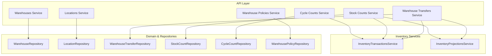
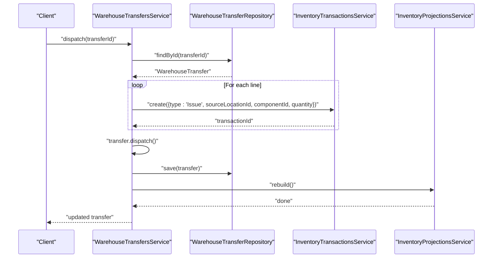
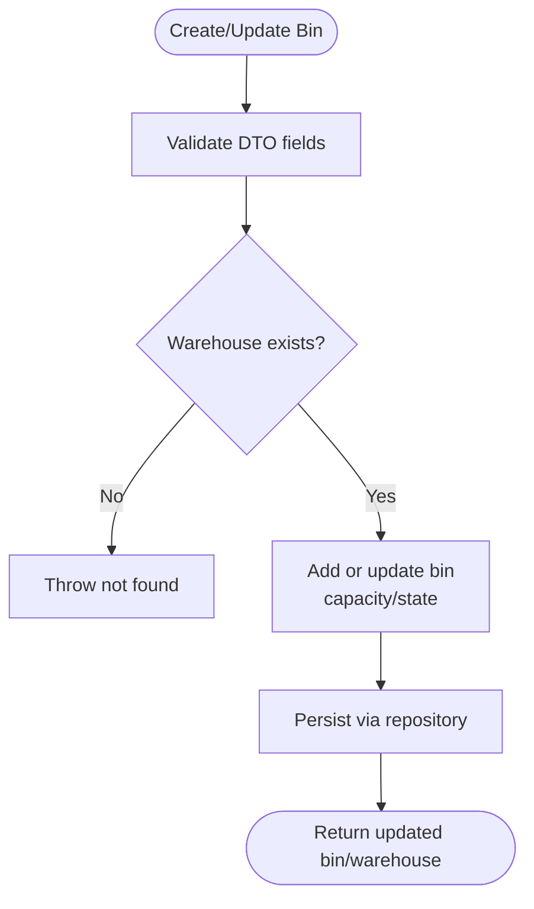
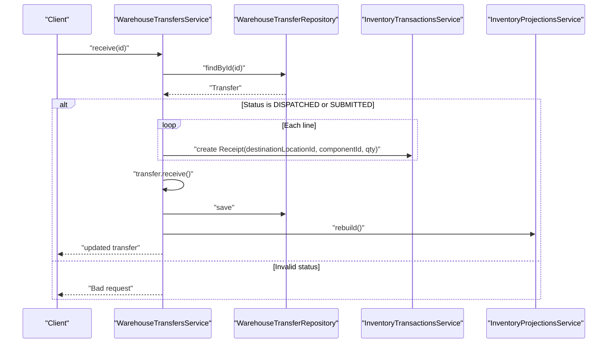
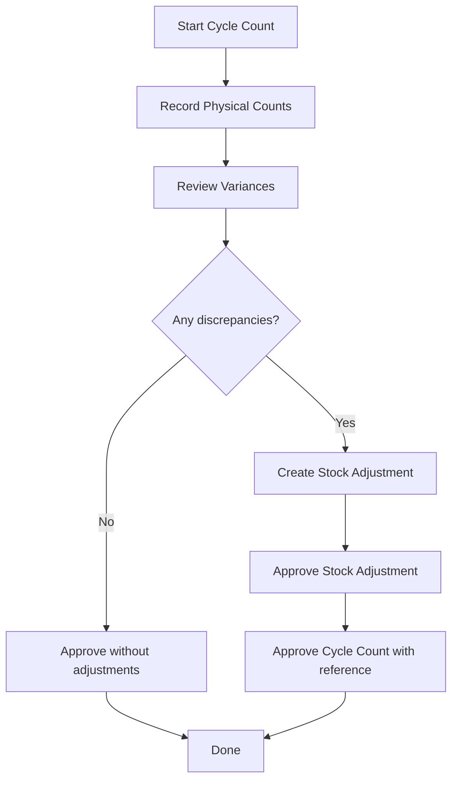
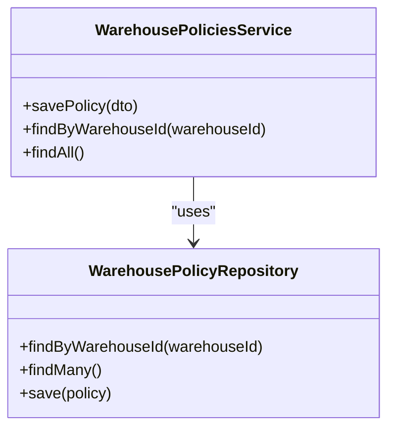
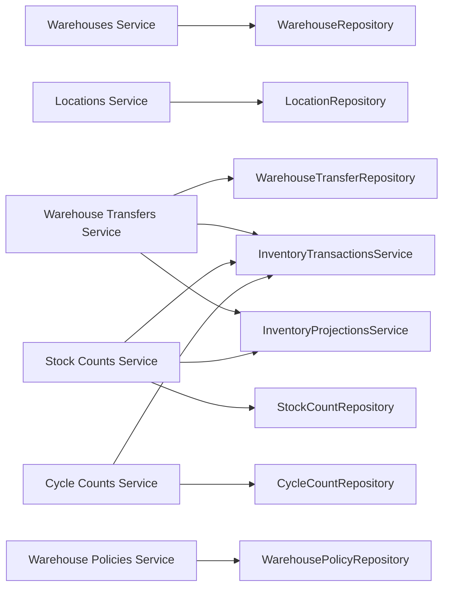

# Warehouse Management Schema

<cite>
**Referenced Files in This Document**
- [warehouses.service.ts](file://apps/api/src/warehouses/warehouses.service.ts)
- [dtos.ts](file://apps/api/src/warehouses/dtos.ts)
- [locations.service.ts](file://apps/api/src/locations/locations.service.ts)
- [warehouse-transfers.service.ts](file://apps/api/src/warehouse-transfers/warehouse-transfers.service.ts)
- [dtos.ts](file://apps/api/src/warehouse-transfers/dtos.ts)
- [cycle-counts.service.ts](file://apps/api/src/cycle-counts/cycle-counts.service.ts)
- [dtos.ts](file://apps/api/src/cycle-counts/dtos.ts)
- [stock-counts.service.ts](file://apps/api/src/stock-counts/stock-counts.service.ts)
- [dtos.ts](file://apps/api/src/stock-counts/dtos.ts)
- [warehouse-policies.service.ts](file://apps/api/src/warehouse-policies/warehouse-policies.service.ts)
- [dtos.ts](file://apps/api/src/warehouse-policies/dtos.ts)
</cite>

## Table of Contents
1. [Introduction](#introduction)
2. [Project Structure](#project-structure)
3. [Core Components](#core-components)
4. [Architecture Overview](#architecture-overview)
5. [Detailed Component Analysis](#detailed-component-analysis)
6. [Dependency Analysis](#dependency-analysis)
7. [Performance Considerations](#performance-considerations)
8. [Troubleshooting Guide](#troubleshooting-guide)
9. [Conclusion](#conclusion)

## Introduction
This document describes the warehouse management schema and operational workflows implemented in the API layer. It covers multi-level warehouse organization with bins, transfer operations between locations and warehouses, inventory counting (stock counts and cycle counts), policy enforcement for storage rules and picking strategies, barcode scanning integration points, mobile operations support, and optimization considerations including space utilization metrics. The goal is to provide a clear, code-mapped understanding of how the system models and processes warehouse data and operations.

## Project Structure
The warehouse domain is exposed through NestJS modules under apps/api/src with dedicated folders for:
- Warehouses: create, list, and manage bins within a warehouse
- Locations: hierarchical location management via domain services
- Warehouse Transfers: end-to-end transfer lifecycle with inventory impact
- Stock Counts: full physical count process with posting adjustments
- Cycle Counts: targeted counting with variance analysis and reconciliation
- Warehouse Policies: per-warehouse rules for negative inventory, capacity, directed putaway/picking, and default bins

**Diagram sources**
- [warehouses.service.ts:1-62](file://apps/api/src/warehouses/warehouses.service.ts#L1-L62)
- [locations.service.ts:1-53](file://apps/api/src/locations/locations.service.ts#L1-L53)
- [warehouse-transfers.service.ts:1-242](file://apps/api/src/warehouse-transfers/warehouse-transfers.service.ts#L1-L242)
- [stock-counts.service.ts:1-123](file://apps/api/src/stock-counts/stock-counts.service.ts#L1-L123)
- [cycle-counts.service.ts:1-210](file://apps/api/src/cycle-counts/cycle-counts.service.ts#L1-L210)
- [warehouse-policies.service.ts:1-39](file://apps/api/src/warehouse-policies/warehouse-policies.service.ts#L1-L39)

**Section sources**
- [warehouses.service.ts:1-62](file://apps/api/src/warehouses/warehouses.service.ts#L1-L62)
- [locations.service.ts:1-53](file://apps/api/src/locations/locations.service.ts#L1-L53)
- [warehouse-transfers.service.ts:1-242](file://apps/api/src/warehouse-transfers/warehouse-transfers.service.ts#L1-L242)
- [stock-counts.service.ts:1-123](file://apps/api/src/stock-counts/stock-counts.service.ts#L1-L123)
- [cycle-counts.service.ts:1-210](file://apps/api/src/cycle-counts/cycle-counts.service.ts#L1-L210)
- [warehouse-policies.service.ts:1-39](file://apps/api/src/warehouse-policies/warehouse-policies.service.ts#L1-L39)

## Core Components
- Warehouses and Bins: Create warehouses and add/update bins with optional capacity and purpose. Supports toggling bin active state and updating capacity.
- Locations: CRUD over hierarchical locations using domain commands (create/update/delete) and repository accessors.
- Warehouse Transfers: Full lifecycle from draft to submit, dispatch, receive, cancel, delete; posts inventory transactions on dispatch/receive and rebuilds projections.
- Stock Counts: Create, assign user, add lines, submit, approve, post adjustments, and cancel; posts adjustment transactions and rebuilds projections.
- Cycle Counts: Create, assign counter, start counting, record physical counts, review variances, approve with automatic stock adjustment creation/approval, cancel, delete.
- Warehouse Policies: Save or update per-warehouse policies controlling negative inventory allowance, bin capacity enforcement, directed putaway/picking, and default receiving/production/shipping bins.

**Section sources**
- [warehouses.service.ts:18-60](file://apps/api/src/warehouses/warehouses.service.ts#L18-L60)
- [dtos.ts:10-49](file://apps/api/src/warehouses/dtos.ts#L10-L49)
- [locations.service.ts:14-51](file://apps/api/src/locations/locations.service.ts#L14-L51)
- [warehouse-transfers.service.ts:31-240](file://apps/api/src/warehouse-transfers/warehouse-transfers.service.ts#L31-L240)
- [dtos.ts:12-83](file://apps/api/src/warehouse-transfers/dtos.ts#L12-L83)
- [stock-counts.service.ts:27-121](file://apps/api/src/stock-counts/stock-counts.service.ts#L27-L121)
- [dtos.ts:9-45](file://apps/api/src/stock-counts/dtos.ts#L9-L45)
- [cycle-counts.service.ts:39-208](file://apps/api/src/cycle-counts/cycle-counts.service.ts#L39-L208)
- [dtos.ts:12-118](file://apps/api/src/cycle-counts/dtos.ts#L12-L118)
- [warehouse-policies.service.ts:14-36](file://apps/api/src/warehouse-policies/warehouse-policies.service.ts#L14-L36)
- [dtos.ts:3-35](file://apps/api/src/warehouse-policies/dtos.ts#L3-L35)

## Architecture Overview
The API layer orchestrates domain entities and repositories while delegating side effects to inventory services. Transfer and counting flows consistently post immutable ledger transactions and then rebuild projections to keep read models consistent.

**Diagram sources**
- [warehouse-transfers.service.ts:135-169](file://apps/api/src/warehouse-transfers/warehouse-transfers.service.ts#L135-L169)

**Section sources**
- [warehouse-transfers.service.ts:31-240](file://apps/api/src/warehouse-transfers/warehouse-transfers.service.ts#L31-L240)

## Detailed Component Analysis

### Warehouse Structure and Bin Management
- Create warehouses and add bins with codes, optional capacity, and purpose (receiving, storage, production, shipping, quality hold).
- Update bin state (active/inactive) and capacity; persist changes back to the repository.
- Location hierarchy is managed separately via the Locations service using domain commands.

**Diagram sources**
- [warehouses.service.ts:18-60](file://apps/api/src/warehouses/warehouses.service.ts#L18-L60)
- [dtos.ts:10-49](file://apps/api/src/warehouses/dtos.ts#L10-L49)

**Section sources**
- [warehouses.service.ts:18-60](file://apps/api/src/warehouses/warehouses.service.ts#L18-L60)
- [dtos.ts:10-49](file://apps/api/src/warehouses/dtos.ts#L10-L49)
- [locations.service.ts:14-51](file://apps/api/src/locations/locations.service.ts#L14-L51)

### Transfer Operations Between Locations and Warehouses
- Draft creation enforces distinct source and destination locations.
- Submit transitions to submitted state; only draft can be edited.
- Dispatch posts outbound “Issue” transactions per line and updates status; requires at least one line.
- Receive posts inbound “Receipt” transactions per line and updates status; allows both dispatched and submitted states.
- Cancel prevents cancellation after receipt or when already cancelled; if dispatched, posts compensating receipts back to source.
- Delete allowed only for draft transfers.

**Diagram sources**
- [warehouse-transfers.service.ts:171-199](file://apps/api/src/warehouse-transfers/warehouse-transfers.service.ts#L171-L199)

**Section sources**
- [warehouse-transfers.service.ts:31-240](file://apps/api/src/warehouse-transfers/warehouse-transfers.service.ts#L31-L240)
- [dtos.ts:12-83](file://apps/api/src/warehouse-transfers/dtos.ts#L12-L83)

### Inventory Counting Processes
- Stock Counts:
  - Create, assign user, add lines, submit, approve, post adjustments, cancel.
  - Posting creates “Adjustment” transactions for non-zero variances and rebuilds projections.
- Cycle Counts:
  - Create, assign counter, start counting, record physical counts, review variances, approve.
  - Approval automatically creates and approves a Stock Adjustment for discrepancies, linking back to the count number.

**Diagram sources**
- [cycle-counts.service.ts:119-192](file://apps/api/src/cycle-counts/cycle-counts.service.ts#L119-L192)

**Section sources**
- [stock-counts.service.ts:27-121](file://apps/api/src/stock-counts/stock-counts.service.ts#L27-L121)
- [cycle-counts.service.ts:39-208](file://apps/api/src/cycle-counts/cycle-counts.service.ts#L39-L208)
- [dtos.ts:9-45](file://apps/api/src/stock-counts/dtos.ts#L9-L45)
- [dtos.ts:12-118](file://apps/api/src/cycle-counts/dtos.ts#L12-L118)

### Warehouse Policy Enforcement
- Per-warehouse policies control:
  - Allow negative inventory
  - Enforce bin capacity
  - Directed putaway and picking
  - Default receiving, production, and shipping bins
- Save or update policy by warehouse ID; retrieval throws not found if missing.

**Diagram sources**
- [warehouse-policies.service.ts:14-36](file://apps/api/src/warehouse-policies/warehouse-policies.service.ts#L14-L36)

**Section sources**
- [warehouse-policies.service.ts:14-36](file://apps/api/src/warehouse-policies/warehouse-policies.service.ts#L14-L36)
- [dtos.ts:3-35](file://apps/api/src/warehouse-policies/dtos.ts#L3-L35)

### Barcode Scanning Integration and Mobile Operations Support
- Barcode scanning typically targets components and locations; the API exposes barcodes endpoints and scanner utilities in the web app that call these APIs.
- Mobile operations are supported by the same REST endpoints used by desktop UIs; scanners and mobile clients interact with the same transfer, count, and policy endpoints.

[No sources needed since this section provides conceptual guidance]

### Optimization Algorithms and Space Utilization Metrics
- Capacity-aware putaway and picking can be guided by warehouse policies (directed putaway/picking, enforce bin capacity).
- Space utilization metrics can be derived from bin capacities versus actual quantities tracked via inventory transactions and projections.
- Projections rebuild after significant inventory changes ensures accurate availability and utilization views.

[No sources needed since this section provides general guidance]

## Dependency Analysis
Key dependencies among services and external integrations:

**Diagram sources**
- [warehouses.service.ts:1-62](file://apps/api/src/warehouses/warehouses.service.ts#L1-L62)
- [locations.service.ts:1-53](file://apps/api/src/locations/locations.service.ts#L1-L53)
- [warehouse-transfers.service.ts:1-242](file://apps/api/src/warehouse-transfers/warehouse-transfers.service.ts#L1-L242)
- [stock-counts.service.ts:1-123](file://apps/api/src/stock-counts/stock-counts.service.ts#L1-L123)
- [cycle-counts.service.ts:1-210](file://apps/api/src/cycle-counts/cycle-counts.service.ts#L1-L210)
- [warehouse-policies.service.ts:1-39](file://apps/api/src/warehouse-policies/warehouse-policies.service.ts#L1-L39)

**Section sources**
- [warehouse-transfers.service.ts:1-242](file://apps/api/src/warehouse-transfers/warehouse-transfers.service.ts#L1-L242)
- [stock-counts.service.ts:1-123](file://apps/api/src/stock-counts/stock-counts.service.ts#L1-L123)
- [cycle-counts.service.ts:1-210](file://apps/api/src/cycle-counts/cycle-counts.service.ts#L1-L210)

## Performance Considerations
- Batch operations: When processing many transfer lines or count lines, consider batching transaction creation to reduce round-trips.
- Projection rebuilds: Rebuilding projections after bulk changes can be expensive; schedule during off-peak or use incremental updates where possible.
- Validation early: DTO validation prevents unnecessary processing; ensure robust client-side checks to minimize server load.
- Indexing: Ensure repository queries on locationId, componentId, and status are indexed for efficient filtering.

[No sources needed since this section provides general guidance]

## Troubleshooting Guide
Common errors and resolutions:
- Identical source and destination locations in transfers: Ensure distinct IDs before creating/updating transfers.
- Editing non-draft transfers: Only draft transfers can be edited; move to draft or create a new transfer.
- Dispatch without lines: Add at least one line item before dispatching.
- Receive in invalid status: Only dispatched or submitted transfers can be received.
- Cancel restrictions: Cannot cancel received or already cancelled transfers; if dispatched, compensating receipts are posted automatically.
- Posting stock count without approval: Stock counts must be approved before posting adjustments.
- Not found errors: Verify IDs for warehouses, locations, transfers, and cycle counts exist.

**Section sources**
- [warehouse-transfers.service.ts:31-240](file://apps/api/src/warehouse-transfers/warehouse-transfers.service.ts#L31-L240)
- [stock-counts.service.ts:68-113](file://apps/api/src/stock-counts/stock-counts.service.ts#L68-L113)
- [cycle-counts.service.ts:57-208](file://apps/api/src/cycle-counts/cycle-counts.service.ts#L57-L208)

## Conclusion
The warehouse management schema provides a robust foundation for multi-level warehouse organization, precise transfer workflows, and comprehensive inventory counting. Policy-driven controls enable configurable storage rules and picking strategies. Barcode scanning and mobile operations integrate seamlessly through shared APIs. With disciplined transaction posting and projection rebuilding, the system maintains accurate inventory visibility and supports optimization efforts around space utilization and operational efficiency.