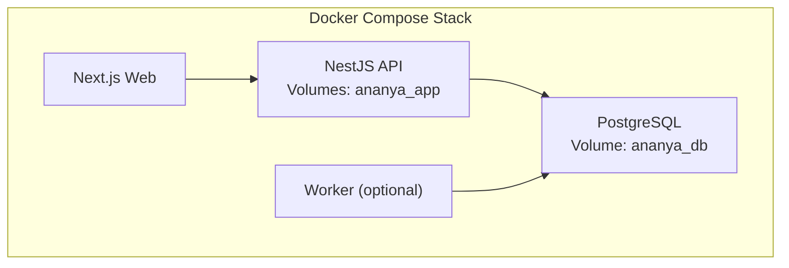
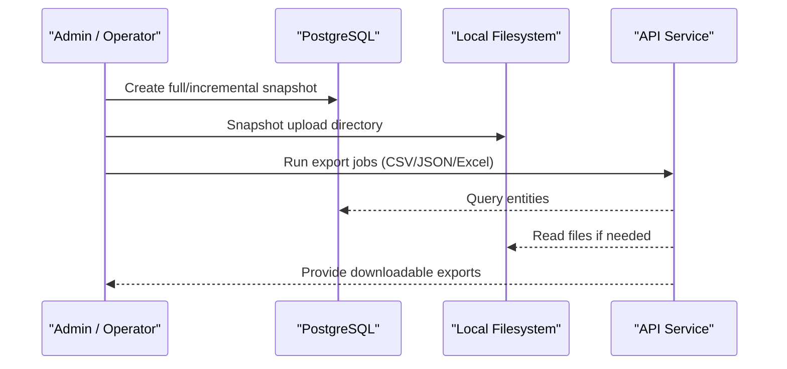
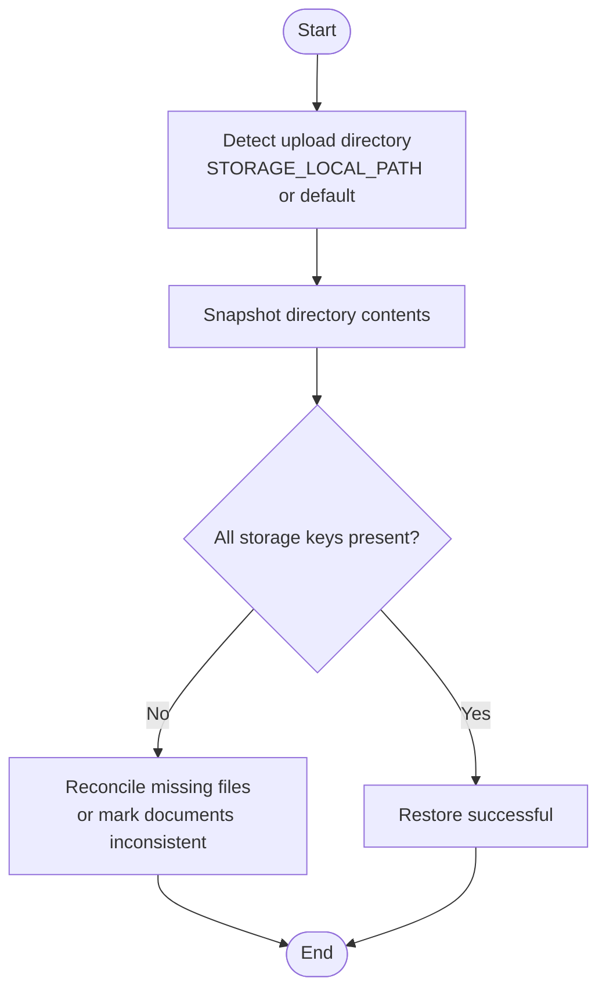
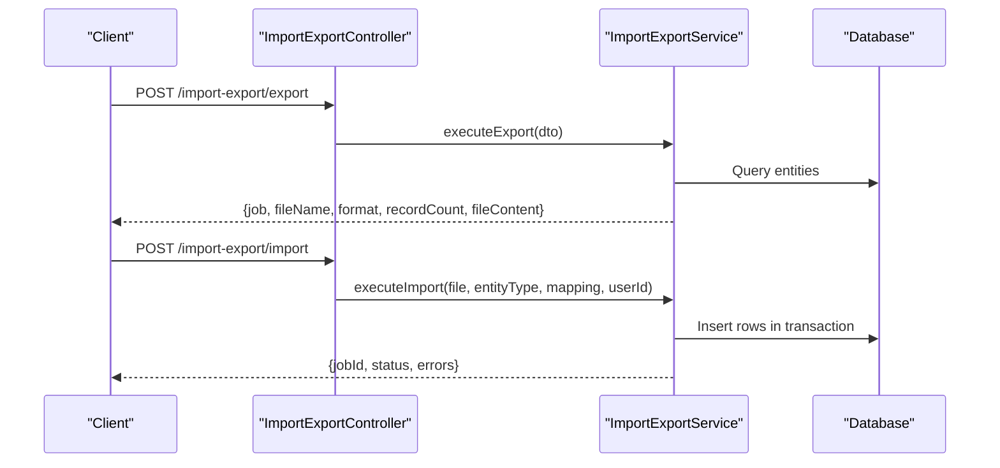
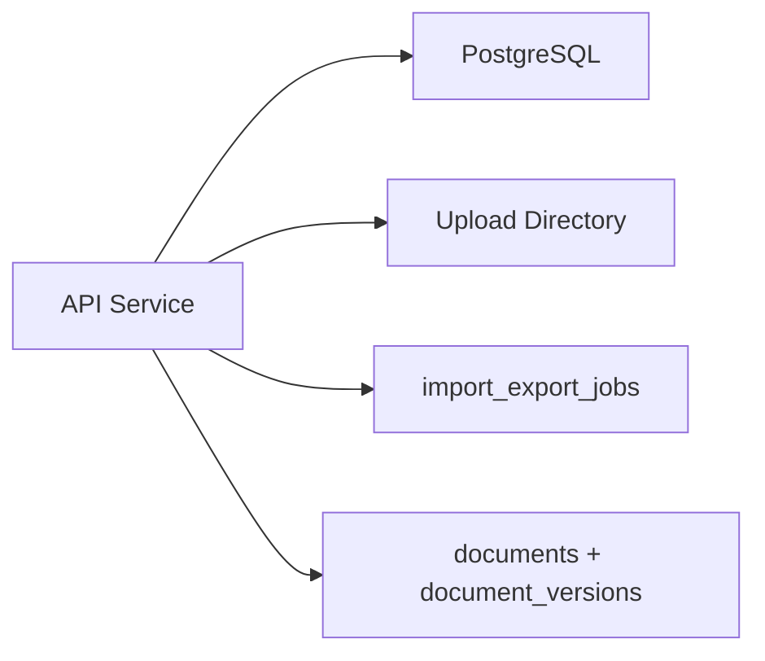

# Backup & Recovery

<cite>
**Referenced Files in This Document**
- [compose.yml](file://compose.yml)
- [compose.prod.yml](file://compose.prod.yml)
- [database.module.ts](file://apps/api/src/database/database.module.ts)
- [index.ts](file://packages/database/src/index.ts)
- [migrate.ts](file://packages/database/src/setup/migrate.ts)
- [drizzle.config.ts](file://packages/database/drizzle.config.ts)
- [documents.service.ts](file://apps/api/src/documents/documents.service.ts)
- [storage.service.ts](file://apps/api/src/documents/storage.service.ts)
- [documents.ts](file://packages/database/src/schema/documents.ts)
- [import-export.controller.ts](file://apps/api/src/import-export/import-export.controller.ts)
- [import-export.service.ts](file://apps/api/src/import-export/import-export.service.ts)
- [import-export.ts](file://packages/database/src/schema/import-export.ts)
- [DATA_LIFECYCLE.md](file://docs/DATA_LIFECYCLE.md)
</cite>

## Table of Contents
1. Introduction
2. Project Structure
3. Core Components
4. Architecture Overview
5. Detailed Component Analysis
6. Dependency Analysis
7. Performance Considerations
8. Troubleshooting Guide
9. Conclusion
10. Appendices

## Introduction
This document provides backup and disaster recovery guidance for Ananya ERP, focusing on:
- Database backups (full, incremental, point-in-time recovery)
- File storage backups for documents and attachments
- Data export/import capabilities and migration strategies
- Version compatibility considerations
- Disaster recovery procedures, failover mechanisms, and business continuity planning
- Backup scheduling, retention policies, and automated verification
- Recovery procedures for common failure scenarios, data corruption handling, and testing recovery processes

The guidance is grounded in the repository’s database configuration, file storage implementation, import/export features, and deployment compose files.

## Project Structure
Ananya ERP runs as a Docker Compose stack with:
- A PostgreSQL database service that stores all relational data
- An API service that persists document metadata to the database and stores binary content via a local filesystem provider
- Optional worker and ML services
- Persistent volumes for both database and application uploads

**Diagram sources**
- [compose.yml:18-103](file://compose.yml#L18-L103)
- [compose.yml:196-205](file://compose.yml#L196-L205)

**Section sources**
- [compose.yml:18-103](file://compose.yml#L18-L103)
- [compose.yml:196-205](file://compose.yml#L196-L205)

## Core Components
- Database layer: Lazy-initialized Drizzle client and connection pool configured via DATABASE_URL; migrations applied through a dedicated migrate command.
- Document storage: Documents are stored using a pluggable storage provider; currently supports a local filesystem driver with configurable path and safe path resolution.
- Import/Export: Robust CSV/JSON/Excel import pipeline with job tracking, templates, column mapping, transactional execution, and reverse operations; export returns structured records and downloadable files.

Key responsibilities for backup and recovery:
- Ensure consistent snapshots of the PostgreSQL volume
- Back up the application upload directory referenced by document records
- Use export/import for logical backups, migrations, and cross-environment transfers
- Validate recoverability through periodic restore drills

**Section sources**
- [index.ts:1-60](file://packages/database/src/index.ts#L1-L60)
- [migrate.ts:1-21](file://packages/database/src/setup/migrate.ts#L1-L21)
- [storage.service.ts:105-198](file://apps/api/src/documents/storage.service.ts#L105-L198)
- [import-export.controller.ts:120-146](file://apps/api/src/import-export/import-export.controller.ts#L120-L146)
- [import-export.service.ts:127-200](file://apps/api/src/import-export/import-export.service.ts#L127-L200)

## Architecture Overview
Backup and recovery span two primary data planes:
- Relational data plane: PostgreSQL managed via Docker Compose with persistent volumes
- Object data plane: Local filesystem-backed document storage keyed by storage keys recorded in the database

**Diagram sources**
- [compose.yml:18-103](file://compose.yml#L18-L103)
- [storage.service.ts:120-180](file://apps/api/src/documents/storage.service.ts#L120-L180)
- [import-export.service.ts:2329-2644](file://apps/api/src/import-export/import-export.service.ts#L2329-L2644)

## Detailed Component Analysis

### Database Backup Strategy
- Full backups: Take a consistent snapshot of the PostgreSQL data volume or use pg_basebackup/pg_dump at scheduled intervals. Because the stack uses a Docker-managed volume, coordinate snapshots when the database is quiescent or use PostgreSQL-native PITR tooling.
- Incremental backups: Enable WAL archiving on PostgreSQL and configure continuous WAL shipping to support point-in-time recovery. Schedule frequent WAL backups to minimize RPO.
- Point-in-time recovery (PITR): Restore from a known-good base backup and replay WAL segments up to the desired timestamp. Validate schema versions before starting the API.

Operational notes:
- The database connection is lazy-initialized from DATABASE_URL and exposed via a shared pool.
- Migrations are run via a dedicated command that applies Drizzle migrations from a fixed folder.

Recovery steps:
1. Stop API and worker services to prevent writes.
2. Restore the PostgreSQL volume or cluster to the target state.
3. Apply migrations if required.
4. Start services and verify health endpoints.

**Section sources**
- [index.ts:1-60](file://packages/database/src/index.ts#L1-L60)
- [migrate.ts:1-21](file://packages/database/src/setup/migrate.ts#L1-L21)
- [drizzle.config.ts:1-23](file://packages/database/drizzle.config.ts#L1-L23)

### File Storage Backup Strategy
Documents are stored using a local filesystem provider. Each uploaded file has:
- A storage key persisted alongside document metadata
- One or more revisions tracked in document versions

Backup scope:
- Back up the configured upload directory used by the local storage provider. By default, this is under the container’s working directory unless STORAGE_LOCAL_PATH is set. In the provided compose configuration, the API mounts a named volume to /app/uploads.

Recovery steps:
1. Identify the current upload directory from environment or logs.
2. Restore the backed-up files into the same directory structure.
3. Verify that storage keys referenced by documents exist.
4. Test document download endpoints to confirm integrity.

**Diagram sources**
- [storage.service.ts:60-103](file://apps/api/src/documents/storage.service.ts#L60-L103)
- [storage.service.ts:120-180](file://apps/api/src/documents/storage.service.ts#L120-L180)
- [documents.ts:14-40](file://packages/database/src/schema/documents.ts#L14-L40)

**Section sources**
- [storage.service.ts:60-103](file://apps/api/src/documents/storage.service.ts#L60-L103)
- [storage.service.ts:120-180](file://apps/api/src/documents/storage.service.ts#L120-L180)
- [documents.ts:14-40](file://packages/database/src/schema/documents.ts#L14-L40)
- [compose.yml:41-57](file://compose.yml#L41-L57)

### Data Export and Import Capabilities
Export:
- Supports multiple formats and entity types
- Returns job metadata and downloadable content
- Records job outcomes in the import_export_jobs table

Import:
- Accepts CSV, JSON, and Excel-like formats
- Provides template generation and column mapping
- Executes transactions and tracks created entities to enable reversal
- Tracks progress, errors, and status per job

Migration strategy:
- Use exports to create logical backups and portable datasets
- Use imports to provision new environments or refresh test/staging instances
- Maintain version compatibility by aligning schema migrations with data contracts

**Diagram sources**
- [import-export.controller.ts:120-146](file://apps/api/src/import-export/import-export.controller.ts#L120-L146)
- [import-export.service.ts:2329-2644](file://apps/api/src/import-export/import-export.service.ts#L2329-L2644)
- [import-export.ts:13-47](file://packages/database/src/schema/import-export.ts#L13-L47)

**Section sources**
- [import-export.controller.ts:120-146](file://apps/api/src/import-export/import-export.controller.ts#L120-L146)
- [import-export.service.ts:127-200](file://apps/api/src/import-export/import-export.service.ts#L127-L200)
- [import-export.service.ts:2329-2644](file://apps/api/src/import-export/import-export.service.ts#L2329-L2644)
- [import-export.ts:13-47](file://packages/database/src/schema/import-export.ts#L13-L47)

### Version Compatibility and Schema Management
- Schema definitions are centralized and migrated using Drizzle migrations.
- Migrations are applied via a dedicated command that reads from a fixed migrations folder.
- When restoring databases across versions:
  - Ensure the database schema matches the running API version
  - Apply migrations before starting the API
  - Validate that exported data conforms to the target schema

**Section sources**
- [drizzle.config.ts:1-23](file://packages/database/drizzle.config.ts#L1-L23)
- [migrate.ts:1-21](file://packages/database/src/setup/migrate.ts#L1-L21)

### Disaster Recovery Procedures
Recommended DR plan:
- Define RTO/RPO targets aligned with business needs
- Schedule regular full backups and frequent incremental/WAL backups
- Store backups offsite and encrypt them
- Automate backup verification by performing dry-run restores to isolated environments
- Document and rehearse recovery playbooks for:
  - Database corruption or accidental deletion
  - Upload directory loss or corruption
  - Partial import failures requiring rollback
  - Cross-version upgrades with schema changes

Failover and high availability:
- For PostgreSQL, consider streaming replication or managed database services with built-in HA and PITR
- For the API and uploads, ensure the upload directory is mounted to durable storage and can be restored quickly
- Health checks are defined for services; integrate with orchestration tools to restart failed components

Business continuity:
- Keep recent logical exports available for rapid restoration
- Maintain documented import templates and mappings
- Train operators on restore procedures and validation steps

**Section sources**
- [compose.yml:31-40](file://compose.yml#L31-L40)
- [compose.yml:61-72](file://compose.yml#L61-L72)
- [compose.yml:107-118](file://compose.yml#L107-L118)

### Backup Scheduling, Retention, and Automated Verification
Scheduling:
- Use external schedulers (OS cron, CI pipelines, or managed database backup services) to run:
  - Full database snapshots
  - WAL archival and incremental backups
  - Upload directory snapshots
  - Export jobs for critical entities

Retention:
- Define tiered retention (e.g., daily for 7 days, weekly for 4 weeks, monthly for 12 months)
- Archive older backups to cold storage
- Rotate and purge expired backups automatically

Automated verification:
- Periodically restore backups to a sandbox environment
- Validate database connectivity and schema version
- Spot-check document downloads against known storage keys
- Re-import sample exports to validate round-trip fidelity

**Section sources**
- [import-export.service.ts:2329-2644](file://apps/api/src/import-export/import-export.service.ts#L2329-L2644)
- [documents.ts:14-40](file://packages/database/src/schema/documents.ts#L14-L40)

### Recovery Procedures for Failure Scenarios
- Database corruption or accidental deletion:
  - Restore from latest full backup
  - Replay WALs to the desired point in time
  - Apply migrations if necessary
  - Restart services and verify health

- Upload directory loss:
  - Restore files from backup
  - Confirm storage keys match document records
  - Test document retrieval endpoints

- Import failure mid-way:
  - Use the reverse import capability to revert created entities and side effects
  - Inspect job errors and re-run corrected imports

- Data corruption detection:
  - Compare checksums of backups and restored data
  - Validate referential integrity via queries
  - Re-import clean exports if inconsistencies are found

Testing recovery:
- Conduct scheduled restore drills
- Measure actual RTO/RPO against targets
- Update procedures based on drill results

**Section sources**
- [import-export.controller.ts:140-146](file://apps/api/src/import-export/import-export.controller.ts#L140-L146)
- [import-export.service.ts:2312-2327](file://apps/api/src/import-export/import-export.service.ts#L2312-L2327)

## Dependency Analysis
The backup surface area spans:
- Database persistence via a lazy-initialized Drizzle client and pool
- Document metadata and versions stored in relational tables
- Binary content stored on a local filesystem with safe path resolution
- Import/export jobs tracked in a dedicated table

**Diagram sources**
- [index.ts:1-60](file://packages/database/src/index.ts#L1-L60)
- [documents.ts:14-107](file://packages/database/src/schema/documents.ts#L14-L107)
- [import-export.ts:13-47](file://packages/database/src/schema/import-export.ts#L13-L47)
- [storage.service.ts:120-180](file://apps/api/src/documents/storage.service.ts#L120-L180)

**Section sources**
- [index.ts:1-60](file://packages/database/src/index.ts#L1-L60)
- [documents.ts:14-107](file://packages/database/src/schema/documents.ts#L14-L107)
- [import-export.ts:13-47](file://packages/database/src/schema/import-export.ts#L13-L47)
- [storage.service.ts:120-180](file://apps/api/src/documents/storage.service.ts#L120-L180)

## Performance Considerations
- Prefer online backups and PITR to minimize downtime during recovery
- Offload heavy export jobs to background workers to avoid impacting user-facing requests
- Limit concurrent imports to reduce lock contention and statement timeouts
- Monitor database locks and query durations; tune timeouts where appropriate
- Ensure upload directory I/O is fast enough for large document workflows

[No sources needed since this section provides general guidance]

## Troubleshooting Guide
Common issues and mitigations:
- Missing upload files:
  - Check storage keys in document records and verify file existence in the upload directory
  - Restore missing files from backups

- Import job failures:
  - Review job error details and row-level messages
  - Use reverse import to undo partial changes
  - Correct column mappings and re-run

- Database connectivity or migration issues:
  - Validate DATABASE_URL and network access
  - Ensure migrations are applied before starting the API
  - Check health endpoints for service readiness

- Timeouts and conflicts:
  - Investigate long-running transactions and lock contention
  - Adjust timeout settings if necessary and retry transient failures

**Section sources**
- [storage.service.ts:141-158](file://apps/api/src/documents/storage.service.ts#L141-L158)
- [import-export.controller.ts:130-146](file://apps/api/src/import-export/import-export.controller.ts#L130-L146)
- [migrate.ts:1-21](file://packages/database/src/setup/migrate.ts#L1-L21)

## Conclusion
Ananya ERP’s backup and recovery model centers on:
- Reliable PostgreSQL snapshots and WAL-based PITR
- Backups of the local upload directory tied to document metadata
- Logical backups via robust export/import with job tracking and reversibility
- Clear migration and version management practices

Adopting disciplined scheduling, retention, and verification ensures predictable RTO/RPO and resilient operations. Regular recovery drills and documented playbooks are essential to maintain operational readiness.

[No sources needed since this section summarizes without analyzing specific files]

## Appendices

### Appendix A: Key Environment Variables and Paths
- DATABASE_URL: Required for database connections and migrations
- STORAGE_DRIVER: Storage backend selection (currently local)
- STORAGE_LOCAL_PATH: Configurable upload directory; defaults to working directory uploads if not set
- Compose volumes:
  - ananya_db: PostgreSQL data volume
  - ananya_app: API upload directory mount

**Section sources**
- [index.ts:1-60](file://packages/database/src/index.ts#L1-L60)
- [storage.service.ts:60-109](file://apps/api/src/documents/storage.service.ts#L60-L109)
- [compose.yml:196-205](file://compose.yml#L196-L205)

### Appendix B: Data Lifecycle and Import Framework Notes
- Unified import framework supports CSV/Excel/JSON with templates, mapping, and transactional execution
- Round-trip export-import guarantees facilitate migrations and environment refreshes
- Organization reset and data packs provide controlled initialization paths

**Section sources**
- [DATA_LIFECYCLE.md:51-83](file://docs/DATA_LIFECYCLE.md#L51-L83)
- [DATA_LIFECYCLE.md:116-135](file://docs/DATA_LIFECYCLE.md#L116-L135)
- [DATA_LIFECYCLE.md:171-192](file://docs/DATA_LIFECYCLE.md#L171-L192)