# Containerization & Docker

<cite>
**Referenced Files in This Document**   
- [docker/README.md](file://docker/README.md)
- [compose.yml](file://compose.yml)
- [compose.local.yml](file://compose.local.yml)
- [compose.prod.yml](file://compose.prod.yml)
- [docker/Dockerfile.api](file://docker/Dockerfile.api)
- [docker/Dockerfile.web](file://docker/Dockerfile.web)
- [docker/Dockerfile.ml](file://docker/Dockerfile.ml)
- [docker/Dockerfile.worker](file://docker/Dockerfile.worker)
</cite>

## Table of Contents
1. [Introduction](#introduction)
2. [Project Structure](#project-structure)
3. [Core Components](#core-components)
4. [Architecture Overview](#architecture-overview)
5. [Detailed Component Analysis](#detailed-component-analysis)
6. [Dependency Analysis](#dependency-analysis)
7. [Performance Considerations](#performance-considerations)
8. [Troubleshooting Guide](#troubleshooting-guide)
9. [Conclusion](#conclusion)

## Introduction
This document explains how Ananya ERP is containerized and orchestrated with Docker and Docker Compose. It covers the multi-stage build process for the API, web, ML, and worker services; the Compose stack architecture including service dependencies, networking, and volumes; environment configuration and secrets guidance; production versus local workflows; optimization strategies; customization examples; and troubleshooting techniques.

Ananya’s container strategy separates infrastructure from application images:
- The base Compose file defines shared services, networks, and volumes.
- A local override builds application images directly from repository Dockerfiles.
- A production override references published GitHub Container Registry images.
- Profiles control which optional services start, such as the ML microservice or database administration tools.

The recommended deployment order is PostgreSQL first, then migrations, then API, worker, ML, and web. Migrations are explicit and not run automatically by the API container.

**Section sources**
- [docker/README.md:5-36](file://docker/README.md#L5-L36)

## Project Structure
The containerization assets live under `docker/` and the root Compose files:

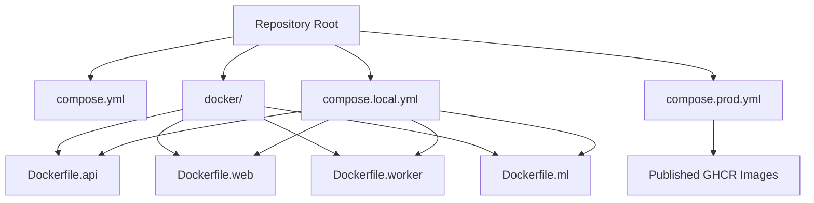

**Diagram sources**
- [compose.yml:1-14](file://compose.yml#L1-L14)
- [compose.local.yml:1-10](file://compose.local.yml#L1-L10)
- [compose.prod.yml:1-20](file://compose.prod.yml#L1-L20)
- [docker/Dockerfile.api:1-4](file://docker/Dockerfile.api#L1-L4)
- [docker/Dockerfile.web:1-4](file://docker/Dockerfile.web#L1-L4)
- [docker/Dockerfile.worker:1-5](file://docker/Dockerfile.worker#L1-L5)
- [docker/Dockerfile.ml:1-4](file://docker/Dockerfile.ml#L1-L4)

**Section sources**
- [compose.yml:1-14](file://compose.yml#L1-L14)
- [compose.local.yml:1-10](file://compose.local.yml#L1-L10)
- [compose.prod.yml:1-20](file://compose.prod.yml#L1-L20)
- [docker/README.md:5-15](file://docker/README.md#L5-L15)

## Core Components
Ananya runs five primary services in the canonical stack:

| Service | Role | Default Port | Notes |
|---|---|---:|---|
| PostgreSQL | Relational data store | `5432` | Internal-only in production; health-checked via `pg_isready`. |
| API | NestJS REST API and migration runner | `4000` | Connects to PostgreSQL and optionally ML. |
| Worker | Background job processor | `4001` | Health endpoint used for readiness checks. |
| Web | Next.js standalone frontend | `3000` | Generates runtime config pointing at a public API URL. |
| ML | Python FastAPI microservice | `5001` | Optional CPU-first component intelligence service. |

Key operational characteristics:
- All application containers run as non-root users with fixed UID/GID `10001`, except the ML image which uses a dedicated non-root user.
- Networking is isolated through an internal bridge network named `ananya_internal`.
- Volumes persist PostgreSQL data and application uploads.
- Health checks are defined for all application services.

**Section sources**
- [compose.yml:18-205](file://compose.yml#L18-L205)
- [docker/README.md:17-26](file://docker/README.md#L17-L26)
- [docker/README.md:167-176](file://docker/README.md#L167-L176)

## Architecture Overview
The following diagram maps the runtime relationships between services, ports, and storage:

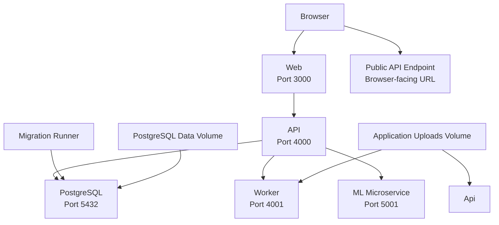

### Networking Rules
- Containers communicate using Docker DNS names inside the Compose network.
- The browser communicates with public URLs configured through reverse proxy routing.
- `API_PUBLIC_URL` must be reachable by the browser and must not use Docker service names.

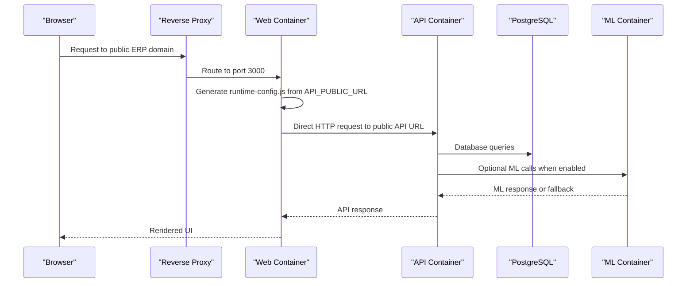

**Diagram sources**
- [compose.yml:41-72](file://compose.yml#L41-L72)
- [compose.yml:120-148](file://compose.yml#L120-L148)
- [compose.yml:150-173](file://compose.yml#L150-L173)
- [docker/README.md:125-158](file://docker/README.md#L125-L158)

**Section sources**
- [compose.yml:18-205](file://compose.yml#L18-L205)
- [docker/README.md:125-158](file://docker/README.md#L125-L158)

## Detailed Component Analysis

### Multi-Stage Build Process

#### API Image
The API image follows a four-stage pipeline:
1. **Pruner**: Prunes the monorepo workspace for the API scope.
2. **Builder**: Installs dependencies, builds workspace packages, and compiles the API.
3. **Production Dependencies**: Installs only runtime dependencies.
4. **Runner**: Runs the compiled API as a non-root user with minimal Alpine-based Node runtime.

Optimization highlights:
- Turbo prune reduces context size.
- BuildKit cache mounts speed up dependency installation.
- Source files and test suites are removed before the final image.
- Deterministic build verification ensures required artifacts exist.

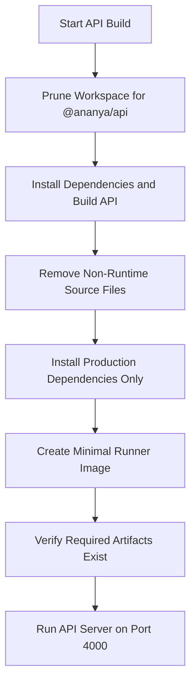

**Diagram sources**
- [docker/Dockerfile.api:6-92](file://docker/Dockerfile.api#L6-L92)

**Section sources**
- [docker/Dockerfile.api:1-93](file://docker/Dockerfile.api#L1-L93)

#### Web Image
The web image also uses a four-stage pipeline:
1. **Pruner**: Prunes the monorepo workspace for the web scope.
2. **Builder**: Builds the Next.js standalone output and embeds the public API URL.
3. **Production Dependencies**: Prepares production dependencies.
4. **Runner**: Serves the standalone Next.js app as a non-root user.

Runtime configuration behavior:
- The web image is environment-agnostic and does not bake environment-specific API URLs into the image.
- At container startup, a runtime entrypoint validates `API_PUBLIC_URL` and generates `/app/apps/web/public/runtime-config.js`.
- The browser loads this runtime configuration and calls the public API directly.

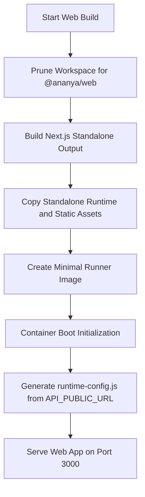

**Diagram sources**
- [docker/Dockerfile.web:6-88](file://docker/Dockerfile.web#L6-L88)
- [docker/README.md:143-151](file://docker/README.md#L143-L151)

**Section sources**
- [docker/Dockerfile.web:1-89](file://docker/Dockerfile.web#L1-L89)
- [docker/README.md:143-151](file://docker/README.md#L143-L151)

#### Worker Image
The worker image reuses the API workspace because the worker entrypoint lives under the API package:
1. **Pruner**: Prunes the API workspace.
2. **Builder**: Builds the API and extracts the worker artifact.
3. **Production Dependencies**: Installs production dependencies.
4. **Runner**: Starts the background worker on port `4001`.

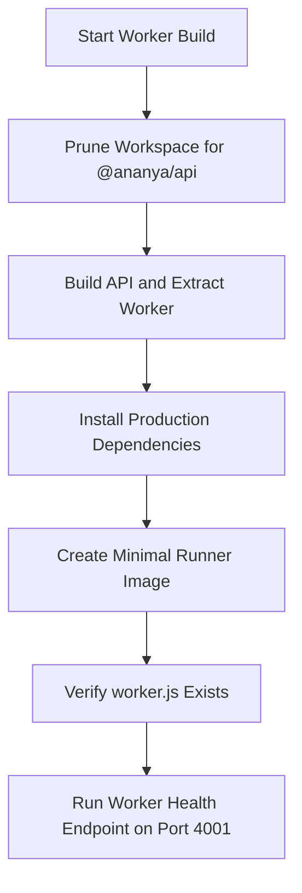

**Diagram sources**
- [docker/Dockerfile.worker:6-91](file://docker/Dockerfile.worker#L6-L91)

**Section sources**
- [docker/Dockerfile.worker:1-92](file://docker/Dockerfile.worker#L1-L92)

#### ML Image
The ML image is optimized for CPU workloads and uses a two-stage pipeline:
1. **Builder**: Creates a virtual environment and installs Python dependencies.
2. **Runner**: Copies the virtual environment, application source, model metadata, pipeline scripts, benchmarks, and working data directories.

Important notes:
- The ML container includes pipeline and data directories so the ML operations dashboard can report status and execute training workflows within the container.
- The service exposes a health endpoint on port `5001`.

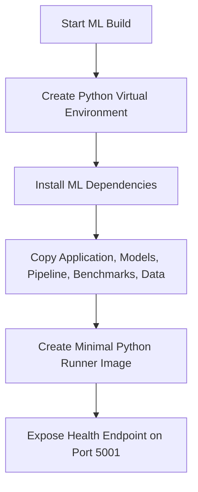

**Diagram sources**
- [docker/Dockerfile.ml:6-59](file://docker/Dockerfile.ml#L6-L59)

**Section sources**
- [docker/Dockerfile.ml:1-60](file://docker/Dockerfile.ml#L1-L60)

### Docker Compose Stack Architecture

#### Services and Profiles
The base stack defines core services and optional profiles:

| Profile | Services Included | Typical Use |
|---|---|---|
| `all` | `db`, `api`, `web`, `worker`, `ml` | Full production-equivalent deployment. |
| `worker` | `db`, `api`, `web`, `worker` | Standard deployment without ML. |
| `ml` | `db`, `api`, `web`, `ml` | Deployment with ML but without background worker. |
| No profile | `db`, `api`, `web` | Minimal core deployment. |
| `tools` or `admin` | Adds `pgadmin` | Database administration access. |

Profiles allow you to tailor the runtime footprint without changing the base Compose definition.

#### Service Dependencies
- The API depends on a healthy PostgreSQL instance.
- The web depends on a healthy API.
- In production mode, the API optionally waits for the ML service to become healthy; if ML is disabled, the API remains operational.
- The migration runner depends on a healthy PostgreSQL instance.

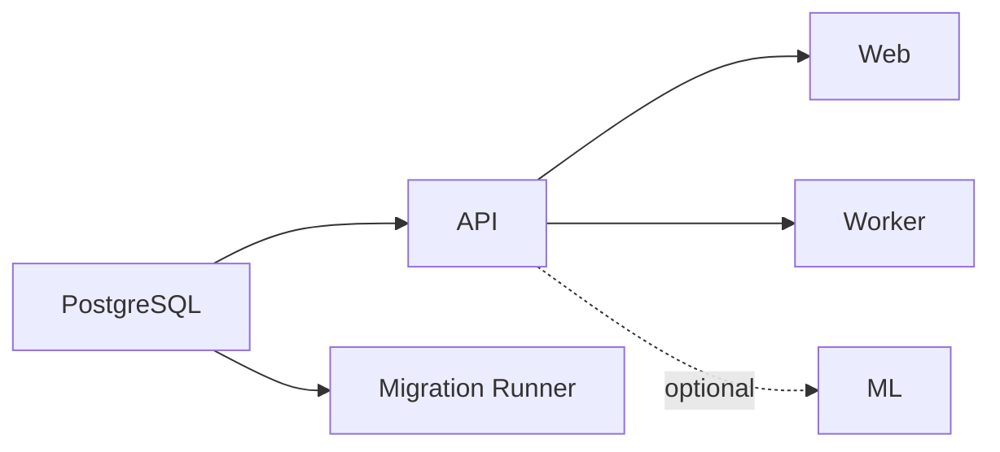

**Diagram sources**
- [compose.yml:41-72](file://compose.yml#L41-L72)
- [compose.yml:74-87](file://compose.yml#L74-L87)
- [compose.yml:89-118](file://compose.yml#L89-L118)
- [compose.yml:120-148](file://compose.yml#L120-L148)
- [compose.yml:150-173](file://compose.yml#L150-L173)
- [compose.prod.yml:22-45](file://compose.prod.yml#L22-L45)

**Section sources**
- [compose.yml:18-205](file://compose.yml#L18-L205)
- [compose.prod.yml:22-45](file://compose.prod.yml#L22-L45)
- [docker/README.md:79-89](file://docker/README.md#L79-L89)

#### Networking
- All application services attach to the `internal` network.
- Public ports are exposed for `web`, `api`, `ml`, and `pgadmin` where applicable.
- PostgreSQL is not mapped to the host in the base production stack; local development may publish it through the local override.

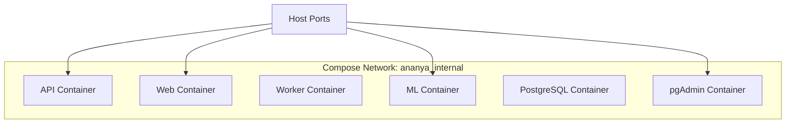

**Diagram sources**
- [compose.yml:18-205](file://compose.yml#L18-L205)

**Section sources**
- [compose.yml:18-205](file://compose.yml#L18-L205)
- [docker/README.md:125-165](file://docker/README.md#L125-L165)

#### Volume Management
- `ananya_db` persists PostgreSQL data.
- `ananya_app` persists application uploads shared by API and worker.
- `ananya_dbadmin` persists pgAdmin state.

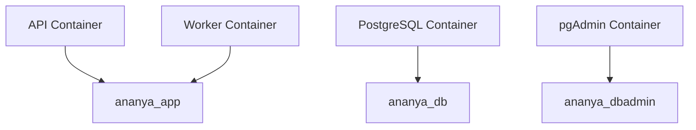

**Diagram sources**
- [compose.yml:196-199](file://compose.yml#L196-L199)
- [compose.yml:27-28](file://compose.yml#L27-L28)
- [compose.yml:54-55](file://compose.yml#L54-L55)
- [compose.yml:100-101](file://compose.yml#L100-L101)
- [compose.yml:188-189](file://compose.yml#L188-L189)

**Section sources**
- [compose.yml:196-199](file://compose.yml#L196-L199)

### Environment Variables and Secrets Management

#### Required and Recommended Variables
| Variable | Purpose | Scope |
|---|---|---|
| `POSTGRES_DB` | PostgreSQL database name | Infrastructure |
| `POSTGRES_USER` | PostgreSQL username | Infrastructure |
| `POSTGRES_PASSWORD` | PostgreSQL password | Infrastructure |
| `JWT_SECRET` | API authentication secret | API |
| `CORS_ORIGIN` | Allowed CORS origin for API | API |
| `API_PUBLIC_URL` | Public API URL for browser-to-API communication | Web and API |
| `ANANYA_VERSION` | Published image tag pinning | Production images |
| `COMPOSE_PROFILES` | Controls which services start | Compose orchestration |
| `WORKER_CONCURRENCY` | Background worker concurrency | Worker |
| `PGADMIN_DEFAULT_EMAIL` | pgAdmin admin email | Tools |
| `PGADMIN_DEFAULT_PASSWORD` | pgAdmin admin password | Tools |

#### Secrets Guidance
- Do not hardcode secrets in Compose files or Dockerfiles.
- Use `.env` for local and CI-safe configuration.
- For production, prefer external secret management systems that inject values into containers at runtime.
- Rotate `JWT_SECRET` and database credentials regularly.
- Avoid placing secrets in image layers; pass them through environment variables or mounted secrets.

**Section sources**
- [compose.yml:23-53](file://compose.yml#L23-L53)
- [compose.yml:95-99](file://compose.yml#L95-L99)
- [compose.yml:125-131](file://compose.yml#L125-L131)
- [compose.yml:183-185](file://compose.yml#L183-L185)
- [compose.prod.yml:12-13](file://compose.prod.yml#L12-L13)
- [docker/README.md:57-68](file://docker/README.md#L57-L68)

### Development vs Production Docker Configuration

#### Local Development Workflow
- Use `compose.yml` together with `compose.local.yml`.
- Application images are built from repository Dockerfiles.
- PostgreSQL may be published to the host for direct client access.
- Migrations are run explicitly before starting application services.

Recommended sequence:
1. Start the database.
2. Run migrations.
3. Start all application services.
4. Verify service health.

#### Production Deployment Workflow
- Use `compose.yml` together with `compose.prod.yml`.
- Published images are pulled from the container registry.
- Pin versions using `ANANYA_VERSION`.
- Migrations are run explicitly before updating services.

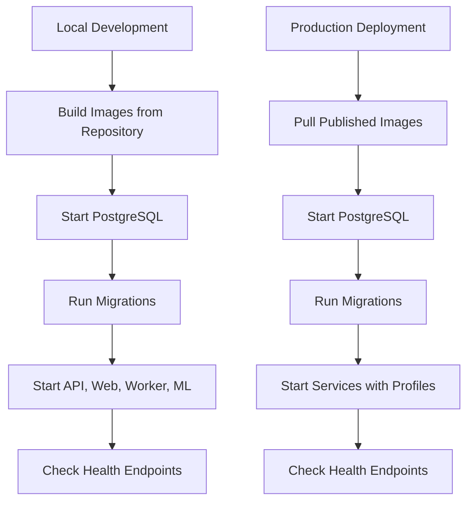

**Diagram sources**
- [compose.local.yml:12-43](file://compose.local.yml#L12-L43)
- [compose.prod.yml:22-45](file://compose.prod.yml#L22-L45)
- [docker/README.md:38-77](file://docker/README.md#L38-L77)

**Section sources**
- [compose.local.yml:1-44](file://compose.local.yml#L1-L44)
- [compose.prod.yml:1-47](file://compose.prod.yml#L1-L47)
- [docker/README.md:38-77](file://docker/README.md#L38-L77)

### Customizing Dockerfiles for Different Scenarios

#### Scenario: Enable ML Only
- Start the stack with the `ml` profile.
- Ensure `ML_SERVICE_ENABLED` allows the API to call ML.
- The API will wait for ML health when the profile is active in production mode.

#### Scenario: Disable ML and Keep Worker
- Start the stack with the `worker` profile.
- The API degrades gracefully when ML is unavailable.

#### Scenario: Add External Secrets
- Replace hardcoded defaults with external secret providers.
- Inject secrets at runtime through your platform’s secret manager.
- Keep `.env` out of version control and restrict access.

#### Scenario: Change Public API Routing
- Set `API_PUBLIC_URL` to the browser-reachable API endpoint.
- Do not set it to a Docker service name.
- Configure your reverse proxy to route the public API domain to the API container port.

**Section sources**
- [compose.yml:46-53](file://compose.yml#L46-L53)
- [compose.yml:125-131](file://compose.yml#L125-L131)
- [compose.prod.yml:22-45](file://compose.prod.yml#L22-L45)
- [docker/README.md:125-158](file://docker/README.md#L125-L158)

## Dependency Analysis

### Service Dependency Graph
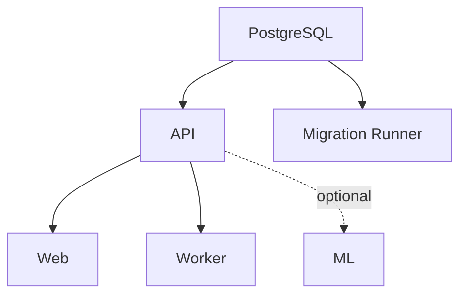

**Diagram sources**
- [compose.yml:41-72](file://compose.yml#L41-L72)
- [compose.yml:74-87](file://compose.yml#L74-L87)
- [compose.yml:89-118](file://compose.yml#L89-L118)
- [compose.yml:120-148](file://compose.yml#L120-L148)
- [compose.yml:150-173](file://compose.yml#L150-L173)

### Build-Time Dependency Flow
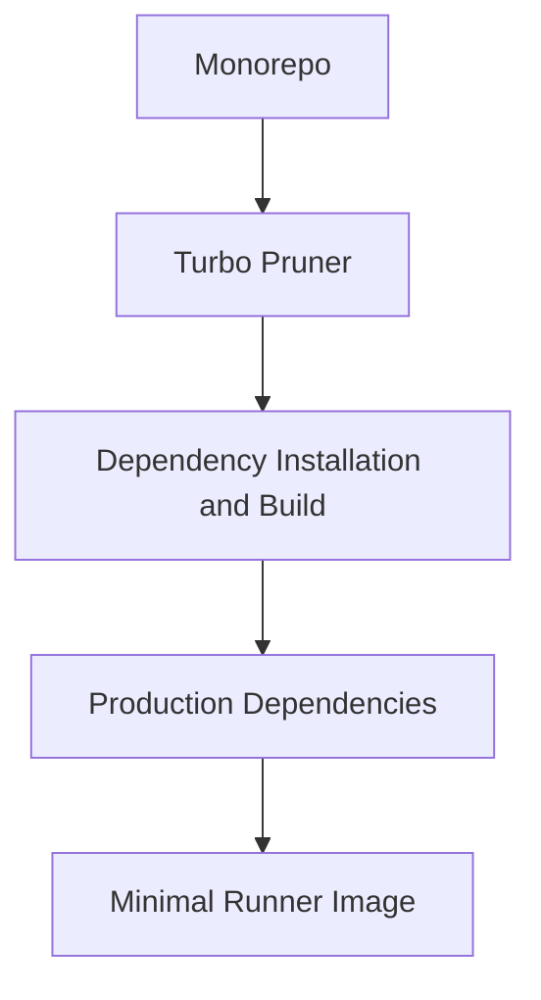

**Diagram sources**
- [docker/Dockerfile.api:6-92](file://docker/Dockerfile.api#L6-L92)
- [docker/Dockerfile.web:6-88](file://docker/Dockerfile.web#L6-L88)
- [docker/Dockerfile.worker:6-91](file://docker/Dockerfile.worker#L6-L91)

**Section sources**
- [compose.yml:18-205](file://compose.yml#L18-L205)
- [docker/Dockerfile.api:6-92](file://docker/Dockerfile.api#L6-L92)
- [docker/Dockerfile.web:6-88](file://docker/Dockerfile.web#L6-L88)
- [docker/Dockerfile.worker:6-91](file://docker/Dockerfile.worker#L6-L91)

## Performance Considerations

### Image Optimization Strategies
- Use workspace pruning to reduce build context.
- Separate build-time and runtime dependencies.
- Remove source files, tests, and documentation from production images.
- Use BuildKit cache mounts for dependency stores.
- Prefer minimal base images such as Alpine Linux for Node services and slim Python images for ML.

### Runtime Optimization Strategies
- Limit concurrency for workers based on available resources.
- Use separate profiles to avoid running unnecessary services.
- Keep ML optional so the API remains functional without it.
- Use health checks to prevent premature traffic routing.
- Avoid mapping sensitive ports to the host in production.

### Caching and Rebuild Efficiency
- Lock dependency versions through lockfiles.
- Keep frequently changing layers near the bottom of Dockerfiles.
- Reuse pruned outputs across stages.
- Pin published image tags for reproducible deployments.

[No sources needed since this section provides general guidance]

## Troubleshooting Guide

### Common Issues and Resolutions

| Symptom | Likely Cause | Resolution |
|---|---|---|
| Web cannot reach API | `API_PUBLIC_URL` points to an internal Docker name | Set `API_PUBLIC_URL` to a browser-reachable public URL. |
| API fails to connect to database | PostgreSQL not ready or wrong credentials | Wait for database health; verify `POSTGRES_*` variables and `DATABASE_URL`. |
| Migration fails | Schema already applied or missing migration artifacts | Run migrations explicitly and verify build outputs include migration files. |
| Worker health check fails | Worker not started or port mismatch | Start with correct profile and verify `WORKER_PORT`. |
| ML endpoints unavailable | ML profile not enabled | Start with `--profile ml` or `--profile all`. |
| pgAdmin cannot connect | Database not healthy or wrong credentials | Ensure PostgreSQL is healthy and configure pgAdmin environment variables. |
| Uploads disappear after restart | Missing volume mount | Verify `ananya_app` volume is attached to API and worker. |

### Health Check Reference
| Service | Probe Path or Command |
|---|---|
| Web | `http://localhost:3000/api/health` |
| API | `http://localhost:4000/health` |
| Worker | `http://localhost:4001/health` |
| ML | `http://localhost:5001/health` |
| PostgreSQL | `pg_isready` |

### Operational Checklist
1. Confirm the correct Compose files are combined.
2. Verify environment variables are set.
3. Start PostgreSQL and confirm its health.
4. Run migrations explicitly.
5. Start application services with the intended profile.
6. Check health endpoints for each service.
7. Validate browser-to-API routing through the public URL.

**Section sources**
- [docker/README.md:125-176](file://docker/README.md#L125-L176)
- [compose.yml:31-39](file://compose.yml#L31-L39)
- [compose.yml:61-72](file://compose.yml#L61-L72)
- [compose.yml:107-118](file://compose.yml#L107-L118)
- [compose.yml:137-148](file://compose.yml#L137-L148)
- [compose.yml:162-173](file://compose.yml#L162-L173)

## Conclusion
Ananya ERP’s containerization combines hardened multi-stage Dockerfiles with a modular Compose stack. The design emphasizes security, reproducibility, and operational clarity:
- Multi-stage builds minimize image size and attack surface.
- Profiles enable flexible deployment footprints.
- Explicit migrations and health checks improve reliability.
- Environment-agnostic web images simplify cross-environment deployments.
- Optional ML integration keeps the core API resilient.

For production, pin image versions, manage secrets externally, validate public API routing, and follow the documented deployment order. For local development, use the local override to build from source and iterate quickly while staying close to production behavior.

[No sources needed since this section summarizes without analyzing specific files]