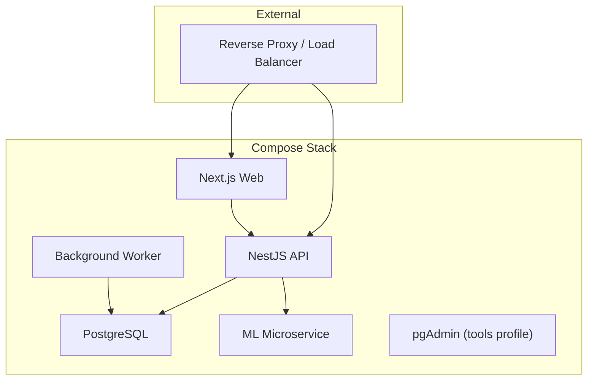
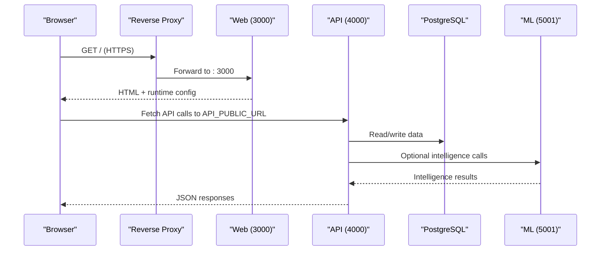
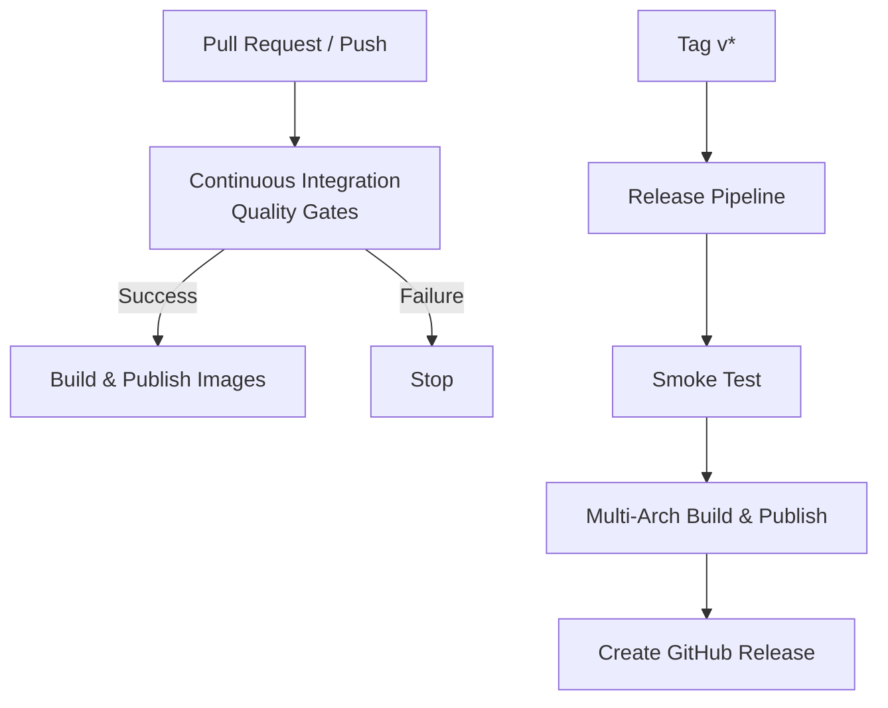
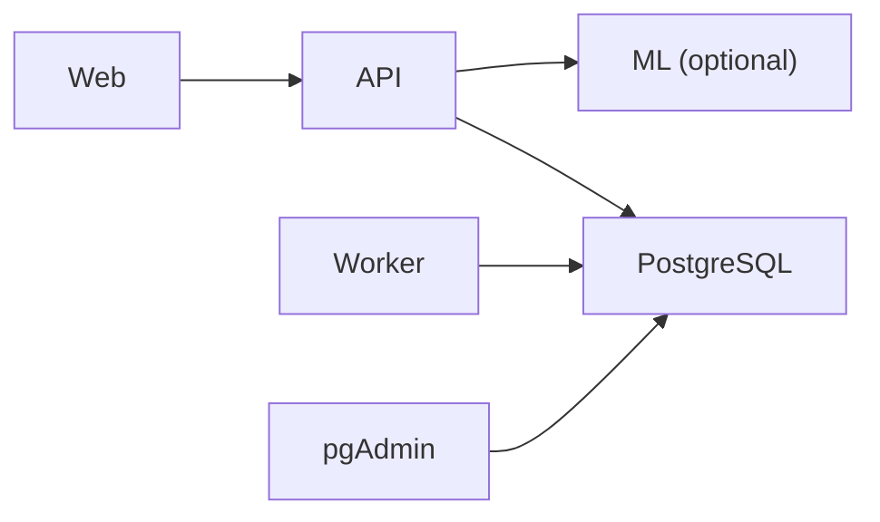

# Deployment & Operations

<cite>
**Referenced Files in This Document**
- [compose.yml](file://compose.yml)
- [compose.local.yml](file://compose.local.yml)
- [compose.prod.yml](file://compose.prod.yml)
- [docker/README.md](file://docker/README.md)
- [Dockerfile.api](file://docker/Dockerfile.api)
- [Dockerfile.web](file://docker/Dockerfile.web)
- [Dockerfile.worker](file://docker/Dockerfile.worker)
- [Dockerfile.ml](file://docker/Dockerfile.ml)
- [ci.yml](file://.github/workflows/ci.yml)
- [docker.yml](file://.github/workflows/docker.yml)
- [release.yml](file://.github/workflows/release.yml)
- [SCANNER_APP.md](file://docs/SCANNER_APP.md)
- [ML_OPERATIONS.md](file://docs/ML_OPERATIONS.md)
</cite>

## Table of Contents
1. Introduction
2. Project Structure
3. Core Components
4. Architecture Overview
5. Detailed Component Analysis
6. Dependency Analysis
7. Performance Considerations
8. Troubleshooting Guide
9. Conclusion
10. Appendices

## Introduction
This document provides comprehensive deployment and operations guidance for Ananya ERP using Docker Compose, container images, CI/CD pipelines, and operational best practices. It covers the Docker stack configuration, environment variables, service orchestration, production deployment strategies, reverse proxy and HTTPS considerations, monitoring and logging approaches, backup and disaster recovery planning, performance tuning and capacity planning, troubleshooting, CI/CD automation, release management, and scanner app deployment and mobile operations support.

## Project Structure
Ananya ships a layered Docker Compose stack:
- Base stack defines services, networking, volumes, health checks, and shared environment defaults.
- Local override builds application images from repository Dockerfiles for development and local testing.
- Production override references published images from GitHub Container Registry (GHCR).

**Diagram sources**
- [compose.yml:18-195](file://compose.yml#L18-L195)
- [compose.prod.yml:22-46](file://compose.prod.yml#L22-L46)
- [docker/README.md:125-158](file://docker/README.md#L125-L158)

**Section sources**
- [compose.yml:1-205](file://compose.yml#L1-L205)
- [compose.local.yml:1-44](file://compose.local.yml#L1-L44)
- [compose.prod.yml:1-47](file://compose.prod.yml#L1-L47)
- [docker/README.md:1-176](file://docker/README.md#L1-L176)

## Core Components
- PostgreSQL database with health check and persistent volume.
- NestJS API exposing REST endpoints, migrations runner, and background worker endpoint.
- Next.js web server serving the UI and runtime configuration for browser-to-API communication.
- Optional ML microservice providing component intelligence features.
- pgAdmin tooling available via profiles for database administration.

Key environment variables and ports:
- Database: POSTGRES_DB, POSTGRES_USER, POSTGRES_PASSWORD; internal port 5432.
- API: NODE_ENV, PORT, DATABASE_URL, CORS_ORIGIN, JWT_SECRET, ML_SERVICE_URL, ML_SERVICE_ENABLED; exposed port configurable via API_PORT.
- Worker: NODE_ENV, WORKER_PORT, DATABASE_URL, WORKER_CONCURRENCY; health on internal port 4001.
- Web: NODE_ENV, PORT, API_PUBLIC_URL; exposed port configurable via WEB_PORT.
- ML: PORT; exposed port configurable via ML_PORT.

Profiles:
- all: db, api, web, worker, ml
- worker: db, api, web, worker
- ml: db, api, web, ml
- tools/admin: adds pgAdmin
- default: db, api, web

**Section sources**
- [compose.yml:18-195](file://compose.yml#L18-L195)
- [docker/README.md:79-90](file://docker/README.md#L79-L90)

## Architecture Overview
The recommended production topology uses an external reverse proxy to terminate TLS and route traffic:
- https://erp.<domain> → Web (port 3000)
- https://api.erp.<domain> → API (port 4000)

Internal communication uses Docker DNS:
- API → PostgreSQL at postgres:5432
- API → ML at ml:5001 (optional)

The Web image is immutable and environment-agnostic; it generates runtime configuration at container boot to point browsers directly to the public API URL.

**Diagram sources**
- [compose.yml:41-148](file://compose.yml#L41-L148)
- [compose.prod.yml:22-46](file://compose.prod.yml#L22-L46)
- [docker/README.md:125-158](file://docker/README.md#L125-L158)

## Detailed Component Analysis

### Docker Compose Stack Orchestration
- Services are defined with restart policies, health checks, and dependency ordering.
- The migration service runs once per deployment to apply schema changes.
- Profiles allow selective startup of optional components like ML or pgAdmin.
- Volumes persist database and application uploads.

Operational notes:
- Do not run compose.prod.yml alone; always combine with compose.yml.
- Set API_PUBLIC_URL to a browser-reachable URL; never use Docker service names.
- Migrations must be executed explicitly before starting API/Worker/Web.

**Section sources**
- [compose.yml:18-195](file://compose.yml#L18-L195)
- [compose.local.yml:12-43](file://compose.local.yml#L12-L43)
- [compose.prod.yml:22-46](file://compose.prod.yml#L22-L46)
- [docker/README.md:28-101](file://docker/README.md#L28-L101)

### Container Images and Build Pipelines
- Multi-stage Dockerfiles produce hardened, non-root images with deterministic build verification.
- API and Worker share similar stages: prune, build, prod-deps, runner.
- Web uses Next.js standalone output and injects runtime configuration via ARG and ENV.
- ML uses a Python virtual environment and serves via Uvicorn.

Image registry and tagging:
- Edge builds on main branch produce edge and sha tags.
- Release tags produce versioned tags including latest, semver, and major/minor where applicable.

**Section sources**
- [Dockerfile.api:1-93](file://docker/Dockerfile.api#L1-L93)
- [Dockerfile.worker:1-92](file://docker/Dockerfile.worker#L1-L92)
- [Dockerfile.web:1-89](file://docker/Dockerfile.web#L1-L89)
- [Dockerfile.ml:1-60](file://docker/Dockerfile.ml#L1-L60)
- [docker/README.md:103-123](file://docker/README.md#L103-L123)
- [docker.yml:29-109](file://.github/workflows/docker.yml#L29-L109)
- [release.yml:31-140](file://.github/workflows/release.yml#L31-L140)

### Reverse Proxy and HTTPS Configuration
- The reverse proxy should terminate TLS and route:
  - https://erp.example.com → host/container port 3000
  - https://api.erp.example.com → host/container port 4000
- Ensure API_PUBLIC_URL matches the public API domain used by browsers.
- Scanner requires HTTPS for camera access on iOS devices.

**Section sources**
- [docker/README.md:125-158](file://docker/README.md#L125-L158)
- [SCANNER_APP.md:33-47](file://docs/SCANNER_APP.md#L33-L47)

### Monitoring and Logging
- Health probes:
  - Web: http://localhost:3000/api/health
  - API: http://localhost:4000/health
  - Worker: http://localhost:4001/health
  - ML: http://localhost:5001/health
  - PostgreSQL: pg_isready
- Use container orchestrator health checks to detect failures and trigger restarts.
- Centralize logs from containers to your log aggregation system for observability.

**Section sources**
- [compose.yml:31-72](file://compose.yml#L31-L72)
- [compose.yml:107-148](file://compose.yml#L107-L148)
- [compose.yml:162-173](file://compose.yml#L162-L173)
- [docker/README.md:167-176](file://docker/README.md#L167-L176)

### Backup Procedures and Disaster Recovery
- Persist PostgreSQL data via named volume ananya_db.
- Back up the PostgreSQL volume regularly using your platform’s snapshot or dump mechanisms.
- For disaster recovery:
  - Restore the PostgreSQL volume or import a logical dump into a fresh instance.
  - Run migrations against the restored database to ensure schema consistency.
  - Start API, Worker, and Web services after verifying database health.

Operational constraints:
- ML artifacts (datasets and model registry) are container-local and do not survive container replacement unless additional storage is configured.

**Section sources**
- [compose.yml:196-199](file://compose.yml#L196-L199)
- [ML_OPERATIONS.md:340-348](file://docs/ML_OPERATIONS.md#L340-L348)

### Performance Tuning and Capacity Planning
- Adjust WORKER_CONCURRENCY to tune background job throughput based on CPU and I/O capacity.
- Scale horizontally by running multiple API and Web replicas behind a load balancer; keep a single PostgreSQL instance or use managed HA databases as appropriate.
- Monitor resource usage of each container and adjust limits accordingly.
- Keep ML optional; disable if not needed to reduce footprint.

**Section sources**
- [compose.yml:89-118](file://compose.yml#L89-L118)
- [docker/README.md:79-90](file://docker/README.md#L79-L90)

### CI/CD Pipeline Setup, Automated Testing, and Release Management
- Continuous Integration:
  - Triggers on pushes to main and release branches, and pull requests.
  - Executes quality gates across the monorepo.
- Docker Image Publishing:
  - After successful CI, builds and publishes images for api, web, worker, and ml.
  - Uses GitHub Actions caching and metadata actions for OCI labels.
- Release Pipeline:
  - Triggered by version tags (v*).
  - Runs quality gates, smoke tests, multi-architecture builds, and creates GitHub Releases.
  - Produces versioned tags including latest, semver, and major/minor where applicable.

**Diagram sources**
- [ci.yml:1-31](file://.github/workflows/ci.yml#L1-L31)
- [docker.yml:1-109](file://.github/workflows/docker.yml#L1-L109)
- [release.yml:1-168](file://.github/workflows/release.yml#L1-L168)

**Section sources**
- [ci.yml:1-31](file://.github/workflows/ci.yml#L1-L31)
- [docker.yml:1-109](file://.github/workflows/docker.yml#L1-L109)
- [release.yml:1-168](file://.github/workflows/release.yml#L1-L168)

### Scanner App Deployment and Mobile Operations Support
- The scanner is a standalone surface at /scan that can be installed on iPhone Home Screen as a PWA.
- Requires HTTPS for camera access; works over localhost in development but needs secure context on devices.
- Scanning resolves codes through existing barcode lookup endpoints and opens the ERP’s details modal without navigation.
- Installation steps:
  - Open https://<your-ananya-host>/scan in Safari.
  - Share → Add to Home Screen.
  - Launch from Home Screen to open in standalone mode.

Operational considerations:
- Ensure the web app is served over HTTPS in production.
- Handle camera permission prompts and provide retry flows on denial.
- Use the same API endpoints as the ERP scan dialog for consistent behavior.

**Section sources**
- [SCANNER_APP.md:1-128](file://docs/SCANNER_APP.md#L1-L128)

## Dependency Analysis
Service dependencies and network boundaries:
- API depends on PostgreSQL and optionally ML.
- Web depends on API via public URL; no direct database access.
- Worker depends on PostgreSQL and shares upload volume with API.
- pgAdmin depends on PostgreSQL and is only enabled via profiles.

**Diagram sources**
- [compose.yml:41-195](file://compose.yml#L41-L195)

**Section sources**
- [compose.yml:41-195](file://compose.yml#L41-L195)

## Performance Considerations
- Tune worker concurrency and resource limits based on workload characteristics.
- Use horizontal scaling for stateless services (API, Web) while keeping database scaling separate.
- Enable health checks and leverage orchestrator auto-restart capabilities.
- Consider disabling ML if not required to reduce overhead.

[No sources needed since this section provides general guidance]

## Troubleshooting Guide
Common issues and diagnostics:
- Health check failures:
  - Verify endpoints respond inside containers on expected ports.
  - Check service dependencies and network connectivity.
- Migration errors:
  - Ensure migrations ran successfully before starting API/Worker.
  - Validate DATABASE_URL and database credentials.
- ML unavailability:
  - API gracefully degrades when ML is disabled or unreachable.
  - Check ML service health and logs.
- Scanner camera unavailable:
  - Confirm HTTPS is enabled for the web app.
  - Ensure camera permissions are granted in the browser.

Operational commands:
- Inspect container logs and status.
- Restart failed services using Compose profiles.
- Re-run migrations if schema drift is suspected.

**Section sources**
- [compose.yml:31-72](file://compose.yml#L31-L72)
- [compose.yml:107-148](file://compose.yml#L107-L148)
- [compose.yml:162-173](file://compose.yml#L162-L173)
- [docker/README.md:167-176](file://docker/README.md#L167-L176)
- [SCANNER_APP.md:33-47](file://docs/SCANNER_APP.md#L33-L47)

## Conclusion
Ananya ERP’s deployment model centers on a robust Docker Compose stack with clear separation between base, local, and production overrides. Published images, health checks, and profiles enable flexible deployments tailored to operational needs. CI/CD automates quality gates, image publishing, and releases, while scanner support ensures mobile operations work securely over HTTPS. Following the outlined procedures for backups, monitoring, scaling, and troubleshooting will help maintain reliable, performant production environments.

[No sources needed since this section summarizes without analyzing specific files]

## Appendices

### Environment Variables Reference
- Database:
  - POSTGRES_DB, POSTGRES_USER, POSTGRES_PASSWORD
- API:
  - NODE_ENV, PORT, DATABASE_URL, CORS_ORIGIN, JWT_SECRET, ML_SERVICE_URL, ML_SERVICE_ENABLED
- Worker:
  - NODE_ENV, WORKER_PORT, DATABASE_URL, WORKER_CONCURRENCY
- Web:
  - NODE_ENV, PORT, API_PUBLIC_URL
- ML:
  - PORT
- Ports:
  - API_PORT, WEB_PORT, ML_PORT, PGADMIN_PORT, POSTGRES_PORT (local only)

**Section sources**
- [compose.yml:23-53](file://compose.yml#L23-L53)
- [compose.yml:89-118](file://compose.yml#L89-L118)
- [compose.yml:120-148](file://compose.yml#L120-L148)
- [compose.yml:150-173](file://compose.yml#L150-L173)
- [compose.local.yml:13-42](file://compose.local.yml#L13-L42)

### Upgrade Procedure
- Pin target version, pull images, run migrations, then update services.
- Use Compose profiles to include optional components like ML or worker.

**Section sources**
- [docker/README.md:91-101](file://docker/README.md#L91-L101)

### Networking Notes
- Public URLs for browser-facing services; internal Docker DNS for inter-service communication.
- API_PUBLIC_URL must be reachable by browsers and must not use Docker service names.

**Section sources**
- [docker/README.md:125-158](file://docker/README.md#L125-L158)