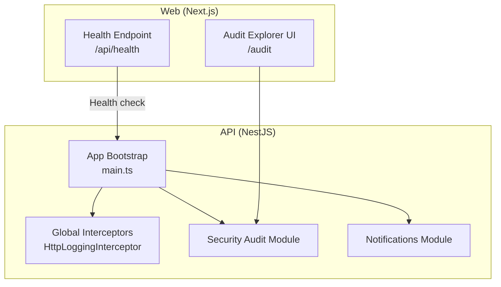
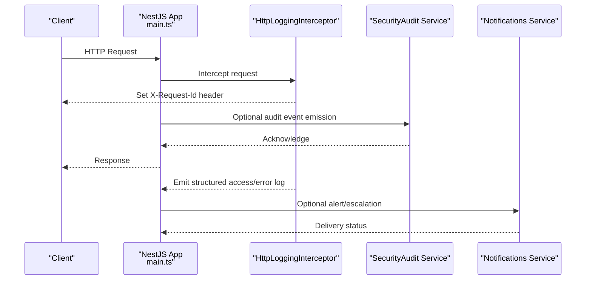
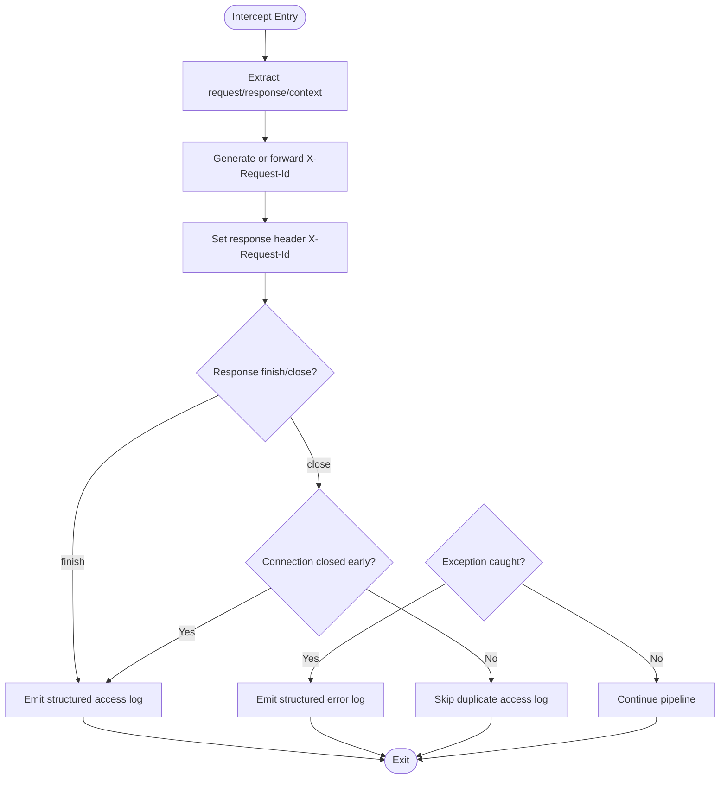
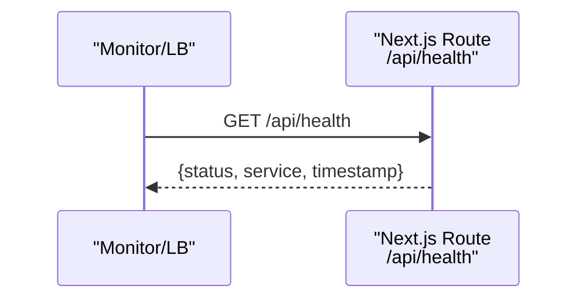
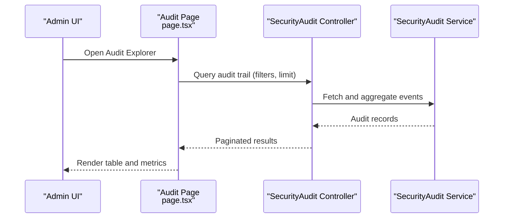
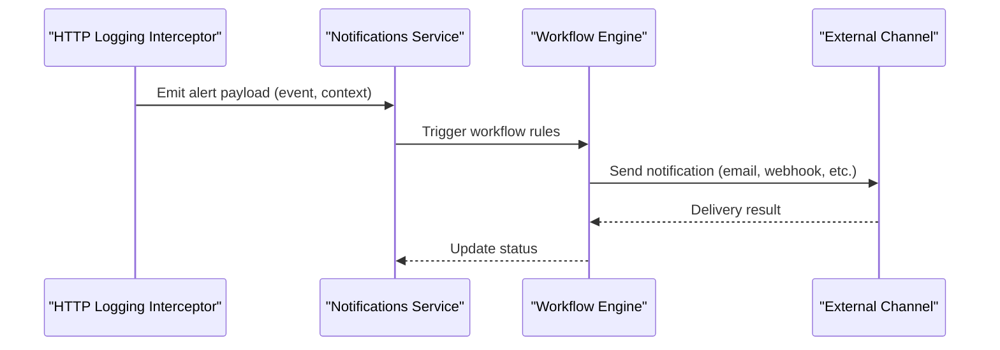
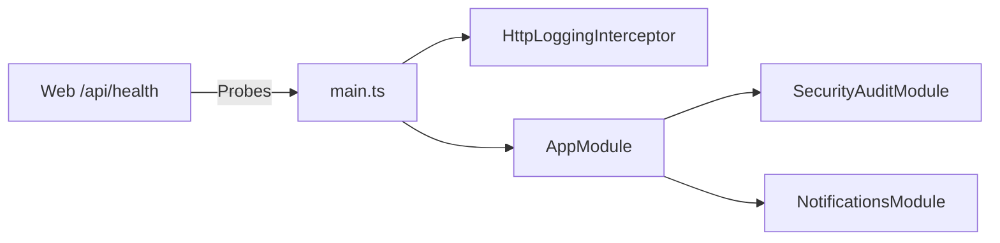

# Monitoring & Logging

<cite>
**Referenced Files in This Document**
- [http-logging.interceptor.ts](file://apps/api/src/common/logging/http-logging.interceptor.ts)
- [main.ts](file://apps/api/src/main.ts)
- [app.module.ts](file://apps/api/src/app.module.ts)
- [route.ts](file://apps/web/app/api/health/route.ts)
- [page.tsx](file://apps/web/app/audit/page.tsx)
- [security-audit.controller.ts](file://apps/api/src/security-audit/security-audit.controller.ts)
- [security-audit.service.ts](file://apps/api/src/security-audit/security-audit.service.ts)
- [notifications.service.ts](file://apps/api/src/notifications/notifications.service.ts)
- [workflow-engine.service.ts](file://apps/api/src/notifications/workflow-engine.service.ts)
</cite>

## Table of Contents
1. [Introduction](#introduction)
2. [Project Structure](#project-structure)
3. [Core Components](#core-components)
4. [Architecture Overview](#architecture-overview)
5. [Detailed Component Analysis](#detailed-component-analysis)
6. [Dependency Analysis](#dependency-analysis)
7. [Performance Considerations](#performance-considerations)
8. [Troubleshooting Guide](#troubleshooting-guide)
9. [Conclusion](#conclusion)
10. [Appendices](#appendices)

## Introduction
This document provides comprehensive monitoring and logging guidance for Ananya ERP. It covers application-level logging strategies, structured log formats, health checks, audit logging, alerting and notifications, log rotation and storage considerations, and techniques for dashboards, profiling, and debugging production issues. The content is grounded in the repository’s HTTP logging interceptor, API bootstrap configuration, web health endpoint, and security audit features.

## Project Structure
Ananya ERP exposes:
- A NestJS API with a global HTTP logging interceptor that emits structured JSON logs for requests and errors.
- A Next.js web app exposing a simple health endpoint.
- Security audit capabilities exposed via API modules and a web-based Audit Explorer UI.
- Notifications and workflow engine services to support alerting and incident workflows.

**Diagram sources**
- [main.ts:11-36](file://apps/api/src/main.ts#L11-L36)
- [http-logging.interceptor.ts:21-73](file://apps/api/src/common/logging/http-logging.interceptor.ts#L21-L73)
- [route.ts:3-12](file://apps/web/app/api/health/route.ts#L3-L12)
- [page.tsx:22-46](file://apps/web/app/audit/page.tsx#L22-L46)
- [security-audit.controller.ts](file://apps/api/src/security-audit/security-audit.controller.ts)
- [security-audit.service.ts](file://apps/api/src/security-audit/security-audit.service.ts)
- [notifications.service.ts](file://apps/api/src/notifications/notifications.service.ts)
- [workflow-engine.service.ts](file://apps/api/src/notifications/workflow-engine.service.ts)

**Section sources**
- [main.ts:11-36](file://apps/api/src/main.ts#L11-L36)
- [app.module.ts:82-165](file://apps/api/src/app.module.ts#L82-L165)
- [route.ts:3-12](file://apps/web/app/api/health/route.ts#L3-L12)
- [page.tsx:22-46](file://apps/web/app/audit/page.tsx#L22-L46)

## Core Components
- HTTP Access and Error Logging: A global interceptor captures request lifecycle events, serializes structured logs, and attaches a unique request ID header.
- Health Check: A lightweight GET endpoint returns service status and timestamp for uptime monitors.
- Security Audit: API endpoints and a web UI allow querying and reviewing security-related audit events.
- Notifications and Workflow Engine: Services to send notifications and orchestrate alerting workflows.

Key responsibilities:
- Intercept all HTTP requests/responses to emit consistent access logs and error logs.
- Provide a health probe for orchestrators and load balancers.
- Record and expose security audit events for compliance and investigations.
- Support alerting through notification services and configurable workflows.

**Section sources**
- [http-logging.interceptor.ts:21-151](file://apps/api/src/common/logging/http-logging.interceptor.ts#L21-L151)
- [route.ts:3-12](file://apps/web/app/api/health/route.ts#L3-L12)
- [page.tsx:22-46](file://apps/web/app/audit/page.tsx#L22-L46)
- [security-audit.controller.ts](file://apps/api/src/security-audit/security-audit.controller.ts)
- [security-audit.service.ts](file://apps/api/src/security-audit/security-audit.service.ts)
- [notifications.service.ts](file://apps/api/src/notifications/notifications.service.ts)
- [workflow-engine.service.ts](file://apps/api/src/notifications/workflow-engine.service.ts)

## Architecture Overview
The API bootstraps global interceptors and pipes, ensuring every request is logged consistently. The web app exposes a health route for external probes. Security audit data is queried from the API and visualized in the web UI. Notifications and workflow services provide mechanisms to escalate and act on events.

**Diagram sources**
- [main.ts:11-36](file://apps/api/src/main.ts#L11-L36)
- [http-logging.interceptor.ts:21-73](file://apps/api/src/common/logging/http-logging.interceptor.ts#L21-L73)
- [security-audit.service.ts](file://apps/api/src/security-audit/security-audit.service.ts)
- [notifications.service.ts](file://apps/api/src/notifications/notifications.service.ts)

## Detailed Component Analysis

### HTTP Access and Error Logging
- Global registration ensures consistent instrumentation across all routes.
- Emits structured JSON logs for both successful requests and errors.
- Adds correlation via X-Request-Id header for tracing across services.
- Supports toggling access and error logging via environment variables.

**Diagram sources**
- [http-logging.interceptor.ts:21-151](file://apps/api/src/common/logging/http-logging.interceptor.ts#L21-L151)

Operational notes:
- Structured fields include event type, method, route, status code, duration, IP, user agent, and connection state.
- Errors capture name, message, stack, and derived status code when available.
- Use the X-Request-Id header to correlate logs across components.

**Section sources**
- [http-logging.interceptor.ts:21-151](file://apps/api/src/common/logging/http-logging.interceptor.ts#L21-L151)
- [main.ts:24-32](file://apps/api/src/main.ts#L24-L32)

### Health Check Endpoint
- Provides a minimal GET endpoint returning status, service name, and timestamp.
- Suitable for liveness/readiness probes from orchestrators and load balancers.

**Diagram sources**
- [route.ts:3-12](file://apps/web/app/api/health/route.ts#L3-L12)

**Section sources**
- [route.ts:3-12](file://apps/web/app/api/health/route.ts#L3-L12)

### Security Audit and Activity Tracking
- API module exposes endpoints to query and manage security audit events.
- Web UI provides filtering by category and search across actions, users, and categories.
- Useful for compliance reporting, forensic analysis, and detecting anomalous activity.

**Diagram sources**
- [page.tsx:22-46](file://apps/web/app/audit/page.tsx#L22-L46)
- [security-audit.controller.ts](file://apps/api/src/security-audit/security-audit.controller.ts)
- [security-audit.service.ts](file://apps/api/src/security-audit/security-audit.service.ts)

**Section sources**
- [page.tsx:22-46](file://apps/web/app/audit/page.tsx#L22-L46)
- [security-audit.controller.ts](file://apps/api/src/security-audit/security-audit.controller.ts)
- [security-audit.service.ts](file://apps/api/src/security-audit/security-audit.service.ts)

### Alerting and Notification Workflows
- Notifications service and workflow engine enable sending alerts and orchestrating multi-step responses.
- Can be integrated with audit events and error spikes to trigger escalations.

**Diagram sources**
- [http-logging.interceptor.ts:65-73](file://apps/api/src/common/logging/http-logging.interceptor.ts#L65-L73)
- [notifications.service.ts](file://apps/api/src/notifications/notifications.service.ts)
- [workflow-engine.service.ts](file://apps/api/src/notifications/workflow-engine.service.ts)

**Section sources**
- [notifications.service.ts](file://apps/api/src/notifications/notifications.service.ts)
- [workflow-engine.service.ts](file://apps/api/src/notifications/workflow-engine.service.ts)

## Dependency Analysis
- The API bootstrap wires the logging interceptor globally, ensuring all controllers benefit without per-route changes.
- Modules are imported centrally; security audit and notifications are registered as part of the application assembly.
- The web health endpoint is independent of the API but can be monitored alongside it.

**Diagram sources**
- [main.ts:11-36](file://apps/api/src/main.ts#L11-L36)
- [app.module.ts:82-165](file://apps/api/src/app.module.ts#L82-L165)
- [route.ts:3-12](file://apps/web/app/api/health/route.ts#L3-L12)

**Section sources**
- [main.ts:11-36](file://apps/api/src/main.ts#L11-L36)
- [app.module.ts:82-165](file://apps/api/src/app.module.ts#L82-L165)

## Performance Considerations
- Logging overhead: The interceptor measures duration using high-resolution timers and writes JSON logs. Ensure log volume is appropriate for your environment to avoid I/O bottlenecks.
- Correlation: Use X-Request-Id to minimize noise and improve traceability without extra joins.
- Conditional logging: Toggle access and error logging via environment variables to reduce cost in non-production environments.
- Health endpoint: Keep the health route minimal to avoid false negatives during load.

[No sources needed since this section provides general guidance]

## Troubleshooting Guide
- Missing or inconsistent logs: Verify the interceptor is registered globally and not bypassed by custom routing patterns. Confirm environment flags for access/error logging are set appropriately.
- Tracing across services: Propagate X-Request-Id in upstream calls and downstream services to maintain correlation.
- Health check failures: Validate the web health route responds with expected structure and status codes.
- Audit gaps: Ensure security audit events are emitted at key boundaries and that queries return expected categories and actions.
- Alert delivery: Inspect notification service and workflow engine outputs for delivery confirmations and retry policies.

**Section sources**
- [http-logging.interceptor.ts:21-151](file://apps/api/src/common/logging/http-logging.interceptor.ts#L21-L151)
- [route.ts:3-12](file://apps/web/app/api/health/route.ts#L3-L12)
- [page.tsx:22-46](file://apps/web/app/audit/page.tsx#L22-L46)
- [notifications.service.ts](file://apps/api/src/notifications/notifications.service.ts)
- [workflow-engine.service.ts](file://apps/api/src/notifications/workflow-engine.service.ts)

## Conclusion
Ananya ERP implements robust, structured HTTP logging with correlation IDs, a simple health endpoint for probes, and a security audit system accessible via API and UI. Notifications and workflow services provide foundations for alerting and incident response. Adopting these building blocks enables effective observability, compliance, and operational reliability.

[No sources needed since this section summarizes without analyzing specific files]

## Appendices

### Structured Log Formats
- Access log fields: event, requestId, method, route, statusCode, durationMs, ip, userAgent, connectionClosed.
- Error log fields: event, requestId, method, route, statusCode, durationMs, errorName, errorMessage, stack.

Use these fields to build filters, dashboards, and alerts.

**Section sources**
- [http-logging.interceptor.ts:39-98](file://apps/api/src/common/logging/http-logging.interceptor.ts#L39-L98)

### Health Endpoint Contract
- Method: GET
- Path: /api/health
- Response: status, service, timestamp

**Section sources**
- [route.ts:3-12](file://apps/web/app/api/health/route.ts#L3-L12)

### Audit Explorer Usage
- Filter by category (Authentication, Administration, Security, Inventory, Procurement).
- Search across action, user email, and category.
- View counts for total logs, authentication operations, and security/admin changes.

**Section sources**
- [page.tsx:22-46](file://apps/web/app/audit/page.tsx#L22-L46)

### Alerting and Incident Response Procedures
- Define thresholds on error rate, latency, and audit anomalies.
- Configure notifications to route to channels (e.g., email, webhooks).
- Orchestrate workflows for triage, escalation, and remediation steps.

**Section sources**
- [notifications.service.ts](file://apps/api/src/notifications/notifications.service.ts)
- [workflow-engine.service.ts](file://apps/api/src/notifications/workflow-engine.service.ts)

### Log Rotation and Storage Management
- Integrate with your platform’s log aggregation and retention policies.
- Ensure X-Request-Id is preserved across services for end-to-end tracing.
- Apply sampling or filtering for high-volume logs if necessary.

[No sources needed since this section provides general guidance]

### Dashboards, Profiling, and Debugging
- Build dashboards around access logs, error rates, and audit events.
- Use X-Request-Id to drill into specific requests across systems.
- Profile hot paths by correlating durationMs with business operations.

[No sources needed since this section provides general guidance]