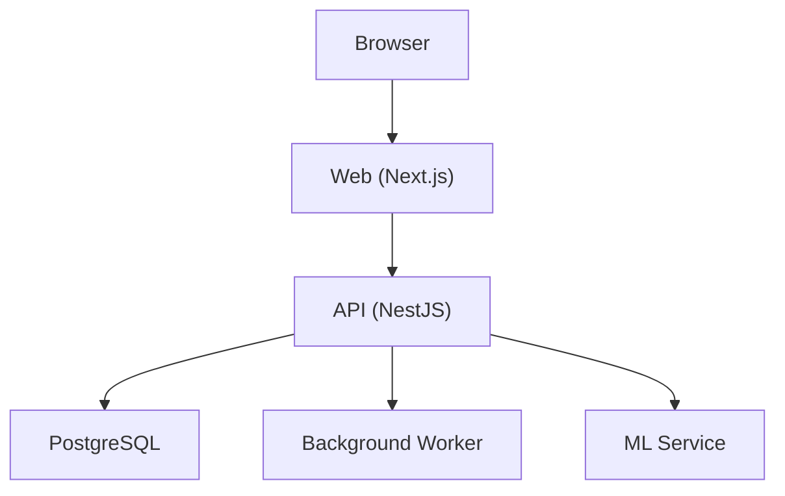
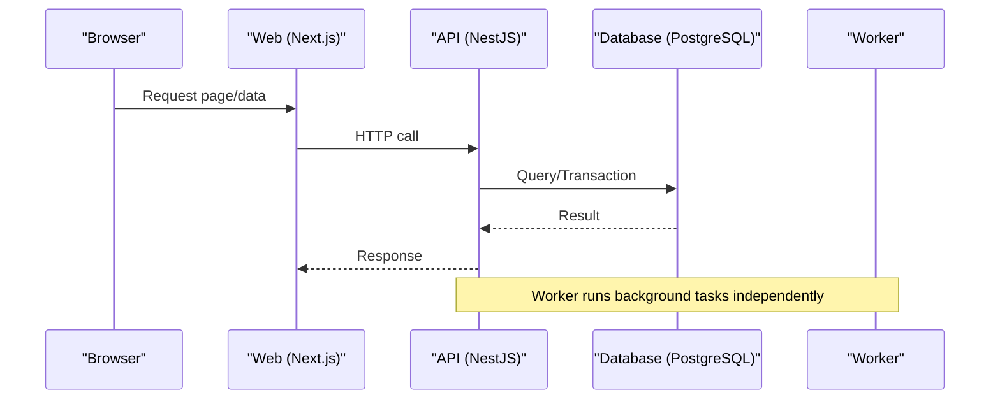
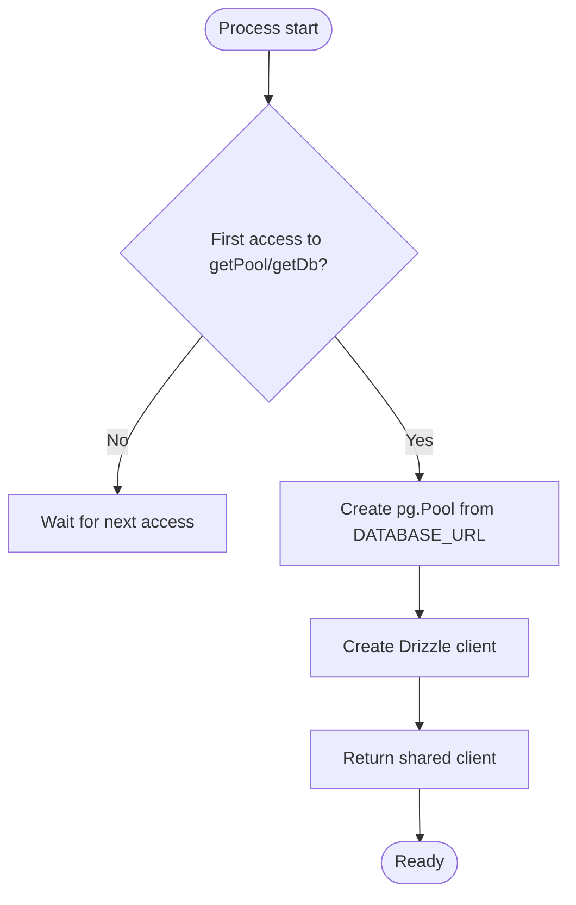
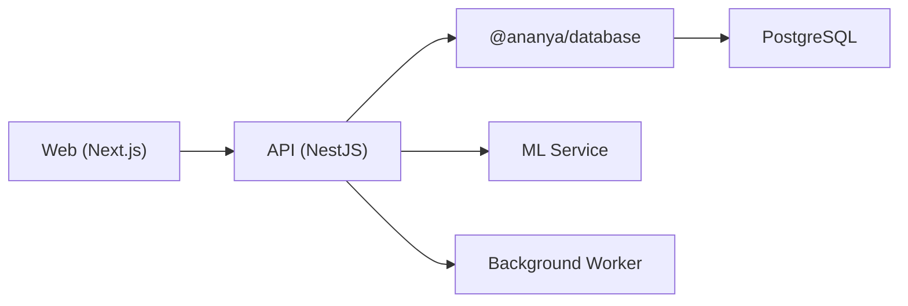

# Performance Tuning

<cite>
**Referenced Files in This Document**
- [README.md](file://README.md)
- [next.config.mjs](file://apps/web/next.config.mjs)
- [sw.js](file://apps/web/public/sw.js)
- [pwa-structure.spec.ts](file://apps/web/lib/pwa-structure.spec.ts)
- [index.ts](file://packages/database/src/index.ts)
- [executor.ts](file://packages/database/src/executor.ts)
- [database.constants.ts](file://apps/api/src/database/database.constants.ts)
- [apply-timeout.ts](file://apps/api/src/ml/intelligence-findings/apply-timeout.ts)
- [component-duplicate-intelligence.ts](file://apps/api/src/ml/component-duplicate-intelligence.ts)
- [ml-ops.service.ts](file://apps/api/src/ml/ops/ml-ops.service.ts)
- [profiling.py](file://apps/ml/training/utils/profiling.py)
- [document_acquisition_benchmark.py](file://apps/ml/benchmarks/document_acquisition_benchmark.py)
- [worker.ts](file://apps/api/src/worker.ts)
- [ml-ops.ts](file://apps/web/lib/ml-ops.ts)
</cite>

## Table of Contents
1. Introduction
2. Project Structure
3. Core Components
4. Architecture Overview
5. Detailed Component Analysis
6. Dependency Analysis
7. Performance Considerations
8. Troubleshooting Guide
9. Conclusion
10. Appendices

## Introduction
This document provides performance tuning guidance for Ananya ERP across database, application, and frontend layers. It focuses on query optimization, indexing strategies, connection pool tuning, frontend asset and caching optimizations, backend memory and CPU tuning, multi-level caching, load testing, profiling, scalability bottlenecks, resource allocation best practices, monitoring indicators, and production troubleshooting techniques.

## Project Structure
Ananya is a modular monolith with:
- Web (Next.js) serving the UI and PWA assets
- API (NestJS) exposing REST endpoints and hosting a background worker process
- ML service (Python/FastAPI) for component intelligence
- Shared database package using Drizzle ORM over PostgreSQL
- Docker Compose orchestration for local and production deployments

**Section sources**
- [README.md:275-297](file://README.md#L275-L297)

## Core Components
- Database layer: lazy-initialized connection pool and Drizzle client, transaction executor abstraction for atomic operations
- API worker: lightweight HTTP health endpoint and periodic background task loop
- Frontend PWA: minimal service worker with offline fallback and strict cache headers for sw.js
- ML profiling and benchmarks: stage profiler and benchmark harness to measure throughput and latency

Key implementation references:
- Database pool and client initialization: [index.ts:7-26](file://packages/database/src/index.ts#L7-L26), [index.ts:28-34](file://packages/database/src/index.ts#L28-L34)
- Transaction executor pattern: [executor.ts:17-40](file://packages/database/src/executor.ts#L17-L40)
- Worker bootstrap and health endpoint: [worker.ts:9-42](file://apps/api/src/worker.ts#L9-L42)
- Service worker fetch handling and offline fallback: [sw.js:55-92](file://apps/web/public/sw.js#L55-L92)
- Next.js headers for service worker: [next.config.mjs:10-26](file://apps/web/next.config.mjs#L10-L26)
- ML stage profiler enablement: [profiling.py:158-164](file://apps/ml/training/utils/profiling.py#L158-L164)

**Section sources**
- [index.ts:7-34](file://packages/database/src/index.ts#L7-L34)
- [executor.ts:17-40](file://packages/database/src/executor.ts#L17-L40)
- [worker.ts:9-42](file://apps/api/src/worker.ts#L9-L42)
- [sw.js:55-92](file://apps/web/public/sw.js#L55-L92)
- [next.config.mjs:10-26](file://apps/web/next.config.mjs#L10-L26)
- [profiling.py:158-164](file://apps/ml/training/utils/profiling.py#L158-L164)

## Architecture Overview
The runtime path for a typical request:
- Browser requests a page or data from the Web app
- Web app calls API endpoints
- API executes domain logic, uses transactions via DbExecutor, and persists changes through Drizzle
- Background worker runs periodic tasks and exposes a health endpoint
- Optional ML calls for intelligence features

**Diagram sources**
- [README.md:275-297](file://README.md#L275-L297)
- [index.ts:20-26](file://packages/database/src/index.ts#L20-L26)
- [worker.ts:20-42](file://apps/api/src/worker.ts#L20-L42)

## Detailed Component Analysis

### Database Connection Pool and Transactions
- The database package lazily creates a single pg Pool and Drizzle client when first accessed.
- A Proxy-based global db and pool expose methods bound to the singleton instances.
- A DbExecutor type abstracts either the root client or a transaction handle, enabling atomic multi-repository operations.

Optimization implications:
- Ensure DATABASE_URL is set; missing configuration throws early.
- Use transactions for write-heavy workflows to avoid partial updates and reduce lock contention.
- Close connections during shutdown to free resources.

**Diagram sources**
- [index.ts:7-26](file://packages/database/src/index.ts#L7-L26)

**Section sources**
- [index.ts:7-34](file://packages/database/src/index.ts#L7-L34)
- [executor.ts:17-40](file://packages/database/src/executor.ts#L17-L40)

### Database Query Optimization and Indexing Strategies
- Use parameterized SQL fragments that mirror JavaScript normalization functions so they can be indexed.
- Prefer immutable functions in expressions to enable functional indexes.
- For read-heavy lookups, consider materialized views or projections where appropriate.

Examples in codebase:
- Normalization SQL mirrors for MPN and component name are designed to be indexable: [component-duplicate-intelligence.ts:230-245](file://apps/api/src/ml/component-duplicate-intelligence.ts#L230-L245)

Guidelines:
- Identify hot queries via slow query logs and EXPLAIN ANALYZE.
- Add indexes on normalized columns used in WHERE/JOIN conditions.
- Avoid SELECT *; project only needed columns.
- Batch writes and use transactions to minimize round-trips and locks.

**Section sources**
- [component-duplicate-intelligence.ts:230-245](file://apps/api/src/ml/component-duplicate-intelligence.ts#L230-L245)

### Connection Pool Tuning
Current behavior:
- Pool is created with default options based on DATABASE_URL.

Recommended tuning parameters to add to the Pool constructor:
- max: Maximum number of clients connected to the database (match to expected concurrency).
- idleTimeoutMillis: Time before an idle client is closed.
- acquireTimeoutMillis: Max time to acquire a connection.
- connectionTimeoutMillis: Max time to establish a new connection.
- min: Minimum number of idle connections kept warm.

Where to apply:
- Modify the Pool creation site in the database package to include tuned values.

**Section sources**
- [index.ts:7-18](file://packages/database/src/index.ts#L7-L18)

### Backend Timeout and Resource Protection
- Apply per-transaction lock and statement timeouts to prevent runaway queries and deadlocks.
- Timeouts are applied via set_config within the transaction scope, ensuring isolation and no leakage to pooled connections.

Implementation reference:
- Reading bounds and applying them inside a transaction: [apply-timeout.ts:88-124](file://apps/api/src/ml/intelligence-findings/apply-timeout.ts#L88-L124)

Best practices:
- Wrap long-running operations in transactions with bounded timeouts.
- Log timeout violations for observability.
- Tune lock_timeout and statement_timeout per workload characteristics.

**Section sources**
- [apply-timeout.ts:88-124](file://apps/api/src/ml/intelligence-findings/apply-timeout.ts#L88-L124)

### Frontend Performance and Caching
- Next.js standalone output reduces deployment size and improves cold starts.
- Images are unoptimized in build config; consider enabling image optimization for production if compatible with your CDN.
- Service worker sw.js is served with no-cache headers to ensure updates propagate reliably.
- Service worker intercepts GET navigation requests and returns an offline fallback page when network fails.

References:
- Next.js config and headers: [next.config.mjs:1-26](file://apps/web/next.config.mjs#L1-26)
- Service worker fetch and offline fallback: [sw.js:55-92](file://apps/web/public/sw.js#L55-L92)
- PWA tests validating headers and behavior: [pwa-structure.spec.ts:61-98](file://apps/web/lib/pwa-structure.spec.ts#L61-L98)

Recommendations:
- Enable image optimization and configure CDN caching for static assets.
- Use route-level code splitting and dynamic imports for large modules.
- Cache API responses selectively with SW or CDN where safe (read-only, short-lived data).
- Keep sw.js fresh with no-store headers; cache other assets aggressively.

**Section sources**
- [next.config.mjs:1-26](file://apps/web/next.config.mjs#L1-26)
- [sw.js:55-92](file://apps/web/public/sw.js#L55-L92)
- [pwa-structure.spec.ts:61-98](file://apps/web/lib/pwa-structure.spec.ts#L61-L98)

### Background Worker Health and Concurrency
- The worker initializes a NestJS application context without a full HTTP server and exposes a lightweight /health endpoint for probes.
- A periodic interval performs background checks; logging can be toggled via environment variables.

References:
- Worker bootstrap and health endpoint: [worker.ts:9-42](file://apps/api/src/worker.ts#L9-L42)
- Environment-driven debug logging: [worker.ts:44-54](file://apps/api/src/worker.ts#L44-L54)

Tuning tips:
- Scale workers horizontally behind a load balancer if background processing becomes a bottleneck.
- Monitor uptime and health endpoint latency for capacity planning.

**Section sources**
- [worker.ts:9-42](file://apps/api/src/worker.ts#L9-L42)
- [worker.ts:44-54](file://apps/api/src/worker.ts#L44-L54)

### ML Profiling and Benchmarking
- StageProfiler collects average, median, p95, and maximum durations for pipeline stages when enabled via environment variable.
- Benchmark harness drives document acquisition with configurable concurrency, rate limits, and retries, reporting metrics.

References:
- Profiler enablement and stats: [profiling.py:140-164](file://apps/ml/training/utils/profiling.py#L140-L164)
- Benchmark run loop and instrumentation: [document_acquisition_benchmark.py:283-460](file://apps/ml/benchmarks/document_acquisition_benchmark.py#L283-L460)

Usage:
- Set ANANYA_ML_PROFILE to enable profiling in ML pipelines.
- Use benchmarks to validate scaling changes and identify regressions.

**Section sources**
- [profiling.py:140-164](file://apps/ml/training/utils/profiling.py#L140-L164)
- [document_acquisition_benchmark.py:283-460](file://apps/ml/benchmarks/document_acquisition_benchmark.py#L283-L460)

### Metrics Formatting and Observability
- ML ops utilities format metrics consistently, including ratios, durations, sizes, and timestamps, aiding dashboards and reports.

Reference:
- Metric formatting helpers: [ml-ops.ts:207-248](file://apps/web/lib/ml-ops.ts#L207-L248)

**Section sources**
- [ml-ops.ts:207-248](file://apps/web/lib/ml-ops.ts#L207-L248)

## Dependency Analysis
High-level dependencies relevant to performance:
- Web depends on API for data and serves PWA assets
- API depends on database package for persistence and optional ML service
- Database package depends on pg and drizzle-orm
- Worker reuses API application context for background tasks

**Diagram sources**
- [README.md:275-297](file://README.md#L275-L297)
- [index.ts:1-3](file://packages/database/src/index.ts#L1-L3)

**Section sources**
- [README.md:275-297](file://README.md#L275-L297)

## Performance Considerations
- Database
  - Use transactions for multi-step writes to ensure consistency and reduce lock contention.
  - Add functional indexes on normalized columns used frequently in filters/joins.
  - Tune connection pool parameters to match peak concurrency and latency targets.
  - Apply per-transaction timeouts to protect against runaway queries.
- Application
  - Offload heavy work to background worker processes; keep request paths fast.
  - Use bounded timeouts and retry policies for external calls (e.g., ML service).
  - Profile critical paths with ML stage profiler and benchmark harness.
- Frontend
  - Enable image optimization and CDN caching for static assets.
  - Use code splitting and lazy loading for large routes/components.
  - Keep sw.js fresh; cache other assets aggressively at CDN edge.
- Scalability
  - Horizontal scale API and worker replicas behind a load balancer.
  - Monitor database connections and query latency; shard or partition tables if necessary.
  - Use projections or materialized views for expensive read patterns.

[No sources needed since this section provides general guidance]

## Troubleshooting Guide
Common issues and diagnostics:
- Missing DATABASE_URL causes immediate failure when accessing the database; verify environment configuration.
- Slow queries: enable statement_timeout and capture slow query logs; analyze with EXPLAIN ANALYZE.
- Deadlocks/timeouts: adjust lock_timeout and statement_timeout; review transaction boundaries.
- Frontend caching anomalies: confirm sw.js headers and browser cache behavior; clear caches if needed.
- Worker health: probe /health endpoint to detect liveness and readiness issues.

Operational references:
- Database URL requirement and error: [index.ts:9-12](file://packages/database/src/index.ts#L9-L12)
- Transaction timeout application: [apply-timeout.ts:114-124](file://apps/api/src/ml/intelligence-findings/apply-timeout.ts#L114-L124)
- Service worker headers and offline fallback: [next.config.mjs:10-26](file://apps/web/next.config.mjs#L10-L26), [sw.js:63-92](file://apps/web/public/sw.js#L63-L92)
- Worker health endpoint: [worker.ts:20-42](file://apps/api/src/worker.ts#L20-L42)

**Section sources**
- [index.ts:9-12](file://packages/database/src/index.ts#L9-L12)
- [apply-timeout.ts:114-124](file://apps/api/src/ml/intelligence-findings/apply-timeout.ts#L114-L124)
- [next.config.mjs:10-26](file://apps/web/next.config.mjs#L10-L26)
- [sw.js:63-92](file://apps/web/public/sw.js#L63-L92)
- [worker.ts:20-42](file://apps/api/src/worker.ts#L20-L42)

## Conclusion
Ananya’s architecture supports scalable, performant operations through a well-defined database layer, transactional safety, bounded timeouts, and a PWA-enabled frontend. By tuning connection pools, adding targeted indexes, leveraging background workers, and adopting robust caching and profiling practices, teams can achieve responsive user experiences and reliable throughput under load. Continuous measurement with benchmarks and profiling ensures performance improvements remain effective as the system evolves.

[No sources needed since this section summarizes without analyzing specific files]

## Appendices

### Multi-Level Caching Strategy
- Database level
  - Use indexes and prepared statements; consider read replicas for read-heavy workloads.
- Application level
  - Cache frequent reads in-memory where appropriate; invalidate on writes.
- CDN level
  - Cache static assets and read-only API responses with short TTLs; vary by tenant if needed.

[No sources needed since this section provides general guidance]

### Load Testing Methodologies
- Define SLOs for latency, throughput, and error rates.
- Use realistic data sets and concurrent users; simulate peak loads and spikes.
- Measure end-to-end response times and resource utilization; iterate on bottlenecks.

[No sources needed since this section provides general guidance]

### Performance Monitoring Indicators
- Database: connection pool usage, query latency, lock waits, slow queries
- API: request latency, error rates, worker queue depth
- Frontend: bundle size, TTFB, LCP, FID, CLS
- ML: stage durations, throughput, memory usage

[No sources needed since this section provides general guidance]