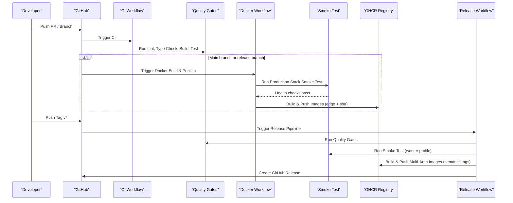
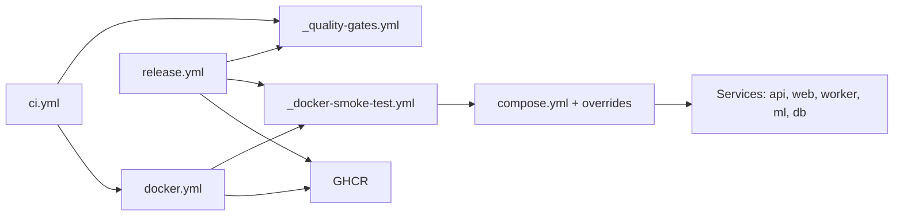

# CI/CD Pipeline

<cite>
**Referenced Files in This Document**
- [ci.yml](file://.github/workflows/ci.yml)
- [_quality-gates.yml](file://.github/workflows/_quality-gates.yml)
- [_docker-smoke-test.yml](file://.github/workflows/_docker-smoke-test.yml)
- [docker.yml](file://.github/workflows/docker.yml)
- [release.yml](file://.github/workflows/release.yml)
- [turbo.json](file://turbo.json)
- [pnpm-workspace.yaml](file://pnpm-workspace.yaml)
- [compose.yml](file://compose.yml)
- [compose.local.yml](file://compose.local.yml)
- [compose.prod.yml](file://compose.prod.yml)
- [Dockerfile.api](file://docker/Dockerfile.api)
- [Dockerfile.web](file://docker/Dockerfile.web)
</cite>

## Table of Contents
1. [Introduction](#introduction)
2. [Project Structure](#project-structure)
3. [Core Components](#core-components)
4. [Architecture Overview](#architecture-overview)
5. [Detailed Component Analysis](#detailed-component-analysis)
6. [Dependency Analysis](#dependency-analysis)
7. [Performance Considerations](#performance-considerations)
8. [Troubleshooting Guide](#troubleshooting-guide)
9. [Conclusion](#conclusion)
10. [Appendices](#appendices)

## Introduction
This document describes the end-to-end CI/CD pipeline for Ananya ERP, covering GitHub Actions workflows, Turborepo orchestration, artifact management, automated testing and quality checks, Docker image builds, and production release flows. It also provides guidance on environment-specific configurations, secret handling, deployment verification, and operational monitoring considerations.

## Project Structure
Ananya is a monorepo with multiple applications and shared packages. The build system uses pnpm workspaces and Turborepo to coordinate tasks across apps and packages. Dockerfiles define hardened multi-stage images for API, Web, Worker, and ML services. Compose files define the runtime stack and override strategies for local development versus production deployments.

```mermaid
graph TB
subgraph "CI"
CI["GitHub Actions<br/>Continuous Integration"]
QG["Reusable Quality Gates"]
ST["Reusable Smoke Test"]
end
subgraph "Build & Publish"
DBuild["Docker Build & Publish"]
Rel["Release Pipeline"]
end
subgraph "Runtime Stack"
Web["Web (Next.js)"]
Api["API (NestJS)"]
Worker["Worker"]
ML["ML Service"]
DB["PostgreSQL"]
end
CI --> QG
CI --> DBuild
Rel --> ST
DBuild --> Web
DBuild --> Api
DBuild --> Worker
DBuild --> ML
Web --> Api
Worker --> Api
Api --> DB
ML --> Api
```

**Diagram sources**
- [ci.yml:1-31](file://.github/workflows/ci.yml#L1-L31)
- [_quality-gates.yml:1-80](file://.github/workflows/_quality-gates.yml#L1-L80)
- [_docker-smoke-test.yml:1-168](file://.github/workflows/_docker-smoke-test.yml#L1-L168)
- [docker.yml:1-109](file://.github/workflows/docker.yml#L1-L109)
- [release.yml:1-168](file://.github/workflows/release.yml#L1-L168)
- [compose.yml:1-205](file://compose.yml#L1-L205)

**Section sources**
- [turbo.json:1-53](file://turbo.json#L1-L53)
- [pnpm-workspace.yaml:1-4](file://pnpm-workspace.yaml#L1-L4)
- [compose.yml:1-205](file://compose.yml#L1-L205)

## Core Components
- Continuous Integration (CI): Triggers on push to main and release branches, and on pull requests. Executes reusable quality gates that run linting, type checking, building, and tests via Turborepo.
- Docker Build & Publish: Triggered after successful CI on main. Runs an integration smoke test against the production-equivalent stack, then builds and publishes container images to GHCR with edge tags and short SHA tags.
- Release Pipeline: Triggered by version tags. Re-runs quality gates and smoke tests, then builds multi-architecture images and creates a GitHub Release with computed semantic tags.
- Runtime Stack: Defined via Compose with profiles for worker and ml services, health checks, and environment-driven configuration.

Key responsibilities:
- Orchestrate Turborepo tasks consistently across environments.
- Validate code quality and application behavior before publishing artifacts.
- Produce deterministic, reproducible container images with OCI metadata.
- Provide safe, verifiable release artifacts with semantic versioning.

**Section sources**
- [ci.yml:1-31](file://.github/workflows/ci.yml#L1-L31)
- [_quality-gates.yml:1-80](file://.github/workflows/_quality-gates.yml#L1-L80)
- [docker.yml:1-109](file://.github/workflows/docker.yml#L1-L109)
- [release.yml:1-168](file://.github/workflows/release.yml#L1-L168)

## Architecture Overview
The pipeline follows a staged approach:
1. Code changes trigger CI, which runs quality gates using Turborepo.
2. On main branch success, Docker workflow performs an integration smoke test and publishes images.
3. Version tags trigger the release pipeline, producing multi-arch images and a GitHub Release.



**Diagram sources**
- [ci.yml:1-31](file://.github/workflows/ci.yml#L1-L31)
- [_quality-gates.yml:1-80](file://.github/workflows/_quality-gates.yml#L1-L80)
- [_docker-smoke-test.yml:1-168](file://.github/workflows/_docker-smoke-test.yml#L1-L168)
- [docker.yml:1-109](file://.github/workflows/docker.yml#L1-L109)
- [release.yml:1-168](file://.github/workflows/release.yml#L1-L168)

## Detailed Component Analysis

### Continuous Integration (CI)
- Triggers: push to main and release/*; pull requests to main and release/*.
- Concurrency: groups per workflow and ref; cancels in-progress runs.
- Permissions: read-only repository access.
- Job: delegates to reusable quality gates workflow.

Operational notes:
- Renaming this workflow will break downstream docker.yml due to workflow_run subscription.
- Status checks are matched by the job name used by the reusable workflow.

**Section sources**
- [ci.yml:1-31](file://.github/workflows/ci.yml#L1-L31)

### Monorepo Quality Gates
- Purpose: single source of truth for pre-merge and pre-release checks.
- Steps: checkout, setup pnpm and Node, restore caches, install dependencies, run ESLint, TypeScript check, production build, and test suite via Turborepo.
- Caching: Turborepo cache and Next.js cache paths are restored based on lockfile hash and commit SHA.
- Summary: generates a step summary table indicating pass/fail/skip for each gate.

Turborepo task definitions:
- build depends on upstream builds, includes env inputs, and outputs dist and .next directories.
- lint and check-types depend on upstream tasks.
- test depends on build.
- dev is non-cached and persistent.

Environment variables propagated globally include NODE_ENV, DATABASE_URL, PORT, JWT_SECRET, CORS_ORIGIN, RUN_MIGRATIONS, and Next.js public variables.

**Section sources**
- [_quality-gates.yml:1-80](file://.github/workflows/_quality-gates.yml#L1-L80)
- [turbo.json:1-53](file://turbo.json#L1-L53)

### Docker Build & Publish
- Trigger: workflow_run from CI when completed on main.
- Concurrency: groups by workflow and head SHA; cancels in-progress.
- Jobs:
  - Smoke test: calls reusable smoke test with compose profile all and ML verification enabled.
  - Build & publish: matrix over api, web, worker, ml services; logs into GHCR, extracts metadata, builds and pushes images with edge and short SHA tags.

Image metadata:
- OCI labels include title, description, vendor, license, documentation URL, and source URL.
- Cache scopes are per service to maximize reuse.

**Section sources**
- [docker.yml:1-109](file://.github/workflows/docker.yml#L1-L109)

### Production Stack Docker Smoke Test
- Purpose: boots production-equivalent stack from source, asserts containers stay up, probes health endpoints, and tears down the stack.
- Inputs: ref, compose_profile, verify_ml.
- Flow:
  - Checkout at specified ref.
  - Build images in parallel.
  - Start PostgreSQL, run migrations, start services.
  - Inspect container running states and exit codes.
  - Probe health endpoints for web, api, worker, and optionally ml.
  - Generate summary and collect diagnostic logs on failure.
  - Cleanup stack with volumes and orphan removal.

Compose usage:
- Uses base compose.yml plus compose.local.yml with selected profile.
- Profiles control optional services like worker and ml.

**Section sources**
- [_docker-smoke-test.yml:1-168](file://.github/workflows/_docker-smoke-test.yml#L1-L168)
- [compose.yml:1-205](file://compose.yml#L1-L205)
- [compose.local.yml:1-44](file://compose.local.yml#L1-L44)

### Production Release Pipeline
- Trigger: push of version tags matching v*.
- Jobs:
  - Quality gates: same reusable workflow as CI.
  - Smoke test: runs with worker profile.
  - Publish release images: matrix over services; computes semantic tags including latest, tag, major.minor, and major; supports pre-release channels; builds multi-architecture images (amd64, arm64).
  - Create GitHub Release: generates release notes and marks pre-release based on tag content.

Tag computation logic:
- For pre-release tags (e.g., vX.Y.Z-beta), sets channel tag and specific tag.
- For stable tags, sets latest, full tag, major.minor, and major.

**Section sources**
- [release.yml:1-168](file://.github/workflows/release.yml#L1-L168)

### Container Images and Runtime Stack
- API image:
  - Multi-stage build with pruner, builder, prod-deps, runner stages.
  - Non-root user, deterministic build verification, healthcheck endpoint.
- Web image:
  - Next.js standalone output, non-root user, healthcheck endpoint.
- Compose stack:
  - Services: db, api, migrate, worker, web, ml, pgadmin.
  - Healthchecks defined for db, api, worker, web, ml.
  - Profiles: worker, ml, tools, admin, all.
  - Volumes and internal network isolation.

Production overrides:
- compose.prod.yml pins images to GHCR with ANANYA_VERSION variable.
- Requires API_PUBLIC_URL for web build args.
- ML service is opt-in via profile; API gracefully degrades if ML is unavailable.

Local overrides:
- compose.local.yml defines build directives for all services.
- Exposes database port locally for tooling.

**Section sources**
- [Dockerfile.api:1-93](file://docker/Dockerfile.api#L1-L93)
- [Dockerfile.web:1-89](file://docker/Dockerfile.web#L1-L89)
- [compose.yml:1-205](file://compose.yml#L1-L205)
- [compose.prod.yml:1-47](file://compose.prod.yml#L1-L47)
- [compose.local.yml:1-44](file://compose.local.yml#L1-L44)

## Dependency Analysis
The following diagram maps workflow dependencies and data flow between components.



**Diagram sources**
- [ci.yml:1-31](file://.github/workflows/ci.yml#L1-L31)
- [_quality-gates.yml:1-80](file://.github/workflows/_quality-gates.yml#L1-L80)
- [_docker-smoke-test.yml:1-168](file://.github/workflows/_docker-smoke-test.yml#L1-L168)
- [docker.yml:1-109](file://.github/workflows/docker.yml#L1-L109)
- [release.yml:1-168](file://.github/workflows/release.yml#L1-L168)
- [compose.yml:1-205](file://compose.yml#L1-L205)

**Section sources**
- [ci.yml:1-31](file://.github/workflows/ci.yml#L1-L31)
- [docker.yml:1-109](file://.github/workflows/docker.yml#L1-L109)
- [release.yml:1-168](file://.github/workflows/release.yml#L1-L168)

## Performance Considerations
- Turborepo caching:
  - Use turbo.json globalEnv to propagate necessary environment variables during builds.
  - Leverage actions/cache for .turbo/cache and Next.js cache to speed up repeated runs.
- Docker caching:
  - Use BuildKit mount caches for pnpm store.
  - Scope cache keys per service to avoid cross-service invalidation.
- Parallelization:
  - Matrix strategy for image builds ensures independent services are built concurrently.
  - Turborepo tasks depend on upstream builds to optimize incremental compilation.

[No sources needed since this section provides general guidance]

## Troubleshooting Guide
Common issues and resolutions:
- CI fails on lint/type/build/test:
  - Review Turborepo logs grouped by task; ensure workspace dependencies are installed and Node/pnpm versions match .nvmrc.
  - Verify turbo.json task definitions and environment variables.
- Docker smoke test fails:
  - Inspect container logs collected in the step summary; check health endpoints and migration execution.
  - Ensure compose profiles are correct for the intended services.
- Image build failures:
  - Confirm Dockerfile stages complete successfully; verify pruned outputs exist.
  - Check GHCR permissions and token availability.
- Release tag not published:
  - Validate tag format matches v*; confirm compute_tags logic produces expected tags.
  - Ensure GitHub token has write permissions for releases.

Operational tips:
- Use compose.local.yml for local reproduction of CI smoke tests.
- Pin ANANYA_VERSION in production to ensure deterministic deployments.
- Keep API_PUBLIC_URL set correctly for web builds and runtime configuration.

**Section sources**
- [_quality-gates.yml:1-80](file://.github/workflows/_quality-gates.yml#L1-L80)
- [_docker-smoke-test.yml:1-168](file://.github/workflows/_docker-smoke-test.yml#L1-L168)
- [docker.yml:1-109](file://.github/workflows/docker.yml#L1-L109)
- [release.yml:1-168](file://.github/workflows/release.yml#L1-L168)
- [compose.yml:1-205](file://compose.yml#L1-L205)

## Conclusion
Ananya’s CI/CD pipeline enforces strict quality gates, validates the production stack through Docker-based smoke tests, and publishes deterministic container images with robust tagging strategies. The modular workflow design promotes reusability and clarity, while Compose profiles enable flexible deployment configurations. By leveraging Turborepo and Docker BuildKit caching, the pipeline balances speed and reliability across development and production environments.

[No sources needed since this section summarizes without analyzing specific files]

## Appendices

### Automated Testing Strategies
- Unit and integration tests are executed via Turborepo test task.
- End-to-end and accessibility tests exist under tests directory but are not explicitly invoked in the current CI workflow; consider adding dedicated jobs for these suites.

**Section sources**
- [_quality-gates.yml:1-80](file://.github/workflows/_quality-gates.yml#L1-L80)

### Code Quality Checks
- ESLint audit and TypeScript type checking are enforced as part of quality gates.
- Consider adding security linting (e.g., npm audit or SAST) as additional gates.

**Section sources**
- [_quality-gates.yml:1-80](file://.github/workflows/_quality-gates.yml#L1-L80)

### Security Scanning Integration
- Not currently integrated in the provided workflows.
- Recommended additions: dependency vulnerability scanning, container image scanning, and secrets detection.

[No sources needed since this section provides general guidance]

### Deployment Automation and Rollout Strategies
- Blue-green deployments:
  - Implement by maintaining two identical stacks (blue/green) and switching traffic via reverse proxy or load balancer after health checks pass.
- Rolling updates:
  - Update services incrementally using orchestrators (Kubernetes, Nomad) with readiness/liveness probes aligned to container healthchecks.
- Rollback procedures:
  - Maintain previous image tags; redeploy prior version quickly by referencing pinned ANANYA_VERSION.

[No sources needed since this section provides general guidance]

### Environment-Specific Configurations and Secrets Management
- Environment variables:
  - Global env vars are declared in turbo.json for consistent propagation.
  - Compose files use environment variables for database credentials, ports, and feature flags.
- Secrets:
  - Use GitHub Actions secrets for sensitive values (e.g., GITHUB_TOKEN).
  - Avoid hardcoding secrets in compose files; rely on external secret managers or platform-provided secret injection.

**Section sources**
- [turbo.json:1-53](file://turbo.json#L1-L53)
- [compose.yml:1-205](file://compose.yml#L1-L205)

### Deployment Verification Steps
- Post-deployment checks:
  - Verify container running states and exit codes.
  - Probe health endpoints for web, api, worker, and ml.
  - Validate schema migrations applied successfully.
- Observability:
  - Collect logs from all services on failure.
  - Integrate metrics collection and alerting at the orchestrator level.

**Section sources**
- [_docker-smoke-test.yml:1-168](file://.github/workflows/_docker-smoke-test.yml#L1-L168)

### Monitoring and Alerting Integration
- Metrics:
  - Export application metrics from API and Web services; scrape via Prometheus or similar.
- Alerting:
  - Configure alerts for healthcheck failures, error rates, latency spikes, and resource utilization.
- Dashboards:
  - Build dashboards for request throughput, error rates, queue depths (worker), and ML inference latency.

[No sources needed since this section provides general guidance]