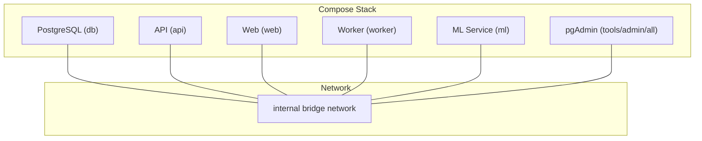
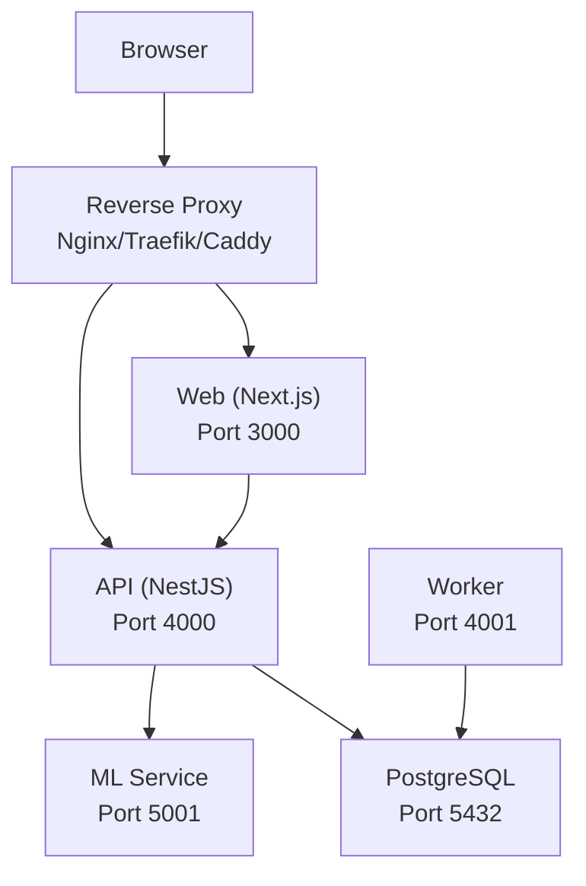
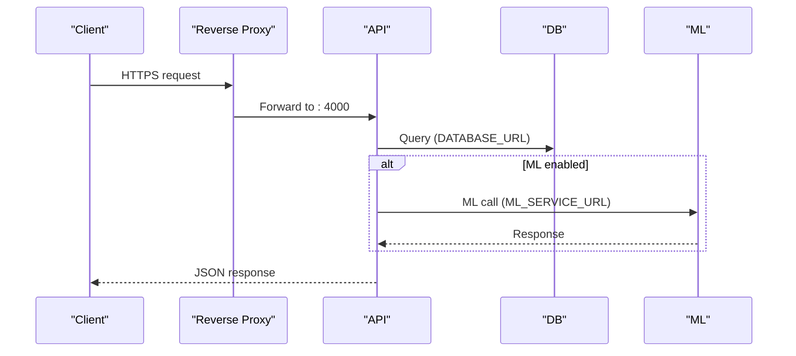
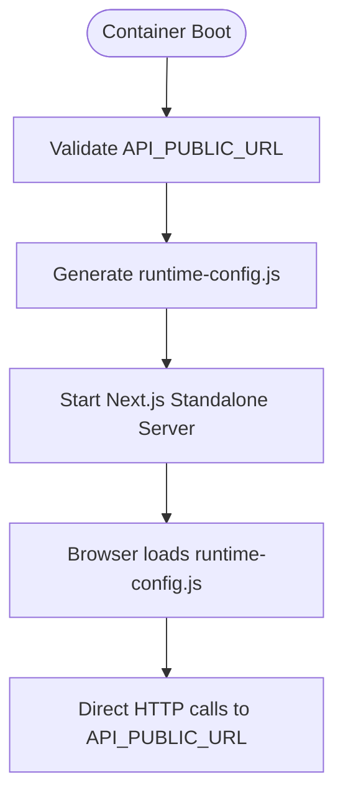
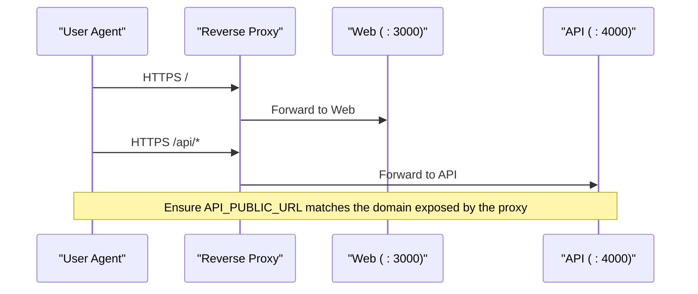
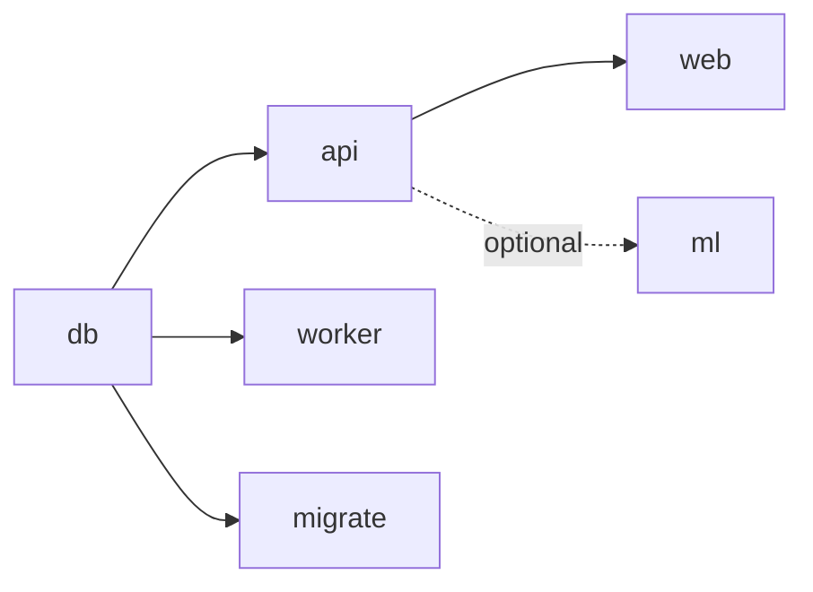

# Infrastructure Setup

<cite>
**Referenced Files in This Document**
- [compose.yml](file://compose.yml)
- [compose.local.yml](file://compose.local.yml)
- [compose.prod.yml](file://compose.prod.yml)
- [docker/README.md](file://docker/README.md)
- [docker/Dockerfile.api](file://docker/Dockerfile.api)
- [docker/Dockerfile.web](file://docker/Dockerfile.web)
- [docker/Dockerfile.worker](file://docker/Dockerfile.worker)
- [docker/Dockerfile.ml](file://docker/Dockerfile.ml)
- [apps/api/src/main.ts](file://apps/api/src/main.ts)
- [apps/api/src/app.module.ts](file://apps/api/src/app.module.ts)
- [apps/ml/app/config.py](file://apps/ml/app/config.py)
- [apps/web/next.config.mjs](file://apps/web/next.config.mjs)
- [packages/database/drizzle.config.ts](file://packages/database/drizzle.config.ts)
- [docs/ML_OPERATIONS.md](file://docs/ML_OPERATIONS.md)
</cite>

## Table of Contents
1. [Introduction](#introduction)
2. [Project Structure](#project-structure)
3. [Core Components](#core-components)
4. [Architecture Overview](#architecture-overview)
5. [Detailed Component Analysis](#detailed-component-analysis)
6. [Dependency Analysis](#dependency-analysis)
7. [Performance Considerations](#performance-considerations)
8. [Troubleshooting Guide](#troubleshooting-guide)
9. [Conclusion](#conclusion)
10. [Appendices](#appendices)

## Introduction
This document provides production-grade infrastructure setup guidance for Ananya ERP using Docker Compose. It explains the containerized architecture, service roles and interdependencies, environment configuration, networking, volumes, reverse proxy integration, SSL considerations, database deployment options, and resource allocation strategies. The goal is to enable reliable, secure, and scalable deployments with clear operational procedures.

## Project Structure
Ananya ships a base Compose stack that defines PostgreSQL, API, migration runner, background worker, web frontend, optional ML microservice, and pgAdmin tooling. Two overlays provide local build instructions and published image references. All application services are hardened multi-stage images built from repository Dockerfiles.

**Diagram sources**
- [compose.yml:18-205](file://compose.yml#L18-L205)

**Section sources**
- [compose.yml:1-205](file://compose.yml#L1-L205)
- [compose.local.yml:1-44](file://compose.local.yml#L1-L44)
- [compose.prod.yml:1-47](file://compose.prod.yml#L1-L47)
- [docker/README.md:5-16](file://docker/README.md#L5-L16)

## Core Components
- Database (db): PostgreSQL 16 Alpine with health checks and persistent volume.
- API (api): NestJS REST API exposing /health; connects to PostgreSQL and optionally to ML.
- Worker (worker): Background job processor with its own health endpoint.
- Web (web): Next.js standalone server serving the UI; communicates directly with the public API URL.
- ML (ml): Optional FastAPI microservice providing component intelligence features.
- pgAdmin (tools/admin/all): Optional admin interface for PostgreSQL.

Key runtime behaviors:
- API trusts upstream proxies for client IP resolution and configures CORS based on an environment variable.
- Web uses a runtime-generated configuration file at container boot to point browsers to the public API URL.
- ML service exposes a health endpoint and reads model paths from environment variables or defaults.

**Section sources**
- [compose.yml:19-173](file://compose.yml#L19-L173)
- [apps/api/src/main.ts:12-42](file://apps/api/src/main.ts#L12-L42)
- [docker/README.md:143-158](file://docker/README.md#L143-L158)
- [apps/ml/app/config.py:4-26](file://apps/ml/app/config.py#L4-L26)

## Architecture Overview
The recommended production topology places a reverse proxy outside the Compose stack. The browser accesses:
- https://erp.<domain> → Web service (port 3000)
- https://api.erp.<domain> → API service (port 4000)

Internal communication uses Docker DNS:
- API/Worker/Migrate → postgres:5432
- API → ml:5001 (when enabled)

**Diagram sources**
- [compose.yml:18-173](file://compose.yml#L18-L173)
- [docker/README.md:125-158](file://docker/README.md#L125-L158)

**Section sources**
- [docker/README.md:125-158](file://docker/README.md#L125-L158)

## Detailed Component Analysis

### Database (PostgreSQL)
- Image: postgres:16-alpine
- Health check: pg_isready
- Persistence: Named volume for data directory
- Networking: Internal bridge network only
- Environment: POSTGRES_DB, POSTGRES_USER, POSTGRES_PASSWORD

Operational notes:
- No host port mapping in base/production stacks; use compose.local.yml to expose locally if needed.
- Migrations run via a one-shot migrate service that depends on db being healthy.

**Section sources**
- [compose.yml:19-40](file://compose.yml#L19-L40)
- [compose.yml:74-87](file://compose.yml#L74-L87)
- [docker/README.md:160-166](file://docker/README.md#L160-L166)

### API Service
- Image: ghcr.io/48studios/ananya-api (prod overlay) or built from docker/Dockerfile.api
- Port: 4000
- Health: GET /health
- Dependencies: db (healthy), optional ml (healthy when profile includes ml)
- Environment: NODE_ENV, PORT, DATABASE_URL, CORS_ORIGIN, JWT_SECRET, ML_SERVICE_URL, ML_SERVICE_ENABLED
- Trusts upstream proxy for accurate client IP resolution
- Configures CORS from comma-separated origins

**Diagram sources**
- [compose.yml:41-72](file://compose.yml#L41-L72)
- [compose.prod.yml:23-28](file://compose.prod.yml#L23-L28)
- [apps/api/src/main.ts:12-42](file://apps/api/src/main.ts#L12-L42)

**Section sources**
- [compose.yml:41-72](file://compose.yml#L41-L72)
- [compose.prod.yml:23-28](file://compose.prod.yml#L23-L28)
- [apps/api/src/main.ts:12-42](file://apps/api/src/main.ts#L12-L42)
- [apps/api/src/app.module.ts:83-163](file://apps/api/src/app.module.ts#L83-L163)

### Worker Service
- Image: ghcr.io/48studios/ananya-worker (prod overlay) or built from docker/Dockerfile.worker
- Port: 4001
- Health: GET /health
- Dependencies: db (healthy)
- Environment: NODE_ENV, WORKER_PORT, DATABASE_URL, WORKER_CONCURRENCY

Use cases:
- Offload long-running tasks from the API process
- Scale independently from API and Web

**Section sources**
- [compose.yml:89-118](file://compose.yml#L89-L118)
- [compose.prod.yml:33-35](file://compose.prod.yml#L33-L35)

### Web Service
- Image: ghcr.io/48studios/ananya-web (prod overlay) or built from docker/Dockerfile.web
- Port: 3000
- Health: GET /api/health
- Dependencies: api (healthy)
- Environment: NODE_ENV, PORT, API_PUBLIC_URL

Runtime behavior:
- At container start, generates a runtime config file that sets the browser-facing API URL.
- Browsers communicate directly with API_PUBLIC_URL; no Next.js proxy rewrites are used.

**Diagram sources**
- [docker/README.md:143-152](file://docker/README.md#L143-L152)
- [compose.yml:120-148](file://compose.yml#L120-L148)

**Section sources**
- [compose.yml:120-148](file://compose.yml#L120-L148)
- [docker/README.md:143-152](file://docker/README.md#L143-L152)
- [apps/web/next.config.mjs:1-30](file://apps/web/next.config.mjs#L1-L30)

### ML Service
- Image: ghcr.io/48studios/ananya-ml (prod overlay) or built from docker/Dockerfile.ml
- Port: 5001
- Health: GET /health
- Profile: ml or all
- Environment: PORT, plus model-related paths and toggles

Behavior:
- CPU-first Python/FastAPI microservice
- Reads model paths from environment or defaults within the container
- API can call ML endpoints when ML_SERVICE_ENABLED is true

**Section sources**
- [compose.yml:150-173](file://compose.yml#L150-L173)
- [compose.prod.yml:44-46](file://compose.prod.yml#L44-L46)
- [docker/Dockerfile.ml:1-60](file://docker/Dockerfile.ml#L1-L60)
- [apps/ml/app/config.py:4-26](file://apps/ml/app/config.py#L4-L26)
- [docs/ML_OPERATIONS.md:14-39](file://docs/ML_OPERATIONS.md#L14-L39)

### Reverse Proxy Integration (Nginx/Traefik)
Recommended external reverse proxy responsibilities:
- Terminate TLS/SSL
- Route erp.<domain> to Web (port 3000)
- Route api.erp.<domain> to API (port 4000)
- Set appropriate headers for client IP forwarding

Important constraints:
- API_PUBLIC_URL must be a browser-reachable HTTPS URL
- Do not set API_PUBLIC_URL to Docker service names
- Containers communicate internally via Docker DNS only

**Diagram sources**
- [docker/README.md:125-158](file://docker/README.md#L125-L158)
- [compose.yml:120-148](file://compose.yml#L120-L148)

**Section sources**
- [docker/README.md:125-158](file://docker/README.md#L125-L158)

### SSL Certificate Management and HTTPS
- Terminate TLS at the reverse proxy layer (outside Compose).
- Use automated certificate management (e.g., ACME/Let’s Encrypt) supported by your chosen proxy.
- Ensure both erp.<domain> and api.erp.<domain> have valid certificates.
- Configure CORS_ORIGIN to include the Web origin(s) that will call the API.

[No sources needed since this section provides general guidance]

### Database Deployment Options
Base stack runs a single PostgreSQL instance. For high availability and clustering:
- Managed PostgreSQL: Use a managed provider with read replicas and automatic failover. Update DATABASE_URL accordingly.
- Clustering: Consider Patroni + etcd/Consul or cloud-native HA Postgres. Expose a stable connection endpoint and update DATABASE_URL.
- Connection pooling: Introduce PgBouncer in front of PostgreSQL for connection multiplexing and reduced overhead.
- Backups: Schedule logical backups and test restores regularly.

Operational notes:
- Migrations run explicitly before starting API/Worker/Web.
- Drizzle requires DATABASE_URL to be configured.

**Section sources**
- [compose.yml:19-40](file://compose.yml#L19-L40)
- [compose.yml:74-87](file://compose.yml#L74-L87)
- [packages/database/drizzle.config.ts:1-23](file://packages/database/drizzle.config.ts#L1-L23)
- [docker/README.md:28-37](file://docker/README.md#L28-L37)

### Environment Variables
Key variables and their roles:
- POSTGRES_DB, POSTGRES_USER, POSTGRES_PASSWORD: Database credentials and name
- DATABASE_URL: Constructed by Compose for API, Worker, and Migrate
- CORS_ORIGIN: Allowed origins for cross-origin requests
- JWT_SECRET: Secret for token signing
- ML_SERVICE_URL, ML_SERVICE_ENABLED: Enable/disable and address ML microservice
- API_PUBLIC_URL: Publicly reachable API URL for the browser
- NODE_ENV, PORT, WORKER_PORT, ML_PORT: Runtime ports and mode
- COMPOSE_PROFILES: Controls which profiles to start (all, worker, ml, tools)

Environment usage highlights:
- API reads CORS and trust proxy settings at bootstrap
- Web generates runtime config from API_PUBLIC_URL at startup
- ML reads model paths and feature toggles from environment

**Section sources**
- [compose.yml:23-53](file://compose.yml#L23-L53)
- [compose.yml:95-99](file://compose.yml#L95-L99)
- [compose.yml:125-131](file://compose.yml#L125-L131)
- [compose.yml:158-159](file://compose.yml#L158-L159)
- [apps/api/src/main.ts:12-42](file://apps/api/src/main.ts#L12-L42)
- [docker/README.md:143-152](file://docker/README.md#L143-L152)
- [apps/ml/app/config.py:4-26](file://apps/ml/app/config.py#L4-L26)

### Network Setup
- Single internal bridge network isolates containers from the host.
- Services communicate via Docker DNS (db, api, ml).
- Only Web and API are exposed to the host in local builds; production typically does not publish ports directly.

**Section sources**
- [compose.yml:196-205](file://compose.yml#L196-L205)
- [compose.local.yml:13-16](file://compose.local.yml#L13-L16)
- [docker/README.md:125-141](file://docker/README.md#L125-L141)

### Volume Management
- ananya_db: PostgreSQL data persistence
- ananya_app: Shared uploads between API and Worker
- ananya_dbadmin: pgAdmin data persistence

Best practices:
- Back up ananya_db regularly
- Mount external storage for uploads if scaling beyond single node
- Avoid storing ML artifacts in ephemeral containers unless backed by volumes

**Section sources**
- [compose.yml:27-28](file://compose.yml#L27-L28)
- [compose.yml:54-55](file://compose.yml#L54-L55)
- [compose.yml:100-101](file://compose.yml#L100-L101)
- [compose.yml:188-189](file://compose.yml#L188-L189)
- [compose.yml:196-199](file://compose.yml#L196-L199)

## Dependency Analysis
Service dependencies and startup order:
- db must be healthy before API, Worker, and pgAdmin start
- API depends on db; optionally waits for ml when profile includes ml
- Web depends on api
- Migrate runs once after db is ready

**Diagram sources**
- [compose.yml:58-60](file://compose.yml#L58-L60)
- [compose.yml:83-85](file://compose.yml#L83-L85)
- [compose.yml:104-106](file://compose.yml#L104-L106)
- [compose.yml:134-136](file://compose.yml#L134-L136)
- [compose.prod.yml:25-28](file://compose.prod.yml#L25-L28)

**Section sources**
- [compose.yml:58-60](file://compose.yml#L58-L60)
- [compose.yml:83-85](file://compose.yml#L83-L85)
- [compose.yml:104-106](file://compose.yml#L104-L106)
- [compose.yml:134-136](file://compose.yml#L134-L136)
- [compose.prod.yml:25-28](file://compose.prod.yml#L25-L28)

## Performance Considerations
Resource limits and CPU/memory constraints should be enforced at the orchestration layer (e.g., Docker Swarm, Kubernetes, or Docker Engine deploy configs). General recommendations:
- API: Moderate CPU and memory; ensure enough heap for concurrent requests
- Worker: Scale horizontally based on workload; tune WORKER_CONCURRENCY
- Web: Stateless; scale horizontally behind the reverse proxy
- ML: CPU-bound; allocate sufficient CPU and memory; consider separate nodes for heavy workloads
- PostgreSQL: Tune shared_buffers, work_mem, max_connections; use connection pooling (PgBouncer) under load

Health checks:
- API: /health
- Worker: /health
- Web: /api/health
- ML: /health
- DB: pg_isready

These probes help orchestrators restart unhealthy instances and gate dependent services.

[No sources needed since this section provides general guidance]

## Troubleshooting Guide
Common issues and diagnostics:
- API cannot connect to DB: Verify DATABASE_URL and db health; ensure migrations ran
- ML features unavailable: Check ML_SERVICE_ENABLED and ML_SERVICE_URL; confirm ml profile is active
- Web cannot reach API: Confirm API_PUBLIC_URL is correct and reachable from the browser
- CORS errors: Adjust CORS_ORIGIN to include the Web origin
- Client IP shows as proxy: Ensure trust proxy is enabled and reverse proxy forwards proper headers

Logs and health:
- Inspect container logs for each service
- Use health endpoints to validate readiness
- Use pgAdmin (tools/admin/all profile) to inspect database state

**Section sources**
- [compose.yml:31-39](file://compose.yml#L31-L39)
- [compose.yml:61-72](file://compose.yml#L61-L72)
- [compose.yml:107-118](file://compose.yml#L107-L118)
- [compose.yml:137-148](file://compose.yml#L137-L148)
- [compose.yml:162-173](file://compose.yml#L162-L173)
- [apps/api/src/main.ts:12-42](file://apps/api/src/main.ts#L12-L42)
- [docker/README.md:167-176](file://docker/README.md#L167-L176)

## Conclusion
Ananya ERP’s production stack centers around a small set of well-defined services orchestrated by Docker Compose. A reverse proxy terminates TLS and routes traffic to the Web and API. PostgreSQL persists data, while the Worker and optional ML service extend capabilities. Clear environment configuration, explicit migrations, and robust health checks form the foundation for reliable operations. Adopt connection pooling and managed databases for high availability, and enforce resource limits at your orchestration layer for predictable performance.

[No sources needed since this section summarizes without analyzing specific files]

## Appendices

### Production Runbook
- Prepare .env with required variables
- Pull images and start database
- Run migrations
- Start services with desired profiles
- Verify health endpoints
- Configure reverse proxy and SSL

**Section sources**
- [docker/README.md:55-77](file://docker/README.md#L55-L77)
- [docker/README.md:79-99](file://docker/README.md#L79-L99)

### Profiles Summary
- all: db, api, web, worker, ml
- worker: db, api, web, worker
- ml: db, api, web, ml
- tools/admin/all: adds pgAdmin

**Section sources**
- [docker/README.md:79-90](file://docker/README.md#L79-L90)