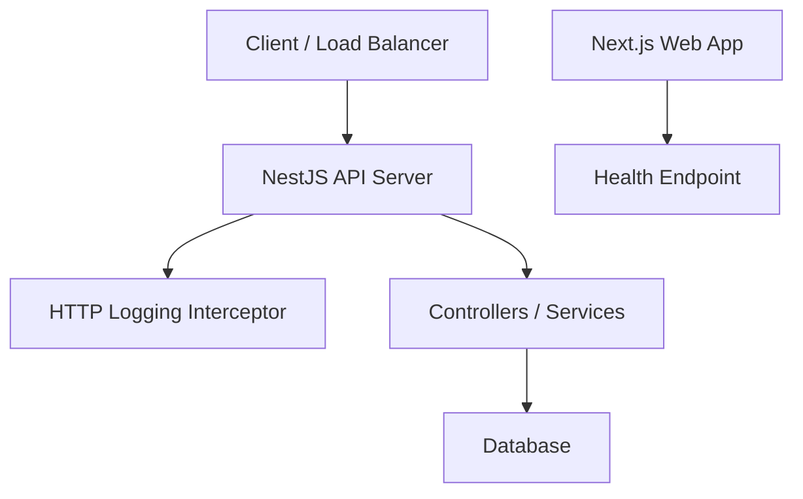
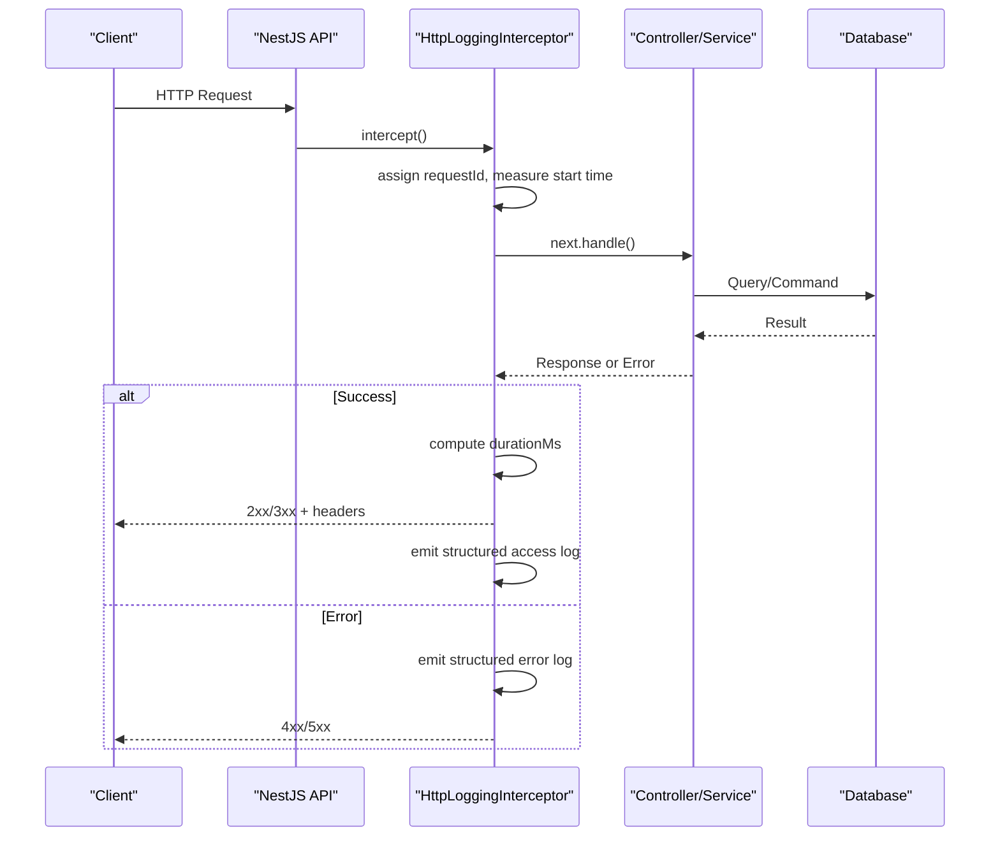
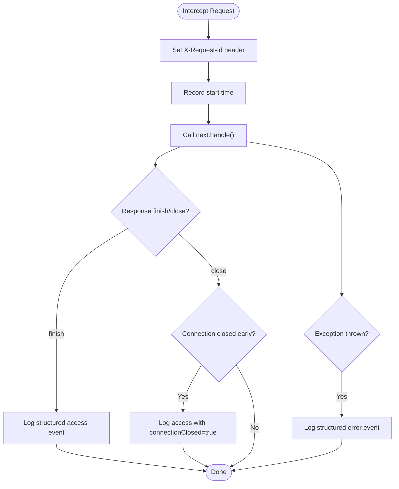
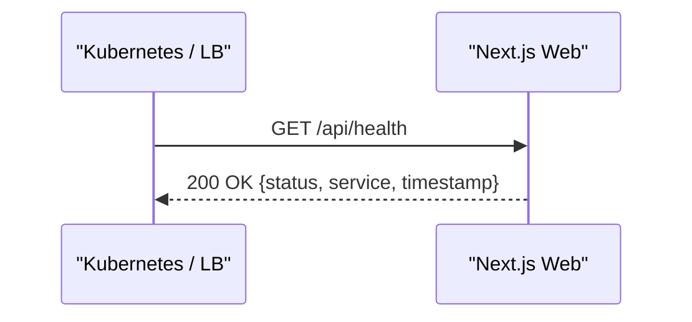
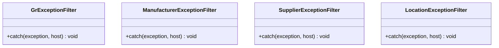
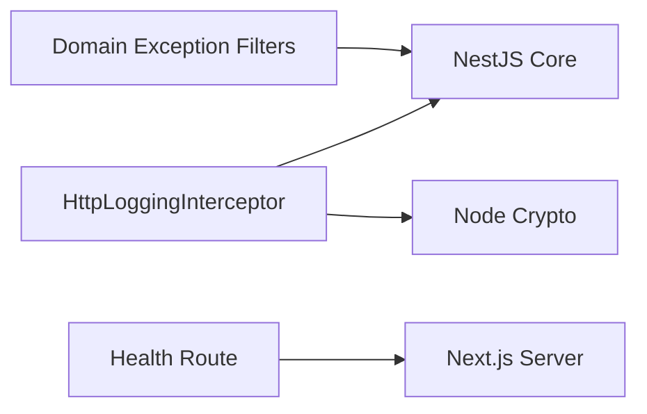

# Monitoring & Logging

<cite>
**Referenced Files in This Document**
- [http-logging.interceptor.ts](file://apps/api/src/common/logging/http-logging.interceptor.ts)
- [route.ts](file://apps/web/app/api/health/route.ts)
- [app.module.ts](file://apps/api/src/app.module.ts)
- [main.ts](file://apps/api/src/main.ts)
- [database.constants.ts](file://apps/api/src/database/database.constants.ts)
- [gr-exception.filter.ts](file://apps/api/src/goods-receipts/gr-exception.filter.ts)
- [manufacturer-exception.filter.ts](file://apps/api/src/manufacturers/manufacturer-exception.filter.ts)
- [supplier-exception.filter.ts](file://apps/api/src/suppliers/supplier-exception.filter.ts)
- [location-exception.filter.ts](file://apps/api/src/locations/location-exception.filter.ts)
</cite>

## Table of Contents
1. [Introduction](#introduction)
2. [Project Structure](#project-structure)
3. [Core Components](#core-components)
4. [Architecture Overview](#architecture-overview)
5. [Detailed Component Analysis](#detailed-component-analysis)
6. [Dependency Analysis](#dependency-analysis)
7. [Performance Considerations](#performance-considerations)
8. [Troubleshooting Guide](#troubleshooting-guide)
9. [Conclusion](#conclusion)
10. [Appendices](#appendices)

## Introduction
This document provides production-grade monitoring and logging guidance for Ananya ERP deployments. It focuses on:
- Application performance monitoring via structured HTTP access logs and error logs
- Health check endpoints for service readiness and liveness probes
- Centralized logging strategies, log aggregation, and structured formats
- Error tracking, exception handling, and debugging aids
- System metrics collection, resource utilization monitoring, and alerting configuration
- Database performance monitoring, query optimization insights, and capacity planning
- Log rotation, retention policies, and compliance requirements for audit trails

The content is grounded in the repository’s API and Web services, with concrete references to implementation files.

## Project Structure
Ananya ERP exposes a NestJS-based API and a Next.js Web application. Monitoring and logging are implemented at the API layer through an HTTP interceptor that emits structured JSON logs for requests and errors. The Web app exposes a minimal health endpoint suitable for container orchestration probes.

**Diagram sources**
- [http-logging.interceptor.ts:22-74](file://apps/api/src/common/logging/http-logging.interceptor.ts#L22-L74)
- [route.ts:3-12](file://apps/web/app/api/health/route.ts#L3-L12)

**Section sources**
- [http-logging.interceptor.ts:22-74](file://apps/api/src/common/logging/http-logging.interceptor.ts#L22-L74)
- [route.ts:3-12](file://apps/web/app/api/health/route.ts#L3-L12)

## Core Components
- HTTP Access and Error Logging: A NestJS interceptor captures request lifecycle events, computes duration, assigns a stable request ID, and emits structured JSON logs for both successful responses and errors.
- Health Check Endpoint: A Next.js route returns a simple status payload for liveness/readiness checks.
- Exception Filters: Domain-specific filters normalize business exceptions into consistent HTTP error responses, aiding observability and debugging.
- Database Configuration Constants: Provide identifiers for database connections and pools used by infrastructure components.

Key responsibilities:
- Structured logging format enables centralized aggregation and analysis.
- Request correlation via X-Request-Id simplifies tracing across services.
- Health endpoint supports automated health probing.
- Consistent error shapes improve downstream tooling (e.g., error tracking systems).

**Section sources**
- [http-logging.interceptor.ts:22-74](file://apps/api/src/common/logging/http-logging.interceptor.ts#L22-L74)
- [route.ts:3-12](file://apps/web/app/api/health/route.ts#L3-L12)
- [gr-exception.filter.ts:21-47](file://apps/api/src/goods-receipts/gr-exception.filter.ts#L21-L47)
- [manufacturer-exception.filter.ts:23-53](file://apps/api/src/manufacturers/manufacturer-exception.filter.ts#L23-L53)
- [supplier-exception.filter.ts:23-51](file://apps/api/src/suppliers/supplier-exception.filter.ts#L23-L51)
- [location-exception.filter.ts:60-78](file://apps/api/src/locations/location-exception.filter.ts#L60-L78)
- [database.constants.ts:1-2](file://apps/api/src/database/database.constants.ts#L1-L2)

## Architecture Overview
The API uses a global logging interceptor to standardize request/response telemetry. Exceptions are normalized by domain-specific filters. The Web app exposes a lightweight health endpoint.

**Diagram sources**
- [http-logging.interceptor.ts:30-74](file://apps/api/src/common/logging/http-logging.interceptor.ts#L30-L74)

## Detailed Component Analysis

### HTTP Logging Interceptor
- Purpose: Emit structured access and error logs for every HTTP request, including method, route, status code, duration, client IP, user agent, and connection state.
- Request Correlation: Assigns or forwards X-Request-Id to enable cross-service tracing.
- Performance Metrics: Computes durationMs using high-resolution timers.
- Error Handling: Captures exceptions, extracts name/message/stack/status, and logs them with context.
- Configurability: Access and error logging can be toggled via environment variables.

**Diagram sources**
- [http-logging.interceptor.ts:30-74](file://apps/api/src/common/logging/http-logging.interceptor.ts#L30-L74)
- [http-logging.interceptor.ts:76-149](file://apps/api/src/common/logging/http-logging.interceptor.ts#L76-L149)

Operational notes:
- Ensure the interceptor is registered globally so all routes are logged consistently.
- Use the emitted structured logs for ingestion into your log aggregator.
- Propagate X-Request-Id upstream from gateways/proxies to correlate traces.

**Section sources**
- [http-logging.interceptor.ts:22-149](file://apps/api/src/common/logging/http-logging.interceptor.ts#L22-L149)

### Health Check Endpoint (Web)
- Purpose: Provide a simple GET endpoint returning a status payload for liveness/readiness probes.
- Output: Returns a JSON object indicating service identity and timestamp.

**Diagram sources**
- [route.ts:3-12](file://apps/web/app/api/health/route.ts#L3-L12)

Operational notes:
- Configure orchestrators to probe this endpoint periodically.
- Extend the endpoint to include dependency checks (e.g., database connectivity) if needed.

**Section sources**
- [route.ts:3-12](file://apps/web/app/api/health/route.ts#L3-L12)

### Exception Filters (API)
- Purpose: Normalize domain exceptions into consistent HTTP error responses with standardized fields.
- Examples: Goods receipts, manufacturers, suppliers, locations.

**Diagram sources**
- [gr-exception.filter.ts:21-47](file://apps/api/src/goods-receipts/gr-exception.filter.ts#L21-L47)
- [manufacturer-exception.filter.ts:23-53](file://apps/api/src/manufacturers/manufacturer-exception.filter.ts#L23-L53)
- [supplier-exception.filter.ts:23-51](file://apps/api/src/suppliers/supplier-exception.filter.ts#L23-L51)
- [location-exception.filter.ts:60-78](file://apps/api/src/locations/location-exception.filter.ts#L60-L78)

Operational notes:
- These filters ensure consistent error payloads consumed by clients and error tracking tools.
- Combine with the HTTP logging interceptor to capture correlated error events.

**Section sources**
- [gr-exception.filter.ts:21-47](file://apps/api/src/goods-receipts/gr-exception.filter.ts#L21-L47)
- [manufacturer-exception.filter.ts:23-53](file://apps/api/src/manufacturers/manufacturer-exception.filter.ts#L23-L53)
- [supplier-exception.filter.ts:23-51](file://apps/api/src/suppliers/supplier-exception.filter.ts#L23-L51)
- [location-exception.filter.ts:60-78](file://apps/api/src/locations/location-exception.filter.ts#L60-L78)

### Application Bootstrap and Module Registration
- Global registration of middleware/interceptors/filters should occur during application bootstrap and module configuration to ensure consistent behavior across all routes.

**Section sources**
- [main.ts](file://apps/api/src/main.ts)
- [app.module.ts](file://apps/api/src/app.module.ts)

### Database Infrastructure Constants
- Provides identifiers for database connection and pool tokens used by infrastructure wiring.

**Section sources**
- [database.constants.ts:1-2](file://apps/api/src/database/database.constants.ts#L1-L2)

## Dependency Analysis
- Coupling: The logging interceptor depends on NestJS core primitives and Node utilities; it is decoupled from domain logic, promoting reuse across controllers/services.
- Cohesion: Each exception filter encapsulates mapping for a specific domain, improving maintainability.
- External Dependencies:
  - NestJS Logger and Interceptor framework
  - Express Request/Response types
  - Node crypto for UUID generation
  - Next.js server response helpers for health endpoint

**Diagram sources**
- [http-logging.interceptor.ts:1-11](file://apps/api/src/common/logging/http-logging.interceptor.ts#L1-L11)
- [route.ts:1-2](file://apps/web/app/api/health/route.ts#L1-L2)

**Section sources**
- [http-logging.interceptor.ts:1-11](file://apps/api/src/common/logging/http-logging.interceptor.ts#L1-L11)
- [route.ts:1-2](file://apps/web/app/api/health/route.ts#L1-L2)

## Performance Considerations
- Structured Logging Overhead: The interceptor serializes logs to JSON per request. In high-throughput environments, ensure efficient log sinks and consider sampling for non-critical paths.
- Duration Measurement: Uses high-resolution timers; avoid heavy synchronous work in interceptors to keep overhead minimal.
- Connection Close Events: Logs early disconnects to detect network issues or client aborts.
- Health Checks: Keep endpoints lightweight to avoid false negatives under load.

[No sources needed since this section provides general guidance]

## Troubleshooting Guide
- Missing or inconsistent logs:
  - Verify the interceptor is registered globally and not bypassed by custom routing.
  - Confirm environment flags for enabling access/error logging are set appropriately.
- High error rates:
  - Inspect structured error logs for stack traces and status codes.
  - Cross-reference with X-Request-Id to trace the full request path.
- Health check failures:
  - Validate the health endpoint responds with expected status and payload.
  - If extended, ensure dependencies (e.g., database) are healthy before marking service ready.
- Database issues:
  - Use connection/pool identifiers to correlate logs with infrastructure metrics.
  - Monitor slow queries and connection saturation via external metrics collectors.

**Section sources**
- [http-logging.interceptor.ts:25-28](file://apps/api/src/common/logging/http-logging.interceptor.ts#L25-L28)
- [http-logging.interceptor.ts:76-149](file://apps/api/src/common/logging/http-logging.interceptor.ts#L76-L149)
- [route.ts:3-12](file://apps/web/app/api/health/route.ts#L3-L12)
- [database.constants.ts:1-2](file://apps/api/src/database/database.constants.ts#L1-L2)

## Conclusion
Ananya ERP implements robust, structured HTTP logging and a basic health endpoint suitable for production monitoring. The interceptor provides essential telemetry for performance and error analysis, while exception filters standardize error responses. For comprehensive observability, integrate these outputs with a centralized logging pipeline, metrics collector, and alerting system. Extend health checks to include dependency probes and add database-level metrics to complete the monitoring strategy.

[No sources needed since this section summarizes without analyzing specific files]

## Appendices

### Centralized Logging Strategy
- Collect structured logs emitted by the interceptor into a centralized system (e.g., Elasticsearch, Loki, cloud logging).
- Parse JSON logs to extract fields such as event, requestId, method, route, statusCode, durationMs, ip, userAgent, errorName, errorMessage, stack.
- Enable correlation across services by propagating X-Request-Id.

[No sources needed since this section provides general guidance]

### Log Aggregation and Retention
- Define retention policies based on compliance needs (e.g., 90 days for operational logs, longer for audit).
- Implement log rotation at the platform level (container stdout/stderr or sidecar agents).
- Apply indexing strategies for fast querying of key fields (requestId, route, statusCode).

[No sources needed since this section provides general guidance]

### Structured Logging Format
- Access logs include: event, requestId, method, route, statusCode, durationMs, ip, userAgent, connectionClosed.
- Error logs include: event, requestId, method, route, statusCode, durationMs, errorName, errorMessage, stack.

**Section sources**
- [http-logging.interceptor.ts:44-58](file://apps/api/src/common/logging/http-logging.interceptor.ts#L44-L58)
- [http-logging.interceptor.ts:85-98](file://apps/api/src/common/logging/http-logging.interceptor.ts#L85-L98)

### Error Tracking and Debugging
- Use errorName, errorMessage, and stack to feed into error tracking platforms.
- Leverage X-Request-Id to correlate logs across services and layers.
- Combine with exception filters to ensure consistent error payloads.

**Section sources**
- [http-logging.interceptor.ts:85-98](file://apps/api/src/common/logging/http-logging.interceptor.ts#L85-L98)
- [gr-exception.filter.ts:21-47](file://apps/api/src/goods-receipts/gr-exception.filter.ts#L21-L47)
- [manufacturer-exception.filter.ts:23-53](file://apps/api/src/manufacturers/manufacturer-exception.filter.ts#L23-L53)
- [supplier-exception.filter.ts:23-51](file://apps/api/src/suppliers/supplier-exception.filter.ts#L23-L51)
- [location-exception.filter.ts:60-78](file://apps/api/src/locations/location-exception.filter.ts#L60-L78)

### System Metrics and Alerting
- Expose Prometheus-compatible metrics for:
  - Request rate, latency percentiles, error rates
  - Health check success/failure
  - Resource utilization (CPU, memory, GC) via runtime exporters
- Configure alerts for:
  - Elevated error rates (e.g., 5xx spikes)
  - Latency thresholds (p95/p99)
  - Health check failures
  - Database connection pool saturation

[No sources needed since this section provides general guidance]

### Database Performance Monitoring
- Track query execution times, connection pool usage, and lock contention.
- Identify slow queries and optimize indexes or queries.
- Use capacity planning metrics (throughput, latency, resource usage) to forecast scaling needs.

[No sources needed since this section provides general guidance]

### Compliance and Audit Trails
- Retain logs according to regulatory requirements.
- Ensure sensitive data is redacted in logs.
- Maintain immutable storage for audit logs and enforce access controls.

[No sources needed since this section provides general guidance]