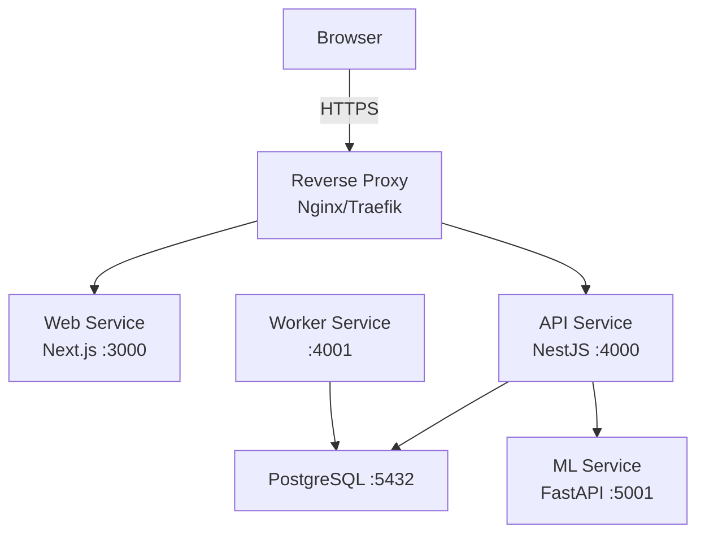
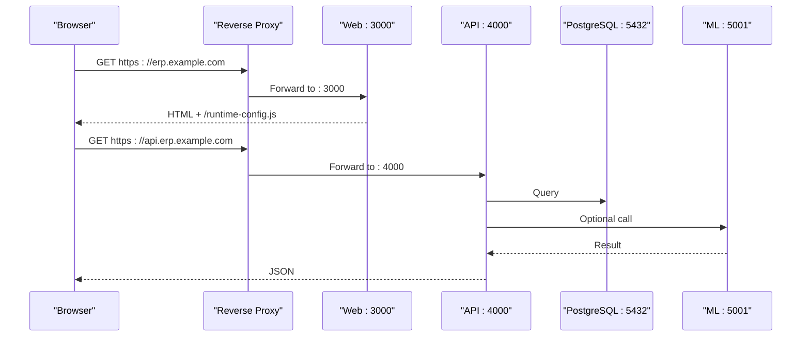
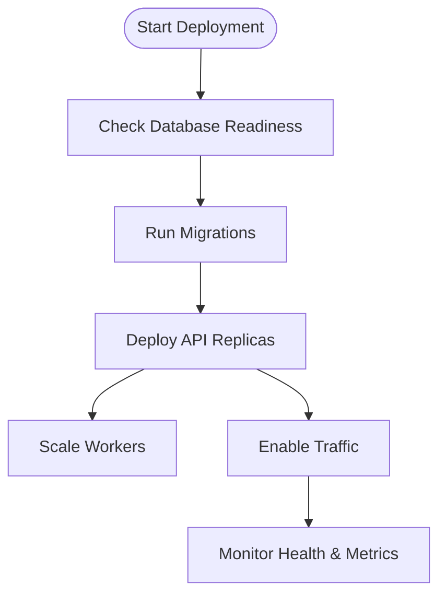
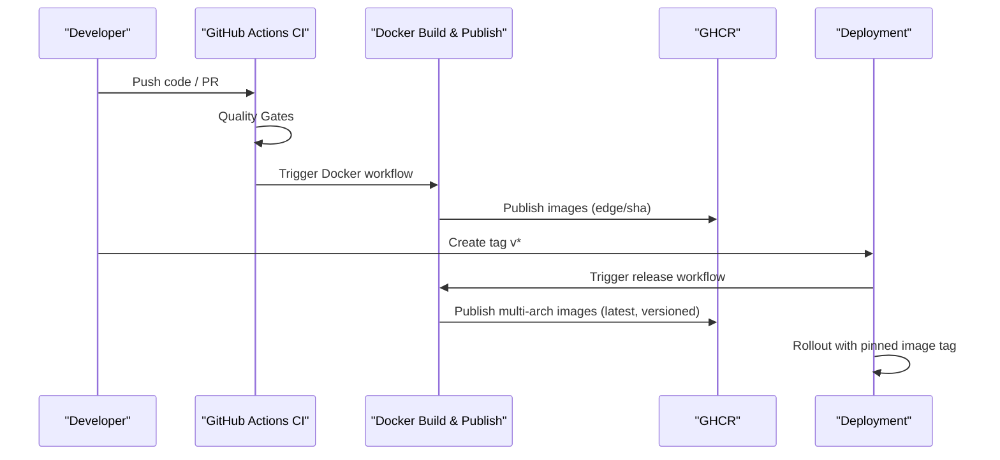
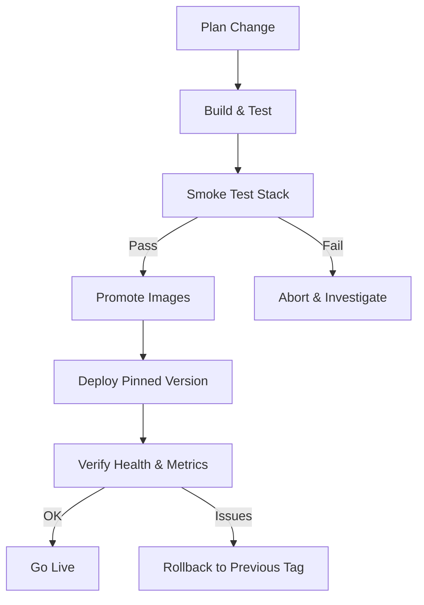
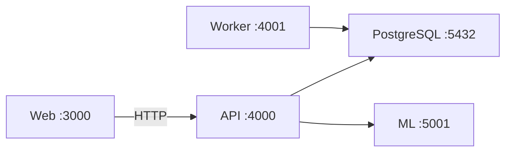

# Production Deployment

<cite>
**Referenced Files in This Document**
- [compose.yml](file://compose.yml)
- [compose.local.yml](file://compose.local.yml)
- [compose.prod.yml](file://compose.prod.yml)
- [docker/README.md](file://docker/README.md)
- [docker/Dockerfile.api](file://docker/Dockerfile.api)
- [docker/Dockerfile.web](file://docker/Dockerfile.web)
- [docker/Dockerfile.worker](file://docker/Dockerfile.worker)
- [docker/Dockerfile.ml](file://docker/Dockerfile.ml)
- [.github/workflows/docker.yml](file://.github/workflows/docker.yml)
- [.github/workflows/release.yml](file://.github/workflows/release.yml)
- [apps/api/package.json](file://apps/api/package.json)
- [apps/web/package.json](file://apps/web/package.json)
- [apps/ml/pyproject.toml](file://apps/ml/pyproject.toml)
- [packages/database/src/index.ts](file://packages/database/src/index.ts)
</cite>

## Table of Contents
1. [Introduction](#introduction)
2. [Project Structure](#project-structure)
3. [Core Components](#core-components)
4. [Architecture Overview](#architecture-overview)
5. [Detailed Component Analysis](#detailed-component-analysis)
6. [Dependency Analysis](#dependency-analysis)
7. [Performance Considerations](#performance-considerations)
8. [Troubleshooting Guide](#troubleshooting-guide)
9. [Conclusion](#conclusion)
10. [Appendices](#appendices)

## Introduction
This document provides production deployment guidance for Ananya ERP, focusing on enterprise-grade operations: reverse proxy configuration, HTTPS and SSL, load balancing, database high availability, CI/CD automation, rollback strategies, security hardening, scaling, and operational checklists. It is based on the repository’s Compose stack, Docker images, health checks, and GitHub Actions workflows.

## Project Structure
Ananya ships a containerized platform with four primary services:
- Web: Next.js standalone application served on port 3000.
- API: NestJS REST API on port 4000.
- Worker: Background worker process on port 4001.
- ML: Python FastAPI microservice on port 5001.

The base Compose file defines shared infrastructure (PostgreSQL, internal network, volumes), while local and production overrides provide build or image directives. The Docker guide documents required deployment order, profiles, networking, and health endpoints.

**Diagram sources**
- [compose.yml:18-173](file://compose.yml#L18-L173)
- [docker/README.md:125-158](file://docker/README.md#L125-L158)

**Section sources**
- [compose.yml:1-205](file://compose.yml#L1-L205)
- [docker/README.md:1-176](file://docker/README.md#L1-L176)

## Core Components
- PostgreSQL: Managed by the `db` service; data persisted via named volume.
- API: Health endpoint at `/health`; uses environment variables for database, CORS, JWT, and optional ML integration.
- Worker: Background jobs with its own health endpoint at `/health`.
- Web: Standalone Next.js app; browser communicates directly with the public API URL.
- ML: Optional CPU-first microservice; API waits for it when enabled.

Key runtime characteristics:
- Non-root containers with fixed UID/GID 10001.
- Health probes defined for all services.
- Profiles control which services start (`all`, `worker`, `ml`, `tools`).

**Section sources**
- [compose.yml:18-173](file://compose.yml#L18-L173)
- [docker/Dockerfile.api:64-92](file://docker/Dockerfile.api#L64-L92)
- [docker/Dockerfile.web:60-88](file://docker/Dockerfile.web#L60-L88)
- [docker/Dockerfile.worker:65-91](file://docker/Dockerfile.worker#L65-L91)
- [docker/Dockerfile.ml:22-59](file://docker/Dockerfile.ml#L22-L59)

## Architecture Overview
The recommended production topology places a reverse proxy outside the Compose stack. The web client loads a runtime config that points to a public API URL; there is no Next.js proxy rewrite for API calls.

**Diagram sources**
- [docker/README.md:125-158](file://docker/README.md#L125-L158)
- [compose.yml:41-72](file://compose.yml#L41-L72)
- [compose.yml:120-148](file://compose.yml#L120-L148)

## Detailed Component Analysis

### Reverse Proxy Configuration (Nginx/Traefik)
- Expose only ports 80/443 externally; do not publish database or internal service ports.
- Route:
  - `https://erp.example.com` → Web container port 3000.
  - `https://api.erp.example.com` → API container port 4000.
- TLS termination at the reverse proxy; ensure correct certificate management and renewal.
- Set `CORS_ORIGIN` to the exact browser origin(s).
- Ensure `API_PUBLIC_URL` matches the public API domain used by the browser.

Operational notes:
- Do not set `API_PUBLIC_URL` to Docker service names; it must be browser-reachable.
- Keep WebSocket upgrades if needed by your UI patterns.
- Use connection timeouts and request size limits appropriate for ERP workloads.

**Section sources**
- [docker/README.md:125-158](file://docker/README.md#L125-L158)
- [compose.yml:46-52](file://compose.yml#L46-L52)
- [compose.yml:125-131](file://compose.yml#L125-L131)

### HTTPS Setup with SSL Certificates
- Terminate TLS at the reverse proxy using managed certificates (e.g., ACME/Let’s Encrypt).
- Enforce HTTPS-only traffic and HSTS where appropriate.
- Rotate secrets such as `JWT_SECRET` through a secure secret store.
- Validate certificate chain and expiration monitoring.

**Section sources**
- [docker/README.md:55-68](file://docker/README.md#L55-L68)
- [compose.yml:46-52](file://compose.yml#L46-L52)

### Load Balancing Considerations
- Scale stateless services horizontally:
  - Web: multiple replicas behind the reverse proxy.
  - API: multiple replicas behind the reverse proxy.
  - Worker: scale out workers according to job throughput.
- Externalize uploads and shared artifacts to persistent storage if running multiple instances.
- Sticky sessions are generally unnecessary if session state is externalized; otherwise configure sticky sessions at the proxy layer.
- Use readiness/liveness probes from the reverse proxy or orchestrator.

**Section sources**
- [compose.yml:41-72](file://compose.yml#L41-L72)
- [compose.yml:89-118](file://compose.yml#L89-L118)
- [compose.yml:120-148](file://compose.yml#L120-L148)

### Database Deployment Options
- Single-node PostgreSQL: suitable for small deployments; use the provided `db` service.
- High availability:
  - Use a managed PostgreSQL service with built-in HA and automated failover.
  - Or deploy a clustered solution (e.g., Patroni + etcd/Consul) with streaming replication.
- Connection pooling:
  - Introduce PgBouncer or Pgpool-II in front of PostgreSQL.
  - Tune pool sizes per API replica to avoid exhausting connections.
- Migrations:
  - Run migrations before starting new API versions.
  - Ensure backward-compatible schema changes or use migration strategies that support rolling updates.

**Diagram sources**
- [compose.yml:19-40](file://compose.yml#L19-L40)
- [compose.yml:74-87](file://compose.yml#L74-L87)
- [compose.yml:41-72](file://compose.yml#L41-L72)

**Section sources**
- [compose.yml:19-40](file://compose.yml#L19-L40)
- [compose.yml:74-87](file://compose.yml#L74-L87)
- [packages/database/src/index.ts:1-60](file://packages/database/src/index.ts#L1-L60)

### CI/CD Pipeline Integration
- Continuous Integration:
  - Quality gates run first.
  - A smoke test validates the production stack with Compose profiles.
- Container Build & Publish:
  - On successful CI on `main`, images are built and published to GHCR with edge and SHA tags.
- Release Pipeline:
  - Tag pushes trigger multi-architecture builds and release tagging logic.
  - Creates GitHub Releases with generated notes.

**Diagram sources**
- [.github/workflows/docker.yml:1-109](file://.github/workflows/docker.yml#L1-L109)
- [.github/workflows/release.yml:1-168](file://.github/workflows/release.yml#L1-L168)

**Section sources**
- [.github/workflows/docker.yml:1-109](file://.github/workflows/docker.yml#L1-L109)
- [.github/workflows/release.yml:1-168](file://.github/workflows/release.yml#L1-L168)

### Automated Deployments and Rollback Strategies
- Image pinning:
  - Pin `ANANYA_VERSION` to an exact tag for production.
- Deployment sequence:
  - Pull images, run migrations, then update services.
- Rollback:
  - Revert to the previous pinned image tag and re-run services.
  - Ensure migrations are backward compatible or have rollback procedures.

**Diagram sources**
- [compose.prod.yml:1-47](file://compose.prod.yml#L1-L47)
- [docker/README.md:91-123](file://docker/README.md#L91-L123)

**Section sources**
- [compose.prod.yml:1-47](file://compose.prod.yml#L1-L47)
- [docker/README.md:91-123](file://docker/README.md#L91-L123)

### Security Hardening
- Containers:
  - All images run as non-root user with fixed UID/GID.
  - Minimal base images and pruned dependencies reduce attack surface.
- Secrets:
  - Store `JWT_SECRET`, database credentials, and other secrets in a vault or orchestrator secret store.
- Network:
  - Restrict access to internal networks; expose only reverse proxy ports.
  - Use private registries and signed images.
- Application:
  - Configure strict `CORS_ORIGIN`.
  - Enable audit logging and review security settings.

**Section sources**
- [docker/Dockerfile.api:64-92](file://docker/Dockerfile.api#L64-L92)
- [docker/Dockerfile.web:60-88](file://docker/Dockerfile.web#L60-L88)
- [docker/Dockerfile.worker:65-91](file://docker/Dockerfile.worker#L65-L91)
- [docker/Dockerfile.ml:22-59](file://docker/Dockerfile.ml#L22-L59)
- [compose.yml:46-52](file://compose.yml#L46-L52)

### Firewall Configuration and Network Segmentation
- Host firewall:
  - Allow inbound TCP 80/443 to the reverse proxy.
  - Block direct access to ports 3000, 4000, 4001, 5001, and 5432 from the internet.
- Internal segmentation:
  - Place API, Worker, ML, and PostgreSQL on an isolated network.
  - Only the reverse proxy should be reachable from the public internet.
- Cloud/network policies:
  - Use VPC/private subnets for databases and caches.
  - Restrict egress to necessary endpoints (registry, package repositories).

**Section sources**
- [compose.yml:196-205](file://compose.yml#L196-L205)
- [docker/README.md:125-158](file://docker/README.md#L125-L158)

### Scaling Considerations
- Horizontal scaling:
  - Scale Web and API replicas behind the reverse proxy.
  - Scale Worker processes based on queue depth and concurrency settings.
- Vertical scaling:
  - Increase CPU/memory for API and Worker nodes under heavy load.
  - Size PostgreSQL instance appropriately; consider dedicated IOPS.
- Capacity planning:
  - Monitor CPU, memory, disk I/O, and database connections.
  - Right-size connection pools and worker concurrency.

**Section sources**
- [compose.yml:41-72](file://compose.yml#L41-L72)
- [compose.yml:89-118](file://compose.yml#L89-L118)
- [apps/api/package.json:8-19](file://apps/api/package.json#L8-L19)
- [apps/web/package.json:7-13](file://apps/web/package.json#L7-L13)
- [apps/ml/pyproject.toml:1-26](file://apps/ml/pyproject.toml#L1-L26)

## Dependency Analysis
The platform consists of four main services orchestrated by Compose, with PostgreSQL as the data store. The API optionally integrates with the ML service. The web client communicates directly with the public API URL.

**Diagram sources**
- [compose.yml:41-72](file://compose.yml#L41-L72)
- [compose.yml:89-118](file://compose.yml#L89-L118)
- [compose.yml:120-148](file://compose.yml#L120-L148)
- [compose.yml:150-173](file://compose.yml#L150-L173)

**Section sources**
- [compose.yml:18-173](file://compose.yml#L18-L173)

## Performance Considerations
- Reverse proxy tuning:
  - Adjust keepalive, timeouts, buffer sizes, and gzip/brotli compression.
- API performance:
  - Tune Node.js flags and worker concurrency.
  - Use connection pooling for database access.
- Web performance:
  - Leverage CDN for static assets.
  - Enable HTTP/2 and caching headers.
- Database performance:
  - Tune shared buffers, WAL settings, and autovacuum.
  - Use read replicas for reporting queries if needed.

[No sources needed since this section provides general guidance]

## Troubleshooting Guide
Common issues and resolutions:
- API unavailable:
  - Check API logs, database connectivity, `JWT_SECRET`, and `CORS_ORIGIN`.
- Web cannot reach API:
  - Verify `API_PUBLIC_URL` is browser-reachable and correctly set.
- Worker not processing jobs:
  - Confirm worker health endpoint responds and database connectivity is stable.
- ML features degraded:
  - Ensure ML service is healthy; API gracefully falls back when disabled.

Health endpoints:
- Web: `/api/health`
- API: `/health`
- Worker: `/health`
- ML: `/health`
- PostgreSQL: `pg_isready`

**Section sources**
- [docker/README.md:167-176](file://docker/README.md#L167-L176)
- [compose.yml:61-72](file://compose.yml#L61-L72)
- [compose.yml:107-118](file://compose.yml#L107-L118)
- [compose.yml:137-148](file://compose.yml#L137-L148)
- [compose.yml:162-173](file://compose.yml#L162-L173)

## Conclusion
Ananya ERP’s production deployment relies on a clear separation between the reverse proxy and internal services, explicit migration steps, and pinned container images. By following the outlined configurations for reverse proxies, TLS, load balancing, database HA, CI/CD automation, and security hardening, teams can operate a resilient and scalable ERP platform.

[No sources needed since this section summarizes without analyzing specific files]

## Appendices

### Step-by-Step Deployment Checklist
- Pre-deployment
  - Define domains for web and API.
  - Prepare TLS certificates and DNS records.
  - Generate strong secrets (`JWT_SECRET`, database credentials).
  - Decide on database strategy (managed HA or self-managed cluster).
- Build and validate
  - Run quality gates and smoke tests.
  - Verify health endpoints for all services.
- Database
  - Provision database and backups.
  - Run migrations against the target schema.
- Services
  - Deploy API and Worker replicas.
  - Deploy Web replicas.
  - Optionally enable ML service.
- Post-deployment
  - Validate end-to-end flows.
  - Monitor metrics, logs, and error rates.
  - Establish alerting and runbooks.

**Section sources**
- [docker/README.md:28-36](file://docker/README.md#L28-L36)
- [docker/README.md:55-77](file://docker/README.md#L55-L77)
- [docker/README.md:91-123](file://docker/README.md#L91-L123)

### Common Production Pitfalls
- Setting `API_PUBLIC_URL` to internal Docker names instead of a browser-reachable URL.
- Forgetting to run migrations before deploying new API versions.
- Leaving development ports exposed to the internet.
- Using wildcard or overly permissive `CORS_ORIGIN`.
- Not pinning image tags in production.
- Overloading a single PostgreSQL instance without connection pooling.

**Section sources**
- [docker/README.md:125-158](file://docker/README.md#L125-L158)
- [compose.yml:46-52](file://compose.yml#L46-L52)
- [compose.yml:125-131](file://compose.yml#L125-L131)