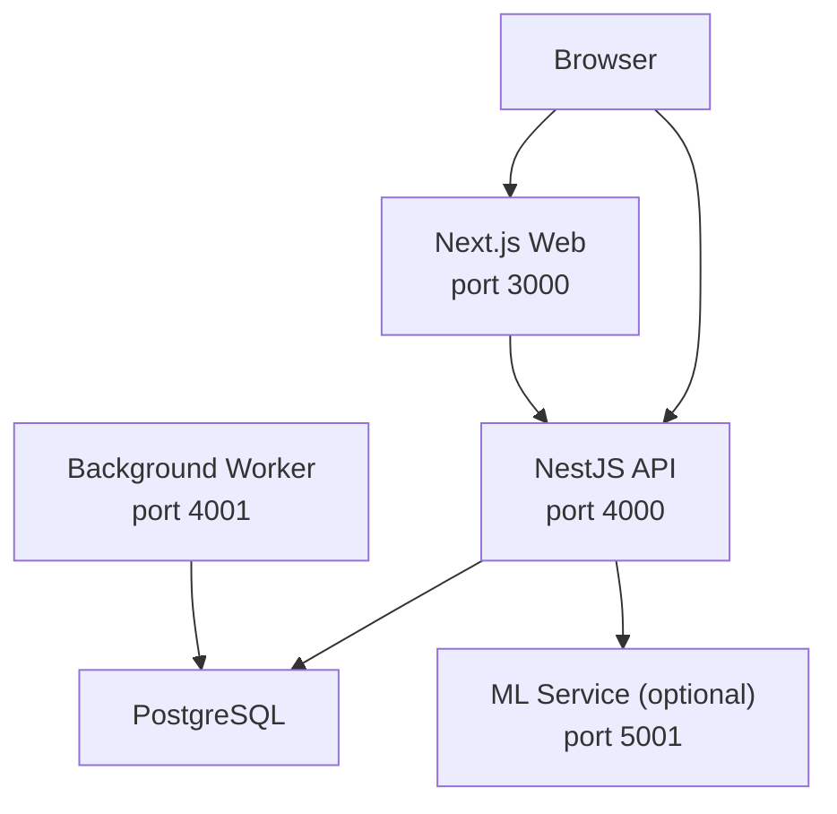
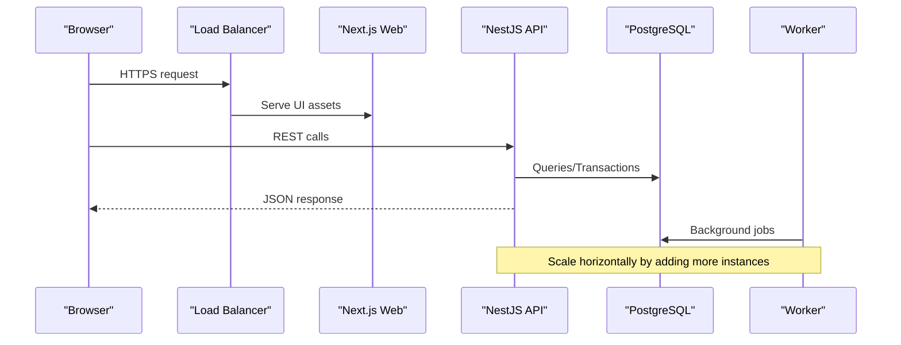
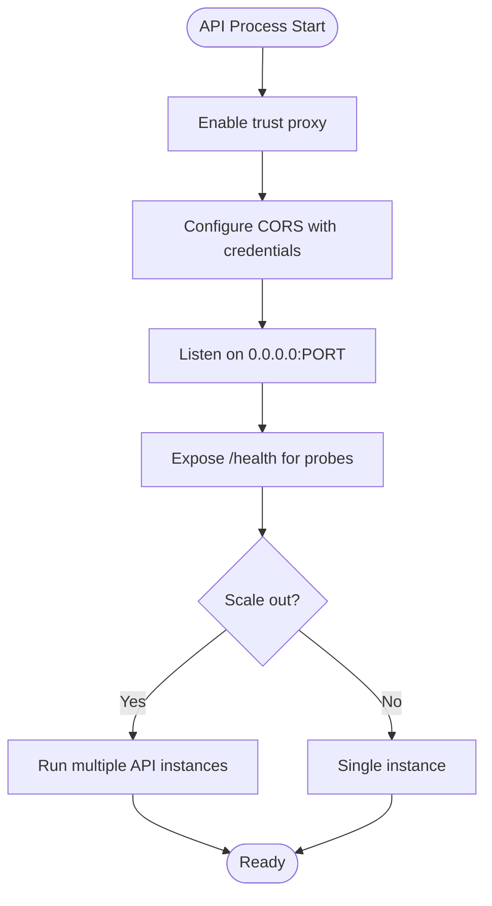
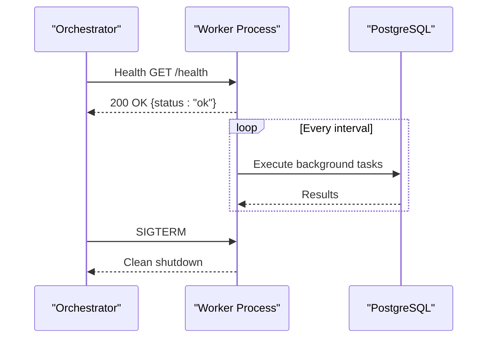
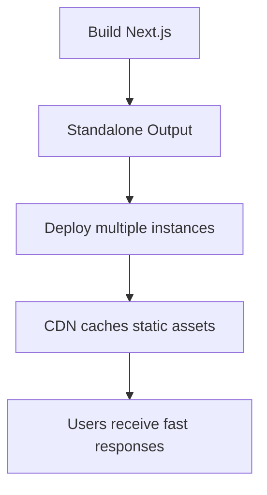
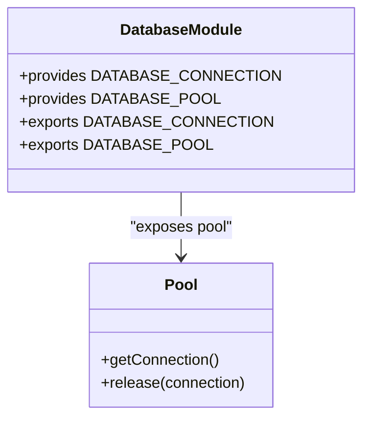
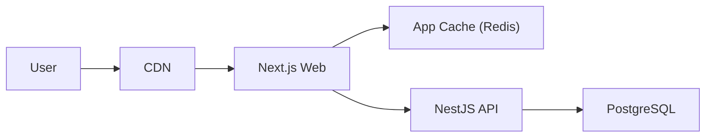
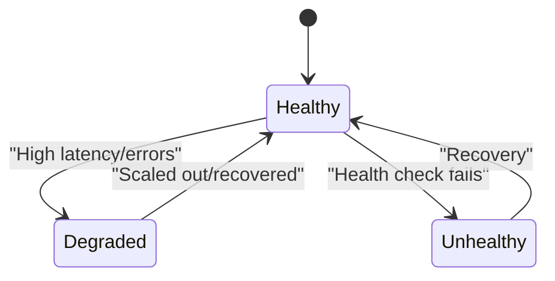
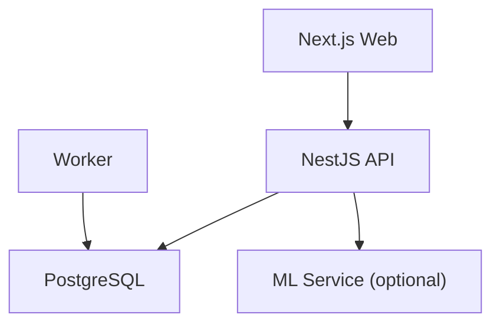

# Scaling Strategies

<cite>
**Referenced Files in This Document**
- [main.ts](file://apps/api/src/main.ts)
- [worker.ts](file://apps/api/src/worker.ts)
- [compose.yml](file://compose.yml)
- [compose.prod.yml](file://compose.prod.yml)
- [Dockerfile.api](file://docker/Dockerfile.api)
- [Dockerfile.worker](file://docker/Dockerfile.worker)
- [database.module.ts](file://apps/api/src/database/database.module.ts)
- [next.config.mjs](file://apps/web/next.config.mjs)
</cite>

## Table of Contents
1. Introduction
2. Project Structure
3. Core Components
4. Architecture Overview
5. Detailed Component Analysis
6. Dependency Analysis
7. Performance Considerations
8. Troubleshooting Guide
9. Conclusion

## Introduction
This document provides a comprehensive scaling strategy for Ananya ERP, covering horizontal and vertical scaling across API instances, web server scaling, worker process distribution, database scaling patterns (read replicas, connection pooling, sharding considerations), caching strategies, CDN integration, static asset optimization, auto-scaling policies, resource monitoring, capacity planning, and Node.js performance tuning including memory management and garbage collection.

## Project Structure
Ananya ERP is composed of:
- Next.js Web application serving the UI and client-side assets
- NestJS API service exposing REST endpoints
- Background Worker service for asynchronous tasks
- PostgreSQL database
- Optional ML service
- Docker Compose orchestration with health checks and profiles

**Diagram sources**
- [compose.yml:10-14](file://compose.yml#L10-L14)
- [compose.yml:41-72](file://compose.yml#L41-L72)
- [compose.yml:89-118](file://compose.yml#L89-L118)
- [compose.yml:120-148](file://compose.yml#L120-L148)
- [compose.yml:150-173](file://compose.yml#L150-L173)

**Section sources**
- [compose.yml:10-14](file://compose.yml#L10-L14)
- [compose.yml:41-72](file://compose.yml#L41-L72)
- [compose.yml:89-118](file://compose.yml#L89-L118)
- [compose.yml:120-148](file://compose.yml#L120-L148)
- [compose.yml:150-173](file://compose.yml#L150-L173)

## Core Components
- API service: NestJS application listening on port 4000, with CORS and trust proxy enabled for reverse proxies.
- Worker service: Headless background processor with a lightweight HTTP health endpoint on port 4001.
- Web service: Next.js app configured to output standalone artifacts and serve service worker without aggressive caching.
- Database module: Exposes shared database connection and pool from a central package.
- Orchestration: Docker Compose defines services, environment variables, health checks, and profiles.

Key configuration points:
- API trusts upstream proxies for accurate client IP resolution and enables CORS with credentials.
- Worker exposes /health for orchestrator probes and performs periodic background tasks.
- Web config disables image optimization and sets strict cache-control for the service worker.

**Section sources**
- [main.ts:12-42](file://apps/api/src/main.ts#L12-L42)
- [worker.ts:9-72](file://apps/api/src/worker.ts#L9-L72)
- [next.config.mjs:1-30](file://apps/web/next.config.mjs#L1-L30)
- [database.module.ts:1-19](file://apps/api/src/database/database.module.ts#L1-L19)

## Architecture Overview
The runtime architecture supports independent scaling of each component:
- Horizontal scaling: Multiple API and Web containers behind a load balancer; multiple Workers scaled independently.
- Vertical scaling: Increase CPU/memory per container; tune Node.js flags and database pool sizes.
- Health checks: Each service exposes a /health probe used by orchestrators.

**Diagram sources**
- [compose.yml:41-72](file://compose.yml#L41-L72)
- [compose.yml:89-118](file://compose.yml#L89-L118)
- [compose.yml:120-148](file://compose.yml#L120-L148)

## Detailed Component Analysis

### API Service Scaling
- Horizontal scaling: Run multiple API containers behind a load balancer. The API trusts upstream proxies and binds to 0.0.0.0, enabling ingress routing.
- Vertical scaling: Increase container resources; tune Node.js heap via environment or runtime flags if needed.
- Health probing: Container health check calls /health inside the container.

**Diagram sources**
- [main.ts:12-42](file://apps/api/src/main.ts#L12-L42)
- [Dockerfile.api:88-92](file://docker/Dockerfile.api#L88-L92)

**Section sources**
- [main.ts:12-42](file://apps/api/src/main.ts#L12-L42)
- [Dockerfile.api:88-92](file://docker/Dockerfile.api#L88-L92)

### Worker Process Distribution
- Independent scaling: Worker runs as a separate process with its own health endpoint on port 4001.
- Concurrency control: Environment variable WORKER_CONCURRENCY controls parallelism.
- Graceful shutdown: Handles SIGTERM/SIGINT to stop intervals and close context cleanly.

**Diagram sources**
- [worker.ts:9-72](file://apps/api/src/worker.ts#L9-L72)
- [compose.yml:89-118](file://compose.yml#L89-L118)

**Section sources**
- [worker.ts:9-72](file://apps/api/src/worker.ts#L9-L72)
- [compose.yml:89-118](file://compose.yml#L89-L118)

### Web Server Scaling
- Standalone build: Next.js outputs standalone artifacts for efficient deployment.
- Static assets: Images are unoptimized at build time; service worker has explicit no-cache headers to ensure updates propagate.
- Horizontal scaling: Deploy multiple Web instances behind a CDN/load balancer to serve static assets and SSR routes.

**Diagram sources**
- [next.config.mjs:1-30](file://apps/web/next.config.mjs#L1-L30)

**Section sources**
- [next.config.mjs:1-30](file://apps/web/next.config.mjs#L1-L30)

### Database Scaling Patterns
- Connection pooling: The API exposes both a database connection and a pool via a global module, allowing reuse of connections across requests.
- Read replicas: For read-heavy workloads, configure read-only replicas and route read queries through a pool that targets replica endpoints. Ensure write operations target the primary.
- Sharding considerations: If data grows beyond single-node capacity, consider sharding by tenant or domain key. Implement consistent hashing and cross-shard query handling where necessary.

**Diagram sources**
- [database.module.ts:1-19](file://apps/api/src/database/database.module.ts#L1-L19)

**Section sources**
- [database.module.ts:1-19](file://apps/api/src/database/database.module.ts#L1-L19)

### Caching Strategies and CDN Integration
- CDN: Place a CDN in front of the Web service to cache static assets and reduce origin load. Configure cache policies for long-lived assets and invalidate on deployments.
- Application-level caching: Introduce an in-memory cache (e.g., Redis-backed) for hot reads such as master data, session tokens, or computed results. Use cache invalidation on writes.
- Service worker: The Web config enforces no-cache for the service worker to ensure clients always fetch the latest version.

[No sources needed since this diagram shows conceptual workflow, not actual code structure]

### Auto-Scaling Policies and Resource Monitoring
- Health-based scaling: Use /health endpoints to drive readiness/liveness probes. Scale out when CPU/memory thresholds are exceeded or request latency increases.
- Profiles: Docker Compose profiles allow selective startup of optional services like ML. In production, use orchestrator-specific scaling policies (Kubernetes HPA, ECS autoscaling).
- Observability: Instrument metrics around request rates, error rates, latency percentiles, and worker throughput. Monitor database connection pool utilization and query latency.

[No sources needed since this diagram shows conceptual workflow, not actual code structure]

### Capacity Planning Guidelines
- Baseline: Measure current CPU, memory, I/O, and database metrics under typical load.
- Target SLOs: Define acceptable latency and error rate targets to guide scaling decisions.
- Right-sizing: Start with small instances and scale horizontally first; increase vertical size only when contention is proven.
- Burst handling: Plan for peak loads (e.g., month-end reporting) with temporary autoscaling or pre-warmed capacity.

[No sources needed since this section provides general guidance]

### Node.js Performance Tuning
- Heap sizing: Set appropriate --max-old-space-size based on container limits and workload characteristics.
- Garbage collection: Tune GC behavior using NODE_OPTIONS flags (e.g., --gc-global-gc-scheduling) to reduce tail latencies.
- Concurrency: Adjust worker threads and event loop pressure; monitor V8 stats and OS metrics.
- Logging: Keep structured logs minimal in hot paths; use sampling for high-volume events.

[No sources needed since this section provides general guidance]

## Dependency Analysis
Services depend on shared infrastructure and environment variables:
- API depends on PostgreSQL and optionally ML service.
- Worker depends on PostgreSQL and uses concurrency settings.
- Web depends on API via public URL and serves static assets.

**Diagram sources**
- [compose.yml:41-72](file://compose.yml#L41-L72)
- [compose.yml:89-118](file://compose.yml#L89-L118)
- [compose.yml:120-148](file://compose.yml#L120-L148)
- [compose.yml:150-173](file://compose.yml#L150-L173)

**Section sources**
- [compose.yml:41-72](file://compose.yml#L41-L72)
- [compose.yml:89-118](file://compose.yml#L89-L118)
- [compose.yml:120-148](file://compose.yml#L120-L148)
- [compose.yml:150-173](file://compose.yml#L150-L173)

## Performance Considerations
- API:
  - Enable trust proxy for correct client IPs and CORS for cross-origin requests.
  - Bind to 0.0.0.0 to support containerized deployments and load balancers.
- Worker:
  - Use WORKER_CONCURRENCY to balance throughput vs. resource usage.
  - Implement graceful shutdown to avoid dropped tasks during scaling events.
- Web:
  - Use standalone output for faster cold starts and smaller images.
  - Enforce service worker cache policy to prevent stale updates.
- Database:
  - Reuse pooled connections to reduce overhead.
  - Monitor slow queries and adjust indexes accordingly.

**Section sources**
- [main.ts:12-42](file://apps/api/src/main.ts#L12-L42)
- [worker.ts:9-72](file://apps/api/src/worker.ts#L9-L72)
- [next.config.mjs:1-30](file://apps/web/next.config.mjs#L1-L30)
- [database.module.ts:1-19](file://apps/api/src/database/database.module.ts#L1-L19)

## Troubleshooting Guide
- Health checks:
  - API: Verify /health returns success inside the container.
  - Worker: Verify /health on port 4001 responds with status ok.
  - Web: Verify /api/health responds correctly.
- Common issues:
  - CORS errors: Ensure CORS_ORIGIN includes the frontend origin and credentials are allowed.
  - Proxy misconfiguration: Confirm upstream reverse proxy sets trust proxy so client IPs are resolved correctly.
  - Worker stalls: Check background task intervals and graceful shutdown handlers.
  - Database connectivity: Validate DATABASE_URL and pool availability.

**Section sources**
- [compose.yml:61-72](file://compose.yml#L61-L72)
- [compose.yml:107-118](file://compose.yml#L107-L118)
- [compose.yml:137-148](file://compose.yml#L137-L148)
- [main.ts:15-26](file://apps/api/src/main.ts#L15-L26)
- [worker.ts:18-42](file://apps/api/src/worker.ts#L18-L42)

## Conclusion
Ananya ERP’s architecture supports robust horizontal and vertical scaling through independent services, health-checked containers, and clear separation of concerns. By scaling API and Web instances horizontally, distributing worker processes, optimizing database connections, leveraging caching and CDNs, and applying Node.js performance tuning, the system can meet growing demand while maintaining reliability and responsiveness. Continuous monitoring and capacity planning ensure sustainable growth and operational stability.