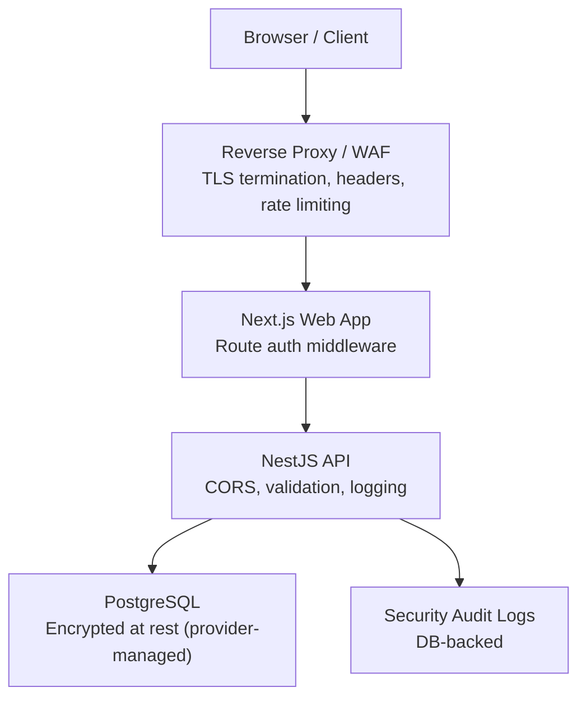
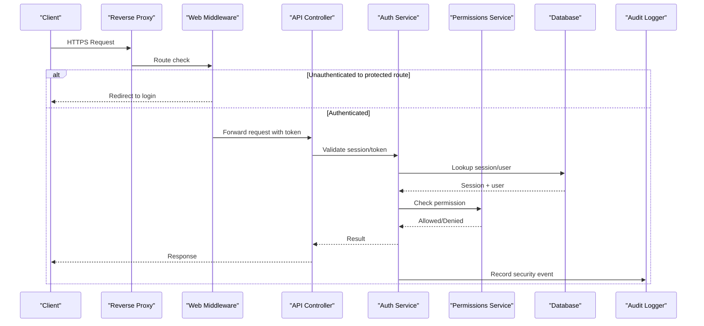
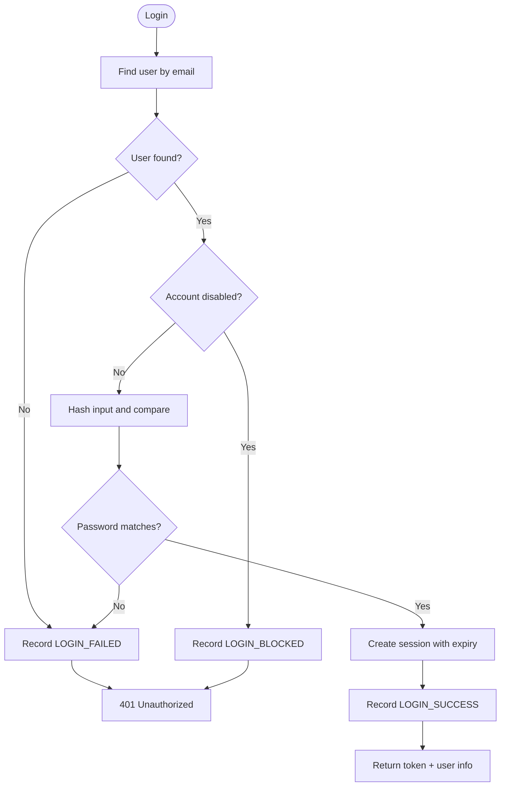
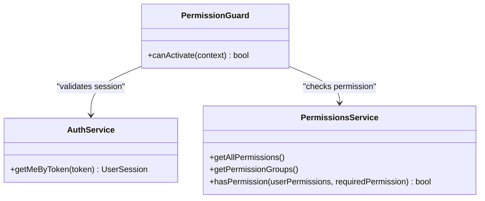
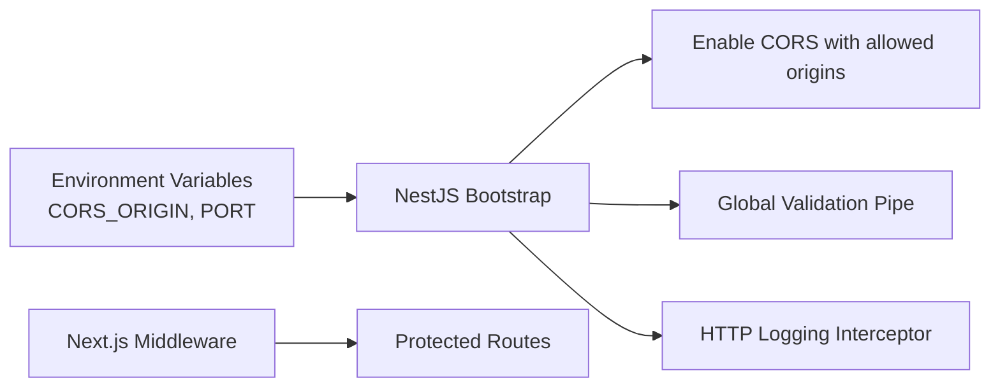
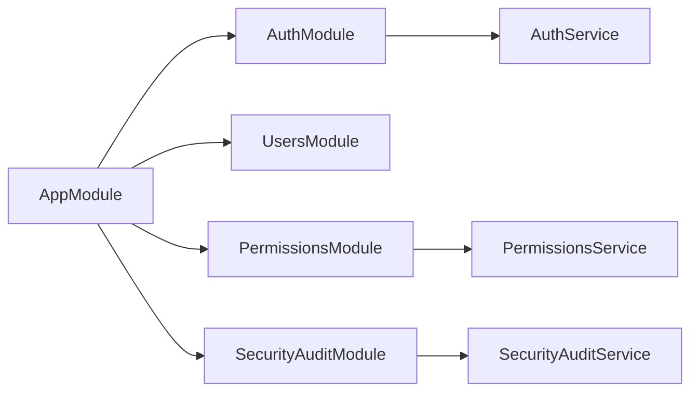

# Security Hardening

<cite>
**Referenced Files in This Document**
- [SECURITY.md](file://SECURITY.md)
- [main.ts](file://apps/api/src/main.ts)
- [app.module.ts](file://apps/api/src/app.module.ts)
- [auth.controller.ts](file://apps/api/src/auth/auth.controller.ts)
- [auth.service.ts](file://apps/api/src/auth/auth.service.ts)
- [permission.guard.ts](file://apps/api/src/auth/permission.guard.ts)
- [permissions.service.ts](file://apps/api/src/permissions/permissions.service.ts)
- [security-audit.service.ts](file://apps/api/src/security-audit/security-audit.service.ts)
- [http-logging.interceptor.ts](file://apps/api/src/common/logging/http-logging.interceptor.ts)
- [client-ip.util.ts](file://apps/api/src/common/utils/client-ip.util.ts)
- [middleware.ts](file://apps/web/middleware.ts)
- [Dockerfile.api](file://docker/Dockerfile.api)
- [compose.prod.yml](file://compose.prod.yml)
- [drizzle.config.ts](file://packages/database/drizzle.config.ts)
</cite>

## Table of Contents
1. Introduction
2. Project Structure
3. Core Components
4. Architecture Overview
5. Detailed Component Analysis
6. Dependency Analysis
7. Performance Considerations
8. Troubleshooting Guide
9. Conclusion
10. Appendices

## Introduction
This document provides production security hardening guidance for Ananya ERP, grounded in the repository’s implementation. It covers network exposure and reverse proxy posture, authentication and authorization controls, session management, CORS configuration, audit logging, container runtime hardening, database connectivity, secret handling, vulnerability scanning, monitoring, and a practical security checklist with common pitfalls to avoid.

## Project Structure
Ananya is a multi-service monorepo:
- API service (NestJS) exposes REST endpoints, enforces authentication/authorization, logs requests, and persists security audit events.
- Web application (Next.js) enforces route-level access control via middleware and delegates API calls to a public API endpoint.
- ML and worker services are optional or background components.
- Production images are defined with hardened Dockerfiles and orchestrated via Compose overrides.

**Diagram sources**
- [main.ts:18-26](file://apps/api/src/main.ts#L18-L26)
- [middleware.ts:14-49](file://apps/web/middleware.ts#L14-L49)
- [http-logging.interceptor.ts:22-74](file://apps/api/src/common/logging/http-logging.interceptor.ts#L22-L74)
- [drizzle.config.ts:16-23](file://packages/database/drizzle.config.ts#L16-L23)

**Section sources**
- [compose.prod.yml:22-47](file://compose.prod.yml#L22-L47)
- [Dockerfile.api:64-92](file://docker/Dockerfile.api#L64-L92)

## Core Components
- Authentication and sessions: Session-based tokens stored in the database with expiry and revocation support; login flow records IP and user agent; password reset flows use short-lived tokens.
- Authorization: Permission codes grouped by domain; role-to-permission mapping; reusable guard factory validates sessions and permissions per request.
- CORS and request validation: CORS origin list from environment; global validation pipe whitelists inputs.
- Audit and logging: Structured HTTP access/error logs with request IDs; security audit events persisted for login/logout/password changes/session revocations.
- Container hardening: Multi-stage build, non-root user, health checks, minimal base image.

**Section sources**
- [auth.controller.ts:34-71](file://apps/api/src/auth/auth.controller.ts#L34-L71)
- [auth.service.ts:37-138](file://apps/api/src/auth/auth.service.ts#L37-L138)
- [auth.service.ts:186-284](file://apps/api/src/auth/auth.service.ts#L186-L284)
- [permission.guard.ts:67-149](file://apps/api/src/auth/permission.guard.ts#L67-L149)
- [permissions.service.ts:15-212](file://apps/api/src/permissions/permissions.service.ts#L15-L212)
- [main.ts:18-36](file://apps/api/src/main.ts#L18-L36)
- [http-logging.interceptor.ts:22-74](file://apps/api/src/common/logging/http-logging.interceptor.ts#L22-L74)
- [security-audit.service.ts:17-36](file://apps/api/src/security-audit/security-audit.service.ts#L17-L36)
- [Dockerfile.api:64-92](file://docker/Dockerfile.api#L64-L92)

## Architecture Overview
The API runs behind a reverse proxy that terminates TLS and forwards trusted client IPs. The web app protects routes via middleware and calls the API using bearer tokens. All sensitive operations are audited and logged with structured fields for observability.

**Diagram sources**
- [middleware.ts:14-49](file://apps/web/middleware.ts#L14-L49)
- [auth.controller.ts:34-71](file://apps/api/src/auth/auth.controller.ts#L34-L71)
- [auth.service.ts:164-184](file://apps/api/src/auth/auth.service.ts#L164-L184)
- [permission.guard.ts:78-139](file://apps/api/src/auth/permission.guard.ts#L78-L139)
- [security-audit.service.ts:17-36](file://apps/api/src/security-audit/security-audit.service.ts#L17-L36)

## Detailed Component Analysis

### Authentication and Session Management
- Login captures client IP and user agent, verifies credentials, creates a session token with expiry, updates last login, and records a successful login event.
- Logout revokes the session and records logout.
- Password change validates current password and updates the hash; records the change.
- Password reset issues a time-limited token and marks it used after reset.
- Token extraction supports Bearer header parsing in guards.

**Diagram sources**
- [auth.controller.ts:34-39](file://apps/api/src/auth/auth.controller.ts#L34-L39)
- [auth.service.ts:37-138](file://apps/api/src/auth/auth.service.ts#L37-L138)
- [security-audit.service.ts:17-36](file://apps/api/src/security-audit/security-audit.service.ts#L17-L36)

**Section sources**
- [auth.controller.ts:34-71](file://apps/api/src/auth/auth.controller.ts#L34-L71)
- [auth.service.ts:37-138](file://apps/api/src/auth/auth.service.ts#L37-L138)
- [auth.service.ts:186-284](file://apps/api/src/auth/auth.service.ts#L186-L284)
- [permission.guard.ts:32-40](file://apps/api/src/auth/permission.guard.ts#L32-L40)

### Authorization and Permissions
- Permission codes are grouped by domain and mapped to system roles.
- A reusable guard validates sessions and enforces required permissions per route, returning 401 for invalid sessions and 403 for insufficient permissions.
- Domain-scoped wildcard permissions are supported.

**Diagram sources**
- [permissions.service.ts:214-248](file://apps/api/src/permissions/permissions.service.ts#L214-L248)
- [permission.guard.ts:67-149](file://apps/api/src/auth/permission.guard.ts#L67-L149)
- [auth.service.ts:164-184](file://apps/api/src/auth/auth.service.ts#L164-L184)

**Section sources**
- [permissions.service.ts:15-212](file://apps/api/src/permissions/permissions.service.ts#L15-L212)
- [permission.guard.ts:67-149](file://apps/api/src/auth/permission.guard.ts#L67-L149)

### Network Exposure, CORS, and Reverse Proxy Posture
- Trusts upstream proxies for accurate client IP resolution.
- Configures CORS origins from an environment variable; supports multiple origins and credentials.
- Enables global validation with whitelist enforcement to reject unknown fields.
- Web middleware restricts access to protected routes and redirects unauthenticated users.

**Diagram sources**
- [main.ts:15-36](file://apps/api/src/main.ts#L15-L36)
- [middleware.ts:14-49](file://apps/web/middleware.ts#L14-L49)

**Section sources**
- [main.ts:15-36](file://apps/api/src/main.ts#L15-L36)
- [middleware.ts:14-49](file://apps/web/middleware.ts#L14-L49)

### SSL/TLS Termination and Secure Headers
- TLS termination is expected at the reverse proxy/WAF layer; ensure strong cipher suites, HSTS, and secure cookie flags are configured there.
- Add security headers at the reverse proxy (e.g., X-Content-Type-Options, Referrer-Policy, Content-Security-Policy).
- The API sets a per-request ID header for traceability.

**Section sources**
- [http-logging.interceptor.ts:30-38](file://apps/api/src/common/logging/http-logging.interceptor.ts#L30-L38)

### CORS Policies
- Configure CORS_ORIGIN to a strict allowlist of trusted origins; avoid wildcards in production.
- Credentials are enabled; ensure cookies are handled securely on the client side.

**Section sources**
- [main.ts:18-26](file://apps/api/src/main.ts#L18-L26)

### Database Security and Encryption
- Database connection URL is loaded from environment variables; ensure DATABASE_URL uses TLS and least-privilege credentials.
- Prefer provider-managed encryption at rest and enable private networking between API and database.
- Migrations run as part of the build/runtime pipeline; ensure migration artifacts are included in images.

**Section sources**
- [drizzle.config.ts:16-23](file://packages/database/drizzle.config.ts#L16-L23)

### Secret Management Practices
- Environment variables drive configuration (e.g., CORS_ORIGIN, DATABASE_URL, API_PUBLIC_URL).
- Use platform secret stores (e.g., Kubernetes Secrets, cloud secret managers) to inject env vars at runtime; never commit secrets to source control.
- Pin container images by version tags to reduce supply chain risk.

**Section sources**
- [compose.prod.yml:22-47](file://compose.prod.yml#L22-L47)
- [main.ts:18-26](file://apps/api/src/main.ts#L18-L26)
- [drizzle.config.ts:12-23](file://packages/database/drizzle.config.ts#L12-L23)

### Vulnerability Scanning and Supply Chain Hardening
- Use multi-stage builds to minimize attack surface and remove dev dependencies and source files from final images.
- Run non-root containers to limit privilege escalation.
- Integrate image scanning in CI/CD and enforce policies before deployment.

**Section sources**
- [Dockerfile.api:6-92](file://docker/Dockerfile.api#L6-L92)

### Security Monitoring and Audit Logging
- HTTP access and error logs include method, route, status code, duration, client IP, user agent, and request ID.
- Security audit events capture login attempts, logouts, password changes, and session revocations with contextual details.
- Centralize logs in a SIEM or log aggregation system and set alerts for anomalous patterns.

**Section sources**
- [http-logging.interceptor.ts:22-74](file://apps/api/src/common/logging/http-logging.interceptor.ts#L22-L74)
- [security-audit.service.ts:17-55](file://apps/api/src/security-audit/security-audit.service.ts#L17-L55)
- [auth.service.ts:37-138](file://apps/api/src/auth/auth.service.ts#L37-L138)
- [auth.service.ts:186-284](file://apps/api/src/auth/auth.service.ts#L186-L284)

### Access Control Mechanisms
- Web middleware enforces route-level authentication and redirects unauthenticated users.
- API guards validate sessions and enforce fine-grained permissions per action.
- Role-to-permission mappings provide least-privilege defaults for built-in roles.

**Section sources**
- [middleware.ts:14-49](file://apps/web/middleware.ts#L14-L49)
- [permission.guard.ts:67-149](file://apps/api/src/auth/permission.guard.ts#L67-L149)
- [permissions.service.ts:173-212](file://apps/api/src/permissions/permissions.service.ts#L173-L212)

## Dependency Analysis
The API module composes many feature modules and registers global middleware, pipes, and filters. Authentication and authorization depend on shared services for users, permissions, and audit logging.

**Diagram sources**
- [app.module.ts:83-169](file://apps/api/src/app.module.ts#L83-L169)

**Section sources**
- [app.module.ts:83-169](file://apps/api/src/app.module.ts#L83-L169)

## Performance Considerations
- Keep CORS lists minimal to reduce overhead.
- Avoid excessive logging in high-throughput paths; tune access/error logging via environment flags.
- Ensure database connections are pooled and encrypted to reduce latency and protect data in transit.

[No sources needed since this section provides general guidance]

## Troubleshooting Guide
- If clients cannot reach the API, verify CORS_ORIGIN includes the web origin and that the reverse proxy forwards the correct host and headers.
- For authentication failures, inspect HTTP logs for 401 responses and security audit logs for LOGIN_FAILED events.
- For authorization denials, confirm the user’s permissions include the required code and that the guard is applied to the route.
- For session issues, check session expiry and revocation state in the database.

**Section sources**
- [http-logging.interceptor.ts:22-74](file://apps/api/src/common/logging/http-logging.interceptor.ts#L22-L74)
- [auth.service.ts:164-184](file://apps/api/src/auth/auth.service.ts#L164-L184)
- [permission.guard.ts:78-139](file://apps/api/src/auth/permission.guard.ts#L78-L139)

## Conclusion
Ananya ERP implements robust authentication, authorization, auditing, and logging mechanisms suitable for production when combined with proper network segmentation, TLS termination at the edge, strict CORS policies, and hardened container deployments. Follow the checklist below to ensure a secure baseline and continuously monitor for anomalies.

[No sources needed since this section summarizes without analyzing specific files]

## Appendices

### Security Checklist
- Network and Edge
  - Terminate TLS at reverse proxy/WAF with modern ciphers and HSTS.
  - Restrict inbound traffic to only necessary ports; block direct database access from the internet.
  - Enable rate limiting and bot protection at the edge.
- Application
  - Set CORS_ORIGIN to explicit allowlist; disable wildcard origins.
  - Enforce global input validation and reject unknown fields.
  - Apply permission guards to all mutating endpoints.
  - Use least-privilege roles and review custom roles regularly.
- Sessions and Tokens
  - Enforce session expiry; revoke sessions on logout and suspicious activity.
  - Store tokens server-side with revocation tracking; do not rely solely on client storage.
- Data and Secrets
  - Encrypt database at rest via provider settings; use TLS for connections.
  - Manage secrets via platform secret stores; never commit .env files.
  - Pin container images to specific versions/tags.
- Observability
  - Centralize HTTP logs and security audit logs; set alerts for failed logins and admin actions.
  - Include request IDs in logs and correlate across services.
- Supply Chain
  - Scan images and dependencies in CI/CD; fail builds on critical vulnerabilities.
  - Remove dev dependencies and source files from production images.

[No sources needed since this section provides general guidance]

### Common Security Pitfalls to Avoid
- Using wildcard CORS origins or enabling credentials with permissive origins.
- Exposing internal services directly; always place them behind a reverse proxy.
- Storing secrets in source control or default environment files.
- Skipping TLS for database connections or using overly broad database accounts.
- Relying on client-side checks for authorization; always enforce server-side guards.
- Not rotating or expiring tokens and reset links; ensure short lifetimes and single-use semantics.
- Ignoring audit logs and failing to alert on anomalous activity.

[No sources needed since this section provides general guidance]

### Reporting a Vulnerability
Follow responsible disclosure practices outlined in the project’s security policy.

**Section sources**
- [SECURITY.md:1-35](file://SECURITY.md#L1-L35)