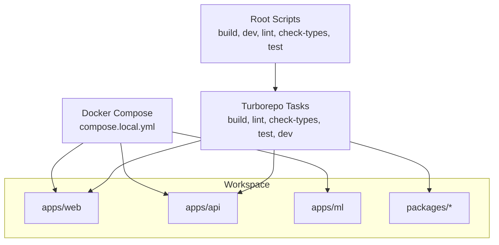
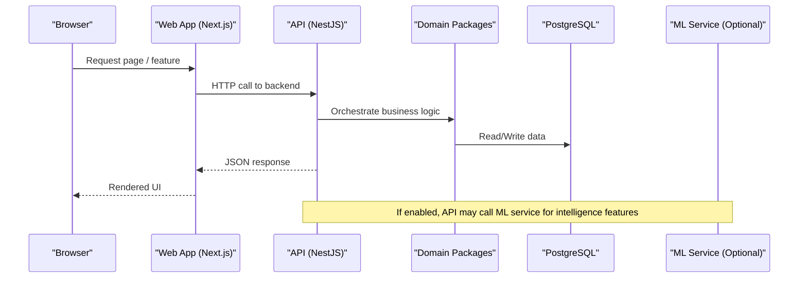
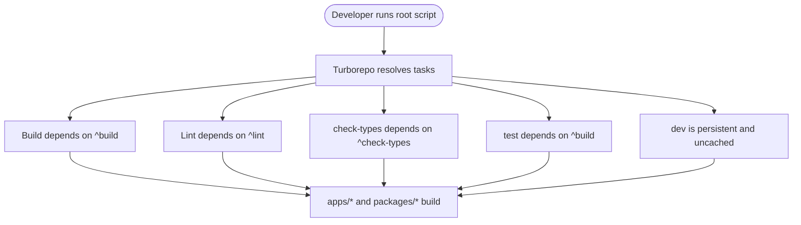
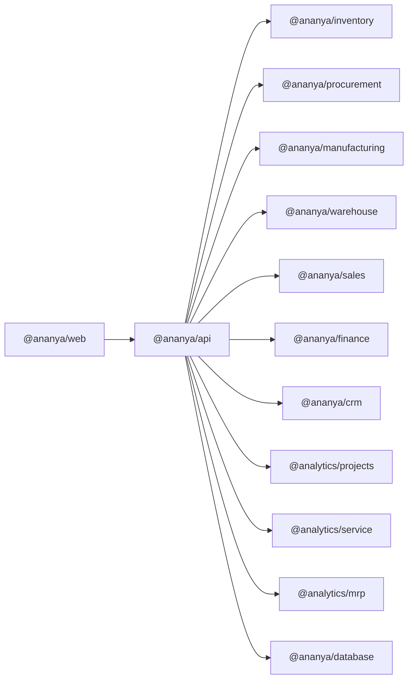

# Development Guide

<cite>
**Referenced Files in This Document**
- [README.md](file://README.md)
- [CONTRIBUTING.md](file://CONTRIBUTING.md)
- [package.json](file://package.json)
- [turbo.json](file://turbo.json)
- [pnpm-workspace.yaml](file://pnpm-workspace.yaml)
- [LOCAL_DEVELOPMENT.md](file://docs/development/LOCAL_DEVELOPMENT.md)
- [SETUP.md](file://docs/development/SETUP.md)
- [CODING_STANDARDS.md](file://docs/standards/CODING_STANDARDS.md)
- [PR_REVIEW_CHECKLIST.md](file://docs/standards/PR_REVIEW_CHECKLIST.md)
- [NEW_MODULE.md](file://docs/standards/NEW_MODULE.md)
- [NEW_PACKAGE.md](file://docs/standards/NEW_PACKAGE.md)
- [PULL_REQUEST_TEMPLATE.md](file://.github/PULL_REQUEST_TEMPLATE.md)
- [apps/web/package.json](file://apps/web/package.json)
- [apps/api/package.json](file://apps/api/package.json)
- [packages/database/package.json](file://packages/database/package.json)
- [compose.local.yml](file://compose.local.yml)
</cite>

## Table of Contents
1. Introduction
2. Project Structure
3. Core Components
4. Architecture Overview
5. Detailed Component Analysis
6. Dependency Analysis
7. Performance Considerations
8. Troubleshooting Guide
9. Conclusion
10. Appendices

## Introduction
This guide helps you set up a local development environment for Ananya ERP, understand the monorepo structure powered by Turborepo and pnpm, follow coding standards and contribution workflows, and efficiently add features or fix issues. It also covers Git best practices, branching strategies, and release processes aligned with the repository’s quality gates and CI expectations.

Ananya is a modular monolith with:
- A Next.js web application (apps/web)
- A NestJS API and worker (apps/api)
- A Python ML service (apps/ml)
- Shared domain packages under packages/*
- PostgreSQL as the database with Drizzle schema and migrations

The root scripts orchestrate building, linting, type checking, testing, and end-to-end tests across the workspace using Turborepo.

**Section sources**
- [README.md:191-262](file://README.md#L191-L262)
- [package.json:5-26](file://package.json#L5-L26)

## Project Structure
Ananya uses a pnpm workspace with apps and packages directories. Turboreho defines tasks that run consistently across all workspaces.

Key elements:
- Workspace definition: apps/* and packages/* are included via pnpm-workspace.yaml
- Root scripts: build, dev, lint, check-types, test, db commands, e2e tests
- Turborepo tasks: build depends on upstream builds; lint and check-types depend on upstream; test depends on build; dev is persistent and uncached
- Local compose overrides: compose.local.yml builds Dockerfiles locally for api, migrate, worker, web, ml

**Diagram sources**
- [pnpm-workspace.yaml:1-4](file://pnpm-workspace.yaml#L1-L4)
- [turbo.json:17-51](file://turbo.json#L17-L51)
- [compose.local.yml:12-42](file://compose.local.yml#L12-L42)

**Section sources**
- [pnpm-workspace.yaml:1-4](file://pnpm-workspace.yaml#L1-L4)
- [turbo.json:1-53](file://turbo.json#L1-L53)
- [compose.local.yml:1-44](file://compose.local.yml#L1-L44)

## Core Components
- Web app (Next.js): Provides UI, pages, components, and client-side logic. Runs on port 3000 locally.
- API (NestJS): REST endpoints, services, repositories, and worker entrypoint. Runs on port 4000 locally.
- Database package: Drizzle schema, migrations, and query helpers exposed to other packages.
- Domain packages: Business modules (inventory, procurement, manufacturing, warehouse, sales, finance, CRM, projects, service, mrp).
- ML service (Python/FastAPI): Optional component intelligence; degrades gracefully if unavailable.

Development workflow highlights:
- Start DB with Compose, run migrations, then start dev servers via root script
- Use pnpm filters to run per-package tasks
- Quality gates: check-types, lint, build must pass before PRs

**Section sources**
- [apps/web/package.json:7-13](file://apps/web/package.json#L7-L13)
- [apps/api/package.json:8-19](file://apps/api/package.json#L8-L19)
- [packages/database/package.json:35-45](file://packages/database/package.json#L35-L45)
- [LOCAL_DEVELOPMENT.md:14-22](file://docs/development/LOCAL_DEVELOPMENT.md#L14-L22)
- [LOCAL_DEVELOPMENT.md:49-63](file://docs/development/LOCAL_DEVELOPMENT.md#L49-L63)
- [README.md:191-262](file://README.md#L191-L262)

## Architecture Overview
High-level flow: Browser -> Web (Next.js) -> API (NestJS) -> Domain Packages -> PostgreSQL. Worker runs separately from API and performs background tasks. ML service is optional and integrated into the API layer when available.

**Diagram sources**
- [README.md:275-297](file://README.md#L275-L297)
- [apps/api/package.json:21-32](file://apps/api/package.json#L21-L32)
- [apps/web/package.json:15-40](file://apps/web/package.json#L15-L40)

## Detailed Component Analysis

### Monorepo and Task Orchestration (Turborepo + pnpm)
- pnpm workspace includes apps/* and packages/*
- Root scripts delegate to Turborejo tasks
- Turborepo config defines task dependencies and caching behavior
- Dev tasks are persistent and uncached for live reload

**Diagram sources**
- [turbo.json:17-51](file://turbo.json#L17-L51)
- [package.json:5-26](file://package.json#L5-L26)

**Section sources**
- [turbo.json:1-53](file://turbo.json#L1-L53)
- [package.json:5-26](file://package.json#L5-L26)
- [pnpm-workspace.yaml:1-4](file://pnpm-workspace.yaml#L1-L4)

### Web Application (Next.js)
- Scripts: dev (port 3000), build, start, lint, check-types, test
- Dependencies include internal workspace packages and UI libraries
- Uses TypeScript and modern React tooling

Practical tips:
- Run dev server with hot reload
- Use check-types to catch TS errors early
- Lint enforces zero warnings

**Section sources**
- [apps/web/package.json:7-13](file://apps/web/package.json#L7-L13)
- [apps/web/package.json:15-40](file://apps/web/package.json#L15-L40)

### API Application (NestJS)
- Scripts: build, dev (watch), start, start:worker, lint, check-types, test suites
- Depends on multiple domain packages (inventory, procurement, manufacturing, etc.)
- Jest configured for unit tests and coverage

Practical tips:
- Use dev mode for fast iteration
- Run worker separately for background jobs
- Ensure DTO validation and thin controllers per standards

**Section sources**
- [apps/api/package.json:8-19](file://apps/api/package.json#L8-L19)
- [apps/api/package.json:21-32](file://apps/api/package.json#L21-L32)
- [apps/api/package.json:68-84](file://apps/api/package.json#L68-L84)

### Database Package (Drizzle + PostgreSQL)
- Exposes schema, query helpers, and migration entrypoints
- Scripts: generate, push, migrate, setup, bootstrap, studio, check
- Used by API and other packages for consistent data access

Practical tips:
- Generate migrations after schema changes
- Push schema to local DB for rapid iteration
- Use studio for visual inspection

**Section sources**
- [packages/database/package.json:7-23](file://packages/database/package.json#L7-L23)
- [packages/database/package.json:35-45](file://packages/database/package.json#L35-L45)

### Local Docker Testing
- compose.local.yml overrides build directives to use local Dockerfiles
- Useful for validating production images locally without pulling from GHCR
- Ensures API, migrate, worker, web, and ML services can be built and tested end-to-end

**Section sources**
- [compose.local.yml:1-44](file://compose.local.yml#L1-L44)

## Dependency Analysis
- The API depends on many domain packages, centralizing business logic reuse
- The Web app consumes internal packages for shared functionality
- The database package provides typed schema and migration utilities consumed by API
- Turborepo ensures correct dependency ordering during builds and tests

**Diagram sources**
- [apps/api/package.json:21-32](file://apps/api/package.json#L21-L32)
- [apps/web/package.json:15-40](file://apps/web/package.json#L15-L40)
- [packages/database/package.json:7-23](file://packages/database/package.json#L7-L23)

**Section sources**
- [apps/api/package.json:21-32](file://apps/api/package.json#L21-L32)
- [apps/web/package.json:15-40](file://apps/web/package.json#L15-L40)
- [packages/database/package.json:7-23](file://packages/database/package.json#L7-L23)

## Performance Considerations
- Use Turborepo caching for faster builds and tests; avoid disabling cache unless necessary
- Keep dev tasks persistent to leverage incremental compilation
- Prefer filtering pnpm commands to specific packages for faster feedback loops
- Avoid heavy synchronous operations in request handlers; offload to worker where appropriate
- Validate DTOs at the controller boundary to minimize downstream processing costs

[No sources needed since this section provides general guidance]

## Troubleshooting Guide
Common issues and resolutions:
- Database connection errors: ensure PostgreSQL is running and DATABASE_URL points to localhost:5432
- Port conflicts: verify ports 3000 (web), 4000 (api), and 4001 (worker health) are free
- Type errors: run check-types to surface TS issues early
- Lint errors: run lint to enforce style and catch issues
- ML service not reachable: API degrades gracefully; confirm ML health endpoint if needed

Useful commands:
- Start DB: docker compose -f compose.yml -f compose.local.yml up -d db
- Run migrations: DATABASE_URL=... pnpm db:migrate
- Start dev: pnpm dev
- Run tests: pnpm test, pnpm test:e2e

**Section sources**
- [LOCAL_DEVELOPMENT.md:111-117](file://docs/development/LOCAL_DEVELOPMENT.md#L111-L117)
- [LOCAL_DEVELOPMENT.md:14-22](file://docs/development/LOCAL_DEVELOPMENT.md#L14-L22)
- [README.md:162-189](file://README.md#L162-L189)

## Conclusion
Ananya’s development experience centers around a well-structured monorepo with clear boundaries, robust tooling, and strong quality gates. By following the setup steps, adhering to coding standards, and using the provided scripts and workflows, contributors can efficiently develop, test, and ship changes while maintaining consistency across the platform.

[No sources needed since this section summarizes without analyzing specific files]

## Appendices

### Local Development Setup
- Install Node.js and pnpm as specified
- Clone repo, install dependencies, configure .env
- Start DB with Compose, run migrations, then start dev servers
- For ML service, either run via Compose or native Python venv

**Section sources**
- [SETUP.md:5-55](file://docs/development/SETUP.md#L5-L55)
- [LOCAL_DEVELOPMENT.md:14-22](file://docs/development/LOCAL_DEVELOPMENT.md#L14-L22)
- [LOCAL_DEVELOPMENT.md:65-98](file://docs/development/LOCAL_DEVELOPMENT.md#L65-L98)

### Coding Standards
- TypeScript strictness, explicit typing, interfaces, discriminated unions
- File organization, import hygiene, no circular dependencies
- DTO validation with class-validator decorators
- Inline comments and JSDoc for public APIs
- Comprehensive testing patterns and coverage goals

**Section sources**
- [CODING_STANDARDS.md:5-99](file://docs/standards/CODING_STANDARDS.md#L5-L99)

### Contribution Workflow and Pull Requests
- Implement -> check-types -> lint -> build -> PR Review Checklist -> Open PR
- PR template requires description, type of change, testing details, and checklist
- Maintain buildable state and pass quality gates before opening PRs

**Section sources**
- [CONTRIBUTING.md:11-67](file://CONTRIBUTING.md#L11-L67)
- [PULL_REQUEST_TEMPLATE.md:1-29](file://.github/PULL_REQUEST_TEMPLATE.md#L1-L29)

### New Module and New Package Guidelines
- New module checklist: domain model, repository interface, use cases, DTOs, controller, tests, error mapping
- New package checklist: workspace registration, package.json, TypeScript config extension, lint/build/test passes, public API review, documentation updates

**Section sources**
- [NEW_MODULE.md:1-10](file://docs/standards/NEW_MODULE.md#L1-L10)
- [NEW_PACKAGE.md:1-32](file://docs/standards/NEW_PACKAGE.md#L1-L32)

### Git Workflow Best Practices and Branching Strategy
- Create feature branches scoped to single logical changes
- Keep commits focused and descriptive
- Rebase or merge strategy should preserve linear history and avoid noisy merges
- Ensure all quality gates pass before requesting reviews

[No sources needed since this section provides general guidance]

### Release Processes
- Use root scripts to build and validate artifacts
- For production-like testing, build Dockerfiles locally with compose.local.yml
- Apply migrations and verify health endpoints before promoting releases

**Section sources**
- [compose.local.yml:1-44](file://compose.local.yml#L1-L44)
- [README.md:264-273](file://README.md#L264-L273)

### IDE Configuration and Productivity Tools
- Enable TypeScript strict mode and ESLint integration
- Configure Prettier for formatting
- Use Turborepo TUI for task visibility
- Leverage pnpm filters for targeted development

[No sources needed since this section provides general guidance]